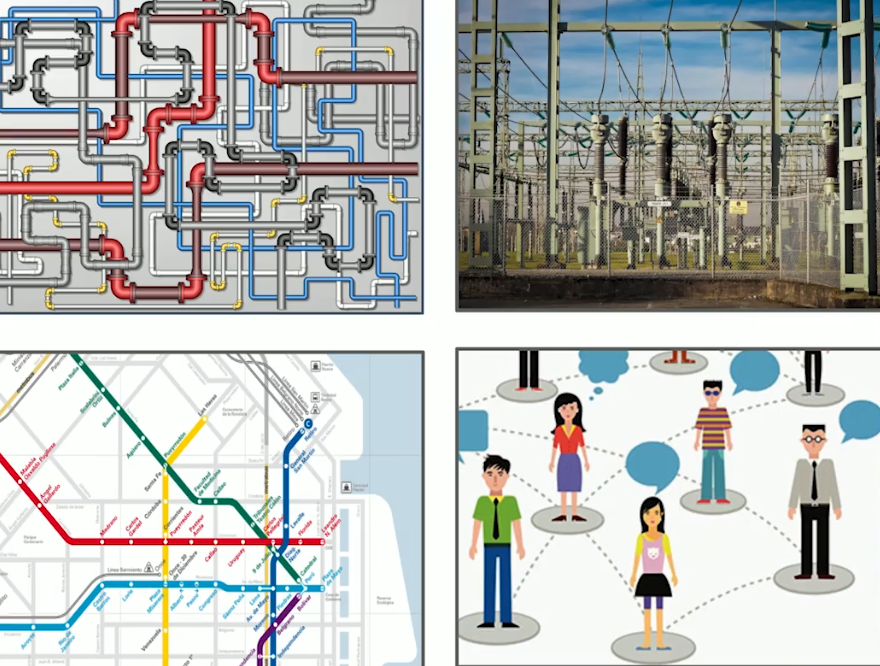
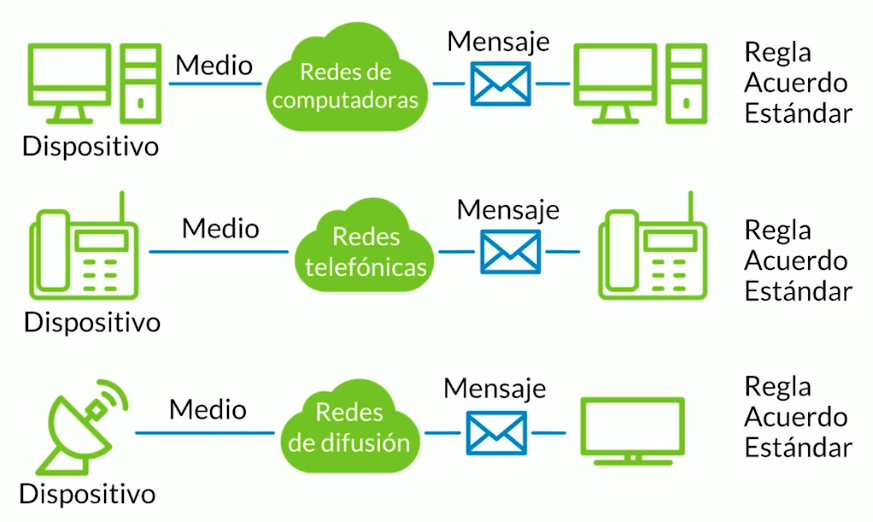

[Curso de Redes de Internet 1277](https://platzi.com/cursos/redes)

# Introducción al Curso de Redes de Internet [2023]

## 0010. Bienvenidos al Curso de Redes de Internet [11148](https://platzi.com/clases/1277-redes/11148-bienvenidos-al-curso-de-redes-de-internet/)

### Descripción:

Hola bienvenidos al **Curso de Redes de Internet**

En este curso vamos a hablar sobre cómo internet ha cambiado la forma en la que nos comunicamos. Además, vamos a ver cómo la economía y la política han cambiado gracias a las redes de internet. Hoy en día podemos comunicarnos sin importar en dónde nos encontramos. En este curso vamos a ver:

* Cómo funciona la comunicación en redes
* Modelos de referencia OSI y TCP/IP
* Diseño de redes y configuración

### Comentarios:

* **dbzdavidbaez** (5) [802380](https://platzi.com/comentario/802380/) 

	A recordar REDES… se ve muy interesante

* **edwar enrique vilchez serrano** (4) [724162](https://platzi.com/comentario/724162/) 

	Buenos días Sres Platzi, planteo la siguiente situación dentro del examen hay un par de preguntas que por mas que lo intento no logro responder correctamente
	
	Pregunta Que representa la imagen tenemos las opciones (aqui se muestran un servidor y una pc conectados a un bus, luego se muestran tres pc´s conectados a otro bus, a su vez ambos segmentos de red estan conectados por un router y con acceso a la Internet)
	
	
	
	La topología física de una Red  
	La topología lógica de una Red  
	No Representa nada  
	Una red WAN  
	En esta pregunta me he paseado por todas las posibles respuestas y no he logrado superar la pregunta
	
	La segunda pregunta es  
	La opción de entrega que lleva mensajes a algunos integrantes de la red se llama  
	Unicast  
	Multicast  
	Broadcast  
	Unidifusión  
	Durante la explicación de esta clase se les nombra a ambos.  
	Entonces he seleccionado ambas opciones e igualmente no logro superar la pregunta.
	
	Sería ideal que se revisen, por favor y gracias

* **Chunchunmaru** (3) [551184](https://platzi.com/comentario/551184/) 

	Para complementar con lo de la Universidad :'u

* **Juan Camargo** (3) [72254](https://platzi.com/comentario/813133/) 
que conocimientos básicos debo tener para poder empezar este curso?

	* **Juan David Castro (Platzi)** [72254] (2)

		En esta otra pregunta del curso encuentras las recomendaciones: <https://platzi.com/comentario/800756/>. 😉

* **Jorge Antonio Ríos Alvarado** (2) [928205](https://platzi.com/comentario/928205/) 

	Genial

* **carenvp** (2) [873597](https://platzi.com/comentario/873597/) 

	Lista para empezar 😄

* **majomaken** (2) [853831](https://platzi.com/comentario/853831/) 

	Estoy aquí por que necesito hacer pentesting urgentemente.

* **luiggi antonio** (2) [769972](https://platzi.com/comentario/769972/) 

	Excelente introducción, me gusta

* **Antonio Rafael González Ferrer** (2) [602353](https://platzi.com/comentario/602353/) 

	Apuntes:
	
	**Introducción**
	
	• Como funciona la comunicación en redes.  
	• Modelos de referencia de protocolos de Internet OSI y TCP/IP.  
	• Diseño de redes y configuración de dispositivos.

* **massielGaitan** (2) [569681](https://platzi.com/comentario/569681/) 

	se ve genial 😃

* **yeferson lemus** (2) [41821](https://platzi.com/comentario/380232/) 
Suena interesante el curso, no saben si hay una app para escritorio que me permita descargar los vídeos a mi ordenador ya que mi Internet...

	* **Oscar Barajas Tavares (Platzi)** [41821] (2)

		Las descargas de los cursos, solo esta disponible por el momento en la aplicación móvil.
		
		Si tienes conexión lenta puedes probar los servidores de videos.

* **Héctor cea** (1) [1075932](https://platzi.com/comentario/1075932/) 

	muy buena intruducción!

* **cris_villasante** (1) [1075057](https://platzi.com/comentario/1075057/) 

	wouuuu, emocionado con la introducción 😄

* **Sebastian Camilo Herrera Lopez** (1) [1068191](https://platzi.com/comentario/1068191/) 

	Muy buena introduccion del curso.

* **Orlando Javier Cavieres Caverlotti** (1) [1066305](https://platzi.com/comentario/1066305/) 

	Iniciando un nuevo curso con todo!

* **Miguel Angel Ramirez** (1) [1056548](https://platzi.com/comentario/1056548/) 

	informacion muy util!

* **Wilson Delgado** (1) [1053954](https://platzi.com/comentario/1053954/) 

	Emocionado!!!

* **Deivy Jesus** (1) [1045799](https://platzi.com/comentario/1045799/) 

	continuamos en la carrera

* **Lucas Ramirez** (1) [1042110](https://platzi.com/comentario/1042110/) 

	Recien me inicio en este mundo de redes, vamos a ver que tal me va !! Nunca Pares De Aprender

* **Sebastian Marin** (1) [1042053](https://platzi.com/comentario/1042053/) 

	Sigo aprendiendo… vamos por las redes

* **grizzlywasright** (1) [1034837](https://platzi.com/comentario/1034837/) 

	Muy buena introducción. Se ve que el curso va a estar bueno

* **michaelandresmierpito** (1) [1008211](https://platzi.com/comentario/1008211/) 

	Super chevere los temas, vamos a aprender todo

* **JhanpholErik** (1) [1005138](https://platzi.com/comentario/1005138/) 

	Demasiado Interesante

* **miguelangelpglez** (1) [1004827](https://platzi.com/comentario/1004827/) 

	Nunca he aprendido tan claro la computacion, gracias

* **nico274** (1) [999332](https://platzi.com/comentario/999332/) 

	En una semana mas o menos tengo justo un examen de redes y utilizare todos estos conocimientos para complementar, le veo muy buena pinta al curso

* **omar-gutierrez-leon** (1) [998501](https://platzi.com/comentario/998501/) 

	Hola Yesica, mi nombre es Omar Gutièrrez desempleado y con animo de aprender sobre redes y mas

* **jose Carlos Vega Moron** (1) [991296](https://platzi.com/comentario/991296/) 

	Empezamos por la vida de la seguridad informática

* **alba_ra** (1) [988853](https://platzi.com/comentario/988853/) 

	Llevo días queriendo empezar este curso, al fin!

* **Jazziel Horacio Puente Verdugo** (1) [958056](https://platzi.com/comentario/958056/) 

	Muy bien, me siento emocionado de aprender.

* **cpolania96** (1) [957468](https://platzi.com/comentario/957468/) 

	A comenzar esta larga y emocionante carrera al mundo del hacking y la seguridad informatica!

* **javierbravorey** (1) [956712](https://platzi.com/comentario/956712/) 

	Con mucho animo empiezo mi carrera en Seguridad Informática !!!

* **Gerardo Jesús Mota Olguín** (1) [944375](https://platzi.com/comentario/944375/) 

	Super interesante el curso!!!

* **Brayan Leandro Torres Gaona** (1) [943667](https://platzi.com/comentario/943667/) 

	Super Interesado en el curso

* **Diego Mierez** (1) [940860](https://platzi.com/comentario/940860/) 

	Tengo muchas expectativas. Siempre me interesó conocer sobre este mundo de las redes

* **ricardo-andres-pabon-rincon** (1) [940727](https://platzi.com/comentario/940727/) 

	Con este curso, espero refrescar muchos conocimientos que he adquirido a través de mi experiencia profesional 😃

* **David Santiago González Ramos** (1) [940415](https://platzi.com/comentario/940415/) 

	Super emocionado por iniciar este curso, siempre lo he querido tomar!!

* **AITeam** (1) [934090](https://platzi.com/comentario/934090/) 

	Muy entusiasmado por llevar este curso, pues quiero comenzar a entender cómo se comunican las máquinas. 😄  
	Espero disfrutar del curso.

* **SergioAyure** (1) [915810](https://platzi.com/comentario/915810/) 
vamos con toda a empezar se dijo

* **Luis Angel Arapa Chambi** (1) [912177](https://platzi.com/comentario/912177/) 

	Sienta las bases para proyectos más grandes como Iot o Smart Cities

* **Luis Murrugarra Astolingon** (1) [909850](https://platzi.com/comentario/909850/) 

	Me Llama mucho la atencion este curso

* **Juan Barboza** (1) [909645](https://platzi.com/comentario/909645/) 

	Un nuevo curso para aprender, muy entusiasmado!

* **James Angel Noriega Del Valle** (1) [896240](https://platzi.com/comentario/896240/) 

	excelente temas

* **calisaya-joel-misael** (1) [890335](https://platzi.com/comentario/890335/) 

	Interesante inicio

* **Roberto Villate Morales** (1) [890176](https://platzi.com/comentario/890176/) 

	Emocionado por el curso, vamos a por ello.

* **John Steven Bernal Gonzalez** (1) [888289](https://platzi.com/comentario/888289/) 

	Esto es muy importante ah sí que vamos!

* **Marcelo Gajardo** (1) [888097](https://platzi.com/comentario/888097/) 

	Me encantan las redes :3

* **Esteban Padron** (1) [882831](https://platzi.com/comentario/882831/) 

	bueno

* **Geovanni Benjamín Verá Balcazar** (1) [881961](https://platzi.com/comentario/881961/) 

	Listo para empezar

* **Luis Enrique Pradinett Lezano** (1) [881929](https://platzi.com/comentario/881929/) 

	Listo para aprender 😃

* **Juan Carlos Giraldo Betancur** (1) [871193](https://platzi.com/comentario/871193/) 

	Hola Yesi.

	* **alambrito** [871193] (1)

		Hola Carlos

* **JavierFGomez** (1) [867732](https://platzi.com/comentario/867732/) 

	super entusiasmado por empezar esto!! GENIAL!

* **Miguel Angel** (1) [865757](https://platzi.com/comentario/865757/) 

	excelente

* **Jhon Edwin Jerez** (1) [862264](https://platzi.com/comentario/862264/) 

	vamossssss que VAMOOOSSSSSS!!!  
	😃 😃 😃

* **joseantonioquintanilla** (1) [861684](https://platzi.com/comentario/861684/) 

	excelente tema

* **jmacalupur** (1) [856344](https://platzi.com/comentario/856344/) 

	¡Vamos por ello!

* **gavilanrolando** (1) [855728](https://platzi.com/comentario/855728/) 

	Excelente vamos por ello.

* **camilotobonflorez** (1) [850436](https://platzi.com/comentario/850436/) 

	Excelente para empezar este tema

* **johncastillotellez7** (1) [842216](https://platzi.com/comentario/842216/) 

	importantes bases de info. para repasar

* **soportekvz** (1) [840146](https://platzi.com/comentario/840146/) 

	Muy básico de inicio, pero muy importante siempre tener buenas bases.

* **william andres rodriguez borja** (1) [831058](https://platzi.com/comentario/831058/) 

	Vamos a repasar los conceptos del SENA. esto lo estudié cuando tenía 16 años será genial reforzar conocimientos.

* **Tazmania** (1) [824643](https://platzi.com/comentario/824643/) 

	Genial

* **Eddy Arquimedes Garcia Alcocer** (1) [823033](https://platzi.com/comentario/823033/) 

	Un mundo sin limites en la conexión a internet

* **miguel-alejandro** (1) [800756](https://platzi.com/comentario/800756/) 

	Disculpen mi ignorancia, pero soy nuevo en esto de la computación, solo he sido usuario de 5 programas básicamente y deseo entrar en el mundo de la seguridad informática .
	
	¿hay algunos pre requisitos para entender y poder terminar este curso y la carrera?
	
	de antemano gracias.

	* **Papita** [800756] (4)

		Te recomendaría que vieras el curso de Fundamentos de Ingeniería de Software antes para tener mejor unas mejores bases, sin embargo si quieres empezar por acá no hay ningún problema.

	* **miguel-alejandro** [800756] (1)

		Muuuuuuuchas gracias

* **Juan Carlos Barreto Barajas** (1) [786961](https://platzi.com/comentario/786961/) 

	Vamos a haggarle amor a las redes con los cursos de Platzi!

* **josepmirplatzi** (1) [778525](https://platzi.com/comentario/778525/) 

	buena intro

* **jdiegochg10** (1) [769453](https://platzi.com/comentario/769453/) 

	A repasar.

* **Victor César** (1) [769358](https://platzi.com/comentario/769358/) 

	Ya me gusto el curso!

* **miguelangelzacapahernandez** (1) [763860](https://platzi.com/comentario/763860/) 
Lo único bueno de la universidad fue la parte de Redes. Es hora de dar un repaso con este curso

* **Javier Oramas Vasco** (1) [763272](https://platzi.com/comentario/763272/) 

	En comparación a otros cursos por Internet en español, suena excelente la temática.

* **esmeraldabazan** (1) [755315](https://platzi.com/comentario/755315/) 

	Excelente!

* **Ing.Michael** (1) [753306](https://platzi.com/comentario/753306/) 

	Vamos a ello!

* **kendho** (1) [748544](https://platzi.com/comentario/748544/) 

	Genial

* **Jordan Ronaldo Buitrago Sandoval** (1) [723806](https://platzi.com/comentario/723806/) 

	Super hermosa esa profe

* **thegiotube** (1) [721047](https://platzi.com/comentario/721047/) 

	Otro curso mas xD

* **edwar enrique vilchez serrano** (1) [712727](https://platzi.com/comentario/712727/) 

	Follow the white rabbit

* **Juan Pablo Fernandez** (1) [702057](https://platzi.com/comentario/702057/) 

	esto lo vi hace tiempo en la universidad y de mas esta decir que me lo he olvidado casi todo. Este curso me va a atyudar mucho a recuperar esos conocimientos perdidos. Muchas gracias!

* **jsparra945** (1) [698824](https://platzi.com/comentario/698824/) 

	Emocionado de comenzar este nuevo curso.

* **angelvaldes** (1) [696402](https://platzi.com/comentario/696402/) 

	Excelente

* **DiegoAdrianSanchez** (1) [695154](https://platzi.com/comentario/695154/) 

	Vamos a ver como se comparten los vídeos de gatitos.
	
	Como funciona la comunicación en redes  
	Modelos de referencia OSI y TCP/IP  
	Diseño de redes y configuración de dispositivos

* **Julio Rivera** (1) [686583](https://platzi.com/comentario/686583/) 

	Vamos por otro curso más…

* **Gerardo Jesús Mota Olguín** (1) [680965](https://platzi.com/comentario/680965/) 

	Estoy emocionado para empezar este curso, y además la maestra esta muy guapa!!!

* **VICTOR CASTILLO** (1) [679460](https://platzi.com/comentario/679460/) 

	Animo a todos!

* **kattyherrera** (1) [674593](https://platzi.com/comentario/674593/) 

	empecemos este curso con la bendición del todo poderoso

* **franz villarroel** (1) [667642](https://platzi.com/comentario/667642/) 

	SI

* **Victor Alexis Sánchez Sánchez** (1) [662899](https://platzi.com/comentario/662899/) 

	A Empezar con el Curso!

* **rombj** (1) [655519](https://platzi.com/comentario/655519/) 

	Genial!

* **Jose Gisbert Castillo** (1) [647144](https://platzi.com/comentario/647144/) 

	pinta genial!!

* **elreydavid** (1) [644355](https://platzi.com/comentario/644355/) 

	no pude realizar el examen de seguridad no funciono

* **farithperezsaez** (1) [636965](https://platzi.com/comentario/636965/) 

	Interesante, es necesario conocer más

* **luis leonardo soto** (1) [635909](https://platzi.com/comentario/635909/) 

	Interesante lo que se plantea como objetivos del curso

* **mfr13** (1) [632882](https://platzi.com/comentario/632882/) 

	muchas ansias ve avanzar ya en este curso :d

* **marcoml9822** (1) [619103](https://platzi.com/comentario/619103/) 

	Tengo expectativas muy altas sobre el curso.

* **cjaret_** (1) [615081](https://platzi.com/comentario/615081/) 

	Estoy emocionado:)

* **nelsonalejandrosaz** (1) [612958](https://platzi.com/comentario/612958/) 

	Redes como la base de cualquier informático.

* **Geovanny Javier Páez García** (1) [601633](https://platzi.com/comentario/601633/) 

	Se escucha un buen curso, espero que esté actualizado

* **Nestor Alfonso Portela Rincón** (1) [599226](https://platzi.com/comentario/599226/) 

	Interesante curso, aunque tengo buenas nociones en cuenta a redes, siempre es bueno seguir aprendiendo.

* **omar-chaponan-castro** (1) [589875](https://platzi.com/comentario/589875/) 

	exelente curso

* **Sergio9815** (1) [584245](https://platzi.com/comentario/584245/) 

	Excelente curso!

* **Edwin188** (1) [547292](https://platzi.com/comentario/547292/) 

	Súper interesante el curso, espero recibir mucha información y poder llenar mis expectativas, gracias.

* **Enrique Mont** (1) [545733](https://platzi.com/comentario/545733/) 

	Wow guapa y sexy, sensual maestra que sabe de redes!!! bien chevere. Con todo el respeto que merece usted y sin caer en practicas machistas, muy guapa e inteligente la maestra!! bien hay Platzi!

* **jafloresvejar** (1) [545220](https://platzi.com/comentario/545220/) 

	Genial, Vamos por ello!!! Saludos, AF.

* **massielGaitan** (0) [615761](https://platzi.com/comentario/615761/) 

	suena muy interesante

# Introducción a Redes de Telecomunicaciones [2024]

## 0020. Qué es la red, Internet, LAN, WAN y Topologías de Red [11149](https://platzi.com/clases/1277-redes/11149-que-es-la-red-internet-lan-wan-y-topologias-de-red/)

### Descripción:
Ejemplos de redes



**Características**

* El objetivo de una red es transportar un elemento de un lugar a otro.
* Siempre tenemos un punto de partida y un punto de llegada.
* Puntos conectados por un medio

**Red Informática**

Una red informática es un conjunto de equipos conectados entre sí por medio de dispositivos físicos o inalámbricos que envían y reciben impulsos eléctricos, ondas electromagnéticas, o cualquier otro medio para el transporte de datos.

**¿Qué es internet?**

El internet es una red de redes interconectadas mundialmente.

**Tipos de redes (por su extención)**

* La red LAN (Local Area Network ) es una red pequeña como las que tenemos en la casa, o en una oficina pequeña.
* Las redes MAN (Metropolitan Area Network) conecta como un barrio, esto quiere decir que es mucho más pequeña.
* Las redes WAN (Wide Area Network) son redes que interconectan países o ciudades.
	


**Topología de red**  

Se define como el mapa físico o lógico de una red para intercambiar datos, en otras palabras, es la forma en que se esta diseñada la red, sea en plano físico o lógico.

### Comentarios:

* **atalayacabanillas** (6) [963281](https://platzi.com/comentario/963281/) 

	Si hablamos de redes informáticas mencionamos lo siguiente:  
	TIPOS DE REDES INFORMÁTICAS HAY SEGÚN SU ALCANCE  
	Al margen de que puedan hacerse por cable estructurado, o por vía inalámbrica, las redes pueden dividirse por su alcance o cobertura. Lógicamente, cuanto mayor sea el espacio que queremos abarcar, más difícil y costosa puede resultar la instalación de cables (de hecho, la instalación de algunas de estas redes serían absurdas e impensables para una gran mayoría de las empresas). En cualquier caso, son las siguientes:
	
	  1. RED DE ÁREA PERSONAL (PAN)  
	Hablamos de una red informática de pocos metros, algo parecido a la distancia que necesita el Bluetooth del móvil para intercambiar datos. Son las más básicas y sirven para espacios reducidos, por ejemplo si trabajas en un local de una sola planta con un par de ordenadores.
	
	
	
	Las redes PAN pueden serte útiles si vas a conectar pocos dispositivos que no estén muy lejos entre sí. La opción más habitual, sin embargo, para aumentar el radio de cobertura y para evitar la instalación de cablea estructurado, suele ser la compra de un router y la instalación de una red de área local inalámbrica.
	
	  1. RED DE ÁREA LOCAL (LAN).  
	file0001407535981Es la que todos conocemos y la que suele instalarse en la mayoría de las empresas, tanto si se trata de un edificio completo como de un local. Permite conectar ordenadores, impresoras, escáneres, fotocopiadoras y otros muchos periféricos entre sí para que puedas intercambiar datos y órdenes desde los diferentes nodos de la oficina.
	
	
	
	Las redes LAN pueden abarcar desde los 200 metros hasta 1 kilómetro de cobertura.
	
	  1. RED DE ÁREA DE CAMPUS (CAN).  
	Vale, supongamos que tenemos varios edificios en los que queremos montar una red inalámbrica. ¿Qué pasa si el área de cobertura debe ser mayor a los 1000 metros cuadrados? Y no lo digo sólo por las universidades; las instalaciones de los parques tecnológicos, recintos feriales y naves comerciales pueden superar perfectamente esa superficie.
	
	
	
	En tal caso, tenemos las redes CAN. Habría varias redes de área local instaladas en áreas específicas, pero a su vez todas ellas estarían interconectadas, para que se puedan intercambiar datos entre sí de manera rápida, o pueda haber conexión a Internet en todo el campus.
	
	  1. RED DE ÁREA METROPOLITANA (MAN)  
	Mucho más amplias que las anteriores, abarcan espacios metropolitanos mucho más grandes. Son las que suelen utilizarse cuando las administraciones públicas deciden crear zonas Wifi en grandes espacios. También es toda la infraestructura de cables de un operador de telecomunicaciones para el despliegue de redes de fibra óptica. Una red MAN suele conectar las diversas LAN que hay en un espacio de unos 50 kilómetros.
	
	  2. RED DE ÁREA AMPLIA (WAN)  
	red WlanSon las que suelen desplegar las empresas proveedoras de Internet para cubrir las tipos de casino necesidades de conexión de redes de una zona muy amplia, como una ciudad o país.
	
	  3. RED DE ÁREA DE ALMACENAMIENTO (SAN)  
	Es una red propia para las empresas que trabajan con servidores y no quieren perder rendimiento en el tráfico de usuario, ya que manejan una enorme cantidad de datos. Suelen utilizarlo mucho las empresas tecnológicas. En Cisco te cuentan las ventajas de una red SAN.
	
	  4. RED DE ÁREA LOCAL VIRTUAL (VLAN)  
	Las redes de las que hablamos normalmente se conectan de forma física. Las redes VLAN se encadenan de forma lógica (mediante protocolos, puertos, etc.), reduciendo el tráfico de red y mejorando la seguridad. Si una empresa tiene varios departamentos y quieres que funcionen con una red separada, la red VLAN.
	
	
	
	
	Espero que con esto tengas una imagen un poco más clara de las diferentes redes informáticas según su alcance. Si quieres saber más, puedes ver el artículo “Tipos de redes informáticas según su topología”. Lo más lógico en una PYME es que necesite simplemente una LAN, pero para casos de mayor envergadura o si se quiere que las redes funcionen de forma separada, es bueno conocer que hay otras posibilidades.  
	FUENTE: <https://www.gadae.com/blog/tipos-de-redes-informaticas-segun-su-alcance/>

* **Marco Tulio Suazo Cáceres** (3) [68767](https://platzi.com/comentario/745599/) 
En tipos de red entra la Intranet? o dentro de la Intranet, se clasifican las redes LAN, WAN, MAN

	* **Demian Arenas (Platzi)** [68767] (3)

		Hola Marco, una intranet es una red dentro de una empresa, por lo general son redes LAN. Si la empresa tiene varios edificios conectados por la intranet, entonces ya se convierte en una WAN.

* **Daniel Barbosa Messier** (2) [1113575](https://platzi.com/comentario/1113575/) 

	Personal Area Networks (PAN) o red de área personal  
	Local Area Networks (LAN) o red de área local  
	Metropolitan Area Networks (MAN) o red de área metropolitana  
	Wide Area Networks (WAN) o red de área amplia  
	Global Area Networks (GAN) o red de área global

* **arturosoga** (2) [1076077](https://platzi.com/comentario/1076077/) 

	También existe una red antes que la red LAN se hace llamar Pan y es una red meramente pequeña como conexiones nfc,bluetooth.
	
	

* **heriberto98** (2) [980733](https://platzi.com/comentario/980733/) 

	Tipologias de Red  
	LAN, MAN, WAN, PAN.
	
	en la Universidad me enseñaron directamente que a estas redes se les conoce como TIPOLOGIAS. (esto es diferente a TOPOLOGIAS)

* **Jazziel Horacio Puente Verdugo** (2) [958223](https://platzi.com/comentario/958223/) 

	 **RED DE COMPUTADORAS**  
	Una red de computadora es un conjunto de equipos informáticos y software conectados entre si por medio de dispositivos físicos o inalambricos que envían y reciben impulsos electromagnéticos o cualquier otro medio para el trasporte de datos, con la finalidad de compartir información, recursos y ofrecer servicios.
	
	**TIPOS DE RED**
	
	_ _LAN/WAN (LOCAL AREA NETWORK)_  
	Conecta diferentes ordenadores en una área pequeña, como un edificio o una habitación, lo que permite a los usuarios enviar, compartir y recibir archivos.
	
	_WAN (WIDE AREA NETWORK)_  
	Una red de área amplia, es una red de computadoras que une varias redes locales, aun que sus miembros no estén todos en una misma ubicación física.
	
	_MAN (METROPOLITAN AREA NETWORK)_  
	Una red de área metropolitana, es una red de alta velocidad (banda ancha) que da cobertura en área geográfica extensa.
	
	**INTERNET**  
	Es un conjunto descentralizado de redes de comunicación interconectadas que utilizan la familia de protocolos TCP/IP, lo cual garantiza que redes físicas heterogéneas que la componen, constituyan una red única de alcance mundial.
	
	**TOPO-LOGIA DE RED**  
	Se define como el mapa físico o lógico de una red para intercambiar datos, en otras palabras, es la forma en que se esta diseñada la red, sea en plano físico o lógico.

* **javierbravorey** (2) [956745](https://platzi.com/comentario/956745/) 

	Redes para mi es un conjunto de elementos conectados entre si.

	* **DavidArmandoVelazquez** [956745] (1)

		En mi opinion asi es y se comunican, simple .
		
		saludos

* **Bianca Mercado** (2) [67176](https://platzi.com/comentario/718709/) 
Hola, oigan acá dónde se pueden descargar los cursos? , por si me voy a un rancho lejano dónde no hay Wifi :0 ?

	* **Harly Rodriguez Hundelhausen** [67176] (4)

		Buen dia, desafortunadamente las descargas solo estan disponibles desde las aplicaciónes móviles en Android o IOS. Adicionalmente debes contar con una suscripción Platzi Expert.

* **lam-miranda** (2) [63804](https://platzi.com/comentario/665225/) 
cual es la diferencia entre LAN y WAN

	* **Edixon javier Pabon Lizcano** [63804] (3)

		En este link vas a encontrar información muy detallada de tu pregunta.  
		Te recomiendo el curso de fundamentos de ingeniería de software.
		
		* <https://gpcinc.mx/blog/redes-lan-man-wan/>
		
		

* **Mario Ramirez** (2) [63064](https://platzi.com/comentario/650713/) 
Para mi una red es múltiples conexiones que transportan mensajes, información, datos. dispositivos conectados entre si

* **Anthony  Monsalve Barrios** (2) [42122](https://platzi.com/comentario/383489/) 
[](red es el camino físico o lógico que permite la comunicación entre equipos)

	* **walis85300 (Platzi)** [42122] (2)

		Y dependiendo de la conexión entre ellas sabrás la topología de la red.

* **Emmanuel Restrepo** (1) [1116150](https://platzi.com/comentario/1116150/) 

	Muy buena clase

* **Daniel Barbosa Messier** (1) [1113565](https://platzi.com/comentario/1113565/) 

	En síntesis una red en mi parecer es un sistema de comunicación puede ser simple entre dos puntos que comparten información o beneficios.

* **Rosina Garcia Pilcomayo** (1) [1111767](https://platzi.com/comentario/1111767/) 

	pues, la idea que tengo de red es de unir, conectar.

* **Camilo Castro** (1) [1111328](https://platzi.com/comentario/1111328/) 

	La red para mi es algo que lleva información en forma de bits de un punto A a un punto B.

* **Adrián González Ángeles** (1) [1110685](https://platzi.com/comentario/1110685/) 

	Para mi internet es una conexión entre distintas redes para transmitir contenidos.

* **Andrés Zuleta** (1) [1109283](https://platzi.com/comentario/1109283/) 
Elementos que se conectan entren si

* **Jesus Esteban Galindo** (1) [1106988](https://platzi.com/comentario/1106988/) 

	Una red es un conjunto de dispositivos interconectados entre si con el fin de llevar a cabo una comunicacion entre dispositivos, una red se puede configurar para soportar distintos protocolos de red (NTP, HTTP, ISMP, etc).

* **Gabriela Rincon Ramirez** (1) [1106943](https://platzi.com/comentario/1106943/) 

	Para mi una red es la unión de muchas cosas con el fin de cumplir determinado propósito.

* **Pablo Nanaotzi Garcia Sanchez** (1) [1103478](https://platzi.com/comentario/1103478/) 

	Un sistema interconectado el cuál tiene como fin transportar algo sin importar el objeto.

* **Jehudy Daniel Calderón Martínez** (1) [1103220](https://platzi.com/comentario/1103220/) 

	Para mí, una red es un conjunto de dispositivos que nos permiten transmitir información de un lugar a otro.

* **José María Sánchez Arancibia** (1) [1102347](https://platzi.com/comentario/1102347/) 

	un sistema de conexion establecido por varios computadores.

* **Miguel Diaz** (1) [1096007](https://platzi.com/comentario/1096007/) 

	Elelemntos que estan conectados unos con otros

* **Jeiner_Bustos** (1) [1095423](https://platzi.com/comentario/1095423/) 

	Un conjunto de elementos que tienen puntos de conexión entre sí

* **Victor bustos sazo** (1) [1094151](https://platzi.com/comentario/1094151/) 

	una malla… entramado.

* **Luis Emmanuel Zacarías** (1) [1089811](https://platzi.com/comentario/1089811/) 

	Para mi una red es un conjunto de cosas unidas entre si, que pueden estar ordenadas o no.

* **Benito Manuel González Rodríguez** (1) [1088467](https://platzi.com/comentario/1088467/) 

	Una red la veo como una telaraña, un entramado de objetos que de alguna forma se relacionan

* **José Mosquera** (1) [1085272](https://platzi.com/comentario/1085272/) 

	La red es una estructura compuesta de varios objetos, que se relacionan entre ellos.

* **Andres Manrique Palma** (1) [1081006](https://platzi.com/comentario/1081006/) 

	Una red es la interconexion entre varios dispositivos que intercambian informacion entre sí.

* **Jhoantan Riaño** (1) [1076552](https://platzi.com/comentario/1076552/) 

	La red es una interconexión de muchos protocolos para diferentes servicios

* **delriver** (1) [1073219](https://platzi.com/comentario/1073219/) 

	Una red es un sistema de conexiones entre distintos puntos para mediante un medio transmitir/transportar datos, objetos…

* **luistaurik** (1) [1071758](https://platzi.com/comentario/1071758/) 

	Una red es un conjunto de puntos que se conectan unos a otros a través de un medio con el cual se transmite un mensaje. En donde los puntos pueden asumir un rol de receptor o emisor de acuerdo sea el caso.

* **Orlando Javier Cavieres Caverlotti** (1) [1066314](https://platzi.com/comentario/1066314/) 

	Una red es como se conectan entre sí distintos puntos en un sistema, como se comportan y como interactúan, siendo estas posibles relaciones un computador con internet, dos personas, un suministro de algún bien básico o el transporte de un objeto o documento,

* **John Alexander** (1) [1062755](https://platzi.com/comentario/1062755/) 

	Muy interesante, no sabía su distribución, me causa curiosidad de la ultima imagen topologica, ya que esta en Portugués, hehehe

* **John Alexander** (1) [1061636](https://platzi.com/comentario/1061636/) 

	Es el sistema que se utiliza en la internet, en la cual todo esta enlazado, y esto es conocido como una red

* **Miguel Angel Ramirez** (1) [1056552](https://platzi.com/comentario/1056552/) 

	exelente aportartacion, Gracias!

* **Wilson Delgado** (1) [1053992](https://platzi.com/comentario/1053992/) 

	Literalmente y en todo su significado, una red.

* **Jorge Chávez** (1) [1053785](https://platzi.com/comentario/1053785/) 

	Definición fundamental de Red

* **Diego Andres Cabrera Rojas** (1) [1046203](https://platzi.com/comentario/1046203/) 

	Orden de menor a mayor según el área de distribución de la red :
	
	1.LAN (Local Area Network ) => redes pequeñas , como en casa u oficina  
	2.MAN (Metropolitan Area Network) => conecta barrios  
	3.WAN (Wide Area Network) => conecta ciudades o países

* **Alejandro Giraldo Londoño** (1) [1046053](https://platzi.com/comentario/1046053/) 

	 **RESUMEN** :
	
	La red es un conjunto de redes que se conectan, intercambian información, recursos y/o ofrecen un servicio. Las redes se seccionan según el área de distribución, cantidad de usuarios y de servicios que proveen.  
	LAN, MAN, WAN, VLAN, SAN, CAN, PAN.

* **Alfredo Martínez García** (1) [1045997](https://platzi.com/comentario/1045997/) 

	muchas conexiones 😄

* **Janus Omar Molina Diaz** (1) [1044064](https://platzi.com/comentario/1044064/) 

	para mi una red es un una forma de asociación no necesariamente física por donde se transmite información.

	* **malmadaniel** [1044064] (1)
Una red es una interconexion de elementos con un objetivo comun

* **Lucas Ramirez** (1) [1042210](https://platzi.com/comentario/1042210/) 

	Para Mi una Red es : Una coneccion entre computadoras y servidores mediante cables y softwares, que viaja la comunicación de un punto A al Punto B, mediantes pulsos Electromagnéticos a la velocidad de la luz…Esto lleva a una Red Mundial de comunicación de Datos, Información y Servicios.

* **Sebastian Marin** (1) [1042056](https://platzi.com/comentario/1042056/) 

	para mi una red es una gran interconexion de cosas, personas, etc

* **grizzlywasright** (1) [1034883](https://platzi.com/comentario/1034883/) 

	Una muy buena introducción a las redes. en realidad me gusta mucho que la profesora explica de manera detallada cada una de las partes aún siendo una introducción.

* **Andrei89** (1) [1030351](https://platzi.com/comentario/1030351/) 

	Una Red es una conexion en la que se usa tanto para beneficio humano y nuevo aprendizaje el objetivo de una red es transportar de un lugar a otro son conectados por un medio ya sea inalambrico se desplaza por ondas magneticas que llegan a un punto fijo dependiendo si es LAN o WAN como lo comentan en el video…

* **Julián David Cubillos Ortegón** (1) [1028991](https://platzi.com/comentario/1028991/) 

	Una red es un sistema de diversos puntos que se conectan de alguna manera y se entrelazan para algun tipo de objetivo, tal como los ejemplos que se dan en el curso dependiendo su marco realiza algun tipo de intercambio o transporte, datos, energia, agua, social, …

* **jargopa1** (1) [1026718](https://platzi.com/comentario/1026718/) 

	Una red es un tipo de malla que puede ser de hilo, cuerdas, alambre, fibras, etc, que por lo general están entrelazadas y tiene diferentes usos como por ejemplo para la fabricación de tela, redes de pesca, mallas, entre otros.
	
	Por lo anterior, ya sabiendo que es una red, puedo definir una Red de Internet como un conjunto de medios o elementos de transmisión que se entrelazan generando nodos y su función es transmitir información. El internet es una red por la que podemos conectarnos a nivel mundial y se llama red por el concepto de que es una especie de malla que cubre todo. Las redes pueden ser alámbricas o inalámbricas.

* **Nick Sanchez** (1) [1026634](https://platzi.com/comentario/1026634/) 

	conjunto de computadores, equipos de comunicaciones y otros dispositivos que se pueden comunicar entre si a traves de un medio en particular

* **NicoMano** (1) [1023448](https://platzi.com/comentario/1023448/) 

	Una red es un conjunto de nódulos conectados entre sí donde se puede transmitir cosas desde un punto a otro

* **Selvin B** (1) [1019961](https://platzi.com/comentario/1019961/) 

	Es un conjunto de nodos que se comunican entre si, para poder asi generar el envio y recepción de datos de un punto a otro.

* **41ON** (1) [1016506](https://platzi.com/comentario/1016506/) 

	Red es el conjunto de equipos conectados entre si, conectados en físico e inalámbrico generando un medio de transporte de datos con inicio y final

* **juanjolucero** (1) [1013189](https://platzi.com/comentario/1013189/) 

	Una red es la conexión entre varios componentes que se comunican mediante lenguajes pre-establecidos.

* **JoacoSC** (1) [1012579](https://platzi.com/comentario/1012579/) 
Es un sistema de nodos y conexiones que transportan algo de un lugar a otro

* **michaelandresmierpito** (1) [1008217](https://platzi.com/comentario/1008217/) 

	Una red, podría ser un conjunto de conexiones, que están compartiendo inflacionario entre si para lograr un objetivo en común

* **Juan Esteban Leon Parra** (1) [1006345](https://platzi.com/comentario/1006345/) 

	una red seria un sistema tecnificado para lograr pasar un servicio que logra un fin

* **miguelangelpglez** (1) [1005768](https://platzi.com/comentario/1005768/) 
Conjunto fisico y logico que incluye personas que se interconectan e intercomunican entre si para lograr un

* **JhanpholErik** (1) [1005142](https://platzi.com/comentario/1005142/) 

	Uniones interconectadas para tener un in en común

* **nico274** (1) [999335](https://platzi.com/comentario/999335/) 

	Para mi red es un conjunto de dispositivos interconectados entre si para poder compartir información y recursos.

* **Didier Mauricio Hurtado Collazos** (1) [995562](https://platzi.com/comentario/995562/) 

	Hoy por hoy utilizamos redes en la cotidianidad de nuestra vida, todo depende del contexto en el que estamos trabajando… Las redes van desde la conexión de varios cables para dar acceso a servicios informáticos y diferentes tipos de acceso a servicios. Pero podemos encontrar redes de tipo informacional… La conexión de varios documentos, bases de datos, información entre otros para conformar expedientes o asuntos homogeneos. Es por esta razón que las redes son conexiones de varios puntos que permiten generar una asociación y llegar a un fin.

* **omar-gutierrez-leon** (1) [991824](https://platzi.com/comentario/991824/) 

	La unión de varios hilos para capturar algo como información

* **alba_ra** (1) [988859](https://platzi.com/comentario/988859/) 

	RED: es un conjunto de elementos organizados con un objetivo en común

* **Rafael Garcia Garcia** (1) [988722](https://platzi.com/comentario/988722/) 

	Una red una conexión entre varios elementos, donde intercambian información los unos a los otros con un fin común

* **Johan Lisandro Castiblanco** (1) [986228](https://platzi.com/comentario/986228/) 

	Red:Conjunto de elementos interconectados entre si que comparten un fin, propósito o función especifica.

* **alfredorodrigueztlachi** (1) [986060](https://platzi.com/comentario/986060/) 

	una red es un conjunto de entidades que se conectan fisicamente o se relacionan por un atributo o un medio.

* **Emilio Sánchez Ramírez** (1) [981965](https://platzi.com/comentario/981965/) 

	Mi definición de red: Una interconexión de líneas que se encargan de transportar recursos.

* **Jose Alberto Ramírez Quiroz** (1) [981628](https://platzi.com/comentario/981628/) 

	Mi definicion de Red: Conjunto de computadoras interconectadas para el intercambio de informacion

* **josekt19** (1) [981543](https://platzi.com/comentario/981543/) 

	la red son 2 o más dispositivos interconectados entre si

* **heriberto98** (1) [980740](https://platzi.com/comentario/980740/) 

	añadir que las redes MAN cubre un area alrededor de 50km
	
	Una MAN permite que dos nodos remotos se comuniquen como si fueran parte de la misma Red de Área Local

* **jpurrego** (1) [977440](https://platzi.com/comentario/977440/) 

	red es una conexion colectiva entre los usuarios que desean estar conectados a internet, o tambien un sistema que permite la entrada y salida de ciertas cosas, como una red electrica

* **Fredy Espinoza Pérez** (1) [974993](https://platzi.com/comentario/974993/) 

	Una red son varios dispositivos interconectados.

* **arielr85** (1) [973668](https://platzi.com/comentario/973668/) 

	Vario elementos interconectados entre si

* **josealiriorojasclavijo** (1) [967321](https://platzi.com/comentario/967321/) 

	red, modo de interconexion, en informatica, para el paso de informacion, data

* **atalayacabanillas** (1) [963272](https://platzi.com/comentario/963272/) 

	Una red es una inter-conexión de medios para realizar una función determinada

* **DavidArmandoVelazquez** (1) [961236](https://platzi.com/comentario/961236/) 

	Entiendo una red como un conjunto de nodos que se comunican entre si

* **Jazziel Horacio Puente Verdugo** (1) [958068](https://platzi.com/comentario/958068/) 

	Son inter-conexiones entre varios puntos para trasladar algún objeto.

* **yorssy huaman roque** (1) [957495](https://platzi.com/comentario/957495/) 

	una red es un conjunto de dispositivos interconectados entre si mediante señales fisicas o inalambricas

* **Jorge Francisco Onasis Ramos Nava** (1) [956793](https://platzi.com/comentario/956793/) 
Una red es un conjunto de dispositivos conectados entre sí mediante dispositivos físicos o inalámbricos

* **ZoisR** (1) [955377](https://platzi.com/comentario/955377/) 

	Son un grupo de objetos fisicos en los que pueden compartir y manipular información a traves de la comunicación entre ellos.

* **davidgonzalez5bd5508fc40643eb** (1) [946994](https://platzi.com/comentario/946994/) 

	para mi una red es un grupo de paginas las cuales estan relacionadas entre si

* **AxlGz** (1) [946136](https://platzi.com/comentario/946136/) 

	Para mi una red es una interconexion de equipos informáticos a través de cables los cuales permiten comunicarse entre sí,

* **Hugo Landeros** (1) [943354](https://platzi.com/comentario/943354/) 

	Para mí una red es un sistema que, mediante una estructura determinada, permite a dos o más entidades transmitir información entre ellas y mantenerse en constante comunicación.

* **JORGE AREVALO** (1) [941050](https://platzi.com/comentario/941050/) 

	Sistema interconectado de comunicación

* **ricardo-andres-pabon-rincon** (1) [940741](https://platzi.com/comentario/940741/) 

	Sistema interconectado de dispositivo que esta definido por su tamaño. LAN (local), MAN (Metropolitan), WAN (Wide) es la que ya une paises o incluso continentes.

* **David Santiago González Ramos** (1) [940424](https://platzi.com/comentario/940424/) 

	Para mi una red es un grupo de dispositivos configurados para permitir la comunicación entre ellos…

* **rickfonsi** (1) [939219](https://platzi.com/comentario/939219/) 

	Una red es la unión de elementos individuales que inreactúan entre sí enviando y recibiendo información.

* **Juan Perez** (1) [938419](https://platzi.com/comentario/938419/) 

	una red informática se compone a partir de 2 nodos (emisor y receptor) conectados por un medio de trasmisión con el fin de enviar y recibir paquetes.

* **Jeffry Teletor** (1) [936271](https://platzi.com/comentario/936271/) 

	Es un conjunto de nodos, por el cual se transmite informacion

* **AITeam** (1) [934097](https://platzi.com/comentario/934097/) 

	Comprendo una red como el ente que tiene la finalidad de transmitir información a distintos elementos que forman un sistema. 😄

* **Jorge Antonio Ríos Alvarado** (1) [928203](https://platzi.com/comentario/928203/) 

	conjunto de diferentes dispositivos que están conectados entre si y se comunican unos con los otros.

* **Mario Puerta** (1) [927957](https://platzi.com/comentario/927957/) 

	Una red es la unión de diferentes dispositivos los cuales se comunican entre si

* **Rodrigo Navarro Organibia** (1) [922583](https://platzi.com/comentario/922583/) 

	Es un conjunto de dispositivos interconectados entre sí.

* **Santiago Restrepo** (1) [921558](https://platzi.com/comentario/921558/) 

	union de puntos conectados entre si para lograr un objetivo en esecifico. ejemplo red neuronal

* **f44n** (1) [920189](https://platzi.com/comentario/920189/) 

	Conjunto de elementos conectados entre si

* **taromaru04** (1) [917678](https://platzi.com/comentario/917678/) 

	Una red es un conjunto de dispositivos conectados entre si.

* **Luis Angel Arapa Chambi** (1) [912208](https://platzi.com/comentario/912208/) 

	Red es un conjunto de componentes relacionados que se comunican en determinados momentos definidos por los usuarios

* **jackelinejaimesortiz1** (1) [911829](https://platzi.com/comentario/911829/) 

	Una red es un medio por el cual se enlaza la comunicación

* **Juan Barboza** (1) [909656](https://platzi.com/comentario/909656/) 

	Una red es un conjunto de puntos conectados entre sí (grafo).

* **Lady Sanchez** (1) [908504](https://platzi.com/comentario/908504/) 

	Una red es un conjunto de objetos o casas interconectados entre si para un objetivo.  
	Ejemplo; la red eléctrica, red hidráulica, red férrea

* **jose-a-alvarez** (1) [907848](https://platzi.com/comentario/907848/) 

	Una red es un vehículo o ruta de comunicación, puede ser unidireccional o bidireccional.

* **javierbravorey** (1) [80316](https://platzi.com/comentario/956756/) 
La red MAN, es una WAN pequeña o una LAN grande ?

	* **ZoisR** [80316] (1)

		Imaginate como si fuese una escala:  
		1-La red LAN permite hacer conexiones chicas.  
		2-La red MAN es un conjunto de redes LAN ( o una LAN grande) que abarca una zona geografica mas grande que la anterior , por así decirlo.  
		3-La red WAN es un conjunto de redes MAN interconectadas entre sí.

* **Rafael Sánchez Melo** (1) [67016](https://platzi.com/comentario/716434/) 
todas son redes

	* **Ana Lima (Platzi)** [67016] (1)

		¡Hola! Sí claro, todas son redes 😃

* **Luis Fernando Mendez** (1) [38890](https://platzi.com/comentario/348934/) 
Si tengo una red LAN dentro de un departamento en una empresa y esta se interconecta con otra red LAN de otro departamento de la misma em...

	* **Diego Alexander Forero Higuera (Platzi)** [38890] (5)

		Sigue siendo una red LAN, incluso tus redes de los diferentes departamentos pueden ser subnets de la LAN.

* **Edward Toledo López** (0) [1098736](https://platzi.com/comentario/1098736/) 

	Sistema estructurado de elementos conectados (física o virtualmente), el cuál, cumple se desarrolla para cumplir un propósito en específico.

* **Víctor Alfonso González Parra** (0) [1006389](https://platzi.com/comentario/1006389/) 

	Es un sistema formado para lograr una conexión entre dos o varios puntos, enlazando y brindando servicios que beneficien a un usuario final.

* **Mauricio David Cuello Alzate** (0) [951619](https://platzi.com/comentario/951619/) 

	Una red es una intercomunicación entre cosas, puede ser dispositivos, personas lugares, etc…

* **SKodiak** (0) [914889](https://platzi.com/comentario/914889/) 

	Se le llama red a el conjunto que se forma de una serie de elementos conectados entre si y que da la capacidad a estos elementos de interactuar entre si.

* **Albeniz Mercado** (0) [907935](https://platzi.com/comentario/907935/) 

	Es una interconexión de dispositivos que se comunican entre sí, con el ánimo de compartir recursos , datos, informació y servicios

* **Zerklyn** (0) [36928](https://platzi.com/comentario/327280/) 
En la definición de redes, cuando se menciona la palabra recursos a que hace referencia.

	* **Héctor Daniel Vega Quiñones (Platzi)** [36928] (1)

		Entiendo por recursos informáticos aquellos datos que son requeridos por algún software o hardware para ser procesados y transformados en un resultado como un servicio.

## 0030. Intranet y Extranet [11150](https://platzi.com/clases/1277-redes/11150-intranet-y-extranet/)

### Descripción:


## Intranet y Extranet

Esta clase vamos a hablar de dos formas en las que podemos diseñar e implementar las redes de acuerdo con caraterísticas de acceso que queremos dar a los usuarios.


### Intranet

Son aquellas redes internas que en las que el acceso a la información esta estrictamente limitada a personal de la compañía. Este tipo de redes se restringen con el uso de software y se usan en situaciones en las que la información a la que pueden acceder los usuarios es confidencial.

### Extranet

El siguiente nivel de acceso sucede cuando las compañías requieren dar acceso seguro y bajo confidencialidad a usuarios externos incluso a organizaciones diferentes a la que posee la información.

Esto puede pasar por ejemplo cuando una compañía requiere compartir documentos o información con proveedores o contratistas.

### Comentarios:

* **Wilson Delgado** (7) [1054009](https://platzi.com/comentario/1054009/) 
	
	

* **G Salvador Cervantes** (5) [751455](https://platzi.com/comentario/751455/) 

	podríamos usar como ejemplo google drive cuando solo das acceso a cierto personal para compartir documentos?

	* **alejandro1819** [751455] (1)

		No, Porque google drive viaja a traves de internet. A menos que google drive tuviera una opción para compartir archivos en un mismo edificio o en una ciudad.

* **41ON** (4) [1016518](https://platzi.com/comentario/1016518/) 

	Intranet: red local en configuración de dominio, extranet red con salida a internet en perfil de consulta externa.

* **Jose Antonio Mendoza Ortiz** (4) [807431](https://platzi.com/comentario/807431/) 

	Un ejemplo muy claro es la intranet que tiene la FBI en estados unidos, la cual tiene información exclusiva y confidencial de millones de usuario. Ellos atreves de su red acceden a Extranet para realizar seguimiento de información o compartir información con otro organismo de Seguridad.

* **Luis Augusto Zuñe Bispo** (4) [751339](https://platzi.com/comentario/751339/) 
Los smartphone, dispositivos iOS, sistemas de cámaras de video vigilancia IP, también son computadoras, en general todo dispositivo basado en un procesador se considera una computadora.

* **stevenayal** (4) [736687](https://platzi.com/comentario/736687/) 

	Esta es un diferencia que encontré en wikipedia y me pareció muy útil :  
	**Intranet ** Usuarios: Internos Intercambio entre trabajadores  
	**Extranet** Usuarios: Internos y externos Colaboración con terceros, acceso restringido  
	**Internet ** Usuarios: Cualquier usuario Objetivos diferentes  
	Link:  
	[https://es.wikipedia.org/wiki/Extranet#targetText=Una extranet es una red,cualquier otro negocio u organización](https://es.wikipedia.org/wiki/Extranet#targetText=Una%20extranet%20es%20una%20red,cualquier%20otro%20negocio%20u%20organizaci%C3%B3n).

* **NeChur** (4) [720991](https://platzi.com/comentario/720991/) 

	Saludos…  
	Un ejemplo de Intranet seria un sistema administrativo de una empresa al cual tienen acceso los cajeros los administradores y contadores  
	Y un ejemplo de Extranet seria un sistema, por ejemplo de gobierno, que por medio de usuarios , da permisos de acceso para realizar tramites, tanto administrativos como operativos.

	* **shandygonzalez** [720991] (1)

		Muy buenos ejemplos!

* **enzodahdah** (4) [712348](https://platzi.com/comentario/712348/) 

	Entonces la diferencia entre intranet y extranet es que una ‘Intranet’ es una red privada para un grupo determinado de dispositivos concentrados, es decir, una red creada generalmente para compañías la cual puede ser usada única y exclusivamente por esos trabajadores; y una ‘Extranet’ es una red confidencial no concentrada en la que solo acceden escasos dispositivos externos a la compañía a los que se les permite el acceso.

* **yorssy huaman roque** (3) [957515](https://platzi.com/comentario/957515/) 

	intranet forma de dar acceso a los empleados y extranet es dar permisos de uso de informacion a terceros que tarbajan con la empresa

* **rickfonsi** (3) [941213](https://platzi.com/comentario/941213/) 

	Al principio me confundí en la diferencia, al final vi a la intranet como un castillo donde solo entran los que trabajan ahí y la extranet es como una pequeña puerta para gente de confianza ajena al castillo.

* **mrjones** (3) [823246](https://platzi.com/comentario/823246/) 

	Recomendable uso de una VPN para que un proveedor pueda entrar al servidor de la red interna y así se mantenga la seguridad.

* **Lucas Ramirez** (2) [1042248](https://platzi.com/comentario/1042248/) 

	No sabia nada de esto! Muy buena Informacion…solamente me falta llevarlo, a la práctica para entenderlo mejor.

* **nico274** (2) [999462](https://platzi.com/comentario/999462/) 

	Intranet es algo que esta muy presente en la empresa que trabajo, pero extranet es algo que nunca había escuchado, hasta ahora esta genial el curso

* **javierbravorey** (2) [956818](https://platzi.com/comentario/956818/) 

	Extranet no lo había escuchado mencionar, siempre se aprende algo nuevo

* **johncastillotellez7** (2) [926029](https://platzi.com/comentario/926029/) 

	si es bien sencillo e intuitivoo

* **carlosbaltazarespetia** (2) [907153](https://platzi.com/comentario/907153/) 

	la intranet se ve en los sistemas de matricula de estudiantes de las universidades.

* **Roberto Villate Morales** (2) [890207](https://platzi.com/comentario/890207/) 

	Simple y al grano la manera de explicarlo, excelente.

* **José Daniel Alfaro Pallarés** (2) [877458](https://platzi.com/comentario/877458/) 

	Si he entendido, osea, imaginemos que es como el ejemplo usual del huevo, donde la parte amarilla es la INTRANET, la clara es la EXTRANET, y la cascara es la INTERNET. Y ya, listo.

* **joseantonioquintanilla** (2) [870832](https://platzi.com/comentario/870832/) 

	Conceptos básicos interesantes

* **Christian Ricardo Conchari Cabrera** (2) [843299](https://platzi.com/comentario/843299/) 

	Entiendo la extranet como una extensión de la intranet. Tomando como ejemplo una organización, se podría ver cada oficina, piso o grupo de trabajo cuenta con su propia intranet con sus respectivos protocolos de seguridad. Esto pues no todos los grupos de trabajo tienen que tener el mismo nivel de acceso a la información por cuestiones de seguridad. Entonces la extranet podría verse como una red privada que sigue dentro de la organización pero donde la información se encuentra más restringida, es decir los empleados de un grupo de empleados no pueden acceder a toda la información de otro grupo, sino solamente a ciertas partes de esta, de acuerdo a los niveles de seguridad con que cuenten. Esto para que se pueda compartir información entre los empleados de ambas oficinas sin comprometer datos importantes propios de cada parte.
	
	Las razones que encuentro para la implementación de este diseño de red es para compartir información entre grupos de trabajo sin necesidad de comprometer toda la información, suponiendo el caso de una infiltración dentro de un grupo de trabajo la información comprometida sería solamente la propia de esa intranet y los datos compartidos mediante la extranet, no así la información propia de las otras intranets que forman parte de la organización.  
	Véase como ejemplo de porqué es necesario este diseño de red que un empleado con bajo nivel de acceso pueda acceder a información de alta confidencialidad, sólo porque forma parte de la misma red, es por eso que es necesario restringir el acceso a la información, incluso dentro de una red que ya es privada.

* **Alvaro Arturo** (2) [825113](https://platzi.com/comentario/825113/) 

	Entiendo que extranet es como un permiso o autorizacion ( _apoyado por software y en ocaciones de hardware_ ) que otorga una organizacion ( _compañia, empresa o como quieras llamarlo_ ) a partners, vendedores, o a algunos clientes para utilizar la informacion que se encuentra solo en su red(intranet).  
	Fin del comunicado.

* **Nicolas Solano Esquivel** (2) [813034](https://platzi.com/comentario/813034/) 

	Un juego en línea va por la extranet

	* **danielfernando** [813034] (1)

		Considero que las paginas de juegos van por la internet

* **Aldo Mucarsel** (2) [776865](https://platzi.com/comentario/776865/) 

	Los servidores en la nube pudiesen considerse como parte de la Extranet?? ya que permiten el acceso a la información de acuerdo a politicas de confidencialidad con proveedores?

* **sordonezg** (2) [741267](https://platzi.com/comentario/741267/) 

	Las Redes VPN se clasifican como Extranet?

	* **Jaime García Navarro** [741267] (2)

		Yo como lo veo es que una VPN es un túnel a tu Intranet, no tanto una Extranet pero es mi punto de vista.

	* **KAIBY** [741267] (1)

		el concepto intranet y extranet se limita a los servicios a los que pueden entrar unos y otros usuarios, podemos entrar a la intranet a traves de una VPN o una red publica, asi como podemos entrar a una extranet de la misma forma, la definicion de extranet e intranet no esta hecha en funcion del acceso al medio, sino de los servicios a los que ciertos usuarios pueden acceder

* **Rafael Sánchez Melo** (2) [716489](https://platzi.com/comentario/716489/) 

	**Entonces la diferencia entre Intranet y Extranet es: **
	
	Es que la **intranet** es el conjunto de servicios de Internet ofrecidos dentro de una red local, accesible solo desde las estaciones de trabajo de una red local o desde un conjunto de redes bien definidas e invisibles (o inaccesibles) situadas  
	fuera (por ejemplo, un servidor web)
	
	Y la **extranet** se trata de un sistema complementario que se le ofrece a los clientes; por ejemplo, a los clientes de una empresa a los socios o filiales, de tener un acceso privilegiado a determinados recursos informáticos de la empresa a través de una interfaz web.

* **Jhalmar Edhemir Ramos Condori** (2) [708994](https://platzi.com/comentario/708994/) 

	Se podria decir que una Extranet es una VPN Red Privada Virtual …

* **LeoEsp** (2) [687692](https://platzi.com/comentario/687692/) 

	Entonces la intranet son las redes que estan reguladas por un grupo de administradores para limitar en cierto modo su uso de la red, y la extranet es como un nivel extra de seguridad para ver que entra y que sale

* **Ramses Valero** (1) [1094475](https://platzi.com/comentario/1094475/) 

	Entiendo las diferencias en uso, pero cual es la diferencia es en infraestructura fisica o logica?

* **wilmerjmarquez** (1) [1079091](https://platzi.com/comentario/1079091/) 

	Interesante conocer este tipo de redes.

* **Orlando Javier Cavieres Caverlotti** (1) [1066323](https://platzi.com/comentario/1066323/) 

	Al final todo depende del tipo de información que la empresa o establecimiento tenga y sus limitaciones por diversos motivos. Entendido ambos términos.

* **Axel Javier Solares Giron** (1) [1060060](https://platzi.com/comentario/1060060/) 

	Una forma concisa de explicar las diferencias entre cada nivel. Muy interesante para profundizar.

* **Miguel Angel Ramirez** (1) [1059392](https://platzi.com/comentario/1059392/) 

	exelente, muy buen comienzo

* **Victor Galvez** (1) [1054169](https://platzi.com/comentario/1054169/) 

	Excelente Informacion.

* **Sebastian Marin** (1) [1042098](https://platzi.com/comentario/1042098/) 

	super

* **michaelandresmierpito** (1) [1008267](https://platzi.com/comentario/1008267/) 

	La Intranet, red interna para el uso de la empresa.  
	Extranet: para compartir datos/ interactuar con los usuarios externos (CLIENTES, PROVEEDORES ), promocion, publicidad, correo electrónico etc.

* **bruno raul guerra solano** (1) [1005606](https://platzi.com/comentario/1005606/) 

	he podido utilizar el intranet de las empresas para las cuales he trabajado en su mayoria bancos ahora todo tiene sentido como yo puedo crear un intranet para bienda la informacion solo a mis colaboradores

* **JhanpholErik** (1) [1005292](https://platzi.com/comentario/1005292/) 

	Se hace uso del Extranet a menudo?

* **omar-gutierrez-leon** (1) [991893](https://platzi.com/comentario/991893/) 

	Muy bien, claro

* **jose Carlos Vega Moron** (1) [991384](https://platzi.com/comentario/991384/) 

	Perfecto

* **alba_ra** (1) [988917](https://platzi.com/comentario/988917/) 

	Gran aporte, muy interesante

* **crt0505** (1) [977184](https://platzi.com/comentario/977184/) 

	Interesante.

* **ismael2522** (1) [976872](https://platzi.com/comentario/976872/) 

	Extranet, no había escuchado este termino.

* **Fredy Espinoza Pérez** (1) [975021](https://platzi.com/comentario/975021/) 

	Todo claro, interesante.

* **arielr85** (1) [973680](https://platzi.com/comentario/973680/) 

	Entendido gracias …

* **ENRIQUE IGLESIAS ESPINOZA** (1) [973387](https://platzi.com/comentario/973387/) 

	Esto si que es interesante  
	Genial

* **Gerardo Jesús Mota Olguín** (1) [970613](https://platzi.com/comentario/970613/) 

	es más fácil de esta forma

* **Guillermo Moreno Lopez** (1) [968827](https://platzi.com/comentario/968827/) 

	Información clara

* **Jairho Tc** (1) [967903](https://platzi.com/comentario/967903/) 

	Chevere!

* **atalayacabanillas** (1) [965443](https://platzi.com/comentario/965443/) 

	Genial.

* **Jazziel Horacio Puente Verdugo** (1) [958239](https://platzi.com/comentario/958239/) 

	Muy buen aporte.

* **Hugo Landeros** (1) [943380](https://platzi.com/comentario/943380/) 

	Siempre había oído mencionar los términos pero es la primera vez que se me explica la diferencia de forma tan clara.

* **bvalientes** (1) [942169](https://platzi.com/comentario/942169/) 

	muy conciso y clara las definiciones de Intranet y Extranet

* **Jaime Andrés Martínez Rodríguez** (1) [937811](https://platzi.com/comentario/937811/) 

	Excelente

* **Miguel Angel** (1) [932810](https://platzi.com/comentario/932810/) 

	Facil de entender los conceptos

* **IngAntonyF** (1) [926669](https://platzi.com/comentario/926669/) 

	excelente y fácil explicación.

* **AxelEspinosa45** (1) [925361](https://platzi.com/comentario/925361/) 

	Muy fácil de digerir

* **JosueM** (1) [922573](https://platzi.com/comentario/922573/) 

	Gran explicación y bien resumida. Fácil de entender.  
	Excelente!!!

* **Alejandro Romero** (1) [920345](https://platzi.com/comentario/920345/) 

	¿Entonces, un servidor FTP o SFTP podría o más bien debería estar ubicado en una extranet?

	* **ismael2522** [920345] (2)

		considero que si, ya que es a donde veo que aplica.  
		Saludos!!

* **Luis Murrugarra Astolingon** (1) [909981](https://platzi.com/comentario/909981/) 

	A mi entender:  
	Intranet: es una red ,donde la información es compartida con los usuarios internos.  
	Extranet: es una red,donde la información es compartida tanto a usuarios internos como externos.

* **Juan Barboza** (1) [909705](https://platzi.com/comentario/909705/) 

	Excelente resumen!

* **Ericgfs** (1) [906978](https://platzi.com/comentario/906978/) 

	Sólo me quedo un poco de duda en extranet

	* **Aura Maria Paipa Zambrano** [906978] (2)

		La Extranet expone información y recursos de una empresa/institución de forma controlada, generalemente por medio de VPN o cualquier otro control de seguridad. Por eso difiere de Internet, por el nivel de exposición.

* **Juan Esteban Galvis** (1) [906389](https://platzi.com/comentario/906389/) 

	Muy bien explicado me parece.
	
	**Extranet** es dentro de la compañía pero también dando acceso a otros (específicos) a esa red.  
	**Intranet** es totalmente dentro de la compañía, sin acceso del exterior a aquella red,

* **Dante Castillo Z.** (1) [906375](https://platzi.com/comentario/906375/) 

	Buen resumen de lo que representa una intranet y una extranet.

* **lainux** (1) [905349](https://platzi.com/comentario/905349/) 

	Muy buen explicación.

* **Nemecio Reyes** (1) [899252](https://platzi.com/comentario/899252/) 

	corto y preciso

* **TheShadow** (1) [898278](https://platzi.com/comentario/898278/) 

	Nice

* **James Angel Noriega Del Valle** (1) [896294](https://platzi.com/comentario/896294/) 

	gracias

* **Boris Vargas Paucara** (1) [893135](https://platzi.com/comentario/893135/) 

	Buena lectura

* **YisusASM** (1) [886565](https://platzi.com/comentario/886565/) 

	Excelente explicación

* **José María Lanza** (1) [876193](https://platzi.com/comentario/876193/) 

	Suponiendo que una empresa tiene la posibilidad de que sus empleados trabajen desde casa usando una aplicación web pero para hacer uso de ésta, el empleado debe ingresar una dirección e iniciar sesión en dicha aplicación. ¿Esta sería considerada una Extranet?

	* **David Eduardo Martinez** [876193] (1)

		Hola , Desde mi punto de vista si es una aplicación web a la que tiene acceso únicamente el personal de la compañía sigue siendo una intranet , ya que para que sea considerada una extranet esta permitiría la conexión y acceso de contratistas, empresas , socios, clientes , es decir personas ajenas a la compañia.

* **RivasDuran** (1) [873259](https://platzi.com/comentario/873259/) 

	¿Un enlace dedicado LAN to LAN entre dos corporativos cuenta como parte de una extranet?

	* **Israel Garcia Torices** [873259] (1)

		Si, puesto que la definición de LAN es Local, al tener dos LAN interconectadas yo creo que entraría en la categoría de extranet.
		
		Saludos

	* **commandersegus** [873259] (1)

		si están en el mismo segmento de red, seria lan, pero pero pasa por algún router ya seria EXTRANET, sino no llega a Internet de por medio.

	* **KAIBY** [873259] (1)

		el concepto de intranet y extranet esta definido por los servicios a los que los usuarios pueden acceder, no por la forma en que los usuarios acceden a estos servicios. por tanto yo puedo estar conectado como cliente a la red “WIFI-CLIENTES” y se que no podre acceder a la intranet, por otra parte de seguro que la red “WIFI-ADMINISTRACION” si podra acceder a la intranet, lo mismo desde redes externas.

* **Juan Carlos Giraldo Betancur** (1) [871217](https://platzi.com/comentario/871217/) 

	info básica, continuemos!!

* **Alan Gerardo Fresán Figueroa** (1) [870691](https://platzi.com/comentario/870691/) 

	La extranet es como la que en las empresas las identifican como “invitado”? ya que es para externos con ciertos permisos de la compañia?

	* **Israel Garcia Torices** [870691] (1)

		No, en las que te identificas como invitado, siguen siendo parte de una LAN (Local access Network) que pudiera estar segregada de la red de producción o corporativa.

* **Wilder Winslao Trujillo Meza** (1) [866704](https://platzi.com/comentario/866704/) 

	Según entiendo la intranet no está limitada a un espacio geográfico, solo está limitado a las personas de una empresa. ¿Estoy en lo correcto?

	* **Israel Garcia Torices** [866704] (1)

		Por la definición creo que si esta limitada a un espacio geográfico (local área network)

	* **Wilder Winslao Trujillo Meza** [866704] (1)

		Hola, israelgarciatorices, En tal caso eso quisiera decir que para acceder a la intranet debo estar en la red local. ¿correcto?

	* **KAIBY** [866704] (1)

		por una lado la intranet no esta definida a un espacio geografico, ya que la intranet esta definida en los servicios que ofrece, no en las infraestructura de la que esta compuesta. por tanto una intranet no la define el espacio geografico, sino los servicios que ofrece a los usuarios

* **Jhon Edwin Jerez** (1) [862981](https://platzi.com/comentario/862981/) 

	vamosssssss que VAMOSSSSSSSSSS!!!  
	🐬🐬🐬🐎🐎🐎🦅🦅🦅

* **DAVID BARRERO TREJOS** (1) [862057](https://platzi.com/comentario/862057/) 

	redes como la deep web como se clasificaria

	* **Israel Garcia Torices** [862057] (2)

		Internet, son servidores que están en algún lugar.

* **gavilanrolando** (1) [855755](https://platzi.com/comentario/855755/) 

	Entiendo que intranet seria cuando el uso esta restringido fisicamente a los usuarios dentro de una red local.  
	Extranet seria que los usuarios se conectan a la red local en forma remota utilizando internet.
	
	Saludos

* **Victor** (1) [851581](https://platzi.com/comentario/851581/) 

	como es el uso de las VPN en esto?

	* **IsmaMS** [851581] (2)

		En mi opinión la lógica al diseño e implementeación de redes de acuerdo a las caracteristicas de acceso que queremos brindar al usuario es muy similar relacionado con el VPN solo que a mi parecer siento que esta mas orientado a los clientes.
		
		Como tal en mi punto de vista la finalidad de una VPN es permitir una conexion segura entre dispositivos y la red (De tal forma que se protege el trafico transmitido).
		
		En dicho caso, podemos encontrar dentro de las VPN una categoria que se le denomina: "VPN de Sitio a Sitio."  
		Basicamente un VPN de Sitio a Sitio crea una conexion imaginaria entre dos o mas redes localizadas geograficamente en lugares diferentes conectando a traves de Internet dichas redes con la finalidad de mantener una comunicacion segura y privada.
		
		Una vez que ya tienes tu poderosa conexión segura y privada con geolocalizacion diferente (VPN de Sitio a Sitio).  
		Podemos notar que nuestra VPN de Sitio a Sitio se comenzara a clasificar, y la razon es:
		
		* Si nuestra VPN de Sitio a Sitio esta realizando conexiones seguras y privadas dentro de la misma compañia se denomica VPN basada en Intranet.
		* Si nuestra VPN de Sitio a Sitio esta realizando conexiones seguras y privadas a otra oficina proveniente de una compañia EXTERNA entonces se le denomia VPN basada en Extranet.
		
		
		
		Espero haberte ayudado, de lo contrario, a continuación te dejo los blogs que visite para poder ayudarte a responder esa duda.
		
		* <https://www.geeksforgeeks.org/types-of-virtual-private-network-vpn-and-its-protocols/>
		
		* <https://www.expressvpn.com/es/what-is-vpn>
		
		* [https://forum.huawei.com/enterprise/es/conociendo-el-modo-de-operación-de-una-vpn-para-extranet/thread/535473-100233](https://forum.huawei.com/enterprise/es/conociendo-el-modo-de-operaci%C3%B3n-de-una-vpn-para-extranet/thread/535473-100233)
		
		* <https://www.rfwireless-world.com/Terminology/Intranet-VPN-vs-Extranet-VPN.html>
		
		* <https://www.vpnoneclick.com/types-of-vpn-and-types-of-vpn-protocols/>
		
		
		

* **Santiago Cabrera** (1) [850472](https://platzi.com/comentario/850472/) 

	Entonces una extranet sería cuando permito el acceso a una parte de mi intranet a determinadas IP por ejemplo? O cuando la empresa da la posibilidad de usar una VPN?

	* **Sergy_EgH** [850472] (1)

		Si en un conpecto muy plano, y los accesos son de manera controlada y no con todos los permisos de uso que tendrian ustedes como dueños de su intranet, es algo como extranet es un concepto para englobar los accesos de soporto por lo que logro entender

* **camilotobonflorez** (1) [850470](https://platzi.com/comentario/850470/) 

	Una extranet sería una pagina web?

	* **Sergy_EgH** [850470] (1)

		Una pagina Web como tal no, por que?, pues para subir una pagina web, ahora si que a la web lo que haces es subir la informacion de tu codigo a un servidor “host” en el cual estara alojado y permitira la visualizacion a terceros del contenido de esta.

* **josue-islas-m** (1) [847530](https://platzi.com/comentario/847530/) 

	Entonces ¿Podríamos considerar a Platzi como una Extranet? o ¿Cómo podriamos clasificar a plataformas de streaming en general?

	* **pedrozad** [847530] (1)

		Creo que depende de como veas a Platzi.
		
		* Si lo ves como usuario-cliente de Platzi, yo lo veo más como un dispositivo dentro de una red. Si abstraernos y pensamos como Platzi o las plataformas de streaming como un solo servidor se entiende más. Solo sería un punto de llegada.
		
		

* **adriangonw77** (1) [843903](https://platzi.com/comentario/843903/) 

	Extranet puede ser la red que conecta la información de una misma empresa incluso cuando su ubicación es a kilómetros de distancia

* **AlvaroRT** (1) [843842](https://platzi.com/comentario/843842/) 

	La línea divisoria de Intranet y Extranet, está marcada principalmente por su tamaño, pero, ¿en qué punto podemos considerar que una red cambió de Intranet a Extranet?  
	Por el número de dispositivos.?  
	Por el tamaño en metros cuadrados de la red.?  
	Por la cantidad de routers, o dispositivos administradores.?

* **lidiar86** (1) [840796](https://platzi.com/comentario/840796/) 

	La conexión a la extranet es por vpn?

	* **Sergy_EgH** [840796] (1)

		Puedes configurarla por VPN, todo depende de las politicas de seguridad que quieras manejar.

* **angelo.ti** (1) [834819](https://platzi.com/comentario/834819/) 

	estos tipos de privilegios que podemos dar los hacemos mediante un servidor?

	* **Sergy_EgH** [834819] (1)

		Exacto, al crear usuarios child por ponerlo asi con cierto tipo de privilegios y estos usuarios, son los que liberas al personal externo al cual les vas a permitir acceso a tu Red

* **juglarsquad** (1) [830392](https://platzi.com/comentario/830392/) 

	Con el uso de la nube,¿ las empresas siguen prefiriendo las Extranets VS otras soluciones como el trafico mediante internet?

* **Jorge Felipe Vilos Barrera** (1) [828733](https://platzi.com/comentario/828733/) 

	Extranet podría ser un vpn?

	* **Gabriel De Andrade (Platzi)** [828733] (2)

		Hola! En cierto sentido si y en cierto sentido no, un VPN lo que hace es encriptar tu conexión para que nadie pueda ver tus paquetes, pero al final terminan viajando a la internet. La extranet es por ejemplo cuando eres contratista de una empresa y tienes permisos especiales para ver cosas que los usuarios comunes no pueden ver, estos datos están encriptados generalmente pero no necesariamente por un VPN, es como una internet menos pública 😛

	* **alejandro1819** [828733] (2)

		No, son cosas diferentes.  
		Intranet se refiere a un internet pero local, de allí la palabra intra  
		por eso se llama internet, porque nos inter conecta  
		inta = adentro  
		inter = conectar

* **hernan valenzuela** (1) [824532](https://platzi.com/comentario/824532/) 

	dar acceso a un escritorio se clasificaría como extranet?

	* **danielfernando** [824532] (1)

		Mi opinion es: no, debido a que una extranet es primero una red privada, y un computador por si solo no es una red privada, si quieres un ejemplo piensa en las plataformas que tienen las universidades para que los estudiantes miren las notas, es una red privada pero puedes acceder publicamente con acesso

* **dbzdavidbaez** (1) [809196](https://platzi.com/comentario/809196/) 

	Claro y entendido.

* **Alejandro Robleto** (1) [782080](https://platzi.com/comentario/782080/) 

	otra forma de aplicar los servicio de extranet seria los de control remoto a los dispositivos internos que maneja una empresa o bien personales en el caso de tener varios.

* **emiliano-canete** (1) [771714](https://platzi.com/comentario/771714/) 

	Supongo que un buen ejemplo de que es la Extranet o mejor dicho como se aplica es cuando tenemos que usar Homebaking y usamos HTTPS desde la ventana emergente del mismo.

* **alvaroalva97** (1) [745166](https://platzi.com/comentario/745166/) 
Estoy usando la app en android y me quedo estacado aqui. No hay ningun Boston para seguir al siguiente Capitulo.

	* **andresucko** [745166] (1)

		Lo que puedes hacer es salir del curso o salir de la app. Entrar al curso y brincar los archivos. Tenia el mismo problema, y eso hacia.

* **Daniel Carmona** (1) [695397](https://platzi.com/comentario/695397/) 

	Intranet  
	Red privada de una compañía, donde la información es para personal limitado de la empresa.  
	Extranet  
	Es la Red que puede ser compartida a compañías externas autorizada por personal limitado.

* **DiegoAdrianSanchez** (1) [695211](https://platzi.com/comentario/695211/) 

	La intranet es la red privada de una empresa donde la información es confidencial y el uso de programas esta restringido a solo los autorizados por los administradores de sistemas de la empresa  
	la extranet es la red de la empresa donde se le da acceso a ciertos individuos externos a la compañía de forma confidencial

* **maycam** (1) [694586](https://platzi.com/comentario/694586/) 

	Entiendo por **intranet **como una red pequeña de carácter confidencial y la **extranet** como una red más amplia de igualmente de manera confidencial , es decir que si estamos en una empresa multinacional y que a su vez hay varias empresas que dependen de ella una **intranet** es una red que lleva individualmente cada empresa y la **extranet** es una red que conecta a toda la empresa entre si

* **Olli3** (1) [692784](https://platzi.com/comentario/692784/) 

	INTRANET es como el dueño de una señal y EXTRANET es el que se conecta esta… o asi lo veo.

* **Gerardo Jesús Mota Olguín** (1) [681152](https://platzi.com/comentario/681152/) 

	Extranet  
	El siguiente nivel de acceso sucede cuando las compañías requieren dar acceso seguro y bajo confidencialidad a usuarios externos incluso a organizaciones diferentes a la que posee la información.
	
	Esto puede pasar por ejemplo cuando una compañía requiere compartir documentos o información con proveedores o contratistas.

* **Franco Nicolas Sampietro** (1) [677550](https://platzi.com/comentario/677550/) 

	El Intranet es una red interna (privada) destinada a los usuarios ,previamente registrados, de una institución universitaria, corporación o empresa, en donde se comparten datos, información, archivos,etc.
	
	El Extranet sigue siendo una red interna pero destinada a usuarios que no participen en una institución universitaria, corporación o empresa, estos pueden ocupar cargos importantes en otras empresas, instituciones,etc. Estos usuarios deben registrarse para concederles ciertos accesos.
	
	El Internet puede ser la pagina web visible de la institución, empresa o corporación, cualquier persona puede acceder a la información publica de ella.

* **irodriguez** (1) [60749](https://platzi.com/comentario/610271/) 
Un ejemplo de Extranet serìa entonces:Acceso a la red por VPN ?

* **JAMSR** (1) [54540](https://platzi.com/comentario/531238/) 
Correcto Clau-vi, solo que en la primera línea indicas que la Intranet y la Extranet son redes que pertenecen a una misma empresa? eso es...

	* **Sebastian Veliz Ysla** [54540] (2)

		Intranet es el “lugar” donde solo los empleados autorizádos por la empresa pueden ingresar, la extranet es la parte que el usuário vé, puedes extrapolarlo como en web:
		
		* Frontend: extranet
		* Backend: intranet  
		Por ejemplo en las unicersidades, cuando entras a su web lo que ves es la extranet, y hay un apartado de “intranet” el cual solo deja ingresar a los alumnos, profes, etc.  
		En tu ejemplo, cuando alguien brinda un servidor, el comprador pueder optar por hacer público el contenido o no. Y como es un servidor, estaría controlado por la parte de intranet(osea solo la empresa puede moodificar el contenido) c:
		
		

* **dfvelasquez** (1) [50495](https://platzi.com/comentario/480459/) 
Se podría entender que un tipo de conexión en la Extranet es una VPN?

* **Thamos** (1) [50106](https://platzi.com/comentario/475962/) 
entonces, ¿puedo utilizar o combinar estas en una organizacion?

	* **angelbeltran** [50106] (1)

		la intranet es el portal de tu organización que puedes ingresar en la red de tu empresa y debe estar configurada para que solo los host de tu red tengan acceso  
		y la extranet es el portal al que puede ingresar un integrante de tu empresa externamente por medio de un login o por medio de una conexión especial como una VPN  
		EXPLICITAMENTE solo alguien autorizado puede ingresar a esta ultima  
		pues tiene información importante de la empresa

* **Linda Nayeli Abundis López** (0) [997303](https://platzi.com/comentario/997303/) 

	No entendí bien la parte del extranet, pero al leer los comentarios de mis compañeros logré comprender al 100%.

* **jorgesalvatierra** (0) [982573](https://platzi.com/comentario/982573/) 

	Muy interesante.

* **Sergio Zanetta** (0) [35193](https://platzi.com/discusiones/1277-redes/35193-en-que-categoria-cae-entonces-un-sitio-publicado-en-internet-pero-solo-pueden-acceder-a-la-informacion-que-se-encuentra-ahi-usuarios-que-se-autentifiquen/) 
¿en que categoría cae entonces un sitio publicado en internet, pero solo pueden acceder a la información que se encuentra ahí usuarios que s

## 0040. Ejemplos de Topologías de Red y sus usos [11151](https://platzi.com/clases/1277-redes/11151-ejemplos-de-topologias-de-red-y-sus-usos/)

**Descripción:**

La topología de red nos permite identificar **la forma en que los nodos están conectados**. La información se envía a través de los medios y de los nodos para viajar de un lugar a otro.

Ya vimos las dos formas en que podemos mostrar estos diseños, **física** cuando queremos mostrar los equipos de red que conforman el diseño y **lógica** para mostrar el direccionamiento lógico de los dispositivos.

La topología mas rápida de implementar y de ver es cuando tenemos **dos nodos conectados por un medio para enviar información** esta es llamada Punto a Punto, un punto envía información al otro.

Luego tenemos otras topologías, veamos algunas de sus características y ventajas.

**Topología de bus**


Este tipo de topología es el mas usado en redes de tipo LAN. En esta topología los nodos están conectados a un mismo medio que transporta la información.  
La ventaja de este tipo de red es que es fácil de implementar y puede crecer rápidamente sin tener que hacer cambios bruscos a la red.  
Esto, aunque es una gran ventaja y seguro le facilita la vida al administrator de la red, presenta dos inconvenientes, uno es que el tráfico de todos los nodos puede ser visto por los otros y el segundo es que a medida que la red crezca se va a ver afectado el rendimiento.

**Topología de anillo**


Este tipo de topología consiste en que cada nodo tiene una única conexión de entrada y una conexión de salida. Un token de confirmación viaja a través de cada nodo avisando que se envió y fue recibida correctamente.  
Este tipo de topología aunque garantiza el envío de la información puede llegar a ser un poco lenta ya que ésta debe pasar por cada nodo intermedio antes de alcanzar su objetivo. En el caso de que uno de los nodos fallé esto puede afectar el funcionamiento de la red.

**Topología de estrella**


En esta topología todos los nodos están conectados a un punto central, esta implementación permite garantizar el funcionamiento de la red, de forma que si alguno de los nodos falla esto no va a afectar para nada el funcionamiento ni el rendimiento de la red.  
Esta topología se usa mucho en redes LAN, por ejemplo en oficinas en las que hay un switch al que llegan todas las conexiones de los dispositivos a través de cable.  
Es una topología que permite agregar nodos nuevos siempre que el dispositivo central lo permita, sin embargo en caso en que el nodo central falle toda la red dejará de funcionar.

**Topología de malla**


En las topologías de tipo malla todos los nodos están conectados entre sí, este tipo de conexión permite que cada nodo pueda actuar como servidor y como cliente.  
Esta es una forma óptima de mantener la conexión entre dispositivos en una red, ya que se reduce a uno la cantidad de dispositivos por los que debe viajar la información y en caso de que un nodo de la red falle los datos pueden ser enviados por otro camino, lo que asegura disponibilidad.

**Topología de árbol**


En esta topología contamos con varios dispositivos intermedios que permiten que otros nodos se conecten. Por ejemplo, podemos tener un punto inicial que recibe la conexión a Internet desde el ISP, de allí viaja por el medio a un switch que distribuye a otros dispositivos que pueden ser nodos u otros dispositivos intermedios, switches, routers etc. quienes a su vez envían los datos a otros dispositivos iguales.

La forma de la red se parece mucho a un árbol.

También podemos hacer combinaciones de estas topologías para realizar nuestras propias implementaciones de acuerdo con las necesidades de los usuarios.

### Comentarios:

* **michaelandresmierpito** (8) [1008298](https://platzi.com/comentario/1008298/) 

	En los ambientes empresariales se utiliza la topologia tipo árbol, ya que de manera general podemos decir que  
	se tiene un router frontera (Viene del ISP), los demas componentes conectados entre si, de acuerdo a su funcionalidad y a uso.
	
	

* **Alejandro Giraldo Londoño** (6) [1046468](https://platzi.com/comentario/1046468/) 

	**RESUMEN:**
	
	**TOPOLOGÍAS DE RED**
	
	PERMITE IDENTIFICAR LA FORMA EN QUE LOS NODOS ESTÁN CONECTADOS.  
	Presentación física para mostrar los equipos de red que conforman el diseño  
	Presentación lógica para mostrar el direccionamiento lógico de los dispositivos.
	
	**Tipo bus.**  
	Los nodos se conectan a un mismo medio que transporta la información.  
	Fácil implementación, el tráfico de todos los nodos puede ser visto por otros y poca escalabilidad.
	
	**Tipo anillo.**  
	Cada nodo está conectado con una única salida y entrada. Se hace una confirmación mediante un token.  
	Es de implementación lenta y es nodo dependiente, si un nodo falla las demás fallan.
	
	**Tipo estrella.**  
	Topología muy usada donde hay un nodo central y los demás están conectados a éste, garantiza funcionamiento de la red.  
	Esta topología permite agregar nodos nuevos siempre que el dispositivo central lo permita, sin embargo en caso en que el nodo central falle, toda la red dejará de funcionar.
	
	**Tipo malla.**  
	Todos los nodos están conectados entre sí, este tipo de conexión permite actuar como servidor y cliente.  
	Asegura la disponibilidad.
	
	**Tipo árbol.**  
	Parte de un punto inicial del ISP que diverge mediante un switch, router, etc a quienes a su vez envían datos a otros dispositivos iguales.

* **Adrián Castillo** (6) [989609](https://platzi.com/comentario/989609/) 

	Mencionar que la topología de Malla resulta muy cara de implementar por lo que muchas veces se optan por hacer una “semi-malla” si se le puede llamar así, tratando de tener el mayor (Pero no la máxima) numero de puntos de conexión entre los dispositivos.

* **CarlosTrejo2308** (6) [892560](https://platzi.com/comentario/892560/) 

	Topologias:  
	\- Punto a punto  
	\- Bus: LAN  
	\- Anillo: 1 entrada 1 salida  
	\- Estrella: Nodo central  
	\- Malla: Todos con todos  
	Arbol: Grados de flujo

* **noemk2** (4) [907450](https://platzi.com/comentario/907450/) 

	mal concepto de topologia de red, no explica que son nodos…  
	las topologia de red es sensillamente la forma en como vamos a colocar nuestros nodos ( los nodos estos son los dispositivos; router, pc, ps3, xbox, etc)  
	Dedicaron 3 clases para hablar de topologias de red… debieron resumir y simplificar el cocepto

* **nico274** (3) [999501](https://platzi.com/comentario/999501/) 

	Realmente estas clases son muchísimo mas productivas que las clases que dio mi profesor de Redes cuando tome su asignatura en la universidad.

* **Juan Carlos Giraldo Betancur** (3) [871221](https://platzi.com/comentario/871221/) 

	lo ideal es mezclar para el fin que se necesite.

* **David Freijomil R** (3) [813149](https://platzi.com/comentario/813149/) 

	Saludos.  
	Respecto a las redes tipo BUS, no creo que este de acuerdo con este enunciado, cito _“Este tipo de topología es el más usado en redes de tipo LAN”_
	
	Puedo estar equivocado, pero en las redes tipo lan, la tipología bus no está en uso.
	
	Me gustaría que en la medida de lo posible me aclararan esto.
	
	¡Gracias de antemano!

	* **José Antonio Ruiz Cruz** [813149] (3)

		Estoy de acuerdo contigo. De hecho yo nunca he visto una implementación productiva de este tipo de topología.

	* **hernan valenzuela** [813149] (3)

		Yo he leido de que la topologia de Bus esta obsoleta junto con la de anillo.

	* **David Freijomil R** [813149] (1)

		@antonio692 No se si estar orgulloso o no, pero yo si vi una en un laboratorio del cole… por favor no calcules. jejejejeje

* **Daniel Barbosa Messier** (2) [1113607](https://platzi.com/comentario/1113607/) 

	les dejo algunas aclaraciones de algunos términos mencionados en estos textos.  
	ISP (Internet Service Provider)  
	Un **Switch ** almacena el paquete recibido, lo procesa para determinar su dirección de destino y lo reenvía a un destino específico. La diferencia básica entre un **router** y un switch es que un router conecta diferentes redes entre sí, mientras que un switch conecta múltiples dispositivos entre sí para crear una red.

* **curwen98** (2) [1096887](https://platzi.com/comentario/1096887/) 

	excelente.

* **Jeiner_Bustos** (2) [1095495](https://platzi.com/comentario/1095495/) 

	Que buena explicación

* **luistaurik** (2) [1071846](https://platzi.com/comentario/1071846/) 

	Podría creer que lo que es el blockchain es una red de topología de malla, super interesante

* **Hagi Rai Torres Macedo** (2) [1047080](https://platzi.com/comentario/1047080/) 

	muy buena información para saber que es la topologia y saber como funcionan

* **Francoo** (2) [926633](https://platzi.com/comentario/926633/) 

	Los nodos serian los dispositivos conectados?

	* **Giuliano Maldonado** [926633] (1)

		El nodo es un punto de intersección o el punto que conecta 2 o mas redes.

* **Daniel Taborda** (2) [915381](https://platzi.com/comentario/915381/) 

	¿Alguien me ecplicar que es un nodo?

	* **Alejandro Romero** [915381] (1)

		Un host o nodo, es cualquier dispositivo terminal conectado a la red. Generalmente, son computadoras o dispositivos móviles.

	* **johncastillotellez7** [915381] (1)

		correcto son cualqiuer dispositivo que haga parte de una red especificamente. o input.

* **Ericgfs** (2) [907011](https://platzi.com/comentario/907011/) 

	Todas las topologías son importantes sin embargo me gusto mucho el funcionamiento de la de malla pienso que es una buena opcion al momento de implementar una red.

	* **dnhr develop** [907011] (5)

		La topologia depende mucho de la cantidad de nodos y el presupuesto con el que cuentas. debido a que la mas comun es por medio de un switch y es excelente para una oficina pequeña. Por el contrario si quieres implementar una mas conpleja como la de malla requieres mucho mas conocimiento y equipo que pueda manejar ruteos. Por lo tanto se elevan los costos y el dominio del conocimiento por parte de tu administrador de red.

* **Juan Esteban Galvis** (2) [906403](https://platzi.com/comentario/906403/) 

	A mi me pareció mas optima la de la **Topología de la Malla** porque a diferencia de la del anillo, árbol u oras, no sufre muchos problemas si un nodo falla.
	
	Me gusto mucho el texto, porque me hizo entender mejor como funcionan entonces las redes LAN. sea con la del **bus** o con la de **Estrella**

	* **dnhr develop** [906403] (3)

		La topologia de bus y anillo, son antiguas y casi no se usan debido a su rendimiento. La estrella es mas comun la cual se usa en oficinas pequeñas y la de malla es de las mas usadas por empresas de telefonia y el mismo Internet viene a caer en esta categoria.

* **JairoRa** (2) [882519](https://platzi.com/comentario/882519/) 

	Cuando mencionan “nodos”, ¿a que están haciendo referencia exactamente? ¿algo físico o lógico?

	* **santyg** [882519] (3)

		Lógico, ya que están haciendo referencia a la forma organizacional o como del viaje de las conexiones. No a los equipos en sí.

	* **KAIBY** [882519] (2)

		en telecomunicaciones, nodo hace referencia a una maquina o aparato por donde se originan, terminan o fluyen datos. por eso nodo puede ser un dispositivo de red, como lo es un router o switch, un host o equipo terminal como lo es un PC, celular, servidor, etc. Ademas el conecpto nodo no solo se aplica a redes de datos como en networking, tambien se ocupan en ambitos como planta externa (telefonia y tecnologias similares), redes inalambricas, etc.

* **gavilanrolando** (2) [855758](https://platzi.com/comentario/855758/) 

	La tipologia de malla parece juntar todos los beneficios de las anteriores ademas de estar preparado para una eventual falla ya que en ese caso el servicio sigue brindandose sin afectar su rendimiento.
	
	Saludos

* **mrjones** (2) [823257](https://platzi.com/comentario/823257/) 

	En la actualidad se hace uso de Topologias mixtas, ya que hace uso de mas 2 de topologias, dependiendo el area y que se va hacer.

* **juancho-dany** (2) [781897](https://platzi.com/comentario/781897/) 

	Excelente aclaración … las topologías se adaptan de acuerdo a las necesidades que cada red de usuarios requiera y se conforme según sus necesidades… Me parece mejor la topología de malla así la red e smenos vulnerable y existe un mismo nivel de conexión entre los usuarios de la red

	* **Brandonkozz** [781897] (1)

		Pienso que por seguridad sería mejor la de anillo, ya que para pasar información de un punto a otro tendría que pasar por varios puntos y combinándolo con otra topología, sería aun más robusto

* **ronaldLayalaG** (2) [774814](https://platzi.com/comentario/774814/) 

	Excelente.

* **mauricio-vazqui** (2) [762950](https://platzi.com/comentario/762950/) 

	Los compañeros aportan mucha información y contenido, gracias por estar comprometidos a aprende y enseñar mas !

* **Luis Augusto Zuñe Bispo** (2) [751342](https://platzi.com/comentario/751342/) 
Faltaría consignar las tecnologías que usan esas redes.

* **Gabriela Rincon Ramirez** (1) [1111248](https://platzi.com/comentario/1111248/) 

	Es muy importante saber como están diseñadas las redes!

* **William Atef Tadrous** (1) [1109430](https://platzi.com/comentario/1109430/) 

	Adentrándome en las redes de la mejor manera posible. 10/10 por ahora

* **Gary Torres Martínez** (1) [1084294](https://platzi.com/comentario/1084294/) 

	Tema nuevo para mi 😃

* **arturosoga** (1) [1076169](https://platzi.com/comentario/1076169/) 

	La breve explicación de cada una de las redes le da un gran valor al ,en otros cursos o universidades solo muestran el esquema y el nombre .

* **Orlando Javier Cavieres Caverlotti** (1) [1066330](https://platzi.com/comentario/1066330/) 

	Interesante como una topología puede o no afectar el rendimiento y salud de una red.

* **John Alexander** (1) [1065596](https://platzi.com/comentario/1065596/) 

	Muy interesante estos datos, con este conocimiento podremos saber como distribuir las redes, según el espacio en el que se requiera.

* **Miguel Angel Ramirez** (1) [1059431](https://platzi.com/comentario/1059431/) 

	informacion muy util! gracias

* **Wilson Delgado** (1) [1054033](https://platzi.com/comentario/1054033/) 

	Ha de ser impresionante las combinaciones de las topologías

* **Sergio Sabino** (1) [1052213](https://platzi.com/comentario/1052213/) 

	Muy bien explicado.

* **Lucas Ramirez** (1) [1042302](https://platzi.com/comentario/1042302/) 

	Muy buena informacion, ra lago para no olvidar.

* **Sebastian Marin** (1) [1042118](https://platzi.com/comentario/1042118/) 

	Gracias profe… super documento

* **41ON** (1) [1019812](https://platzi.com/comentario/1019812/) 

	Redes en estructura árbol sectoriza y ordena rutas de red.

* **JhanpholErik** (1) [1005310](https://platzi.com/comentario/1005310/) 

	Una mas practica seria la topologia Arbol+

* **omar-gutierrez-leon** (1) [992694](https://platzi.com/comentario/992694/) 

	Gracias por la explicación,mirando todas las topologías parece que la de estrella es la más funcional

* **alba_ra** (1) [988992](https://platzi.com/comentario/988992/) 

	Buen resumen.

* **Emilio Sánchez Ramírez** (1) [982771](https://platzi.com/comentario/982771/) 

	Tengo una duda, en la oficina ocupamos una red que ha sido configurada como _kloster_. ¿Esto significa que califica como una topología de estrella?

* **simposio** (1) [979871](https://platzi.com/comentario/979871/) 

	Excelentes graficos, muy bien explicado

* **crt0505** (1) [977194](https://platzi.com/comentario/977194/) 

	Excelente ilustraciones y explicación.

* **Abraham Caso Torres** (1) [973368](https://platzi.com/comentario/973368/) 

	excelente resumen

* **José Angel López Farhat** (1) [963643](https://platzi.com/comentario/963643/) 

	Entonces un nodo es cualquier dispositivo que hace una conexion a la red

	* **ismael2522** [963643] (1)

		Así lo es.  
		Saludos.

* **QAKAXUUM** (1) [962403](https://platzi.com/comentario/962403/) 

	okey

* **Jazziel Horacio Puente Verdugo** (1) [958381](https://platzi.com/comentario/958381/) 

	Muy bien.

* **javierbravorey** (1) [956823](https://platzi.com/comentario/956823/) 

	Las topologías dependen del tipo de red ?

* **Eduardo Medrano Martinez** (1) [948714](https://platzi.com/comentario/948714/) 

	excelente pero creo que también debieron explicar sobre que son los dispositivos intermedios y finales ya que también es un punto importante

* **Hugo Landeros** (1) [943403](https://platzi.com/comentario/943403/) 

	No conocía las tipologías de red, y me parece sumamente interesante que algo que puede parecer tan simple tenga tanta importancia en el tipo de uso que daremos a nuestra red y en el rendimiento que obtendremos.

* **bvalientes** (1) [942175](https://platzi.com/comentario/942175/) 

	Excelente Explicacion

* **rickfonsi** (1) [941283](https://platzi.com/comentario/941283/) 

	¿el ISP tiene el conocimiento de todos los nodos en la red?

* **Jaime Andrés Martínez Rodríguez** (1) [937832](https://platzi.com/comentario/937832/) 

	No pudo haber mejor manera de explicarlo! Muy bien

* **dennistrd** (1) [932517](https://platzi.com/comentario/932517/) 
Muy interesante

* **johncastillotellez7** (1) [926040](https://platzi.com/comentario/926040/) 

	las graficas estan intersantes aunque muy grandes. efectivamente isp. se podria concluir y resumir en 1 clase

* **SergioAyure** (1) [921714](https://platzi.com/comentario/921714/) 

	Para mi opinión falto un poco de explicación de que es un isp; Y en mi gusto me gusta entregar los proyectos en topologia malla ya que la información puede tener varias salida y no afectar la red o la tipo estrella ya que entrega el Internet al nodo respectivo

* **James Angel Noriega Del Valle** (1) [896523](https://platzi.com/comentario/896523/) 

	Topología de árbol es como para poner proxy de compuertas de acceso?

	* **KAIBY** [896523] (2)

		la topologia de arbol es la mas utilizada en conexiones hacia internet, en el caso de una empresa con una red de campus ("LAN empresarial si se quiere), pone la capa de nucleo (donde se ubican los routers o dispositivos de routeo o forwarding) en la ultima capa. en la seguna capa se maneja los que se llama capa de distribucion, donde se aplican las politicas de seguridad y conmutacion que posee la red, aqui encontramos switch de capa 3, los cuales poseen la capacidad de rutear (similiar a lo que hace un router), para por ultimo colocr la capa de acceso, donde se ubican los siwtch de capa 2 y equipos terminales como PC, celulares, laptops, etc.

* **Martín Reynoso** (1) [891505](https://platzi.com/comentario/891505/) 

	La topología de malla es la que permite el mayor control de la info.? por ende mayor seguridad de la información

	* **commandersegus** [891505] (1)

		yo veo la tipo malla como conectar varios switch entre ellos para la redundancia y allí los dispositivos. Lo que se garantiza es que la información tiene diferentes caminos para llegar en caso que uno de ellos falle. Pero al principio crea muchas colisiones, después creo que se arregla cuando se da cuenta que camino es optimo. Porque al principio la información se manda por todos los puntos posibles al no saber exactamente por dónde esta.

	* **KAIBY** [891505] (3)

		CISCO, aconseja que estructures tu red empresarial como una red “jerarquica”, dejando la capa de nucleo solo para ruteo, la capa de distribucion para politicas de la red, y la capa de acceso para conectar los equipos terminales, este diseño no solo aporta escalabilidad a tu red, sino tambien, calidad de servicio (QoS), tolerancia a fallas y seguridad.

* **Roberto Villate Morales** (1) [890215](https://platzi.com/comentario/890215/) 

	buena explicación.

* **raulopez** (1) [878771](https://platzi.com/comentario/878771/) 

	Buena información.

* **José Daniel Alfaro Pallarés** (1) [877485](https://platzi.com/comentario/877485/) 

	topologia de bus   
	topologia de anillo  
	topologia de estrella   
	topologia de malla  
	topologia de arbol, seguramente habran otras topologias, me imagino topologia de capas. Toca investigar y las publicare por este medio.

* **mariofonseca** (1) [877205](https://platzi.com/comentario/877205/) 

	Exelente!!!

* **Juan Ponce** (1) [877173](https://platzi.com/comentario/877173/) 

	Buena Explicacion

* **Blurosky** (1) [876546](https://platzi.com/comentario/876546/) 

	Excelente explicacion

* **joseantonioquintanilla** (1) [870839](https://platzi.com/comentario/870839/) 

	En mi lugar de trabajo se utiliza la topologia estrella.

* **Alan Gerardo Fresán Figueroa** (1) [870701](https://platzi.com/comentario/870701/) 

	En donde trabajo de usa la de estrella ya que se pasa por un switch y de ahi la informacon y servicios pasan a los demas dispositivos

* **jaime-pinto-a** (1) [869181](https://platzi.com/comentario/869181/) 

	La Topologia que más he visto en la organizaciones pequeñas es la de bus. en la organizaciones grandes suele mezclar topologias como malla y bus.

	* **dnhr develop** [869181] (2)

		la topologia de bus, esta casi extinta o diria yo extinta, esta se puede realizar por medio de un aparato hub (no recomendando por el alto broadcasting y colisiones). en cambio la estrella es la mas comun la cual realizas por medio de un switch (es como un hub pero un poquito mas inteligente) y la de malla tambien es mas usada por medio routers (son los que administran el trafico)

* **JavierFGomez** (1) [867802](https://platzi.com/comentario/867802/) 

	es posible que una topologia en malla tenga errores, en lo que se refiere a privacidad?? ya que tengo entendido que todos los nodos estan interconectados a una misma red…
	
	agradezco sus respuestas 😃

* **Jhon Edwin Jerez** (1) [862989](https://platzi.com/comentario/862989/) 

	🤔🤔🤔

	* **Wilder Winslao Trujillo Meza** [862989] (1)

		Jajaja para el +2 R ?

* **DAVID BARRERO TREJOS** (1) [862071](https://platzi.com/comentario/862071/) 

	la tipologia malla que tan complicado es de implementar pdria ser su unica posible desventanja

* **Victor** (1) [851617](https://platzi.com/comentario/851617/) 

	como se cual es mejor usar y en que casos?

* **Adolfo Alexis Calzadilla Tenorio** (1) [850996](https://platzi.com/comentario/850996/) 

	¿Cual seria un ejemplo de topologia de estrella?

	* **Ruben Alzate** [850996] (1)

		Pienso tal vez en un servidor que disponibiliza aplicaciones para que terminarles tontas (por decirlo de alguna manera) se conecten a ellas y cumplan solo una tarea en especifico. Quisas un call center, todo lo que hará sera loguearse en la aplicación alojada en el servidor y atender las llamadas

* **Daniel Pedraza** (1) [850039](https://platzi.com/comentario/850039/) 

	cual seria una buena implementación de la topología de estrella???

	* **KAIBY** [850039] (2)

		te ayudaria mucho observar el modelo jerarquico de Cisco para que vieras como se implementa una red empresarial, con todas las de la ley, presta atencion a la capa de nucleo, distribucion y acceso, el modelo es muy bueno para entender como funciona una red en terminos de escalabilidad y politicas de seguridad  
		[https://es.wikipedia.org/wiki/Diseño_jerárquico_de_la_red](https://es.wikipedia.org/wiki/Dise%C3%B1o_jer%C3%A1rquico_de_la_red)

* **AlvaroRT** (1) [843852](https://platzi.com/comentario/843852/) 

	Cada tipología tiene un uso específico y se adapta a las necesidades particulares de una red, donde se debe de estudiar las ventajas y desventajas de cada una de ellas para implementar la que aporte mejor desempeño.

* **lidiar86** (1) [841867](https://platzi.com/comentario/841867/) 

	¿Como podemos seleccionar que tipología es la mas adecuada?

	* **Christian Ricardo Conchari Cabrera** [841867] (4)

		Pienso que esto puede analizarse desde varias perspectivas…  
		Por ejemplo si se quiere ver desde el punto de vista de la seguridad de la red, la combinación de una red de árbol con una red estrella o una red de anillo es mucho más segura que una distribución de malla . Esto pues la red de árbol supone barreras de seguridad, a modo que se accede más dentro del sistema, pues se puede guardar información de mayor peso en capas mas profundas de la red. Mientras que en una red descentralizada como una red con topología de malla, el mismo peso de información es almacenado en todos los nodos y el hecho de que uno solo de ellos se vea comprometido, vulnera la información de la red entera.
		
		Pero viendo desde otra perspectiva, si lo que se requiere es la perpetuidad de la información, una red descentralizada es mucho más recomendable que una red de árbol, así si uno de los nodos cae, la integridad de la información no se verá afectada, pues todos los nodos guardan el mismo peso de información, lo cual si es un problema en una red de árbol, donde si un nodo cae, esto afectará el acceso a la información de los nodos que le siguen en la línea. Un ejemplo interesante desde este punto de vista es Blockchain, que es en sí una red descentralizada donde cada nodo guarda la cadena completa, esto garantiza que siempre que haya un nodo disponible la integridad de la información de la cadena no se verá comprometida, a diferencia de un servidor centralizado, donde si el nodo central o alguno de los nodos de distribución cae o es vulnerado, la integridad de la información si se puede ver comprometida.
		
		Espero te ayude 😃

* **danielfernando** (1) [828830](https://platzi.com/comentario/828830/) 

	Con que se unen los nodos? con un router? con que tipo de cable?

	* **Gabriel De Andrade (Platzi)** [828830] (3)

		Hola! Generalmente se unen con un cable LAN para aumentar la seguridad y evitar interferencias electromagnéticas. Todo esto es generalmente controlado por un dispositivo del que puedes buscar más al respecto llamado Switch. Si te gustan las redes te recomiendo estos videos [Server Vlog](https://www.youtube.com/watch?v=fbCmkFVCs5I&list=PL8mG-RkN2uTwe2V5XMm7mncNGnEqBbfXg) de Linus Tech Tips, me ayudaron a aprender de computadoras y a aprender inglés de manera súper entretenida 😄

	* **KAIBY** [828830] (1)

		me imagino que llamas nodos a los equipos terminales como PC, laptops, celulares, etc. estos dispositvos se encuentran en la red LAN , por eso para conectarlos entre si usamos un switch el cual es encargará de conmutar las tramas en la misma red, ahora si estos nodos estan en redes distintas necesitaremos un router o un switch de capa 3

* **Jorge Felipe Vilos Barrera** (1) [828755](https://platzi.com/comentario/828755/) 

	Yo pienso que la topología que más se usa hoy es la de estrella.

	* **richarson-cerrato** [828755] (1)

		También he escuchado lo mismo, y otro dato es que al parecer la de tipo malla es más cara, creo que por obias razones, el hecho de comprar más material para unir todos los puntos.

* **Alvaro Arturo** (1) [825119](https://platzi.com/comentario/825119/) 

	Que son los nodos?

	* **frutillitadulc1** [825119] (1)

		los dispositibos conectados a una red como pc o celular

	* **KAIBY** [825119] (1)

		en telecomunicaciones, el concepto nodo se asocia a cualquier dispositivo que posee la cualidad de gestionar trafico, ya sea de datos, voz o video, television, etc. por ejemplo DSLAM es un nodo que se encarga conectar una linea telefonica a internet (hablando en muy simples palabras), esto se llama tecnologia ADSL, con esto te quiero demostrar que el concepto nodo se asocia no solo a hosts (pc, laptos, celulare, etc.) sino tambien a otros dispositivos de telematica

* **hernan valenzuela** (1) [824572](https://platzi.com/comentario/824572/) 

	Que es un nodo?  
	Que es un token?  
	ISP= INTERNET SERVICE PROVIDER?  
	Que topologia es la mas usada y/o recomendada?

	* **Alvaro Arturo** [824572] (1)

		No se que es un nodo.  
		Un token es como una llave.  
		si  
		Depende cada caso.

	* **Dakar** [824572] (1)

		Un nodo es un dispositivo electrónico y un toquen es como una seción iniciada .

	* **KAIBY** [824572] (1)

		1.- un nodo es un dispositivo que puede gestionar trafico ya sea de voz, datos o video. un nodo puede ser un pc, un laptop, un celular, un router, un switch, un servidor, un DSLAM (nodo de redes ADSL), modem, etc.  
		2.- el termino token hace alucion a las redes de anillo en donde existe un token (o portador) que se encarga de transmitir la informacion en la red, algunas tecnologias que ocuparon el token fueron las redes TokenRing o las redes FDDI, estas tecnologias estan absolutamente obsoletas, debido a los problemas de conectividad y velocidad de transmision. sin embargo las topologias en anillo son muy demandas en redes por ejemplo de fibra optica, donde se busca redundancia en la red, de hecho la red que conecta a Chile a Internet, es una topologia en anillo de fibra optica, una fibra entra por arica (norte de chile) y otra sale por la playa las toninas (Argentina), en resumen las topologias en anillo buscan redundancia, pero son muy poco implementadas en redes de datos.  
		3.- ISP, en simples palabras en nuestro proveedor de internet, por ejemplo, movistar, AT&T, telefonica, etc. los ISP nos conectaran al backbone de internet, asi como a los diferentes servicios que necesitan la red publica para funcionar, por supuesto, los proveedores de servicios estan jerarquizados y regulados en la forma como se conectan al backbone y como gestionan la red de Internet

* **Oscar Medina** (1) [817284](https://platzi.com/comentario/817284/) 

	Excelente

* **Nicolas Solano Esquivel** (1) [814060](https://platzi.com/comentario/814060/) 

	Muy buen resumen

* **dbzdavidbaez** (1) [809207](https://platzi.com/comentario/809207/) 

	Entendido.

* **Director Uniatonoma** (1) [808075](https://platzi.com/comentario/808075/) 

	Buena Explicacion

* **ahernandezb** (1) [807478](https://platzi.com/comentario/807478/) 

	De mucho interés la lectura, la topologia ayuda a combinar muchas cosas para que la información llegue a su destino.

* **Jose Antonio Mendoza Ortiz** (1) [807451](https://platzi.com/comentario/807451/) 

	 ** **¡Muy bien Explicado !****

* **LuisFernandezLopez19** (1) [804653](https://platzi.com/comentario/804653/) 

	Excelente explicación

* **Miguel Loza** (1) [794775](https://platzi.com/comentario/794775/) 

	Excelente resumen!

* **Alejandro Robleto** (1) [782090](https://platzi.com/comentario/782090/) 

	son 5 tipos de redes muy practicas y o mejor esque si se pueden convinar eso las hace mejores de echo creo que en base a la necesidad de los clientes y a la variacion del tamaño del area dependera el tipo… gracias fue muy claro y preciso el concepto.

* **Cristhian Camilo Duarte Rios** (1) [781883](https://platzi.com/comentario/781883/) 

	Muy buen resumen!

* **josepmirplatzi** (1) [778581](https://platzi.com/comentario/778581/) 

	Muy bueno !

* **mauricio-vazqui** (1) [762941](https://platzi.com/comentario/762941/) 

	que es el ISP

	* **Javier Oramas Vasco** [762941] (3)

		ISP: significa **(Internet Service Provider)** , Proveedor de Servicios de Internet.

* **Jose Luis Chavez Guerra** (1) [762643](https://platzi.com/comentario/762643/) 

	Muy bueno!

* **NeChur** (1) [762071](https://platzi.com/comentario/762071/) 

	Buena forma de explicarlo… Sencillo y Claro.

* **GLORIA BONILLA** (1) [757445](https://platzi.com/comentario/757445/) 

	Muy clara la información. gracias

* **esmeraldabazan** (1) [755449](https://platzi.com/comentario/755449/) 

	Muy buena explicación!

* **Ing.Michael** (1) [753951](https://platzi.com/comentario/753951/) 

	Gran informacion de las diferentes topologias que podemos usar segun el caso de la red que deseamos implementar. Seguimos.

* **diego-torrez** (1) [751283](https://platzi.com/comentario/751283/) 

	gracias, super la información

* **andresucko** (1) [747213](https://platzi.com/comentario/747213/) 

	Todo esto lo vi en la universidad con un profesor pedante y mala copa, que solo se quejaba del gobierno y decía que no valíamos madre. Pero me alegra que a pesar de eso recuerdo muy bien todas las topologias, tipos de red, las 7 capas del modelo osi y los protocolos. Este curso me esta emocionando mucho.

	* **richarson-cerrato** [747213] (1)

		Casi lo mismo me ha pasado a mi, por muy buen contenido que tenga una clase en la universidad, si el catedratico es malo pues le quita la motivación a cualquiera.

* **Enrique** (1) [741821](https://platzi.com/comentario/741821/) 

	Gracias por la informacion

* **Jessica Beatriz Lemuz Hernández** (1) [60792](https://platzi.com/comentario/610818/) 
Entonces, ¿La topología tipo malla es la mejor?

	* **Martin Frias Velazco** [60792] (1)

		Hola, depende mucho de donde se vaya a instalar la red, aunque esa topología que mencionas tiene la gran ventaja que si un nodo falla, el tráfico buscará la manera de llegar a su destino por distintas rutas.

* **AlexWincheser** (1) [60254](https://platzi.com/comentario/602897/) 
¿Un café internet , que tipo de topología tiene?

	* **cjaret_** [60254] (1)

		Según yo es estrella.

* **AlexWincheser** (1) [60253](https://platzi.com/comentario/602895/) 
¿como definirían un nodo?

	* **Maximiliano Fernández** [60253] (2)

		Hola un nodo es cada una de las máquinas conectada a un red, que comparte recursos con otras máquinas.  
		Saludos

* **René Felipe Viáncos Soto** (1) [58484](https://platzi.com/comentario/577833/) 
Quisiera me pudiesen explicar la topología Mesh o Full Mesh ya que desconozco su arquitectura y que tipos de equipos se utilizan para pod...

	* **francisco rodrigo urcino alvarez** [58484] (2)

		Hola, Saludos desde México.  
		La topología Mesh es muy usada en redes donde no se debe perder servicio.  
		¿Por qué?  
		Sencillo, esta topología es redundante, a lo contrario de las bases de datos, tener diversos caminos por donde puedan viajar los paquetes realmente es muy bueno porque si cae un Switch o algún otro dispositivo intermediario no se pierde la comunicación se va por otro camino y todo sigue funcionando sin problemas.
		
		También se le llamada como una red de “Alta Disponibilidad”
		
		Un ejemplo muy pero muy sencillo sería el siguinete  
		Imagina que tienes 2 enlaces de Internet:  
		Enlace 1 y Enlace 2.  
		Y toda tu red para ir a Internet solo usar el Enlace 1, pero surge un problema y se cae, automáticamente el Enlace 2 se activa y todo el trafico sale ahora por ese enlace.
		
		Lo más interesante es que esto es algo que el usuario no percibe, para el es como si nunca hubiera pasado nada.
		
		Espero haber resuelto tu duda.

* **Adam Rebolledo** (1) [52612](https://platzi.com/comentario/507818/) 
Cuanto debe escalar una topologia de bus para ver afectado su rendimiento?

	* **Sebastian Veliz Ysla** [52612] (1)

		Debido a que es varias máquinas apoyadas por una central, si una máquina falla, la red de las demás también lo harán, además estas no retransmiten la señal por lo que si una máquina consume más recursos de red, las demás máquinas se harán más lentas en la red.
		
		Por eso que esta red solo se ve en internets o centros donde se conectan pocas PCs ya que la instalación es fácil y barata c:

* **Wilmer Villalobos** (1) [51302](https://platzi.com/comentario/489608/) 
diferencia entre un HUB Y un Switch que no tienen administracion?

	* **Jonathanrcl** [51302] (1)

		El hub es tonto, el Switch agrega lógica/inteligencia

* **Jorge Daniel Pacosillo Santander** (1) [49621](https://platzi.com/comentario/469944/) 
buena información con respecto a las topologias de red. la verdad no se cuando usar una topologia de las que se explica o cual es la mas ...

	* **Tito Rodriguez** [49621] (1)

		Eso dependera de los requerimientos de la red a instalar, la cantidad de puertos que dispongan tus equipos, etc

* **Patricia Estefania Saravia Enciso** (1) [48457](https://platzi.com/comentario/454716/) 
No entiendo como es la conexión de la topología anillo, alguien que me ayude?

	* **Adrian Vega** [48457] (1)

		Se conectan todos los equipos a una sola linea, en donde pasa un “token” o “centinela” para procesar las solicitudes de las computadoras. El inconveniente es que si se “troza” la conexión en algun punto deja de funciona la red. Tiene varias desventajas a comparación con las otras topologias.

* **Yasvonk** (1) [46876](https://platzi.com/comentario/436502/) 
Estas diferentes topologias (todas)¿ pueden funcionar en una red LAN WAN MAN? ¿o a caso alguna no?

	* **platzilove** [46876] (1)

		!Hola¡ yasvonk así es, funcionan en redes LAN estas a su vez se conectan a MAN como una topologia de árbol por dar un ejemplo y estas se conectan a WAN sin embargo, dependerá de como quieran estructurar la red Saludos.

* **Gedo** (1) [46204](https://platzi.com/comentario/428794/) 
Buenas, En la topologia malla, si la conexion entre el nodo A y el nod-o B falla, entonces voy a tener que mandarla desde el nod...

	* **Cristhian Camilo Perez Veloza** [46204] (2)

		No necesariamente, el nodo C solo funcionaría como canal para la transmisión, ya que en los paquetes enviados se establece el nodo destino y solo este puede acceder al contenido de la trama.

* **Daniel Salazar** (0) [1046724](https://platzi.com/comentario/1046724/) 

	Excelente información.

* **jhon-marlon** (0) [862995](https://platzi.com/comentario/862995/) 

	¿Cual creen que seria la mejor topología para una red de computadoras en una biblioteca?

	* **Wilder Winslao Trujillo Meza** [862995] (1)

		En mi opinión una topología estrella

## 0050. Tecnologías de acceso a internet Banda Ancha y velocidad de Internet [11152](https://platzi.com/clases/1277-redes/11152-tecnologias-de-acceso-a-internet-banda-ancha-y-vel/)

### Descripción:


**Analogía**

En analogía de la profesora, si pensamos en el ancho de banda como la cantidad de carriles que tiene una autopista, y los bytes como los carros que pueden ubicarse en dichos carriles, es obvio que al tener más carriles podremos transportar muchos más carros, o análogamente, al subir porciones más grandes de un archivo, la carga de dicho archivo se hará más rápido.
	
Sin embargo, cuando hablamos de velocidad, nos referimos al espacio que recorre un dato (a la velocidad de la luz) para llegar de un lugar a otro en determinado tiempo, más no a la cantidad de datos que se puedan enviar. Para entenderlo mejor volvamos al ejemplo de la autopista: La distancia que separa a dos ciudades siempre va a ser igual, aunque la autopista que las conecte tenga muchos más carriles.
	
Por ese motivo, es completamente posible que si necesito enviar el mismo archivo a dos servidores en países diferentes, el tiempo que tardan en llegar sea diferente, aunque mi conexión tenga el mismo ancho de banda. La distancia que debe recorrer el dato para llegar al país más lejano es mayor, por lo cual va a demorarse más en llegar

**El ancho de banda** es la capacidad de transmisión de datos que tiene un canal de comunicaciones. 

La velocidad de transmisión es la cantidad de bits que se mueven de un punto a otro en un segundo. 

**La velocidad de transmisión** en canales de comunicación dependen de la tecnología de redes que se use, y por lo general casi todas son asimétricas, es decir la velocidad de transmisión no es constante, es por eso que en los contratos te dice que te aseguran el 40%, es decir si te dice que vas a 60 Gbps, en realidad la máxima velocidad que vas es 60 Gbps y que la mínima es 24 Gbps. 

La velocidad de transmisión y ancho de banda están relacionadas por la siguiente formula:

**Vt = H log2( S/N +1)**

donde S/N es la relación señal a ruido, 

que de acuerdo a convenciones internacionales este factor nunca debe ser menor que 30 db. Por lo general el estándar que usan en telefonía digital es 35 db. Es por eso que en lugares donde la transmisión de internet por cable par de telefonia es muy pobre, contra los sistemas de cable coaxial de banda ancha o fibra optica para servicios integrados digitales.


**Como calcular la velocidad de ISP**

1Mb = 1000Kb = 1000000b

1MB = 1024KB = 1 048 576B 

1B = 8b

1MB = 8 388 608b


Si mi ISP me da 50 Mb/s

50 Mb/s =  50 *  1 000 000b/s

50 Mb/s =  50 *  1 000 000b/s * 1MB/ 8 388 608b

50 Mb/s =  50 *   1MB/s  / 8.3886

50 Mb/s =  5.9604 MB/s

Factor de division aproximado:

8.3886 aprox 8.4 de los comentarios

**Mebibyte**

Confio en la profesora pero Google me hace dudar.


		
Megabyte y Mebibayte no son equivalentes, por lo cual se generan confunsiones.

La forma en la que actualmente se mide la cantidad de información es en bytes (y sus múltiplos en el SI), y en consecuencia 1 MB equivale a 1.000.000 bytes; por eso el resultado que arroja Google en la conversión es diferente al que calculó la profesora.

Sin embargo, si en el mismo conversor de Google se cambian las unidades de Megabyte a Mebibyte, el valor calculado en clase coincide!


### Comentarios:

* **jargopa1** (7) [1026925](https://platzi.com/comentario/1026925/) 
	
	

* **viktorvolk** (7) [864383](https://platzi.com/comentario/864383/) 

	No inventes… tan fácil como dividir los Mb / 8.4 y listo, ya tienes tu tasa de transferencia en MB.  
	50Mb/8.4= 5.95MB/segundo.

	* **Wilder Winslao Trujillo Meza** [864383] (1)

		Jajaja creo que me sentí igual

	* **JavierFGomez** [864383] (2)

		una pregunta por que lo divides en 8.4 de donde sale este valor??  
		no estoy diciendo que esta mal de hecho me funciono de esta forma,pero quiero saber de donde sacaste ese valor…

	* **paezjmv** [864383] (1)

		8.4 es una manera de redondear la conversion.

* **SaidTorres3** (4) [1105754](https://platzi.com/comentario/1105754/) 

	Todo esto para que solo sea dividir los Mbps entre 8 :v

* **Alejandro Urrea Giraldo** (4) [986053](https://platzi.com/comentario/986053/) 

	Creo que existe cierta confusión entre la velocidad y el ancho de banda. Aunque son conceptos muy relacionados, no son iguales.
	
	Para usar la misma analogía de la profesora, si pensamos en el ancho de banda como la cantidad de carriles que tiene una autopista, y los bytes como los carros que pueden ubicarse en dichos carriles, es obvio que al tener más carriles podremos transportar muchos más carros, o análogamente, al subir porciones más grandes de un archivo, la carga de dicho archivo se hará más rápido.
	
	Sin embargo, cuando hablamos de velocidad, nos referimos al espacio que recorre un dato (a la velocidad de la luz) para llegar de un lugar a otro en determinado tiempo, más no a la cantidad de datos que se puedan enviar. Para entenderlo mejor volvamos al ejemplo de la autopista: La distancia que separa a dos ciudades siempre va a ser igual, aunque la autopista que las conecte tenga muchos más carriles.
	
	Por ese motivo, es completamente posible que si necesito enviar el mismo archivo a dos servidores en países diferentes, el tiempo que tardan en llegar sea diferente, aunque mi conexión tenga el mismo ancho de banda. La distancia que debe recorrer el dato para llegar al país más lejano es mayor, por lo cual va a demorarse más en llegar
	
	Para los que quieran entender mejor el concepto, les dejo una excelente explicación de Freddy, en el curso de **Fundamentos de Ingeniería de Software**
	
	<https://platzi.com/clases/1098-ingenieria/6563-como-funciona-la-velocidad-en-internet/>

	* **Eugenio Borzone** [986053] (2)

		Excelente explicación, pero se ocurre un error y es que la información depediendo el medio va a tener una velocidad distinta a la de la luz (solo cuando se envian ondas electromagneticas) ya que por cable no alcanza, ni cerca, esa velocidad.

	* **Alejandro Urrea Giraldo** [986053] (1)

		Efectivamente el medio de trasmisión y la tecnología ethernet implementada en cada red, modifica drásticamente la velocidad. Los datos no viajan igual de rápido si se trasmiten por cable coaxial, cable UTP, fibra óptica, ondas electromagnéticas, etc.
		
		<https://es.wikipedia.org/wiki/Ethernet>
		
		En el comentario hice referencia a la velocidad de la luz, teniendo en cuenta que la mayor distancia que recorren los datos (Entre los IXP - Internet Exchange Point) se realiza a través de fibra óptica, donde la información viaja aproximadamente a la velocidad de la luz. Evidentemente la información no viaja a esa velocidad en todos los tramos de la red (o redes), ya que al cambiar el medio, cambia la velocidad.
		
		Lo importante es entender que aunque el ancho de banda está muy relacionado con la velocidad, no son sinónimos.
		
		Mil gracias eugeborzone por el comentario, y por ayudar a enriquecer la discusión!

* **Ronald  Meneses Almendras** (4) [937310](https://platzi.com/comentario/937310/) 

	Un ISP nunca te dara la velocidad exacta. Realizar este calculo es para tener una idea aproximada de la velocidad de descarga. Yo divido los Mb del ISP entre ocho y listo tengo el aproximado con un margen de error de mas menos 200kb/s.  
	Ejemplo: 50 / 8 = 6.25MB/s  
	Es verdad que tenemos q saber los equivalentes de bits, bytes, Mb y MB. pero tampoco debes de complicarte realizando toda esa conversion.

	* **KEVIN DAVID  GARCIA VALDES** [937310] (1)

		Mas bien es para adquirir la logica, esto se parece a cuando estudias matemáticas discretas

* **Juan Esteban Galvis** (4) [906440](https://platzi.com/comentario/906440/) 

	Ya conocia esto, por el curso de **Fundamentos de Ingeniería de Software** de Freddy Vega. Pero igual me sigue pareciendo increíble.
	
	En mi casa tenemos un plan de 25 MegaBits y realmente son 2.9 MegaByte jajaja que diferencia.

* **commandersegus** (4) [892583](https://platzi.com/comentario/892583/) 

	Los proveedores de Internet ofrecen su planes en Mbps porque es su manera de hacer la mediciones, dado que lo que proveen es la capacidad de transportar impulsos(1 ó 0). Y la tasa de transferencia de archivos es en MB/s. Para hacer cálculos rápidos la manera más fácil es hacer la división por 8. En un ejemplo practico y rápido para una conexión de 80Mbps la tasa transferencia máxima sera de 10MB/s. De allí por los protocolos y otras cosas puede ser un poco menor. Y esto es diferente al tiempo de respuesta que el servicio da, puesto que esto depende es del medio siendo hasta ahora la fibra lo más rápido.

	* **ismael2522** [892583] (1)

		Me parece buen aporte.  
		Saludos.

* **JuanMPCastillo** (3) [1090444](https://platzi.com/comentario/1090444/) 

	Comparto mis apuntes.
	
	* * *
	
	**Cuántos bits (b) hay en un megabit (Mb):**
	``` 
	    1 Mb = 1.000 Kb (kb = kilo bits)
	    1.000 Kb = 1.000.000 b
	    
	    1 Mb = 1.000.000 b
	    
	```
	
	**Cuántos bits (b) hay en un megabyte (MB):**
	``` 
	    1 MB = 1024 KB (KB = Kilo Byte)
	    1024 KB = 1.048.576 B
	    1.048.576 B = 8.388.608 b
	    1 MB = 8.388.608 b
	    
	```
	
	* * *
	
	**Por cada ocho bits hay un byte;**
	``` 
	    8 b = 1 B.     
	    
	```
	
	**Por cada mil veinticuatro byte hay un kilo byte;**
	``` 
	    1024 B = 1 KB.
	    
	```
	
	**Por cada mil veinticuatro kilo byte hay un mega byte;**
	``` 
	    1024 KB = 1 MB.
	```

* **CarlosTrejo2308** (3) [892823](https://platzi.com/comentario/892823/) 

	Ancho de banda: Cuanta informacion puede pasar a la vez (capacidad)

* **Espasa** (3) [891492](https://platzi.com/comentario/891492/) 
Un kilobyte, debido a que kilo representa 1000 en el sistema decimal, son 1000 bytes. Un kibibyte se mide mediante el sistema binario y representa 1024 bytes que es el número más cercano a 1000 en binario. Por lo tanto, para pasar de megabits a megabytes sólo debemos dividir entre 8.

* **Pablo Ezequiel Agüero** (2) [1075994](https://platzi.com/comentario/1075994/) 

	300MB = 300000000b (bit)  
	300000000b = 37500000B (Byte)  
	37500000B = 36621.09KB  
	36621.09KB = 35.76Mbps

* **ldandara.99** (2) [1064441](https://platzi.com/comentario/1064441/) 
	
	

* **Wilson Delgado** (2) [1054087](https://platzi.com/comentario/1054087/) 

	ISP = Internet service provider (proveedor de servicios de Internet )

* **darth-revan** (2) [1048641](https://platzi.com/comentario/1048641/) 

	Un algoritmo en **JavaScript** con lo aprendido en esta clase 🤠  
	**PD:** No se dan las conversiones y creo que a muchos también por eso la razón de los comentarios en el código.
	``` 
	    const c = console.log
	    // Equivalencia de 1 megabit -> bits
	    const MBITE = 1000000,
	    // Equivalencia de 1 byte -> bits
	      BYTE = 8,
	    // Equivalencia de 1 Kbyte -> byte
	      KBYTE = 1024,
	    // Equivalencia de 1 Mbyte -> Kbyte
	      MBYTE = 1024 
	    
	    const getInternet = (value) => {
	      // Conversion de megabits a bits
	      value *= MBITE
	      // Conversion de bits a byte
	      value /= BYTE
	      // Conversion de byte a kilobyte
	      value /= KBYTE
	      // Conversion de kilobyte a megabyte
	      value /= MBYTE
	      return value
	    }
	    
	    let result = getInternet(50)
	    
	    c(`La velocidad de descarga es ${result} MB/s`)
	    
	```

* **androw** (2) [1043444](https://platzi.com/comentario/1043444/) 

	Dato:  
	Los prefijos tienen un significado
	
	Kilo (k) -> 1000 = 10^3  
	Mega (M) -> 1 000 000 =10^6
	
	Giga (G) -> 1 000 000 000 = 10^9  
	Tera (T) -> 1 000 000 000 000 = 10^12
	
	Peta § -> 1 000 000 000 000 000 = 10^15
	
	fuente: <https://www.sebbm.es/BioROM/contenido/norm_escrit/prefij.htm>

* **Roberto Villate Morales** (2) [890239](https://platzi.com/comentario/890239/) 

	2Mb/s = pobreza, la odio.

	* **Trouver124** [890239] (1)

		yo tengo 0.95MB/s 😦

* **Miguel Alberto Esteban Lopez** (2) [880708](https://platzi.com/comentario/880708/) 

	una pregunta, porque en el caso de los bits 1Kb=1000b y 1KB=1024B si ambos están en un sistema binario de base 2, ¿no debería ser 1Kb=1024b?

	* **Pablo nicolas Valenzuela caceres** [880708] (2)

		amigo estas en lo correcto son 1024b. el porque lo colocan como 1000 es por que se asemeja mas a la und de kilo nada mas por eso

* **JeanCartoo** (2) [858602](https://platzi.com/comentario/858602/) 

	mi primera conexión de banda ancha me proveía 100k, velocidad que subió a 200k y 500k; Tiempos en los cuales te conformabas con poder descargar una canción en menos de una hora :p

* **freddymm** (2) [809008](https://platzi.com/comentario/809008/) 

	Calculo de velocidad de conexión: primero debemos llevar la velocidad que nos da nuestro proveedor de servicio desde Mb hasta bit sabiendo que en cada Mb hay 1000 Kb y en cada Kb hay 1000 bit después el resultado se divide en 8 bit que es la unidad básica de información es decir 1 byte después en se divide entre 1024 para llevarlo a Kbyte y el resultado nuevamente se divide en 1024 para llevarlo a Mbyte

* **cpolania96** (2) [80459](https://platzi.com/comentario/959260/) 
No se si sea obvia mi pregunta, en almacenamiento y en transferencia de informacion en redes se manejan distintas unidades de medidas?, e...

	* **rickfonsi** [80459] (2)

		Me parece que te estás confundiendo un poco, en realidad no es que cambie la unidad de medida, siempre son las mismas, lo que cambia es la diferencia entre bit y byte, un kilobit son 1000 bits y un kilobyte son 1024 bytes.
		
		Y el porqué uno tiene 1000 y el otro 1024 se podría decir que es el reflejo de cuando se usan números binarios y decimales, es todo un debate, que si te interesa puedes buscar más al respecto.

* **Daniel Barbosa Messier** (1) [1113619](https://platzi.com/comentario/1113619/) 

	Entonces a esto le podemos llamar TABLA DE UNIDADES DE MEDIDA DE ALMACENAMIENTO

* **JCaicedo** (1) [1093462](https://platzi.com/comentario/1093462/) 

	[](https://platzi.com/clases/1277-redes/11152-tecnologias-de-acceso-a-internet-banda-ancha-y-vel/?time=247)  
	Estos es lo que conocemos como una simple regla de tres…

* **Paul Manrique** (1) [1090241](https://platzi.com/comentario/1090241/) 

	(**ISP **-> PROVEEDOR - VELOCIDAD Mbs) * [1,000,000 / 8 / 1024 / 1024] -> **0,1192092895507813**  
	Por ende:  
	_**Velocidad Internet**_ X **0,1192092895507813**
	
	Por ejemplo yo tengo 400 Mbs  
	400 **_x 0,1192092895507813_** = 47,683  
	Solo tengo **_48 MB/s_**

* **Walter Alvarado** (1) [1088734](https://platzi.com/comentario/1088734/) 

	tengo 20 Mbps  
	entonces (20*10^6)/2^23 = 2.38 Mb/s

	* **Jesus Esteban Galindo** [1088734] (1)
¿ Que represantan los numeros en la formula bro ?

* **epicdiego17** (1) [1084753](https://platzi.com/comentario/1084753/) 

	creo que es mas fácil entrar al router y mirar la velocidad de subida y de descarga xD jajaja no mentira esta genial la explicación 😃

* **Alejandro Briones** (1) [1082549](https://platzi.com/comentario/1082549/) 

	Se podía hacer más rápido dividiendo los 50 millones de bits para los 8’388608 de bits que vale 1MB, y para sacar el tiempo en que se descargará el archivo de 10MB, se divide los 10MB para los 5,96 MB/s.  
	Corríjanme si me equivoco por favor.

* **arturosoga** (1) [1076233](https://platzi.com/comentario/1076233/) 

	Wow! esta información la debes de saber si o si siendo ingeniero ,este curso esta comenzando muy bien aunque siento que la explicación se puede mejorar.

* **Jesus Diaz Castro** (1) [1073214](https://platzi.com/comentario/1073214/) 

	1,19 MB 😦

* **luistaurik** (1) [1071890](https://platzi.com/comentario/1071890/) 

	Que MAL mi internet… 2,14 MBsps por minuto. Mi velocidad es de 18Mbps.

* **Orlando Javier Cavieres Caverlotti** (1) [1066702](https://platzi.com/comentario/1066702/) 

	Tengo contratado un plan de 200 Mbps, por lo que mi velocidad de descarga es de 23,84 MB/s.

* **John Alexander** (1) [1065688](https://platzi.com/comentario/1065688/) 

	De acuerdo a los cálculos realizados, mi ISP, me esta dando 5,7 MB/s para descargar archivos

* **Miguel Angel Ramirez** (1) [1061854](https://platzi.com/comentario/1061854/) 

	muy buena informacion!

* **Sergio Vallejos** (1) [1060994](https://platzi.com/comentario/1060994/) 

	Tengo 25 Mb/s (Fibertel Argentina)  
	ancho de banda*1024 > 25 x 1024 = 25600 Kb  
	25600 Kb x 1024 = ‭26.214.400‬ bits  
	‭26.214.400‬ bits / 8 = ‭3.276.800‬ Bytes  
	‭3.276.800‬ Bytes / 1024= ‭3.200‬ Kb/s  
	3200 Kb/s / 1024 = 3,12 Mb/s

* **Wilson Delgado** (1) [1054081](https://platzi.com/comentario/1054081/) 

	7.25 MB/s

* **Alejandro Giraldo Londoño** (1) [1046520](https://platzi.com/comentario/1046520/) 

	 **RESUMEN:**  
	Ancho de banda es la medida de datos y recursos de comunicación disponible o consumida, expresados en bits/s.  
	Es como una autopista y la capacidad que tiene de permitir el tránsito de vehículos o bits.  
	Los ISP ofrecen conexiones en términos de Bits.  
	Esta clase consiste en transformar la cantidad recibida por ISP a MB mediante factores de conversión.

* **Lucas Ramirez** (1) [1042347](https://platzi.com/comentario/1042347/) 

	Tengo 50Mb , y pensar que antes tenia 1Mb…  
	tardaba días en descargar un juego jajaja

* **Sebastian Marin** (1) [1042176](https://platzi.com/comentario/1042176/) 

	Que clase tan numerica… pero super buena  
	gracias

* **Julián David Cubillos Ortegón** (1) [1029106](https://platzi.com/comentario/1029106/) 

	Mi isp 10 Mb/s  
	10 Mb = 10’000.000 b  
	10’000.000 b * 1B/8b = 1’250.000 B  
	1’250.000 B * 1KB/1024B = 1220,70 KB  
	1220,70 KB * 1MB/1024KB = 1,19 MB  
	Bajo un archivo a 1,19 MB/s

* **jargopa1** (1) [1027031](https://platzi.com/comentario/1027031/) 

	Como apunte, algunos ISP brindan el servicio con una velocidad de subida generalmente inferior a la de bajada.

	* **Diego Alexander Forero Higuera (Platzi)** [1027031] (1)

		Yo diría que todos, salvo que tengas contratado un plan de internet dedicado (corporativo) que es muchísimo más costoso y con menos velocidad pero tienes un canal exclusivo para tus datos y no hay interferencia de señal y es síncrono (velocidad de subida y bajada igual)

	* **José Eduardo Reyes Yol** [1027031] (1)

		Yo trabajo para un empresa de telecomunicaciones, y los clientes con servicios de fibra optica tienen la misma velocidad de bajada y de subida. Los que aun tienen servicios por cobre (mas baratos) si tienen menos velocidad de subida que de bajada.  
		Perdonen las tildes.

* **jargopa1** (1) [1027010](https://platzi.com/comentario/1027010/) 

	Yo tengo contratado 4Mb/s entonces:  
	Ancho de banda * 1024 = 4*1024= 4096 Kb  
	4096 Kb * 1024 = 4194304 bits  
	4194304 bits / 8 = 524288 Bytes  
	524288 Bytes / 1024 = 512 KB/s = 0.5 MB/s
	
	😦 Y aun así puedo ver mis clases de Plazi jajaja

* **jargopa1** (1) [1026944](https://platzi.com/comentario/1026944/) 

	En realidad 1Kb equivale a 1024 bytes pero por lo general nosotros los redondeamos a 1000 bytes.

* **Kevin Jefferson Lopez De la O** (1) [1026012](https://platzi.com/comentario/1026012/) 

	Mi ISP = 1.90MBps 😕

* **Juan Marcos Caicedo Mejía** (1) [1024151](https://platzi.com/comentario/1024151/) 

	El paquete de mi ISP en Colombia es de 20 Mb/s, equivalente a 2,384185791 MB/s

* **41ON** (1) [1021442](https://platzi.com/comentario/1021442/) 

	el paquete de mi ISP es de 20 Mb/seg y este equivale a 2.38 MB/seg

* **Alvaro Garracini** (1) [1016450](https://platzi.com/comentario/1016450/) 

	Mi ISP me da una conexión de 120 Mb/s lo que equivale a una descarga de 14.30 MB/s

* **miguelangelpglez** (1) [1005840](https://platzi.com/comentario/1005840/) 
La explicacion es un poco larga, para hacer la conversion. Hay algoritmos mas sencillos y ra

* **José Eduardo Reyes Yol** (1) [1004991](https://platzi.com/comentario/1004991/) 

	Mi proveedor me da 1.19 MBps (10mbps). No es mucho pero es trabajo honesto.

* **nico274** (1) [999560](https://platzi.com/comentario/999560/) 

	mi ISP me da 30Mb entonces la velociad de descarga en MB seria 3,57MB/seg

* **Carlos José González Juan** (1) [999266](https://platzi.com/comentario/999266/) 

	El mio me da 73,909 MB/s. No esta nada mal creo…

* **Hugo Valdes Flores** (1) [998194](https://platzi.com/comentario/998194/) 

	Velocidad = 536.86 => 63,99 MB/s Aprox. Amo a mi ISP xd

* **alba_ra** (1) [995308](https://platzi.com/comentario/995308/) 

	Mi velocidad a 240Mbps = 28 MB

* **jose Carlos Vega Moron** (1) [991538](https://platzi.com/comentario/991538/) 

	Otra forma para hallar la velocidad que tienen en MB es haciendo la división de su velocidad Mb Entre 3.388 Que serian los 4 primeros digitos de 1 MB a bits
	
	Para el ejemplo de la profesora 50 / 3.388 = 5.96

	* **Sergio Vallejos** [991538] (1)

		Esto está chequeado? no me dan los números.

* **Luisa Fernanda Gómez Giraldo** (1) [978670](https://platzi.com/comentario/978670/) 

	Gracias!!

* **Gerardo Jesús Mota Olguín** (1) [978115](https://platzi.com/comentario/978115/) 

	Me está robando mi ISP!!!

* **Exal Rodríguez** (1) [977359](https://platzi.com/comentario/977359/) 

	 10.44.08.png](https://static.platzi.com/media/user_upload/Captura%20de%20Pantalla%202020-02-10%20a%20la%28s%29%2010.44.08-201ae467-c4e6-4733-a6f3-3683181b692a.jpg)
	
	Descarga = 14.76 Mb => 1.8 MB  
	Carga = 19.92 Mb => 2.49 MB
	
	😦

* **Jared Nava** (1) [969335](https://platzi.com/comentario/969335/) 

	Confio en la profesora pero Google me hace dudar.  
	

	* **daniel777u** [969335] (4)

		Esa formula no contempla el que los bytes son igual a 1024 kilobytes y lo mismo pasa de kilobytes a megabytes

	* **Alejandro Urrea Giraldo** [969335] (3)

		Es interesante la discusión sobre el valor de 1 MB (Megabyte).
		
		En el sistema internacional de medidas (SI), el prefijo Mega equivale a 1.000.000 ó 10^6, por lo tanto un Megabyte equivale a 1.000.000 bytes.
		
		Sin embargo, los equipos informáticos funcionan en base binaria por lo cual miden la cantidad de información en potencias de 2. La potencia de 2 más cercana a 10^6 (1.000.000), sería 2^20, que equivale a 1.048.576 bytes, pero esta cantidad no representa un Megabyte, sino un Megabyte binario o **Mebibyte**
		
		Megabyte y Mebibayte no son equivalentes, por lo cual se generan confunsiones.
		
		La forma en la que actualmente se mide la cantidad de información es en bytes (y sus múltiplos en el SI), y en consecuencia 1 MB equivale a 1.000.000 bytes; por eso el resultado que arroja Google en la conversión es diferente al que calculó la profesora.
		
		Sin embargo, si en el mismo conversor de Google se cambian las unidades de Megabyte a Mebibyte, el valor calculado en clase coincide!
		
		
		
		<https://es.wikipedia.org/wiki/Megabyte>

	* **Federico Ivan Llano** [969335] (1)

		justo estaba pensando en eso en la clase anterior de la ruta de fundamentos de programacion freddy decia 50Mbits/8bits = 6.25  
		pero eso era sin contemplar los 1024.  
		Muy buena las explicaciones

* **Ernesto Lázaro Guerrero** (1) [968173](https://platzi.com/comentario/968173/) 

	 **Lo que me venden**
	
	
	
	**Lo que me dan**  
	5,96MBps

* **luistua** (1) [962418](https://platzi.com/comentario/962418/) 

	Mi conexión: 48.88 Mb = 5.81 MB/seg

* **Jorge Francisco Onasis Ramos Nava** (1) [957508](https://platzi.com/comentario/957508/) 

	299 Mb/s de bajada lo que equivale a 37.4 MB/s

* **Diego Hernández Delgado** (1) [956332](https://platzi.com/comentario/956332/) 

	Mi plan de 20 Mb/s de IZZI como ISP en México, se distribuye de la siguiente manera:
	
	–> 18 Mb/s = 2.14 MB/s (de bajada)
	
	–> 2 Mb/s = 0.23 MB/s (de subida)

* **juuanrincon** (1) [949008](https://platzi.com/comentario/949008/) 

	Con 20Mb/s equivale a 2,38 MB/s de bajada

* **savalo** (1) [945152](https://platzi.com/comentario/945152/) 

	9.65 Mb/s de bajada lo que equivale a 1.15 MB/s  
	1.08 Mb/s de subida lo que equivale a 0.1287 MB/s

* **manuelvlza** (1) [937690](https://platzi.com/comentario/937690/) 

	 _6.9 mB_ **Subida**  
	_3.8 mB_ **Bajada**

* **Eduardo Neptali Benso Pasquel** (1) [936609](https://platzi.com/comentario/936609/) 

	4.78 MB/s wow

* **Jorge Antonio Ríos Alvarado** (1) [935736](https://platzi.com/comentario/935736/) 

	Con un plan de 500 megas equivale a una velocidad de 59,60 MB/s

* **dennistrd** (1) [932826](https://platzi.com/comentario/932826/) 
2.38 MB jajaja

* **johncastillotellez7** (1) [927148](https://platzi.com/comentario/927148/) 

	informacion basica , pero util.

* **juglarsquad** (1) [905175](https://platzi.com/comentario/905175/) 

	Ojalá todos lo proveedores implementaran fibra óptica, es el único medio que mantiene estable la conexión, eso si, cuando falla, falla completo.

* **fernandogualan** (1) [884833](https://platzi.com/comentario/884833/) 

	mi isp me ofrece 600 Mb = 75MB/s

* **Esteban Padron** (1) [882983](https://platzi.com/comentario/882983/) 

	Primero tus megabits de tu provedor de internet, depues multiplicar por 1millon, depues dividir entre 8, y dividir 2 veces entre 1024, el resultado son los megabyte/seg de decarga. ejemplo: 4 x 1.000.000 / 8 / 1024 / 1024 = 0,476mB/seg (solo se lee los primeros 3 decimales)

* **Cristhian Alexis Vera Sandoval** (1) [880114](https://platzi.com/comentario/880114/) 

	Woa quien diria sobre los MB la gran diferencia

* **reisilvag** (1) [879622](https://platzi.com/comentario/879622/) 

	Interesante, no sabía que un MB tenía 1.024KB. Siempre pensé que 1MB = 1.000KB

* **Santiago Andres Duque Moreno** (1) [873831](https://platzi.com/comentario/873831/) 

	con mis 10 mb/s tengo una velocidad de 1.1MB/s, interesante lo sencillo que es calcular la velocidad de bajada de nuestra conexión, igualmente como algunos dicen con tan solo dividir Mb/8.4 obtenemos esta velocidad.

* **Juan Carlos Giraldo Betancur** (1) [871261](https://platzi.com/comentario/871261/) 

	muy buena explicación, tengo 7.6 MB/s

* **JavierFGomez** (1) [867865](https://platzi.com/comentario/867865/) 

	segun esto mi isp me brinda 45mb/s=5,36MB/s

* **mateodex** (1) [866819](https://platzi.com/comentario/866819/) 

	Para medir el internet se usa el **ancho de banda** :  
	El **ancho de banda** es la capacidad máxima que tiene el proveedor de internet para descargar o subir archivos.  
	Nuestro proveedor nos ofrece **Mbits no MBytes**

* **Jhon Edwin Jerez** (1) [862997](https://platzi.com/comentario/862997/) 

	🤔🤔🤔

* **Alejandro Resendiz** (1) [861005](https://platzi.com/comentario/861005/) 

	Y yo feliz con mis 30 Mb xD que son 3.57 MB… ahora solo queda ver en el siguiente vídeo que tanto es :3  
	Saludos, esta muy bien explicado 😃

* **jmacalupur** (1) [856420](https://platzi.com/comentario/856420/) 

	Mi proveedor de servicios me brinda 30Mb/s, sin embargo, las leyes le permiten darme un “ancho de banda asegurado” del 40%.
	
	Lo que hacen muchas empresas de mi país (Perú), es indicarte que te brindan una velocidad, pero la real que brindan un 90%, es 40%. Esto quiere decir, que realmente tengo un ancho de banda de 12Mb/s, lo cual quiere decir: 1.43 MB/s.
	
	Sí, puedo ver platzi tranquilamente, pero no es lo real.

	* **paezjmv** [856420] (1)

		Creo que todos en latinoamerica sufrimos de esto con los proveedores de internet. Ellos mencionan que el desempeño se ve afectado con situaciones en el exterior que afectan la conexion: estatica, interferencia, calidad del cable, o que tan largo sea el cable hasta tu modem, etc.

	* **jmacalupur** [856420] (1)

		Exacto, sin embargo, lo que realizan es acogerse de las leyes que brinda cada país para brindar lo mínimo aceptado.

* **yjnavas** (1) [852611](https://platzi.com/comentario/852611/) 

	En el caso de un ISP que ofrece Internet inalambrico que funciona aun asi se vaya la electricidad del área o estrato ¿Cómo hacen para que fluya la transmisión de datos?

* **rosembergs81** (1) [852600](https://platzi.com/comentario/852600/) 

	ISP = 20 Mb/s  
	20.000.000 b/s = 2.500.000 B/s  
	2.500.000 B/s = 2.441 KB/s  
	2.441 KB/s = 2.38 MB/s
	
	Esto es una pregunta que siempre me habia echo pero nunca me detuve a revisar, ya entiendo. 😃  
	Gracias.

* **Victor** (1) [851722](https://platzi.com/comentario/851722/) 

	10.86Mb=1.294MB.

* **Viberth Gonzalez** (1) [850856](https://platzi.com/comentario/850856/) 

	para no hacer el cuento largo
	
	1Mb = 1 millon de bits  
	y  
	1Mb = 8 millones y un poco de bytes

* **josue-islas-m** (1) [847526](https://platzi.com/comentario/847526/) 

	pues yo pago por 25mb/s pero reales me llegan 23.85mb/s eso equivale a 2.981mB/s, ahora entiendo porque en mi descarga de archivos siempre veo números cercanos a ese.

* **Junior Isaac Carmona Alegría** (1) [844769](https://platzi.com/comentario/844769/) 
En mi país te mandan un mensaje donde te dicen que te han activado un paquete por 300MB, creo que la terminología está mal y que obviamente ha de ser 300Mb, como resultado de velocidad de 300Mb= 35.762MB.

	* **osvaldosanmartin** [844769] (2)
La terminología del proveedor de telefonía está correcta, es 300 Megabytes, que son la cantidad de datos que te permite consumir. La velocidad ya va determinada por la tecnología que tengas, ya sea 3G o LTE.

* **lidiar86** (1) [843531](https://platzi.com/comentario/843531/) 

	Me pareció confusa la explicación de la conversión. O sea que paso de 8 bits a 255 bytes después a 1000Mb, 1000Kb, 1000000 Gb?

	* **Jose Padron (Platzi)** [843531] (2)

		Tienes que tener en cuenta que esto es notacion cientifica pero a base de 8 donde el la medida base sería el Byte.
		
		Ejemplo pasa de 8 -> 16 -> 32 -> 64 -> 128 -> 264 -> 512 -> 1024
		
		y al ser notación científica al llegar a los 4 dígitos puedes pasar a la siguiente medida kilo osea kilobyte.
		
		Kilo (K) -> Mega (M) -> Giga (G) -> Tera (T)

* **soportekvz** (1) [841864](https://platzi.com/comentario/841864/) 

	Si usamos los valores como en el vídeo con las equivalencias del bit en decimal, seria acertada la explicación del vídeo.  
	1Mb = 100000b, pero esto solo aplica si consideramos un ancho de palabra de una unidad  
	pero lo correcto seria utilizar un ancho de palabra en base a 8 bits como unidad mínima de palabra  
	1Mb = 1048576b
	
	Si consideramos eso, 1MB = 8388608b, por lo tanto, para verlo de una forma mas sencilla, podemos multiplicar por 1, lo que nos dejaría: (50Mb/1)x(1MB/8Mb) = 6.25MB.  
	o  
	50Mb = 52428800b, si multiplicamos (1MB/8388608b) = 6.25MB
	
	Esto considerando un tamaña de palabra acorde a la unidad mínima de almacenamiento de palabra en informática.
	
	Si despreciamos el uso de ese tamaño podríamos considerar lo mostrado en el vídeo.

* **alfredo-beristain** (1) [841720](https://platzi.com/comentario/841720/) 

	50Mb=50,000,000b=(1MB/(8 _1024_ 1024)b)=5.96MB  
	donde 8 _1024_ 1024=8388608bits  
	Creo que se detalló tanto la conversión que nos perdimos en la explicación y si le agregamos que estamos oxidados en matematicas jajaja

* **soportekvz** (1) [841583](https://platzi.com/comentario/841583/) 

	La explicación esta parcialmente correcta, pero tienen errores, ya que aunque el proceso de 3 pasos parece eventualmente correcto existe un error de conversión. En el primer paso al dividir entre 8 ya ambas unidades están en Byte, por lo cual ya se puede manejar en múltiplos de 1000 o según sea el caso. En el paso dos y tres ambas divisiones serian entre 1000 y no 1024, dando como resultado 6,25 como resultado.

* **kagure** (1) [841097](https://platzi.com/comentario/841097/) 

	La mejor explicación le encontre aqui redondeado y sin redondear esta en ingles pero no es un problema.
	
	[](https://www.gigacalculator.com/converters/convert-mbps-to-mb.php)
	
	Entonces el resultado 5,9605 que es el que dio en la operación que hizo Yesica esta correcta. pero si lo normalizamos (pero si lo ponemos en convención internacional como lo maneje por ejemplo windows redondeado quedaria 6,25)  
	la explicación en el enlace está clara en caso de duda.  
	Excelente Yesica. Gracias

* **bcanon** (1) [841095](https://platzi.com/comentario/841095/) 

	8Mb/s = 0.9537MB/s, con razón tengo lag jajajajaja.

* **RichardCG** (1) [839613](https://platzi.com/comentario/839613/) 
12.544 Mb = 1.568 MB :'c jajajj

* **sabs_07** (1) [838863](https://platzi.com/comentario/838863/) 

	Mi ISP=150Mb equivale a 17.88MB

* **angelo.ti** (1) [834864](https://platzi.com/comentario/834864/) 

	25Mb=2.98MB

* **Fredy Oswaldo Villanueva Lopez** (1) [829821](https://platzi.com/comentario/829821/) 

	30 Mb = 3.58 MB

* **Jorge Felipe Vilos Barrera** (1) [828817](https://platzi.com/comentario/828817/) 

	La velocidad que mi ISP me entrega es 400 Mbps lo que equivale a 50MB.

* **Tazmania** (1) [825756](https://platzi.com/comentario/825756/) 

	20Mb/s =>2,38 MB

* **NESTOR GALVIS CAICEDO** (1) [825109](https://platzi.com/comentario/825109/) 

	Tengo 40Mb/sg => 4376MB/sg

	* **Kevin Vega** [825109] (1)

		mi amigo 40Mb/seg => 4.76 MB/seg

* **mrjones** (1) [823300](https://platzi.com/comentario/823300/) 

	100Mb = 11.9203MB

	* **Kevin Vega** [823300] (1)

		tienes internet de la NASA jajaj

* **kennethaguilarmora** (1) [821875](https://platzi.com/comentario/821875/) 

	Interesante toda la conversión para saber cuanto se descarga, normalmente solo lo miramos en el navegador cuando dice la velocidad de descarga y uno no sabe de donde proviene exactamente eso

* **dbzdavidbaez** (1) [809268](https://platzi.com/comentario/809268/) 

	Muy interesante.  
	Mi provedor me da 20 Mb osea 2.38 MB/s
	
	[MB a Mb](https://comparaiso.es/manuales/diferencia-mb-megabit-mb-megabyte)

* **javierbravorey** (1) [80412](https://platzi.com/comentario/958399/) 
a recordar las matemáticas y sistemas binarios.

* **calisaya-joel-misael** (1) [76816](https://platzi.com/comentario/893453/) 
IPS 2 Megabits = 0.2384 MB/seg

* **CristMorAr** (1) [66946](https://platzi.com/comentario/715027/) 
Hola, estoy algo oxidado en matemáticas, ¿estaría bien formulado?: 1000Mb x 1B(1000^2•b)/8b•1Mb = 125.000.000B 125.000.000B x 1MB/(1...

	* **Victor** [66946] (1)

		jajaj no entendi lo ultimo que hiciste pero al final nos dio lo mismo, asi que sip ,bien.

* **Fco Castro** (1) [65769](https://platzi.com/comentario/697433/) 
Vaya tela la conversión de la pizarra. Menos mal que sabemos de lo que hablamos.

	* **Javier Riva** [65769] (1)

		sí, totalmente de acuerdo. En vez de hacer tantas cuentas (algunas redundantes), sería mejor explicar por qué 1KB equivale a 1024 B y no a 1000 como en el sistema decimal (eso se debe a que se emplea el sistema binario)

* **acosthe** (1) [64360](https://platzi.com/comentario/674671/) 
Eso es en base a lo que me da mi isp, pero se calcula de la misma manera para el copiado de archivos dentro de mi red lan? 🤔

	* **kannder83** [64360] (1)

		Si, solo que hay que tener presente el ancho de banda de la LAN. Generalmente una red LAN si es cableada tiene tarjetas de red de 100Mb, si es por WIFI cambia la velocidad segun la norma.

* **Patricia Estefania Saravia Enciso** (1) [51437](https://platzi.com/comentario/491498/) 
Me encuentro en Perú, y mi ISP: 25.21Mb/s convirtiendo de: *Mb a b 25.21Mb=25.21 * 1 000 000= 25 210 0000b *bit a B 25 1...

	* **megadelt** [51437] (1)

		Ancho de banda es la cantidad de datos que pueden pasar en una cantidad de tiempo, es un concepto más técnico, mientras que banda ancha es un término más “comercial” y engloba a todas las conexiones que superen un ancho de banda en particular, al día de hoy prácticamente todas las conexiones a internet son de “banda ancha”.
		
		Antiguamente de usaba para diferenciar las conexiones dial-up que tenían un ancho de banda de hasta 56kbps con las de banda ancha de unos veloces 128kbps o 256kbps.
		
		Algunos ISP de distintos países se refieren a sus conexiones a internet como “planes de banda ancha”.
		
		Espero despejarte la duda

* **Russell Sotomayor** (1) [50077](https://platzi.com/comentario/475547/) 
Un MB. Megabyte es 1024 KB Tengo entendido que esa medida es estandarizada por Windows. Pero en otros sistemas como Linux. Toma la medida...

	* **Mateo Gonzales Navarrete** [50077] (8)

		El decir que 1MB = 1000KB es un error común y entendible ya que es lo que siempre nos enseñan respecto al Sistema Internacional de Medidas (SI).  
		Al empezar la comercialización de computadoras, había mucha gente que no sabía sobre las diferencias entre los Megas, Gigas, etc., decimales y los Megas, Gigas, etc., binarios. Y como sabrás, en computación utilizamos el sistema binario.  
		La gente que no es técnica en estos temas daba por sentado que 1KB = 1000B. Sin embargo, los programadores sabían muy bien que esto no es cierto. Debido a que en estos tiempos la administración de memoria era de suma importancia, ellos sabían que es 1024, no 1000.
		
		* Los manufacturadores de discos duros a menudo usan la definición más exacta de megabyte (1,048,576 bytes).
		* Productores terceros de discos duros externos frecuentemente se refieren a esto como simplemente 1,000,000 bytes. ( **Es por esto que en tu disco duro de 1TB solo te aparece 931GB disponibles)**
		* Los técnicos en redes LAN usan 1,048,576 bytes al determinar los rates de transmisión.
		* Los ingenieros de telecomunicaciones frecuentemente prefieren usar la versión más simplificada de 1,000,000 bytes.
		
		
		
		Debido a estas discrepancias, en 1998 la NIST (National Institute of Standards and Time) y la International Electrotechnical Commission (IEC) decidieron que **kikibyte(KiB)** simbolizaría 1,024 bytes mientras que **kilobyte(KB)** se mantendría como 1,000 bytes. Lo mismo para **mebibyte(MiB)** que simbolizaría 1,048,576 bytes.  
		Yo diría que en el punto en el que estamos esta ya es una batalla perdida. Seguirá habiendo mucha gente que cree que originalmente 1KB = 1000 bytes y es debido a esta desinformación que se tuvieron que tomar las medidas del kikibyte y del mebibyte.

* **manuel-antonio-moreno-zambrano** (1) [49950](https://platzi.com/comentario/473911/) 


	* **Mateo Gonzales Navarrete** [49950] (2)

		Sabemos que 1 byte = 8 bits.  
		Sin hacer tanto, queremos convertir bits a bytes, tenemos que dividir la cantidad de bits entre 8.  
		Por lo tanto, la cantidad de MB de descarga lo obtenemos al dividir la cantidad total de Mb entre 8.  
		50Mb / 8 = 6.25MB aprox.  
		Esta es una aproximación rápida. Lo que ella hace en el video es paso por paso, logrando algo un poco más exacto.
		
		Ella está convirtiendo:  
		**50Mb = 50,000,000 bits**  
		Para convertir a bytes, tendriamos que dividir entre 8. Esos son 6,250,000 bytes. Y luego, en computación trabajamos en sistema binario, por lo que ella usa la conversión 1MB = 1024KB y 1KB = 1024B.  
		Entonces:
		
		* 6,250,000 bytes / 1024 = 6103.51 KB
		* 6103.51 KB / 1024 = 5.96 MB
		
		
		
		Como ves, al haber hecho la conversion con bits, la aproximación fue mayor, obteniendo prácticamente el mismo resultado que ella.  
		Ella está explicando el porqué se llega de 50Mb a bytes; kilobytes; y megabytes de una manera más matemáticamente explicada.

* **ju4nd3r** (1) [49579](https://platzi.com/comentario/469258/) 
¿Porqué la velocidad de descarga de archivos es diferente a la de subida?

	* **Diego Alexander Forero Higuera (Platzi)** [49579] (3)

		Por lo general las conexiones de hogar son asíncronas y tiene la mitad de velocidad de subida que la que tienen de descarga, solo conexiones síncronas (mas costasas) o canales dedicados tienen la misma velocidad de subida que de bajada.

## 0060. La Red Convergente [11153](https://platzi.com/clases/1277-redes/11153-la-red-covergente/)

### Descripción:

**Red convergente** : como su palabra lo indica **convergen** , en la que podemos trasmitir tanto la voz, los datos y video, por el mismo medio y ser utilizadas consecutivamente sin necesidad de una infraestructura para cada una de ellas, como era antes, además del menor coste de mantenimiento de las infraestructura.

Podemos poner como ejemplo las líneas ADSL, en las cuales conviven los tres servicios conjuntamente, por las cuales se transmite la voz por el medio de cobre, con el que convive la transmisión de datos, por los que además se transmiten los servicios de TV, como puede ser la televisión bajo demanda o streaming.

Eso es lo que podemos decir que es una red convergente. La interacción de varios servicios de comunicación por un solo medio.



Por si alguno quiere escuchar los sonidos extraterrestres al intentar conectarse a Internet hace muchos años: [aqui](https://www.youtube.com/watch?v=gsNaR6FRuO0)

Un clasio jaja les comparto este video de animación comedia sobre este tema que me gusto mucho.
<https://youtu.be/vp24Jjc9TIs>

* **AlvaroRT** : ¿Qué fue lo que se tuvo que cambiar para que la red pudiera ser convergente.? ya que por ejemplo las líneas telefónicas antiguas (de cobre) también tienen pueden ser convergentes, aunque a menor velocidad.

* **KAIBY** : las redes convergentes nacieron con los multiplelxores y desmultiplexores, los cuales poseen la capacidad de separar las señales de datos, telefonia y television. por ejemplo las redes HFC son redes de fibra optica que al llegar al nodo cercano al suscriptor, cambian su transmision a cobre, en el suscriptor existe un decoficador (multiplexor y desmultiplexor) que separa la señal de datos, de la señal telefonica. las redes ADLS (redes telefonicas de cobre) poseen un modem que se encarga de separar la señal de datos de la señal telefonica, esto permite que los servicios de video, voz y datos puedan converger en el mismo medio… ahora si entramos al mundo IP, es mas sencillo aun, todo se mueve con una ip y ya está

### Comentarios:

* **Cesar Garcia Garcia** (49) [297281](https://platzi.com/comentario/297281/) 

	 **Red convergente** : como su palabra lo indica **convergen** , en la que podemos trasmitir tanto la voz, los datos y video, por el mismo medio y ser utilizadas consecutivamente sin necesidad de una infraestructura para cada una de ellas, como era antes, además del menor coste de mantenimiento de las infraestructura.
	
	Podemos poner como ejemplo las líneas ADSL, en las cuales conviven los tres servicios conjuntamente, por las cuales se transmite la voz por el medio de cobre, con el que convive la transmisión de datos, por los que además se transmiten los servicios de TV, como puede ser la televisión bajo demanda o streaming.
	
	Eso es lo que podemos decir que es una red convergente. La interacción de varios servicios de comunicación por un solo medio.

	* **Hector17** [297281] (3)

		Buen aporte!!

	* **Añaqui Apolinar Morales** [297281] (1)

		Gracias por el aporte

	* **Masuri17** [297281] (1)

		Excelente aporte.

	* **Gilbert Olave** [297281] (1)

		buen aporte

	* **Luis Garcia** [297281] (1)

		buen aporte

	* **marinni** [297281] (1)

		Bien dicho!

	* **diego-ramos** [297281] (1)

		Gran aporte, gracias

	* **rosmeryaguirrepacheco** [297281] (1)

		excelente definición

	* **Edwin188** [297281] (1)

		Buen aporte compañero cesar.

	* **Chunchunmaru** [297281] (1)

		excelente

	* **Victor Contreras Trejo** [297281] (1)

		Genial. **Gracias**

	* **vegadevh** [297281] (1)

		Muchas gracias por el aporte.

* **Kevin Javier Morales (Platzi)** (17) [296188](https://platzi.com/comentario/296188/) 

	 **Redes Convergentes** : Transportan múltiples servicios a través de la misma red.

* **Sebastian Cardoso Castillo** (10) [308322](https://platzi.com/comentario/308322/) 

	Por si alguno quiere escuchar los sonidos extraterrestres al intentar conectarse a Internet hace muchos años: [aqui](https://www.youtube.com/watch?v=gsNaR6FRuO0)

	* **Andrés Madrigal** [308322] (0)

		hahahaha todo un clasico

	* **Edwin188** [308322] (1)

		Bueno seba, usted que opina, ese sonido clasico fue que se lo inventaron o ese era el sonido real que se provocaba al momento de la conexión a la red?

* **Juan Esteban Galvis** (7) [906457](https://platzi.com/comentario/906457/) 

	Un clasio jaja les comparto este video de animación comedia sobre este tema que me gusto mucho.
	
	<https://youtu.be/vp24Jjc9TIs>

* **Roberto Villate Morales** (4) [890244](https://platzi.com/comentario/890244/) 

	no viví esa época. Soy joven aun =D

* **Antonio Rafael González Ferrer** (4) [612566](https://platzi.com/comentario/612566/) 

	Apuntes:
	
	**La red Convergente**
	
	Transportan múltiples servicios a través de la misma red, ya hoy no hay problema que estemos llevando voz, datos, por la misma red, porque siempre va a llegar la información.

* **Smerlyn Javier Eusebio Bonifacio** (4) [524255](https://platzi.com/comentario/524255/) 
	
	 

* **MarianoCenteno7** (4) [299968](https://platzi.com/comentario/299968/) 

	El título dice “La Red Covergente” en lugar de red convergente XD. Pequeño error, pero clara la explicación de Yesica!

	* **Diego Alexander Forero Higuera (Platzi)** [299968] (4)

		Gracias, ya esta solucionado.

* **Jems Alexander Meza Rodríguez** (4) [298065](https://platzi.com/comentario/298065/) 

	Las redes convergentes o redes de multiservicio hacen referencia a la integración de los servicios de voz, datos y video sobre una sola red basada en IP como protocolo de nivel de red. En este artículo se presenta la integración de servicios de voz sobre redes IP (VoIP) como ejemplo de red convergente.

* **41ON** (3) [1021457](https://platzi.com/comentario/1021457/) 

	así es en los 90s no había forma de hablar por teléfono o conectarse a internet al mismo tiempo no había convergencia.

* **Juan Carlos Giraldo Betancur** (3) [871267](https://platzi.com/comentario/871267/) 

	Yo también viví en esa época de oro ajajaja…

* **tydi68** (3) [615305](https://platzi.com/comentario/615305/) 

	Las redes convergentes o redes de multiservicio hacen referencia a la integración de los servicios de voz, datos y video sobre una sola red basada en IP como protocolo de nivel de red.

* **Lizie18** (3) [608311](https://platzi.com/comentario/608311/) 

	 _El factor de conversión sería:_  
	1Mb = 0.11920929 MB
	
	Entonces solo debemos múltiplicar la velocidad que nos da el proveedor de internet y multiplicarla por el factor:  
	50 x 0.11920929 = **5.96 MB por segundo. **

	* **DiegoNobody** [608311] (2)

		También el factor de conversión puede ser 8.388608 u 8.389 para abreviar y obtener un aproximado.
		
		si vamos de Megabits a Megabytes hay que dividir y si vamos de MB a Mb hay que multiplicar  
		50Mb / 8.389 = 5.96 MB

* **José Eduardo Reyes Yol** (2) [1005000](https://platzi.com/comentario/1005000/) 

	Yo no estuve en esa época, pero mi primera conexión tenía 256kbps. Era un asco, me recuerdo que esperábamos hasta 40 minutos para ver un vídeo musical, así que mejor los descargábamos para verlos cuando quisiéramos. .

* **Viberth Gonzalez** (2) [851391](https://platzi.com/comentario/851391/) 

	malos recuerdos me trae el cisco packet tracer

* **NeChur** (2) [762107](https://platzi.com/comentario/762107/) 

	La convergencia de red, integra el tráfico de voz, vídeo y datos en una única red. Trajo los beneficios de ahorro de costos; el soporte de aplicaciones sofisticadas e integradas; y una mayor flexibilidad y funcionalidad de red.

* **Daniel Carmona** (2) [695511](https://platzi.com/comentario/695511/) 

	Redes Convergentes: Permiten Múltiples conexiones de datos en una misma red. 😃

* **farithperezsaez** (2) [637073](https://platzi.com/comentario/637073/) 

	Redes convergentes, ha sido muy importante para transportar varios elementos por un mismo medio

* **Pmartinez** (2) [360248](https://platzi.com/comentario/360248/) 

	Resumen de la clase
	
	Redes convergentes  
	las redes convergentes transportan múltiples servicios a través de la misma red
	
	Los avances de la tecnología nos permiten consolidar estas redes diferentes en una plataforma: una plataforma que se define como una red convergente. El flujo de voz, vídeo y datos que viaja a través de la misma red elimina la necesidad de crear y mantener redes

* **Brayan Fermin Garcia Perez** (2) [357684](https://platzi.com/comentario/357684/) 

	Redes covergentes :  
	Es cuando rasmitimos Voz y Datos por un mismo medio  
	investiguen un poco de protocolos, UDP,RTP,QOS… etc

	* **Brayan Fermin Garcia Perez** [357684] (1)

		Trasmitimos*

* **Jery Rafael Ramírez Teo** (2) [329927](https://platzi.com/comentario/329927/) 

	La Red Convergente: Transporta múltiples servicios a través de la misma red.

	* **Brayan Fermin Garcia Perez** [329927] (1)

		Se puede sobre una misma red o particionar la red por medio de VLANS para tramitir Datos,Voz y Video

* **Andrés Madrigal** (2) [322352](https://platzi.com/comentario/322352/) 

	En la parte de: “Regla Acuerdo Estándar” a que se refiere?  
	Habla del formato del mensaje?

	* **Diego Alexander Forero Higuera (Platzi)** [322352] (6)

		No, se refiere a los estándares de comunicación para la trasmisión de información, estos estándares tiene unas reglas que vienen de unos acuerdos logrados para la transmisión de la información, como por ejemplo el tamaño de un byte.

	* **Andrés Madrigal** [322352] (1)

		Interesante! Gracias 😃

* **LUIS FERNANDO CASTAÑEDA CASTRO** (2) [298845](https://platzi.com/comentario/298845/) 

	Como olvidar aquellas épocas en las que el ancho de banda era 56 Kb/s, se dependía netamente del teléfono fijo, o hablabas por teléfono o te conectabas a internet, a parte de que si ingresaba una llamada mientras estabas navegando se caía la conexión; sumado a ello el sonido “extraterrestre” que menciona Yesica.

* **Helios Barrera Hernández** (1) [1096767](https://platzi.com/comentario/1096767/) 

	JSJSJSJS Bien **ruquilla esa cosa jsjsj**

* **Andres Manrique Palma** (1) [1081237](https://platzi.com/comentario/1081237/) 

	Por algo de nostalgia, en el siguiente link hay una explicación de lo que significaban esos tonos 😃  
	<https://www.youtube.com/watch?v=xp47x1EabqI>  
	Está en inglés

* **Pablo Ezequiel Agüero** (1) [1076018](https://platzi.com/comentario/1076018/) 

	jejeje que lindos recuerdos y no entendía bien la razón de esos ruidos extraños. Buena clase.

* **Orlando Javier Cavieres Caverlotti** (1) [1066729](https://platzi.com/comentario/1066729/) 

	Como hemos avanzado desde entonces!! Eran conexiones muy lentas y es cierto lo de sonidos extraterrestres, tanto al levantar el teléfono, como al conectar a internet hahaha

* **Miguel Angel Ramirez** (1) [1061872](https://platzi.com/comentario/1061872/) 

	Gracias, listo para lo que viene

* **Wilson Delgado** (1) [1054099](https://platzi.com/comentario/1054099/) 

	El futuro es hoy.jpg

* **Lucas Ramirez** (1) [1042507](https://platzi.com/comentario/1042507/) 

	Gracias Dios esa época se acabo !! eran muy lentas las conecciones

* **Sebastian Marin** (1) [1042186](https://platzi.com/comentario/1042186/) 

	me acuerdo de esa epoca… realmente eran sonidos extraterrestres

* **omar-gutierrez-leon** (1) [993035](https://platzi.com/comentario/993035/) 

	Así funcionaba

* **daniel777u** (1) [971312](https://platzi.com/comentario/971312/) 

	Que recuerdos aquellos xD

* **Jazziel Horacio Puente Verdugo** (1) [958511](https://platzi.com/comentario/958511/) 

	a mi no me toco eso xD

* **javierbravorey** (1) [958411](https://platzi.com/comentario/958411/) 

	Y las cuentas se triplicaban por ese consumo de teléfono jejeje, sonido clásico el Dial Up.

* **paezjmv** (1) [940696](https://platzi.com/comentario/940696/) 

	Fuimos unos salvajes !! con esos metodos 😦

* **dennistrd** (1) [932855](https://platzi.com/comentario/932855/) 
Eran tiempos dificiles... Aun que no recuerdo bien si la vivi

* **AxelEspinosa45** (1) [930460](https://platzi.com/comentario/930460/) 

	Que bueno que no me toco esa epoca xd

* **johncastillotellez7** (1) [927257](https://platzi.com/comentario/927257/) 

	claro el clasico Dial up por RJ11 jaja arcaico. menos mal avanzo la tecnologia

* **Gabriel Ordanis Magdaleno Aular** (1) [917448](https://platzi.com/comentario/917448/) 

	Yo no lo viví porque no tenia internet en casa jajajaja solo cybers y bu eno luego si se masifico un poco mas jejeje

* **Dante Castillo Z.** (1) [906451](https://platzi.com/comentario/906451/) 

	recuerdo el Dial Up. Estabas navegando hasta que se pierde la conexion cuando levantaban el telefono.

* **majomaken** (1) [899378](https://platzi.com/comentario/899378/) 

	“Veciii! Media hora en el 4 pls” Frase clásica de 2007 😄

* **Alan Gerardo Fresán Figueroa** (1) [870794](https://platzi.com/comentario/870794/) 

	Creo aun hay redes especificas que no son convergentes por cosas de seguridad

* **mateodex** (1) [866822](https://platzi.com/comentario/866822/) 

	 **Redes Convergentes:**  
	Son redes que transportan múltiples servicios por la misma red.

* **Jhon Edwin Jerez** (1) [863001](https://platzi.com/comentario/863001/) 

	…

* **AlvaroRT** (1) [843881](https://platzi.com/comentario/843881/) 

	Qué fue lo que se tuvo que cambiar para que la red pudiera ser convergente.? ya que por ejemplo las líneas telefónicas antiguas (de cobre) también tienen pueden ser convergentes, aunque a menor velocidad.

	* **KAIBY** [843881] (1)

		las redes convergentes nacieron con los multiplelxores y desmultiplexores, los cuales poseen la capacidad de separar las señales de datos, telefonia y television. por ejemplo las redes HFC son redes de fibra optica que al llegar al nodo cercano al suscriptor, cambian su transmision a cobre, en el suscriptor existe un decoficador (multiplexor y desmultiplexor) que separa la señal de datos, de la señal telefonica. las redes ADLS (redes telefonicas de cobre) poseen un modem que se encarga de separar la señal de datos de la señal telefonica, esto permite que los servicios de video, voz y datos puedan converger en el mismo medio… ahora si entramos al mundo IP, es mas sencillo aun, todo se mueve con una ip y ya está

* **angelo.ti** (1) [834869](https://platzi.com/comentario/834869/) 

	interesante lo de las redes convergentes

* **dbzdavidbaez** (1) [809275](https://platzi.com/comentario/809275/) 

	Al grano.

* **freddymm** (1) [809029](https://platzi.com/comentario/809029/) 

	 **De hecho** en palabras muy sencillas los speakers que conocemos se compone de una menbrana que vibra deacuerdo a la informacion electrica que recibe, entonces los sonidos extraterrestres que menciona la profesora era la manera como el speaker del telefono interpretaba los bits que traian la informacion de internet. **en aquella epoca remota**

	* **alfredo-beristain** [809029] (1)

		Completamene de acuerdo con usted

* **Juan Diego Villamizar Leal** (1) [793468](https://platzi.com/comentario/793468/) 

	Antes se transportaba un tipo de señal AHORA **Redes Convergentes** Voz Datos múltiples servicios a través de la misma red…

* **ALEJANDRO TERAN** (1) [789984](https://platzi.com/comentario/789984/) 

	Ley de Moore, yo para tener acceso a internet tenía que comprar una tarjeta de recargas

* **Marco Tulio Suazo Cáceres** (1) [746919](https://platzi.com/comentario/746919/) 

	Experiencia de esas conexiones

* **Frank Lennon Diaz Sanchez** (1) [745192](https://platzi.com/comentario/745192/) 

	10/10

* **sordonezg** (1) [745075](https://platzi.com/comentario/745075/) 

	Excelente

* **Luis Fernando Soriano Torres** (1) [731101](https://platzi.com/comentario/731101/) 

	Interesante

* **Nicolas** (1) [724831](https://platzi.com/comentario/724831/) 

	nice

* **Camilo Alexander Velandia Velandia** (1) [722644](https://platzi.com/comentario/722644/) 

	genial

* **DiegoAdrianSanchez** (1) [695395](https://platzi.com/comentario/695395/) 

	Redes convergentes  
	transportan múltiples servicios por la misma red.  
	estos son datos, voz, video, etc.

* **maycam** (1) [694674](https://platzi.com/comentario/694674/) 

	Esto se refiere a Dial-up, fue uno de los primeros accesos a la red de internet, la computadora debía tener un modem que disponía de un couple para conector rj-11 el mismo conector que se usa para las líneas telefónicas convencionales.

* **luis leonardo soto** (1) [641338](https://platzi.com/comentario/641338/) 

	es poder optimizar el medio

* **Geovanny Javier Páez García** (1) [611234](https://platzi.com/comentario/611234/) 

	Las redes convergentes pueden transmitir voz, streams de video, texto y gráficos entre diferentes tipos de dispositivos utilizando el mismo canal de comunicación y la misma estructura de red.

* **jafloresvejar** (1) [557095](https://platzi.com/comentario/557095/) 

	Creo que fue un gran avance el poder comunicar diferentes servicios. Yo recuerdo haber pasado por lo mismo de la instructora y usar el servicio de internet era sumamente desesperante jajaj. Saludos, AF.

* **Daniel Mendez** (1) [336515](https://platzi.com/comentario/336515/) 

	Entiendo por Redes convergentes, a la union de diferentes tipos de transmitir informacion, en este caso como lo tenia la profesora en la diapositiva, INFORMACION POR ESCRITO, INFORMACION POR VOZ, INFORMACION MEZCLADA.

* **Víctor Alejandro Rueda Gómez** (1) [305731](https://platzi.com/comentario/305731/) 

	Actualmente estamos en la era de las redes convergentes (p.e. ADSL), que transportan múltiples servicios a través de la misma red (voz, datos, video). Antes no era así, las redes tenían infraestructura separada por el tipo de servicio que transportaban.

* **wesly hernandez** (1) [298929](https://platzi.com/comentario/298929/) 

	Hoy en día con la **Redes Convergentes** transportan multiples servicios a través de una misma red.  
	Esto nos ayuda muchísimo porque podemos hacer multiples tareas sin que el servicio de la red se vea afectado

* **calisaya-joel-misael** (1) [76818](https://platzi.com/comentario/893462/) 
Redes convergentes Es una red que transporta múltiples servicios a través de un a red. Lo cual permite que los dispositi...

* **maleong25** (1) [74249](https://platzi.com/comentario/849141/) 
Buenas noches. Cual es el foro de discusión del curso preguntas al instructor?. Gracias.

	* **Juan David Castro (Platzi)** [74249] (1)

		 **Acabas de hacerle una pregunta a la profesora desde el Foro de discusiones de Platzi y del curso.** 😛

* **Mejia Gomora Michel Francisco** (1) [69858](https://platzi.com/comentario/764788/) 
Ahorita si no tengo internet tampoco tengo linea en mi telefono alguien sabe porque ? Estoy con telmex

	* **Erik Ochoa (Platzi)** [69858] (2)

		Actualmente la transmisión de datos y de voz viajan por la misma red por lo que si hay un problema en ella es muy probable que ambos servicios fallen.
		
		A lo que la profesora hace mención en en esta clase sobre la red convergente, es que antes sólo un tipo de señal podía viajar por ella a la vez, es decir o tenías Internet o tenías linea telefónica.

* **axel-rosas** (1) [62958](https://platzi.com/comentario/649073/) 
¡Còmo solucionaron el problema? Es decir, ¿còmo pasaron de la red de un solo tipo de señal a la red convergente?

	* **Diego Alexander Forero Higuera (Platzi)** [62958] (2)

		Hola esto lo hicieron usando dispositivos que permite la transferencia de varias señales por un mismo medio físico. Estos dispositivos leen las señales y envían la señal adecuada a cada dispositivo, entonces tienes un modem, este modem tiene la salida para la televisión y tiene salida para red y la salida de teléfono.

* **milanzu25** (1) [36150](https://platzi.com/comentario/319215/) 
el video es o no un dato?

	* **davidtoca (Platzi)** [36150] (2)

		el video se comprime y se empaqueta, y luego se envian en un streaming de datos.

* **milanzu25** (1) [36149](https://platzi.com/comentario/319212/) 
¿Por favor la voz es un dato?

	* **davidtoca (Platzi)** [36149] (2)

		la voz encodificada en bytes son un dato

* **milanzu25** (0) [319215](https://platzi.com/comentario/319215/) 

	el video es o no un dato?

	* **davidtoca (Platzi)** [319215] (2)

		el video se comprime y se empaqueta, y luego se envian en un streaming de datos.

	* **Daniel Romero** [319215] (3)

		Recuerda que los datos que se envían tienen un tamaño máximo por lo que un vídeo es un conjunto de datos que se segmentan y se empaquetan para poder ser transmitido, por lo general es transmitido por el protocolo UDP ya que no es necesario recibir una respuesta y si se pierde un paquete no es taaaan desastroso por ello aveces ves un pequeño pixeleado en un stream o video y cuando regresas el vídeo de pronto ya no lo ves.

	* **milanzu25** [319215] (0)

		muchas gracias compañero

	* **kehagura** [319215] (1)

		Así es, el video es data. Todo lo que se transmite por el medio(Wifi-Ether u otros) es data o datos.

* **milanzu25** (0) [319212](https://platzi.com/comentario/319212/) 

	¿Por favor la voz es un dato?

	* **davidtoca (Platzi)** [319212] (2)

		la voz encodificada en bytes son un dato

	* **Daniel Romero** [319212] (2)

		La voz es sonido y la codificación del sonido es audio. El audio es lo que estarías preguntando.Y efectivamente son datos. te recomiendo el curso de Fundamentos de Ingeniería de Software donde se explican a detalle estos conceptos y valla que detalle.

	* **milanzu25** [319212] (0)

		gracias compañeros

	* **kehagura** [319212] (1)

		Así es, el video es data. Todo lo que se transmite por el medio(Wifi-Ether u otros) es data o datos.

* **Adriel Jesus Corona Chavez** (0) [302656](https://platzi.com/comentario/302656/) 

	Las redes convergentes o redes de multiservicio hacen referencia a la integración de los servicios de voz, datos y video sobre una sola red basada en IP como protocolo de nivel de red.

* **tonin-espinosa** (0) [63281](https://platzi.com/comentario/655069/) 
Una red WISP, se considera convergente?

* **Andrés Madrigal** (0) [36461](https://platzi.com/comentario/322352/) 
En la parte de: “Regla Acuerdo Estándar” a que se refiere? Habla del formato del mensaje?

	* **Diego Alexander Forero Higuera (Platzi)** [36461] (6)

		No, se refiere a los estándares de comunicación para la trasmisión de información, estos estándares tiene unas reglas que vienen de unos acuerdos logrados para la transmisión de la información, como por ejemplo el tamaño de un byte.

# Configuración de dispositivos (IOS CISCO) [2025]

## 0070. Instalación de Packet Tracer, emulador de redes [11154](https://platzi.com/clases/1277-redes/11154-instalacion-de-packet-tracer-emulador-de-redes/)

### Descripción:

Existe software que nos permite hacer simulación de redes, de forma que podamos probar todos los casos antes de hacer las implementaciones reales.

Para este curso vamos a estar usando Packet Tracer, este es un software que Cisco ofrece en versión de estudiante para que podamos aprender y prácticar. Cisco es una de las empresas mas grandes y quien manda la parada en cuanto a investigación y nuevos desarrollos en el tema de redes. Sus dispositivos son ampliamente usados en entornos empresariales y ademas ofrece a quien quiera aprender mucho contenido en su sitio [www.netacad.com](http://www.netacad.com).

Uno de los contenidos que te recomiendo está aquí: [Packet Tracer](https://www.netacad.com/courses/packet-tracer). Este es un curso gratuito que te va a abrir un mundo de oportunidades. Y ademas nos va a ayudar para que continuemos con nuestro curso de redes.

Entra al link que te dejé antes y enrólate al curso, de esta forma vamos a poder descargar e instalar Packet Tracer. [La instalación](https://www.netacad.com/courses/packet-tracer-download/) es realmente sencilla, unas vez que hayas hecho el registro en Netacad vas a encontrar en los recursos del curso el instalador para tu sistema operativo, lo descargas y sigues las indicaciones del asistente.  
Packet Tracer no esta disponible para dispositivos con IOs por eso estaremos trabajando las simulaciones en Windows.

### Comentarios:

* **Juan Carlos Giraldo Betancur** (7) [871302](https://platzi.com/comentario/871302/) 

	en mi caso el link esta super lento… encontré una fuente segura y alternativa con los diferentes links, los dejaré acá por si le sirven a los próximos estudiantes, es la version 7.3.0, recordando que de igual manera hay que registrarse en cisco para poder entrar al programa. Saludos… y a continuar, que nada nos detenga en aprender.
	
	win 32  
	<https://www.mediafire.com/file/qh0kx4s4xkofu7r/PacketTracer-7.3.0-win32-setup.exe/file>
	
	win 64  
	<https://www.mediafire.com/file/jx550knsghrn840/PacketTracer-7.3.0-win64-setup.exe/file>
	
	max oc  
	<https://www.mediafire.com/file/m8jwk5fl3ch1bw8/PacketTracer730_mac.dmg/file>
	
	linux  
	<https://www.mediafire.com/file/ea08oeo12fv16uu/PacketTracer_730_amd64.deb/file>

	* **Duvan Danilo Gaviria Yotagri** [871302] (1)

		Gracias bro.

	* **zebbit** [871302] (1)

		muy bueno, gracias!

* **13ryan08** (7) [639069](https://platzi.com/comentario/639069/) 

	<https://mega.nz/#!2KggDChT!Lb6k3JGCRF7ltSVeOxb5d2RmwLeFdmkhuwRzSTKeqfc>
	
	link de Mega de Packet tracert windows x64

	* **Sebastian Bermudez** [639069] (2)

		Gracias

	* **Rubén Maier Enzler** [639069] (1)

		Que versión es?

* **SergioAyure** (5) [921836](https://platzi.com/comentario/921836/) 

	Windows versión 7.2.2 para equipos de escritorio (en inglés)  
	Descarga de 64 bits  
	<https://www.netacad.com/portal/resources/file/de409dc7-0866-4395-810c-aea651634037>  
	Descarga de 32 bits  
	<https://www.netacad.com/portal/resources/file/b7fbdcbe-ad26-408a-a35c-0de841ff796c>
	
	Linux versión 7.2.2 para equipos de escritorio (en inglés)  
	Descarga de 64 bits  
	<https://www.netacad.com/portal/resources/file/a32ca2bc-cfc7-4ed0-a73e-17a5a74ed819>
	
	MacOS versión 7.2.2 (en inglés)  
	Descargar  
	<https://www.netacad.com/portal/resources/file/63e58136-12db-4f42-be9d-f3c0af6faf07>

* **kirebyte** (5) [845303](https://platzi.com/comentario/845303/) 

	Se que habrá muy poca gente como yo pero soy principalmente usuario Linux, intenté instalar packet tracer en ubuntu disco dingo y fué un desastre. De plano tuve que cambiarme a windows. Si alguien mas aqui es usuario linux no pierda su tiempo, vaya directo a windows o a una máquina virtual.
	
	Otra cosa, no quisiera echarle tierra al curso pero basarse en software privativo aunque sea gratuito es un riesgo, existen otras aplicaciones como GNS3 que son multiplataforma, de código abierto e ideales para enseñar neteo a la gente nueva, packet tracer está hecho por CISCO y se enfocan en querer certificar a su gente con ellos y que trabajen con ellos, me recuerda un a poco a las prácticas que hace microsoft de enganchar a los alumnos con sus programas y luego cuando se egresan no conocen un mundo diferente, se vuelven dependientes de un software de terceros.

	* **Viberth Gonzalez** [845303] (1)

		nose si eso era antes pero aqui en este link de la pagina oficial de cisco te deja descargar cisco packet tracer para linux mira echale un ojo
		
		<https://www.netacad.com/portal/resources/packet-tracer>

	* **rickfonsi** [845303] (1)

		A mi tambien me pasó lo mismo y doy fé de que es mucho mas fácil cambiarse a windows, que estar dos días tratando de instalarlo en linux de todas las formas posibles 😦

* **luistua** (4) [962448](https://platzi.com/comentario/962448/) 

	Para quienes tengan problemas para descargarlo les dejo la versión que yo descargué que es para Windows 64 bits:  
	[Packet Tracer](Yo no tuve problemas, me registré y lo descargue. Lo subí a Mediafire para que o descargues:  
	Te dejo el link:  
	[Packet Tracer](http://www.mediafire.com/file/ooy0vire8jslt4i/Packet_Tracer_7.1.1_for_Windows_64_bit.exe/file))

	* **Jairho Tc** [962448] (1)

		Gracias

* **Omavargas** (4) [588355](https://platzi.com/comentario/588355/) 

	Es poco intuitiva y clara la instalación, perdí tiempo. Así que les recomiendo ir a [este enlace](https://www.netacad.com/es/group/landing/v2/learn/) seleccionar la opción del menú RECURSOS y allí seleccionar la opción descargar Packet Tracer.  
	Espero les sirva!

	* **Bl007hr** [588355] (1)

		Excelente recomendación…

* **Kevin Jefferson Lopez De la O** (3) [1026120](https://platzi.com/comentario/1026120/) 

	Para los que usen Linux Mint, este vídeo explica como instalar packet tracer: [https://www.youtube.com/watch?v=cZ7igEHGVdA&list=PLdtRZtGMukf4AWs_x1uOYBs33Bq1WcI8H&index=2&t=0s](https://www.youtube.com/watch?v=cZ7igEHGVdA&list=PLdtRZtGMukf4AWs_x1uOYBs33Bq1WcI8H&index=2&t=0s)

	* **darth-revan** [1026120] (2)

		Aguante Linux Mint 🤠  
		Gracias

* **rfeb** (3) [883112](https://platzi.com/comentario/883112/) 

	Maquinolas a mi me sirvio este tutorial para ubuntu
	
	<https://www.youtube.com/watch?v=XWuR6NDxAKM>

	* **rickfonsi** [883112] (1)

		a mi me pasó que a la hora de que abre me pide iniciar sesion con la cuenta de netacad pero cuando le doy enter despues de poner mi correo crashea el rpograma :C

	* **rickfonsi** [883112] (1)

		chequé la terminal y aparece esto despues del crasheo
		
		/usr/local/bin/packettracer: line 8: 28112 Floating point exception(core dumped) ./PacketTracer7 “$@” > /dev/null 2>&1

	* **rickfonsi** [883112] (1)

		ya busqué y al parecer tiene que ver con la versión, supongo que si se usa la version mas reciente no habrá problema

* **Juan Carlos Paiva Alcalá** (3) [737648](https://platzi.com/comentario/737648/) 

	Yo he tenido la oportunidad de utilizar tanto Packet Tracer como GNS3 (que es otro software para simular ambientes de red) Me atrevería a opinar que Packet Tracer es bastante completo y más fácil de entender pero orientado a un enfoque pedagógico. En GNS3 no te limitas a trabajar exclusivamente con equipos Cisco y le das una nueva dimensión a tus prácticas de redes. Además puedes correr las imágenes de reales de los equipos. Si desean entra al ámbito laboral, GNS3 podría ser una muy buena opción.

* **Jose Gisbert Castillo** (3) [647179](https://platzi.com/comentario/647179/) 

	el archivo para mac pesa casi 400MB, con una conexión de 10Mb/s de mi ISP son 336 segundos que son casi 6 min de descarga así que moy a preparar un café xD

* **javierbravorey** (2) [958441](https://platzi.com/comentario/958441/) 

	a recordar como se usaba, a los tiempos de nuevo al packet tracer

* **Jeffry Teletor** (2) [936404](https://platzi.com/comentario/936404/) 

	<https://www.netacad.com/portal/resources/packet-tracer>

* **JeanCartoo** (2) [859684](https://platzi.com/comentario/859684/) 

	Para aquellos que tiene inconvenientes con el ingles: en Chrome tienen la opción de traducir al español, en ocasiones deben configurar manualmente el idioma de entrada y al avanzar en el curso y ver de nuevo el contenido en ingles, van a la barra de direcciones y toman la opción mostrar original y después lo vuelven a traducir; No es tan complicado  
	Ademas en la descripción de los vídeos aparece la opción de descargar la transcripción de los vídeos a un documento de .pdf este documento lo podemos traducir a través del traductor de Google.
	
	Mi pregunta tiene que ver con con la descarga del software, ya que no he podido tener acceso al link de descarga  
	  
	[](https://drive.google.com/file/d/1AKqXRTCfz9WdkH4HRylHXlCiJCPeUdUn/view?usp=sharing)

* **Jharodip** (2) [856666](https://platzi.com/comentario/856666/) 

	Esta disponible para Mac, Linux Ubuntu y Windows en 32 y 64 bits

* **hbenja** (2) [835450](https://platzi.com/comentario/835450/) 

	Hola, compas. Si necesitan instalarlo en Ubuntu -como me pasó a mí- esta guía puede serles útil:  
	<https://linuxhint.com/install_packet_tracer_ubuntu_1804/>  
	Si necesitan instalarla en otra distro Linux, no duden en preguntar. ¡Suerte!

* **Alejandro Robleto** (2) [782314](https://platzi.com/comentario/782314/) 

	<https://www.netacad.com/portal/resources/packet-tracer>

* **Javier Oramas Vasco** (2) [781780](https://platzi.com/comentario/781780/) 

	Interesante los vinculos a mas informacion sobre redes en CISCO.

* **Adrian Avila** (2) [732652](https://platzi.com/comentario/732652/) 

	**Descargar para diferentes plataformas**
	
	* * *
	
	**[LINK DE DESCARGA](https://www.netacad.com/portal/resources/packet-tracer)**
	
	**Windows**
	
	**Linunx**
	
	**macOS**
	
	**Android**
	
	**iOS**
	
	* * *
	
	

* **Jordan Ronaldo Buitrago Sandoval** (2) [725018](https://platzi.com/comentario/725018/) 

	Descarga PacketTracer: <https://www.netacad.com/portal/resources/packet-tracer>  
	Si llegas ver un mensaje que dice lo siguiente:  
	./PacketTracer7: error while loading shared libraries: libpng12.so.0: cannot open shared object file: No such file or directory  
	No te preocupes es una libreria que necesitamos para poder utilizar PacketTracer:  
	Enlace: <https://packages.debian.org/es/jessie/amd64/libpng12-0/download>  
	De nada!

	* **Luis Fernando Soriano Torres** [725018] (1)

		Gracias Jordabuitragos

	* **manchiri** [725018] (1)

		gracias jordan.

* **Taquire Leandro** (2) [718718](https://platzi.com/comentario/718718/) 

	Un error no puedo descargar el programa me dice cuenta no encontrada. alguna solución por favor

	* **tonin-espinosa** [718718] (1)

		Ya intentaste crear una cuenta nueva? tal vez seria lo mas rapido. suerte

* **edwintrumpet** (2) [698144](https://platzi.com/comentario/698144/) 

	Yo entendí mal y resulté inscrito en un curso de Cybersegurity jajajaja  
	Igual pues voy a aprovechar y hago esos cursos también

* **maycam** (2) [694734](https://platzi.com/comentario/694734/) 

	Yo he tenido la oportunidad de usar esta herramienta que es **Packet Tracer** y una similar que fue desarrollada por huawei que es **eNSP** ambas son muy buenas.

* **Nestor Alfonso Portela Rincón** (2) [650265](https://platzi.com/comentario/650265/) 

	A los que usen Ubuntu y algunos de sus derivados, si tiene problemas con el paquete libpng12 pueden descargarlo de aquí y luego lo instalan. <https://packages.debian.org/es/jessie/libpng12-0>

* **Nestor Alfonso Portela Rincón** (2) [599380](https://platzi.com/comentario/599380/) 

	Vaya que dio lío instalar Packet Tracer 7.2 sobre Ubuntu 18.04. pero al final se logro

	* **DeibyRuiz** [599380] (1)

		lograste solucionar el error de la libreria libpng12?

	* **Adrián Gutiérrez Toro** [599380] (1)

		Es un poco complejo pero si se puede instalar en Ubuntu!!!

	* **ivanuribe98** [599380] (1)

		tengo el mismo problema de la libreria libpng12

	* **Nestor Alfonso Portela Rincón** [599380] (1)

		Solo se deben descargar el paquete <https://packages.debian.org/es/jessie/libpng12-0> de ahí e instalarlo.

* **Joel Padilla** (2) [563139](https://platzi.com/comentario/563139/) 

	Alguien me puede desir como lo instalo solamente me da courses pero nose como instalarlo

	* **Diego Alexander Forero Higuera (Platzi)** [563139] (2)

		Hola, qué sistema operativo usas?, ya te registraste al curso y bajaste el instalador? en esta url <https://www.netacad.com/courses/packet-tracer> te registras al curso y ya te permite bajar el instalador.

* **Maximiliano Ituarte** (1) [1113677](https://platzi.com/comentario/1113677/) 

	Sí esta disponible en **MacOS**

* **fernando-castelan** (1) [1110106](https://platzi.com/comentario/1110106/) 

	Para los que gustan instalarlo en Ubuntu
	
	Descarga el archivo .tar  
	Abre la carpeta en la terminal con clic derecho o con el comando 'cd /ingresa/Tu/Ruta’  
	Luego descomprime el archivo con 'tar -xf nombreDelArchivo.tar’  
	Si no te deja pon sudo antes del comando anterior ej: sudo tar -xf …  
	ejecuta el archivo de instalación, si esta en esa misma carpeta puedes hacerlo con './install’  
	si no te deja prueba usando sudo antes o dando permisos de ejecución con 'chmod +x install’  
	Luego tienes que leer el contrato y presionar ‘y’ para aceptarlo.  
	Al finalizar la instalación te pide que reinicies la compu.  
	Una vez instalado intenta ejecutarlo con ‘packettracer’ ( a mi no me dejo)  
	Si tuviste un error al ejecutarlo entra a la carpeta donde los instalaste, en mi caso entre con 'cd opt/pt’  
	Ahora entra a la carpeta bin con ‘cd /bin’ e introduce ‘ls’ en la terminal para ver los archivos que hay en la carpeta y prueba a abir el ejecutable, en mi caso lo hice con ‘sudo ./PacketTracer7’ y al abrirlo me salio un error diciendo que me faltaba una librería llamada ‘libQt5WebKitWidgets.so.5’ entonces primero actualice mis paquetes con 'sudo apt update’  
	y después de investigar en google a que hacia referencia esa librería descubrí que tenia que instalar unos paquetes lo cual hice con 'sudo apt install libqt5webkit5 libqt5multimedia5 libqt5printsupport5 libqt5script5 libqt5scripttools5 '.  
	Por último ejecute la aplicación desde la carpeta bin del archivo donde se ejecuto ya que el comando ‘packettracer’ no funcionaba. Eso lo hice en mi carpeta /opt/pt/bin con el comando './PacketTracer7’  
	Y por fin lo pude abrir.
	
	Espero que esto le sea de ayuda a quien esta dando sus primero pasos con Ubuntu.  
	Les mando un saludo

	* **fernando-castelan** [1110106] (1)

		Update: Al querer hacer un ejercicio del curso de cisco me decía que el archivo que quería abrir era incompatible con la versión de packet tracer. Y me di cuenta que desde la sección de recursos de netcad aparece la opción de descargar packet tracer. Ya esta la versión 7.3 y el descargable es un .deb que puedes ejecutar con doble click. Hasta ahora funciona perfecto

* **Helios Barrera Hernández** (1) [1096823](https://platzi.com/comentario/1096823/) 

	 **ya esta para macOs**[aquí](https://www.netacad.com/portal/resources/packet-tracer)

* **Mirna Mabel Veras Carvajal** (1) [1094235](https://platzi.com/comentario/1094235/) 

	Packet Tracer instalado. 😄

* **Andres Manrique Palma** (1) [1083437](https://platzi.com/comentario/1083437/) 

	Listones…  
	Aunque tengo una pregunta: Cualquier versión de Packet Tracer sirve para la clase?

* **Elias Mercado Cantero** (1) [1073337](https://platzi.com/comentario/1073337/) 

	Listo con el programa 😃

* **Leonardo** (1) [1071287](https://platzi.com/comentario/1071287/) 

	Hola yo uso Mac. Entonces…

	* **Elias Mercado Cantero** [1071287] (1)

		Usa una máquina virtual de Windows

* **Orlando Javier Cavieres Caverlotti** (1) [1067051](https://platzi.com/comentario/1067051/) 

	Descargado e instalado

	* **luistaurik** [1067051] (1)

		Tienes que ver primero todo el curso de Packet Tracker para poder descargarlo?

* **Miguel Angel Ramirez** (1) [1061927](https://platzi.com/comentario/1061927/) 

	Listo, descargado e instalado!

* **Wilson Delgado** (1) [1054125](https://platzi.com/comentario/1054125/) 

	Listo con las herramientas

* **Alejandro Giraldo Londoño** (1) [1047459](https://platzi.com/comentario/1047459/) 

	Muy interesante este simulador, así como el curso de Cisco.

* **faridsantiagomurciaalarcon** (1) [1044704](https://platzi.com/comentario/1044704/) 

	Instalado perfectamente

* **Lucas Ramirez** (1) [1042568](https://platzi.com/comentario/1042568/) 

	Listo

* **Rene Pazmiño** (1) [1023340](https://platzi.com/comentario/1023340/) 

	Ready!

* **omar-gutierrez-leon** (1) [993211](https://platzi.com/comentario/993211/) 

	Instalado Packet Tracer

* **Ernesto Lázaro Guerrero** (1) [972060](https://platzi.com/comentario/972060/) 

	Curso completado del **PT**
	
	

	* **José Eduardo Reyes Yol** [972060] (2)

		Hay que completar el curso? son 10 horas aproximadas

	* **Ernesto Lázaro Guerrero** [972060] (1)

		Al parecer no es necesario completar todo, solo la introducción para que tengas una noción de los conceptos manejados en el curso.

* **Jazziel Horacio Puente Verdugo** (1) [958681](https://platzi.com/comentario/958681/) 
	
	

	* **Jazziel Horacio Puente Verdugo** [958681] (1)

		a alguien mas le pasa esto ?

	* **Arath Omar Astorga Alvarado** [958681] (1)

		Ya lo resolviste? yo no tuve problema despues de volver a entrar (tenia unos meses inactivo en netacad)

	* **Jazziel Horacio Puente Verdugo** [958681] (1)

		Si, aun que tenga cuenta de cisco me dice que no esta asociada con una de netacad

	* **luistua** [958681] (2)

		Yo no tuve problemas, me registré y lo descargue. Lo subí a Mediafire para que o descargues:  
		Te dejo el link:  
		[Packet Tracer](http://www.mediafire.com/file/ooy0vire8jslt4i/Packet_Tracer_7.1.1_for_Windows_64_bit.exe/file)

* **johncastillotellez7** (1) [927737](https://platzi.com/comentario/927737/) 

	Cisco, avaya,nortel, siemens son fuertes en redes entre otras. ese packet tracer es super bueno para el que quiere profundizar en networking

* **James Angel Noriega Del Valle** (1) [906809](https://platzi.com/comentario/906809/) 

	<https://www.netacad.com/courses/networking>

	* **johncastillotellez7** [906809] (1)

		thanks

* **James Angel Noriega Del Valle** (1) [906808](https://platzi.com/comentario/906808/) 

	<https://www.netacad.com/courses/security>

* **juglarsquad** (1) [905862](https://platzi.com/comentario/905862/) 

	Existe version para Mac?

	* **EduardoBautista** [905862] (1)

		Claro, es esta <https://www.netacad.com/portal/resources/file/24028>

* **Roberto Villate Morales** (1) [890283](https://platzi.com/comentario/890283/) 

	Ya tengo todo listo, tomó algo de tiempo pero vamos a darle.

* **Uresti** (1) [889280](https://platzi.com/comentario/889280/) 

	Muy bueno

* **Alan Gerardo Fresán Figueroa** (1) [870797](https://platzi.com/comentario/870797/) 

	Gracias por la herramienta!!

* **jiduartem** (1) [870517](https://platzi.com/comentario/870517/) 

	Es una herramienta increible!

* **JavierFGomez** (1) [867885](https://platzi.com/comentario/867885/) 

	una increible herramienta!!:3

* **Jhon Edwin Jerez** (1) [863030](https://platzi.com/comentario/863030/) 

	vamooosssssss que VAMOOOOSSSSSS!!!  
	🐬🐬🐬  
	🐎🐎🐎  
	🦅🦅🦅

* **AlexMaguey** (1) [849257](https://platzi.com/comentario/849257/) 

	Sí está para Mac.

* **AlvaroRT** (1) [843922](https://platzi.com/comentario/843922/) 

	Excelente curso de Cisco, aunque esta en ingles es muy tecnico y fácil de comprender, lo iré completando poco a poco, es muy interesante lo que se puede hacer con el software.

* **Conde-Maqque-Roger** (1) [839706](https://platzi.com/comentario/839706/) 

	Un buen programa pero tendre que aprender ingles.

* **angelo.ti** (1) [837421](https://platzi.com/comentario/837421/) 

	excelente programa

* **alejandro1819** (1) [836573](https://platzi.com/comentario/836573/) 

	Gracias!

* **Cindyra Guadalupe Montes Torrico** (1) [834916](https://platzi.com/comentario/834916/) 

	Me podrian ayudar, no encuentro el instalador del packet tracer ._.u

	* **hbenja** [834916] (1)

		Hola, acá podés encontrar los instaladores, si ya te registraste:  
		<https://www.netacad.com/portal/resources/packet-tracer>  
		Elegí el paquete según tu SO (Win, Linux o macOS). Si necesitás ayuda con la instalación, aquí estamos. ¡Suerte!

* **Jorge Felipe Vilos Barrera** (1) [829058](https://platzi.com/comentario/829058/) 

	Instalado! Muchas gracias!

* **Tazmania** (1) [825775](https://platzi.com/comentario/825775/) 

	Listo gracias.

* **Nicolas Solano Esquivel** (1) [815717](https://platzi.com/comentario/815717/) 

	listo

* **dbzdavidbaez** (1) [809319](https://platzi.com/comentario/809319/) 

	Instalado en el pc y listo para la siguiente clase.

* **Director Uniatonoma** (1) [808086](https://platzi.com/comentario/808086/) 

	Buena Guía

* **predator0077** (1) [807054](https://platzi.com/comentario/807054/) 

	Instalado

* **d1c0** (1) [798786](https://platzi.com/comentario/798786/) 

	instalado correctamente¡

* **luis angel muñoz gonzalez** (1) [780641](https://platzi.com/comentario/780641/) 

	Instalación correcta

* **Aldo Mucarsel** (1) [778063](https://platzi.com/comentario/778063/) 

	Instalación sin problemas

* **jdiegochg10** (1) [772971](https://platzi.com/comentario/772971/) 

	instalación completa

* **NeChur** (1) [762111](https://platzi.com/comentario/762111/) 

	Listo… y hay cursos complementarios muy buenos…

* **san_gf** (1) [760368](https://platzi.com/comentario/760368/) 

	El curso de introducción a Packet Tracer en la academia virtual de Cisco es muy útil, incluso toma en cuenta dispositivos IoT. Recomendado.

* **diego-torrez** (1) [753181](https://platzi.com/comentario/753181/) 

	al fin esta descargando … y a tomar en curso en Cisco

* **Marco Tulio Suazo Cáceres** (1) [746945](https://platzi.com/comentario/746945/) 

	También los pueden descargar de paginas externas. Ten precaución al realizar esta accion.

* **Marco Tulio Suazo Cáceres** (1) [746944](https://platzi.com/comentario/746944/) 

	Sorry, we can’t find a NetAcad account associated with this Cisco account.  
	Let us help you get back on track.
	
	If you already have a NetAcad account, please log out and log back in with the email address you used for Networking Academy.
	
	If this doesn’t work, please visit the login help page for tips and to get support.
	
	To learn more about Cisco Networking Academy and to create an account, please visit at our home page.

* **Monica Vargas Gomez** (1) [740000](https://platzi.com/comentario/740000/) 

	no pude descargar el software, solo me da una opción para tomar un curso de informática

	* **Martinez Palacios** [740000] (1)

		Tenes al que entrar al curso y hacer todo el proceso de registro, ais hice yo y pude descargar el programa

* **manchiri** (1) [739425](https://platzi.com/comentario/739425/) 

	soy yo o solo esta en ingles?

	* **Martinez Palacios** [739425] (1)

		Si esta en inglés nada más

* **omargpp82** (1) [724131](https://platzi.com/comentario/724131/) 

	Listo

* **Camilo Alexander Velandia Velandia** (1) [722648](https://platzi.com/comentario/722648/) 

	listo

* **NeChur** (1) [722647](https://platzi.com/comentario/722647/) 

	Que interesante…

* **enzodahdah** (1) [712448](https://platzi.com/comentario/712448/) 

	Que bien explicado está este artículo 😃

* **DiegoAdrianSanchez** (1) [703134](https://platzi.com/comentario/703134/) 

	Listo ya me inscribí en cisco netacad y tome el curso de introducción a packet tracer, también instale la herramienta y esta funcionando correctamente, ahora a continuar con este curso.

* **rafaelroque** (1) [702854](https://platzi.com/comentario/702854/) 

	Es muy fácil la instalación y buenos cursos para complementar.

* **Gerardo Jesús Mota Olguín** (1) [681195](https://platzi.com/comentario/681195/) 

	Yo esta herramienta ya la tenia instalada por mi escuela donde estoy estudiando

* **Raul Gomez** (1) [676107](https://platzi.com/comentario/676107/) 

	Una herramienta super interesante, al momento solo esta disponible en win y linux. Tengo Mac, y aunque esta la liga para descargarla ( y el FAQ dice que esta para MAC) no es asi.  
	Esperemos que este disponible pronto ya que me toca emular con fusion un win

* **luca invernizzi** (1) [673052](https://platzi.com/comentario/673052/) 

	me registre con el link que le pusiste al de abajo y me aparece lo mismo, hasta tengo el mail de confirmacion de que se creo la cuenta pero me aparece de que no hay una cuenta con ese usuario

* **Miguel Angel Suarez Polanco** (1) [671190](https://platzi.com/comentario/671190/) 

	me he registrado y no me deja descargar el packet tracer todo el rato me sale error 404 o que mi cuenta no esta registrada, y la tengo incluso enlazada con mi tlf movil

	* **Yesica Lizeth Cortés Pineda (Platzi)** [671190] (1)

		Hola Miguel Angel, lo que veo es que la cuenta no ha sido creada. Estuve haciendo pruebas y la página cambió parece que en el flujo te pide tus datos y correo y te envía mail de confirmación, verifica porfa que hayas creado la cuenta en Netacad.
		
		Puedes usar este enlace para la creación de la cuenta: <https://identity.cisco.com/ui/tenants/global/v1.0/enrollment-ui?navStateId=d59e7b1f-c2ec-4195-a714-0e655d4fb7b8>

* **Chichito Arteaga** (1) [662478](https://platzi.com/comentario/662478/) 

	Excelente

* **Victor19** (1) [648483](https://platzi.com/comentario/648483/) 

	no sirven los link de esas pagina,

	* **Nycgia** [648483] (1)

		Al parecer está en mantenimiento la web. Utiliza el link que dejó un compañero más abajo. [Comentario](https://platzi.com/comentario/639069/).

* **farithperezsaez** (1) [637075](https://platzi.com/comentario/637075/) 

	Aplicación importante para crear las estructura de red lógica antes de implementarla

* **luis leonardo soto** (1) [636392](https://platzi.com/comentario/636392/) 

	genial la aplicacion de packet tracert

* **JoeKent** (1) [594644](https://platzi.com/comentario/594644/) 

	El instalador de la vieja escuela no requería tantos protocolos, bueno veremos como funciona este versión.

* **Miguel Triggiano** (1) [574128](https://platzi.com/comentario/574128/) 

	Que buena herramienta lastima que todo el curso solo se encuentra en ingles!

* **Fernando Cordero** (1) [548633](https://platzi.com/comentario/548633/) 

	Listo para comenzar

* **Patricio Cabrera** (1) [547015](https://platzi.com/comentario/547015/) 

	El software se ve muy profesional, el sitio de netacad también. Me atraen mucho estos servicios que están enfocados en seriedad, funcionalidad y seguridad.

* **normanoreolivera** (1) [540520](https://platzi.com/comentario/540520/) 

	Perfecto registrado y con el Software instalado.

* **diego-ramos** (1) [529081](https://platzi.com/comentario/529081/) 

	Ya estaba registrado y tenia instalado Packet Tracer, estoy preparado…

* **Geovanny Javier Páez García** (1) [60817](https://platzi.com/comentario/611236/) 
Y alguna alternativa a Packet Tracer?

	* **osmandi (Platzi)** [60817] (1)

		Hola, existen varias alternativas en el mercado. Entre ellas: Dynamips o NetSim

* **Joel Padilla** (1) [57291](https://platzi.com/comentario/563139/) 
Alguien me puede desir como lo instalo solamente me da courses pero nose como instalarlo

	* **Diego Alexander Forero Higuera (Platzi)** [57291] (2)

		Hola, qué sistema operativo usas?, ya te registraste al curso y bajaste el instalador? en esta url <https://www.netacad.com/courses/packet-tracer> te registras al curso y ya te permite bajar el instalador.

* **saidcortescalderon** (1) [39409](https://platzi.com/comentario/354575/) 
No se puede instalar Packet Tracer para computadores mac?

	* **Diego Alexander Forero Higuera (Platzi)** [39409] (3)

		No hay una versión nativa de Packet Tracer para mac. Puedes usar una maquina virtual con windows o linux.

* **noemk2** (1) [38362](https://platzi.com/comentario/343445/) 
No puedo descargar…Necesita ser usuario registrado… Que es Seat Token?

	* **noemk2** [38362] (2)

		Es poco intuitivo acceder a registrase en cisco y descargarse el Packet Tracer… Pero lo logre

* **titolizar** (1) [37316](https://platzi.com/comentario/331918/) 
Hay algún software que te permita simular la red por medio de antenas, mas no por cable? cuales serian las diferencias? en hacerlo aereo?

	* **Diego Alexander Forero Higuera (Platzi)** [37316] (1)

		No existe este tipo de simulación, un dispositivo como un access point wifi reciben todas las conexiones como si fueran cables físicos que van del dispositivo a ese access point.

* **Fabricio Escalante** (0) [1062266](https://platzi.com/comentario/1062266/) 

	Si utilizan arch linux solo descarguen el archivo deb de su página de NetAcad y copienlo en la carpeta del AUR de nombre packettracer, despues de eso solo utilizen el comando makepkg -si y listo.

	* **José Agustin Rios** [1062266] (1)

		Gracias bro. Estaba por buscar si estaba en el AUR.

* **Misael Rubio** (0) [829825](https://platzi.com/comentario/829825/) 

	Si está disponible para IOS

* **Luis  Aldair Quispe Rios** (0) [800698](https://platzi.com/comentario/800698/) 

	Todo correcto! Instalado a la perfección Good!

* **Randall Araya** (0) [765938](https://platzi.com/comentario/765938/) 

	Buenas, alguien sabe porque no puedo acceder a una cuenta Netacad solo me sale este mensaje,Lo sentimos, no podemos encontrar una cuenta de NetAcad asociada con esta cuenta de Cisco.

* **ivanuribe98** (0) [649807](https://platzi.com/comentario/649807/) 

	Cual es la solucion para la libreria libpng12? vi que ya es obsoleta

	* **Diego Alexander Forero Higuera (Platzi)** [649807] (1)

		Te esta generando algún error al instalar Packet Tracer?

	* **ivanuribe98** [649807] (1)

		si y es la falta de esa libreria, vi que mas personas tienen el mismo problema (en linux)

	* **Diego Alexander Forero Higuera (Platzi)** [649807] (1)

		Qué distribución de Linux y qué versión estas usando para ayudarte a solucionar el problema de la librería.

	* **ivanuribe98** [649807] (1)

		parrot 4.19.37

	* **ivanuribe98** [649807] (1)

		me da el error “libpng12-0 has no installation candidate”

	* **Diego Alexander Forero Higuera (Platzi)** [649807] (1)

		Hola, puedes bajar el paquete de alguno de estos servidores <https://packages.debian.org/jessie/i386/libpng12-0/download> e instalarlo.

	* **ivanuribe98** [649807] (1)

		ya esta, el error que te mencione es al querer instalarlo

	* **Diego Alexander Forero Higuera (Platzi)** [649807] (2)

		Prueba esto <https://www.linuxuprising.com/2018/05/fix-libpng12-0-missing-in-ubuntu-1804.html>

* **joao_johnny84** (0) [36553](https://platzi.com/comentario/323414/) 
Lo instale en Ububtu 18.08 LTS pero no me sale en mostrar aplicaciones. Si puedo ver la carpeta donde esta instalado mas no se como ejecutar

	* **Diego Alexander Forero Higuera (Platzi)** [36553] (1)

		Tienes una captura de pantalla del contenido de la carpeta y la ruta donde esta esa carpeta.

* **Clau-vi** (0) [36167](https://platzi.com/comentario/319330/) 
¿Se instala también CISCO ASPIRE?

	* **Gustavo David Guillen Gutierrez** [36167] (0)

		No es necesario.

## 0080. Métodos de acceso a los dispositivos [11155](https://platzi.com/clases/1277-redes/11155-metodos-de-acceso-a-los-dispositivos/)

### Descripción:

En este curso vamos a hacer configuraciones en algunos equipos.

Durante el curso vamos usar imágenes como simulaciones de redes. Cisco tiene todo un programa de certificación en redes. Vamos a usar estas imágenes como los fierros que se usan a gran escala. El sistema operativo es como nosotros accedemos al kernel.

**Métodos de acceso a los dispositivos.**

El **sistema operativos** es la aplicación o la forma en la que nosotros con los usuarios accedemos al kernel. EL kernel es el sistema que accede al hardware

**Sistema Operativo** : Es el software principal o conjunto de programas de un sistema informático. 

**Kernel** : Es la parte central de un sistema operativo y es el que se encarga de realizar toda la comunicación segura entre el software. 
	
**Hardware** : Conjunto de elementos físicos o materiales que constituyen una computadora o un sistema informático.

**Existen tres tipos de accesos.**  

**Accesos por cable de consola:** Conectar con cable, a través de una pc. Probablemente el más seguro, pero poco práctico ya que es necesario llevar una pc al lugar físico donde está el hardware  

**Acceso por Telnet:** Es una forma inalambrica de acceder pero es insegura  

**Accesos SSH:** Es una forma inalambrica de conectarse, es más segura que a través de telnet, pero hay que configurar para poder ingresar. Esta se hace por primera vez a través de cable.

**SSH** (Secure SHell) :  

Es un protocolo que facilita las comunicaciones segura entre dos sistemas usando una arquitectura cliente/servidor y que permite a los usuario conectarse a un host remotamente.

**¿Qué es Telnet?**
	
El protocolo Telnet, acrónimo de “Telecommunication Network”, es un protocolo de red que permite comunicarse en modo texto con otra máquina de manera que podamos controlarla de forma remota. Este protocolo se basa en la arquitectura cliente-servidor, donde el servidor será el ordenador que vamos a manejar y el cliente el ordenador desde el que vamos a controlar el servidor.

Este es un protocolo muy simple, sin embargo, cuenta con grave problema de seguridad, y es que las conexiones no son seguras, y el tráfico viaja sin cifrar.

**¿Qué es SSH?**

SSH o Secure Shell, es un protocolo de administración remota que permite a los usuarios controlar y modificar sus servidores remotos a través de Internet. El servicio se creó como un reemplazo seguro para el Telnet sin cifrar y utiliza técnicas criptográficas para garantizar que todas las comunicaciones hacia y desde el servidor remoto sucedan de manera encriptada. Proporciona un mecanismo para autenticar un usuario remoto, transferir entradas desde el cliente al host y retransmitir la salida de vuelta al cliente.

Cualquier usuario de Linux o macOS puede hacer SSH en su servidor remoto directamente desde la ventana del terminal. Los usuarios de Windows pueden aprovechar los clientes SSH como Putty. Puede ejecutar comandos shell de la misma manera que lo haría si estuviera operando físicamente el equipo remoto.

_Por defecto SSH usa el puerto 22 y Telnet utiliza el puerto 23, una medida básica de seguridad es configurarlos en otros puertos que no sean los establecidos por defecto._

### Links:

* [Download The Packet Tracer Simulator Tool & Find Courses | Networking Academy](https://www.netacad.com/es/courses/packet-tracer)

* [using_the_system_tools_cpe_and_wbs_](https://www.tp-link.com/us/configuration-guides/using_the_system_tools_cpe_and_wbs_/?configurationId=18706#_idTextAnchor004)

* [Guía de Configuración | TP-Link Colombia](https://www.tp-link.com/co/configuration-guide/)

* [Configuration - AR100, AR120, AR160, AR1200, AR2200, AR3200, and AR3600 V300R003 Web-based Configuration Guide - Huawei](https://support.huawei.com/enterprise/en/doc/EDOC1100069347/e57531cc/configuration)

* [[Wireless Router] How to enter the router's GUI (ASUSWRT) | Official Support | ASUS Global](https://www.asus.com/support/FAQ/1005263/)

### Comentarios:

* **MarianoCenteno7** (85) [299975](https://platzi.com/comentario/299975/) 

	 **¿Qué es Telnet?**
	
	El protocolo Telnet, acrónimo de “Telecommunication Network”, es un protocolo de red que permite comunicarse en modo texto con otra máquina de manera que podamos controlarla de forma remota. Este protocolo se basa en la arquitectura cliente-servidor, donde el servidor será el ordenador que vamos a manejar y el cliente el ordenador desde el que vamos a controlar el servidor.
	
	Este es un protocolo muy simple, sin embargo, cuenta con grave problema de seguridad, y es que las conexiones no son seguras, y el tráfico viaja sin cifrar.
	
	**¿Qué es SSH?**
	
	SSH o Secure Shell, es un protocolo de administración remota que permite a los usuarios controlar y modificar sus servidores remotos a través de Internet. El servicio se creó como un reemplazo seguro para el Telnet sin cifrar y utiliza técnicas criptográficas para garantizar que todas las comunicaciones hacia y desde el servidor remoto sucedan de manera encriptada. Proporciona un mecanismo para autenticar un usuario remoto, transferir entradas desde el cliente al host y retransmitir la salida de vuelta al cliente.
	
	Cualquier usuario de Linux o macOS puede hacer SSH en su servidor remoto directamente desde la ventana del terminal. Los usuarios de Windows pueden aprovechar los clientes SSH como Putty. Puede ejecutar comandos shell de la misma manera que lo haría si estuviera operando físicamente el equipo remoto.
	
	_Por defecto SSH usa el puerto 22 y Telnet utiliza el puerto 23, una medida básica de seguridad es configurarlos en otros puertos que no sean los establecidos por defecto._

	* **amaurysoto** [299975] (1)

		Gracias !

	* **José Efrain Rivera de León** [299975] (1)

		gracias por el aporte

	* **teo-quezada** [299975] (1)
Graviaa por el aporte

	* **Luis Garcia** [299975] (1)

		gracias

	* **driosn** [299975] (1)

		Gracias por el aporte!

	* **Esteban Molina Gomez** [299975] (1)

		Muy interesante!

	* **Huascar321** [299975] (1)

		Contenido muy util, muchas gracias Mariano

	* **diego-ramos** [299975] (1)

		Buen aporte, gracias

	* **rosmeryaguirrepacheco** [299975] (1)

		Gracias!.

	* **Iván Gómez** [299975] (1)

		Muchas gracias 😃

	* **carloslimas** [299975] (1)

		Gracias

	* **Edwin188** [299975] (1)

		Buen dato Mariano.

	* **Nestor Alfonso Portela Rincón** [299975] (2)

		Otra medida de seguridad es restringuir desde que direcciones ip se pueden realizar conexiones ssh.

* **TaUin** (11) [303875](https://platzi.com/comentario/303875/) 

	 **Acceso por consola :** Conectar físicamente los dispositivos por “cable”. (la más segura)  
	Acceso remoto: por Telnet (no recomendable por seguridad) y SSH (mejor en cuestión de seguridad).

* **Juan Carlos Paiva Alcalá** (10) [737660](https://platzi.com/comentario/737660/) 

	Les comparto unas notas con respecto al tema de seguridad.  
	**TELNET** no es seguro, ya que la información viaja como texto plano a través de la red y estos paquetes pueden interceptarse con programas como WireShark (Es una herramienta que intercepta el tráfico en la red y lo convierte en un información legible para nosotros) Por esta razón **NO ES RECOMENDADO EL USO DE TELNET EN EL ÁMBITO PROFESIONAL**
	
	**SSH** ( **S** ecure **SH** ell) es un protocolo mucho más seguro ya que la información viaja cifrada. Tiene dos versiones, v1 y v2, siendo v2 la más segura.

* **Marilians** (8) [927793](https://platzi.com/comentario/927793/) 

	Para quienes recién aprenden sobre Redes les dejo un video excelente (muy gráfico) sobre direccionamiento IPv4, Clases, Mascara de Red. Conceptos básicos útiles. <https://youtu.be/SHbBso63X38>

* **mateodex** (8) [866857](https://platzi.com/comentario/866857/) 

	**Métodos de acceso a los dispositivos.**  
	El **sistema operativos** es la aplicación o la forma en la que nosotros con los usuarios accedemos al kernel. EL kernel es el sistema que accede al hardware.  
	**Existen tres tipos de accesos.**  
	**Accesos por cable de consola:** Conectar con cable, a través de una pc. Probablemente el más seguro, pero poco práctico ya que es necesario llevar una pc al lugar físico donde está el hardware  
	**Acceso por Telnet:** Es una forma inalambrica de acceder pero es insegura  
	**Accesos SSH:** Es una forma inalambrica de conectarse, es más segura que a través de telnet, pero hay que configurar para poder ingresar. Esta se hace por primera vez a través de cable.

* **lasg** (7) [877706](https://platzi.com/comentario/877706/) 

	Seria genial que Platzi tuviera certificaciones CCNA por lo menos, aun así platzi sigue siendo genial.

* **Juan Fernando Ramírez Vélez** (7) [360122](https://platzi.com/comentario/360122/) 

	No están los enlaces que menciona la profesora

	* **Diego Alexander Forero Higuera (Platzi)** [360122] (5)

		Hola, vamos a revisar y publicar los enlaces lo más pronto posible.

	* **Zerklyn** [360122] (4)

		aún nada

	* **Edwin Baeza** [360122] (1)

		Se tardaran en subir los enlaces? serian de mucha ayuda

	* **Giovanny Montaña Medina** [360122] (3)

		Buen día, ¿los enlaces?

	* **Gedo** [360122] (3)

		Hola, sigue sin estar los enlaces (?

	* **Byhako** [360122] (2)

		Aun sin enlaces 😦

	* **marinni** [360122] (2)

		29/01/2019 Aún no hay enlaces.

	* **manuel-antonio-moreno-zambrano** [360122] (1)

		28/2/2019 Seguimos sin enlaces…

	* **feliseors** [360122] (1)

		<https://www.netacad.com/courses/packet-tracer>

	* **Rubén Maier Enzler** [360122] (1)

		si mal no me equivoco, creo que ya lo agregaron

* **Daniel Mendez** (6) [336564](https://platzi.com/comentario/336564/) 

	 **Sistema Operativo** : Es el software principal o conjunto de programas de un sistema informático.  
	**Kernel** : Es la parte central de un sistema operativo y es el que se encarga de realizar toda la comunicación segura entre el software.  
	**Hardware** : Conjunto de elementos físicos o materiales que constituyen una computadora o un sistema informático.

	* **lainux** [336564] (1)

		Buen dato, gracias por la información.

* **calisaya-joel-misael** (5) [893566](https://platzi.com/comentario/893566/) 

	 **SSH** (Secure SHell) :  
	Es un protocolo que facilita las comunicaciones segura entre dos sistemas usando una arquitectura cliente/servidor y que permite a los usuario conectarse a un host remotamente.

* **Antonio Rafael González Ferrer** (5) [708350](https://platzi.com/comentario/708350/) 

	Apuntes:
	
	**Métodos de acceso a los dispositivos**
	
	**Acceso por consola**
	
	Básicamente consiste en conectar el computador al dispositivo a través de un cable de consola, es la forma más segura de ingresar al dispositivo.
	
	**Acceso por SSH**
	
	Es un método de acceso más seguro, con SSH el requerimiento previo es configurar la dirección de administración. Lo que implica que el primer acceso debe ser sí o sí a través de consola.
	
	**Acceso por TELNET**
	
	Método de acceso que no proporciona tanta seguridad, por lo tanto no es tan recomendable su uso.

* **Smerlyn Javier Eusebio Bonifacio** (4) [524407](https://platzi.com/comentario/524407/) 
	
	

* **calisaya-joel-misael** (3) [893534](https://platzi.com/comentario/893534/) 

	Me siento limitado toda la documentación esta en ingles .

	* **rodrigo-schneer480** [893534] (1)

		deberías traducir página en la parte superior derecha del navegador o en NetAcad cambiar a español.  
		Saludos

	* **johncastillotellez7** [893534] (1)

		con google translate puedes traducir toda la pagina. si ayuda. aunque lo mejor es ir empezando a aprender ingles en tu tiempo libre

* **DiegoAdrianSanchez** (3) [703135](https://platzi.com/comentario/703135/) 

	sistema operativo accede al kernel, el kernel accede al hardware  
	Hay medios que son mas seguros y otros que son mas “complicados” o.o  
	Consola: conexion directa por cable a el equipo  
	Telnet: no es seguro Ni recomendable  
	SSH: seguro tiene que ser configurado mediante consola

	* **frutillitadulc1** [703135] (1)

		no entendi para q es el kernel !

* **lilianahuezo** (2) [889160](https://platzi.com/comentario/889160/) 

	aparte de packet tracert tambien esta gns3 es muy bueno yes mas real la emulacion al momento de configurarlo por la cli

	* **johncastillotellez7** [889160] (1)

		gns3 es bueno tambien.😃

	* **Eduardo Medrano Martinez** [889160] (1)

		gns3 es un poco mas real pero la verdad tiene fallas por ejemplo con el software de nvidia aparte tienes que instalar las ios de los dispositivos cisco y eso consume tu memoria ram y si no tienes una pc mas o menos buena pues tu pc vuela

* **Juan Carlos Giraldo Betancur** (2) [871315](https://platzi.com/comentario/871315/) 

	excelente, continuemos.

* **Alan Gerardo Fresán Figueroa** (2) [870802](https://platzi.com/comentario/870802/) 

	Trabajo como consultor de IT para validacion de sistemas y creo que la mejor manera siempre que sea posible es conectarse con cable de consola, el SSH tambien es seguro pero en mi personal punto de vista siempre se dee evitar el Telnet

* **Jose Antonio Caldera** (2) [867855](https://platzi.com/comentario/867855/) 

	Acceso SSH = Secure Shell y es un protocoloque facilita las conexiones seguras entre dos dispositivos.

* **Berenice del Carmen Heredia Sanchez** (2) [865311](https://platzi.com/comentario/865311/) 

	El acceso por consola es seguro si el switch esta presencialmente y cerca de ti.  
	El acceso por SSH es mas seguro.  
	El acceso por telnet no es recomendable

* **viktorvolk** (2) [864826](https://platzi.com/comentario/864826/) 

	Muy bien.

* **adriangonw77** (2) [843983](https://platzi.com/comentario/843983/) 

	Excelente video

* **angelo.ti** (2) [834902](https://platzi.com/comentario/834902/) 

	SSH cuentan todas las maquinas, se podria acceder por team viewer?

	* **kirebyte** [834902] (2)

		Necesitas una interfaz gráfica para poder acceder por teamviewer.

* **dbzdavidbaez** (2) [809369](https://platzi.com/comentario/809369/) 

	El video es interesante.

* **Regulus** (2) [671489](https://platzi.com/comentario/671489/) 

	EXCELENTE PROFESOR

* **KorKux** (2) [620397](https://platzi.com/comentario/620397/) 

	Hay diferentes formas de acceso para los dispositivos:
	
	* Acceso por consola: Es la forma más segura, ya que se requiere acceder físicamente al dispositivo.
	* Acceso por SSH: Es un método para acceder remotamente de forma segura.
	* Acceso por telnet: Es un método para acceder remotamente que no es seguro.
	
	

* **Mauricio Sevilla** (2) [513223](https://platzi.com/comentario/513223/) 

	Me encantó lograr la conexión saludos !!!

* **Wil7y** (2) [398666](https://platzi.com/comentario/398666/) 

	Y dónde puedo ver los enlaces de configuraciones basicas ?

	* **Héctor Daniel Vega Quiñones (Platzi)** [398666] (1)

		Puedes ver esto en la sección _Recursos_ aquí mismo en la clase 😃

* **Hernan588** (2) [379857](https://platzi.com/comentario/379857/) 

	Platzi tiene profesores calificados para dar cursos de certificación, deberían considerarlo … O.o

	* **Matoruzito** [379857] (0)

		Hola! Según las últimas modas, los requisitos de empleo están empezando a dejar de lado los certificados|titulos|etc… con lo que Platzi solo se enfoca en certificar porque los estudiantes lo piden…

* **Pmartinez** (2) [360372](https://platzi.com/comentario/360372/) 

	Resumen de la clase
	
	Métodos de acceso a los dispositivos
	
	Sistema operativo
	
	Es la aplicación o es la forma como los usuarios podemos acceder al kernel, y el kernel es quien accede directamente a los comandos de la máquina, el kernel es el quien accede físicamente al hardware.
	
	hay muchos sistemas operativos cada marca tiene su forma de acceder a sus máquinas
	
	Formas que nos podemos conectar a las máquinas o dispositivos.
	
	Acceso por consola: consiste en ir y llevar el computador con un cable de conectarlo físicamente al dispositivo y trabajar con el computador, esta tal ves es la forma mas segura de acceder al dispositivo.
	
	Acceso por ssh: es un método más segur, con ssh el requerimiento previo es que tenemos que configurar la direccion de administracion

* **Jery Rafael Ramírez Teo** (2) [333902](https://platzi.com/comentario/333902/) 

	Métodos de acceso a los dispositivos
	
	Acceso por consola: Acceso por cable. Es necesario la primera vez.  
	Acceso por SSH:Conectarme de forma remota. Mucho mas segura que TELNET  
	Acceso por Telnet: No muy recomendable por cuestiones de seguridad.

* **Jessica Beatriz Lemuz Hernández** (2) [60793](https://platzi.com/comentario/610836/) 
¿Como se puede obtener una certificación Cisco?

	* **sweet** [60793] (1)

		entrando a la pagina y pasando uno de sus cursos . asi es como te certificas en cisco,aunque la mayoria de sus examenes son en ingles

* **Paul Manrique** (1) [1090353](https://platzi.com/comentario/1090353/) 

	Recordar que para aquellos routers, que se usan en el segmento empresarial, utilizas diferentes formas de acceso, una de ellas es por software, usando **SSH **(con Protocolo TCP y Puerto 22), estableciendo una conexión segura.
	
	Mientras que para configurar routers básicos de casa, vía conexión wifi o física por cable ethernet a cualquiera de los 4 puertos en la mayoria de los modelos (NO al WAN) y generalmente lo haces a través de un navegador IE, Firefox, Chrome, Opera… el puerto 80 y la dirección **192.168.0.1** (Red privada en la mayoría de los casos).

* **Oscar Lopez** (1) [1078321](https://platzi.com/comentario/1078321/) 

	Que es acceder a tu router por ssh? Yo cuando accedo a mi router lo hago por medio de la dirección IP del gateway, no entiendo 😦

	* **Andres Manrique Palma** [1078321] (1)

		Hay routers, sobre todo los que se usan en entorno empresarial, que deben ser configurados conectandose por SSH. De hecho, uno puede conectarse por puerto serie y configurarlos. No se si para los routers de hogares funcione, nunca lo he intentado.

* **Victor Galvez** (1) [1063296](https://platzi.com/comentario/1063296/) 

	Excelente 😃

* **Miguel Angel Ramirez** (1) [1062588](https://platzi.com/comentario/1062588/) 

	muy buen curso!

* **Wilson Delgado** (1) [1054136](https://platzi.com/comentario/1054136/) 

	jajajaja nose porque pero en principio creí que iban a ser dispositivos físicos xD

* **Sebastian Marin** (1) [1050288](https://platzi.com/comentario/1050288/) 

	Excelente… a la practica

* **Alejandro Giraldo Londoño** (1) [1047462](https://platzi.com/comentario/1047462/) 

	 **RESUMEN:**
	
	Esta clase es previa a la práctica con el simulador.  
	El Kernel accede físicamente al hardware.  
	Formas de acceso, por consola, por SSH (método de acceso seguro), se requiere configurar la dirección de administración, y por Telnet no tan seguro.

* **José Eduardo Reyes Yol** (1) [1041769](https://platzi.com/comentario/1041769/) 

	Pregunta de Examen

* **Emilio Sánchez Ramírez** (1) [983492](https://platzi.com/comentario/983492/) 

	Tengo un Switch de ZyXEL, ¿podría ir realizando mis configuraciones a través del mismo?

* **Jazziel Horacio Puente Verdugo** (1) [958926](https://platzi.com/comentario/958926/) 

	Muy bien

* **javierbravorey** (1) [958540](https://platzi.com/comentario/958540/) 

	SSH es recomendable para acceder remotamente a equipos y servidores

	* **Gabriel De Andrade (Platzi)** [958540] (2)

		Así es, en el [Curso de Administración de Servidores Linux](https://platzi.com/clases/linux/) vemos más al respecto 😄

* **johncastillotellez7** (1) [927751](https://platzi.com/comentario/927751/) 

	ssh es uno de los mejores.

* **Jhon Edwin Jerez** (1) [863035](https://platzi.com/comentario/863035/) 

	🤔🤔🤔

* **franciscovelsa** (1) [856428](https://platzi.com/comentario/856428/) 

	Ok

* **camilotobonflorez** (1) [850501](https://platzi.com/comentario/850501/) 

	😄

* **Juan Diego Villamizar Leal** (1) [793480](https://platzi.com/comentario/793480/) 

	Formas de Conectarnos a la red:
	
	* **Acceso por consola**
	* **Acceso por SSH** Configurar admin para aceder remotamente
	* **Acceso por Telnet** No es tan seguro
	
	

* **josepmirplatzi** (1) [778664](https://platzi.com/comentario/778664/) 

	Buen video

* **jdiegochg10** (1) [772978](https://platzi.com/comentario/772978/) 

	Fantástico.

* **NeChur** (1) [762112](https://platzi.com/comentario/762112/) 

	Con la explicacion de la profesora y los cursos de Certificaciones… Todo se ve bien…

* **Jaziel David Flores Rodríguez** (1) [759241](https://platzi.com/comentario/759241/) 

	Me sale este error en mi terminal.
	``` 
	    jaziel@UbuntuLinux:/opt/pt/bin$ ./PacketTracer7 
	    QFSFileEngine::open: No file name specified
	    "INFO  - Qt Version: 5.5.1"
	    QFSFileEngine::open: No file name specified
	    "INFO  - DPI awareness: enabled via environment variable 'QT_DEVICE_PIXEL_RATIO' set to 'auto'"
	    QFSFileEngine::open: No file name specified
	    "INFO  - Runtime platform: linux"
	    Debug:"Splash screen load time: 99"
	    Debug:" Initializing Options ... "
	    Debug:"Open failed"
	    Debug:"Initializing the engine ... "
	    Debug:"Initializing the gui ... "
	    Violación de segmento
	    jaziel@UbuntuLinux:/opt/pt/bin$ 
	    	
	    
	    
	```

	* **Juan Carrillo** [759241] (1)

		Prueba este tutorial <https://linuxhint.com/install_packet_tracer_ubuntu_1804/> funcionó para mi en ubuntu 18

	* **José Antonio Ruiz Cruz** [759241] (1)

		Ejecútalo con sudo.

* **Camilo Alexander Velandia Velandia** (1) [722661](https://platzi.com/comentario/722661/) 

	ssh es la mejor forma de acceder sin embargo la pimer configuracion debe hacerse por consola conectado directamente nuestro pc

* **Fco Castro** (1) [697553](https://platzi.com/comentario/697553/) 

	"Hay unos medios que son más seguros y hay unos medios que son más complicados"  
	Jajajajaja 😂 me encanta

* **maycam** (1) [694754](https://platzi.com/comentario/694754/) 

	Excelente explicación.

* **lam-miranda** (1) [665280](https://platzi.com/comentario/665280/) 

	si alguno tiene problema con los links de CISCO es por que actualmente se estan actualizando

* **sweet** (1) [650120](https://platzi.com/comentario/650120/) 

	ya jala el link de cisco

* **Victor19** (1) [648490](https://platzi.com/comentario/648490/) 

	bueno ningun link de cisco funciona, me encontre este link de 32bits, <https://mega.nz/#!O1MQQQTQ!83zfoq9igMKG6HyXR_SzUnqcYsw_ffpbZmGGSjOmuXg>

* **farithperezsaez** (1) [644999](https://platzi.com/comentario/644999/) 

	importante el accesos a los equipos

* **luis leonardo soto** (1) [636414](https://platzi.com/comentario/636414/) 

	a poner atencion a la configuracion

* **Bl007hr** (1) [626754](https://platzi.com/comentario/626754/) 

	Existe alguna otra Certificación Gratuita Recomendada en netcad…??

	* **Rodrigo Cabrera** [626754] (1)

		Las certificaciones de netacad son de cisco y son todas pagas, generalmente presenciales. hay muchas academias cisco en todas partes del mundo.

	* **kehagura** [626754] (2)

		#RodriigoCabrera te equivocas, hay varios cursos gratuitos que brinda cisco-netacad( lo común es que esos cursos son básicos) y ya los de nivel intermedio y avanzado son de paga. Puedes registrarte , ingresar al netacad y buscar esos cursos gratuitos. Uno de ellos es el curso que la teacher mencionó en el anterior slide, “Packet tracer”.  
		Me olvidaba, no estoy enterado de los cursos presenciales que meciona #RodriigoCabrera, pero todos los cursos que yo vi en NetAcad son online(la mayoría en inglés, pero también hay en español).

	* **Ismael Grijalva Solorzano** [626754] (2)

		Aclarando que un curso es diferente a una certificación, existen cursos de preparación para exámenes de certificación, cursos gratuitos existen muchos, y en netacad tienen.

* **tydi68** (1) [615326](https://platzi.com/comentario/615326/) 

	me salio bien la configuracion  
	😃

* **Anthony Sebastian Mayol** (1) [612103](https://platzi.com/comentario/612103/) 

	Dejo el siguiente link que me ayudó a instalar PT en Ubuntu 18 por si alguno usa esa distribución:  
	<https://www.conchaalviz.com/blog/como-instalar-packet-tracer-7-en-ubuntu-18/>

* **gustavovillalba** (1) [555429](https://platzi.com/comentario/555429/) 

	buenas…es imposible descargar el programa, intente de mil formas distintas y siempre me tira errror cuando va descargando por la mitad, ayuda por favor

	* **Emmanuel Maidana** [555429] (1)

		Si se corta la descarga por la mitad puede ser error de tu internet, sino amplía la información de problema para analizarlo mejor.

* **normanoreolivera** (1) [540542](https://platzi.com/comentario/540542/) 

	Conectar físicamente los dispositivos por cable (Acceso por consola)

* **Patricia Estefania Saravia Enciso** (1) [491529](https://platzi.com/comentario/491529/) 

	No veo los enlaces agregados que indica la profesora, por favor su apoyo para agregarlo.

	* **Emmanuel Maidana** [491529] (1)

		Para descargar packet tracer? registrarte y podes descargarlo: <https://www.netacad.com/es/courses/packet-tracer>

* **Jaime Andrés Ballena Olaya** (1) [450036](https://platzi.com/comentario/450036/) 

	Hola compañeros un saludo que buen curso.  
	Queria preguntarles quien puede ayudarme con lo siguiente:  
	Tengo un servicio de internet de tigo une de 10 mb quiero saber si puedo restringir algunas paginas como youtube o de erotismo, es decir, yo pueda decidir que paginas se pueda accesar.  
	agradezco si alguien me pueda ayudar.

	* **Roberto Marzoa** [450036] (2)

		Hola eso lo puedes hacer desde el router, en el curso de redes de internet <https://platzi.com/redes/> te lo explica mucho mejor

	* **Javier Toro** [450036] (1)
Lo ideal ea quebti red tenga un proxy tipo pfsense o un tipo fortinet que te permita bloquear dominios y crear todo tipo de politicas.

* **Daniken Espinoza** (1) [438207](https://platzi.com/comentario/438207/) 

	Hola Yesica creo que se te olvido dejar el enlace que comentaste. Saludos

	* **Mariana Valencia** [438207] (1)

		Ya se encuentran subidos en “Archivos y Enlaces” 😃

* **epiovano** (1) [369356](https://platzi.com/comentario/369356/) 

	Si alguno tiene problemas para inciarlo en linux, este video tiene la solución:  
	<https://www.youtube.com/watch?v=wkX3-P5swHs>
	
	Después de renegar bastante, con esto puedo usar el software.

* **Moisés Jahaziel Luna Chagollán** (1) [78584](https://platzi.com/comentario/923700/) 
¿Es necesario cursar el curso de packet tracer para seguir con este?

	* **Erik Ochoa (Platzi)** [78584] (1)

		No recuerdo que exista un **Curso de Packet Tracer** , 🤔 aquí puedes ver la ruta de esta [carrera](https://platzi.com/seguridad-informatica/).

* **Jaziel David Flores Rodríguez** (1) [69583](https://platzi.com/comentario/759246/) 
¿Alguien más tiene problemas con la instalación en ubuntu?

	* **Juan David Castro (Platzi)** [69583] (1)

		¡Hola! ¿Qué error tienes? ¡Cuéntanos para que podamos ayudarte!

* **alejo-ortiz** (1) [66326](https://platzi.com/comentario/706041/) 
A la hora de descargar el programa me dice que la imagen no puede ser reconocida por mi mac, que se puede hacer con esto?

	* **NestorPS** [66326] (1)

		Revisa la versión que haz descargado de Packet Tracer.

* **francisco2espinoza** (1) [63909](https://platzi.com/comentario/666919/) 
Llevo 3 correos registrados y todos me da el mismo error: Sorry, we can’t find a NetAcad account associated with this Ci...

	* **Emmanuel Sosa Reyes** [63909] (1)

		Por lo general NetAcad tiene problemas con las contraseñas (te lo digo por experiencia propia), te recomiendo solicitar un cambio de contraseña y poner una más sencilla.

* **gustavovillalba** (1) [56658](https://platzi.com/comentario/555429/) 
buenas…es imposible descargar el programa, intente de mil formas distintas y siempre me tira errror cuando va descargando por la mitad, a...

	* **Emmanuel Maidana** [56658] (1)

		Si se corta la descarga por la mitad puede ser error de tu internet, sino amplía la información de problema para analizarlo mejor.

* **Patricia Estefania Saravia Enciso** (1) [51439](https://platzi.com/comentario/491529/) 
No veo los enlaces agregados que indica la profesora, por favor su apoyo para agregarlo.

	* **Emmanuel Maidana** [51439] (1)

		Para descargar packet tracer? registrarte y podes descargarlo: <https://www.netacad.com/es/courses/packet-tracer>

* **Jaime Andrés Ballena Olaya** (1) [48025](https://platzi.com/comentario/450036/) 
Hola compañeros un saludo que buen curso. Queria preguntarles quien puede ayudarme con lo siguiente: Tengo un servicio de internet de tig...

	* **Roberto Marzoa** [48025] (2)

		Hola eso lo puedes hacer desde el router, en el curso de redes de internet <https://platzi.com/redes/> te lo explica mucho mejor

* **Wil7y** (1) [43586](https://platzi.com/comentario/398666/) 
Y dónde puedo ver los enlaces de configuraciones basicas ?

	* **Héctor Daniel Vega Quiñones (Platzi)** [43586] (1)

		Puedes ver esto en la sección _Recursos_ aquí mismo en la clase 😃

* **nehuen-lescano** (0) [484876](https://platzi.com/comentario/484876/) 

	GENIAL, grandes aportes

* **carlosmora_biz** (0) [34931](https://platzi.com/discusiones/1277-redes/34931-telnet-y-ssh-son-protocolos-o-servicios/) 
telnet y ssh son protocolos o servicios

## 0090. Práctica Navegación por el sistema operativo, comandos y privilegios [11156](https://platzi.com/clases/1277-redes/11156-practica-navegacion-por-el-sistema-operativo-coman/)

### Descripción:

Aquí les dejo una lista con los comandos que usamos en la clase, espero que les sea de utilidad muchachos.  


### Comentarios:

* **Juan Felipe Peralta Zapata (Platzi)** (17) [726877](https://platzi.com/comentario/726877/) 

	❤ Excelente explicación. Estoy practicando y espero terminar el curso hoy porque este miercoles tengo un parcial de redes en la universidad.
	
	Aquí les dejo una lista con los comandos que usamos en la clase, espero que les sea de utilidad muchachos.  
	

	* **NestorPS** [726877] (2)

		Muy bueno gracias.

	* **Wilder Winslao Trujillo Meza** [726877] (3)

		esta genial. Por cierto, cómo suben imagenes?

	* **Juan Felipe Peralta Zapata (Platzi)** [726877] (1)

		¡Hola, Wilder! ⚡
		
		Para ello solo debes arrastrar una imagen y soltarla en la caja de texto donde haces los comentarios.

	* **Daniel Salazar** [726877] (1)

		Excelente aportación.

* **Ing.Michael** (5) [762186](https://platzi.com/comentario/762186/) 

	Tengo una pregunta, cuando tenemos el host(swtich) en fisico como hacemos para configurarle todos estos parametros, sé que lo conectamos al pc por un cable consola, pero despues a donde ingresamos para configurar todo lo visto en esta clase?

	* **Gtiseira** [762186] (1)

		Me pregunto justamente lo mismo!

	* **GT7** [762186] (1)
Igual 🧐🤔

	* **David Acosta** [762186] (2)

		Puedes utilizar un programa como Putty y seleccionas una conexión serial, si ya tiene una configuración previa y esta habilitado ssh tambien lo puedes usar, ahí te permitirá realizar la configuración del dispositivo.

	* **Jorge Mendoza** [762186] (1)

		Existen varios programas como Putty, SuperPutty, Teraterm, Moba, etc… todos al final te permiten conectarte por linea de comandos (Command Line Interface - CLI)

	* **edsoncvlared** [762186] (1)

		En la universidad solíamos utilizar el programa “Putty” cuando hacíamos prácticas de laboratorio para configurar switches reales, este programa prácticamente es el más empleado, aunque también hay otros pero casi no varía mucho, al final el proceso y la dinámica de configuración del dispositivo es el mismo como se despliega y efectúa en el simulador Packet Tracer.

* **Lautaro Cabral** (4) [1015438](https://platzi.com/comentario/1015438/) 

	<http://redestelematicas.com/el-switch-como-funciona-y-sus-principales-caracteristicas/>
	
	Si tienen dudas sobre el swich acá entendí bastante

* **michaelandresmierpito** (4) [1008346](https://platzi.com/comentario/1008346/) 

	```
	    • Telnet y SSH sirven para el mismo propósito y proporcionan la conectividad con el servidor remoto, pero Telnet es un protocolo convencional, aunque todavía se utiliza en las distintas aplicaciones. 
	    • SSH es el reemplazo de Telnet y también tiene algunas características mejoradas.
	    • Telnet no proporciona ningún mecanismo de seguridad, mientras que SSH es más seguro y proporciona medidas de seguridad.
	    • Telnet transmite datos en texto plano por lo que es vulnerable a ataques de seguridad. Por otro lado, SSH utiliza encriptación para la transmisión de datos y es poco probable que se produzca una violación de la seguridad. SSH puede resistir escuchas, ataques como Man in the Midle y ataques de inserción/repetición.
	    • Telnet no utiliza autenticación mientras que SSH proporciona autenticación de usuario.
	    • Telnet trabaja con una red privada. Por el contrario, SSH trabaja con una red pública.
	    
	```
	
	Telnet se comunica a través del puerto 23 a través de TCP/IP. En cambio, SSH utiliza el puerto número 22 para la comunicación.

* **CarlosTrejo2308** (4) [892883](https://platzi.com/comentario/892883/) 

	Switch  
	Enable -> configure terminal -> interface FastEthernet0/24
	
	Show run: configuracion actual  
	Enable secret password: establecer una contraseña  
	Banner motd # mensaje de bienvenida #
	
	Interface vlan1 -> ip address 196.8.2.255 mascarra.sub.red  
	No shutdown: prender la interface  
	Copy run startup-config: guardar configuracion

* **ldandara.99** (3) [1101287](https://platzi.com/comentario/1101287/) 
	
	

	* **William Fernando Cañas Salas** [1101287] (1)

		Gracias!

* **Brayan Alejandro Llanos Hoyos** (3) [1008582](https://platzi.com/comentario/1008582/) 

	No se si yo sere muy novato, peroopino que al esto ser un curso BASICO, pues deberian explicar precisamente lo BASICO. Que es un switch? que es una interface? No se para que sirve todo lo que hice

	* **Eugenio Borzone** [1008582] (3)

		Hola brayanllanos, viendo tu preocupacion quise disiparte tus dudas un poco, si bien esta explicación es básica puede que te sirva:  
		Tanto un Switch como un Router son dispositivos de redes, que permiten que una o mas computadoras se conecten entre si o con otros dispositivos o incluso a otras redes.  
		Los **ROUTERS** conectan dos o mas SUBNETS lógicas y permite a las computadoras conectadas comunicarse entre si o con internet.  
		Los **SWITCH** permiten la conexión de multiples dispositivos de manejo de puertos, a su vez pueden crear redes virtuales (VLANs).  
		Basicamente: los router dirigen las conexiones entre redes. Al nivel de la capa de distribucion dirigen el trafico de datos.  
		Los switch permiten que muchos dispositvos se conecten al switch y crear asi una red.  
		Saludos

	* **v1ctorcontreras** [1008582] (2)

		hola, antes que nada no te frustes, estas entrando a un mundo enorme y puede que intimide, echale un vistazo al curso de fundamentos de ingenieria de software que te da una mirada amplia de lo basico que buscas

* **mauricios_01** (3) [978882](https://platzi.com/comentario/978882/) 

	Qué tal, por si al entrar tanto en **CLI ** como en **command prompt** de Packet Tracer les sale la tipografía muuy chiquita. Vayan a: preferencias / font y cambian el tamaño de tipografía. Igual es medio obvio pero no se me ocurrió hacerlo después de varias horas intentando trabajar en la consola con tipografía 8.

* **Miguel Bedoya** (3) [894232](https://platzi.com/comentario/894232/) 

	Estuvo muy didáctico esta primera simulación con packet tracer, puede uno entender de una forma más práctica conceptos que se ven en otros cursos, como el de Fundamentos de Ingeniería de Software.

* **Sergio Atanacio** (3) [892545](https://platzi.com/comentario/892545/) 

	Auxilio, me desmayo.

* **alejandro1819** (3) [838195](https://platzi.com/comentario/838195/) 

	encontre estos comandos:,) <https://networking.ringofsaturn.com/Cisco/ciscocommandguide.php>

* **JAMRR** (3) [814162](https://platzi.com/comentario/814162/) 

	Estoy muy entusiasmado con este curso! 😏

* **mikepilgrim** (3) [796371](https://platzi.com/comentario/796371/) 

	Si tenéis dudas alguna vez con que cable usar. El símbolo del “rayo”, es un cable que se “adapta automáticamente” los dispositivos.

	* **Alfredo Gtz Escobar Gtz Escobar** [796371] (0)

		Tienes razón, aun que lo más recomendable sería identificar cada tipo de cable y buscar imágenes en internet, ya que en la práctica hay que saber que tipo de cable es cual.

* **NestorPS** (3) [712619](https://platzi.com/comentario/712619/) 

	Lo que hice
	
	

* **John Alexander** (2) [1066050](https://platzi.com/comentario/1066050/) 

	Super increíble, algo nuevo para mi, no conocía esta plataforma de trabajo, creo que me voy a familiarizar con esta, ya que empezare mi carrera de Ing. en Telecomunicaciones.
	
	Yo utilice el comando ipconfig, para que me mostrara la IP y al mismo tiempo la mascara de red y efectivamente mostró la que se asigno.
	
	

* **Wilson Delgado** (2) [1054207](https://platzi.com/comentario/1054207/) 

	vaya, abro los ojos frente a nuevo mundo

* **Alfredo Martínez García** (2) [1051457](https://platzi.com/comentario/1051457/) 

	dejas el cursor sobre el video en la linea de escritura y desespera un poco

* **Maximo Solis Farfan** (2) [1014444](https://platzi.com/comentario/1014444/) 

	Hasta ahora el curso esta de maravilla.

* **michaelandresmierpito** (2) [1008367](https://platzi.com/comentario/1008367/) 

	CONFIGURACION INICIAL:
	
	Acceso a modos de configuración
	
	> Para ir al modo EXEC Usuario:  
	>  Conectarse al Switch por consola y en el hyperterminal introducir la contraseña inicial esta contraseña se define en contraseña de consola  
	>  S1>
	
	> Para ir al modo EXEC privilegiado:  
	>  introducir “enable” y la contraseña para este modo (Este es un modo de visualización)  
	>  La contraseña de este modo se define en contraseña secret  
	>  S1>enable  
	>  S1#
	
	> Para ir al modo Configuración Global:  
	>  introducir “configure terminal” en el modo EXEC privilegiado (Este es un modo de configuración)  
	>  S1#configure terminal  
	>  S1(config)#
	
	> Para ir al modo de configuración de puertos (desde el modo de configuración global):  
	>  Se accede con el comando “interface” espacio y el puerto o VLAN a configurar,  
	>  una vez dentro del modo interface meteríamos los comandos a realizar para ese Puerto o VLAN.  
	>  S1(config)#interface VLAN1  
	>  S1(config-if)#
	
	S1(config)#interface fa0/18  
	S1(config-if)#  
	Para salir del modo de configuración se utiliza el comando “end” o “exit”

* **Didier Mauricio Hurtado Collazos** (2) [1004564](https://platzi.com/comentario/1004564/) 

	Moachos… Nunca en mi vida habia escuchado como hacer configuraciones y como hacer este tipo de temas… Y la verdad… Cada item que se aprender es genial, no estamos haciendo magia pero si aprendiendo. )

* **Hugo Valdes Flores** (2) [998225](https://platzi.com/comentario/998225/) 

	En mi universidad me explicaron que era importante correr el comando (En modo enable) service password-encryption para darle una mayor seguridad a las contraseñas, corríjanme si me equivoco.

	* **caniculari** [998225] (2)

		Correcto, asi cualquier contraseña de administración del dispositivo aparecerá cifrada al consultar la configuarción.

* **rickfonsi** (2) [951170](https://platzi.com/comentario/951170/) 

	Me pareció sencillo, aunque hay que tener bien en cuenta los comandos

* **johncastillotellez7** (2) [927781](https://platzi.com/comentario/927781/) 

	Packet Tracer is an exciting network design, simulation and modelling tool that allows you to develop your skill set in networking, cybersecurity, and the Internet of Things (IoT). It allows you to model complex systems without the need for dedicated equipment. It is used across numerous Cisco Academy courses to help develop and assess the skill set necessary for successful completion of the course.

* **James Angel Noriega Del Valle** (2) [906852](https://platzi.com/comentario/906852/) 

	porque uso 192.168.1.2 para hacer ping si el ultimo era 10 y porque si funciono , si le hice con el 2 al final y no me funciono?

	* **noemk2** [906852] (3)

		en el segundo 0:15, muestra el grafico (no se vé porcierto) y logra decir que la direccion IP del switch (192.168.1.10) solo nos servira para entrar al dispositivo (desde nuestra “PC”) y configurarlo.
		
		La direccion 192.168.1.2 sera la ip de la red vlan1

	* **calisaya-joel-misael** [906852] (2)

		tenia la misma duda

* **James Angel Noriega Del Valle** (2) [906851](https://platzi.com/comentario/906851/) 

	use ping -t para que no pare la secuencia de ping

	* **johncastillotellez7** [906851] (1)

		o tambien ping -t mas la ip 0.0.0.0 dependiendo.

* **Nemecio Reyes** (2) [902222](https://platzi.com/comentario/902222/) 

	hola, genial!!! me costo un poco entender los comandos ya que a veces me daban error, pero luego de un rato todo perfecto!!!

* **Sergio Atanacio** (2) [892546](https://platzi.com/comentario/892546/) 

	Mejor sigo con mi ilustrator y photoshop.

* **Blurosky** (2) [876662](https://platzi.com/comentario/876662/) 

	Funciona! 😃

* **Brahian Hurtado Erazo** (2) [867630](https://platzi.com/comentario/867630/) 
Para guardar la configuración fuera de enable sirve el comando " do wr "

* **mikepilgrim** (2) [796364](https://platzi.com/comentario/796364/) 

	Para grabar la configuración del switch, también podéis escribir: do write  
	Cuando estáis dentro de (config)#.

* **jdiegochg10** (2) [786462](https://platzi.com/comentario/786462/) 

	Interesante la clase

* **Javier Oramas Vasco** (2) [782031](https://platzi.com/comentario/782031/) 

	En este vídeo de YouTube me parece que explican muy bien como obtener y que representan los números de la dirección IP: **[www.youtube.com/watch?v=SHbBso63X38&t=181s](http://www.youtube.com/watch?v=SHbBso63X38&t=181s)**

* **jameskristof** (2) [752726](https://platzi.com/comentario/752726/) 

	En mi primer intento no funcionó el envío de datos, pero ya cuando configuré bien las Ip’s, el envio de datos fue perfecto

* **JhonColorado07** (2) [749682](https://platzi.com/comentario/749682/) 

	Excelente explicación. Thanks

* **KingDeLosCursos** (2) [747701](https://platzi.com/comentario/747701/) 

	Para mi es sencillo hacer esto 😃 porque ya voy a terminar mi carrera 😃 de redes pero recordar es volver a vivir.

* **djnelsonx** (2) [710900](https://platzi.com/comentario/710900/) 

	Le faltó un poquito de mas orden a la hora de explicar, entraba y salía de un lado a otro y eso terminó haciéndome bolas… pero en fin luego se le agarra el hilo… saludos

* **djnelsonx** (2) [710873](https://platzi.com/comentario/710873/) 

	Gracias a los compañeros que nos ayuda con sus apuntes… es de mucha ayuda para los que no tenemos mucho tiempo…

* **Adrián Castillo** (2) [81801](https://platzi.com/comentario/990046/) 
Alguien me podría explicar porque siempre que recién configuras un equipo al hacer ping la primera vez se pierde 1 de los 4 paquetes envi...

	* **caniculari** [81801] (3)

		Generalmente sucede en los switches que el primer paque se pierde por que no lo tiene en su tabla de MAC Address. Al hacer ping, al mismo tiempo lanza un mesaje de broadcast para ver quien tiene esa dirección y en que puerto está. Una vez que el equipo con la IP en cuestión responde, ya se perdio el primer paquete ICMP, pero el switch ya sabrá en que puerto se encuentra conectado y ahí mandará el resto de los pings.

* **calisaya-joel-misael** (2) [80846](https://platzi.com/comentario/967806/) 
Alguien tiene material para complementar el curso que sea en español. ?

	* **Gabriel De Andrade (Platzi)** [80846] (3)

		Hola! Se que no es lo ideal, pero la mayoría del contenido de tecnología está en inglés, es muy importante que lo domines si quieres crecer en esta industria. Por suerte dentro de Platzi hay toda una [Carrera de Inglés](https://platzi.com/clases/learning-path/idioma-ingles/) 😄

* **Braian Fernandez** (2) [80788](https://platzi.com/comentario/966772/) 
Buenas noches, tengo una duda cuando yo hago tal cual los pasos en las configurariones de las terminales solo me marca la 1 y la 2 solame...

* **Christian puentes Daza** (2) [77594](https://platzi.com/comentario/906677/) 
Hola buenos dias como puedo ver la ip y la mascara de red del dispositivo

	* **CarlosAlba** [77594] (1)

		Hola!
		
		Pues depende de dispositivo y del Sistema que tenga.
		
		[Aquí ](https://www.youtube.com/watch?v=eKGHjUm9oCg)puedes verlo en diferentes sistemas.

* **Gary Torres Martínez** (1) [1099910](https://platzi.com/comentario/1099910/) 

	Interesante. Completamente un mundo nuevo.

* **Benito Manuel González Rodríguez** (1) [1097827](https://platzi.com/comentario/1097827/) 

	Explicación muy sencilla.  
	hice un ping a localhost  
	añadí otro equipo a la red e hice ping  
	y un arp -a que me mostró la ip y direccion mac del switch

* **Orlando Javier Cavieres Caverlotti** (1) [1071193](https://platzi.com/comentario/1071193/) 

	Genial! Mucha información, me costó su tiempo pero aprendí bastante al final

* **Sebastian Camilo Herrera Lopez** (1) [1070029](https://platzi.com/comentario/1070029/) 

	Muy buena explicacion , sencilla y practica para entender.

* **Miguel Angel Ramirez** (1) [1067115](https://platzi.com/comentario/1067115/) 

	informacion muy util!

* **Victor Galvez** (1) [1063307](https://platzi.com/comentario/1063307/) 

	Es genial 😃

* **Lenis-Torres-Ruiz** (1) [1059168](https://platzi.com/comentario/1059168/) 

	no puedo colocar imágenes

* **Lenis-Torres-Ruiz** (1) [1059150](https://platzi.com/comentario/1059150/) 

	Me sale comando invalido cuando colo #ip address. Qué puedo hacer?

* **Sebastian Marin** (1) [1050418](https://platzi.com/comentario/1050418/) 

	Super clase

* **Alejandro Giraldo Londoño** (1) [1049104](https://platzi.com/comentario/1049104/) 

	 **RESUMEN**
	
	En Packet Tracer es posible realizar topografías de red, y realizar simulaciones entre dispositivos o nodos. Aunque el simulador dista de la realidad física, es muy uan plataforma que nso servirá para aprender a configurar diferentes setups de los diferentes dispositivos.
	
	En esta práctica vimos como añadir un switch y un desktop, realizamos la configuración global ( switch#enable -> switch#config t) Esto habilita la posibilidad de configurar diferentes cosas, como la ip y la submask, así como un nivel de seguridad para nuestro dispositivo.  
	Aprendimos a conectar mediante un tipo de cable el pc, y a su vez asignarle al pc una Ip estática

* **Federico Ivan Llano** (1) [1043120](https://platzi.com/comentario/1043120/) 

	La verdad que me costo, pero masomenos entendi. En mi casa no tengo un switch. Bueno en si seria el router que viene todo.

* **Anthonny Romero Rodriguez** (1) [1041152](https://platzi.com/comentario/1041152/) 
	
	

* **fbjj** (1) [1034009](https://platzi.com/comentario/1034009/) 
	
	

* **Jorge Francisco Onasis Ramos Nava** (1) [993596](https://platzi.com/comentario/993596/) 
	
	

* **jose Carlos Vega Moron** (1) [993319](https://platzi.com/comentario/993319/) 

	Interesante

* **Julian Torres** (1) [993068](https://platzi.com/comentario/993068/) 

	las redes no me han interesado pero esta chevere… recuerdo ultimos semestres de universidad.

* **Ernesto Lázaro Guerrero** (1) [972136](https://platzi.com/comentario/972136/) 

	Configuración en Switch 2969, **listo**
	
	
	
	PC y Switch **configurados**
	
	
	
	Comunicación entre ambos dispositivos **correctos**
	
	

* **Miguel Angel** (1) [970763](https://platzi.com/comentario/970763/) 

	Le di en simulacion y me da error en cada pc menos en los switch 

* **Santiago Cabrera** (1) [964851](https://platzi.com/comentario/964851/) 

	Me gustó mucho, pero tengo una duda, qué es lo que está pasando cuando conecto el PC y el switch? Por que no es algo inmediato?

	* **michaelandresmierpito** [964851] (1)

		cuando conectas el pc y el swtich, se toma un tiempo en reconocerse mutuamente, por esa razón si tu intentas verificar comunicación mediante un ping los primeros ping van salir como paquete perdido, se establece la comunicación y se envían al 100% los paquetes.

* **Jazziel Horacio Puente Verdugo** (1) [958962](https://platzi.com/comentario/958962/) 
	
	

* **javierbravorey** (1) [958577](https://platzi.com/comentario/958577/) 
	
	

* **Francoo** (1) [956816](https://platzi.com/comentario/956816/) 

	Que satisfaccion fue ver cómo el punto del switch se puso verde

* **ZoisR** (1) [955968](https://platzi.com/comentario/955968/) 

	Ya está, lo resolví.

* **Jorge Antonio Ríos Alvarado** (1) [935711](https://platzi.com/comentario/935711/) 

	Muy buena herramienta

* **Santiago Restrepo** (1) [931407](https://platzi.com/comentario/931407/) 

	Nice
	
	.png](https://static.platzi.com/media/user_upload/Captura%20de%20pantalla%20%284%29-6cd9f8f8-21dc-4916-936e-f8b0e522097d.jpg)

* **ByronTheCrazzy** (1) [930787](https://platzi.com/comentario/930787/) 

	Me funciono al primer intento 😄  
	

* **lilianahuezo** (1) [916742](https://platzi.com/comentario/916742/) 
	
	
	
	le puse contraeña al modo consola y al modo privilegiado, los comandos que utilice para el modo consola son: line console 0  
	password: _contraseña_  
	login

* **David Pérez Barrera** (1) [895018](https://platzi.com/comentario/895018/) 

	Todo bien con la clase práctica

* **Miguel Bedoya** (1) [894249](https://platzi.com/comentario/894249/) 

	¿Como podría montar una página web en un servidor y accederla desde un computador en Packet Tracer?

	* **KAIBY** [894249] (6)

		compañero…eso no lo puedes hacer desde packet tracer, ya que es un simulador, sin embargo existe GNS3 que es un emulador de redes, en el puedes configurar routers cisco o de otra marca y ejecutar maquinas desde virtual box o vmware, con eso puedes motar tu pagina web en un servidor, llamar una maquina virtual desde VB o vmware con windows u otro SO cliente, y podras acceder a tu pagina web, de hecho en GNS3 puedes conectar los routers a internet,… espero te sirva saludos y mucha suerte… te dejo el enlace para descargar el GNS3 : <https://www.gns3.com/software/download>

* **Roberto Villate Morales** (1) [890340](https://platzi.com/comentario/890340/) 

	Super!  
	

* **pati-matos** (1) [888917](https://platzi.com/comentario/888917/) 

	funciona

* **jaime-pinto-a** (1) [888906](https://platzi.com/comentario/888906/) 

	comando Tracert, que se utiliza para conocer la ruta de destino, en esta caso solo hay un salto.
	
	

* **Luis Santiago Cortés Hernández** (1) [882414](https://platzi.com/comentario/882414/) 

	Funciona muy bien.

* **pati-matos** (1) [879354](https://platzi.com/comentario/879354/) 

	Grandioso

* **lasg** (1) [877746](https://platzi.com/comentario/877746/) 

	Me dio gusto aprender a colocar un banner , jejeje, tengo algo de tiempo configurando cisco y apenas lo aprendí, muchas gracias!!

* **Juan Carlos Giraldo Betancur** (1) [871349](https://platzi.com/comentario/871349/) 

	todo On y funcionando.

* **Gustavo Mauricio Ignacio Mier** (1) [869628](https://platzi.com/comentario/869628/) 

	Para agregar el banner se puede usar tambien las comillas o numeral ambas son correctas:  
	-banner motd “ACCESO RESTRINGIDO”  
	-banner motd #ACCESO RESTRINGIDO#

* **Gustavo Mauricio Ignacio Mier** (1) [869624](https://platzi.com/comentario/869624/) 

	Para guardar la configuración del **running config ** debemos situarnos en modo privilegiado (segundo nivel) e ingresar el comando:  
	- **copy running config startup config**
	
	* **write** ó **wr**
	
	

* **JavierFGomez** (1) [869460](https://platzi.com/comentario/869460/) 

	todo ha funcionado a la perfeccion 😃

* **Wilder Winslao Trujillo Meza** (1) [866944](https://platzi.com/comentario/866944/) 

	logré hacer algunas cosas, con mas de un switch.

* **Jhon Edwin Jerez** (1) [863076](https://platzi.com/comentario/863076/) 

	😃 😃 😃

* **Alejandro Resendiz** (1) [861780](https://platzi.com/comentario/861780/) 

	Me asuste por que me decia que 100% loss y no legaban mis 4 msj. que decia se habían enviado, por si a alguien le pasa yo volví a hacer todo el proceso y ya me salio( sirve que lo repasas para que tener una mejor retención)

* **Viberth Gonzalez** (1) [851420](https://platzi.com/comentario/851420/) 

	Si a la hora de hacer ping no les da es tan facil como ir a la computadora y en la parte de ethernet cambiar el 198.168.1.10 por 198.168.1.2

	* **j0e** [851420] (1)

		El ping es para enviarle paquetes a un dispositivo y con esto confirmamos que hay una conexión, si hacen lo que tu propones estarías mandándote los paquetes a ti mismo, es como si estuvieras haciendo: ping 127.0.0.1

* **H JAVIER SARMIENTO Y** (1) [849503](https://platzi.com/comentario/849503/) 

	holaaa, alguno de ustedes a escuchado de gns3, y los diferentes tipos de herramientas de redes, que tiene, sii su respuesta es afirmativa creen que los dispositivos hoy en día en el campo de la infraestructura esta cambiando, según una discución con un profesor de redes, esto esta cambiando y se estan pasando a dispositivos diferentes como cumulus y arista, ya que ofrecen mas ventajas por decirlo así.
	
	[](https://www.gns3.com/?__cf_chl_jschl_tk__=a44c390ea29ea343f315f4b20ba571aab8538f6d-1575436590-0-AeAdGkIkwo7yISPKoLt6yMBUFdI7u1ovEbmo2RSnSNcJ7EhQystLeGLkI6ZfTRKBCZHfH7Km1Jwwjyl9o91dCYLN2aMigzv5cRX_fJ3xU3a2DCr8772LkSKkfGtznzpLp7yd-m7Y6qaW-m2y7LnMPmk_4iWkFPNibmRNpgfKxBOLssgaNL8UPh8I-x2utr54aN5sw7fYg5kdtrbTK2G8fe4gqhGi5ynxi4M42B5NiCD8KCamdujT_4Rxyv3PEDy9_Yf70FtuuAd2zkIbGD87yt8)

	* **camilotobonflorez** [849503] (1)

		GNS3 requiere que se monten las imágenes de los dispositivos por ende es menos practico para iniciar.

	* **Tito Rodriguez** [849503] (1)

		GNS3 es muy util, sin embargo, al ser un emulador, consume muchos recursos, si no se tiene una computadora con una memoria ram de unos 12 GB, sera complicado crear topologias grandes. Un punto a favor de GNS3, es que no se limita a trabajar solo con cisco, y que ademas, admite la configuracion de protocolos como NAT64 que aun Packet Tracer no integra.
		
		Packet Tracer es ideal para comenzar, recomendaria el uso de GNS3 para practicas mas complejas, por ejemplo las de cisco CCNP.

* **maleong25** (1) [849211](https://platzi.com/comentario/849211/) 

	La Herramienta es de Cisco y los comandos son únicamente para equipos Cisco (Switch y router).

	* **camilotobonflorez** [849211] (1)

		Muchos de los comando o las lineas de comando y lógica de configuración de cisco también se encuentran en otros dispositivos con modificaciones mínimas, por ende es la mejor linea de comando para iniciar.

* **AlvaroRT** (1) [846638](https://platzi.com/comentario/846638/) 

	Muy buena aplicación de Cisco,  
	Una duda, cada desarrollador de Hardware tiene sus propios comandos o son comandos estándar que sirven para otros programas.

	* **maleong25** [846638] (1)

		Esta aplicación es propia de Cisco y los comando son propios para equipos Cisco (switch y router) únicamente.

	* **camilotobonflorez** [846638] (1)

		Cada fabricante normalmente tiene comandos diferentes, pero la linea de comandos de cisco es de las mejores para iniciar ya que muchos de los otros fabricantes se basaron en ella para crear su propia linea de comandos

	* **Wilder Winslao Trujillo Meza** [846638] (1)

		Esto resuelve mis dudas

* **Abner Enrique Ruiz y Ruiz** (1) [844765](https://platzi.com/comentario/844765/) 

	Excellent class

* **adriangonw77** (1) [844530](https://platzi.com/comentario/844530/) 

	excelente clase todo a la perfeccion

* **alhernandez** (1) [842777](https://platzi.com/comentario/842777/) 

	me fue muy bien con este concepto si quiere uno tener un ping sostenido puede agregar ping 192.168.1.2 -t

* **ely-hidalgo** (1) [841868](https://platzi.com/comentario/841868/) 

	excelente clase con packet tracer.

* **danielfernando** (1) [829038](https://platzi.com/comentario/829038/) 

	encontre los siguientes comandos:  
	**_(cuando estamos en config-t) enable password la_contraseña_que_quieras_**  
	para configurar una contraseña al modo no seguro, si estableces esta contraseña, puedes mirar desde la configuración pero para correr algún comando debiste haber entrado  
	__reload_ : es como un f5 para el switch_  
	(cuando estamos en config-t) line console 0 (no se de que se trata muy bien, solo lo encontre para aplicar el siguiente comando)  
	****(cuando estamos en config-line) password la_contraseña_que_quieras**** (una contraseña pára la consola creo, se puede leer desde la configuracion)

* **Nicolas Solano Esquivel** (1) [822133](https://platzi.com/comentario/822133/) 

	exelente clase

* **sergio-medina93** (1) [817290](https://platzi.com/comentario/817290/) 

	Para que les aparezca las etiquetas de los puertos fastEthernet tanto del computador como switch, vayan a la barra superior, clic en “Options”, luego a “Preferences”, y por último activar poniendo un chulo en la opción “Always Show Port Labels in Logical Workspace”

* **dbzdavidbaez** (1) [810282](https://platzi.com/comentario/810282/) 

	Muy interesate el programa CISCO PACKET TRACERT. Gracias por la clase.

* **Juan Carlos Barreto Barajas** (1) [787248](https://platzi.com/comentario/787248/) 

	Excelente práctica!

* **san_gf** (1) [760359](https://platzi.com/comentario/760359/) 

	Los comandos explicados son muy útiles.

* **Juan Carlos Rivera Moreno** (1) [757415](https://platzi.com/comentario/757415/) 

	El comando Ping es un mensaje de diagnostico para comprobar el estado de un dispositivo remoto.

* **diego-torrez** (1) [756455](https://platzi.com/comentario/756455/) 

	me salio muy buena configuración…

* **Marco Tulio Suazo Cáceres** (1) [747066](https://platzi.com/comentario/747066/) 

	Excelente explicación de la configuración de Packet Tracer

* **sordonezg** (1) [745352](https://platzi.com/comentario/745352/) 

	Excelente.

* **manchiri** (1) [741511](https://platzi.com/comentario/741511/) 

	muy buena clase , ahora solo queda practicar.

* **Decoderunner** (1) [738576](https://platzi.com/comentario/738576/) 

	Hola, alguien me puede explicar la información que aparece en este momento?  
	<https://platzi.com/clases/1277-redes/11156-practica-navegacion-por-el-sistema-operativo-coman/?time=1066>

	* **dbzdavidbaez** [738576] (1)

		Ya tiene comunicacion o conexion entre el pc y el switch. [Comando PING](https://es.wikipedia.org/wiki/Ping)

	* **camilotobonflorez** [738576] (1)

		Cada mensaje que da es un paquete enviado lo que pesa el paquete y lo que se tardo en enviar, ping para probar la comunicación envía paquetes que los paquetes básicamente son información.

* **William Atef Tadrous** (1) [86973](https://platzi.com/comentario/1109600/) 
Alguien sabe porque en mi teclado (español) no me deja escribir “#” en Cisco? En cualquier otro sitio si puedo pulsar shift + 3 y aparece

	* **Luisfbarba** [86973] (1)

		intenta utilizando Alt+35, a mi me pasaba lo mismo y asi lo solucione

* **Patricio Gutiérrez Sakowicz** (1) [85655](https://platzi.com/comentario/1078570/) 
la ip que escribimos de donde la sacamos?

	* **Alejandro Monroy Avelino** [85655] (0)

		Una ip está formada por 4 octetos. Existen diferentes clases de ip: clase A, clase B, clase C, clase D y clase E. La clase D se utiliza para multicasting y la E para investigación, solo se utilizan las clases A, B y C para comunicaciones. La clase A utiliza el primer octeto como identificador de red y los otros 3 para host. La clase B utiliza los primeros 2 octetos como identificador de red y los últimos dos para host y la clase C utilica los primeros 3 octetos como idnetificador de red y el último para host. Dentro de cada clase existen direcciones públicas y privadas, las públicas se utilizan para redes WAN e internet y las privadas se utilizan en las LAN. La IP´s que se están utilizando para este ejercicio son privadas clase C. 

* **Lenis-Torres-Ruiz** (1) [84804](https://platzi.com/comentario/1059178/) 
Que puedo hacer cuando me sale Comando Invalido luego de colocar #ip address?

	* **Brallan Leandro** [84804] (1)

		Me pasa igual

* **bruno raul guerra solano** (1) [84359](https://platzi.com/comentario/1049207/) 
comprendo este entorno de practica hay algún curso que lo muestre ya practicando con un swiich real ?

	* **Erik Ochoa (Platzi)** [84359] (1)

		No hay clases con un switch real, pero el packet tracer es muy cercano a la interfaz real que te vas a encontrar, por lo menos para introducir los comandos de instrucción.

* **ZoisR** (0) [955890](https://platzi.com/comentario/955890/) 

	Tuve un problema cuando ingreso :  
	PlatziSl(config)#enable secret password  
	salgo del modo de privilegios y cuando pongo de nuevo enable para “ingresar la contraseña” me aparece esto:

	* **Francoo** [955890] (1)

		Nose que sucede, pero te sugiero que lo hagas todo de nuevo a ver si se soluciona el problema.

	* **javierbravorey** [955890] (1)

		De pronto al ingresar lo digitaste mal, y mejor vuelve a realizar el proceso.

	* **maiva** [955890] (1)

		me salio el mismo problema, lo pudiste resolver?  
		creo que fue po no pner una contrasenia en si

	* **Juan Lopez** [955890] (1)

		La contraseña que pusieron fue la palabra “password”, ya con eso ingresan.

	* **jhoanJ** [955890] (1)

		tengo el mismo problema si me pudieran ayudar a solucionarlo seria genial. Gracias

* **Leonardo** (0) [85698](https://platzi.com/comentario/1079579/) 
Que tal comunidad Platzi. He seguido todos los pasos pero llegó a un punto en el que el PC1, esta conectado al Switch, el cable se pone d...

* **Patricio Gutiérrez Sakowicz** (0) [85657](https://platzi.com/comentario/1078603/) 
porque me aparece esto?? C:>ping 192.160.1.2 Pinging 192.160.1.2 with 32 bytes of data: Request timed out. Request timed out. Request ...

# Protocolos y comunicaciones de red [2026]

## 0100. Suites de protocolos [11158](https://platzi.com/clases/1277-redes/11158-suites-de-protocolos/)

### Descripción:


Una suite de protocolos es un conjunto de protocolos que nos ayudan desde las diferentes capas y servicios de la red a garantizar que la información viaja de un lugar a otro, de forma segura y confiable, algunos de estos sirven para garantizar que la información es entregada o no como lo son TCP y UDP.

En la siguiente clase estaremos hablando de los modelos de referencia para la transmisión de datos en Internet, el modelo OSI y el modelo TCP/IP. Veremos que son similares y una de las cosas por las que esto es así es porque los protocolos que ambos usan en sus capas son protocolos abiertos, de uso libre, de forma que pueden estar implementados en cualquier dispositivo de hardware o a través de software.

A continuación listo algunos de los protocolos usados en las diferentes capas de red y su funcionamiento:

## De la capa de Acceso a la Red (TCP/IP) / Física + Enlace de Datos (OSI)

**ARP**

Es el protocolo que permite hacer la asignación de direcciones físicas y direcciones lógicas en el modelo OSI funciona en la capa de Enlace a Datos en la capa lógica.

**Ethernet**

Es el protocolo que nos permite definir los estándares relacionados con los medios cableados y la señalización en la capa física.

**Controladores de NIC**

Corresponde a la definición de los algoritmos que llevan las instrucciones a la máquina para recibir y enviar datos a través de la tarjeta de acceso a Internet del dispositivo.

## Capa de Internet (TCP/IP) / Capa de Red (OSI)

**IP**

Protocolo de Internet, es el protocolo encargado de la asignación de direcciones lógicas a los dispositivos, recibe los segmentos de la capa de transporte y los direcciona a través de la red.

**NAT**

Network Address Translation, es te protocolo hace la traducción de direcciones IP privadas en direcciones IP públicas únicas globalmente.  
Es un protocolo que permite a los routers enviar mensajes a través de Internet. Cada dispositivo en la red LAN sale a Internet a través de un dispositivo llamada Router que contiene un listado de direcciones IP privadas vs direcciones IP públicas.  
Cuando un host quiere enviar un mensaje a un dispositivo externo el router determina a través de NAT a donde debe enviar.  
Con el uso de direcciones IPv6 se espera que el uso de este protocolo no sea necesario ya que es posible asignar a cada host en en el mundo una dirección lógica única.

**ICMP**

Este protocolo apoya al protocolo IP proporcionando mensajes y notificaciones de error cuándo un mensaje no puede alcanzar su destino. Valida que el mensaje haya alcanzado su destino, valida también si la el tiempo de vida del mensaje ya ha sido superado entre otras cosas. Su labor es únicamente informar sobre el error sin ejecutar acción alguna para resolverlo.

## Capa de Transporte (TCP/IP) / Capa de Transporte (OSI)

Los protocolos de esta capa son TCP y UDP, de ellos estaremos hablando mas adelante en el curso.

## Capa de Aplicación (TCP/IP) / Capa de sesión + Capa de Presentación + Capa de Aplicación (OSI)

**DNS**

Domain Name System, es el protocolo encargado de hacer la traducción de direcciones IP (172.217.14.163) en textos que podamos leer y recordar fácilmente como [www.google.com](http://www.google.com)

**DHCP**

Es el protocolo encargado de asignar direcciones IP de forma dinámica a los dispositivos. Esta pendiente de liberar las direcciones cuando estás ya no están siendo usadas.

**SMTP**  
Este es un protocolo de **envío** de correo, pongo en negrita la palabra porque este es precisamente su funcionamiento, tanto desde los hosts como desde los servidores, el protocolo SMTP es en encargado de enviar los mensajes.

**POP**

Junto con IMAP, POP es un protocolo encargado de la recepción de los mensajes en el dispositivo de destino. POP descarga los mensajes desde el servidor a tu pc y son eliminados del servidor. Si recibes un mensaje usando el protocolo POP ese mensaje puede ser consultado sin conexión a Internet luego de ser descargado al pc, pero si se borra de tu pc ya no hay manera de recuperarlo.

**IMAP**

El otro protocolo para recuperación de correo, en este caso los mails son revisados desde el servidor, de forma que se requiere conexión a Internet para leer los mensajes, puedes acceder a tus mails desde diferentes dispositivos y no tienes que preocuparte por la recuperación ya que el servidor realiza copias de seguridad para garantizar que el mail sigue disponible.

**FTP/TFTP**

Son protocolos para transferencia de archivos.

**HTTP/HTTPS**

Este es tal vez el protocolo que todos sabemos que es familiar, porque es el que usamos todo el tiempo siempre que estamos consultando información en internet. El protocolo HTTP es el conjunto de reglas que definen la forma en que son enviados los mensajes para el intercambio de texto a través de la red.

### Comentarios:

* **TaUin** (31) [304769](https://platzi.com/comentario/304769/) 
	
	
	
	<http://eltallerdelbit.com/capa-4-osi-capa-de-transporte/>

	* **diego-ramos** [304769] (1)

		Gracias por el aporte

	* **Armando Juárez Llovera** [304769] (2)

		Tal como lo recuerdo que venia en los libros de cisco cuando lo estudie hace mas de 10 años.

* **CarlosTrejo2308** (17) [892898](https://platzi.com/comentario/892898/) 

	Protocolos:  
	\- Capa de acceso de red (TCP/IP)  
	○ ARP: Capa logica de enlace a datos  
	○ Ethernet: Capa fisica, medios cableados  
	○ Controladores NIC: Algoritmos que definen como se mueven los datos a través de la tarjeta de internet?  
	\- Capa de Internet:  
	○ IP: Asigna las direcciones lógicas  
	○ NAT: Traduce IP privadas en IP publicas  
	○ ICMP: Notificaciones de error?  
	\- Capa de transporte:  
	○ DNS: Traduce direcciones ip a texto  
	○ DHCP: IP dinamicas  
	○ SMTP: Envio de correo  
	○ POP/IMAP: Recepcion de mensajes  
	○ FTP/TFTP: Transferencia de archivos  
	○ HTTP/HTTPS: Internet

* **luisgallegosxt** (17) [828265](https://platzi.com/comentario/828265/) 

	Comparto un comparativo entre OSI y TCP/IP, y los diferentes protocolos dentro de las capas. Me sirvió mucho.
	
	

* **Jorge Francisco Onasis Ramos Nava** (16) [995511](https://platzi.com/comentario/995511/) 
	
	

* **Geovanny Javier Páez García** (15) [613766](https://platzi.com/comentario/613766/) 
	
	

* **Eduardo Medrano Martinez** (11) [948935](https://platzi.com/comentario/948935/) 

	creo que deberian extender mas la explicacion ya que es mucho mas complicado de lo que se muestra en el articulo porque el modelo tcp/ip abarca capas del modelo osi y se estudia mayormente el modelo osi aparte falto explicar las medidas del ecabezado que son los pdu de las capas.  
	  
	

	* **Jazziel Horacio Puente Verdugo** [948935] (1)

		Muy buen aporte.

* **luistua** (8) [969329](https://platzi.com/comentario/969329/) 

	Comparto mi diagrama de esta clase:  
	

* **GibsPM** (8) [351650](https://platzi.com/comentario/351650/) 

	**Protocolos en las capas de los modelos OSI/TCP IP:**
	
	_Capa de Acceso a la red(TCP/IP) / Física + Enlace de datos (OSI):_  
	**A** ddress **R** esolution **P** rotocol  
	Ethernet  
	NIC controllers
	
	_Capa de Internet(TCP/IP) / Red (OSI):_  
	**I** nternet **P** rotocol  
	**N** etwork **A** ddress **T** ranslation  
	**I** nternet **C** ontrol **M** essage **P** rotocol
	
	_Capa de Transporte(TCP/IP) / Transporte (OSI):_  
	**T** ransmission **C** ontrol **P** rotocol  
	**U** ser **D** atagram **P** rotocol
	
	_Capa de Aplicación (TCP/IP) / Sesión + Presentación + Aplicación (OSI):_  
	**D** omain **N** ame **S** ystem  
	**D** ynamic **H** ost **C** onfiguration **P** rotocol  
	**S** imple **M** ail **T** ransfer **P** rotocol  
	**P** ost **O** ffice **P** rotocol  
	**I** nternet **M** esssage **A** ccess **P** rotocol  
	**F** ile **T** ransfer **P** rotocol/ **T** rivial **F** ile **T** ransfer **P** rotocol  
	**H** yper **T** ext **T** ransfer **P** rotocol/ **H** yper **T** ext **T** ransfer **P** rotocol **S** ecure

	* **diego-ramos** [351650] (2)

		Gracias por el aporte

* **Christian Ricardo Conchari Cabrera** (7) [899134](https://platzi.com/comentario/899134/) 
	
	

	* **rickfonsi** [899134] (2)

		Gracias amigo, era justo lo que estaba buscando para entender mejor el artículo.

* **dbzdavidbaez** (7) [810541](https://platzi.com/comentario/810541/) 
	
	

	* **sergio-medina93** [810541] (1)

		¡Muchas gracias!

* **javierbravorey** (5) [958616](https://platzi.com/comentario/958616/) 

	Es un resumen conciso en mi opinión, es un curso básico, si necesitan mayor profundidad en conocimientos, investigar es la clave. Es la dinámica de Platzi darnos el inicio, pero todos debemos profundizar de acuerdo a nuestro interés por aprender.

	* **luistua** [958616] (1)

		Concuerdo. Ahora mmismo voy a profundizar sobre qué es eso de las diferentes capas del protocolo TCP/IP

	* **lidiar86** [958616] (1)

		Sí, de acuerdo hay que seguir pagando mensualidades o anualidades para seguir buscando por nuestra cuenta.

* **John Ccuno Roque** (5) [303280](https://platzi.com/comentario/303280/) 

	¿Cual es la diferencia entre direcciones físicas y direcciones lógicas?

	* **Héctor Daniel Vega Quiñones (Platzi)** [303280] (16)

		Las direcciones físicas son las direcciones MAC (Media Access Control) y corresponde de forma única a una tarjeta o dispositivo.
		
		Una dirección lógica es una IP, la cual tiene 32 bits asignados para identificar un host. La dirección IP se divide por cuatro números separados por puntos como 192.168.0.1

	* **Everardo Sánchez** [303280] (8)

		Algo importante a mencionar es que la MAC viene grabada en la ROM de cada tarjeta, por lo que **no se puede cambiar por software** aunque cuando se inicia la computadora, la NIC copia esa dirección a la RAM.
		
		Entre las características de de la MAC es que los fabricantes están obligados a usar un **OUI** _(Organizational Unique Identifier)_ en los primeros tres octetos de la dirección. Dicho esto, con ayuda de esa dirección es fácil identificar la marca del dispositivo.

	* **abc efg** [303280] (7)

		Igualmete la direccion de MAC se puede cambiar.  
		Cuando se arranca nuestro ordenador la tarjeta de red copia la dirección MAC a nuestra memoria RAM. Una vez copiada la Mac Address a la memoria RAM la totalidad de veces que se requiere de la Mac Address, se usará la Mac Address almacenada en la memoria RAM. Por lo tanto si queremos cambiar nuestra Mac Address tan solo tenemos que modificar la Mac Address almacenada en nuestra memoria RAM  
		<https://geekland.eu/mac-address-que-es-usos-como-cambiarla/>

	* **Mariana Valencia** [303280] (2)

		Gracias por los aportes que ayudan a diferenciar OSI de TCP/IP, y también los datos respecto a la MAC, muy interesante

	* **Gustavo David Guillen Gutierrez** [303280] (1)

		Efectivamente, Windows, Linux hasta en MAC se puede cambiar la MAC.
		
		Incluso en Equipos Cisco puedes cambiar la MAC a la interfaz.

	* **alexanderecheverrygeorge** [303280] (2)

		Las direcciones fisicas como la MAC de cada equipo son las que se pueden identificar en capa 2 y direcciones logicas como una ip son las que se identifican en capa 3. Deben explicar como actua cada parte dentro del modelo OSI, antes de hacer cualquier configuración deben enseñar a diferenciar que tipo de direcciones ip hay y como se pueden segmentar a través de VLSM, esperemos que aborden mejor los temas y profundicen un poco más.

* **Christian Ricardo Conchari Cabrera** (4) [899182](https://platzi.com/comentario/899182/) 

	Adicionalmente…  
	La **capa de aplicación** es donde se realiza el acceso de los usuarios hacia los servicios, se podría ver como la capa más externa. Se encarga de definir los protocolos que se utilizarán en la capa de transporte como ser FTP o SMTP.
	
	El protocolo **SSH** es un protocolo se encuentra en la capa de aplicación del modelo (septima - OSI) y (cuarta - TCP/IP). Se caracteriza por facilitar las conexiones seguras entre computadoras remotas a través de internet. A diferencia de **telnet** o **FTP** este encripta la información; haciendo imposible que ataques como Man in the middle sean facilmente factibles.  
	El protocolo SSH es comunmente utilizado para el acceso remoto hacia servidores o PC remotas.  
	Más al respecto de este importante protocolo en el siguiente enlace:
	
	* <https://web.mit.edu/rhel-doc/4/RH-DOCS/rhel-rg-es-4/ch-ssh.html>
	
	

* **normanoreolivera** (4) [558639](https://platzi.com/comentario/558639/) 

	Protocolos en las capas de los modelos OSI/TCP IP:
	
	Capa de Acceso a la red(TCP/IP) / Física + Enlace de datos (OSI):  
	Address Resolution Protocol  
	Ethernet  
	NIC controllers
	
	Capa de Internet(TCP/IP) / Red (OSI):  
	Internet Protocol  
	Network Address Translation  
	Internet Control Message Protocol
	
	Capa de Transporte(TCP/IP) / Transporte (OSI):  
	Transmission Control Protocol  
	User Datagram Protocol
	
	Capa de Aplicación (TCP/IP) / Sesión + Presentación + Aplicación (OSI):  
	Domain Name System  
	Dynamic Host Configuration Protocol  
	Simple Mail Transfer Protocol  
	Post Office Protocol  
	Internet Messsage Access Protocol  
	File Transfer Protocol/Trivial File Transfer Protocol  
	HyperText Transfer Protocol/HyperText Transfer Protocol Secure

* **luistua** (3) [969331](https://platzi.com/comentario/969331/) 

	[Comparto un diagrama que hice de esta clase](https://www.mediafire.com/convkey/bc22/yvs2s1t1qligspnzg.jpg)

	* **lidiar86** [969331] (1)

		[Hola.No](http://Hola.No) se ve el diagrama

* **Juan Esteban Galvis** (3) [919211](https://platzi.com/comentario/919211/) 

	Lo de DNS lo aprendí en el curso de Fundamentos de Ingeniería de Software de Freddy Vega. Y el protocolo HTTP tiene razón, es que todos conocemos.

* **lasg** (3) [897793](https://platzi.com/comentario/897793/) 

	Es bueno leer, pero leer teoría del modelo OSI y TCP/IP es muy tedioso… :`(

* **Roberto Villate Morales** (3) [891810](https://platzi.com/comentario/891810/) 

	Mucha información de un solo golpe, pero las estaré repasando para comprender mejor.

* **DiegoAdrianSanchez** (3) [703168](https://platzi.com/comentario/703168/) 

	Aquí se nos muestra un conjunto de algunos protocolos utilizados en Internet ya que Internet es un conjunto de protocolos que hacen posible la comunicación, cada servicio necesita un protocolo en especifico para poder transportar los datos.

* **luis leonardo soto** (3) [636678](https://platzi.com/comentario/636678/) 

	un amplio panorama de los protocolos sin entrar en muchos detalles

* **Jorge Enrique Callisaya Sanchez** (3) [519904](https://platzi.com/comentario/519904/) 

	¿Cual es la diferencia entre IP, dirección Mac y Máscaras?

	* **Angel Hernandez** [519904] (1)

		No soy un experto pero llevo un tiempo trabajando con las primeras 2, primero que nada una direccion IP es solo un punto estatico o dinamico atribuido a un dispositivo en una red, es decir, es un identificador de red temporal o permanente, mientras tanto una direccion mac ya es fija, es un identificador unico para cada dispositivo en el mundo.

	* **federicolopez3745496** [519904] (8)

		Hola, la MAC address es por decirlo asi el numero de pasaporte o Cedula de ciudadania (en el caso de colombia), significa que es la identificación de la Tarjeta de Red. La MAC address viene compuesta por numeros hexadecimales (ej: f0:18:98:5c:dd:df). Los 3 primeros numeros son los identificadores de la marca que diseño la tarjeta de red y los ultimos 3 es la identificación unica de tu tarjeta de red en especifico.
		
		La mascara es la que define cuantos hosts o direcciones IP se van a usar en la red que se esta colocando. Usualmente se usa 255.255.255.0 en las redes de los hogares, ya que habilita los hosts desde 0 al 255 (hay diferentes tipos de redes, las del hogar usualmente usan la dirección IP 192.168.1.x (x = 0 - 255, donde en muchos casos el router es el .1 o .254). Otro ejemplo muy bueno es cuando en la red solo quiere asignar dos host unicamente.
		
		La diferencia es: La Mac es la identificación de la tarjeta de red del computador, la mascara de red es la que define las limitaciones del numero de host que se puede usar, ademas de la forma como se va a escribir la dirección IP en el lugar donde la va a usar y la dirección IP es la identificación del dispositivo dentro de la red para que pueda tener comunicación con los demás dispositivos.
		
		Espero te sirva un poquito mi respuesta, trate de explicarme lo mejor posible, si quizas me equivoco en algo me gustaria un corrección.
		
		Saludos.

	* **Jorge Enrique Callisaya Sanchez** [519904] (2)

		si me sirvió, **muchas gracias**

* **tonin-espinosa** (3) [479064](https://platzi.com/comentario/479064/) 

	desconocia el protocolo imap, gracias

* **Brayan Fermin Garcia Perez** (3) [330031](https://platzi.com/comentario/330031/) 

	Protcolo :  
	RTCP Real Time Transport Protocol (Protocolo de transporte en tiempo real), y esta definido en el RFC 3550. RTCP trabaja mano a mano con RTP. RTP hace el envío de los datos, donde RTCP es utilizado para enviar los paquetes de control a los participantes en una llamada.  
	Con wireshark podemos extraerle las videollamadas ralizadas con este protocolo a una Red Voip.

* **Wilson Delgado** (2) [1056702](https://platzi.com/comentario/1056702/) 

	Ampliar info:  
	[https://medium.com/@xxxamin1314/cuál-es-la-diferencia-entre-modelo-osi-y-modelo-tcp-ip-83829bbd484d](https://medium.com/@xxxamin1314/cu%C3%A1l-es-la-diferencia-entre-modelo-osi-y-modelo-tcp-ip-83829bbd484d)

* **Nemecio Reyes** (2) [902235](https://platzi.com/comentario/902235/) 

	gracias por la info, ahora pasamos a lo practico? saludos

* **lidiar86** (2) [851244](https://platzi.com/comentario/851244/) 

	Estoy de acuerdo, diagramas o imágenes ayudarían más para relacionar y entender de manera más fácil.

* **oscar-eduardo** (2) [811500](https://platzi.com/comentario/811500/) 

	muy buena la explicacion, despeja muchas dudas

* **Guadalupe Giovanni Hernández Medina** (2) [734964](https://platzi.com/comentario/734964/) 

	¿El protocolo POP es usado en los chats de WhatsApp?

* **jeudave** (2) [354946](https://platzi.com/comentario/354946/) 

	¿Por qué no ha despegado IPV6? ¿Cuál es el detonador que hace falta para que sea implementado a nivel mundial?

	* **Diego Alexander Forero Higuera (Platzi)** [354946] (4)

		Qué todos los dispositivos lo soporten, hay routers, switch viejos funcionando que no tienen soporte para ipv6, otra cosa es que ipv6 puede coexistir con ipv4, no necesita desaparecer ipv4. El otro detonador importante es que ya no se puedan asignar mas direcciones ip, si bien se están agotando aun queda direcciones para asignar.

	* **Carlos Forero** [354946] (1)

		De hecho varios ISP ya la estan utilizando, y las estan desplegando en muchos escenarios, pero es un proceso complejo y largo a escala mundial, se ira realizando progresivamente

	* **damorenot** [354946] (3)

		Existes diferentes causales del por qué no ha despegado IPv6.
		
		  1. Que los equipos de los ISP no traen soporte para direccionamiento IPv6.
		  2. Cuando salió IPv6 como solución al agotamiento de direcciones IPv4, se creó una solución que hasta el momento a frenado bastante la expansión de IPv6 y es NAT (Network Address Translation).
		  3. Que IPv4 puede coexistir con IPv6. Muchos ISP en Colombia, por ejemplo, el core de su MPLS está sobre IPv4 y han comenzado a ofrecer a cliente conectividad con direccionamiento IPv6 a través de una solución que se llama Dual Stack.  
		<https://www.cisco.com/c/dam/en_us/solutions/industries/docs/gov/IPV6at_a_glance_c45-625859.pdf>
		
		

	* **José Guillermo** [354946] (1)

		El punto que más me parece importante es el segundo mencionado por @damorenot, las Network Address Translation **NAT** han permitido frenar en gran medida el agotamiento de las direcciones IPv4, de esa razón derivan las demás.

	* **Edwin188** [354946] (1)

		Gracias por el aporte compañeros y las aclaraciones.

* **CristianSAM** (1) [1116728](https://platzi.com/comentario/1116728/) 

	Hola. Muchas gracias por la explicación. Está amplia e interesante.

* **Andres Manrique Palma** (1) [1083520](https://platzi.com/comentario/1083520/) 

	Buen glosario… desmenuzado

* **Orlando Javier Cavieres Caverlotti** (1) [1071791](https://platzi.com/comentario/1071791/) 

	Un buen resumen de todos los protocolos involucrados, a grandes rasgos, en una red

* **Miguel Angel Ramirez** (1) [1070768](https://platzi.com/comentario/1070768/) 

	Excelente informacion, muy util!

* **Sebastian Marin** (1) [1050494](https://platzi.com/comentario/1050494/) 

	Excelente documento… aprendi varias cosas…gracias

* **jose Carlos Vega Moron** (1) [993340](https://platzi.com/comentario/993340/) 

	Buena forma de Resumir

* **Jazziel Horacio Puente Verdugo** (1) [960333](https://platzi.com/comentario/960333/) 

	Muy buen resumen.

* **rickfonsi** (1) [953187](https://platzi.com/comentario/953187/) 

	Al principio no entendí muy bien cuales eran las diferencias, habría estado bien que en la introducción se explicara mas a fondo todo lo que incluía el artículo, sobretodo la cuestión de las capas.

* **commandersegus** (1) [893619](https://platzi.com/comentario/893619/) 

	Con la adición en cada capa de cabeceras o datos, es que normalmente cuando se realiza una prueba a una conexión pueda que sea menor, dado que parte del ancho de red lo ocupa para poder hacer el transporte de la información

* **pati-matos** (1) [888928](https://platzi.com/comentario/888928/) 

	Gracias por la info

* **jaime-pinto-a** (1) [888918](https://platzi.com/comentario/888918/) 

	Muy bueno, a seguir aprendiendo

* **Breider Alexander Santacruz** (1) [881747](https://platzi.com/comentario/881747/) 

	Una anotación, en NAT también existe el PAT (Port Address Translation) o NAT con sobrecarga que es en realidad el protocolo usado por redes LAN para salir hacía Internet a través de una IP v4, se usa NAT es para publicar servidores.
	
	Lo anterior por una optimización de asignación de IP v4 en el mundo.

* **Pablo nicolas Valenzuela caceres** (1) [876063](https://platzi.com/comentario/876063/) 

	muy buena información. super útil

* **Juan Carlos Giraldo Betancur** (1) [871360](https://platzi.com/comentario/871360/) 

	excelente info

* **JavierFGomez** (1) [869474](https://platzi.com/comentario/869474/) 

	muy buena la informacion seria genial ejemplos graficos… pero bien!!

* **agustin-zamar** (1) [867925](https://platzi.com/comentario/867925/) 

	¿DHCP es un protocolo de aplicacion?

	* **Gustavo Mauricio Ignacio Mier** [867925] (1)

		claro que si pertenece a la capa de aplicación.

* **Jhon Edwin Jerez** (1) [863081](https://platzi.com/comentario/863081/) 

	😉 😉 😉

* **Viberth Gonzalez** (1) [851423](https://platzi.com/comentario/851423/) 

	Muy bueno el post pero una ayuda visual quedaria genial pero eceptuando eso es muy bueno y concizo

* **camilotobonflorez** (1) [850561](https://platzi.com/comentario/850561/) 

	😄

* **ely-hidalgo** (1) [847447](https://platzi.com/comentario/847447/) 

	muy buena información sobre los tipos de protocolos

* **AlvaroRT** (1) [847011](https://platzi.com/comentario/847011/) 

	Con algunos ejemplos gráficos, se podría internalizar más rápido los conceptos y su uso.

* **Kevin Inca** (1) [846663](https://platzi.com/comentario/846663/) 

	Buena lectura aunque si le faltó algún gráfico para hacerlo más entendible.

* **Pierre Luigy Camino Molina** (1) [845831](https://platzi.com/comentario/845831/) 

	claro y preciso !!!

* **adriangonw77** (1) [844591](https://platzi.com/comentario/844591/) 

	muy interesante la lectura ya voy comprendiendo un poco mas

* **alejandro1819** (1) [838198](https://platzi.com/comentario/838198/) 

	muy bien!!

* **angelo.ti** (1) [838065](https://platzi.com/comentario/838065/) 

	buena definicion de conceptos me sirvieron mucho.

* **JORGE DAVID VALERIANO MOGOLLON** (1) [828195](https://platzi.com/comentario/828195/) 

	Buena la relación creada para los dos modelos.

* **Jose Antonio Mendoza Ortiz** (1) [810426](https://platzi.com/comentario/810426/) 

	¡ Magistralmente Explicado !

* **Cristhian Camilo Duarte Rios** (1) [805356](https://platzi.com/comentario/805356/) 

	¿Qué capa es el equivalente de la capa OSI de transporte en el modelo DoD?

* **Luis  Aldair Quispe Rios** (1) [801680](https://platzi.com/comentario/801680/) 

	Muy buen articulo 9/10.

* **jdiegochg10** (1) [786478](https://platzi.com/comentario/786478/) 

	Que interesante el protocolo NAT.

* **josepmirplatzi** (1) [778715](https://platzi.com/comentario/778715/) 

	Excelente

* **NeChur** (1) [762122](https://platzi.com/comentario/762122/) 

	Excelente. forma muy sencilla de comparar…

* **san_gf** (1) [760356](https://platzi.com/comentario/760356/) 

	Excelente comparación entre modelos OSI y TCP/IP. Una pequeña observación, existen algunos errores de redacción. Saludos.

* **diego-torrez** (1) [757409](https://platzi.com/comentario/757409/) 

	Valiosa información…

* **luvisrage** (1) [756934](https://platzi.com/comentario/756934/) 

	vaya datos, que sorpresa !

* **Marco Tulio Suazo Cáceres** (1) [747089](https://platzi.com/comentario/747089/) 

	Muy buena la información

* **leomx002** (1) [745606](https://platzi.com/comentario/745606/) 

	Buen material

* **Gerardo Jesús Mota Olguín** (1) [740269](https://platzi.com/comentario/740269/) 

	Interesante!!!

* **Decoderunner** (1) [738594](https://platzi.com/comentario/738594/) 

	Bob Kahn: Desarrollador de ARPAnet. Coinventor de TCP/IP.

* **Camilo Alexander Velandia Velandia** (1) [731523](https://platzi.com/comentario/731523/) 

	excelente

* **NeChur** (1) [723072](https://platzi.com/comentario/723072/) 

	Que buen resumen…

* **maycam** (1) [703983](https://platzi.com/comentario/703983/) 

	Excelente el material, resumido y muy claro.

* **gustavoching** (1) [698632](https://platzi.com/comentario/698632/) 

	pop

* **kannder83** (1) [688452](https://platzi.com/comentario/688452/) 

	Pruebas:
	
	Desde el PC windows se puede hacer pruebas para garantizar conectividad:
	
	Para ICMP se puede usar “ping 8.8.8.8” hace una test al servidor DNS de google, si responde es porque el PC tiene salida a internet. Tambien un “tracert 8.8.8.8” mostraria los saltos de los distintos equipos hasta alcanzar el destino. Y hacer una prueba de “telnet” indicaria si hay conectividad a un puerto especifico, puede ser el 8080 de HTML.

	* **juanreinag** [688452] (1)

		Buen aporte, aunque el comando **telnet **por defecto no funciona en windows 10 y toca habilitarlo en el panel de control en la opción de **activar o desactivar características de Windows**.
		
		Saludos.

* **everjulionavarromejia** (1) [682475](https://platzi.com/comentario/682475/) 

	Buen Aporte. definiciones cortas y concretas.

* **arielcybersecurity** (1) [680923](https://platzi.com/comentario/680923/) 

	Muchas gracias por el material. Revisar puntuación, comas, y redacción. Saludos

* **Raul Gomez** (1) [678387](https://platzi.com/comentario/678387/) 

	colocaria una imagen como la del post de Geovanny Javier Páez García que es muy clara  
	bien!!

* **Mariano_Calafate** (1) [676290](https://platzi.com/comentario/676290/) 

	Bastante claro, sin entrar en detalles

* **tydi68** (1) [662307](https://platzi.com/comentario/662307/) 

	muy bueno 😃

* **Adrián Gutiérrez Toro** (1) [648786](https://platzi.com/comentario/648786/) 

	Esta muy resumido, se obvia muchos conceptos claves para que quede mas clara la deficion y usos.

* **Antonio Rafael González Ferrer** (1) [635134](https://platzi.com/comentario/635134/) 

	Excelente la información!

* **mfr13** (1) [633939](https://platzi.com/comentario/633939/) 

	gracias por la información, interesante

* **Anthony Sebastian Mayol** (1) [612724](https://platzi.com/comentario/612724/) 


* **Pablo Magdaleno** (1) [611837](https://platzi.com/comentario/611837/) 

	Buenas explicación al fin veo como funciona el tema de las capas.

* **Tito Rodriguez** (1) [547372](https://platzi.com/comentario/547372/) 

	El documento tiene un pequeño error, y es que en ambas suites de protocolos la capa de transporte se llama igual.

* **danielbejaranoDY** (1) [533589](https://platzi.com/comentario/533589/) 

	Aquí podemos ver los protocolos mas usados en el sector.
	
	[](https://interpolados.files.wordpress.com/2017/03/15.png)

	* **danielbejaranoDY** [533589] (1)

		<https://interpolados.files.wordpress.com/2017/03/15.png>

* **Smerlyn Javier Eusebio Bonifacio** (1) [526710](https://platzi.com/comentario/526710/) 
	
	

* **Yair Galicia** (1) [519052](https://platzi.com/comentario/519052/) 

	ok

* **platzerito02112019 platzerito02112019** (1) [504440](https://platzi.com/comentario/504440/) 

	ES MUY IMPORTANTE NO OLVIDAR LAS 7 CAPAS DE TRANSPORTE DE LA RED

* **manuel-antonio-moreno-zambrano** (1) [474806](https://platzi.com/comentario/474806/) 

	Alguien podria hablar un poco mas de los udp?

	* **Diego Alexander Forero Higuera (Platzi)** [474806] (1)

		Una búsqueda rápida en google me llevo a esto <https://searchnetworking.techtarget.com/definition/UDP-User-Datagram-Protocol>, explica las principales diferencias entre UDP y TCP, una de ellas el la baja latencia y que la comunicación se hace entre procesos a diferencia del TCP que hace la comunicación entre hosts.

	* **Christian Rene Fiorentino** [474806] (1)

		Cuando tenemos datos para enviar a la red, lo que hacemos es dividir estos datos en trozos mas pequeños esto se hace principalmente para no penalizar el tiempo que se usa el medio para transmitir.  
		Se toma entonces cada trozo y se le agrega un numero de orden para que luego puedan ser reconstruidos los datos en el receptor. También se agregan otros datos en la cabecera del paquete y en el trailer , este proceso se llama “Paquetizar”.
		
		Cuando llega el momento de transmitir el mensaje, si lo elegimos hacer por TCP, nos aseguramos que en caso de que algún paquete se pierda, este protocolo pide al emisor, la retransmisión del paquete. Por el contrario, si elegimos usar UDP, en caso que se pierda el paquete, no habrá forma de recuperar el dato desde esta capa. (Se podría implementar un sistema de recuperación en capas superiores, como la de aplicación).
		
		Por otro lado en caso de existir saturación en algún punto de la red, los equipos de comunicaciones están instruidos para descartar primero el trafico UDP.
		
		Espero haber aclarado un poquito  
		Saludos compañero!

* **Ingluismaldonado0516** (1) [447558](https://platzi.com/comentario/447558/) 

	Muy Buen material, Nos ayuda a diferenciar OSI de TCP/IP es muy bueno este post. Gracias

* **rauldantes** (1) [397909](https://platzi.com/comentario/397909/) 

	Ayuda en el diseño de protocolos, ya que los protocolos que operan en una  
	capa específica tienen información definida según la cual actúan, y una  
	interfaz definida para las capas superiores e inferiores.  
	Fomenta la competencia, ya que los productos de distintos proveedores  
	pueden trabajar en conjunto.  
	Evita que los cambios en la tecnología o en las funcionalidades de una capa  
	afecten otras capas superiores e inferiores.  
	Proporciona un lenguaje común para describir las funciones y capacidades  
	de red.

* **JuanPlaza** (1) [382105](https://platzi.com/comentario/382105/) 

	Muy claro el tema de protocolos, muy interesante.

* **jandojano** (1) [350908](https://platzi.com/comentario/350908/) 

	por que hay veces que tenemos que deshabilitar el DHCP?

	* **Diego Alexander Forero Higuera (Platzi)** [350908] (3)

		Si tienes por ejemplo un router principal que tiene wifi y quieres usar otro router wifi en otro punto de la casa u oficina este segundo no debe asignar direcciones ya que va a dar problemas, este último se le desactiva el dhcp y se deja por lo general con una ip fija.

* **Samuel Paredes** (1) [334531](https://platzi.com/comentario/334531/) 

	Si te gustaria ver una explicacion a cerca de esto pero en el area de **Seguridad Informatica** puedes encontrarlo en el curso de [Introduccion a la Seguridad Informatica](https://platzi.com/clases/seguridad-informatica/).  
	Exitos

* **Clau-vi** (1) [321085](https://platzi.com/comentario/321085/) 

	Las redes permiten la comunicación entre computadoras y otros dispositivos “inteligentes” como tabletas y teléfonos, pero también son el principal medio por el que estos dispositivos son infectados con virus o son atacados para robar información. Los entornos de red seguros son una necesidad cada vez mayor.4​ El modelo OSI facilita la clasificación de los diferentes ataques conocidos y las acciones que permiten evitarlos o al menos mitigar sus consecuencias  
	<https://es.wikipedia.org/wiki/Modelo_OSI>

* **Jorge Enrique Callisaya Sanchez** (1) [53620](https://platzi.com/comentario/519904/) 
¿Cual es la diferencia entre IP, dirección Mac y Máscaras?

	* **Angel Hernandez** [53620] (1)

		No soy un experto pero llevo un tiempo trabajando con las primeras 2, primero que nada una direccion IP es solo un punto estatico o dinamico atribuido a un dispositivo en una red, es decir, es un identificador de red temporal o permanente, mientras tanto una direccion mac ya es fija, es un identificador unico para cada dispositivo en el mundo.

* **jeudave** (1) [39442](https://platzi.com/comentario/354946/) 
¿Por qué no ha despegado IPV6? ¿Cuál es el detonador que hace falta para que sea implementado a nivel mundial?

	* **Diego Alexander Forero Higuera (Platzi)** [39442] (4)

		Qué todos los dispositivos lo soporten, hay routers, switch viejos funcionando que no tienen soporte para ipv6, otra cosa es que ipv6 puede coexistir con ipv4, no necesita desaparecer ipv4. El otro detonador importante es que ya no se puedan asignar mas direcciones ip, si bien se están agotando aun queda direcciones para asignar.

* **jandojano** (1) [39075](https://platzi.com/comentario/350908/) 
por que hay veces que tenemos que deshabilitar el DHCP?

	* **Diego Alexander Forero Higuera (Platzi)** [39075] (3)

		Si tienes por ejemplo un router principal que tiene wifi y quieres usar otro router wifi en otro punto de la casa u oficina este segundo no debe asignar direcciones ya que va a dar problemas, este último se le desactiva el dhcp y se deja por lo general con una ip fija.

* **mikepilgrim** (0) [796393](https://platzi.com/comentario/796393/) 

	Sería interesante un gráfico con las distintas capas.

* **Adriel Jesus Corona Chavez** (0) [304310](https://platzi.com/comentario/304310/) 

	excelente informacion para tomar notas.

* **Juan Carlos Rincón** (0) [302243](https://platzi.com/comentario/302243/) 

	Uauuu, muchas gracias, es un vocabulario muy útil.

## 0110. Aspectos básicos de comunicación [11157](https://platzi.com/clases/1277-redes/11157-aspectos-basicos-de-comunicacion/)

### Descripción:


Los elementos básicos de la comunicación son: El emisor, el mensaje, el canal o el medio y el receptor. Los protocolos son las normas que nos indican establecer una comunicación que sea efectiva. Necesitamos establecer protocolos que nos ayuden a ver que la información pasen por todas las capas que tiene los procesos de comunicación.

Los protocolos determinan las siguientes características:

* Codificación del mensaje
* Formato y encapsulamiento del mensaje
* Tamaño del mensaje
* Sincronización
* Opciones de entrega


### Comentarios:

* **DiegoAdrianSanchez** (7) [703157](https://platzi.com/comentario/703157/) 

	Protocolos en la comunicación  
	Son las reglas de como nos vamos a comunicar para entendernos mutuamente  
	los protocolos en redes tienen 5 características principales:
	
	  1. Codificación del mensaje
	  2. Formato y estructura
	  3. Tamaño del mensaje
	  4. Sincronización
	  5. Opciones de entrega
	
	
	* Unicast: Unidifucion a un unico host
	* Multicast: Multidifusión a un grupo pequeño
	* Broadcast: Difusión a toda la red
	
	

* **Branyer Romero** (4) [914827](https://platzi.com/comentario/914827/) 

	todo bien, todo correcto.

	* **juanmatus** [914827] (4)

		Y yo que me alegrooo

* **mateodex** (4) [867034](https://platzi.com/comentario/867034/) 

	 **Reglas de Comunicación**  
	Los protocolos son las reglas que rigen la comunicación, lo que buscan es que sean efectivas.  
	**Características:**
	
	* Nos ayudan a determinar la codificación del mensaje  
	El formato y estructura del mensaje. Los mensajes con divididos y encapsulados.
	* El tamaño del mensaje.
	* Sincronización en el envío de los mensajes
	* Opciones de entrega: Unicas/Unidifusion, Multicast/Multidifusión, Broadcasting/Difusión.
	
	

* **jair gonzalez** (3) [995006](https://platzi.com/comentario/995006/) 

	PROTOCOLOS EN REDES SE DIVIDEN EN 5 RAMAS  
	-CODIFICACION DEL MENSAJE  
	-FORMATO Y ENCAPSULADO DEL MENSAJE  
	-TAMAÑO DEL MENSAJE  
	-SINCRONIZACION  
	-OPCION DE ENTREGA  
	-UNICAST/UNIDIFUSION  
	-MULITICAST/MULTIDIFUSION  
	-BROADCASTING/DIFUSION

* **Juan Esteban Galvis** (3) [919253](https://platzi.com/comentario/919253/) 

	Un repaso, los protocolos son las reglas o condiciones de la comunicación entre un Emisor y uno, o varios, receptores. Que lo de los receptores puede ser Unicast, Multicast o Broadcasting
	
	Y la información que envía el protocolo es como una carta, con un origen y destino, ademas del contenido obvio.

* **David Pérez Barrera** (3) [897401](https://platzi.com/comentario/897401/) 

	Entendiendo de a poco pero más cada vez 😃

* **pati-matos** (3) [888944](https://platzi.com/comentario/888944/) 

	Me gusta este curso

* **Juan Carlos Giraldo Betancur** (3) [871933](https://platzi.com/comentario/871933/) 

	excelente simulador, explicas muy bien Yesica

	* **Breider Alexander Santacruz** [871933] (1)

		Hay otro simulador mucho mejor que se llama GNS3

* **andresazuara98** (3) [757790](https://platzi.com/comentario/757790/) 

	Creo que sería buena idea que antes de comenzar a enseñar el cableado y la configuración, empezar por decir que es mask, el gateway, broadcast, entre otras cosas

* **Jose Gisbert Castillo** (3) [647500](https://platzi.com/comentario/647500/) 

	para aprender un poquito de direcciones IP, máscaras de red y como funciona todo esto, os dejo esta lista de reproducción del maestro Eliezer de León  
	[lista de reproducción](https://www.youtube.com/playlist?list=PLINy58Bvq5_L2WfuQeZ4t77EEhj-sG675)

* **Victor Galvez** (2) [1063308](https://platzi.com/comentario/1063308/) 

	Esta muy bonito el curso.

* **javierbravorey** (2) [958721](https://platzi.com/comentario/958721/) 

	Esto del encapsulado nunca me gusto, pero ahora lo comprendo mejor gracias a Platzi

* **CarlosTrejo2308** (2) [892918](https://platzi.com/comentario/892918/) 

	Características de protocolos:  
	1\. Tamaño  
	2\. Sincronización  
	3\. Opciones de entrega: Unicast / Multicsst / Broadcasting  
	4\. Codificación  
	Formato y encapsulamiento

* **raulopez** (2) [879910](https://platzi.com/comentario/879910/) 

	Excelente, funciono todo OK.

* **Kevin Inca** (2) [846718](https://platzi.com/comentario/846718/) 

	si terminé la practica anterior, pero me hubiera gustado estar más orientado en lo que estaba haciendo.

* **David Alberto Mayurí Rojas** (2) [620982](https://platzi.com/comentario/620982/) 

	Fue muy bienl, si hubo conectividad

* **tydi68** (2) [615319](https://platzi.com/comentario/615319/) 

	todo bien

* **Geovanny Javier Páez García** (2) [612252](https://platzi.com/comentario/612252/) 

	Todo bien la conexión.

* **Claudio Jesus Vázquez Villanueva** (2) [590490](https://platzi.com/comentario/590490/) 

	En este caso como se podría conectar una computadora a otra en formato remoto en la vida real. Por ejemplo mi lap a mi Pc de escritorio?

	* **oteka21** [590490] (2)

		Creo que la forma mas común de conectar dos equipos es mediante conexión ssh

	* **francisco rodrigo urcino alvarez** [590490] (1)

		Puedes utilizar diversas formas ya sea en base a protocolos o Software.  
		Protocolos:  
		TELNET  
		SSH
		
		Software:  
		TeamViewer  
		ScreenConecct.
		
		Y ya por Sistemas Operativos, varía en windows el más común es el escritorio remoto que trae integrado.  
		En Linux puedes usar de la misma manera el que trae integrado (en el caso de Ubuntu) o bien instalar otros software y ejecutarlos desde la terminal.

	* **Jose Andrey** [590490] (2)

		Depende, del tipo de red y sistema operativo de ambas maquinas, como dicen otros comentarios, la conexión mas usada en servidores es la conexion por protocolo ssh. Esto es aplicable entre UNIX - UNIX , Windows(Con programas shell como Putty, moba, xshell, etc) - UNIX. y en Windows 10 no estoy seguro pero se puede Win10 - Win10.
		
		Para Modo grafico se puede por escritorio remoto WIN-WIN, WIN UNIX (Siempre y cuandolos UNIX tengan instalado los programas y corre modo grafico) UNIX-UNIX.
		
		Esto se puede realizar en una red local configurando los permisos y puertos en cada maquina de forma relativamente sencilla, si se decea desde un punto externo ya se complica un poco, ya que toca configurar el router o crear la red o usar switch o crear VPNs. Aunque existen programas para conectarse unidireccionalmente a un PC cualquiera de forma remota desde cualquier parte, como TeamViewer, Anydesk etc.

	* **Adrián Gutiérrez Toro** [590490] (1)

		Se puede conectar los 2 equipos (PC y Laptop) mediante un patch corde y asignarle una IP fija a cada equipo, con eso ya puede realizar una conexión remota con RDP si el Sistema Operativo es Windows. Ahora bien, si los equipos se conectan a un equipo de red como por ejemplo un Switch también se podría realizar la conexión remota por RDP.

* **Francoo** (2) [80329](https://platzi.com/comentario/956890/) 
Cual es la diferencia entre la direccion fisica y la logica?

	* **AnthonySQC** [80329] (4)

		La dirección física es el número de serie que tiene tu máquina y tu dirección lógica es el número IP que tiene en la red.

* **diego-torrez** (2) [69398](https://platzi.com/comentario/756460/) 
me salio excelente la coneccion con la pc y swicht. ahora quisiera saber como es la coneccion entre un CPD y muchas cámaras de vigilancia...

	* **Erik Ochoa (Platzi)** [69398] (2)

		Comúnmente las cámaras van conectadas con un cable UTP a los puertos ethernet del switch y por medio de **DHCP** se asignan automáticamente las IPs, en este caso de clase C. Las cámaras pueden llevar su toma corriente o recibir energía a través del mismo puerto ethernet con la tecnología [PoE](https://es.wikipedia.org/wiki/Power_over_Ethernet).
		
		Hoy en día es común ver conexiones inalámbricas de este tipo de sistemas, las cámaras tiene una antena que se conecta a un dispositivo central (DVR) que es el que conectamos por cable a nuestra red y nos da ya todo un sistema (por lo regular un sitio web) en el que podemos ver nuestras cámaras e incluso grabar.

* **Jose Victor Alfaro Lumbreras** (1) [1112703](https://platzi.com/comentario/1112703/) 
Excelente todo me salio bien

* **Orlando Javier Cavieres Caverlotti** (1) [1081636](https://platzi.com/comentario/1081636/) 

	Buena clase, repasando términos de lenguaje, pero esta vez aplicado a redes.

* **Sebastian Marin** (1) [1080529](https://platzi.com/comentario/1080529/) 

	Excelente clase

* **Miguel Angel Ramirez** (1) [1070819](https://platzi.com/comentario/1070819/) 

	Genial, muy buen ejercicio todo a la perfeccion!

* **Sebastian Camilo Herrera Lopez** (1) [1070324](https://platzi.com/comentario/1070324/) 

	logrado , excelente.

* **Lenis-Torres-Ruiz** (1) [1059949](https://platzi.com/comentario/1059949/) 

	tuve problemas en para el #ip address me salió comando invalido.

	* **Diego C. Linares R.** [1059949] (1)

		lo escribiste mal

* **Wilson Delgado** (1) [1056728](https://platzi.com/comentario/1056728/) 

	Fantástico!!! veo un poco más claro el panorama

* **Sergio Sabino** (1) [1054035](https://platzi.com/comentario/1054035/) 

	Muy bueno el contenido del curso

* **Alfredo Martínez García** (1) [1053267](https://platzi.com/comentario/1053267/) 

	¿cómo puedo borrar la contraseña?

* **Maximo Solis Farfan** (1) [1016212](https://platzi.com/comentario/1016212/) 

	Logre realizar el ejercicio.

* **michaelandresmierpito** (1) [1008739](https://platzi.com/comentario/1008739/) 

	Logradoo 😃

* **José Eduardo Reyes Yol** (1) [1007687](https://platzi.com/comentario/1007687/) 

	Lo logré, sin embargo, me encantaría seguir con ese curso del lado de CISCO, aprender de redes es nu mundo lucrativo e interesante para aprender.

* **miguelangelpglez** (1) [1006003](https://platzi.com/comentario/1006003/) 
Tuve duda, y configure los dos dispositivos con la misma direccion ip. Posteriormente, hice la correccion en la PC

* **Didier Mauricio Hurtado Collazos** (1) [1004598](https://platzi.com/comentario/1004598/) 

	Lo logre… Sin embargo, pienso que falto un poco mas detalles en el ejercicio de el que y para que sirve lo que hicimos… Que es cada elemento y su funcionalidad… Sobre todo en pensar para que estamos conectando. Pero vamos a continuar.

* **nico274** (1) [999923](https://platzi.com/comentario/999923/) 

	Si lo logre, en un futuro me gustaria terminar el curso completo de cisco

* **omar-gutierrez-leon** (1) [999166](https://platzi.com/comentario/999166/) 

	Lo logre

* **Jorge Francisco Onasis Ramos Nava** (1) [995522](https://platzi.com/comentario/995522/) 

	Si pude hacerlo \o/

* **omar-gutierrez-leon** (1) [993933](https://platzi.com/comentario/993933/) 

	Gracias, lo hice

* **jose Carlos Vega Moron** (1) [993390](https://platzi.com/comentario/993390/) 

	Definitivamente el futuro de la educación sera totalmente digitalizado

* **Jairho Tc** (1) [979670](https://platzi.com/comentario/979670/) 

	Pude real izarlo y por código chevere!

* **Miguel Ángel Bocanegra** (1) [973636](https://platzi.com/comentario/973636/) 

	Pude hacerlo y fue muy gratificante por que cuando estuve en la universidad nunca logre que funcionara ninguna conecciòn correctamente

* **Santiago Cabrera** (1) [964921](https://platzi.com/comentario/964921/) 

	Tuve un problema y fue que al configurar la ip del PC puse como ip 192.168.2.10 en lugar de 192.168.1.10.

	* **Emilio Sánchez Ramírez** [964921] (1)

		Sólo cámbiala a la correcta. Y no olvides verificar si tus IPs van como la hoja de ejercicio.
		
		IP Switch: 192.168.1.2  
		IP PC: 192.168.1.10

* **Jazziel Horacio Puente Verdugo** (1) [960806](https://platzi.com/comentario/960806/) 

	Muy bien.

* **ddrrodriguez** (1) [949928](https://platzi.com/comentario/949928/) 

	la conexión fue exitosa.

* **ricardo-andres-pabon-rincon** (1) [942934](https://platzi.com/comentario/942934/) 

	Conexión de manera exitosa. 😃

* **dennistrd** (1) [938871](https://platzi.com/comentario/938871/) 
Asombroso

* **CRISTIAN CAMILO SOSA PINZON** (1) [938850](https://platzi.com/comentario/938850/) 

	Tuve un problema porque al switch le puse una ip diferente (192.160.1.2) y no pudo hacer ping con el pc porqué?

	* **David Quintanar Pérez** [938850] (3)

		Creo que fue una clase con varios conceptos que aun no conocemos aun.
		
		Si la IP del switch fue lo único que cambio.
		
		Mediante la máscara de red, un sistema (ordenador, puerta de enlace, router, etc.) podrá saber si debe enviar un paquete dentro o fuera de la subred en la que está conectado. Por ejemplo, si el router tiene la dirección IP 192.168.1.1 y máscara de red 255.255.255.0, entiende que todo lo que se envía a una dirección IP con formato 192.168.1.X, se envía hacia la red local, mientras que direcciones con distinto formato de dirección IP serán enviadas hacia afuera (Internet, otra red local mayor, entre otros). ([https://es.wikipedia.org/wiki/Máscara_de_red](https://es.wikipedia.org/wiki/M%C3%A1scara_de_red)).
		
		Si configuras la PC con 192.168.1.10 y el switch 192.160.1.2, al enviar un paquete interpreta que será enviado hacia afuera (fuera de la subred en la que está conectado).Ya que el 192.168.1.X no deberían cambiar mas que en la X. Y cambio el 168 por el 160.  
		Por otra parte, si envias un ping a la direccion IP original 192.160.1.2, envía paquetes al switch buscando una IP que no existe.
		
		Espero sea de ayuda.

* **Jorge Antonio Ríos Alvarado** (1) [935706](https://platzi.com/comentario/935706/) 

	Todo Ok!

* **SergioAyure** (1) [926412](https://platzi.com/comentario/926412/) 

	la conexion fue exitosa

* **Oscar Murguia** (1) [911223](https://platzi.com/comentario/911223/) 

	Genial, me gusto mucho!

* **Dante Castillo Z.** (1) [908694](https://platzi.com/comentario/908694/) 

	todo conforme! Sigamos adelante…

* **soportekvz** (1) [907364](https://platzi.com/comentario/907364/) 

	Si totalmente

* **rodrigo-schneer480** (1) [902042](https://platzi.com/comentario/902042/) 

	Sí logré conectar la pc con el switch a pesar que ya no se podía configurar desde CLI sinó por configuraciones directamente.  
	Muy buena explicación Yesica pulgar arriba!

* **Roberto Villate Morales** (1) [891865](https://platzi.com/comentario/891865/) 

	Estamos bien!

* **YisusASM** (1) [890878](https://platzi.com/comentario/890878/) 

	todo bien de momento

* **pati-matos** (1) [888949](https://platzi.com/comentario/888949/) 

	Queremos máss

* **pati-matos** (1) [888947](https://platzi.com/comentario/888947/) 

	Woahhh

* **Katia Gisell Flores Ramírez** (1) [875315](https://platzi.com/comentario/875315/) 

	Super bien, todo funcionando

* **amperezp** (1) [871228](https://platzi.com/comentario/871228/) 

	Funciono perfecto

* **Alan Gerardo Fresán Figueroa** (1) [870999](https://platzi.com/comentario/870999/) 

	Buena manera de explicar los casts

* **miguelp.** (1) [869800](https://platzi.com/comentario/869800/) 

	EXCELENTE, SI FUNCIONO

* **JavierFGomez** (1) [869506](https://platzi.com/comentario/869506/) 

	la practica resulto muy bien,excelente!!

* **Jhon Edwin Jerez** (1) [863088](https://platzi.com/comentario/863088/) 

	😃 😃 😃

* **Conde-Maqque-Roger** (1) [840954](https://platzi.com/comentario/840954/) 

	Si concluí con mi practica

* **angelo.ti** (1) [838088](https://platzi.com/comentario/838088/) 

	sabia que se encampusaban los mensajes pero ya comprendi de mejor manera todo el proceso para que el mensaje llege

* **Misael Rubio** (1) [829879](https://platzi.com/comentario/829879/) 

	excelente. no parece muy complicado, solo recordar los comandos y practicar

* **Jimmy Niels PAYTAN VILLAVICENCIO** (1) [818410](https://platzi.com/comentario/818410/) 

	Si pude configurarlo salio perfecto, y tambien pude realizar la prueba de conexion desde la pc al switch.

* **Gabriel Lloris Serra** (1) [813311](https://platzi.com/comentario/813311/) 

	Perfecto! Ha conectado sin problemas!
	
	La practica todo un logro!

* **dbzdavidbaez** (1) [810576](https://platzi.com/comentario/810576/) 

	Buenas tardes. Funciono la practica.

* **Jose Antonio Mendoza Ortiz** (1) [810434](https://platzi.com/comentario/810434/) 

	Realizado, practica completa.

* **tydi68** (1) [801736](https://platzi.com/comentario/801736/) 

	si me salio bien la practica

* **Pedro Vazquez** (1) [797942](https://platzi.com/comentario/797942/) 

	La conexiòn se realizò sin ningùn problema…

* **Juan Diego Villamizar Leal** (1) [793547](https://platzi.com/comentario/793547/) 

	Estas clases estan mejor que las que dictan presencial! jejeje super !

* **Colmenrod** (1) [784601](https://platzi.com/comentario/784601/) 

	Conexión realizada correctamente!!! todo OK.

* **Fernando_Rivera** (1) [782693](https://platzi.com/comentario/782693/) 

	Todo bien sin problemas, conexion realizada!

* **luiggi antonio** (1) [778968](https://platzi.com/comentario/778968/) 

	Excelente todo salio bien

* **DPROCODIGO** (1) [778871](https://platzi.com/comentario/778871/) 

	excelente

* **josepmirplatzi** (1) [778679](https://platzi.com/comentario/778679/) 

	perfecto

* **Gtiseira** (1) [764248](https://platzi.com/comentario/764248/) 

	Me parecio perfecto y pude realizarlo sin problemas. Espero en el curso comprender mucho mas sobre los conceptos y demas, para poder realizarlos por mi cuenta sin copiar!

* **san_gf** (1) [760358](https://platzi.com/comentario/760358/) 

	El ejemplo utilizado para explicar la comuniación entre dispositivos es muy acertado.

* **Marco Tulio Suazo Cáceres** (1) [747070](https://platzi.com/comentario/747070/) 

	Al configurar al pie, cada una de las indicaciones, al final todo salio bien

* **leomx002** (1) [745571](https://platzi.com/comentario/745571/) 

	Todo fue rapido y sencillo.

* **sordonezg** (1) [745353](https://platzi.com/comentario/745353/) 

	Todo fue sencillo.

* **Yembert Quintero Cortez** (1) [742729](https://platzi.com/comentario/742729/) 

	SI fue muy sencillo la utilizacion de la herramienta a este nivel, todo funciono muy bien

* **Cinthya Cabanzo** (1) [705375](https://platzi.com/comentario/705375/) 

	Fue genial realizar la practica en el laboratorio, la duda que tengo es como puedo deshacer un cambio, cunado realizo una configuración por terminal, un ejemplo, si registro erroneamente la dirección ip como puedo modificarla en vilan?

	* **jfonig** [705375] (1)

		en el sw vuelve a reasignar la ip sobre la vlan en la cual la configuraste:  
		1- digitas conf t  
		2- te vas a la vlan en que colocaste la ip mala con el comando  
		int vlan #  
		2- con el comando ip add dirección-buena mask, asignas y corriges el error  
		3 ctrl+z y escribes copy run sta

* **maycam** (1) [703950](https://platzi.com/comentario/703950/) 

	Toda la practica salio excelente, buena explicación

* **rafaelroque** (1) [703001](https://platzi.com/comentario/703001/) 

	Todo funcionó muy bien.

* **JoaoGarduno** (1) [698325](https://platzi.com/comentario/698325/) 

	Las pruebas fueron un exito

* **LeoEsp** (1) [688934](https://platzi.com/comentario/688934/) 

	La simulación fue un éxito, después lo hice con mi Laptop y mi módem y también lo logre, fue satisfactorio

* **Jorge Luis Enriquez Lopez** (1) [646669](https://platzi.com/comentario/646669/) 

	todo salio bien, ya estoy aprendiendo los comando basocos para las configuraciones con los dispositivos, vamos bien :3

* **RodrigoMaLo** (1) [645160](https://platzi.com/comentario/645160/) 

	Con el programa anterior puedo comunicar un ordenador real a una red que se simula?

	* **Diego Alexander Forero Higuera (Platzi)** [645160] (1)

		Creo que no es posible, este es solo para entender como funcionaría el tráfico de red con la configuración del switch y poder refinar reglas de acceso entre otras cosas.

	* **Carlos Zea** [645160] (3)

		Usa GNS3 este te permite emular las redes, y conectar con tu computadora a nivel de harware, obviamente consume varios recursos asi que es importante que tenga un buen pc.

* **mfr13** (1) [633926](https://platzi.com/comentario/633926/) 

	la practica salio sencilla

* **Miguel Angel Bermudez Betancourt** (1) [627040](https://platzi.com/comentario/627040/) 

	no hubo problema al realizar la practica, muy bien explicado gracias

* **David Alberto Mayurí Rojas** (1) [620987](https://platzi.com/comentario/620987/) 

	 **Algún software para monitorear las demas pc’s?**

	* **luis leonardo soto** [620987] (1)

		SOLARWINDS,WHATSUP GOLD

* **bruno raul guerra solano** (1) [84369](https://platzi.com/comentario/1049376/) 
no se si esta bien o mal pero es lo que me resulta que es exactamente lo que estoy viento me he equivocado al conectarlo ?

	* **Felipe Concha Almeida** [84369] (1)

		Intenta explicar mejor tu pregunta, saludos

* **Ulyses Garcia** (1) [76844](https://platzi.com/comentario/893958/) 
Buen día. Que pasa cuando sin querer en los comandos del switch metes la pata con una linea de algo y dice que está tratando de traducir ...

	* **Juan Felipe Peralta Zapata (Platzi)** [76844] (2)

		¡Hola, @54Grades! ⚡
		
		¿En packet tracer? `Ctrl + Shift + 6` debería funcionarte.

* **lidiar86** (1) [74359](https://platzi.com/comentario/851298/) 
Logre la conexión y averigüe que puedo cambiar las veces que yo quiera el nombre del host

	* **Felipe Concha Almeida** [74359] (1)

		Como?

* **omar-chaponan-castro** (1) [69267](https://platzi.com/comentario/754430/) 
exelente clase

* **Luis Alejandro Rosales** (1) [69075](https://platzi.com/comentario/750942/) 
Perfecto!

* **luis leonardo soto** (1) [62248](https://platzi.com/comentario/636666/) 
la practica es muy sencilla la situación son los comandos que en algún momento esta se llega a olvidar, para la parte de la comunicación ...

	* **Edgar Hernández De la Cruz** [62248] (1)

		hay que apuntarlos para tenerlos cuando se requieran 😃

* **Jessica Beatriz Lemuz Hernández** (1) [60798](https://platzi.com/comentario/610865/) 
Si logré la conexión. Sin embargo al enviar el ping muestra que solo fueron recibidos 3 paquetes de 4 enviados

	* **Walter Barrios Vazquez** [60798] (1)

		Me pasó lo mismo Jessica y en el video a la profe también, estimo que debe ser la primera respuesta predeterminada del Packet Tracer. Si volvemos a ejecutar el ping se reciben todos los paquetes. También podemos ejecutar el ping sostenido (hasta que presionemos Ctrl+C) mediante el parámetro t: **C: >ping -t 192.168.1.2**

* **Claudio Jesus Vázquez Villanueva** (1) [59375](https://platzi.com/comentario/590490/) 
En este caso como se podría conectar una computadora a otra en formato remoto en la vida real. Por ejemplo mi lap a mi Pc de escritorio?

	* **oteka21** [59375] (2)

		Creo que la forma mas común de conectar dos equipos es mediante conexión ssh

* **Juan Avalos** (0) [1045462](https://platzi.com/comentario/1045462/) 

	todo ok

* **Juan Carlos Gutierrez** (0) [956917](https://platzi.com/comentario/956917/) 

	si, si pude 😄 a pesar de haber hecho esto varias veces físicamente fue estimulante hacerlo en el simulador

* **Edgar Efrain Campa Arroyo** (0) [910313](https://platzi.com/comentario/910313/) 

	😄 Todo bonito, todo perfecto!

* **Jorge Carrion** (0) [850631](https://platzi.com/comentario/850631/) 

	Papitas la práctica jeje

* **Samig** (0) [808227](https://platzi.com/comentario/808227/) 

	realizado, todo bien en la practica

* **mikepilgrim** (0) [796396](https://platzi.com/comentario/796396/) 

	Práctica realizada sin problemas!

* **Guadalupe Giovanni Hernández Medina** (0) [734333](https://platzi.com/comentario/734333/) 

	Todo funcionó 😉

## 0120. Modelos de referencia Modelo OSI, modelo TCPIP [11159](https://platzi.com/clases/1277-redes/11159-modelos-de-referencia-modelo-osi-modelo-tcpip/)

### Descripción:


Los modelos de protocolos de referencia son normas y estándares que nos ayudan a determinar las fases y los protocolos por los que la información va a viajar hasta llegar a su destino.

Queremos que se fijen en las capas que casi siempre son las mismas:

* La capa de red es la que está más cerca al hardware.
* La capa de internet
* La capa de transporte
* La capa de aplicación


### Comentarios:

* **Kevin Javier Morales (Platzi)** (45) [296515](https://platzi.com/comentario/296515/) 

	**Física** : Es la capa de los medios, son los cables, elementos que transmiten la información que transportan las señales y que llevan los mensajes
	
	**Enlace de datos** : Los equipos que hacen los direccionamiento. Estamos hablando de los medios fiscos pero no del cableado sino de los dispositivos que nos permiten codificar y decodificar la información.
	
	**Red** : es la capa que hace el direccionamiento lógico, el direccionamiento de IP.
	
	**Transporte** : Nos da la conexión de extremo a extremo. Tiene los protocolos TCP y UDP. Nos aseguran que el mensaje fue enviado y recibido.
	
	**Sesión** : Es una capa que se abre y nos mantiene el flujo de información que nos permite la comunicación entre los dispositivos de red.
	
	**Presentación** : Se refiere a la representación que tiene los archivos desde las aplicaciones.
	
	**Aplicación** : es la capa que tu ves, la que ves como usuario final

	* **Luis Garcia** [296515] (1)

		gracias

	* **Mauricio Sevilla** [296515] (1)

		Excelente aporte, muchas gracias.

	* **JOSE MIGUEL TOJIL GENTO** [296515] (1)

		Buen aporte, bien claro.

	* **diego-ramos** [296515] (1)

		Gran Resumen, gracias

	* **vegadevh** [296515] (1)

		Buen resumen, gracias

	* **Edwin188** [296515] (1)

		Muy buen aporte compañero.

* **Jery Rafael Ramírez Teo** (13) [334691](https://platzi.com/comentario/334691/) 

	**Modelos de referencia  
	**  
	TCP/IP  
	
	
	Modelo OSI
	
	

	* **Luis Garcia** [334691] (2)

		excelente

	* **Edwin188** [334691] (1)

		Buen aporte compañero.

	* **Edwin188** [334691] (1)

		Buen aporte compañero.

	* **Conde-Maqque-Roger** [334691] (1)

		buen dato gracias.

* **Antonio Rafael González Ferrer** (8) [710138](https://platzi.com/comentario/710138/) 

	Apuntes:
	
	**Modelos de referencia Modelo OSI, modelo TCP/IP**
	
	Los modelos de protocolos de referencia son normas y estándares que nos ayudan a determinar las fases y los protocolos por los que la información va a viajar hasta llegar a su destino.
	
	Queremos que se fijen en las capas que casi siempre son las mismas:
	
	**TCP/IP**
	
	• La capa de red es la que está más cerca al hardware.  
	• La capa de internet  
	• La capa de transporte  
	• La capa de aplicación
	
	**OSI**
	
	• Capa física. Medios por los que se transportan las señales que llevan los mensajes.  
	• Enlace a datos. Los equipos en los que se hace el direccionamiento físico.  
	• Red. Direccionamiento lógico.  
	• Transporte. Conexión extremo a extremo y garantiza la fiabilidad de los datos. Son los protocolos que nos aseguran que el mensaje se envía y es recibido.  
	• Sesión. Mantiene abierta la comunicación entre los dispostivios de red.  
	• Presentación. Representación de los datos, tipos de archivo, etc.  
	• Aplicaciones. Que acceden a información desde Internet.

* **CarlosTrejo2308** (7) [893489](https://platzi.com/comentario/893489/) 

	Modelos de referencia:  
	\- TCP/IP  
	○ Aplicación  
	○ Transporte  
	○ Internet  
	○ Interfaz de red  
	\- OSI  
	○ Aplicación: Accede a la informacion  
	○ Presentacion: Representacion de datos  
	○ Sesion: Mantiene abierto flujo de informacion  
	○ Transporte: Asegura que el mensaje se envie  
	○ Red: Direccionamiento logico  
	○ Enlace a datos: Dispositivos  
	○Fisica: Transporte

* **luisesalazar** (7) [553221](https://platzi.com/comentario/553221/) 

	Una manera fácil de recordar El Modelo OSI (Open System Interconnection), la cual yo utilizo y me ha ayudado mucho espero que a ustedes tambien.
	
	Debemos Utilizar la primera letra de cada palabra de esta oración:
	
	“Francisco Está Recordando Todos Sus Primeros Años”
	
	F (Física)  
	E (Enlace de datos)  
	R (Red)  
	T (Transporte)  
	S (Sesión)  
	P (Presentación)  
	A (Aplicación)

	* **Edwin188** [553221] (1)

		Buena imaginación compañero.

	* **c3tuxpo2018** [553221] (1)

		A mi me la enseñaron al revés
		
		APSTREF
		
		Aplicación  
		Presentación  
		Sesión  
		Transporte  
		Red  
		Enlace de datos  
		Física

* **Alberto Camarena** (7) [313982](https://platzi.com/comentario/313982/) 

	Entonces si entendi bien los modelos de referencia TCP/IP y OSI son modelos de Arquitectura de Red con Suites de Protocolos establecidos para sus capas.

	* **Yesica Lizeth Cortés Pineda (Platzi)** [313982] (2)

		Entendiste bien 😄

* **jose Carlos Vega Moron** (6) [993406](https://platzi.com/comentario/993406/) 

	Todo un semestre en la universidad resumido en 5 minutos

* **mateodex** (5) [867083](https://platzi.com/comentario/867083/) 

	 **Modelos de referencia**  
	El modelo **TCP/IP** tiene cuatro capas.
	
	* La capa de **Red.**
	* La capa de **Internet.**
	* La capa de **Transporte.**
	* La capa de **Aplicación **.  
	**OSI:**
	* **Capa física:** Son los cables, los elementos que transmiten la información.
	* **Capa de enlace de datos:** Son los que hacen el direccionamiento físico.
	* **Capa de red:** direccionamiento lógico.
	* **Capa de transporte:** Nos da la coneccion de extremo a extremo.
	* **Capa de sesión:** Nos mantiene el flujo de información.
	* **Capa de presentación:** La representación de datos.
	* **Capa de aplicación:** La capa de usuario final.  
	Un mensaje pasa por todo este proceso.
	
	

* **TaUin** (5) [304782](https://platzi.com/comentario/304782/) 
	
	
	
	<http://eltallerdelbit.com/capa-4-osi-capa-de-transporte/>

* **Facundo_Zogbe** (4) [870593](https://platzi.com/comentario/870593/) 

	The TCP/IP Reference Model is formed by four layers.
	
	  1. the Network Layer.
	  2. The Internet layer
	  3. The transport layer.
	  4. The aplicaction layer.
	
	
	
	The OSI Reference Model is formed by seven layers.
	
	  1. The physical layer.
	  2. The data link layer.
	  3. The Network Layer.
	  4. The transport layer.  
	5)The Section layer.  
	6)The Presentation layer  
	7)The Aplicaction layer.
	
	

* **DiegoAdrianSanchez** (4) [703176](https://platzi.com/comentario/703176/) 

	Modelos de referencia:  
	**OSI**
	
	* Capa física: Medios por los que se transportan las señales
	* Capa de enlace de datos: Los equipos en los que se hace el direccionamiento físico.
	* Capa de red: Capa que hace el direccionamiento lógico
	* Capa de transporte: Conexión de extremo a extremo, garantizan la fiabilidad de los datos.
	* Capa de sesión: Mantiene abierta la comunicación entre los dispositivos.
	* Capa de presentación: representación que tienen los datos que se están enviando.
	* Capa de aplicación: son los programas que acceden a la información en Internet.
	
	
	
	**TCP/IP**
	
	* Capa de red es la capa mas cercana al hardware
	* Capa de Internet
	* Capa de transporte
	* Capa de aplicación
	
	
	
	_Especifisidades_ o.o

* **David Pérez Barrera** (3) [897476](https://platzi.com/comentario/897476/) 

	Por fin entendí lo de las capas !!!

* **Roberto Villate Morales** (3) [891872](https://platzi.com/comentario/891872/) 

	Me entró la curiosidad de preguntar en mi trabajo que modelo esta implementado en nuestra red.

* **jorgeardila** (3) [882952](https://platzi.com/comentario/882952/) 

	El modelo OSI se utiliza más que todo con fines educativos, debido a que en este se desglosan las capas de una forma más detallada frente a modelo TCP/IP.

* **Daniel Portugal Revilla** (3) [320900](https://platzi.com/comentario/320900/) 
	
	

* **michaelandresmierpito** (2) [1008747](https://platzi.com/comentario/1008747/) 
	
	 

* **rickfonsi** (2) [953252](https://platzi.com/comentario/953252/) 

	Gracias por la explicación, siento que debió de estar este video antes del artículo de las suites.

* **jaime-pinto-a** (2) [889132](https://platzi.com/comentario/889132/) 

	El modelo OSI, es un modelo de estudio para redes, TCP/IP es modelo que esta basado internet

* **pati-matos** (2) [888974](https://platzi.com/comentario/888974/) 

	Todos estamos aprendiendo

* **Tazmania** (2) [827983](https://platzi.com/comentario/827983/) 

	Modelo OSI modelo de referencia para los protocolos de la red.

* **dbzdavidbaez** (2) [810710](https://platzi.com/comentario/810710/) 
	
	

	* **oscar-eduardo** [810710] (1)

		grande aporte, por dedicar el tiempo para hacer diagramas resumidos de la clase

	* **Gabriel Lloris Serra** [810710] (1)

		Muchas Gracias por la información!

* **jdiegochg10** (2) [786483](https://platzi.com/comentario/786483/) 

	Modelo OSI

* **Martinez Palacios** (2) [752047](https://platzi.com/comentario/752047/) 

	SNMP, TCP, IPNAT, WLAN, WAN, LAN, UDP, HDP, ETC, ETC Me va estallar la cabeza con tantas abreviaturas, me confundo con tantos protocolos y nombres ya no se que es cada cosa. Ayuda, como aprenderme estas cosas?

* **abelgaillard** (2) [604599](https://platzi.com/comentario/604599/) 

	la profesora esta divina, tenia que decirlo

* **Luis Rodrigo Alvarez Herrera** (2) [43019](https://platzi.com/comentario/392674/) 
Como te aprendes el modelo OSI?? alguna sugerencia??

	* **Erick David Preciado Moy** [43019] (3)

		Estudiando fuertemente, en mi caso cuando me estaba preparando para la certificacion CCNA debía de aprendermela al derecho y al reves junto con sus PDU, etc !!!
		
		Preparate para la certificacion y muy seguramente te aprenderas el modelo OSI !!!

* **Orlando Javier Cavieres Caverlotti** (1) [1081644](https://platzi.com/comentario/1081644/) 

	Hay muchas capas solo para un proceso. Buena clase!

* **Sebastian Marin** (1) [1080551](https://platzi.com/comentario/1080551/) 

	Muy buena clase

* **Miguel Angel Ramirez** (1) [1070889](https://platzi.com/comentario/1070889/) 

	muy buen curso, muy bien explicado

* **Sebastian Camilo Herrera Lopez** (1) [1070392](https://platzi.com/comentario/1070392/) 

	Importantisimo tener este modelo claro a futuro.

* **Wilson Delgado** (1) [1056752](https://platzi.com/comentario/1056752/) 

	Es un proceso:  
	+Física  
	+Enlace de Datos  
	+Red  
	+Transporte  
	+Sesión  
	+Presentación  
	+Aplicación

* **Juan Sebastian Orrego Zapata** (1) [1055858](https://platzi.com/comentario/1055858/) 

	Nuevos conocimientos, cool…

* **Jorge Francisco Onasis Ramos Nava** (1) [1004508](https://platzi.com/comentario/1004508/) 
	
	

* **Gerardo Jesús Mota Olguín** (1) [978477](https://platzi.com/comentario/978477/) 

	Bien explicado!!!

* **luis angel muñoz gonzalez** (1) [977698](https://platzi.com/comentario/977698/) 

	Un ejemplo que pienso que seria bueno para el entendimiento del modelo OSI, sin tecnología podría ser la comunicación entre dos personas que viven, uno en Francia otro en estados unidos. lo primero que habría que hacer es buscar el medio de transporte para el mensaje. luego un traductor para que la persona que vaya a leer el msj entienda lo que le están preguntando, ya después los medios de transporte del mensaje al receptor, y que el receptor también disponga de un traductor para responder el mensaje.

* **javierbravorey** (1) [963306](https://platzi.com/comentario/963306/) 

	Si aprendiste el OSI el modelo TCP/IP te resultara familiar

* **ddrrodriguez** (1) [949982](https://platzi.com/comentario/949982/) 

	al fin se que pasa por debajo de todo esto.

* **pati-matos** (1) [888973](https://platzi.com/comentario/888973/) 

	fantastico

* **pati-matos** (1) [888972](https://platzi.com/comentario/888972/) 

	Vivaaaa

* **pati-matos** (1) [888971](https://platzi.com/comentario/888971/) 

	El mejor curso

* **miguelp.** (1) [869859](https://platzi.com/comentario/869859/) 

	ME A GUSTADO MUCHO EL CURSO

* **Jhon Edwin Jerez** (1) [863095](https://platzi.com/comentario/863095/) 

	🤔🤔🤔

* **franciscovelsa** (1) [856953](https://platzi.com/comentario/856953/) 

	Osi

* **lidiar86** (1) [855655](https://platzi.com/comentario/855655/) 

	¿Entonces hay que tener conocimiento de ambos protocolos pero el modelo tcp/ip es el más usado?

	* **Jose Padron (Platzi)** [855655] (2)

		En efecto, todo internet funciona con TCP/IP 😃

* **Kevin Inca** (1) [846726](https://platzi.com/comentario/846726/) 

	<https://platzi.com/clases/1277-redes/11158-suites-de-protocolos/>

* **angelo.ti** (1) [838092](https://platzi.com/comentario/838092/) 

	comprendible las acciones y protocolos que toma un mensaje para llegar a su destino

* **josepmirplatzi** (1) [778720](https://platzi.com/comentario/778720/) 

	😄

* **luis leonardo soto** (1) [636772](https://platzi.com/comentario/636772/) 

	el mensaje tiene que pasar por cada una de las capas del modelo osi desde aplicación hasta la capa física y llegar al destinatario primero desde la capa física y después termina en la capa de aplicación para que se entregue el mensaje

* **KorKux** (1) [624216](https://platzi.com/comentario/624216/) 

	Los modelos de referencia nos ayudan a definir cuales son los protocolos y estándares que están en cada capa por las que viaja un mensaje.

* **Geovanny Javier Páez García** (1) [613773](https://platzi.com/comentario/613773/) 

	Muy bien explicado, gracias 😃

* **normanoreolivera** (1) [558641](https://platzi.com/comentario/558641/) 

	Física: Es la capa de los medios, son los cables, elementos que transmiten la información que transportan las señales y que llevan los mensajes
	
	Enlace de datos: Los equipos que hacen los direccionamiento. Estamos hablando de los medios fiscos pero no del cableado sino de los dispositivos que nos permiten codificar y decodificar la información.
	
	Red: es la capa que hace el direccionamiento lógico, el direccionamiento de IP.
	
	Transporte: Nos da la conexión de extremo a extremo. Tiene los protocolos TCP y UDP. Nos aseguran que el mensaje fue enviado y recibido.
	
	Sesión: Es una capa que se abre y nos mantiene el flujo de información que nos permite la comunicación entre los dispositivos de red.
	
	Presentación: Se refiere a la representación que tiene los archivos desde las aplicaciones.
	
	Aplicación: es la capa que tu ves, la que ves como usuario final
	
	Responder

* **danielbejaranoDY** (1) [533598](https://platzi.com/comentario/533598/) 

	El modelo OSI, proporciona un marco conceptual para la comunicación entre computadoras, pero el modelo en sí mismo no es un método de comunicación. … Los protocolos LAN operan en las capas físicas y de enlace de datos del modelo OSI y definen la comunicación a través de los diferentes medios de transmisión.

* **Smerlyn Javier Eusebio Bonifacio** (1) [526716](https://platzi.com/comentario/526716/) 

	<https://www.youtube.com/watch?v=WeP7zbuj36Q>

* **Smerlyn Javier Eusebio Bonifacio** (1) [526712](https://platzi.com/comentario/526712/) 

	Física: Es la capa de los medios, son los cables, elementos que transmiten la información que transportan las señales y que llevan los mensajes
	
	Enlace de datos: Los equipos que hacen los direccionamiento. Estamos hablando de los medios fiscos pero no del cableado sino de los dispositivos que nos permiten codificar y decodificar la información.
	
	Red: es la capa que hace el direccionamiento lógico, el direccionamiento de IP.
	
	Transporte: Nos da la conexión de extremo a extremo. Tiene los protocolos TCP y UDP. Nos aseguran que el mensaje fue enviado y recibido.
	
	Sesión: Es una capa que se abre y nos mantiene el flujo de información que nos permite la comunicación entre los dispositivos de red.
	
	Presentación: Se refiere a la representación que tiene los archivos desde las aplicaciones.
	
	Aplicación: es la capa que tu ves, la que ves como usuario final

* **programanime** (1) [460332](https://platzi.com/comentario/460332/) 

	Excelente!!

* **yurydm** (1) [439366](https://platzi.com/comentario/439366/) 

	Modelo OSI, Capas y Suite de Protocolos principales: Física, Enlace de Datos, Red, Transporte, Sesión, Presentación, Aplicación

* **yurydm** (1) [439360](https://platzi.com/comentario/439360/) 

	Modelo TCP/IP, Capas y Suite de Protocolos Principales: Interfaz de Red (ARP, L2TP, Ethernet, NDP), Internet (IP, ICMP, IPSEC, IGMP), Transporte(TCP, DCCP, UTP, UDP, ICMP, FCP), Aplicación (SSH, FTP, SMTP, DHCP, HTTP, SNMP, RIP, DNS)

* **Sergio Velasquez** (1) [431822](https://platzi.com/comentario/431822/) 

	TCP/IP

* **Luis Rodrigo Alvarez Herrera** (1) [392674](https://platzi.com/comentario/392674/) 

	Como te aprendes el modelo OSI?? alguna sugerencia??

	* **Erick David Preciado Moy** [392674] (3)

		Estudiando fuertemente, en mi caso cuando me estaba preparando para la certificacion CCNA debía de aprendermela al derecho y al reves junto con sus PDU, etc !!!
		
		Preparate para la certificacion y muy seguramente te aprenderas el modelo OSI !!!

	* **Jorge Alejandro Gill Romero** [392674] (1)

		Algo que me ayudo mucho para entender el modelo OSI fue este video:  
		<https://www.youtube.com/watch?v=HEEnLZV2wGI>

	* **Oscar Ignacio Encinas Verduzco** [392674] (1)

		Una vez vi un comentario el cual mencionaba la frase “Apesta re feo” que contiene iniciales clave del modelo OSI de atrás hacia adelante.  
		A (Aplicación)  
		P (Presentación)  
		e  
		S (Sesión)  
		T (Transporte)  
		a  
		R (Red)  
		E (Enlace de datos)  
		F (Física)  
		e  
		o

	* **Gerardo Jesús Mota Olguín** [392674] (1)

		Puedes aprendértelo por medio de sus Acrónimos, recuerda que solo son 7 niveles.

* **Reinales** (1) [386705](https://platzi.com/comentario/386705/) 

	Quisiera agregar que en el Modelo OSI también cuentan la “capa-08” que somos nosotros los seres humanos, el ultimo paso, esto lo vemos mas a fondo en seguridad informática ya que nosotros también podemos cometer errores.

* **tomasrtml** (1) [362283](https://platzi.com/comentario/362283/) 

	Capa de aplicaciones

* **tomasrtml** (1) [362282](https://platzi.com/comentario/362282/) 

	Capa de presentación

* **tomasrtml** (1) [362281](https://platzi.com/comentario/362281/) 

	Capa de sesión

* **tomasrtml** (1) [362279](https://platzi.com/comentario/362279/) 

	Capa de transporte

* **tomasrtml** (1) [362278](https://platzi.com/comentario/362278/) 

	Capa de red

* **tomasrtml** (1) [362277](https://platzi.com/comentario/362277/) 

	Capa de enlace de datos.

* **tomasrtml** (1) [362276](https://platzi.com/comentario/362276/) 

	Capa física

* **tomasrtml** (1) [362275](https://platzi.com/comentario/362275/) 

	Modelo OSI

* **fersot7** (1) [346965](https://platzi.com/comentario/346965/) 

	Realmente como se implementa en la computación, las marcas o empresas define que modelo usar y se pueden enlazar los dos…?

	* **Diego Alexander Forero Higuera (Platzi)** [346965] (2)

		Por lo general se trabaja bajo una sola para entender la división de estos modelos de referencia, creo que la más usada es la OSI, al final del día son iguales solo que tienen divisiones diferentes por ejemplo en OSI las dos primeras capas son las mimas que la capa de interfaz de red del modelo TCP/IP

	* **dcortesnet** [346965] (2)

		El modelo OSI se utilizaba antiguamente, hoy se utiliza solo con fines educativos para descomponer y explicar las redes, actualmente se utiliza en Internet y ya es un estándar hace años es TCP/IP ya que resume capas y esta el proceso más optimizado.

* **Daniel Portugal Revilla** (1) [320899](https://platzi.com/comentario/320899/) 
	
	

* **Oscar Lopez** (1) [81940](https://platzi.com/comentario/993652/) 
Para que hay dos protocolos?

	* **Erik Ochoa (Platzi)** [81940] (1)

		No hay dos protocolos, el modelo OSI es simplemente una representación de cómo son tratados los datos en una red. TCP/IP es el protocolo, este sí define las reglas de transmisión.

* **Francoo** (1) [80330](https://platzi.com/comentario/956909/) 
Un ejemplo de un dispositivo que esta en la fase de “enlace de datos”, podria ser los modems?

	* **Gerardo Jesús Mota Olguín** [80330] (1)

		Puede ser una NIC de PC.

* **miguelp.** (1) [75430](https://platzi.com/comentario/869854/) 
MUY INTERESANTE

* **fersot7** (1) [38680](https://platzi.com/comentario/346965/) 
Realmente como se implementa en la computación, las marcas o empresas define que modelo usar y se pueden enlazar los dos…?

	* **Diego Alexander Forero Higuera (Platzi)** [38680] (2)

		Por lo general se trabaja bajo una sola para entender la división de estos modelos de referencia, creo que la más usada es la OSI, al final del día son iguales solo que tienen divisiones diferentes por ejemplo en OSI las dos primeras capas son las mimas que la capa de interfaz de red del modelo TCP/IP

* **pedro morales** (0) [878813](https://platzi.com/comentario/878813/) 

	¿Qué certificación recomiendas? He escuchado que la CCNA y la LPIC1 son basicas para un administrador

	* **Breider Alexander Santacruz** [878813] (2)

		Definitivamente la CCNA R&S es la básica en el portafolio de certificaciones de Cisco, sin embargo, debes saber que a partir de Febrero de 2020 el portafolio de certificaciones cambiará. A partir de ahora la CCNA comprende todas las demás como por ejemplo, Vo/IP, Video, Cloud… Entre otras.

## 0130. Segmentación de los mensajes y Unidades de Datos de Protocolo PDU [11160](https://platzi.com/clases/1277-redes/11160-segmentacion-de-los-mensajes-y-unidades-de-datos-d/)

### Descripción:


Dos características que nos ayudan son el tamaño del mensaje y el formato del mensaje.

* La segmentación consisten en tomar un mensaje muy grande y dividirlo en mensajes más pequeños.

* La multiplexación es la combinación de dos o más canales de información en un solo medio de transición.


PDU Protocol Data Unit es una unidad que nos permite identificar la información a medida que es transmitida a través de las capas de red.

### Comentarios:

* **lantog** (39) [309495](https://platzi.com/comentario/309495/) 

	La multiplexión es compartir un canal con varias señales,es muy importante ya que es igual de caro mantener una línea con alto ancho de banda que una con bajo,por eso se pensó en la multiplexión,hay 3 formas principales de aplicarla
	
	* **Por división de frecuencia** : cuando se divive al ‘espectro’ en distintas bandas de frecuencia,en donde cada usuario puede usar una frecuencia distinta que no interfiera con las demás.En el mundo normal sería como que distintas personas en un bar hablan en distintos volumenes de voz.
	* **Por división de tiempo** : cuando cada usuario toma ‘turnos’ para recibir todo el ancho de banda y mandar su información.En el ejemplo de antes sería que en el bar cada persona tome su turno para hablar y las demás se queden calladas.
	* **Por división de código** : En esta,cada usuario del canal usa una codificación distinta para hablar,de esta forma todos pueden usar el canal al mismo tiempo reduciendo la interferencia del canal.En los ejemplos anteriores sería que cada persona en el bar hable un idioma distinto.
	
	
	
	Recomiendo el libro ‘Redes de computadoras’ de Tanenbaum como dijo la profesora al principio del curso

	* **Jery Rafael Ramírez Teo** [309495] (21)

		<https://bibliotecavirtualapure.files.wordpress.com/2015/06/redes_de_computadoras-freelibros-org.pdf> enlace del libro de Redes de Computadoras de Tanenbaum

	* **tomasrtml** [309495] (2)

		Gracias por el aporte!

	* **Luis Rodrigo Alvarez Herrera** [309495] (1)

		gracias

	* **kestiven** [309495] (2)

		Como dato, la multiplicación por división de [código.Es](http://xn--cdigo-0ta.Es) la más ruidosa; necesitas gritar más para que te escuchen aunque hables otro idioma. Ya que los otros generan ruido de fondo. Contrario a lo que dices de -reduciendo la interferencia-, es la más interferida.

	* **marinni** [309495] (1)

		Excelente resumen flaco!

	* **Luis Garcia** [309495] (1)

		excelente resumen gracias

	* **diego-ramos** [309495] (1)

		Gran aporte

	* **Iván Gómez** [309495] (1)

		Gracias 😃

* **TaUin** (20) [304829](https://platzi.com/comentario/304829/) 

	  
	

	* **Victor Daniel Aguirre Gil** [304829] (1)

		Genial la imagen, gracias!!

* **Jorge Francisco Onasis Ramos Nava** (10) [1004768](https://platzi.com/comentario/1004768/) 
	
	

* **LUIS FERNANDO CASTAÑEDA CASTRO** (9) [301932](https://platzi.com/comentario/301932/) 

	En esta imagen podemos apreciar el contenido de un paquete:
	
	
	
	Tomado de : <http://rl-ruben-delcampo.blogspot.com.co/2014/01/trabajo-tema-7.html>

* **Lucas Alejandro Nasich** (8) [886009](https://platzi.com/comentario/886009/) 

	[https://www.youtube.com/watch?time_continue=361&v=YvlE_EAN7_o&feature=emb_logo](https://www.youtube.com/watch?time_continue=361&v=YvlE_EAN7_o&feature=emb_logo)
	
	Excelente video donde se explica genial que son los PDU

	* **nesx** [886009] (2)

		Muy bueno el video, me ayudo a entender mejor que pasa con la informacion en cada capa

	* **Lucas Alejandro Nasich** [886009] (1)

		Me alegra que te haya servido amigo!

	* **omar-gutierrez-leon** [886009] (1)

		Gracias por la información

* **TaUin** (8) [304818](https://platzi.com/comentario/304818/) 
	
	
	
	<http://telecomunicaion.blogspot.com.co/2013/05/resumen3.html>

	* **Eacmerzck** [304818] (1)

		BUEN DATO AMIGO

* **DiegoAdrianSanchez** (6) [703185](https://platzi.com/comentario/703185/) 

	Protocol Data Unit  
	Segmentación: Tomar un mensaje grande y dividirlo en partes mas pequeñas  
	Multiplexación de mensajes: Es la combinación de dos o mas canales en un solo medio de transmisión.  
	PDUs: son formatos que se le van dando a las partes mas pequeñas para su posterior unión y no se pierda información.  
	los PDUs son los encabezados que se le van agregando a cada paquete en cada capa de red para su identificación y envió
	
	* Frame es el nombre que recibe en la capa de enlace de datos
	* Packet para la capa de red
	* Segment para la capa de transporte
	* Data son los datos iniciales
	
	

* **Raul Gomez** (6) [678408](https://platzi.com/comentario/678408/) 

	en el libro de TCP/IP Analysis and Troubleshooting Toolkit de Kevin Burns se puede profundizar lo expliado (excelente) por Yesica

* **CarlosTrejo2308** (4) [893589](https://platzi.com/comentario/893589/) 

	Segmentación: Dividir un mensaje en partes  
	Multiplexación: Combinar varios canales en un mismo medio
	
	PDU: Protocol, Data Unit  
	Identifica la informacion a traves de las capas de red

* **megadelt** (4) [555096](https://platzi.com/comentario/555096/) 

	<https://www.youtube.com/watch?v=2kezQTo57yM>
	
	Este video tiene más de 10 años, pero es una de las formas más didácticas de aprender como funciona internet

* **Geovanny Javier Páez García** (3) [613799](https://platzi.com/comentario/613799/) 

	Nombres PDU(capa):
	
	  1. Data: Capa Applicación
	  2. Segment: Capa de Transporte
	  3. Packet: Capa de Internetwork
	  4. Frame: Capa de Acceso a red
	  5. Bits: PDU utiliza para la transmisión física de datos binarios a través de medios
	
	

* **JoeKent** (3) [603761](https://platzi.com/comentario/603761/) 

	De manera simple, la multiplexacion seria enviar un mensaje, segmentarlo, mandarlo por un sola vía y ensamblarlo correctamente cuando llegue al destino.

* **normanoreolivera** (3) [558644](https://platzi.com/comentario/558644/) 

	La multiplexión es compartir un canal con varias señales,es muy importante ya que es igual de caro mantener una línea con alto ancho de banda que una con bajo,por eso se pensó en la multiplexión,hay 3 formas principales de aplicarla
	
	Por división de frecuencia : cuando se divive al ‘espectro’ en distintas bandas de frecuencia,en donde cada usuario puede usar una frecuencia distinta que no interfiera con las demás.En el mundo normal sería como que distintas personas en un bar hablan en distintos volumenes de voz.  
	Por división de tiempo : cuando cada usuario toma ‘turnos’ para recibir todo el ancho de banda y mandar su información.En el ejemplo de antes sería que en el bar cada persona tome su turno para hablar y las demás se queden calladas.  
	Por división de código : En esta,cada usuario del canal usa una codificación distinta para hablar,de esta forma todos pueden usar el canal al mismo tiempo reduciendo la interferencia del canal.En los ejemplos anteriores sería que cada persona en el bar hable un idioma distinto.

* **Smerlyn Javier Eusebio Bonifacio** (3) [526724](https://platzi.com/comentario/526724/) 

	libro: <https://bibliotecavirtualapure.files.wordpress.com/2015/06/redes_de_computadoras-freelibros-org.pdf>

* **Orlando Javier Cavieres Caverlotti** (2) [1082640](https://platzi.com/comentario/1082640/) 

	La animación de la diapositiva deja todo bastante claro. Esta información del paso por todas las capas de de los datos iniciales es importante.

* **pati-matos** (2) [892923](https://platzi.com/comentario/892923/) 

	fantasticoo

* **Facundo_Zogbe** (2) [870629](https://platzi.com/comentario/870629/) 

	PDU: Protocol Data Unit  
	Segmentation : take a mensagge and divide it in small parts.  
	Multiplexing: the combination of two o more channel of information in a single transmission medium .( allows several comunications simultaneosly)

* **lidiar86** (2) [855675](https://platzi.com/comentario/855675/) 

	¿Entonces la Segmentación viaja por los cables ethernet y la multiplexación por, por ejemplo la fibra óptica?

	* **Breider Alexander Santacruz** [855675] (3)

		La segmentación divide los paquetes cuando son muy grandes, por ejemplo, una imagen .jpg por lo general va dividida en paquetes (el MTU por defecto es de 1500 bytes) porque cada paquete supera los 1500 bytes, esos paquetes viajan por los medios de transmisión, cables, ondas electromagnéticas, ondas de luz… La multiplexación sucede por ejemplo cuando 2 equipos de tu misma red LAN (tu casa por ejemplo) están solicitando la misma imagen a un servidor de Internet al tiempo, pues bien, lo que hace el servidor es enviar esos paquetes por el mismo canal (a tu casa solo llega un cable del ISP) al enviarlos por el mismo canal los paquetes de cada equipo pueden estar intercalados, eso es multiplexación. Es compartir el mismo cable por donde viajan los paquetes segmentados.

* **Tazmania** (2) [827990](https://platzi.com/comentario/827990/) 

	PDU Protocol Data Unit es una unidad que nos permite identificar la información a medida que es transmitida a través de las capas de red.

* **Smerlyn Javier Eusebio Bonifacio** (2) [526722](https://platzi.com/comentario/526722/) 

	La multiplexión es compartir un canal con varias señales,es muy importante ya que es igual de caro mantener una línea con alto ancho de banda que una con bajo,por eso se pensó en la multiplexión,hay 3 formas principales de aplicarla
	
	Por división de frecuencia : cuando se divive al ‘espectro’ en distintas bandas de frecuencia,en donde cada usuario puede usar una frecuencia distinta que no interfiera con las demás.En el mundo normal sería como que distintas personas en un bar hablan en distintos volumenes de voz.  
	Por división de tiempo : cuando cada usuario toma ‘turnos’ para recibir todo el ancho de banda y mandar su información.En el ejemplo de antes sería que en el bar cada persona tome su turno para hablar y las demás se queden calladas.  
	Por división de código : En esta,cada usuario del canal usa una codificación distinta para hablar,de esta forma todos pueden usar el canal al mismo tiempo reduciendo la interferencia del canal.En los ejemplos anteriores sería que cada persona en el bar hable un idioma distinto.

* **yurydm** (2) [439382](https://platzi.com/comentario/439382/) 

	Multiplexación: Combinación de dos o más canales de información en un solo medio de transmisión (permite varias comunicaciones de forma simultánea)

* **Jery Rafael Ramírez Teo** (2) [334704](https://platzi.com/comentario/334704/) 

	Protocol Data Unit  
	Segmentación: Tomar un mensaje grande y dividirlo en pequeñas partes.  
	Multiplexación: Es la combinación de dos o más canales de información en un solo medio de transmisión (permite varias comunicaciones de forma simultánea)  
	PDU Protocol Data Unit  
	Unidad que nos permite identificar la información a medida que es transmitida a través de las capas de red.

* **Marlon David Molina Cubillos** (2) [75620](https://platzi.com/comentario/872843/) 
¿Cómo hacer un switch V y como administrarlo?

	* **Breider Alexander Santacruz** [75620] (2)

		Puedes usar Packet Tracer como simulador, y adicional un poco más profundo puedes usar GNS3 (este es mejor en mi concepto)

* **Héctor cea** (1) [1115849](https://platzi.com/comentario/1115849/) 

	muy buena explicación!

* **Andrés Patricio Cevallos Zambrano** (1) [1101720](https://platzi.com/comentario/1101720/) 

	Muy buena explicacion de las capas. Esto siempre me confundia.

* **Sebastian Marin** (1) [1080587](https://platzi.com/comentario/1080587/) 

	Gracias por esta informacion, no la tenia clara… el PDF que nos suministraste esta genial.

* **Miguel Angel Ramirez** (1) [1070980](https://platzi.com/comentario/1070980/) 

	informacion nueva para mi y muy util, gracias!

* **Jorge Chávez** (1) [1059404](https://platzi.com/comentario/1059404/) 

	Unidades de Datos dentro de cada capa del modelo OSI

* **jair gonzalez** (1) [995092](https://platzi.com/comentario/995092/) 

	segmentacion: dividir el mensaje en varios mensajes mas pequeños
	
	multiplexacion: es la combinacion de 2 o mas canales en un solo medio de transmision.
	
	PDU = protocolo data unit: permite saber en que o capa va la informacion enviada por la red

* **jair gonzalez** (1) [995079](https://platzi.com/comentario/995079/) 

	SEGMENTACION: DIVIDIR EL MENSAJE EN VARIOS MENSAJES MAS PEQUEÑOS,  
	MULTIPLEXACION: Es la combinacion de 2 o mascanales, en un solo medio de transmision.  
	PDU Protocolo Data Unit: unidad que permite identificar la informacion a medida que es transmitida a traves de la capa red.

* **javierbravorey** (1) [963314](https://platzi.com/comentario/963314/) 

	datos muy interesantes

* **cpolania96** (1) [960308](https://platzi.com/comentario/960308/) 

	Alguien tiene el gif del minuto 2:55, esta super claro y util

* **commandersegus** (1) [893659](https://platzi.com/comentario/893659/) 

	en cada capa se le adiciona un pedacito para que se pueda llegar correctamente la información.

* **JavierFGomez** (1) [869568](https://platzi.com/comentario/869568/) 

	interesante tema,gracias! se requiere de algo para usar la multiplexacion??

	* **Breider Alexander Santacruz** [869568] (1)

		Aprender a configurar bien los protocolos de comunicación, el proceso de ensamble lo hacen por defecto los dispositivos de red por medio de las llamadas “flag” que te ayudan a identificar si es un paquete segmentado, de que segmento hace falta y a quien va dirigido.

* **Jhon Edwin Jerez** (1) [863104](https://platzi.com/comentario/863104/) 

	🤔🤔🤔

* **deobertinho** (1) [835119](https://platzi.com/comentario/835119/) 

	Los PDU varian dependiendo si es UDP o TCP?

* **frutillitadulc1** (1) [822372](https://platzi.com/comentario/822372/) 

	en q capa van los paqetes?

	* **camilotobonflorez** [822372] (1)

		Los paquetes pasan por todas las capas, cada capa le añade información al paquete para identificarlo.

	* **Breider Alexander Santacruz** [822372] (1)

		Capa 4 - Segmentos  
		Capa 3 - Paquetes  
		Capa 2 - Tramas
		
		Si quieres más información puedes revisar los RFC.

* **kennethaguilarmora** (1) [822237](https://platzi.com/comentario/822237/) 

	Excelente, forma sencilla explicar 2 conceptos importantes

* **dbzdavidbaez** (1) [812846](https://platzi.com/comentario/812846/) 

	Buena clase. gracias

* **tydi68** (1) [801766](https://platzi.com/comentario/801766/) 

	esta interesante las clases

* **Juan Carlos Rivera Moreno** (1) [760492](https://platzi.com/comentario/760492/) 

	De igual forma tengo entendido que la Multiplexacion es el uso o combinación de dos o mas señales transmitidas por un medio!

* **Jaskier28** (1) [716228](https://platzi.com/comentario/716228/) 

	Cual es la diferencia entre canal y medio

	* **Manuel David Franco Gómez** [716228] (1)

		Según wikipedia; el canal es un medio de transporte, es lo mismo.

	* **san_gf** [716228] (1)

		Al explicar la multiplexación de mensajes, “canal” es un enlace que existe entre el host y el servidor y “medio” la vía por donde se transmite la información. En este caso, se mantienen varios enlaces de manera simultanea, sin que se confundan las partes de cada mensaje(segmentación) de diferentes enlaces y se ensambla nuevamente cada mensaje al llegar al servidor.

	* **Juan Carlos Rivera Moreno** [716228] (1)

		Según yo: el medio es la conexión que puede ser guiado (cable UTP, Coaxial, Fibra Óptica etc.) o no guiados (Infrarrojo, bluetooth, wifi etc.) en cambio el canal es el enlace de transporte lógico del medio!

* **Yesica Andrea Pulido Escobar** (1) [707829](https://platzi.com/comentario/707829/) 

	Excelente clase

* **tydi68** (1) [662315](https://platzi.com/comentario/662315/) 

	Segmentar una red consiste en dividirla en subredes para poder aumentar el número de ordenadores conectados a ella y así aumentar el rendimiento, tomando en cuenta que existe una única topología, un mismo protocolo de comunicación y un solo entorno de trabajo

* **tydi68** (1) [662314](https://platzi.com/comentario/662314/) 

	Multiplexación: es la técnica de combinar dos o más señales, y transmitirlas por un solo medio de transmisión. La principal ventaja es que permite varias comunicaciones de forma simultánea, usando un dispositivo llamado multiplexor.

* **luis leonardo soto** (1) [636813](https://platzi.com/comentario/636813/) 

	multiplexación y segmentación dos conceptos que trabajan a la par para poder enviar un flujo de información desde la interfaces hacia el destino predeterminado de la información

* **dcortesnet** (1) [529550](https://platzi.com/comentario/529550/) 

	Donde puedo obtener la presentación?

	* **Diego Alexander Forero Higuera (Platzi)** [529550] (2)

		Hola la encuentras en la pestaña de archivos en la primera clase <https://platzi.com/clases/1277-redes/11148-bienvenidos-al-curso-de-redes-de-internet/>

* **Antonio Ricardo Garcia Grey** (1) [493211](https://platzi.com/comentario/493211/) 

	La multiplexación es la combinación de dos o más canales de información en un solo medio de transición.

* **yurydm** (1) [439394](https://platzi.com/comentario/439394/) 

	Frame: PDU de la 2da capa de Enlace de Datos, Paquetes: PDU de la 3ra capa de Red, Segmentos: PDU de la 4ta capa de Transporte

* **yurydm** (1) [439388](https://platzi.com/comentario/439388/) 

	PDU: Protocol Data Unit: Unidad que nos permite identificar la información a medida que es transmitida a través de las capas de red

* **yurydm** (1) [439378](https://platzi.com/comentario/439378/) 

	Segmentación: Toma un mensaje y lo divide en partes más pequeñas

* **juanjo123** (1) [390472](https://platzi.com/comentario/390472/) 

	Estos temas de redes, y en la forma en que los datos se comunican en la red es más profundo.

* **Pmartinez** (1) [364017](https://platzi.com/comentario/364017/) 

	apuntes de la clase
	
	Segmentación: consiste en tomar un mensaje grande y dividirlo en pequeños mensajes,
	
	Multiplexación: es la combinación de dos o más canales de información en un solo medio de transmisión, permite varias comunicaciones de forma simultánea.
	
	PDU Protocol Data Unit  
	Unidad que nos permite identificar la información a media que es transmitida a través de las capas red

* **tomasrtml** (1) [362317](https://platzi.com/comentario/362317/) 

	Frame (Capa de enlace de datos)

* **tomasrtml** (1) [362316](https://platzi.com/comentario/362316/) 

	Packet (Capa de red)

* **tomasrtml** (1) [362315](https://platzi.com/comentario/362315/) 

	Segment (Capa de transporte)

* **tomasrtml** (1) [362314](https://platzi.com/comentario/362314/) 

	Data

* **tomasrtml** (1) [362312](https://platzi.com/comentario/362312/) 

	Protocol Data Unit (PDU)

* **tomasrtml** (1) [362310](https://platzi.com/comentario/362310/) 

	Multiplexación

* **tomasrtml** (1) [362308](https://platzi.com/comentario/362308/) 

	Segmentación

* **Daniel Arturo Morales Fernandez** (1) [314043](https://platzi.com/comentario/314043/) 

	Muy bien explicado.

* **Oscar Lopez** (1) [81941](https://platzi.com/comentario/993689/) 
Por que hay un limite y un mínimo para la talla de los paquetes?

	* **caniculari** [81941] (1)

		Mínimo porque necesitas bytes para incluir la dirección fuente, destino, protocolo, etc. y además de esto la información a enviar. hay un máximo de tamaño de paquete para poder enviar varios al mismo tiempo por el mismo medio. También paquetes más grandes son suceptibles de errores y tendrán que ser reenviados y esto resta eficiencia. Además de requerir más memoria para retener el paquete mientras se entrega o recibe.

* **Francoo** (1) [80458](https://platzi.com/comentario/959259/) 
O sea que el PDU es el nombre que recibe la informacion al ser transmitida por las capas del modelo OSI?

	* **Diego Alexander Forero Higuera (Platzi)** [80458] (1)

		No es el nombre, es un protocolo que permite identificar la información que se pasa por las diferentes capas de red.

## 0140. Practica Whireshark para ver el tráfico de red [11162](https://platzi.com/clases/1277-redes/11162-practica-whireshark-para-ver-el-trafico-de-red/)

### Descripción:


### Links:

* [Wireshark · Go Deep.](https://www.wireshark.org/)

* [Curso seguridad informática Online | Platzi](https://platzi.com/cursos/seguridad-informatica/)

* [Curso de Pentesting | Platzi](https://platzi.com/cursos/pentesting/)

* [Curso de Análisis de Vulnerabilidades Web con OWASP](https://platzi.com/cursos/seguridad/)

* [Curso de Auditorías de Seguridad Informática a Aplicaciones Web](https://platzi.com/cursos/auditorias-web/)

### Comentarios:

* **LUIS FERNANDO CASTAÑEDA CASTRO** (16) [301933](https://platzi.com/comentario/301933/) 

	Tcpdump es otra herramienta que nos sirve para capturar el tráfico

	* **Daniel Arturo Morales Fernandez** [301933] (25)

		Correcto. Para ejecutar tcpdump primero debemos saber el nombre de nuestra interfaz de red (en otras palabras, el nombre de la tarjeta de red… la pieza el hardware que nos permite conecta a internet) para ello en la terminal ejecutamos el comando ifconfig, pueden que aparezcan varias interfaces, sabremos cual es la correcta porque veremos que tiene la IP que nos asigno el DHCP (Dynamic Host Control Protocol…el equipo que tenemos en casa que nos da internet (router) usa DHCP para asignarnos de manera automática una IP tipo C a nuestro ordenador, nuestro movil y así a cada dispositivo que se conecte a él), ahora que tenemos el nombre de nuestra interfaz de red podemos ejecutar el comando: tcpdump -i eth0
		
		Tengan en cuenta que “tcpdump” es el programa a usar, “-i” es de Interface, con eso le estamos diciendo al programa tcpdump que escuche todo lo que pasa por esa interfaz de red, y por ultimo “eth0” es el nombre de la interfaz, ustedes en su caso de cambiar eth0 por el nombre de su interfaz.
		
		Evaluar la información que tcpdump les pueda dar es algo muy difícil de hacer en tiempo real porque por la tarjeta de red pasan cientos de paquetes por minuto, entonces una buena practica para probar podría ser usar “> archivo.txt” para que tcpdump guarde todo el trafico en un archivo de texto que podremos ver detenidamente, por lo que el comando al final podría ser el siguiente: tcpdump -i eth0 > NombreDelArchivo.txt

	* **Daniel Arturo Morales Fernandez** [301933] (6)

		Para ejecutar tcpdump deben de ser root en sistema o deben ejecutar “sudo”, ejemplo: sudo tcpdump -i eth0 > archivo.txt  
		Les pedira la contraseña de root y luego empezara la acción.

	* **LUIS FERNANDO CASTAÑEDA CASTRO** [301933] (2)

		Excelente aporte y explicación sobre el uso de la herramienta compañero @mofer, muchas gracias

	* **Luis Garcia** [301933] (1)

		gracias por el aporte

	* **Edwin188** [301933] (1)

		Gracias por el aporte compañero.

* **José Eduardo Reyes Yol** (6) [1009017](https://platzi.com/comentario/1009017/) 

	Por no instalar los plugins desde el inicio (no me gusta estar instalando y desinstalando programas que no voy a usar seguido) tuve que volverlo a instarlar.

* **ejgachancipa** (4) [842859](https://platzi.com/comentario/842859/) 

	Para los usuarios de ubuntu, la unica manera de que me funcionara:
	``` 
	    sudo dpkg-reconfigure wireshark-common#Select"Yes"
	    sudo chmod +x /usr/bin/dumpcap
	    
	    
	```

	* **Rocio Calderon Hernandez** [842859] (1)

		Gracias buen hombre!!

	* **Navarrock33** [842859] (1)

		Gracias amigo me ayudó mucho solo que hay un espacio entre common #Selec…etc
		
		sudo dpkg-reconfigure wireshark-common #Select"Yes"

* **dbzdavidbaez** (4) [813810](https://platzi.com/comentario/813810/) 

	Muy interesante, se deberia profundizar mas esta herramienta.  
	[Tutorial WireShark](https://www.lifewire.com/wireshark-tutorial-4143298)

* **danielbejaranoDY** (4) [533632](https://platzi.com/comentario/533632/) 

	Whireshark no solo sirve para ver el trafico de la red si no también en la telefonía ip para capturar los tráficos de las troncales sip.

	* **diego-ramos** [533632] (1)

		Buena información, gracias

* **David Carrasquilla** (3) [1053129](https://platzi.com/comentario/1053129/) 

	No estoy impactado con esta maravilla de práctica, como hicieron… Y no solo en este curso esto es en todo platzi, cursos sin prácticas o con prácticas como esta… #$$%$##

* **Roberto Villate Morales** (3) [892032](https://platzi.com/comentario/892032/) 

	Interesante, estoy tomando este curso porque me interesa la carrera de seguridad informática y ya puedo ir viendo como es que estos conceptos se relacionan con vulnerabilidades y las acciones que debemos tomar para combatirlas.

* **arielcybersecurity** (3) [684297](https://platzi.com/comentario/684297/) 

	Funciona la práctica poniendo Ethernet, y luego en CMD: ping [google.com](http://google.com), luego filtrando en whireshark: icmp, y se ven los envios y recibidos hacia google.

* **amaurysoto** (3) [433161](https://platzi.com/comentario/433161/) 

	Me fuera gustado un poco más sobre los aspectos basicos de wireshark

* **damorenot** (3) [379610](https://platzi.com/comentario/379610/) 

	PDU para envío de paquetes ICMP hacia [platzi.com](http://platzi.com)
	
	

* **Juan Carlos Giraldo Betancur** (2) [926972](https://platzi.com/comentario/926972/) 

	hecho

* **rodrigo-schneer480** (2) [902169](https://platzi.com/comentario/902169/) 

	fijense que avisa que la ultima version estable es la 3.2.0, deben mirar abajo del menu y los redirige a esa version. exitos

* **Junior Isaac Carmona Alegría** (2) [885404](https://platzi.com/comentario/885404/) 
Con este programa podemos ver el tráfico de red, de todos los usuarios que estén conectados a nuestro router

* **jorgeardila** (2) [882980](https://platzi.com/comentario/882980/) 

	Wireshark es una buena herramienta cuando se están realizando pruebas de Man-In-The-Middle, ya que permite ver información enviada por medio de protocolos no seguros, por ejemplo datos enviados bajo HTTP.

* **Facundo_Zogbe** (2) [870955](https://platzi.com/comentario/870955/) 

	the whireshark; is used to view the traffic of one network internet.

* **JavierFGomez** (2) [869666](https://platzi.com/comentario/869666/) 

	muy buena esta practica, me gusto mucho whireshark esta interesante xD!!

* **_deiviiss** (2) [780061](https://platzi.com/comentario/780061/) 

	Me parece que el título del vídeo está mal escrito.

* **maycam** (2) [704078](https://platzi.com/comentario/704078/) 

	Wireshark una excelente herramienta para cualquier administrador de red observándolo desde la parte de seguridad informática dado que permite analizar el tráfico red en tiempo real.

* **DiegoAdrianSanchez** (2) [703200](https://platzi.com/comentario/703200/) 

	Con el programa Wireshark podemos analizar todo el trafico de la red y ver la información que trae cada paquete en formato hexadecimal con esto podemos sacar mucha información de lo que se esta trasmitiendo hacia y desde Internet y a cuales direcciones esta dirigido, y detectando cuales equipos están haciendo mal uso de la red.
	
	se puede filtrar por tipo de paquete

* **Raul Gomez** (2) [678424](https://platzi.com/comentario/678424/) 

	Wireshare es la neta

* **JOSE MIGUEL TOJIL GENTO** (2) [547017](https://platzi.com/comentario/547017/) 

	¿A que se refiere con el término Trama?

	* **Alan Jackson Duarte Marroquin** [547017] (4)

		Una trama es una unidad de envío de datos. Es una serie sucesiva de bits, organizados en forma cíclica, que transportan información y que permiten en la recepción extraer esta información. Viene a ser el equivalente de paquete de datos o Paquete de red, en el Nivel de red del modelo OSI  
		Fuente: Wikipedia

	* **Gerardo Rodriguez Sanchez** [547017] (1)

		Son los datos que agrega la capa 2 (pdu de capa dos), son datos como el MAC destino y el MAC address origen, el preambulo (son 7 bytes iguales que permiten que los nodos receptores se sincronizen), SFD (es un solo byte que marca el inicio de los datos de la trama), el tipo que marca si es un mensaje ARP (address resolution protocol), IPv4 , RARP o IPv6 (son los mas comunes). Despues estan los datos (en donde se encuentran las puds del resto de capas ademas de los datos que se estan enviando) y por utlimo esta la cola de la trama (la secuencia de verificacion)

* **Ingluismaldonado0516** (2) [452151](https://platzi.com/comentario/452151/) 

	Fue bueno, Saber como podemos realizar esta practica, También es bueno entender como realiza el recogido cada paquete de datos.
	
	Si es interesante como se puede descifrar que son esos datos.

* **_toniokj_** (2) [311051](https://platzi.com/comentario/311051/) 

	cuando usamos una VPN o un navegador que oculta informacion, herramientas como WhireShark muestra el mismo trafico o muestra uno totalmente diferente?

	* **Diego Alexander Forero Higuera (Platzi)** [311051] (5)

		Tienes que seleccionar en Wireshark la interfaz de red que quieres monitorear y con esto no importa si estas por una VPN o no.

* **Carlos Quiñones Rojas** (2) [86487](https://platzi.com/comentario/1096964/) 
A qué te refieres con el SISTEMA DE DISCUSIONES que mencionas aquí?

	* **fernandajofili (Platzi)** [86487] (1)

		Exactamente este espacio de aportes 😃

* **Victor** (2) [79953](https://platzi.com/comentario/949585/) 
a mi no me sale cuando descargo wiresark las mismas opciones

	* **AnthonySQC** [79953] (1)

		Hola Víctor,  
		es posible que te aparezcan distintas opciones debido a que hayas instalado una versión distinta a la de las clases.

* **gustavovillalba** (2) [72923](https://platzi.com/comentario/825351/) 
Y cuando uso una VPN como se transmiten los datos en ese caso? Como quedaría el tráfico de red con sus protocolos?

	* **Bikatti** [72923] (4)

		Aquí hay un articulo que habla de esto <https://www.welivesecurity.com/la-es/2016/06/08/tipos-redes-vpn-como-funcionan/>
		
		Espero que te sirva.

* **Sebastian Marin** (1) [1083828](https://platzi.com/comentario/1083828/) 

	Super clase…

* **Orlando Javier Cavieres Caverlotti** (1) [1082730](https://platzi.com/comentario/1082730/) 

	Gracias por la info sobre whireshark.

* **Jose Carmona** (1) [1081823](https://platzi.com/comentario/1081823/) 

	muy interesante la clase, muchas gracias.

* **Sebastian Camilo Herrera Lopez** (1) [1070892](https://platzi.com/comentario/1070892/) 

	Gracias por la explicacion

* **John Alexander** (1) [1068489](https://platzi.com/comentario/1068489/) 

	Fantastico

* **Wilson Delgado** (1) [1059352](https://platzi.com/comentario/1059352/) 

	Va a ser genial profundizar en estos temas

* **Didier Mauricio Hurtado Collazos** (1) [1004688](https://platzi.com/comentario/1004688/) 

	Buenas tardes… Quien me puede dar una mano, me aparece el siguiente error una vez descaro WireShark
	
	Y siempre me saca del programa.  
	 11.28.43 p. m..png](https://static.platzi.com/media/user_upload/Captura%20de%20Pantalla%202020-02-24%20a%20la%28s%29%2011.28.43%20p.%C2%A0m.-5349ee65-07fb-4c5e-85be-61a092dcfb7e.jpg)

* **Gerardo Jesús Mota Olguín** (1) [978576](https://platzi.com/comentario/978576/) 

	Muy bueno, esta practica la hice en la Universidad!!!

* **arielr85** (1) [974551](https://platzi.com/comentario/974551/) 

	Muy buena explicación , gracias

* **javierbravorey** (1) [963366](https://platzi.com/comentario/963366/) 
	
	
	
	Logrado

* **rodrigo-schneer480** (1) [902323](https://platzi.com/comentario/902323/) 

	perfectamente conectado desde la notebook al movil, pulgar arriba!

* **Wilmar Carrillo** (1) [888383](https://platzi.com/comentario/888383/) 

	
	
	A mi no me captura ningún paquete “Adapter for loopback traffic capture” eso es lo que coloca y no captura nada, alguien sabe la causa.

	* **Marcelo Gajardo** [888383] (2)

		Pueden ser problemas con Npcap, prueba a reinstalarlo o instalarlo si no lo tienes 😉

	* **jose-a-alvarez** [888383] (2)

		Sigue paso a paso éste tutorial:  
		<https://www.lifewire.com/wireshark-tutorial-4143298>
		
		Un colega lo compartió hace unos meses. Saludos.

	* **Wilmar Carrillo** [888383] (1)

		No funciona, lo instalo y lo re-instalo y no captura datos, solo coloca lo que tiene el screen que puse aca, instalo el Npcap con todos los privilegios y después sin nada, también lo ejecuto como administrador y despues lo abro normal y nada!!

	* **Victor** [888383] (1)

		me ocurre exactamente lo mismo

* **Jhon Edwin Jerez** (1) [863147](https://platzi.com/comentario/863147/) 

	😯😯😯

* **ely-hidalgo** (1) [857629](https://platzi.com/comentario/857629/) 

	wireshark buen programa 😄

* **AlvaroRT** (1) [849052](https://platzi.com/comentario/849052/) 

	Esto lo puedes ver solo si estas en la misma red donde se transmitió.?

* **angelo.ti** (1) [838136](https://platzi.com/comentario/838136/) 

	exelente programa es decir saben todo de nosotros buenos enlaces para poder proteger la informacion

* **gustavovillalba** (1) [825342](https://platzi.com/comentario/825342/) 

	Interesante la herramienta wireshark, estaría bueno profundizar mas en esa herramienta

* **diego-torrez** (1) [797717](https://platzi.com/comentario/797717/) 

	Wireshark muestra todo a detalle de lo avanzado muy interesante…

* **jdiegochg10** (1) [787811](https://platzi.com/comentario/787811/) 

	Wireshark ❤️

* **HernieP** (1) [735570](https://platzi.com/comentario/735570/) 

	Para los usuarios de linux, muchas veces cuando instalamos el wireshark este nos va a mostrar un error de permission denied y por ende no podremos analizar el trafico, la solucion es bastante simple,
	
	Basta con abrir una terminal, abrir sesion de root (En mi caso uso fedora ws 30, escribo sudo -s, ingreso mi credencial y ya esta), una vez seamos root vamos a typear:
	
	usermod -aG wireshark username
	
	Cerramos sesion y volvemos a inciiar, con esto basta para que ingresar nuestro usuario al grupo de wireshark y este pueda tener permisos para hacer la captura.

* **Julio Rivera** (1) [730192](https://platzi.com/comentario/730192/) 

	Excelente la práctica de hoy

* **Hugo Santos** (1) [710274](https://platzi.com/comentario/710274/) 

	Buena herramienta!

* **martamegiaschavez** (1) [684356](https://platzi.com/comentario/684356/) 

	Madre mía qué fácil ver el contenido de los paquetes enviados. Importante tener conciencia para poder evitar sustos

* **elreydavid** (1) [644998](https://platzi.com/comentario/644998/) 

	se queda el video no funciona al 100%

	* **valenm12** [644998] (1)

		Recarga el sitio con F5.  
		Verifica si tu conexión de Internet funciona bien.  
		Cambia de Servidor:  
		  
		Cambia la definición (1080p, 720p, etc).  
		Contacta con el soporte de Platzi.

* **luis leonardo soto** (1) [637325](https://platzi.com/comentario/637325/) 

	buen acercamiento al analizador de trafico

* **mfr13** (1) [634125](https://platzi.com/comentario/634125/) 

	al concluir este curso tomare uno de los otras cursos recomendados

* **George Barahona** (1) [622182](https://platzi.com/comentario/622182/) 

	Buena clase.

* **Geovanny Javier Páez García** (1) [614545](https://platzi.com/comentario/614545/) 

	Wireshark permite analizar el tráfico red en tiempo real.

* **Anthony Sebastian Mayol** (1) [612786](https://platzi.com/comentario/612786/) 

	Tiene recomendaciones interesantes de cursos

* **normanoreolivera** (1) [558669](https://platzi.com/comentario/558669/) 

	Whireshark no solo sirve para ver el trafico de la red si no también en la telefonía ip para capturar los tráficos de las troncales sip.

* **jmarper** (1) [539978](https://platzi.com/comentario/539978/) 

	No consigo que haciendo ping me salga nada con el protocolo ICMP, mi ordenador usará otro? gracias

	* **ebar0n (Platzi)** [539978] (1)

		Hola, ya revisaste que estes usando el filtro adecuado en Whireshark?

	* **Tito Rodriguez** [539978] (1)

		Tal vez tu ordenador tiene varias interfaces de red y estas seleccionando una erronea.

	* **Alan Jackson Duarte Marroquin** [539978] (2)

		Creo que lo que sucede es que estuviste intentando con la ip que ingresó la profesora y esa ip esta configurada dentro de su red, podrías intentar con “ping [facebook.com](http://facebook.com)” o “ping [google.com](http://google.com)” y te debería de aparecer.

	* **valenm12** [539978] (2)

		La solución es probar con varios ping a diferentes sitios.  
		Prueba a [www.google.com](http://www.google.com).

	* **juanreinag** [539978] (2)

		Hola, si haces ping a la ip de tu propia máquina es decir “localhost”, no te va a capturar paquetes. Saludos.

* **Smerlyn Javier Eusebio Bonifacio** (1) [526728](https://platzi.com/comentario/526728/) 

	<https://www.wireshark.org/>

* **tonin-espinosa** (1) [481058](https://platzi.com/comentario/481058/) 

	desconocía que se pudiera hacer esto de una manera tan simple, muchas gracias

* **Guido_gcq** (1) [424089](https://platzi.com/comentario/424089/) 

	El link de _Curso seguridad informática Online_ | Platzi no esta funcionando.

	* **javier98** [424089] (2)

		si no me equivoco el curso se reformó

* **JORGE ALFREDO** (1) [312053](https://platzi.com/comentario/312053/) 

	Con que programa se abren los packetes?

	* **Diego Alexander Forero Higuera (Platzi)** [312053] (3)

		Wireshark te permite analizar el contenido del paquete, por lo general es contenido en hexadecimal.

	* **Mario Rosas** [312053] (2)

		Hay algún tipo de contenido aplicación/web, que traduzca ese hexadecimal a un lenguaje entendible? Sería un palo, pasar de hexadecimal a binario y de ahí a código ASCII y aún asi no sabría si la solución sería correcta.

	* **hansfpc** [312053] (1)

		Sería genial poder interpretar o traducir esa información

	* **Edwin188** [312053] (1)

		La información que vemos dentro de los paquetes esta codificada y, si existen aplicaciones que permiten codificarla.

* **INTEGRANDO** (1) [301813](https://platzi.com/comentario/301813/) 

	No dejaste los enlaces en el sistema de discuciones

	* **Diego Alexander Forero Higuera (Platzi)** [301813] (4)

		Ya están los enlaces de los cursos.

* **raulopez** (1) [76169](https://platzi.com/comentario/882220/) 
Excelente introducción a todo lo que se viene con Whireshark

* **lidiar86** (1) [74618](https://platzi.com/comentario/856231/) 
¿Y si quiero saber que paginas en especifico esta visitando una dirección ip?

	* **Tito Rodriguez** [74618] (3)

		En ese caso es necesario aplicar un filtro en Wireshark en donde indiques la direccion ip sobre la que quieres la informacion, y luego buscar las solicitudes DNS.

* **enzodahdah** (1) [66789](https://platzi.com/comentario/712603/) 
Poco después de hacer el ping y entrar a WireShark con el filtro ICMP me aparece el No., Time, Source, Destination, Protocol y el Length ...

* **jmarper** (1) [55314](https://platzi.com/comentario/539978/) 
No consigo que haciendo ping me salga nada con el protocolo ICMP, mi ordenador usará otro? gracias

	* **ebar0n (Platzi)** [55314] (1)

		Hola, ya revisaste que estes usando el filtro adecuado en Whireshark?

* **Matoruzito** (1) [44152](https://platzi.com/comentario/404801/) 
Una pregunta, buena gente, el WIreShark estaría capturando los paquetes que viajan por La Red como dice Yesica? O captura solo los paquet...

	* **Jorge Luis Morales Loayza** [44152] (3)
Estaría capturando los paquetes que pasan por la red, no sólo los que entran y salen del host con wireshark

* **Jair Balcazar Cobeña** (0) [947213](https://platzi.com/comentario/947213/) 

	Muy buena explicación!

* **Matoruzito** (0) [404801](https://platzi.com/comentario/404801/) 

	Una pregunta, buena gente, el WIreShark estaría capturando los paquetes que viajan por La Red como dice Yesica? O captura solo los paquetes que entran/salen al host que corre WireShark?

	* **Jorge Luis Morales Loayza** [404801] (3)
Estaría capturando los paquetes que pasan por la red, no sólo los que entran y salen del host con wireshark

	* **Jordan Lancheros** [404801] (1)

		Cuando se selecciona la interface al inicio del uso del programa, se le esta mostrando por que interface salir hacia la red.

	* **Jaime García Navarro** [404801] (1)

		Muestra lo que está pasando por tu nodo en particular de red. Es decir que si estás en una red Ethernet y estás conectado en un switch vas a ver los paquetes que genera tu equipo, lo que recibe tu equipo, mensajes de broadcast (para todos los equipos) y tal vez algunos multicast sin embargo no necesariamente verás los de otros equipos ya que una función del Switch es que solo te entrega los paquetes que van con tu dirección mac como destino o con direcciones destino de Broadcast.
		
		Si estuvieras con un hub o en una versión Ethernet incial (a través de un bus con coaxial) si pudieras ver los paquetes de otros equipos.

	* **Oscar Lopez** [404801] (1)

		Entonces la interface al inicio del programa muestra todas las formas en las que la máquina en la que está corriendo Wireshark puede conectarse a una red? es así?

* **Rodrigo Sandoval Durán** (0) [326032](https://platzi.com/comentario/326032/) 
Exists Laguna application para capturar paquetes en android? Excelente video :)

* **Victor** (0) [79881](https://platzi.com/comentario/948580/) 
yo sinceramente he tenido muchos problemas para poder descargar la aplicación me hubiese gustado al menos hubiesen colocado un enlace que...

	* **AnthonySQC** [79881] (2)

		Hola Victor,  
		si consideras oportuno que tengan un enlace, te invito a crear un tutorial para guiar a más compañer@s o publicar un comentario en la clase sobre cómo lo has conseguido, un saludo.

* **Ricardo Andres Romero Gomez** (0) [35843](https://platzi.com/discusiones/1277-redes/35843-disculpen-no-me-aparece-ninguna-interface-en-la-pantalla-principal-del-wireshark-saben-por-que-podria-ser/) 
Disculpen, no me aparece ninguna Interface en la pantalla principal del Wireshark, saben por que podria ser?

# Capa Física y medios de Red [2027]

## 0150. El switch y el AP [11169](https://platzi.com/clases/1277-redes/11169-el-switch-y-el-ap/)

### Descripción:


Recordemos que la capa Física y de medios de red es la que se encarga de hacer conexión entre dispositivos usando interfaces y direcciones físicas.

En esta capa contamos con varios dispositivos y vamos a ver cuáles son y sus diferencias.

### El Switch

Es el dispositivo que nos permite realizar conexiones físicas entre hosts, el switch se encarga de filtrar y direccionar los paquetes a través de la red de área local LAN.

El switch permite la conexión entre dispositivos a través del medio cableado.

Existe otros dispositivo que nos permite hacer la conexión de manera casi igual, es el Hub, incluso pueden verse iguales, pero yo te recomiendo no usar este dispositivo.

Mientras el switch toma los paquetes que llegan y analiza las direcciones físicas de los hosts conectados para reenviar el paquete únicamente a su destinatario el hub envía el mensaje por todos los canales, sin tener en cuenta el direccionamiento.

### El Access Point AP

Otro dispositivo de la capa física es el Access Point, este dispositivo es el encargado de realizar el enlace entre las redes cableadas y las redes inalámbricas. Nos permite crear redes LAN haciendo haciendo uso de las ondas de radio.

### Comentarios:

* **lilianahuezo** (13) [920276](https://platzi.com/comentario/920276/) 
	
	

* **Jems Alexander Meza Rodríguez** (11) [299198](https://platzi.com/comentario/299198/) 

	Un hub repite la trama para cada dispositivo conectado
	
	Un switch conoce las direcciones Mac de los dispositivos conectados y solo envía la trama al correspondiente
	
	

	* **Matoruzito** [299198] (9)

		Sería correcto decir que un HUB solo hace BROADCAST? Mientras que los Switch permiten multi y unicast?

* **Miguel Bedoya** (5) [900648](https://platzi.com/comentario/900648/) 

	Muy clara e importante esta información. Solo quiero hacer una precisión cuando habla de los acess point, ya que habla del uso de “ondas de radio”, y si pienso en un modem wifi como ejemplo, éstos emplean frecuencias del orden de los Giga Hertz (2.4 GHz normalmente), y a las ondas de estas frecuencias se les llaman microondas. Dejo a continuación la imagen del espectro electromagnético:
	
	<https://es.wikipedia.org/wiki/Ondas_de_radio#/media/Archivo:EM_spectrum_es.svg>

* **JOSE DE JESUS USCANGA MOLINA** (3) [1032189](https://platzi.com/comentario/1032189/) 

	Los SW y los AP viven en la capa 2 del modelo OSI son de enlace de datos , creo que el texto esta equivoco por que mencionan que son de la capa fisica y eso es incorrecto.
	
	Un SW tambien puede estar en la capa 2 cuando este tiene funcionabilidad de ruteo.

* **Juan Carlos Gutierrez** (3) [965779](https://platzi.com/comentario/965779/) 

	sería bueno que se explicase la diferencia entre Switch y Router

	* **Jonathan Andrés Alvarado Zúñiga** [965779] (2)

		El enrutamiento ahora puede darse en switch capa 3

* **danielbejaranoDY** (3) [534872](https://platzi.com/comentario/534872/) 

	Sobre el tema de los Switch puede haber discrepancias, hay quienes dicen que forman parte de la capa 3 y quienes dicen que forman parte de la capa 2, en si un switch forma parte de la capa 2 siempre y cuando no sea mencionado un switch de capa3.
	
	Por lo tanto un Switch realmente pertenece a la capa2, siempre y cuando no se haga mencion a la capa3 y los AP son de capa2 tambien, aunque si te pones … podrias meterlos en capa 3 dado que son capaces de gestionar enrutamientos.
	
	Pero basicamente la Capa 3 SOLO engloba los routers puesto que estos son capaces, de enrutar direcciones IP.
	
	En cambio los Swicht hub ap etc etc etc forman parte de la Capa 2 puesto que no son capaces de enrutar direcciones

* **jeudave** (3) [355025](https://platzi.com/comentario/355025/) 

	¿El modem que nos entrega nuestro ISP, puede ser considerado un Switch?

	* **Diego Alexander Forero Higuera (Platzi)** [355025] (8)

		Son muy similares, pero por lo general un modem es más parecido a un router, aunque el funcionamiento del router y del switch son similares a primera vista ya que los dos interconectan equipos en una red hay diferencias como que un router tiene máximo 8 puertos, un switch puede tener hasta 48 puertos, también trabajan en capas diferentes del modelo OSI. Aquí dejo un enlace de las diferencias y similitudes entre los routers y switch <https://www.diffen.com/difference/Router_vs_Switch>

	* **fmezab** [355025] (5)

		Un modem de un ISP permite basicamente que puedas tener un enlace de internet utilizando las redes existentes de telefonía analógicas.
		
		¿Cómo lo hace? Modula y demodula una señal analógica junto a una señal digital (los datos de internet) a través de las lineas de cobre de tu proveedor.
		
		Por lo general, estos equipos tambien tienen funciones de router o switch integrados que permiten la interconexión de distintos equipos de red en los distintos puertos RJ45

	* **HAROLD DE JESUS TORRES GALLO** [355025] (1)

		Realmente tu proveedor de ISP te entrega es un Modem-Router, el cual tiene como función convertir las señales digitales en analógicas (modulación) y viceversa (desmodulación) a través de la funcionalidad del modem y adicional poder utilizar el dispositivo como router en cual puedas comunicar dos redes o mas,

* **Federico Ivan Llano** (2) [1043856](https://platzi.com/comentario/1043856/) 

	ahora si, me estaba confundiendo el hub y el switch. Lo que tengo son 1 router con sus hubs, y 2 access point para tener internet en toda la casa.

	* **jose-terrones** [1043856] (1)

		router - switch - hub o acces point
		
		ese vendría a ser un orden, si tienes mas pcs
		
		en tu caso tienes 1 router con sus hubs y no hay necesidad de un switch, excelente complementario de casa

* **javierbravorey** (2) [963696](https://platzi.com/comentario/963696/) 

	Buenos conceptos, claros y resumidos

* **lilianahuezo** (2) [920265](https://platzi.com/comentario/920265/) 

	el SW tengo entendido que es de la capa dos, osea capa de enlace de datos, es un medio fisico si pero el sw entra en la capa dos del modelo OSI.

* **edomingo** (2) [898107](https://platzi.com/comentario/898107/) 

	Se entiende bastante bien después de releerlo y juntarlo con lo anteriormente aprendido pero ayudaría tener ejemplos esquemáticos o diagramas seguramente. Gracias por el contenido.

* **CarlosTrejo2308** (2) [895064](https://platzi.com/comentario/895064/) 

	Switch:  
	\- Hace conexiones fisicas entre dispositivos  
	\- Filtra y direcciones los paquetes en una red LAN
	
	Access Point:  
	\- Crea redes LAN usando ondas de radio  
	\- Enlace entre redes cableadas y redes inalambricas

* **Roberto Villate Morales** (2) [892349](https://platzi.com/comentario/892349/) 

	Manténganse alejados del hub!

* **lidiar86** (2) [862684](https://platzi.com/comentario/862684/) 

	Por que regresar a la física si ya estábamos en arp?

* **Cristian Fabian Tovar** (2) [667658](https://platzi.com/comentario/667658/) 

	es decir que el Hub solo sirve para Broadcast?  
	sería util unos gráficos que denoten las diferencias entre los 3 dispositivos y poder reconocerlos.

* **Jery Rafael Ramírez Teo** (2) [335920](https://platzi.com/comentario/335920/) 

	Un hub repite la trama para cada dispositivo esto ocasiona trafico de red que perjudicaría el funcionamiento de nuestra red,  
	El switch a medida que se transmite paquetes atravez de el va conociendo los host que esta conectado al switch.

* **Andres Manrique Palma** (1) [1084147](https://platzi.com/comentario/1084147/) 

	Nice

* **Sebastian Marin** (1) [1083852](https://platzi.com/comentario/1083852/) 

	Clara la explicacion

* **Jose Carmona** (1) [1081828](https://platzi.com/comentario/1081828/) 

	gracias.

* **Axel Javier Solares Giron** (1) [1072471](https://platzi.com/comentario/1072471/) 

	Por lo que entiendo, puede haber combinación entre ambos dispositivos, ¿cierto? Uno maneja el direccionamiento puramente mediante cableado ( _el switch_ ) y el otro se encarga de la conexión a la red mediante conexión inalámbrica, pero siempre llegando a la red principal por cable ( _Access Point_ ).

* **Miguel Angel Ramirez** (1) [1072146](https://platzi.com/comentario/1072146/) 

	muy util la informacion, gracias!

* **Sebastian Camilo Herrera Lopez** (1) [1070908](https://platzi.com/comentario/1070908/) 

	Buena informacion.

* **Wilson Delgado** (1) [1059374](https://platzi.com/comentario/1059374/) 

	listo!

* **Anthonny Romero Rodriguez** (1) [1042429](https://platzi.com/comentario/1042429/) 

	muy buena informacion

* **nico274** (1) [1000184](https://platzi.com/comentario/1000184/) 

	Muy buena info

* **dsanchez748** (1) [995074](https://platzi.com/comentario/995074/) 

	Información concisa , gracias !

* **jose Carlos Vega Moron** (1) [993459](https://platzi.com/comentario/993459/) 

	Gracias 1

* **Gerardo Jesús Mota Olguín** (1) [978595](https://platzi.com/comentario/978595/) 

	bueno saberlo

* **Miguel Angel** (1) [969340](https://platzi.com/comentario/969340/) 

	Excelente informacion

* **ZoisR** (1) [957836](https://platzi.com/comentario/957836/) 

	Buena info

* **Juan Carlos Giraldo Betancur** (1) [927096](https://platzi.com/comentario/927096/) 

	claro

* **David Pérez Barrera** (1) [906141](https://platzi.com/comentario/906141/) 

	Algo tan simple y no lo tenía claro. Gracias

* **raulopez** (1) [884161](https://platzi.com/comentario/884161/) 

	Excelente información

* **JavierFGomez** (1) [871134](https://platzi.com/comentario/871134/) 

	hay algun caso en el que el uso de hub si sea benefactorio??

	* **Tito Rodriguez** [871134] (1)

		Actualmente no, el hub es un dispositivo que ha dejado de utilizarse por las colisiones que se pueden generar

	* **jorgeardila** [871134] (1)

		El hub dejó de utilizarse debido a que envía paqutes a todos los hosts de la red generando colisiones.

	* **Dante Castillo Z.** [871134] (2)

		para una casa te puede server porque son pocos equipos , pero para empresa lo recomendable sera un swtich.

* **viktorvolk** (1) [865519](https://platzi.com/comentario/865519/) 

	Super.

* **Jhon Edwin Jerez** (1) [863279](https://platzi.com/comentario/863279/) 

	🤔🤔🤔…

* **ely-hidalgo** (1) [859364](https://platzi.com/comentario/859364/) 

	buena información!

* **AlvaroRT** (1) [852220](https://platzi.com/comentario/852220/) 

	Espero podamos ver diferencias entre el Switch y el Hub, para comprender de mejor manera la aplicación de cada uno.

	* **amperezp** [852220] (1)

		Actualmente el hub no se recomienda ya que realiza en la red algo llamado flooding es decir envía el paquete recibido a todas las salidas, lo que es ineficiente y congestiona la red.

* **Conde-Maqque-Roger** (1) [851597](https://platzi.com/comentario/851597/) 

	Like

* **camilotobonflorez** (1) [850926](https://platzi.com/comentario/850926/) 

	(Y)

* **chrisarbe** (1) [846654](https://platzi.com/comentario/846654/) 

	Buen tema.

* **angelo.ti** (1) [838644](https://platzi.com/comentario/838644/) 

	me parece que el hub es inecesario e ineficiente porquq siemre se debereia utilizar un switch asi se sabe a donde va dirigido y no se perdera informacion, acces point muy til si nos permite crear redes LAN con ondas de radio.

* **mrjones** (1) [827967](https://platzi.com/comentario/827967/) 

	Buena informacion!

* **Smooth** (1) [825223](https://platzi.com/comentario/825223/) 

	Interesante

* **dbzdavidbaez** (1) [816663](https://platzi.com/comentario/816663/) 

	Listo.

* **ahernandezb** (1) [815797](https://platzi.com/comentario/815797/) 

	excelente aporte

* **LuisFernandezLopez19** (1) [811820](https://platzi.com/comentario/811820/) 

	Genial

* **alejandraconcepcion** (1) [808974](https://platzi.com/comentario/808974/) 

	Buen aporte!!

* **Luis  Aldair Quispe Rios** (1) [806285](https://platzi.com/comentario/806285/) 

	YO USO UN AP QUE DATA DEL 2014 Y LO USO MAS QUE NADA PARA DISTRAER A LOS DEMAS, A QUE SE CONECTEN A ESA RED ANTES QUE LA PRINCIPAL, ENVITANDO SIEMPRE JEJEJE

* **diego-torrez** (1) [797736](https://platzi.com/comentario/797736/) 

	switch envía información solo al destinatario a diferencia del Hub que envía a todos sin tener en cuenta el direccionamiento.

* **Aldo Mucarsel** (1) [779190](https://platzi.com/comentario/779190/) 

	excelente comparación de dispositivos, idea clara de los mismos

* **Yembert Quintero Cortez** (1) [743274](https://platzi.com/comentario/743274/) 

	Tambien tengo la duda de que en que momento de la vida se usa el hub, por que es primera vez que escucho de ese disposivo en redes, pense que era algo mas bien para miltiplicador de puertos como el de los USB?

	* **Jaime García Navarro** [743274] (1)

		El Switch va aprendiendo las direcciones físicas de los dispositivos conectados en cada puerto. Es decir, si conectas una computadora al puerto 5 con una MAC AA:AA:AA:AA:AA:AA, el switch aprende esto y cualquier frame que vaya a la dirección física mencionada SOLAMENTE la envía a ese puerto 5.
		
		Por el contrario, el Hub no aprende esa información. Suponiendo que el Hub sea de 24 puertos, si le llega un frame por el puerto 1 con destino a la MAC AA:AA:AA:AA:AA:AA va a enviar ese frame a todos los puertos restantes, es decir, del puerto 2 al 24 ya que NO sabe en que puerto está conectado ese dispositivo destino.
		
		Por tal motivo es mucho menos eficiente, solo trabaja en Half-Duplex y mucho menos seguro porque con un programa como Wireshark puedes ver el trafico de todos los equipos conectados al Hub.

* **Guadalupe Giovanni Hernández Medina** (1) [740988](https://platzi.com/comentario/740988/) 

	¿En que circunstancias es recomendable utilizar un Hub?

	* **Farky** [740988] (1)

		Creo que hoy dia el HUB ya es obsoleto, podria decirse que para pequeñas redes y como prueba, pero hoy dia hay swithces pequeños (4 y 8 puertos no administables) que lo sustituyen perfectamente.  
		Saludos

* **djnelsonx** (1) [721054](https://platzi.com/comentario/721054/) 

	todo está clarito…

* **Antonio Rafael González Ferrer** (1) [711640](https://platzi.com/comentario/711640/) 

	Excelente material.

* **DiegoAdrianSanchez** (1) [705535](https://platzi.com/comentario/705535/) 

	Los dispositivos de la capa física son los encargados de crear el enlace entre los dispositivos usando interfaces y puertos físicos

* **maycam** (1) [704182](https://platzi.com/comentario/704182/) 

	Excelente aporte

* **Mariano_Calafate** (1) [683545](https://platzi.com/comentario/683545/) 

	Una trabajo importante que realiza el SW es el dominio de colisiones, y muy importante recordar que no trabaja el dominio del broadcast.

* **Raul Gomez** (1) [682503](https://platzi.com/comentario/682503/) 

	en la actualizada ya se sustituyeron la mayoria de los HUB de mi compañia por switch por el desempeño de la red

* **luis leonardo soto** (1) [638737](https://platzi.com/comentario/638737/) 

	la jerarquiza es de menor a mayo Hub - Switch - AP- Router

* **George Barahona** (1) [622610](https://platzi.com/comentario/622610/) 

	Acces point permite realizar enlaces entre medios fisicos y digitales.

* **Geovanny Javier Páez García** (1) [618562](https://platzi.com/comentario/618562/) 

	Diferencia entre el HUB y SWITCH
	
	Mientras que el hub se limita tan sólo a copiar los paquetes que le son entregados a todos los demás dispositivos que se encuentren conectados a él, el switch conoce la dirección específica de cada dispositivo en la red conectado a él, por lo es capaz de transmitir dichos paquetes de datos a una computadora o periférico específico dentro de la red.

* **toguxd** (1) [616237](https://platzi.com/comentario/616237/) 

	El switch se encarga de conectar todos los dispositivos en la misma red y el Router se encarga de direccionar y enviar los paquetes.

* **Juan David Cordero Lopera** (1) [610685](https://platzi.com/comentario/610685/) 

	Excelente informacion muchas gracias 😄

* **Jose Francisco Molano Castillo** (1) [595538](https://platzi.com/comentario/595538/) 

	Exelente, informacion

* **diego andres ordoñez** (1) [591731](https://platzi.com/comentario/591731/) 

	hola

* **c3tuxpo2018** (1) [591705](https://platzi.com/comentario/591705/) 

	Los HUB desaparecieron del mercado hace muchos años al menos comercialmente, la ultima vez que vi uno a la venta fue en los inicios del 2005 al menos en Colombia

* **normanoreolivera** (1) [568777](https://platzi.com/comentario/568777/) 

	Básicamente, los switchs crean una especie de canal de comunicación exclusiva entre el origen y el destino. Así la red no queda “limitada” a un solo equipo en el envío de información, a diferencia del hub.

* **normanoreolivera** (1) [568775](https://platzi.com/comentario/568775/) 

	Un hub repite la trama para cada dispositivo esto ocasiona trafico de red que perjudicaría el funcionamiento de nuestra red,  
	El switch a medida que se transmite paquetes atravez de el va conociendo los host que esta conectado al switch.

* **Raphael Hinostroza** (1) [559652](https://platzi.com/comentario/559652/) 

	Aquí les dejo un link que explica bien qué es un Access Point (<https://platzi.com/clases/1277-redes/11169-el-switch-y-el-ap-practica-switch/>)
	
	En resumen, es un dispositivo que permite conectar un dispositivo inalambrico a una red.
	
	Ejemplo 1: Tu celular se conecta mediante Wireless a un Access Point, el cual se conecta a un Switch (Por medio de cable) y tienes acceso a la red.
	
	Ejemplo 2: Tu laptop, mediante Wireless se conecta al Access Point, y este envia información a otra laptop mediante Wireless.
	
	Espero haberlos ayudado.
	
	Saludos.

* **diego-ramos** (1) [557556](https://platzi.com/comentario/557556/) 

	Buena explicación, gracias

* **megadelt** (1) [555152](https://platzi.com/comentario/555152/) 

	Los hub de red tengo entendido que no se fabrican hace varios años

	* **Angel David Castiblanco Sepulveda** [555152] (1)

		Quedan muy pocos. Son problematicos por el enorme trafico que provocan en la red.

* **Sulus** (1) [553032](https://platzi.com/comentario/553032/) 

	El switch es un aparato muy semejante al hub, pero envía los datos de manera diferente. A través de un switch aquella información proveniente del ordenador de origen es enviada al ordenador de destino.
	
	Básicamente, los switchs crean una especie de canal de comunicación exclusiva entre el origen y el destino. Así la red no queda “limitada” a un solo equipo en el envío de información, a diferencia del hub.
	
	Un punto de acceso inalámbrico, en una red de computadoras, es un dispositivo de red que interconecta equipos de comunicación inalámbricos, para formar una red inalámbrica que interconecta dispositivos móviles o tarjetas de red inalámbricas.

* **Smerlyn Javier Eusebio Bonifacio** (1) [530027](https://platzi.com/comentario/530027/) 

	El Switch  
	Es el dispositivo que nos permite realizar conexiones físicas entre hosts, el switch se encarga de filtrar y direccionar los paquetes a través de la red de área local LAN.
	
	El switch permite la conexión entre dispositivos a través del medio cableado.
	
	Existe otros dispositivo que nos permite hacer la conexión de manera casi igual, es el Hub, incluso pueden verse iguales, pero yo te recomiendo no usar este dispositivo.
	
	Mientras el switch toma los paquetes que llegan y analiza las direcciones físicas de los hosts conectados para reenviar el paquete únicamente a su destinatario el hub envía el mensaje por todos los canales, sin tener en cuenta el direccionamiento.
	
	El Access Point AP  
	Otro dispositivo de la capa física es el Access Point, este dispositivo es el encargado de realizar el enlace entre las redes cableadas y las redes inalámbricas. Nos permite crear redes LAN haciendo haciendo uso de las ondas de radio.

* **Luis Garcia** (1) [505409](https://platzi.com/comentario/505409/) 

	excelente

* **tonin-espinosa** (1) [481246](https://platzi.com/comentario/481246/) 

	y encontramos acces point en 2,4 ghz y 5 ghz

* **Raul Avalos Castro** (1) [373992](https://platzi.com/comentario/373992/) 

	El Hub era uno de los dispositivos más buscados, de recién cuando la mayoría de redes se comenzaron a migrar como “switcheadas” no por lo obsoletos que parecieran ser, sino por esa característica de no diferenciar entre destinatarios, ya que toda la comunicación se podía ver en todos sus puertos!!! Capacidad muy útil para hacer análisis de red 😃

* **Pmartinez** (1) [365060](https://platzi.com/comentario/365060/) 

	Excelente información concreta en su definición

* **GibsPM** (1) [362814](https://platzi.com/comentario/362814/) 

	Buena información, solo unos pequeños errores en redacción.

* **Norman  Sánchez Nolasco** (1) [353313](https://platzi.com/comentario/353313/) 

	Buena información.

* **jeudave** (1) [39447](https://platzi.com/comentario/355025/) 
¿El modem que nos entrega nuestro ISP, puede ser considerado un Switch?

	* **Diego Alexander Forero Higuera (Platzi)** [39447] (8)

		Son muy similares, pero por lo general un modem es más parecido a un router, aunque el funcionamiento del router y del switch son similares a primera vista ya que los dos interconectan equipos en una red hay diferencias como que un router tiene máximo 8 puertos, un switch puede tener hasta 48 puertos, también trabajan en capas diferentes del modelo OSI. Aquí dejo un enlace de las diferencias y similitudes entre los routers y switch <https://www.diffen.com/difference/Router_vs_Switch>

* **Javier Fernando Capacho Gualdrón** (0) [913812](https://platzi.com/comentario/913812/) 

	En pocas palabras el HUB no es recomendable ya que su uso seria una falla de seguridad en cuanto a la privacidad de la información.

* **joao_johnny84** (0) [327684](https://platzi.com/comentario/327684/) 

	Yo tengo una inquietud o duda sobre los swicth. Se que que los hay con interfaz grafica a la cual se puede accesar para administrar las conexiones. Esto quiere decir que incorporan un sistema operativo que permite la interfaz dispositivo y persona(para configurarlos). Ahora voy a la base de mi duda, se las describo. Donde estoy tengon varios dispositivos conectados por medio de un switch.  
	Decribo:modem>switch>3pcs y un router  
	Mi consulta este switch incorpora un sistema que gestiona el direccionamiento de los paquetes dentro y fuera de mi red? el tiene una ip dentro de esta red? Si la tiene porque no lo puedo ver junto con los otros dispositivos?  
	Se les agradece resolver mi duda. Saludos

	* **Diego Alexander Forero Higuera (Platzi)** [327684] (3)

		Todo depende si el switch es administrable o no, si no es administrable no tiene ip por lo tanto no se puede acceder, si es un switch administrable si va a tener una ip por la cual vas a poder acceder por lo general desde una interfaz web, es muy similar a lo que pasa con un router que si tiene una ip asignada.

* **Juan Carlos Rincón** (0) [302468](https://platzi.com/comentario/302468/) 

	En estos días me dí cuenta de que existen switches administrables y no administrables, los administrables permiten por ejemplo permiten controlar la velocidad que voy a entregar a cada uno de los host.

* **INTEGRANDO** (0) [302066](https://platzi.com/comentario/302066/) 

	Abra una imagen para identificar un hub y un swichet?

	* **Diego Alexander Forero Higuera (Platzi)** [302066] (4)

		Hoy en día ya es muy difícil conseguir hubs, probablemente en una red muy vieja los puedas ver, los hubs tienen en algún lado la palabra hub por ejemplo.
		
		
		
		Si vez en la imagen dice HUB EN104TP

	* **INTEGRANDO** [302066] (0)

		Muchas gracias.

* **Miguel Angel Ramos Rodríguez** (0) [296439](https://platzi.com/comentario/296439/) 

	Entonces podriamos decir que un Hub no usa Tabla ARP?

	* **Diego Alexander Forero Higuera (Platzi)** [296439] (2)

		No, los hub o switch no administrables simplemente sirven para extender redes, no permiten hacer ningún tipo de configuración ni tienen memoria que permita almacenar información.

	* **iesous_flor** [296439] (0)

		Una duda, como saber cuando un Switch es administrable?

	* **Manuel  Alfonso Illidge ramirez** [296439] (2)

		En sintesis el administrable te permite configurar subredes dentro de las conecciones fisicas del switch
		
		por ejemplo
		
		en el caso de que tenga 24 puertos.  
		puedes poner en en los puertos 1 al 10 sea una red independiente de los puertos 11 al 24. (como si fueran 2 swiches)
		
		tambien puedes administrar que por medio de la ip se den privilegios. o por medio de la MAC.
		
		los administrables son mas caros y tienen un puerto serial por medio del cual lo administras.
		
		lo mas comun es que uses no administrables.

## 0160. Capa Física Elementos, funciones, transferencia de datos, ancho de banda, rendimiento [11163](https://platzi.com/clases/1277-redes/11163-capa-fisica-elementos-funciones-transferencia-de-d/)

### Descripción:


Para que logremos una conexión de red siempre depende de un cable. Aquí te muestro cómo la información está siendo transformada desde los bits hasta que toma la forma que espera el receptor.

Hay algunas organizaciones que regulan los estándares de la capa física como TIA y la EIA.

La capacidad de los medios para transportar los datos depende del ancho de banda, el rendimiento y la capacidad de transferencia útil.

Para que haya una comunicación en red debe haber un medio, de esto se ocupa la capa física (cables u ondas de radio).

La capa física está compuesta por:

  1. Cable de cobre
  2. Cable de fibra óptica
  3. Inalámbrico (ondas de radio)


### Comentarios:

* **Kevin Javier Morales (Platzi)** (33) [296528](https://platzi.com/comentario/296528/) 

	**Switch** : es un dispositivo que recibe la señal y físicamente la envía por cable. Es un dispositivo de capa 2.
	
	**NIC** : Network Interface Card. Tarjeta de red se conecta a la tarjeta madre del computador, teléfono, otro y le proporciona los puertos y toda la parte física de circuitos y algoritmos que tiene.
	
	**Funciones de la capa física** : Controlar los componentes físicos. Codificar y Decodificar los datos. Señalizar, convertir esos datos en señales que puedan ser enviados por los medios.
	
	* Cable de Cobre: Lleva impulsos eléctricos.
	* Cable de Fibra Óptica: lleva impulsos de luz, emite 1 y 0 en forma de luz. No suele tener interferencia.
	* Inalámbrico: viaja por Ondas Electromagnéticas.
	
	
	
	**Ancho de Banda** : es la capacidad máxima que tiene un medio para transportar datos.
	
	**Rendimiento** : es la tasa real de datos que fueron transmitidos. Varia mucho del medio por el que esta siendo transportada la señal.

	* **Ingluismaldonado0516** [296528] (1)

		Muy buen aporte amigo.
		
		Gracias

	* **diego-ramos** [296528] (1)

		Buen resumen, gracias

	* **Iván Gómez** [296528] (1)

		Muchas gracias

* **TaUin** (20) [304835](https://platzi.com/comentario/304835/) 

	  
	

	* **Matoruzito** [304835] (4)

		Este tipo de imágenes suelen ser geniales para entender conceptos. Gracias!

* **schaparro** (13) [361904](https://platzi.com/comentario/361904/) 

	* ISO : Organización que crea estándares que ofrecen especificaciones de clase mundial para productos, servicios y sistemas, para garantizar la calidad, la seguridad y la eficiencia.
	
	
	
	-IEEE : es la organización profesional técnica más grande del mundo dedicada al avance de la tecnología para el beneficio de la humanidad.
	
	-ANSI : Administra y coordina el desarrollo de estándares de consenso voluntarios para productos, servicios, procesos, sistemas y personal en los Estados Unidos.
	
	-ITU : Se encargan de elaborar normas técnicas que garantizan la interconexión continua de las redes y las tecnologías
	
	-EIA/TIA : son asociaciones de comercio que desarrollan y publican juntas una serie de estándares que abarcan el cableado estructurado de voz y datos para las LAN.
	
	-FCC : Se encarga de regular las comunicaciones interestatales por radio, televisión, cable, satélite y cable. La FCC trabaja para alcanzar seis objetivos en las áreas de banda ancha, competencia, espectro, medios, seguridad pública y seguridad nacional, y se moderniza a sí misma.

	* **Luis Garcia** [361904] (2)

		gracias por el aporte

	* **Christian Giovanni Menendez Porres** [361904] (2)

		Se podria agregar el ETSI que es el Instituto Europeo de Estándares de Telecomunicaciones.
		
		Ademas existen grupos regionales de estandarización de cableado, como la Canadian Standards Association (CSA), el European Committee for Electrotechnical Standardization (CENELEC) y la Japanese Standards Association (JSA/JIS), los cuales desarrollan las especificaciones locales.

* **nesx** (6) [908454](https://platzi.com/comentario/908454/) 

	<https://www.youtube.com/watch?v=YvlE_EAN7_o>  
	En este video explican bien el proceso que pasa la informacion por cada capa del modelo OSI

	* **Jesus Armando Mendoza Brena** [908454] (2)

		Gracias compañero, comentarios como los tuyos ayudan a reforzar estos temas!

	* **Eduardo Medrano Martinez** [908454] (1)
Yo estudio redes y comunicaciones y pensar que cada capa que vimos la clase duro 3 horas porque es algo complejo les aconsejo hacer lo mismo o buscar las prácticas de cisco en su academia virtual

* **san_gf** (6) [760587](https://platzi.com/comentario/760587/) 

	 **ISO:** Organización internacional, independiente y no gubernamental. A través de sus miembros, reúne a expertos para compartir conocimientos y desarrollar estándares internacionales voluntarios, basados en el consenso y relevantes para el mercado que apoyan la innovación y brindan soluciones a los desafíos globales.  
	**IEEE:** Organización profesional técnica más grande del mundo dedicada al avance de la tecnología en beneficio de la humanidad.  
	**ANSI:** American National Standards Institute (ANSI) es una organización privada sin fines de lucro dedicada a apoyar los estándares voluntarios de U.S. y el sistema de evaluación de la conformidad y fortalecer su impacto, tanto a nivel nacional como internacional.  
	**ITU:** Organismo especializado de las Naciones Unidas para las tecnologías de la información y la comunicación(TICs). Facilitan la conectividad internacional en redes de comunicaciones, asignan espectro de radio global y órbitas satelitales, desarrollan los estándares técnicos que aseguran que las redes y tecnologías se interconecten sin problemas, y mejoran el acceso a las TIC a las comunidades desatendidas en todo el mundo.  
	**EIA:** Organización formada por la asociación de las compañías electrónicas y de alta tecnología de los Estados Unidos, cuya misión es promover el desarrollo de mercado y la competitividad de la industria de alta tecnología con esfuerzos locales e internacionales de la política.  
	**TIA:** Una asociación comercial de los Estados Unidos, que representa casi 600 compañías o empresas de la industria de telecomunicaciones.  
	**FCC:** Una agencia independiente del gobierno de EE. UU. Supervisada por el Congreso, es responsable de implementar y hacer cumplir las leyes y regulaciones de comunicaciones de Estados Unidos por radio, televisión, cable y satélite.

* **Antonio Rafael González Ferrer** (6) [711566](https://platzi.com/comentario/711566/) 

	Apuntes:
	
	Funciones de la capa Física
	
	  1. Controlar los componentes físicos
	  2. Codificar/decodificar los datos
	  3. Señalización
	
	
	
	La capa física está compuesta por:
	
	• Cable de cobre  
	• Cable de fibra óptica  
	• Inalámbrico (ondas de radio)
	
	Organizaciones que regulan los estándares de la capa física
	
	• La Organización Internacional para la Estandarización (ISO)  
	• El Instituto de Ingenieros Eléctricos y Electrónicos (IEEE)  
	• El Instituto Nacional Estadounidense de Estándares (ANSI)  
	• La Unión Internacional de Telecomunicaciones (ITU)  
	• La Asociación de Industrias Electrónicas/Asociación de la Industria de las Telecomunicaciones (EIA/TIA)  
	• Autoridades de las telecomunicaciones nacionales, como la Comisión Federal de Comunicaciones (FCC) en EE.UU.
	
	Medidas de rendimiento de los medios
	
	• Ancho de banda. Capacidad de un medio para transportar datos.  
	• Rendimiento. Tasa real de datos que fueron transmitidos. Varía mucho o depende mucho del medio por el que viaja la señal.  
	• Capacidad de transparencia útil. Capacidad de datos útiles que pueden ser enviados por la red.

* **Pmartinez** (5) [364990](https://platzi.com/comentario/364990/) 

	Resumen de la clase
	
	Capa física: la capa física es el medio por el que es transmitida la información, y ese medio pueden ser cables o ondas de radio.
	
	Switch: el switch es un dispositivo que recibe la señal y físicamente la envía por cable, el switch es dispositivo de capa dos que distribuye por cable.
	
	NIC: tarjeta de red que tienen los computadores hay tarjetas que nos podemos comunicar por cable y otras inalámbrico, el funcionamientos de la tarjeta NIC es que se conecta la tarjeta Madre del computador con acceso a internet y le proporciona los puertos y la parte física de circuitos y los algoritmo, y le permiten que se comunique con los medios.
	
	Funciones de capa física  
	Controlar los componentes físicos.  
	Codificar decodificar los datos.  
	Señalización.
	
	Señales que son transmitidas en la capa física  
	Los medios por los cuales es enviadas estas señales son:
	
	Cable de cobre: Lo que transportan son pulsos eléctricos
	
	Cable de fibra óptica: el cable de fibra óptica lo que transportan son ondas de luz, la ventaja que tiene es que la interferencia es mínima.
	
	Inalámbrico: es medio lo que lleva son ondas electromagnéticas

* **Samuel Paredes** (5) [336857](https://platzi.com/comentario/336857/) 

	Aqui se encuentra mas informacion a cerca de las **Organizaciones que regulan los estandares de la capa fisica.** Exitos!  
	

* **Edward Mauricio Suarez Solano** (4) [1014489](https://platzi.com/comentario/1014489/) 

	La capa física, reciben la secuencia de 1 y 0 que llegan de la capa de enlace de datos, esa trama, la analiza, la convierte en ondas eléctricas o en ondas de radio que son enviadas físicamente a través de los medios, cable u ondas de radios.  
	Switch: Recibe la señal y la envia por cable, dispositivo de capa 2  
	Access point: Nos sirve para hacer redes lan  
	Para áreas más amplias WAN, necesitamos un router.  
	Todos los dispositivos que tengan acceso a internet, necesitan una NIC, Network Interface Card, se conecta a la Motherboard y le proporciona los puertos y todos los circuitos y algoritmos que le permite conectarse con los medios.
	
	La capa física – Capa 1  
	Los datos son generados en las capas superiores de aplicación y sesión, pasan a la capa de transporte en la que son segmentados y pasan a los puertos y luego pasa a la capa de red, en la que esta información es empaquetada, se agregan unas cabeceras en las que nos va indicar las direcciones lógicas, desde donde va hacia donde llega. Esto es convertido a una trama, donde contiene informaciones físicas etc.  
	De la capa de enlace de datos, para la trama de bits a la capa física, esta define que tipo de señal va a ser enviada. Construye las señales y los envía a través del medio.  
	En el receptor, llega la señal, y es recibida por la capa física y la transforma en 1 y 0 y es desencapzulada hasta que el receptor pueda verla
	
	Controlar componentes físicos.  
	Codificar/decodificar datos  
	Señalización

* **mateodex** (4) [872817](https://platzi.com/comentario/872817/) 

	 **Los medios por donde se envían son por medio de 3 grupos:**
	
	* Cable de cobre, el cual lleva impulsos.
	* El cable de fibra óptica, este cable envía impulsos de luz.
	* Inalambrico, este es por ondas electromagnéticas.
	* Estos medios físicos, está estandarizada por algunas organizaciones como la **ISO, IEEE, ANSI, ITU, EIA/ITA, FCC**
	
	

* **c3tuxpo2018** (4) [591635](https://platzi.com/comentario/591635/) 

	En los inicios del 2000 cuando llegaron las redes inalámbricas a mi ciudad eran muy costosas, pero logramos bajar de internet como hacer antenas inalámbricas unidireccionales con tarros de papas pringles, y servían muy bien para enlaces uno a uno relativamente cortos. Creo que la equivalencia no pasaba de 2dbi pero salían mucho mas baratas que comprar antenas de fabrica  
	fue muy divertido

	* **JDred** [591635] (1)

		Ya ves, que creativos!!!  
		En un episodio de Mr Robot os plagiaron la idea.

* **Geovanny Javier Páez García** (3) [614693](https://platzi.com/comentario/614693/) 

	ISO: Organización Internacional de Normalización es el mayor desarrollador mundial de las Normas Internacionales voluntarias.  
	IEEE: Es la mayor asociación profesional técnica del mundo, miembros de IEEE ha sido durante mucho tiempo compuesto por ingenieros, científicos y profesionales asociados. Estos incluyen los informáticos, desarrolladores de software, profesionales de tecnología de la información, físicos, médicos, y muchos otros.  
	ANSI: Es una organización sin ánimo de lucro que supervisa el desarrollo de estándares para productos, servicios, procesos y sistemas en los Estados Unidos.  
	ITU: Es el organismo especializado en telecomunicaciones de la Organización de las Naciones Unidas (ONU), encargado de regular las telecomunicaciones a nivel internacional entre las distintas administraciones y empresas operadoras  
	EIA: Organización formada por la asociación de las compañías electrónicas y de alta tecnología de los Estados Unidos, cuya misión es promover el desarrollo de mercado y la competitividad de la industria de alta tecnología de los Estados Unidos con esfuerzos locales e internacionales de la política.  
	TIA: Es la principal asociación comercial que representa el mundial de la información y la comunicación (TIC) a través de la elaboración de normas, los asuntos de gobierno, oportunidades de negocios, inteligencia de mercado, la certificación y en todo el mundo el cumplimiento de la normativa ambiental.  
	FCC: es una agencia estatal independiente de Estados Unidos, es una agencia gubernamental independiente que regula las comunicaciones por radio, televisión, teléfono, satélite y cable.

* **Daniel Mendez** (3) [338311](https://platzi.com/comentario/338311/) 

	Ancho de Banda: La capacidad máxima que tiene un medio para transportar datos.
	
	Rendimiento: Es la tasa real de datos que fueron transmitidos.
	
	La capacidad de transferencia: La cantidad de datos útiles que pueden ser enviados por la red.

* **Gerardo Jesús Mota Olguín** (2) [979933](https://platzi.com/comentario/979933/) 

	Para que logremos una conexión de red siempre depende de un cable. Aquí te muestro cómo la información está siendo transformada desde los bits hasta que toma la forma que espera el receptor.
	
	Hay algunas organizaciones que regulan los estándares de la capa física como TIA y la EIA.
	
	La capacidad de los medios para transportar los datos depende del ancho de banda, el rendimiento y la capacidad de transferencia útil.
	
	Para que haya una comunicación en red debe haber un medio, de esto se ocupa la capa física (cables u ondas de radio).
	
	La capa física está compuesta por:
	
	Cable de cobre  
	Cable de fibra óptica  
	Inalámbrico (ondas de radio)

* **commandersegus** (2) [893711](https://platzi.com/comentario/893711/) 

	adicionar que también hay NIC de fibra que se pueden conectar directo al pc y esta lo que hace es transformar el impulso de luz en impulso eléctrico que manejara el computador. Estos suelen ser algo costosos.

* **commandersegus** (2) [893707](https://platzi.com/comentario/893707/) 

	la fibra es lo más rápido y el medio que tiene menor latencia. Luego siguen los cables que normalmente son cobre y tienen cierta resistencia que hace que su latencia sea mayor. Es algo que muchas veces no se tienen en cuenta en las conexiones porque solamente se ve el ancha de banda. En redes inalambricas si el medio esta muy saturado se pierde ancho de banda al tener que volver a enviar paquetes que pierden por el ruido de otras señales

* **mateodex** (2) [872829](https://platzi.com/comentario/872829/) 

	 **Medidas para saber la calidad del servicio prestado:**
	
	* **Ancho de banda:** Es la capacidad máxima que tiene un medio para transportar datos
	* **Rendimiento:** Es la tasa real de datos que fueron transmitidos
	* **Capacidad de transferencia útil:** Cuantos datos reales llegaron del emisor al receptor
	
	

* **FABIAN narvaez arias** (2) [756996](https://platzi.com/comentario/756996/) 

	A es la asociación de organizaciones encargada de los standares de las comunicaciones, IEEE es la organización de ingenieros electrónicos y electricos.

* **luis leonardo soto** (2) [641433](https://platzi.com/comentario/641433/) 

	el cobre emite señal eléctrica   
	la fibra emite señal de luz sin interferencia del medio  
	el servicio alambico emite ondas de radio frecuencia con mucha interferencia del medio

* **normanoreolivera** (2) [568522](https://platzi.com/comentario/568522/) 

	* Cable de Cobre: Lleva impulsos eléctricos.
	
	* Cable de Fibra Óptica: lleva impulsos de luz, emite 1 y 0 en forma de luz. No suele tener interferencia.
	
	* Inalámbrico: viaja por Ondas Electromagnéticas.
	
	
	

* **Smerlyn Javier Eusebio Bonifacio** (2) [529988](https://platzi.com/comentario/529988/) 

	Switch: es un dispositivo que recibe la señal y físicamente la envía por cable. Es un dispositivo de capa 2.
	
	NIC: Network Interface Card. Tarjeta de red se conecta a la tarjeta madre del computador, teléfono, otro y le proporciona los puertos y toda la parte física de circuitos y algoritmos que tiene.
	
	Funciones de la capa física: Controlar los componentes físicos. Codificar y Decodificar los datos. Señalizar, convertir esos datos en señales que puedan ser enviados por los medios.
	
	Cable de Cobre: Lleva impulsos eléctricos.  
	Cable de Fibra Óptica: lleva impulsos de luz, emite 1 y 0 en forma de luz. No suele tener interferencia.  
	Inalámbrico: viaja por Ondas Electromagnéticas.  
	Ancho de Banda: es la capacidad máxima que tiene un medio para transportar datos.
	
	Rendimiento: es la tasa real de datos que fueron transmitidos. Varia mucho del medio por el que esta siendo transportada la señal.
	
	

* **Antonio Ricardo Garcia Grey** (2) [493241](https://platzi.com/comentario/493241/) 

	La capa física está compuesta por:
	
	Cable de cobre  
	Cable de fibra óptica  
	Inalámbrico (ondas de radio)
	
	controlar los componentes fisicos

* **rauldantes** (2) [397985](https://platzi.com/comentario/397985/) 

	Organismo de estandarización
	
	ISO  
	•ISO 8877:adoptó oficialmente los conectores RJ (p. ej., RJ-11, RJ-45).  
	•ISO 11801: Estándar de cableado de red similar a EIA/TIA 568.
	
	EIA/TIA  
	TIA-568-C: estándares de cableado de telecomunicaciones, utilizados en casi todas las redes de datos, voz y video.  
	•TIA-569-B: estándares de construcción comercial para rutas y espacios de telecomunicaciones.  
	•TIA-598-C: código de colores para fibra óptica.  
	•TIA-942: estándar de infraestructura de telecomunicaciones para centros de datos.
	
	ANSI  
	•568-C: Diagrama de pines RJ-45.Desarrollado en conjunto conEIA/TIA.  
	ITU-T  
	•G.992: ADSL
	
	IEEE  
	•802.3: Ethernet  
	•802.11: LAN inalámbrica (WLAN) y malla (certificación Wi-Fi)  
	•802.15: Bluetooth

* **william andres rodriguez borja** (2) [74338](https://platzi.com/comentario/851010/) 
yo tengo una pregunta cuando llega algo de internet un paquete a mi equipo en primera instancia donde se ubica primero en la memoria ram?...

* **valenm12** (2) [64224](https://platzi.com/comentario/672422/) 
¿Por qué hay proveedores de Internet que suelen darte un limite de uso mensual en GB, y otros que directamente no te dan un limite establ...

	* **valenm12** [64224] (1)

		 **Respuesta:** Fueron fijadas para evitar la utilización extrema de los recursos de red en desmetro del resto de los clientes. Es una práctica habitual en la industria a escala local e internacional.
		
		_Fuente:<https://cutt.ly/bws2ani>_

* **Orlando Javier Cavieres Caverlotti** (1) [1106792](https://platzi.com/comentario/1106792/) 

	Buena clase!

* **Sebastian Marin** (1) [1083887](https://platzi.com/comentario/1083887/) 

	Muy bien explicada…

* **Jose Carmona** (1) [1081850](https://platzi.com/comentario/1081850/) 

	muy buen recordatorio, muchas gracias.

* **Sebastian Camilo Herrera Lopez** (1) [1070921](https://platzi.com/comentario/1070921/) 

	Buen resumen de la capa de red

* **Wilson Delgado** (1) [1059466](https://platzi.com/comentario/1059466/) 

	La capa física codifica/decodifica datos en señales para enviarlos a través de cable de cobre, fibra óptica o inalámbrico.

* **Anthonny Romero Rodriguez** (1) [1042435](https://platzi.com/comentario/1042435/) 

	Me encanto el resumen de las capas

* **Jazziel Horacio Puente Verdugo** (1) [962116](https://platzi.com/comentario/962116/) 

	Muy bien.

* **Eduardo Medrano Martinez** (1) [958953](https://platzi.com/comentario/958953/) 
Hay que recalcar que también existe un acuse de recibo es decir que al llegar un mensaje este se envía al emisor diciendo que este mensaje fue recibido, el cobre es el cable internet la luz es la fibra óptica los cuales hay de 2 tipos y el último el wi fi

* **ricardo-andres-pabon-rincon** (1) [943548](https://platzi.com/comentario/943548/) 

	tengo una duda. Los cables de cobre tiene diferentes categorias  
	5e, 6, 6a, 7 y 7a. Cada uno tiene una frecuencia, pero nunca he entendido que significa esta frecuencia y que utilidad tiene  
	5e - 100MHz  
	6 - 250MHz  
	6a - 500MHz  
	7 - 600MHz  
	7a - 1000MHz  
	8.2 - 2000MHz
	
	Agradezco si alguien me puede sacar de la duda.
	
	Saludos,
	
	RAPR

	* **ZoisR** [943548] (1)

		Si no estoy mal la frecuencia seria como el manejo de datos que puede tener un cable en determnado tiempo, a mayor complejidad la red o la estructura que quieras armar y mayor volumen de datos manejes mayor será la frecuencia que utilizes.

	* **Eduardo Medrano Martinez** [943548] (1)
La velocidad con la que se transporta los datos amigo mío al ser de mayor calidad como el 8.2 la información se transforma más rápido en mi caso por ejemplo vivo en peru y mayormente se usa el cable 6a porque nuestra calidad de internet recién está en el Hfc además que a mayor calidad es un mayor precio

* **Jorge Antonio Ríos Alvarado** (1) [935779](https://platzi.com/comentario/935779/) 

	Genial!

* **Juan Carlos Giraldo Betancur** (1) [927007](https://platzi.com/comentario/927007/) 

	buen resumen

* **JasoSalgado** (1) [923411](https://platzi.com/comentario/923411/) 

	Clase muy completa.

* **jackelinejaimesortiz1** (1) [923188](https://platzi.com/comentario/923188/) 

	Clase de gran contenido!

* **Boris Vargas Paucara** (1) [904200](https://platzi.com/comentario/904200/) 

	Buen resumen de la capa física.

* **Miguel Bedoya** (1) [898397](https://platzi.com/comentario/898397/) 

	Para agregar a la información citada por algunos compañeros respecto a la FCC, quiero decir que hay una marca de certificación FCC que aplica a productos electrónicos y avala el cumplimiento de valores mínimos de interferencia electromagnética, el cual es requisito para que los mismos sean comercializados en los Estados Unidos.

* **Roberto Villate Morales** (1) [892121](https://platzi.com/comentario/892121/) 

	Estará interesante evaluar la calidad del servicio prestado de la compañia que me provee mi servicio de internet.

* **raulopez** (1) [884110](https://platzi.com/comentario/884110/) 

	Buena información

* **mateodex** (1) [872810](https://platzi.com/comentario/872810/) 

	Las funciones de la **capa física** son:  
	1- Controlar los componentes físicos.  
	2- Codificar/Decodificar los datos  
	3- Señalización

* **mateodex** (1) [872807](https://platzi.com/comentario/872807/) 

	Los datos son generados en las capas superiores, de ahí se **segmentan** en las **capas de transporte** y luego van a la capa de red donde se les agregan unas cabeceras en las que están las direcciones lógicas. Finalmente pasa por la capa de enlace de datos, donde genera un frame. Todo esto pasa a la **capa física** por donde se envían.

* **Alan Gerardo Fresán Figueroa** (1) [871237](https://platzi.com/comentario/871237/) 

	Creo la capa fisica es de las mas importantes ya que es la que mas gente utiliza a nivel usuario

* **JavierFGomez** (1) [869766](https://platzi.com/comentario/869766/) 

	mm la capa fisica es muy interesante e importante…buena clase

* **Jhon Edwin Jerez** (1) [863172](https://platzi.com/comentario/863172/) 

	Excelente 😃 😃 😃

* **camilotobonflorez** (1) [850630](https://platzi.com/comentario/850630/) 

	Muy bueno

* **AlvaroRT** (1) [849068](https://platzi.com/comentario/849068/) 

	Tengo que repasar varias veces este video, me parece sorprendente la función de la capa física, la cual, para mi modo de ver es la que digitaliza la información.

* **Conde-Maqque-Roger** (1) [846646](https://platzi.com/comentario/846646/) 

	Importante.

* **angelo.ti** (1) [838153](https://platzi.com/comentario/838153/) 

	que interesante como se controla informacion por capas

* **Tazmania** (1) [828006](https://platzi.com/comentario/828006/) 

	Equipos de capa 2 :  
	-Switch  
	-Access Point

* **dbzdavidbaez** (1) [813845](https://platzi.com/comentario/813845/) 

	Muy repaso muy bueno.

* **LuisFernandezLopez19** (1) [807509](https://platzi.com/comentario/807509/) 

	Genial

* **maycam** (1) [704101](https://platzi.com/comentario/704101/) 

	excelente clase.

* **DiegoAdrianSanchez** (1) [703210](https://platzi.com/comentario/703210/) 

	 **Capa Física**  
	Medios de Red: cable o ondas de radio.  
	Switch dispositivo de capa 2  
	Acces point dispositivo de capa 2  
	NIC Network Interface Card
	
	Los datos son generados en la capa de aplicación, se agregan cabeceras y se transmiten por la capa de res, se añade cabecera y se transmite por la capa de enlace de datos, y después se añaden direcciones físicas y se pasa por la capa física.  
	Cable de cobre transporta señales electricas  
	Fibra optica transporta señales de luz  
	Inalambrico genera señales de radio
	
	Organizaciones reguladoras  
	ISO Estandarizacion internacional  
	IEEE Ingenieros Eléctricos y Electrónicos  
	ANSI Estándares de estados unidos  
	ITU Unión Internacional de Telecomunicaciones  
	EIA/TIA Asociación Internacional de Telecomunicaciones  
	FCC Comisión Federal de Comunicaciones
	
	Ancho de banda: capacidad máxima que puede trasmitir ese medio  
	Rendimiento: medios por los que se transmite la señal  
	Capacidad de transferencia útil: es el dato real de transferencia que obtenemos en la conexión para nuestros datos.

* **Raul Gomez** (1) [679069](https://platzi.com/comentario/679069/) 

	Tecnologias emergentes como tecnología lifi consiste en transmitir información por medio de la luz led. La pregunta es la veremos pronto comercialmente funcional?

* **normanoreolivera** (1) [568515](https://platzi.com/comentario/568515/) 

	La capa física está compuesta por:
	
	Cable de cobre  
	Cable de fibra óptica  
	Inalámbrico (ondas de radio)
	
	controlar los componentes fisicos

* **normanoreolivera** (1) [568510](https://platzi.com/comentario/568510/) 

	La capa física codifica los frames y crea las ondas eléctricas, ópticas o de radio que representan los bits en cada frame

* **normanoreolivera** (1) [568104](https://platzi.com/comentario/568104/) 
El nivel físico ocapa física (Capa 1) se refiere a las transformaciones que se le hacen a la secuencia de bits para trasmitirlos de un lugar a otro.

* **danielbejaranoDY** (1) [534827](https://platzi.com/comentario/534827/) 

	El ancho de banda se mide como la cantidad de datos que se pueden transferir entre dos puntos de una red en un tiempo específico. Normalmente, el ancho de banda se mide en bits por segundo (bps) y se expresa como una tasa de bits.

* **asuarezc26** (1) [488714](https://platzi.com/comentario/488714/) 

	Tengo una pregunta, cuando se realiza la instalación de fibra óptica, los técnicos de dicha instalación indican que no se puede mover o tocar el cable de la fibra, puesto que se puede estresar y se puede caer la conexión, esto porque sucede o porque su debilidad en ese sentido? Gracias!

	* **Fabio calderon** [488714] (3)

		El mayor de los problemas se da porque si se manipula mal el cable de fibra, este se puede quebrar por lo que automáticamente se pierde la conexión. La fibra optica esta hecha al embutir o extruir vidrio (sílice) o plástico en un diámetro ligeramente más grueso que el de un pelo humano por lo que es relativamente frágil.  
		Lo mejor es que no sea manipulada, solo en caso muy necesario.

	* **megadelt** [488714] (1)

		a diferencia de un cable de cobre que transporta electricidad, para este caso en forma de datos, los cables los puedes cortar y unir (aunque un cable de red por norma no se recomienda “parchar”) pero eléctricamente no se degrada mucho.
		
		En el caso de un cable de fibra, piensa que es un hilo de plástico o vidrio que transmite un haz de luz que en caso que se corte (por lo mismo, en general estos cables un gran porcentaje de su grosor son recubrimientos protectores) ese haz de luz no pasa de la misma forma si intentas unir dos fragmentos de fibra.

	* **kannder83** [488714] (1)

		Si la fibra se estresa obstruye el paso de la luz, por ende pierde conexión. En generar se mide la potencia del haz de luz en dBm. Si es muy bajo simplemente no hay señal y se pierde conectividad, o se degrada el servicio. También hay que tener cuidado al retirar la fibra óptica del conversor de medio, ya que la luz podría impactar la retina y provocar lesiones. Incluso si entra polvo puede disminuir la calidad del servicio.

* **Diego Ignacio** (1) [457730](https://platzi.com/comentario/457730/) 

	**La capa física - Capa 1  
	**
	
	* Los datos son segmentados en la capa de transporte.
	
	* Los datos se ponen en paquetes en la capa de red
	
	* Los datos se encapsulan en frames en la capa de enlace de datos
	
	* La capa física codifica los frames y crea ondas eléctricas,ópticas o de radio que representan los bits de cada frame.
	
	* Las señales son enviadas a los medios.
	
	* El receptor toma las señales del medio,las transforma de nuevo en bits
	
	* Luego pasa por la capa de enlace de datos como un frame completo.
	
	
	
	
	Resumen de la capa física
	
	  1. Controlar los componentes fisicos.
	  2. Codificar / Descodificar los datos.
	  3. Señalizacion. (Convertir esos datos en señales que puedan ser enviados por otros medios)
	
	
	
	Señales que son transmitidas en la capa física
	
	  1. Cable de cobre (Lleva impulsos eléctricos)
	  2. Cable de Fibra óptica (Lleva impulsos de luz, emite 1 y 0 en forma de luz)
	  3. Inalambrico / Wireless.(Viaja por ondas electromagnéticas.)
	
	

* **yurydm** (1) [440065](https://platzi.com/comentario/440065/) 

	La capacidad de los medios para transportar los datos depende del Ancho de Banda: Capacidad de un medio para transportar datos; Rendimiento: Tasa real de los datos que son transmitidos; Capacidad de transferencia útil: Cantidad de datos útiles que pueden ser enviados por la red.

* **yurydm** (1) [440061](https://platzi.com/comentario/440061/) 

	Organizaciones que regulan los estándares de la Capa Física: ISO, IEEE, ANSI, EIA/TIA, FCC

* **yurydm** (1) [440058](https://platzi.com/comentario/440058/) 

	Los medios por las que pueden ser transmitidas éstas señales son cable de cobre, de fibra óptica, inalámbrico (ondas electromágneticas)

* **yurydm** (1) [440056](https://platzi.com/comentario/440056/) 

	Funciones de la capa Física: Controlar los componente físicos, Codificar/Decodificar los datos, Señalización

* **yurydm** (1) [440055](https://platzi.com/comentario/440055/) 

	Funciones de la capa Física: Controlar los componente físicos, Codificar/Decodificar los datos, Señalización

* **yurydm** (1) [440053](https://platzi.com/comentario/440053/) 

	Procesamiento de datos: desde la aplicación, son segmentados en la de transporte, pasan a paquetes en la de red (IPs, direcciones lógicas), se encapsulan en frames en la de enlace y y la física se encarga de codificar los frames y crea las ondas eléctricas/ópticas/de radio

* **yurydm** (1) [440050](https://platzi.com/comentario/440050/) 

	NIC: Tarjeta de red por la que un dispositivo puede conectarse a los medios ya sea de forma cableada o inalámbrica

* **yurydm** (1) [440049](https://platzi.com/comentario/440049/) 

	Access Point: ace la transmisión de información por ondas, nos sirve para hacer redes LAN locales

* **yurydm** (1) [440047](https://platzi.com/comentario/440047/) 

	Switch: Dispositivo que recibe la señal y físicamente la envía por cable. Es un dispositivo de capa 2.

* **yurydm** (1) [440045](https://platzi.com/comentario/440045/) 

	Capa Física: se encarga del medio por la que es transmitida la información (ondas o cables)

* **Nicolasdds** (1) [416871](https://platzi.com/comentario/416871/) 

	en cable de cobre pusieron una foto de cables eléctricos y no de los cables de pares trenzados ! los que no tienen ni idea se van a confundir !!!

* **Henry Gabriel Rodríguez Tovar** (1) [349498](https://platzi.com/comentario/349498/) 

	Sería excelente tener las diapositivas de la clase en cada capítulo 😦

	* **Diego Alexander Forero Higuera (Platzi)** [349498] (3)

		Aquí las tienes <https://static.platzi.com/media/public/uploads/curso-de-redes-de-internet_8e7a23e4-6c10-48bd-b11d-07fa8f0b33b0.pdf> las abres en otra pestaña y las tienes siempre en cada clase.

* **carlosescope** (1) [345444](https://platzi.com/comentario/345444/) 

	```
	    1. **Capa Física** (Son los medios por donde se transportan las señales)
	    	* Cable cobre, fibra óptica o Ondas de Radio (Inalámbrico).
	    	* Señales Energía.
	    
	```

* **Daniel Mendez** (1) [338306](https://platzi.com/comentario/338306/) 

	La Organización Internacional de Normalización(ISO): Es una organización compuesta por varias organizaciones con el fin de crear y establecer estándares internacionales.
	
	La Unión Internacional de Telecomunicaciones(ITU): Es una organización internacional especializado en telecomunicaciones.
	
	Instituto Nacional Estadounidense de Estándares(ANSI): Es una organización que supervisa los estándares para productos, servicios, procesos y sistemas en los Estados Unidos.

* **Jery Rafael Ramírez Teo** (1) [335005](https://platzi.com/comentario/335005/) 

	Capa Física: Es el medio que transmitida la información. Cable o ondas de radio.  
	Switch: es un dispositivo que recibe la señal y físicamente la envía por cable. Es un dispositivo de capa 2.  
	Acces Point: Es un dispositivo de capa 2 que nos transmite mediante ondas de radio en redes Lan o redes locales.  
	Router: Es un dispositivo que nos permite transmitir información en redes wan y tener una cobertura mas grande.  
	Nic: es una tarjeta de red que tiene nuestro computador. Mediante cable o red inalambrica.  
	Funciones de la Capa Física:
	
	  1. Controlas los componentes físicos.
	  2. Codificar/decodificar los datos.
	  3. Señalización  
	Medios de transmisión.
	  4. Cable de cobre: LLeva impulsos electricos.
	  5. Cable de fibra óptica: Lleva impulsos de luz.
	  6. Inalambrico: Ondas electromagnéticas  
	**Medidas de rendimientos de los Medios**  
	*Ancho de Banda: La capacidad maxima que tiene un medio para transportar datos. Ejemplo una autopista cuantos carros o personas pueden transistar esa carretera.  
	*Rendimiento: La taza real de datos transmitido. Ejemplo de la autopista es que tenga hoyos es muy diferente a que esa pista se encuentra en buen estado la velocidad no sera la misma.  
	*Cantidad de transferencia útil: Cantdiad de datos útiles que pueden ser enviados por la red. En el ejemplo de la carretera de todos los carros que transistaron cuantas personas[datos] llegaron del emisor al transmisor.
	
	

* **Diego Alirio  Lara Figueroa** (1) [332909](https://platzi.com/comentario/332909/) 

	Nivel o capa Física: Aborda las características de la red, o sea como se van a conectar dos dispositivos, el largo del cable en una red, como van ir cruzados los cables o lo que sería el par cruzado, la distancia de una red, que tipo de corriente va pasar, las fichas que se van a utilizar, el tiempo que va tener la señal para poder ser enviada y todo este tipo de cosas que son referidas a la red. La capa física no define el significado de las señales binarias, eso se encarga las capas más altas. Un ejemplo de un dispositivo de capa física, es el típico Hub de red que obviamente hoy en el 2018 ya no existe más, pero hace años atrás existían este tipo de dispositivos que lo que hacían era tomaban la señal y la volvían a retrasmitir a otro lado, este tipo de dispositivos como los repetidores no procesan la información solo la toman por un puerto y la enviaba por otro puerto del mismo hub y así la envían a otro lado.

* **Mariana Valencia** (1) [312686](https://platzi.com/comentario/312686/) 

	**Capa 1: **Los datos son segmentados por la **capa de transporte** , los datos se ponen en paquetes en la **capa de red** , los datos se encapsulan en frames en la **capa de enlace de datos**  
	**Capa 2:** **La capa física** codifica los frames y crea las ondas eléctricas, ópticas o de radio que representan los bits en cada frame  
	**Capa 3** : Las señales son enviadas a los medios  
	**Capa 4:** El receptor toma las señales del medio, las transforma de nuevo en bits y luego pasa por la **capa de enlace de datos** como un frame completo

* **Fco Castro** (1) [66010](https://platzi.com/comentario/701502/) 
“pues viaja a la velocidad de la luz. Literalmente” "que no estoy diciendo que las ondas de radio sean malas" Jajaja. Esta clas...

	* **Daniel Fernando Joaquí Ortega** [66010] (1)

		si es una clase en la que se explica muy bn y hay frametos que son algo graciosos, pero bn, se entiende el mensaje,…

* **asuarezc26** (1) [51216](https://platzi.com/comentario/488714/) 
Tengo una pregunta, cuando se realiza la instalación de fibra óptica, los técnicos de dicha instalación indican que no se puede mover o t...

	* **Fabio calderon** [51216] (3)

		El mayor de los problemas se da porque si se manipula mal el cable de fibra, este se puede quebrar por lo que automáticamente se pierde la conexión. La fibra optica esta hecha al embutir o extruir vidrio (sílice) o plástico en un diámetro ligeramente más grueso que el de un pelo humano por lo que es relativamente frágil.  
		Lo mejor es que no sea manipulada, solo en caso muy necesario.

* **Tito** (0) [912598](https://platzi.com/comentario/912598/) 
Excelente información!

## 0170. Práctica Ponchado de cables de red [11164](https://platzi.com/clases/1277-redes/11164-practica-ponchado-de-cables-de-red/)

### Descripción:


### Comentarios:

* **Aldo Sandoval** (35) [296679](https://platzi.com/comentario/296679/) 
	
	

* **DiegoAdrianSanchez** (13) [705352](https://platzi.com/comentario/705352/) 

	 **Vídeo mal explicado** :
	
	* 0:59 Un cable cruzado lleva un **cabezal de cada norma**
	* 3:58 Al decir los colores dices dos veces **Anaranjado** (no lo muestras de manera gráfica)
	* 8:29 Al hacer la prueba dices que lo conectas a un switch para ver si tienes Internet, pero un cable te puede dar red aun que este mal ponchado y tener perdida de paquetes, lo mejor es usar un tester para cables de red.
	
	
	
	Dos normas  
	568a: bv, V, bn, A, ba, N, bc, C  
	568b: bn, N, bv, A, ba, V, bc, C
	
	**568a y 568b Dispositivos intermedios** , se usa en la mayoría de los casos:
	
	* host - router
	* router - switch
	* switch - pc
	
	
	
	cable crusado, para dispositivos iguales. **un cabezal de cada norma** :
	
	* pc - pc
	
	

* **Anderson Paul Meza Cando** (12) [906668](https://platzi.com/comentario/906668/) 
	
	

* **Oscar Castillo** (12) [383484](https://platzi.com/comentario/383484/) 

	Otra forma de probar si el calbeado quedó bien, es utilizar los tester para cable de red utp.  
	Cuesta 5 USD aproximadamente.
	
	
	
	Acá un video de como usarlo: <https://www.youtube.com/watch?v=sQ5V3cHlISk>

* **Tobías Schwarz** (11) [473419](https://platzi.com/comentario/473419/) 

	**Por favor revisen el material de este video** , hay **errores en el contenido** , como por ejemplo cuando se explica la parte del cable cruzado diciendo que deben estar crimpeados de la misma forma en ambos extremos. Otra cosa importante sería aclarar que cuando se arma un patch cruzado lo que se hace es invertir en una punta el RX y TX respecto de la otra, por ejemplo para interconectar 2 PCs directamente sin un switch o router de por medio.
	
	También en la práctica por lo general uno pela unos 4cm del aislante exterior, por cuestión de practicidad (hago esto todos los días en mi trabajo)

* **v1ctorcontreras** (9) [1016427](https://platzi.com/comentario/1016427/) 
	
	
	
	Se usa cualquiera de las normas para conectar equipos diferentes (pc, router), los dos extremos deben quedar con la misma norma
	
	Se usa 568A en un extremo y 568B en el otro para conexion de dos equipos iguales (pc, pc)

	* **Alfredo Martínez García** [1016427] (1)

		Hola compa, en donde encontraste la imagen ?

	* **Alfredo Martínez García** [1016427] (1)

		<https://elcapored.jimdofree.com/normas-568a-568b/> encontré esta

* **Brahian Hurtado Erazo** (7) [868009](https://platzi.com/comentario/868009/) 

	También es bueno tener en cuenta las categorías 1-7 de los cables UTP según su aplicación.
	
	A pesar de que en algún momento el cable UTP fue considerado lento, permite mejoras tecnológicas con tasas de transferencia de datos mucho mayores hoy en día. Las nuevas categorías de cable UTP pueden transmitir datos tan rápidamente como a 10.000 megabits por segundo (Mbps). A continuación, las categorías utilizadas actualmente en las instalaciones son las siguientes:
	
	**Categoría 1** : se utiliza para transmitir una señal de voz analógica, pero no puede enviar directamente los datos digitales.
	
	**Categoría 2:** puede transmitir datos a velocidades de hasta 4 Mbps. Por su velocidad rara vez se utilizan para las redes modernas.
	
	**Categoría 3:** se utiliza en redes 10Base-T y puede transmitir datos a velocidades de hasta 10 Mbps.
	
	**Categoría 4:** se utiliza en redes Token Ring y puede transmitir datos a velocidades de hasta 16 Mbps.
	
	**Categoría 5:** puede transmitir datos a velocidades de hasta 100 Mbps. Se encuentran generalmente en las redes Ethernet modernas, siendo los más comunes los cables de categoría 5 o 5e.
	
	**Categoría 6** : ofrece un ancho de banda de 250 Mhz y fue creada para soportar el estandar 1000BASE-TX que ofrece, al igual que Gigabit Ethernet, 1000 Mbps, pero utilizando solo dos pares en lugar de los cuatro pares que utiliza el estandar 1000BASE-T.
	
	**Categoría 7:** permite un ancho de banda de hasta 600 Mhz pero no existe ninguna aplicación creada exclusivamente para ella. Utiliza conectores especiales distintos a los RJ-45 de las categorías inferiores.

	* **Jaime Andrés Martínez Rodríguez** [868009] (1)

		Muy buen aporte.

* **Geovanny Javier Páez García** (6) [614873](https://platzi.com/comentario/614873/) 
	
	

* **Nicolasdds** (6) [416933](https://platzi.com/comentario/416933/) 

	En el minuto 1:35 hablas que la norma A es para conectar a router y la norma B es para conectar equipos similares, y que en cada caso las dos puntas tienen que estar en el mismo orden. Diganme si me equivoco pero las 2 normas cumplen exactamente la misma función, las dos sirven para conectar a otros dispositivos, y el CABLE CRUZADO es una norma diferente en cada punta para 2 pc directos. No deberían enseñar conceptos erróneos, no solo lo digo por experiencia sino les dejo un video para que lo chequen, <https://www.youtube.com/watch?v=jphv4zfKBcs>

	* **yurydm** [416933] (1)

		Gracias por la corrección, la verdad es que deben revisar el material en todo su detalle.

	* **yurydm** [416933] (2)


	* **Nicolasdds** [416933] (2)

		Claro si usas el norma A en las dos puntas o norma B en ambas puntas siempre van a servir igual porque nada mas las entradas y salidas son las mismas en las dos normas y por lo tanto sirven para conectar lo que quieras.  
		Ahora si utilizas una norma diferente en cada punta la cosa cambia, en este caso se usaria para conectar directamente dos computadoras. Saludos !

	* **Stit Alarcón Varela** [416933] (1)

		concuerdo con Nicolas muy pilo y detallista yo no me hubiera dado cuenta ya que no tengo mucho manejo del tema, por otro lado quiero hacer un aporte critico quizas cuente como tic o feedback para futuros videos, y es el hecho de que en platzi tienen tremendo equipo de grabacion y profesionales en camara y diseño texturas etc…y comparando el video de la profe yesica lizeth con el que compartio el compañero nicolas pues debieron haber hecho algo mas enfocado y elaborado para quienes no tenemos experiencia en el tema de ponchado. gracias.

	* **vegadevh** [416933] (1)

		Muchas gracias por tu aporte, la verdad tenia muchas dudas ya que lo que aprendí en la practica de la universidad chocaba bastante con lo de esta practica, gracias por la aclaración.

* **ALEJOYEPESJ** (6) [298052](https://platzi.com/comentario/298052/) 

	Buenas tardes, tengo una pregunta encuanto al cableado UTP, cuanta reserva debo dejar en el rack y en el puesto de trabajo por norma, cuanta reserva debo dejar? Gracias

	* **Diego Alexander Forero Higuera (Platzi)** [298052] (7)

		En los cableados estructurados que he visto no se deja reserva, en le rack todo llega por decirlo de alguna manera justo, ya que para ordenar los cables se amarran a un armazón, en las terminales también va por canaleta o tubería hasta los puntos y por lo general es una terminal hembra.

	* **ALEJOYEPESJ** [298052] (0)

		Gracias por responder, pero ese es el problema que he tenido en mi trabajo, no he podido argumentar con norma el tema de la reserva, si sabes algo, o encuentras la norma de la reserva de este cableado te lo agradecería. Bendiciones!!!

	* **Yesica Lizeth Cortés Pineda (Platzi)** [298052] (7)

		Hola, esto lo puedes ver en la norma ANSI/TIA/EIA-568-B.
		
		Mira este doc: <http://www.fpchiapas.gob.mx/docs/marco-juridico/normatividad/Informatica/desarrollo_tecnologico/03_Anexo2.pdf> en las páginas 10 y 11, se especifican las formulas.

	* **ALEJOYEPESJ** [298052] (0)

		Muchas gracias por la informacion

	* **Luis Garcia** [298052] (1)

		gracias por el aporte

* **Juan Carlos Gutierrez** (5) [959044](https://platzi.com/comentario/959044/) 

	yo siempre conecto con el 568B :v

* **pati-matos** (4) [895750](https://platzi.com/comentario/895750/) 

	Que viva la Red

* **normanoreolivera** (4) [568748](https://platzi.com/comentario/568748/) 

	Con muchos switch de la actualidad ya no se necesitan los cables cruzados, ya que ellos internamente “invierten” los cables. Esta característica se llama: “automatic MDI/MDIX crossover”

* **megadelt** (4) [555123](https://platzi.com/comentario/555123/) 

	Un tester de red es la mejor forma de verificar que haya quedado bien armada las puntas o verificar que uno de los alambres esté cortado, son muy económicos.
	
	

* **Smerlyn Javier Eusebio Bonifacio** (4) [530000](https://platzi.com/comentario/530000/) 

	sabias que sin importar el orden de los colores puedes arman un cable de red que funciona de igual manera, tomando en cuenta poner los mismos colores en ambos lados y en el terminal, lo que pasa es que existe esta combinación estándar para que todos andemos en la misma onda a la hora de reparar una red que no montamos nosotros.!!!
	
	

* **Mauricio Nicolás Arismendi Aedo** (4) [331977](https://platzi.com/comentario/331977/) 

	Pienso en todos los errores de n00b que cometí haciendo esto en el pasado, y sólo para conectar de forma n00b mi Raspberry. Cosas que me hacen amar Platzi ❤️

* **sergio-medina93** (3) [817373](https://platzi.com/comentario/817373/) 

	Muy buena la clase aunque sería bueno que en el vídeo pusieran una imagen tanto de la norma a como b. Ayudaría muchísimo.

* **JoeKent** (3) [605394](https://platzi.com/comentario/605394/) 

	La norma mas usada es la T568b, de igual manera se puede usar una norma T568B en un extremo y una norma T568a en el otro extremo del cable, a esto se le llama cruzado y sirve para hacer conexiones punto a punto.

* **c3tuxpo2018** (3) [591651](https://platzi.com/comentario/591651/) 

	Ponchar cables es una habilidad básica que todos debemos aprender, se puede decir que es de las cosas que se ven en el Jardín al lado de las vocales y las manzanitas para contar.
	
	He aquí el método para recordar el estándar 568B  
	repitan con migo  
	Blanco naraja  
	Naranja  
	Blanco Verde  
	Azul  
	Blanco Azul  
	Verde  
	Blanco Café  
	Café
	
	Esto se repite mientras tenemos los dientes del conector mirando hacia nuestros dientes  
	y ponchamos

* **cancerbero7** (3) [529693](https://platzi.com/comentario/529693/) 
	
	

* **rauldantes** (3) [398000](https://platzi.com/comentario/398000/) 
	
	

* **Jery Rafael Ramírez Teo** (3) [335708](https://platzi.com/comentario/335708/) 

	Norma 568A: Dispositvos intermedios como un host con switch o un router y un switch.  
	Norma 568B(CABLE CRUZADO): Conectar dos dispositvos iguales ejemplos dos pc.

* **Alfredo Martínez García** (2) [1058239](https://platzi.com/comentario/1058239/) 

	<https://elcapored.jimdofree.com/normas-568a-568b/> encontré esta info, espero les sirva

* **javierbravorey** (2) [963422](https://platzi.com/comentario/963422/) 

	Como aporte, siempre los cables procuro que lleguen al extremo del conector y la parte donde se prensa al utilizar la ponchadora, que sea la parte plástica del cable; allí suelen quedar bien seguros y no dan problemas luego al moverlos y manipularlos.

* **EduardoBautista** (2) [912918](https://platzi.com/comentario/912918/) 

	En la escuela realice ese tipo de practicas, y es muy molesto que se muevan los cables

	* **Andrew Steeve Ramirez Guzman** [912918] (1)

		Tienes razón es muy molesto, cuando realize mi técnico en sistemas me toco hacer esa practica.

* **Kevin Naranjo** (2) [896887](https://platzi.com/comentario/896887/) 

	blanco con verde  
	verde  
	naranja con blanco  
	azul  
	azul con blanco  
	naranja  
	cafe con blanco  
	cafe

* **Brahian Hurtado Erazo** (2) [868001](https://platzi.com/comentario/868001/) 

	Hasta hace poco, se requerían determinados tipos de cable (cruzado o directo) para conectar dispositivos. Las conexiones switch a switch o switch a router requerían el uso de diferentes cables Ethernet. Mediante el uso de la característica automática de conexión cruzada de interfaz dependiente del medio (auto-MDIX) en una interfaz, se elimina este problema. Al habilitar la característica auto-MDIX, la interfaz detecta automáticamente el tipo de conexión de cable requerido (directo o cruzado) y configura la conexión conforme a esa información. Al conectarse a los switches sin la función auto-MDIX, los cables directos deben utilizarse para conectar a dispositivos como servidores, estaciones de trabajo o routers. Los cables cruzados se deben utilizar para conectarse a otros switches o repetidores.
	
	Comando CLI:  
	S2# configure terminal  
	S2(config)# interface fastethernet0/1  
	S2(config-if)# mdix auto.  
	S2(config-if)# end  
	S2# copy running-config startup-config
	
	Con la característica auto-MDIX habilitada, se puede usar cualquier tipo de cable para conectarse a otros dispositivos, y la interfaz se ajusta de manera automática para proporcionar comunicaciones satisfactorias.

* **AlvaroRT** (2) [852186](https://platzi.com/comentario/852186/) 

	Lo tedioso que es armar el cable, pero es bueno recordar como se hace.

* **dbzdavidbaez** (2) [814423](https://platzi.com/comentario/814423/) 

	Buen repaso…

	* **william andres rodriguez borja** [814423] (2)

		recordar es vivir

* **ruperto-requene-medina** (2) [812641](https://platzi.com/comentario/812641/) 

	Les recomiendo cortar las puntas más largas, de esta forma podrás separar los cables más fácil, además para darle valor agregado a tu trabajo colocar Capuchon Rj45 de esta forma el cable quedara mejor protegido.  
	“Nunca vi cortar el cable con la tijera para eso está la ponchadora”

	* **Smooth** [812641] (1)

		Totalmente de acuerdo hermano, una pregunta eres dominicano? tu apellido me suena mucho (Medina)

* **diego-torrez** (2) [758187](https://platzi.com/comentario/758187/) 

	hiso 568a para pc y swicht (cable directo)  
	y 568b para 2 Pcs (cable cruzado)

	* **Jaime García Navarro** [758187] (2)

		Para cruzado una punta es el 568a y la otra 568b. Si las 2 puntas son también del b en realidad no es cruzado.

	* **diego-torrez** [758187] (1)

		Súper gracias

	* **Briones D. Jose** [758187] (1)

		Genial

	* **buzu** [758187] (1)

		@jaimegarcíanavarro he escuchado a diferentes personas referirse a la norma 568b como cable cruzado, y de hecho la profesora también lo hace. Sin embargo, coincido contigo, el cable cruzado es el que tiene las puntas diferentes, en una 568a y en la otra 568b, por eso es cruzado. No se de donde se deriva la confución de que el cable cruzado es el que usa la norma 568b, pero es algo que se ha extendido mucho.

* **HernieP** (2) [735601](https://platzi.com/comentario/735601/) 

	Profe, si yo soy daltonico, hay algun medio que pueda usar para identificarlos?? realmente solo veo el azul XD el resto los confundo

	* **omar-chaponan-castro** [735601] (1)

		te recomiendo usar un lente de filtro rojo

* **djnelsonx** (2) [719056](https://platzi.com/comentario/719056/) 

	Hola a toda la comunidad, una pregunta, qué representan los colores del cable??? o más puntual, de qué depende las posiciones de los cables ? yo siempre lo he hecho con la norma 568b en las dos puntas del cable y me ha funcionado bien, pero según esta imagen entiendo que en una punta debe ir 568a y en la otra 568b… 

	* **Eduardo Rodriguez Yapur** [719056] (2)

		Los colores solo ayudan a aplicar una de las 2 normas ya sea la 568A o la 568B. Puedes usar cualquiera de las 2 normas siempre y cuando en los dos extremos uses la misma. Hay que tomar en cuenta que podrías inventarte el orden de los cables y si en los 2 extremos lo realizas de la misma forma el cable funcionará, sin embargo si se ve un cable UTP a detalle los cables se encuentran entrelazados: El Blanco Naranja con el Naranja, el Blanco Verde con el Verde, el Blanco Azul con el Azul, y el Blanco Cafe con el Cafe. Por esta razón el cable también se llama par trenzado y esta diseñado así para disminuir la interferencia. Las normas toman en cuenta este entrelazamiento de los cables por lo que siempre se deben seguir o aplicar una de las 2 normas y ademas asegurarte de que toda tu red solo se use una ya sea la 568A o la 568B.

	* **Walworth** [719056] (1)

		Cuando una punta es A y la otra B se entiende por cable cruzado, sirve para transmitir datos punto a punto, lo mas normal es usar la B ya que es la que se ocupan en redes LAN.

* **Brais Oliveira Sanjurjo** (2) [627110](https://platzi.com/comentario/627110/) 

	El cable ethernet que me tocó hacer hace años en el laboratorio cuando estudiaba todavía lo guardo y va conmigo en la mochila por si me tengo que conectar por cable a alguna red xD  
	Luego hice cientos más para parchear patch panels y montar redes en el trabajo, pero ese lo guardo con inmenso cariño.  
	¡Espero que os pase como a mi!

* **Sergio Tobar Rodas** (2) [464509](https://platzi.com/comentario/464509/) 

	Tomar en cuenta que existen diferentes categorías de cable, la distancia soportada sigue siendo la misma para todas, lo mas importante es tomar en cuenta la velocidad a la que pueden llegar, ahora también existe una tecnología llamada multigigabit que por medio de cable categoría 5e puedes llegar a velocidades de Giga, esto nace debido a la nueva tecnología de Wifi AC y AX.  
	
	
	Multigigabit  
	[](https://kb.netgear.com/es/000049004/Qu%C3%A9-es-Multigigabit-Ethernet-y-c%C3%B3mo-puedo-sacar-partido-al-uso-de-switches-NETGEAR-de-este-tipo)

	* **Deivi Herrera Rodas** [464509] (1)

		Exacto

* **Gedo** (2) [439685](https://platzi.com/comentario/439685/) 

	¿Y si quiero conectar 2 switches? Uso el cruzado verdad?

	* **yurydm** [439685] (3)

		Sí, mientras sean del mismo tipo los dos dispositivos tengo entendido que deben ser cruzados

	* **yurydm** [439685] (2)

		  
		Imagen de un comentario más arriba de rauldantes

	* **Gedo** [439685] (2)

		Gracias buen hombre 💪

	* **yurydm** [439685] (3)

		No hay de que 😉

	* **Sergio Tobar Rodas** [439685] (2)

		No necesariamente necesitas un cruzado, si tu switch o la tarjeta de red de tu computadora ya tienen la tecnología MDI / MDI-X, puedes usar un cable directo para conectar equipos iguales.
		
		<https://es.wikipedia.org/wiki/Interfaz_Dependiente_del_Medio>

* **amaurysoto** (2) [433207](https://platzi.com/comentario/433207/) 

	Realmente la prueba del cable se debió realizar con un tester UTP, con eso conseguimos revisar si cada uno de los hilos se encuentra en buen estado, podiamos darnos cuenta ademas si había algun cable cruzado.  
	Es bueno ademas recomendar las buenas practicas y algo fundamental a esto es mencionar un poco las mejores marcas y accesorios con los que se cuenta para una mejor elaboracion de los cables.  
	Es importante hablar de las certificaciones minimas que deben exitir en un cableado estructurado.

* **Pmartinez** (2) [364993](https://platzi.com/comentario/364993/) 

	

* **Victor Puentes** (2) [350788](https://platzi.com/comentario/350788/) 

	Como recomendación practica al momento de armar un cable, retire aproximadamente unos 4cm de cobertura del cable esto te permite organizarlos de una formas cómoda, luego de organizarlos retire el exceso de cable calculando el cuadre de los cables en su posición final y dejando que también se ajuste la cobertura, esto lo hacen con la parte cortante de la ponchadora es muy importante que el corte sea recto y todos tengan exactamente la misma medida, al momento de ajustar para usar la ponchadora mantener la presión en el cable hasta acabar con la herramientas para no correr riesgo de no sujetar bien los contactos internos del RJ-45.

* **Marcelo Cuellar** (1) [1098314](https://platzi.com/comentario/1098314/) 

	excelente

* **Andres Manrique Palma** (1) [1087296](https://platzi.com/comentario/1087296/) 

	Bien 😃

* **Sebastian Marin** (1) [1083930](https://platzi.com/comentario/1083930/) 

	Por fin entendi como ponchar cables… gracias

* **Jose Carmona** (1) [1081856](https://platzi.com/comentario/1081856/) 

	buena clase

* **alexandermachic20** (1) [1078043](https://platzi.com/comentario/1078043/) 

	Muy buena clase, hasta ahora entiendo para que son las dos normas de ponchado de cables !!!

* **Miguel Angel Ramirez** (1) [1072216](https://platzi.com/comentario/1072216/) 

	listo ya quedo!

* **Wilson Delgado** (1) [1059526](https://platzi.com/comentario/1059526/) 

	Ambos extremos han de tener la misma norma

* **José Eduardo Reyes Yol** (1) [1010636](https://platzi.com/comentario/1010636/) 

	Yo tengo un cable así de 15 metros, por razones de mi antigua conexión a internet. Y el orden de los colores es Café, café blanco, Verde, verde blanco, Azul, azul blanco, Naranja, naranja blanco visto desde el lado opuesto a los pinchitos.  
	EL cable viene ponchado por máquina.  
	¿Ese que standard es?  
	Funciona bien con cualquier PC.

* **miguelangelpglez** (1) [1008147](https://platzi.com/comentario/1008147/) 

	Existen en el mercado, pinzas ponchadoras para poder cortar , quitar la pantalla de los cables que también son utiles para esta labor

* **chavwilh_platzi** (1) [1000379](https://platzi.com/comentario/1000379/) 

	Entiendo que un cable cruzado se utiliza para conectar 2 PC de forma directa. Mi pregunta es, si utilizo un cable cruzado entre una PC y Switch se altera la conexión, la velocidad o que sucede?

	* **Isaac Alejandro Requena Alamo** [1000379] (1)

		Nada, funciona de forma normal. Solo tienes que estar conciente que las herramientas que uses (el cable y switch) soporten la misma capacidad de transferencia. Esta pregunta tiene que ver mucho con las estandarizaciones.

* **omar-gutierrez-leon** (1) [994452](https://platzi.com/comentario/994452/) 

	Sencillo gracias

* **rickfonsi** (1) [964618](https://platzi.com/comentario/964618/) 

	Me confundí un poco con los colores, pensaba que el orden solo se invertía de norma a norma. pero al parecer son los dos que menciona en el video.
	``` 
	    Lo comento para que si alguien mas se llega a confundir como yo tenga seguro que son precisamente los ordenes de las dos normas que mencionó antes, no son la misma vaya.
	```

* **Eduardo Medrano Martinez** (1) [958968](https://platzi.com/comentario/958968/) 
Muy buena clase pero hay que recalcar que actualmente hay dispositivos como los switch modernos de cisco no da igual que pongas directo o cruzado porque la máquina cruza los cables automáticamente, esta clase me hace acordar cuando pinchaba por primera vez y a nadie le salió:(

* **ricardo-andres-pabon-rincon** (1) [943553](https://platzi.com/comentario/943553/) 

	Un buen fabricante como Siemon, viene ya con los jacks listos para no confundirse con el tipo. Marca recomendadisima.  
	Saludos,  
	RAPR

* **Juan Carlos Giraldo Betancur** (1) [927028](https://platzi.com/comentario/927028/) 

	desde que tengas una buena ponchadora todo ira bien… ya he ponchado muchos en mi vida jajaja

* **commandersegus** (1) [893724](https://platzi.com/comentario/893724/) 

	Un aporte extra para que tenga en cuenta es que ahora se vende dos tipos de cable 5e: el de aleación que cuesta maso cómo 130mil COP y el que es 100% cobre el cual puede arrancar desde los 300mil COP por 305m. En largas distancias y se se va usar equipos POE es mejor usar este ultimo. Tuve una experiencia que al conectar una antena POE con aleación al conectar se reiniciaba el equipo. Al pasar a cable 100% cobre esta falla se fue.

* **Roberto Villate Morales** (1) [892142](https://platzi.com/comentario/892142/) 

	Excelente, algún método de memorización de los colores que tengan compañeros?

	* **commandersegus** [892142] (2)

		la manera de acordarme es que se intercambia un color solido y uno blanco. siendo en un lado el par café y al otro lado el naranja y el verde lo separa el azul.  
		El café siempre sera el que empieza. Esa es la manera que aprendí y dañando cable al principio. Esa por cierto es la norma B que para mi es más fácil de recordar

* **jorgeardila** (1) [883041](https://platzi.com/comentario/883041/) 

	Considero importante mencionar las categorías de los cables que existen, adicionalmente hacer la aclaración de que el cable es cruzado cuando se tiene una punta bajo 568a y la otra bajo 568b. También está que la mejor prueba para verificar que el cable quedó bien ponchado es con un tester, el cual nos da una indicación más precisa del estado del cable.

* **miguelp.** (1) [877661](https://platzi.com/comentario/877661/) 

	muy bien explicado, asi se hace

* **JavierFGomez** (1) [871096](https://platzi.com/comentario/871096/) 

	muy buen tutorial jaja algun dia lo usare 😃

* **Jhon Edwin Jerez** (1) [863234](https://platzi.com/comentario/863234/) 

	🥺🥺🥺😬😬😬

* **camilotobonflorez** (1) [850785](https://platzi.com/comentario/850785/) 

	Yo solo quiero mis dos puntos, deberían mas por ser sincero.

* **angelo.ti** (1) [838170](https://platzi.com/comentario/838170/) 

	exelente clase de ponchado de cables de red

* **GersonPc** (1) [835179](https://platzi.com/comentario/835179/) 

	Para hacer un clable directo se tiene que poner la misma norma en las dos puntas y para hacer un clable cruzado se coloca la norma a en una punta y la b en la otra

* **diego-torrez** (1) [758177](https://platzi.com/comentario/758177/) 

	Nota

* **jsuarezq72** (1) [726004](https://platzi.com/comentario/726004/) 

	La ponchadora tiene una parte para cortar todos los alambres bien parejos y venden una herramienta por col$2000 menos de USD1 para pelar el cable y no usar unas tijeras

* **Antonio Rafael González Ferrer** (1) [711568](https://platzi.com/comentario/711568/) 

	Este es mi día a día… jeje

* **maycam** (1) [704118](https://platzi.com/comentario/704118/) 

	Muy buena practica , realice ambos tipos de cable , tanto el el cruzado como el directo , realice las distintas pruebas de conexión y tono salio muy bien.

* **Raul Gomez** (1) [679097](https://platzi.com/comentario/679097/) 

	Recientemente utilice conectorres EZ-RJ45 que son denominados pass-thru, los cables pasan y salen al otro exotremo del conextor y con la ponchadora adecuada, ademas de apretar el conetor y conectar los cables, corta el exceso de los cables que pasaron por dentro del conector.

* **luis leonardo soto** (1) [638698](https://platzi.com/comentario/638698/) 

	la practica hace al maestro para esa parte de la hechura de cables

* **luis leonardo soto** (1) [638689](https://platzi.com/comentario/638689/) 

	quedo bastante bien explicada la parte de la capa fisica

* **George Barahona** (1) [622203](https://platzi.com/comentario/622203/) 

	muy bueno.

* **megadelt** (1) [555122](https://platzi.com/comentario/555122/) 

	Con muchos switch de la actualidad ya no se necesitan los cables cruzados, ya que ellos internamente “invierten” los cables. Esta característica se llama: “automatic MDI/MDIX crossover”

* **danielbejaranoDY** (1) [534840](https://platzi.com/comentario/534840/) 

	Les recomiendo también este vídeo.
	
	[https://www.youtube.com/watch?reload=9&v=IaDvVMaN6zE](https://www.youtube.com/watch?reload=9&v=IaDvVMaN6zE)

* **cancerbero7** (1) [529692](https://platzi.com/comentario/529692/) 

	No puedo creer que hayan hecho un video tan cutre, no por el contenido si no por la presentación. Malo, para nada, muy malo. Muchachos creo yo que tienen todos los medios para realizar una presentación con un nivel de detalle mucho mejor que el que presentaron. Al productor del video o al responsable de este, pone plata y compra los distintos cables de utp que hay en el mercado (tampoco son tantos). En definitiva, este video lo tienen que rehacer y presentar como es debido.

* **tonin-espinosa** (1) [481092](https://platzi.com/comentario/481092/) 

	prefiero el uso del directo EIA/TIA T568A

* **Giovanny Montaña Medina** (1) [417840](https://platzi.com/comentario/417840/) 

	Una pregunta, En el caso de que tengamos contratado un servicio de fibra óptica para una empresa, pero esta internamente usa cable UTP ¿la señal se pierde o se mantiene?

	* **Fabio calderon** [417840] (2)

		Regularmente por un tema de costo, casi ninguna empresa utiliza redes internas en fibra. En algunos casos se interconectan áreas por medio de backbone en fibra hasta los gabinetes o racks para luego ser distribuidos en áreas mas cortas en cable UTP Cat6 o superior hasta los puestos de trabajo.  
		El cobre no alcanza la velocidad de la fibra, en el caso del proveedor de servicios lo que te brinda es ancho de banda y por ahora es difícil que una empresa promedio contrate velocidades que un cable UTP Cat6A por ejemplo no pueda manejar. El cable UTP Cat6A opera en velocidades de hasta 10GB, entonces para que se pierda velocidad tendrias que contratar un ancho de banda superior a eso, por debajo de eso se mantiene.

* **damorenot** (1) [379620](https://platzi.com/comentario/379620/) 

	También existen tipos de cable UTP que definen unas características de construcción de ellos.  
	<https://techlandia.com/tipos-cables-utp-lista_85429/>

* **milanzu25** (1) [321361](https://platzi.com/comentario/321361/) 

	por favor cuanto es la distancia maxima del cable desde la pc al switch y por que no se pueden realizar empalmes como en cables de electricidad de circuitos domiciliarios gracias

	* **Gustavo David Guillen Gutierrez** [321361] (1)

		Por regla general son 100mts como en tu caso.
		
		En oficinas, se dice que son 90mts en cableado horizonal, que es el cable del punto de la estacion al trabajo al rack. y se condideran 10mts en cableado vertical (tu PC al punto y del patch panel al Equipo).

	* **nebrijo007** [321361] (1)

		La Distancia maxima en teoria se denominan 100mts, pero hasta este punto la conexion se convierte en inestable con perdidas de paquetes, y los empalmes son de las peores malas practicas porque las ondas electricas se deforman en los empalmes ademas si te has fijado que el cable UTP viene trenzado es para evitar señales paracitas que existen en el aire entonces si expones el cable al ambiente dejando a un lado que se arruina el enlace estarias deteriorando el tiempo de vida del cable y la calidad de el enlace.

	* **Jorgerier09** [321361] (1)

		Hola , Por lo general son 100 mts , pero depende de la categoría  
		existen varias de estas  
		son la 5 , 5e , 6, 6a y etc. La que mayormente se utiliza es la de 5e  
		por su costo ya que las siguientes tiene un costo mayor y se tiene que encontrar el proveedor , en cambio la 5e su costo no es tan alto y se consigue fácil ; Pero también tiene que ver la calidad del cobre ya que si su material mucha aleación de otros metales  
		esto reduce su calidad y rendimiento a la hora de montar un red

	* **milanzu25** [321361] (0)

		muchas gracias compañeros

* **Alvaro   Gonzalez** (1) [296573](https://platzi.com/comentario/296573/) 

	* Hola, muy bueno el curso, pero seria posible, actualizar el curso usando cables de fibra optica ?
	
	

	* **davidtoca (Platzi)** [296573] (0)

		hola alvaro, muchas gracias por la sugerencia lo tendremos en cuenta para futuras actualizaciones.

	* **Diego Alexander Forero Higuera (Platzi)** [296573] (4)

		Los entornos de red convencionales no usan fibra dentro de la lan, por lo general se puede usar para compartir red entre dos oficinas que físicamente están en pisos diferentes de un edificio o cosas similares pero son instalaciones poco frecuentes y los equipos para hacer este tipo de conexiones son bastante costosos.

	* **VladimirArgumedo** [296573] (1)

		<https://naseros.com/2017/03/13/como-funciona-una-conexion-de-fibra-gpon-y-ftth/>

	* **VladimirArgumedo** [296573] (1)

		Conector rápido o mecánico y conector con pegamento epoxi.  
		<https://www.youtube.com/watch?v=cOerjxVoqRk>  
		<https://www.youtube.com/watch?v=1Rv68e1w0HI>  
		Empalme con fusionadora de arco eléctrico (tambien el uso del medidor de potencia optica aun que en el video le llaman GPON, que es el tipo de red optica que utilizan para llevar internet a la casa FTTH, empresas como telmex claro, total play, telefonica, etc.).  
		<https://www.youtube.com/watch?v=I2SRZJ6QfIA>

* **jhon-marlon** (1) [75328](https://platzi.com/comentario/868134/) 
¿En el caso de una biblioteca, cual seria el protocolo a sugerir?

	* **Alfredo Martínez García** [75328] (1)

		yo pienso que el mismo porque es estandar

* **Eduardo Rodriguez Yapur** (1) [68320](https://platzi.com/comentario/738691/) 
Existe disponible en el mercado un dispositivo económico llamado tester de red que nos permite como su nombre lo indica testear cables UT...

	* **David Acosta** [68320] (2)

		De igual forma en dispositivos cisco exite la compatibilidad con pruebas TDR <https://community.cisco.com/t5/networking-documents/how-to-use-time-domain-reflectometer-tdr/ta-p/3119327>
		
		Tri-Sw1#show cable-diagnostics tdr int gi0/21  
		TDR test last run on: April 26 21:40:14  
		Interface Speed Local pair Pair length Remote pair Pair status
		
		* * *
		
		Gi0/21 1000M Pair A 48 +/- 0 meters Pair A Normal  
		Pair B 48 +/- 0 meters Pair B Normal  
		Pair C 50 +/- 0 meters Pair C Normal  
		Pair D 47 +/- 0 meters Pair D Normal  
		Tri-Sw1#test cable-diagnostics tdr int gi0/21  
		TDR test started on interface Gi0/21

* **AlexWincheser** (1) [65194](https://platzi.com/comentario/687270/) 
Nos pueden enseñar a ponchar fibra óptica?

	* **Breider Alexander Santacruz** [65194] (2)

		El equipo de fusión de fibra óptica es bastante costoso como para tenerlo para un curso 🤣

* **AlexWincheser** (1) [65193](https://platzi.com/comentario/687267/) 
Para conectar mi PC a mi módem es la norma 568 A entonces?

	* **DiegoAdrianSanchez** [65193] (2)

		puedes usar la A o la B siempre que los dos cabezales tengan la misma norma te van a funcionar bien.

* **Jose Mauricio Ramirez Cardona** (1) [64943](https://platzi.com/comentario/683956/) 
En un cable Cruzado dices que debes usar la misma normal en ambas puntas esto no lo convierte en un cable directo ? independiente de que...

	* **DiegoAdrianSanchez** [64943] (1)

		Exactamente hay un error en esa explicación:
		
		* cabezales con la misma norma cable directo
		* cabezales con norma diferente cable cruzado
		
		

* **Gedo** (1) [47167](https://platzi.com/comentario/439685/) 
¿Y si quiero conectar 2 switches? Uso el cruzado verdad?

	* **yurydm** [47167] (3)

		Sí, mientras sean del mismo tipo los dos dispositivos tengo entendido que deben ser cruzados

* **Giovanny Montaña Medina** (1) [45273](https://platzi.com/comentario/417840/) 
Una pregunta, En el caso de que tengamos contratado un servicio de fibra óptica para una empresa, pero esta internamente usa cable UTP ¿l...

	* **Fabio calderon** [45273] (2)

		Regularmente por un tema de costo, casi ninguna empresa utiliza redes internas en fibra. En algunos casos se interconectan áreas por medio de backbone en fibra hasta los gabinetes o racks para luego ser distribuidos en áreas mas cortas en cable UTP Cat6 o superior hasta los puestos de trabajo.  
		El cobre no alcanza la velocidad de la fibra, en el caso del proveedor de servicios lo que te brinda es ancho de banda y por ahora es difícil que una empresa promedio contrate velocidades que un cable UTP Cat6A por ejemplo no pueda manejar. El cable UTP Cat6A opera en velocidades de hasta 10GB, entonces para que se pierda velocidad tendrias que contratar un ancho de banda superior a eso, por debajo de eso se mantiene.

* **milanzu25** (1) [36869](https://platzi.com/comentario/326498/) 
por favor una inquietud respecto al puerto ethernet que significan los led verde y naranja en este puerto gracias.

	* **nebrijo007** [36869] (1)

		Segun recuerdo, cuando un puerto tiene luz verde (normalmente de lado izquierdo) es cuando la conexión está establecida y cuando se torna Naranja (lado derecho) es cuando la conexion esta enviando y/o recibiendo paquetes. Si no mal recuerdo informacion que he leido es segun tambien la velocidad de la conexion (100mbps Luz verde, 1000mbps Naranja)

* **milanzu25** (1) [36366](https://platzi.com/comentario/321361/) 
por favor cuanto es la distancia maxima del cable desde la pc al switch y por que no se pueden realizar empalmes como en cables de electrici

	* **Gustavo David Guillen Gutierrez** [36366] (1)

		Por regla general son 100mts como en tu caso.
		
		En oficinas, se dice que son 90mts en cableado horizonal, que es el cable del punto de la estacion al trabajo al rack. y se condideran 10mts en cableado vertical (tu PC al punto y del patch panel al Equipo).

* **milanzu25** (0) [326498](https://platzi.com/comentario/326498/) 

	por favor una inquietud respecto al puerto ethernet que significan los led verde y naranja en este puerto gracias.

	* **nebrijo007** [326498] (1)

		Segun recuerdo, cuando un puerto tiene luz verde (normalmente de lado izquierdo) es cuando la conexión está establecida y cuando se torna Naranja (lado derecho) es cuando la conexion esta enviando y/o recibiendo paquetes. Si no mal recuerdo informacion que he leido es segun tambien la velocidad de la conexion (100mbps Luz verde, 1000mbps Naranja)

	* **Diego Alexander Forero Higuera (Platzi)** [326498] (2)

		Depende mucho del hardware, cuando tiene dos leds uno es el testigo de conexión y otro es el de actividad, el de conexión puede tener dos colores por lo general verde o naranja, pero nuevamente depende del hardware.

	* **José A Azocar R** [326498] (1)

		Es simple el Led verde indica que estas conectado a la red. Led Verde Intermitente indica que hay trafico fluyendo en esa conexión y el Led Naranja indica que tienes problemas de conexión.

	* **Diego Alexander Forero Higuera (Platzi)** [326498] (3)

		@frikiguru como lo mencione depende del hardware, hay por ejemplo switch que tienen dos leds por cada puerto uno puede ser verde o naranja dependiendo de la velocidad de conexión es es 10/100 o 10/100/1000, y la otra titila cuando transmite datos.

	* **José A Azocar R** [326498] (0)

		Así es @GOLLUM23

	* **joao_johnny84** [326498] (1)

		Sucede por que la placa de red es de distinta velocidad, algunas por ejemplo 100mbps es verde y 10mbps es naranja.  
		Quizas las nuevas la naranja sea para 1gb. Valdria indagar mas en el modelo

	* **Diego Alexander Forero Higuera (Platzi)** [326498] (1)

		Verde es 1GB y naranja para 100Mbs en los switch Gigabit. en switch 10/100 es verde para 100Mbs y naranja para 10Mbs

	* **milanzu25** [326498] (1)

		gracias

	* **dickson7** [326498] (1)

		El LED verde significa conexión y el naranja que hay Trafico.

* **Jems Alexander Meza Rodríguez** (0) [299172](https://platzi.com/comentario/299172/) 

	Hoy en día muy poco se arma cable ya que esto vienen armado y el mas usado es EIA/TIA T568B

	* **Alberto Garcia Carril** [299172] (1)

		En mi trabajo de mantenimiento todo los días armamos cables a medida o cambiamos conectores en mal estado y utizamos en los dos extremos 568A  
		Para fabricar un cable cruzado, un extremo con 568A y el otro con 568B.  
		Para conectar transmisión TX con recepción Rx

## 0180. Capa de enlace de datos Elementos, funciones [11165](https://platzi.com/clases/1277-redes/11165-capa-de-enlace-de-datos-elementos-funciones/)

### Descripción:


### Comentarios:

* **Kevin Javier Morales (Platzi)** (39) [296623](https://platzi.com/comentario/296623/) 

	Capa de Enlace de Datos: Es la que se encarga de comunicar la parte fisica con la parte logica.
	
	**MAC** : Capa de acceso al medio fisico. Esto es una direccion que identifica unicamente a cada una de las tarjeta de red que tiene nuestros dispositivos.
	
	**LLC** : Capa de acceso lógico, esta capa es la que nos permite pasar los datos de forma lógica, transformarlos para que la capa de red pueda recbirla.
	
	**Gestion del canal:** la capa va a contar con protocolos que le permiten a la señal decir si va a una solo canal o si es duplex o full duplex.
	
	**Segmentación de la trama** : El tamaño del mensaje no puede ser muy grande ni muy pequeño. Verifica que no sean tramas muy largas ni cortas.
	
	**Control de errores y recuperación de fallos** : Lo que hace es poner caracteres que nos ayudan al final de la trama para identificar si esos datos llegaron completos, si se agrego información por el camino o si se perdió.

	* **LUIS FERNANDO CASTAÑEDA CASTRO** [296623] (1)

		Gracias por el aporte compañero

	* **Antonio Madrid** [296623] (8)

		 **LLC** queda un poco confuso y falto de información, aquí hago una pequeña ampliación:  
		**Logical Link Control** , responsable del enlace lógico, maneja control de errores, control de flujo, dialogo y direccionamiento MAC.

	* **Ajacxk** [296623] (2)

		Buenos resúmenes. Gracias.

	* **carlos-andres-aponte-hillon** [296623] (2)

		Gracias. Sencillo y fácil de entender

	* **Luis Garcia** [296623] (2)

		gracias por el aporte

	* **Fernando Cordero** [296623] (1)

		Super!

	* **diego-ramos** [296623] (1)

		Buen Resumen, gracias

	* **javier98** [296623] (1)

		genio ! gracias 😄

	* **Edwin188** [296623] (1)

		Muchas gracias compañero.

* **Patricio Cabrera** (10) [564673](https://platzi.com/comentario/564673/) 

	Esta capa en el conjunto de protocolos TCP/IP es parte de una sola capa, pero 2 en el OSI.  
	Tiene sentido ya que esta capa se encarga de hacer la comunicación con la capa física y lógica. La capa de enlace de Datos se encarga de comunicar la parte física con la lógica.  
	Para que esto funcione contamos con 2 capas intermedias que son las que componen la capa de enlace de datos.  
	Tenemos la MAC (Capa de acceso al medio físico), una dirección única que identifica a cada dispositivo.  
	LLC capa de acceso lógico, (Capa de comunicación con la capa de red) Logical Link Control, responsable del enlace lógico, maneja control de errores, control de flujo, dialogo y direccionamiento MAC… Nos permite pasar los datos a forma lógica, para que la capa de red pueda ir escalando a las siguientes.  
	Las funciones de la capa de datos:  
	• Gestión del canal  
	• Segmentación de la trama  
	• Control de errores  
	• Control de flujo  
	• Recuperación de fallos
	
	La capa contará con protocolos que le permiten a la señal decir si pasa solo por un canal, o si pasa en un solo sentido, o ambos sentidos.  
	El tamaño de un mensaje no puede ser muy grande y no puede ser pequeño, no puede ser superior a 1518 Bytes o menos de 64 bytes. La capa de datos toma esa información que viene de la capa física.  
	La capa de enlace de datos puede convertir tramas de datos grandes para volverlos en partes mas pequeñas.  
	Puede reconstruir datos requisando nuevamente el archivo. Esto se logra verificando que la información no esté corrupta, con caracteres al final del archivo.

	* **Geovanny Javier Páez García** [564673] (1)

		Gracias por el resumen

	* **marcoml9822** [564673] (1)

		excelente resumen, te felicito y muchas gracias!!

	* **Conde-Maqque-Roger** [564673] (1)

		Gracias por el resumen. por que m internet esta lento. 😦

* **Antonio Rafael González Ferrer** (6) [711598](https://platzi.com/comentario/711598/) 

	Apuntes:
	
	**Capa de enlace de datos: Elementos, funciones**
	
	Esta capa en el modelo TCP/IP está formado por una sola capa, en el modelo OSI por dos. Esta es la que se encarga en hacer la comunicación de la capa física con la capa de red.
	
	**Subcapas**
	
	• **MAC.** Capa de acceso al medio físico.  
	• **LLC.** Capa de comunicación con la capa de red.
	
	**Funciones de la capa de enlace de datos**
	
	  1. Gestión del canal
	  2. Segmentación de la trama
	  3. Control de errores
	  4. Control de flujo
	  5. Recuperación de fallos
	
	

* **Jery Rafael Ramírez Teo** (5) [335722](https://platzi.com/comentario/335722/) 

	Capa de enlace de Datos: Es la que se encarga de comunicar la parte fisica con la parte logica.
	
	Subcapas:  
	*MAC(Capa de acceso al medio físico): Una dirección que identifica la tarjeta de red de nuestros dispositivos.  
	*LLC(Capa de comunicación con la capa de red): Capa de acceso lógico, es la capa que nos permite pasar los datos de forma lógica.  
	**Funciones de la capa de enlace de datos:**
	
	  1. Gestión del canal: protocolos que le permiten a la señal si va en un solo canal o si va en dos canales [duplex] o full duplex.
	  2. Segmentación de la trama: El tamaño del msj no puede ser muy grande ni muy pequeño. [no mayor 1518bytes y tampoco menor 64bytes ]
	  3. Control de errores y Recuperación de fallos: si los datos llegaron completos o si se perdio información en el camino.
	
	

* **TaUin** (4) [305650](https://platzi.com/comentario/305650/) 
	
	

* **mateodex** (3) [872880](https://platzi.com/comentario/872880/) 

	**Capa de Enlace de Datos:**  
	Es la capa que se encarga de conectar la **Capa Física** con la **Capa de Red**.  
	Esta tiene dos capas intermedias:
	
	* **MAC:** Capa de acceso al medio físico
	* **LLC:** Capa de comunicación con la capa de red
	
	

* **damorenot** (3) [379646](https://platzi.com/comentario/379646/) 

	Si hablamos de tramas Ethernet 802.3, se definien unos tamaños de transmisión sobre una red.
	
	<https://www.ibm.com/support/knowledgecenter/es/ssw_i5_54/rzajy/rzajymaximumethernetframesize.htm>

* **rvbonline** (3) [348493](https://platzi.com/comentario/348493/) 

	En la práctica la subcapa de acceso al medio suele formar parte de la propia tarjeta de comunicaciones, mientras que la subcapa de enlace lógico estaría en el programa adaptador de la tarjeta (driver).

* **ricardo-andres-pabon-rincon** (2) [944356](https://platzi.com/comentario/944356/) 

	Porque se definieron que fueron 1538 Bytes?

	* **ZoisR** [944356] (2)

		Es porque es la unidad de transimision maxima que se puede realizar en paquetes de informacion , debido a que si se excede se fragmentan los datos o se pueden perder o eliminar.

* **mateodex** (2) [872894](https://platzi.com/comentario/872894/) 

	 **Funciones de la capa de enlace de datos:**
	
	* Gestión del canal
	* Segmentación y agrupación de la trama
	* Control de errores
	* Control de flujo
	* Recuperación de fallos
	
	

* **Smerlyn Javier Eusebio Bonifacio** (2) [530005](https://platzi.com/comentario/530005/) 

	Capa de Enlace de Datos: Es la que se encarga de comunicar la parte fisica con la parte logica.
	
	MAC: Capa de acceso al medio fisico. Esto es una direccion que identifica unicamente a cada una de las tarjeta de red que tiene nuestros dispositivos.
	
	LLC: Capa de acceso lógico, esta capa es la que nos permite pasar los datos de forma lógica, transformarlos para que la capa de red pueda recbirla.
	
	Gestion del canal: la capa va a contar con protocolos que le permiten a la señal decir si va a una solo canal o si es duplex o full duplex.
	
	Segmentación de la trama: El tamaño del mensaje no puede ser muy grande ni muy pequeño. Verifica que no sean tramas muy largas ni cortas.
	
	Control de errores y recuperación de fallos: Lo que hace es poner caracteres que nos ayudan al final de la trama para identificar si esos datos llegaron completos, si se agrego información por el camino o si se perdió.
	
	

	* **Adrián Gutiérrez Toro** [530005] (2)

		Excelente resumen…

* **Orlando Javier Cavieres Caverlotti** (1) [1106897](https://platzi.com/comentario/1106897/) 

	Se entendió todo bien.

* **Sebastian Marin** (1) [1083959](https://platzi.com/comentario/1083959/) 

	Excelente clase

* **Jose Carmona** (1) [1081871](https://platzi.com/comentario/1081871/) 

	buena clase

* **Miguel Angel Ramirez** (1) [1072223](https://platzi.com/comentario/1072223/) 

	muy buena clase

* **Sebastian Camilo Herrera Lopez** (1) [1070943](https://platzi.com/comentario/1070943/) 

	Muy buena explicacion

* **Nick Sanchez** (1) [1063666](https://platzi.com/comentario/1063666/) 

	excelente clase.

* **Wilson Delgado** (1) [1059575](https://platzi.com/comentario/1059575/) 

	capa de enlace de datos: comunica parte física con lógica

* **dennistrd** (1) [944629](https://platzi.com/comentario/944629/) 
Buenisimo

* **Juan Carlos Giraldo Betancur** (1) [927051](https://platzi.com/comentario/927051/) 

	entendido

* **noemk2** (1) [915875](https://platzi.com/comentario/915875/) 

	Como seria la medida de seguridad de los bits al ser transmitidos, alguna encriptacion en los paquetes?

	* **Gabriel De Andrade (Platzi)** [915875] (3)

		Hola! Pueden ser encriptados con llaves SSH, algo muy común sobre todo en el uso de Git, también se pueden encriptar cuando se usa un VPN por ejemplo. Todo esto es un tema que ya entra en criptografía y cosas un poco más complejas pero si quieres una introducción en esta clase se brinda una que me gusta mucho [Cómo funcionan las llaves públicas y privadas](https://platzi.com/clases/1557-git-github/19949-como-funcionan-las-llaves-publicas-y-privadas/)

	* **noemk2** [915875] (1)

		entonces, al momento de conectar tu pc con tu router por medio de ondas electromagneticas (wifi) se crea una llave ssh?

	* **Gabriel De Andrade (Platzi)** [915875] (2)

		Se podría, pero generalmente no, se utiliza el protocolo del Router que generalmente es WPA2 y se encripta con la clave de tu WiFi 😄

	* **noemk2** [915875] (2)

		 **Incorrecto** …! , pero toma tu corazon (< 3) por responder xd
		
		* * *
		
		**Correcto** :  
		

	* **noemk2** [915875] (1)

		cada capa medida de seguridad, pero no es que tengo SSH y listo… seguro, si instalas ssh es solo para acceder a tu router o otro host.

	* **Gabriel De Andrade (Platzi)** [915875] (1)

		No es que instales SSH y ya, puedes por ejemplo tener un servidor como una Raspberry PI que sirva a modo de proxy y esté antes del Router, este captará todas las comunicaciones que irán encriptadas con SSH antes de pasar a Internet, creo que algo así sería bastante factible de hacer y no tan complicado para un heavy user 😄

	* **Oscar Lopez** [915875] (3)

		Haber haber, que discusión tienen aquí no entiendo nada 😦

	* **noemk2** [915875] (2)

		@Oscar_001 Cada capa en el **modelo OSI** tiene su propio sistema de seguridad (vease mas abajo). No existe un solo metodo de seguridad y **SSH** no el unico… _no soy fan de shh y cada sistema de seguridad tiene sus vulnerabilidades_
		
		* Capa de Aplicacion … ssh y https
		* Capa de Trasporte … ssl
		* Capa de Red … Ipsec y VPN
		* Capa de enlace … wep, wpa, wpa2, pptp vpn, l2tp vpn
		
		
		
		**Pd** : Fue una discucion de quien tiene la razon… podria aceptar una respuesta ( **“SSH”** ), _pero esta fue una excepción (me interesa seguridad de redes…_ )

* **Nemecio Reyes** (1) [903115](https://platzi.com/comentario/903115/) 

	jamas habria pensado en aprender a construir un cable red, simplemente genial!!!

* **pati-matos** (1) [895772](https://platzi.com/comentario/895772/) 

	genial

* **pati-matos** (1) [895767](https://platzi.com/comentario/895767/) 

	Graciass

* **JavierFGomez** (1) [871118](https://platzi.com/comentario/871118/) 

	buena explicacion

* **Jhon Edwin Jerez** (1) [863242](https://platzi.com/comentario/863242/) 

	🤔🤔🤔

* **lidiar86** (1) [859660](https://platzi.com/comentario/859660/) 

	Sería más entendíble con los diagramas o ejemplos como el de la carta.

* **AlvaroRT** (1) [852196](https://platzi.com/comentario/852196/) 

	La capa de enlace, hace en mismo proceso al enviar y al recibir los datos.?

* **camilotobonflorez** (1) [850868](https://platzi.com/comentario/850868/) 

	Yo solo quiero mis dos puntos, deberían darme mas por ser sincero.

* **angelo.ti** (1) [838622](https://platzi.com/comentario/838622/) 

	increible la comunicacion que existe entre capas

* **dbzdavidbaez** (1) [815079](https://platzi.com/comentario/815079/) 

	Me gusta lo explicacion. Me queda claro la capa de datos.

* **alejandraconcepcion** (1) [805039](https://platzi.com/comentario/805039/) 

	exelente explicación

* **CristMorAr** (1) [798025](https://platzi.com/comentario/798025/) 
Para que el cable de red que vamos a crear funcione correctamente debemos recordar que ambas puntas( conectores) deben seguir la misma norma. •Para conectar dispositivos intermedios (router al ordenador, host al switch, etc.) Usaremos la norma T-568A: En el conector RJ45: 1 | 2 | 3 | 4 | 5 | 6 | 7 | 8 Bl.-V. | Verde | Bl.-Nar. | Azul | Bl.-Az.| Nar. | Bl.-C.| Café •Para conectar dispositivos iguales (ej: pc con pc) usaremos la norma T-568B: En el conector RJ45: 1 | 2 | 3 | 4 | 5 | 6 | 7 | 8 Bl.-N.| Nar. | Bl.-Nar. | Azul | Bl.-Az.| Verde | Bl.-C. | Café

* **NeChur** (1) [762158](https://platzi.com/comentario/762158/) 

	Es el primer curso de Redes en la que explican de forma tan clara y sencilla todos los procesos de las capas…

* **DiegoAdrianSanchez** (1) [705431](https://platzi.com/comentario/705431/) 

	Capa de enlace de datos
	
	* Ethernet  
	MAC Dirección única de de cada tarjeta de red  
	LLC capa de comunicación lógica.
	
	
	  1. Gestión del canal
	  2. Segmentación de la trama 64 - 1518 bytes
	  3. Control de errores
	  4. Control de flujo
	  5. Recuperación de fallos
	
	

* **maycam** (1) [704132](https://platzi.com/comentario/704132/) 

	muy bien la clase, gracias

* **Raul Gomez** (1) [679092](https://platzi.com/comentario/679092/) 

	En el caso del IEEE este estandar esta en la norma IEEE 802.2 en el que se describe el control de enlace lógico (LLC)

* **luis leonardo soto** (1) [638699](https://platzi.com/comentario/638699/) 

	el enlace de datos es el interprete de dos secciones una parte ligica a una parte fisica (impulsos electricos)

* **normanoreolivera** (1) [568752](https://platzi.com/comentario/568752/) 

	Capa de enlace de datos: es la que se encarga de comunicar la capa física con la parte lógica, para que pueda funcionar vamos acontar con dos capas intermedias que son las que componen la capa de enlace de datos son:
	
	MAC: Capa de acceso al medio físico.  
	LLC: Capa de comunicación con la capa de red.

* **yurydm** (1) [440116](https://platzi.com/comentario/440116/) 

	Funciones de la capa de enlace de datos: Gestión del canal, Segmentación de la trama, Control de errores, Control de flujo, Recuperación de la trama

* **yurydm** (1) [440113](https://platzi.com/comentario/440113/) 

	Capa de Enlace de Datos: Se encarga de comunicar la capa física (todo lo del hardware) con la capa lógica, de Red

* **yurydm** (1) [440112](https://platzi.com/comentario/440112/) 

	Subcapas: MAC, Capa de acceso al medio físico; LLC, Capa de comunicación con la capa de red

* **Wil7y** (1) [402289](https://platzi.com/comentario/402289/) 

	Cuando una trama supera en tamaño los 1600 bytes, también es llamado ¨Baby Giant frame¨.  
	Del mismo modo, cuando una trama supera en tamaño los 9000 bytes, también es llamado ¨Jumbo Frame¨.

* **Pmartinez** (1) [365002](https://platzi.com/comentario/365002/) 

	Resumen de la clase
	
	Capa de enlace de datos: la capa de enlace de datos es la que se encarga de comunicar la capa física con la parte lógica, para que pueda funcionar vamos contar con dos capas intermedias que son las que componen la capa de enlace de datos son:
	
	MAC: Capa de acceso al medio físico.  
	LLC: Capa de comunicación con la capa de red.
	
	Funciones de la capa de enlaces de datos
	
	Gestión del canal.  
	Segmentación de la trama.  
	Control de errores  
	Recuperación de fallos

* **lidiar86** (1) [74821](https://platzi.com/comentario/859667/) 
¿Como define si es duplex o full duplex?

	* **IsmaMS** [74821] (6)

		Me parecío muy interesante tu pregunta, y en su momento me  
		surgio la curiosidad de saber como se define.  
		Así que despues de leer uno que otro articulo, descubrí que ambos son modelos de comunicación.  
		Ademas que un sistema de comunicación duplex es un sistema de punto a punto de dos dispositivos que pueden comunicarse entre sí en ambas direcciones.  
		Dentro de los sistemas de comunicacion duplex encontre que existen tres tipo:
		
		  1. **Simplex**
		
		  2. **Half-Duplex**
		
		  3. **Full-Duplex**
		
		
		
		
		Cabe aclarar que al primero de estos tres tipos, en distintos articulos no encontre mencion de este, sin embargo me parece racional mencionarlo.
		
		Posteriormente llegue a esta conclusion:
		
		**Simplex** se define cuando la comunicacion es unidireccional, es decir solo uno de los dispositivos puede trasmitir y el otro solo puede recibir. Por ejemplo: Al momento de estar escribiendo este texto estoy mandando señales electricas que al final se muestran en caracteres en mi pantalla, pero eso es la salida, la pantalla no puede enviar nada a mi teclado. Es así cuando se dice que es unidireccional.
		
		**Half-Duplex** se define cuando un dispositivo puede transmitir y recibir, pero no al mismo tiempo. Por ejemplo: Un Walkie-talkie, La persona A habla y se transmiten esas ondas, llegando a la Persona B, entonces la persona B escucha, y puede o no responder, pero siempre esperando el mensaje nunca al mismo tiempo de lo contrario podria existir colisionamiento de señal y frecuencia perdiendo ambos mensajes.
		
		**Full-Duplex** se define cuando cada dispositivo puede transmitir y recibir simultaneamente. Por ejemplo: Una llamada telefonica, y esto se debe a la capacidad del canal, esta debe ser divididad entre ambas direcciones.
		
		Al haber escrito tanto texto, he agregado esta imagen, que es mas visual y se observan ambos estados de comunicacion Half-Duplex y Full-Duplex.  
		  
		Recordando, el HUB va sobre un solo canal, por lo cual, puede enviar o recibir, pero no ambas, del tal forma que el SW1(Switch 1) debera negociar con el HUB quien manda y quien recibe. Del otro lado ambos son aceptados al tener ambos canales disponibles y puedan ser tanto enviados y recibidos al mismo tiempo.
		
		Espero te sea de utilidad. A continuacion proporciono los articulos que leí.
		
		Saludos!
		
		[Modos de Transmicion en Redes de Computadoras](https://www.geeksforgeeks.org/transmission-modes-computer-networks/)
		
		[CCNA Half-Duplex y Full-Duplex ](https://study-ccna.com/half-duplex-and-full-duplex/)
		
		[Cuál es la diferencia entre Half-Duplex y Full-Duplex?](https://searchnetworking.techtarget.com/answer/The-difference-between-half-duplex-and-full-duplex)

## 0190. Trama de enlace de datos y direcciones mac [11166](https://platzi.com/clases/1277-redes/11166-trama-de-enlace-de-datos-y-direcciones-mac/)

### Descripción:


El protocolo ethernet se encarga de la gestión de direcciones físicas que nos ayudan a conectar con la capa lógica y la capa física. Está compuesta por un encabezado (direcciones físicas), datos (traen información de la capa de red y la capa de transporte) y trailer.

### Comentarios:

* **LUIS FERNANDO CASTAÑEDA CASTRO** (19) [303840](https://platzi.com/comentario/303840/) 

	Hablando un poco de temas de seguridad, actualmente existen diferentes ataques enfocados a la clonación de las direcciones MAC, una de ellos es el MAC Spoofing:
	
	¿Cual es el sentido de MAC Spoofing? :
	
	Suplantación de identidad  
	Acceso a servicios no contratados  
	Evasión de filtros MAC  
	Anonimato  
	Envenenamiento ARP

	* **diego-ramos** [303840] (1)

		Buen Dato

	* **Alberto Campos Hernandez** [303840] (1)

		Gracias por el aporte

	* **Edwin188** [303840] (1)

		Buen dato compañero

* **rvbonline** (11) [348536](https://platzi.com/comentario/348536/) 

	Trama de Ethernet  
	La unidad de empaquetamiento de esta capa de enlace se llama **Trama o Frame** y se conforma de las siguientes partes:
	
	* Encabezado  
	Direccionamiento  
	Direccion MAC de Origen  
	Direccion MAC de Destino
	
	* Datos  
	Datos empaquetados en la capa de RED
	
	* Trailer  
	Bits que ayudan a determinar si llego completa la trama  
	-FCS(Frame Check Sequence)  
	Es un número que se calcula apartir de los datos y determina si llego completo  
	-Stop Frame  
	Identificador para determinar que la trama termino
	
	
	

	* **Luis Garcia** [348536] (1)

		gracias por el aporte

	* **Fernando Cordero** [348536] (1)

		Super

	* **diego-ramos** [348536] (1)

		Gracias por el aporte

	* **Geovanny Javier Páez García** [348536] (1)

		Gracias

* **Briones D. Jose** (9) [768800](https://platzi.com/comentario/768800/) 

	Les dejo un libro que les puede servir para reforzar mas este curso  
	<https://www.monografias.com/trabajos-pdf3/curso-redes/curso-redes.pdf>

	* **omar-chaponan-castro** [768800] (2)

		que buen libro gracias por el aporte hermano

	* **Conde-Maqque-Roger** [768800] (1)

		Gracias por el libro

* **TaUin** (8) [305654](https://platzi.com/comentario/305654/) 
	
	 

* **Francoo** (6) [962585](https://platzi.com/comentario/962585/) 

	Recomiendo muchisimo el siguiente video para entender el modelo OSI: <https://www.youtube.com/watch?v=CnNRdJgeMo8>

	* **Jazziel Horacio Puente Verdugo** [962585] (1)

		Muy buen aporte, gracias.

* **Jairho Tc** (5) [992397](https://platzi.com/comentario/992397/) 

	Esta como bajito el audio!

* **Pmartinez** (5) [365027](https://platzi.com/comentario/365027/) 

	resumen de la clase
	
	Trama de enlace de datos y direcciones mac
	
	Trama de ethernet: El protocolo ethernet se encarga de la función de conectar la capa lógica con la física
	
	El PDU de esta capa de enlaces de datos se llama trama o frame y esta conformada por tres partes principales son:
	
	* Encabezado 
	  * Direccionamiento
	* Datos
	* Trailer 
	  * FCS Frame Check Sequence
	  * Stop Frame
	
	
	
	Direcciones MAC  
	Una dirección MAc es una dirección física que tiene la tarjeta de red, todos los dispositivos tienen una dirección MAC
	
	Identificador único de la NIC
	
	* 12 dígitos hexadecimales
	* Es única por por dispositivo  
	La direccion MAC esta compuesta por dos partes, los primeros tres partes indican quien es el que fabrico la tarjeta y las otras tres partes son que identifican esa tarjeta red.
	
	

* **Aseret Jimenez** (4) [919328](https://platzi.com/comentario/919328/) 

	**¿Qué es una dirección MAC?** La dirección MAC es un identificador único hexadecimal de 48 bits que se utiliza para identificar de forma inequívoca a un determinado dispositivo de red. Routers, repetidores de red, extensores Wi-Fi, impresoras, smartphones, tabletas, ordenadores, discos NAS o de red, etc. Cualquier dispositivo que contenga una tarjeta de red para conectarse mediante Wi-Fi o Ethernet cuenta con una dirección MAC única.

* **mateodex** (4) [872944](https://platzi.com/comentario/872944/) 

	 **Direcciones MAC:**  
	Una dirección **MAC** es una **dirección física** que tiene la tarjeta de red. Esta dirección MAC es un identificador único. Está compuesta por **12 dígitos HEX**.  
	Está compuesta por **dos partes** , los primeros 3 bytes indican quien **manufacturo la tarjeta** , llamado **OUI**. Los otros 3 bytes son bytes, son bytes que **identifican específicamente esa tarjeta de red**.

* **Smerlyn Javier Eusebio Bonifacio** (4) [530016](https://platzi.com/comentario/530016/) 
	
	

* **Norman  Sánchez Nolasco** (4) [353308](https://platzi.com/comentario/353308/) 

	Siempre me imaginé el curso de redes de internet más intenso. Pero es como muy básico.  
	Me gustó la clase, pero sigo pensando que no es del todo a un nivel tan alto.

	* **Juan Fernando Ramírez Vélez** [353308] (4)

		Me resulta básico y teórico, haría falta otro curso mas practico, intermedio y avanzado

	* **johnkegd** [353308] (1)

		Creo que es porque solo sirve como una introducción a las bases que necesitaras en los otros cursos de seguridad, por eso están en la misma clasificación.

* **Antonio Rafael González Ferrer** (3) [711606](https://platzi.com/comentario/711606/) 

	Apuntes:
	
	**Trama de enlace de datos y direcciones mac**
	
	**Trama de ethernet**
	
	• Encabezado  
	o Direccionamiento  
	• Datos  
	• Trailer  
	o FCS Frame Chekc Sequence  
	o Stop Frame
	
	**Direcciones MAC**
	
	Dirección física que tienen las tarjetas de red, todos los dispositivos tienen una o más direcciones MAC dependiendo del número te tarjetas de red.
	
	Identificador ÚNICO de la NIC.
	
	• 12 dígitos hexadecimales  
	• Es ÚNICA por dispositivo

* **Jery Rafael Ramírez Teo** (3) [335730](https://platzi.com/comentario/335730/) 

	Protocolo Ethernet: Hacer el enlace entre la capa lógica y fisica.  
	Trama:  
	Encabezado: tendra las direcciones mac de los dispositivos. [MAC ORIGIN Y MAC DESTINO]  
	Datos:Datos empaquetados en la capa de red.  
	Trailer: tendra unos bits que nos dira si la trama llego completo.  
	-FCS Frame Check Sequence: Es un numero que se calcula a partir de los datos y nos ayuda a identificar si los datos llegaron completos.  
	-Stop Frame:  
	Direcciones Mac:  
	Es la dirección fisica de una tarjeta de red[nic].

* **neontigermx** (2) [951786](https://platzi.com/comentario/951786/) 

	Aqui esta bajo el audio 😕

* **David Isaac Flores Medrano** (2) [922577](https://platzi.com/comentario/922577/) 

	esta muy bajo el audio…

* **CarlosTrejo2308** (2) [894989](https://platzi.com/comentario/894989/) 

	Una duda, ¿Es posible duplicar una direccion MAC?  
	¿Es decir, modificar la que ya tengo o crear un dispositivo desde cero para asi agregarle una dirrecion MAC ya existente?  
	Si es asi, ¿Puedo recibir los paquetes que eran para esa persona o inclusive inculparlo de un delito cibernetico?  
	Si no, ¿Que medidas prohíben esto?
	
	Muchas gracias

	* **stepfanie** [894989] (2)

		Hola, no la Mac de un equipo no es posible duplicarla, por ningún medio

	* **gus657** [894989] (5)

		Estás hablando de realizar un MAC spoofing, lo cual es una técnica para cambiar la dirección MAC de un dispositivo de red o simular poseer cierta direccion MAC.
		
		Puedes leer mas sobre este tema acá: <https://www.ionos.es/digitalguide/servidores/know-how/que-es-el-mac-spoofing/>
		
		y talvéz una de las formas en que los equipo se protegen o pueden llegar a detener estos ataques es mediante las tablas de direcciones MAC donde se almacena los datos de los equipos o dispositivos conectados y sus respectivas direcciones.

* **Roberto Villate Morales** (2) [892180](https://platzi.com/comentario/892180/) 

	llegará algún momento en que la disponibilidad de direcciones MAC únicas termine?

	* **Eduardo Medrano Martinez** [892180] (1)
Esta en hexadecimal pero si es posible por ejemplo las direcciones ip ya se acabaron o se están por acabar entonces salio ipv6

* **NeChur** (2) [762165](https://platzi.com/comentario/762165/) 

	Es tan asombroso como puedes casi ver los procesos que explica la profesora con la expresividad de sus manos.

* **DiegoAdrianSanchez** (2) [705505](https://platzi.com/comentario/705505/) 

	Protocolo Ethernet  
	PDU: Trama o Frame  
	Lo conforman:
	
	* Dirección MAC origen
	* Dirección MAC destino (próximo salto)
	* Datos
	* Trailer: FCS (Frame Check Sequence), Stop Frame
	
	
	
	Dirección MAC, Identificador único de la NIC:
	
	* 12 Dígitos hexadecimales: los primeros 6 dígitos o 3 bytes indican quien es el fabricante de la tarjeta, los siguientes 6 dígitos o 3 bytes Identificador de la tajeta.
	* Única por Tarjeta de Red: Ethernet, Wifi, Bluethot, 4G, etc
	
	

* **JOSE MIGUEL TOJIL GENTO** (2) [549959](https://platzi.com/comentario/549959/) 

	Los primeros 3 bytes (24 bits) de las direcciones MAC son asignadas por el IEEE y los otros 3 bytes los determina el fabricante.

* **danielbejaranoDY** (2) [534854](https://platzi.com/comentario/534854/) 

	Diferencias entre dirección IP y MAC. Podemos definir dirección IP como el identificador de cada dispositivo en una red. … En cambio, la dirección MAC es el identificador único de un dispositivo de red asignado por el fabricante, mientras que la dirección IP se puede cambiar.

* **damorenot** (2) [379655](https://platzi.com/comentario/379655/) 

	La MAC está conformado por 48 bits.

* **Alberto Campos Hernandez** (2) [58922](https://platzi.com/comentario/584019/) 
¿Cómo es el proceso que hace el protocolo para saber la MAC de destino?

	* **Diego Alexander Forero Higuera (Platzi)** [58922] (1)

		La MAC de destino se envía cuando es enviado el paquete, imagina como un servicio de correo, tu pones el paquete en el servicio de correo, el servicio de correo tiene los datos de origin y destino porque los diligencias para poder proceder con el envío.

* **Orlando Javier Cavieres Caverlotti** (1) [1109355](https://platzi.com/comentario/1109355/) 

	Excelente!

* **Jose Carmona** (1) [1092236](https://platzi.com/comentario/1092236/) 

	buena clase

* **Sebastian Marin** (1) [1083981](https://platzi.com/comentario/1083981/) 

	Que alegria … estoy comprendiendo muy bien, toda esta informacion.

* **John Alexander** (1) [1074783](https://platzi.com/comentario/1074783/) 

	Fantástico

* **Miguel Angel Ramirez** (1) [1072250](https://platzi.com/comentario/1072250/) 

	muy interesante!

* **Wilson Delgado** (1) [1059620](https://platzi.com/comentario/1059620/) 

	Mac Adrees: “Media Access Control address

* **Gerardo Jesús Mota Olguín** (1) [980792](https://platzi.com/comentario/980792/) 

	Es lo que he visto en mi curso de Transmisión de Datos

* **Jazziel Horacio Puente Verdugo** (1) [965579](https://platzi.com/comentario/965579/) 

	Muy bien

* **dennistrd** (1) [944642](https://platzi.com/comentario/944642/) 
Ya veo, muy bien!

* **Juan Carlos Giraldo Betancur** (1) [927073](https://platzi.com/comentario/927073/) 

	entendido

* **Jhon Edwin Jerez** (1) [863259](https://platzi.com/comentario/863259/) 

	🤔🤔🤔…

* **lidiar86** (1) [859692](https://platzi.com/comentario/859692/) 

	Tengo entendido que puede ocultarse la dirección mac para que al conectarme a otro dispositivo, este no la pueda ver

	* **Eduardo Medrano Martinez** [859692] (1)
No creo que te estas equivocando verás cuando nos conectamos a internet nuestra dirección Mac es la de router y la dirección ip es la que nos da el proveedor esto es hackeable pero un poco tranca si quieres ocultar tu ip es mejor usar una vpn

	* **lidiar86** [859692] (1)

		@eduardomedranomartinez ¿Es por ello que es difícil encontrar a un hacker ya que no es que cada MAC este registrada a que usuario pertenece, cierto?

* **AlvaroRT** (1) [852203](https://platzi.com/comentario/852203/) 

	Quedó muy claro que es una MAC.

* **camilotobonflorez** (1) [850885](https://platzi.com/comentario/850885/) 

	Porque se profundiza tanto en la composición de los paquetes y no en la configuración de dispositivos y la explicación de los servicios?

	* **Viberth Gonzalez** [850885] (2)

		porque este es un curso basicoy aqui solo se ve mas que nada la parte teorica, pero si te vas otros cursos mas avanzados veras como se hace lo que estas buscando

* **angelo.ti** (1) [838630](https://platzi.com/comentario/838630/) 

	interesante ya que con esas direcciones se puede identificar y ubicar de que computadora sale la informacion

* **Tazmania** (1) [828049](https://platzi.com/comentario/828049/) 

	La Mac esta compuesta por 12 dígitos hexadecimales.

* **dbzdavidbaez** (1) [815811](https://platzi.com/comentario/815811/) 

	Buenas clase.
	
	[Definicion direccion MAC](https://es.wikipedia.org/wiki/Direcci%C3%B3n_MAC)

* **Cristobal.23** (1) [781958](https://platzi.com/comentario/781958/) 

	La direción MAC es un identificador unico para dispositivo

* **maycam** (1) [704159](https://platzi.com/comentario/704159/) 

	Tengo entendido que a pesar del la dirección MAC de los dispositivos de red son únicos hay manera de clonarlos, esto de llama spoofing, mi pregunta seria ¿hay maneras de identificar por medio de alguna herramienta este tipo de comportamiento?

* **Raul Gomez** (1) [679117](https://platzi.com/comentario/679117/) 

	Como un dato curioso las OUI el número de 24 bits, que nos explico Yesica, es comprado a la Autoridad de Registro del Instituto de Ingeniería Eléctrica y Electrónica (IEEE)

* **luis leonardo soto** (1) [638704](https://platzi.com/comentario/638704/) 

	un buen método para permisos en la red

	* **Angel David Castiblanco Sepulveda** [638704] (1)

		Exacto, puedes también entrar a la configuración de tu router y ver todas las direcciones MAC que están en tu red local y bloquearlos o darles acceso a internet a determinadas direcciones.

* **Alberto Campos Hernandez** (1) [584019](https://platzi.com/comentario/584019/) 

	¿Cómo es el proceso que hace el protocolo para saber la MAC de destino?

	* **Diego Alexander Forero Higuera (Platzi)** [584019] (1)

		La MAC de destino se envía cuando es enviado el paquete, imagina como un servicio de correo, tu pones el paquete en el servicio de correo, el servicio de correo tiene los datos de origin y destino porque los diligencias para poder proceder con el envío.

	* **francisco rodrigo urcino alvarez** [584019] (2)

		Cuando tu conectar tu computadora (Laptop o PC) a un Switch este automáticamente obtiene la mac addres de tu dispositivo.  
		¿Cómo sucede esto? Esto sucede porque al momento de que tu computadora se conecta empieza a enviar paquetes y en esos paquetes va tu MAC. Después de eso el Switch la almacena en su tabla de MAC Address para en un futuro identificarte a ti u otros dispositivos de una manera más rapida y optima
		
		Ahora bien de la misma manera cuando tu computadora envía esos paquetes ahí mismo viene especificado el Origen y Destino.
		
		Así que básicamente siempre que envía un paquete tu dispositivo va incluido el destino.

	* **Gustavo Zapata** [584019] (4)

		Para saber la MAC de destino se utiliza un protocolo llamado ARP, básicamente es un protocolo que permite traducir direcciones ip a direcciones MAC, a través de este protocolo cada equipo construye su propia tabla de direccionamiento comunicándose con todos los equipos que se encuentran en su misma red, y al enviarse un paquete, el equipo utiliza esta tabla para encontrar la dirección MAC de destino

	* **Oscar Lopez** [584019] (1)

		Ok pero entonces, no se puede enviar nada a algo a lo que previamente no se conoce. Es decir, primero tendrías que conectarte al Switch o router, etc, para que este te conozca y a partir de allí el sabrá tu mac address. Estoy en lo correcto?

	* **Diego Alexander Forero Higuera (Platzi)** [584019] (2)

		@Oscar_001 así es, una vez te conectas a la red se envían una serie de paquetes para hacer la configuración de la red (asignarte una dirección ip) en estos paquetes se envían las MAC address al router y este lo almacena con esto ya sabe que ip tiene asignada cada MAC

* **normanoreolivera** (1) [568757](https://platzi.com/comentario/568757/) 

	El protocolo ethernet se encarga de la gestión de direcciones físicas que nos ayudan a conectar con la capa lógica y la capa física. Está compuesta por un encabezado (direcciones físicas), datos (traen información de la capa de red y la capa de transporte) y trailer.

* **megadelt** (1) [555136](https://platzi.com/comentario/555136/) 

	Trama es lo mismo que paquete?

	* **Tito Rodriguez** [555136] (6)

		No, a ver. El modelo OSI se divide en 7 capas, cada capa tiene algo llamado PDU (protocol data unit), que es propio de ella en el proceso de encapsulamiento. Te los indico a continuación:  
		PDU de capa de aplicación(incluyendo presentacion y sesion): Datos  
		PDU de capa de transporte: segmento o datagrama  
		PDU de capa de red: paquete ip  
		PDU de capa de enlace de datos: trama  
		PDU de capa fisica: bits
		
		Asi que la respuesta concreta a tu pregunta es no, porque el paquete es propio de la capa 3 (contiene informacion para el enrutamiento), y la trama es de capa 2 (contiene las direcciones fisicas del equipo de origen y el del proximo salto)

	* **Angel David Castiblanco Sepulveda** [555136] (1)

		En redes, una trama es una unidad de envío de datos. Es una serie sucesiva de bits, organizados en forma cíclica, que transportan información y que permiten en la recepción extraer esta información. Viene a ser el equivalente de paquete de datos o Paquete de red, en el Nivel de red del modelo OSI. (Extraido de Wikipedia)

* **yurydm** (1) [440122](https://platzi.com/comentario/440122/) 

	Dirección MAC: Identificador ÚNICO de la NIC, que se compone de 12 dígitos hexadecimales, los primeros seis identificando al fabricante y los 6 restantes a ese específico NIC.

* **yurydm** (1) [440119](https://platzi.com/comentario/440119/) 

	PDU de esta capa de enlace de datos, llamada Frame o trama, se compone de: Encabeza (direcciones físicas de origen y destino), Datos, Trailer (FCS Frame Check Sequence, Stop Frame; si todo está en orden)

* **yurydm** (1) [440117](https://platzi.com/comentario/440117/) 

	Ethernet: Protocolo que permite el enlace entre la capas física y lógica

* **Luis Rodrigo Alvarez Herrera** (1) [392722](https://platzi.com/comentario/392722/) 

	una vez me toco encontrar 2 tarjetas de red con la misma MAC como fue esto posible??

	* **José Guillermo** [392722] (1)

		Eso es teóricamente imposible, pues la dirección MAC al igual que las direcciones IP son únicas en el mundo. Puede deberse a varias causas, lo más probable es que escribieran la MAC a mano, es decir mediante el driver que vive en el software del equipo, pudo haber sido alguien inexperto moviendo los parámetros solo por experimentar o para generar problemas en la red.

	* **Luis Rodrigo Alvarez Herrera** [392722] (1)

		En serio, me paso con 2 telefonos

	* **Erick David Preciado Moy** [392722] (1)

		Hola, no es la primera vez que pasa, alguna vez escuche en una clase de redes que paso sobre dos equipos IBM y lo que hicieron fue devolverlos para que hicieran el cambio de la tarjeta de red. Nada es 100% seguro, y el error lo detectaron porque aparecia un mensaje de “MAC duplicada”

* **Alfredo Martínez García** (1) [84792](https://platzi.com/comentario/1058734/) 
no me acoplo muy bien con la metodología de enseñanza de la profesora, repite las cosas y me confunde. ¿Tienen alguna fuente alternativa ...

	* **Erik Ochoa (Platzi)** [84792] (1)

		Te recomiendo que hagas el esfuerzo de acabar el curso, el contenido es muy bueno.
		
		Si quieres tenemos también el[ Curso de Redes ](https://platzi.com/cursos/avanzado-redes/)

* **Francoo** (1) [80606](https://platzi.com/comentario/962512/) 
No entendi bien qué es el PDU. Alguien me lo puede explicar

	* **AnthonySQC** [80606] (2)

		Buenas,  
		el PDU significa Protocol Data Unit, lo cual se traduce a la Unidad de Datos de Protocolo, este nombre se les da a las difierentes unidades de datos que tenemos en las capas del modelo OSI, por ejemplo:
		
		* En la capa Física nuestra PDU serían los bits.
		* En la capa de Enlace nuestra PDU serían las Tramas.
		* En la capa de Red nuestra PDU serían los Paquetes
		
		
		
		Las demás capas también tienen sus propias unidades de datos, espero que te ayude, un saludo.

* **JavierFGomez** (1) [75499](https://platzi.com/comentario/871122/) 
existe alguna forma de modificar la MAC??

	* **Juan Carlos Giraldo Betancur** [75499] (2)

		si, hay software especializado para eso

* **megadelt** (1) [56639](https://platzi.com/comentario/555136/) 
Trama es lo mismo que paquete?

	* **Tito Rodriguez** [56639] (6)

		No, a ver. El modelo OSI se divide en 7 capas, cada capa tiene algo llamado PDU (protocol data unit), que es propio de ella en el proceso de encapsulamiento. Te los indico a continuación:  
		PDU de capa de aplicación(incluyendo presentacion y sesion): Datos  
		PDU de capa de transporte: segmento o datagrama  
		PDU de capa de red: paquete ip  
		PDU de capa de enlace de datos: trama  
		PDU de capa fisica: bits
		
		Asi que la respuesta concreta a tu pregunta es no, porque el paquete es propio de la capa 3 (contiene informacion para el enrutamiento), y la trama es de capa 2 (contiene las direcciones fisicas del equipo de origen y el del proximo salto)

* **Luis Rodrigo Alvarez Herrera** (1) [43022](https://platzi.com/comentario/392722/) 
una vez me toco encontrar 2 tarjetas de red con la misma MAC como fue esto posible??

	* **José Guillermo** [43022] (1)

		Eso es teóricamente imposible, pues la dirección MAC al igual que las direcciones IP son únicas en el mundo. Puede deberse a varias causas, lo más probable es que escribieran la MAC a mano, es decir mediante el driver que vive en el software del equipo, pudo haber sido alguien inexperto moviendo los parámetros solo por experimentar o para generar problemas en la red.

## 0200. Procesamiento de tramas [11167](https://platzi.com/clases/1277-redes/11167-procesamiento-de-tramas/)

### Descripción:


### Comentarios:

* **Manuel  Alfonso Illidge ramirez** (25) [299494](https://platzi.com/comentario/299494/) 

	La dirección MAC suele denominarse “dirección física” (BIA) porque, históricamente, se graba en la ROM (memoria de solo lectura) de la NIC. Esto significa que la dirección se codifica en el chip de la ROM de manera permanente (el software no puede cambiarla).
	
	Nota: en los sistemas operativos de PC y en las NIC modernos, es posible cambiar la dirección MAC mediante software. Esto es útil cuando se trata de acceder a una red que filtra sobre la base de la BIA. Esto quiere decir que el filtrado o control del tráfico sobre la base de la dirección MAC ya no es tan seguro como antes.
	
	Las direcciones MAC se asignan a estaciones de trabajo, servidores, impresoras, switches y routers, es decir, a cualquier dispositivo que debe originar o recibir datos en una red. Todos los dispositivos conectados a una LAN Ethernet tienen interfaces con direcciones MAC. Diferentes fabricantes de hardware y software pueden representar las direcciones MAC en distintos formatos hexadecimales. Los formatos de las direcciones pueden ser similares a los siguientes:
	
	00-05-9A-3C-78-00  
	00:05:9A:3C:78:00  
	0005.9A3C.7800  
	Cuando se inicia la PC, lo primero que hace la NIC es copiar la dirección MAC del ROM en la RAM. Cuando un dispositivo reenvía un mensaje a una red Ethernet, adjunta al paquete la información del encabezado. La información del encabezado contiene la dirección MAC de origen y destino. El dispositivo de origen envía los datos a través de la red.
	
	Cada NIC en la red revisa la información en la subcapa MAC para ver si la dirección MAC de destino que está en la trama coincide con la dirección MAC física del dispositivo almacenada en la RAM. Si no hay coincidencia, el dispositivo descarta la trama. Cuando la trama llega al destino en que la MAC de la NIC coincide con la MAC de destino de la trama, la NIC pasa la trama a las capas OSI, donde se lleva a cabo el proceso de desencapsulación.
	
	Ref: <http://www.itesa.edu.mx/netacad/introduccion/course/module5/5.1.1.5/5.1.1.5.html>

	* **Enrique Alberto Ciganda Chá** [299494] (1)

		BIA = bourned in address  
		Dirección “quemada” en el hardware de la NIC

	* **Enrique Alberto Ciganda Chá** [299494] (3)

		spelling error, is _burned_ -in addresses

	* **LUIS FERNANDO CASTAÑEDA CASTRO** [299494] (1)

		Excelente información !!!

	* **yurydm** [299494] (1)

		Excelente, gracias por compartir de manera más detallada

	* **Luis Garcia** [299494] (1)

		gracias

* **Pmartinez** (9) [365040](https://platzi.com/comentario/365040/) 

	Resumen de la clase
	
	Procesamiento de tramas  
	El proceso o viaje que tiene una trama desde que sale de un dispositivo y es encontrado por el dispositivo de destino
	
	  1. Lo primero que pasa cuando uno prende el dispositivo es que  
	esa dirección MAC que esta impresa físicamente en el hardware  
	se copia a la memoria ram del dispositivo
	
	  2. Después si queremos enviar un mensaje desde H1 hacia H3  
	asignamos una dirección de origen en la trama y enviamos los  
	datos y le asignamos haci donde queremos enviarla.
	
	
	
	
	El envío de estos datos o mensajes a través de estos medios  
	usando las direcciones MAC se pueden hacer de diferentes  
	maneras.
	
	UNICAST : Un solo destino  
	MULTICAST : A un grupo en la red  
	BROADCAST : A Todos los miembros del grupo

	* **diego-ramos** [365040] (1)

		Buen Resumen, gracias

* **Manuel  Alfonso Illidge ramirez** (8) [299496](https://platzi.com/comentario/299496/) 

	En una LAN los métodos de transmisión de datos de la capa 2 se dividen en tres clasificaciones: unicast, multicast y broadcast.
	
	En una trasmisión unicast un solo frame (marco) o paquete es enviado desde una única fuente a un solo destino en la red, en una trasmisión multicast un solo frame o paquete es enviado desde una única fuente a múltiples destinos y en un entorno de trasmisión broadcast un frame o paquete de datos se copia y se envía a todos los nodos de la red.
	
	Unicast
	
	El método de transmisión unicast es uno a uno (one-to-one), con este método el envío de datos se realiza desde un único emisor a un único receptor, como por ejemplo de un servidor a un grupo de trabajo de una LAN. En un entorno unicast aunque varios usuarios puedan solicitar la misma información al servidor al mismo tiempo, el servidor responderá a las peticiones de los usuarios enviando la información a cada usuario, como se muestra en la siguiente figura.
	
	Método de Transmisión Unicast.
	
	El metodo Unicast envía por separado el trafico de los datos a cada equipo que ha solicitado los datos, a su vez esto provoca la inundación (flooding) de la red por la cantidad de tráfico.
	
	Multicast
	
	Multicast es un método de transmisión de uno-a-muchos, envío de los datos a múltiples destinos simultáneamente, este método de transmisión es similar al broadcast, excepto de que el multicast solo envía la información a un grupo especifico y el broadcast envía la información a todos los nodos de la red. Cuando se envía grandes cantidades de datos el método multicast ahorra considerablemente el ancho de banda en la red, debido a que la mayor parte de los datos se envían solo una vez.
	
	La información se envía desde su origen pasando por la parte central de la red y se multiplica o distribuye hasta llegar a los usuarios finales, como se muestra en la siguiente imagen.
	
	Método de Transmisión Multicast.
	
	Este método es más eficiente que el metido de transmisión unicast, en donde los datos se copian y se envía a cada usuario.
	
	Broadcast
	
	Broadcast es un método de transmisible de uno-a-todos, en donde se envían los datos a todos los dispositivos al mismo tiempo, como se muestra en la siguiente imagen.
	
	Método de Transmisión Broadcast.
	
	Con este método, el trafico de datos se envía a todos los nodos de la red cuando el broadcast no se filtra o bloquea con un router, ya que un router corta un dominio broadcast. El método broadcast es emitida por el Address Resolution Protocol (ARP) para la resolución de direcciones.

* **Adrián Castillo** (6) [993220](https://platzi.com/comentario/993220/) 

	Seria conveniente agregaran un ejercicio en PacketTracer con una simulación de los diferentes tipos de mensajes, Unicast, Multicast Y Broadcast.

* **Geovanny Javier Páez García** (6) [618242](https://platzi.com/comentario/618242/) 
	
	

* **TaUin** (5) [305657](https://platzi.com/comentario/305657/) 
	
	

* **mateodex** (4) [872986](https://platzi.com/comentario/872986/) 

	 **Procesamiento de las tramas:**  
	Las direcciones MAC al encender el ordenador se almacenan en la memoria ram, esto para que luego sean necesitadas como para enviar un mensaje se acceda rápidamente.  
	Los mensajes pueden ser enviados de uno a varios destinos, estos están clasificados de tres maneras:
	
	* **UNCAST** : Un solo destino
	* **MULTICAST** : A un grupo
	* **BROADCAST** : A todos los miembros del grupo
	
	

* **Smerlyn Javier Eusebio Bonifacio** (4) [530022](https://platzi.com/comentario/530022/) 

	Dirección MAC  
	Ir a la navegaciónIr a la búsqueda  
	En las redes de computadoras, la dirección MAC (siglas en inglés de Media Access Control) es un identificador de 48 bits (6 bloques de dos caracteres hexadecimales (4 bits)) que corresponde de forma única a una tarjeta o dispositivo de red. Se la conoce también como dirección física, y es única para cada dispositivo. Está determinada y configurada por el IEEE (los últimos 24 bits) y el fabricante (primeros 24 bits) utilizando el organizationally unique identifier. La mayoría de los protocolos que trabajan en la capa 2 del modelo OSI usan una de las tres numeraciones manejadas por el IEEE: MAC-48, EUI-48, y EUI-64, las cuales han sido diseñadas para ser identificadores globalmente únicos. No todos los protocolos de comunicación usan direcciones MAC, y no todos los protocolos requieren identificadores globalmente únicos.
	
	 

* **mcariboni** (3) [975159](https://platzi.com/comentario/975159/) 

	esto sucede en topología de BUS? o en cualquier topología? porque tenía entendido que el switch está para dirigir el mensaje a quien corresponde… o he entendido mal?

	* **José Eduardo Reyes Yol** [975159] (2)

		Es un ejemplo sólo de la topología de BUS, ya que en las otras topologías, depende del conector, puede funcionar diferente.

* **tydi68** (3) [810863](https://platzi.com/comentario/810863/) 

	La dirección MAC suele denominarse “dirección física” (BIA) porque, históricamente, se graba en la ROM (memoria de solo lectura) de la NIC. Esto significa que la dirección se codifica en el chip de la ROM de manera permanente (el software no puede cambiarla).

* **Antonio Rafael González Ferrer** (3) [711617](https://platzi.com/comentario/711617/) 

	Apuntes:
	
	**Procesamiento de tramas**
	
	Lo primero que pasa cuándo se enciende un dispositivo es que la dirección MAC se copia a la memoria RAM.
	
	**• UNICAST.** Un solo destino  
	**• MULTICAST.** A un grupo  
	**• BROADCAST.** A todos los miembros del equipo

* **Armando  Mañon Medina** (3) [76253](https://platzi.com/comentario/883783/) 
¿Se puede cambiar una dirección mac?

	* **Saúl Solís O** [76253] (4)

		hola si se puede cambiar de manera interna(sofware) pero de manera de externa como hardware no porque cada dispositivo ya sea laptops celulares tienen una dirección mac que no se puede cambiar implementada en la tarjeta madre. Espero haber sido claro. =)

* **DiegoAdrianSanchez** (2) [705519](https://platzi.com/comentario/705519/) 

	Procesamiento de tramas:
	
	  1. Cuando el dispositivo arranca la MAC se copia a la RAM  
	Luego cuando se envia un dato se agrega la MAC de destino y la MAC de origen  
	y es enviada a todos los equipos en la red y el que tiene la MAC de destino acepta el paquete y lo des-encapsula.
	
	

* **normanoreolivera** (2) [568761](https://platzi.com/comentario/568761/) 

	Procesamiento de tramas  
	host: celulares, computadoras, switch, router tienen una dirección mac que es única.  
	Unicast: un solo destino  
	**Multicast:**a un grupo  
	**Broadcast:**A todos los miembros del grupo.

* **fmaXl1l** (2) [354159](https://platzi.com/comentario/354159/) 

	diferencia entre multicast y broadcast?

	* **rosasjose96** [354159] (2)

		Broadcast va dirigido hacia todos, multicast hacia un grupo en específico.

	* **Diego Alexander Forero Higuera (Platzi)** [354159] (3)

		Broadcast envía el mensaje a todos los clientes conectados en ese momento.  
		Multicast envía el mensaje solo a un grupo de clientes conectados en ese momento.

	* **Guadalupe Giovanni Hernández Medina** [354159] (1)

		La siguiente imagen lo explica mejor <https://platzi.com/comentario/618242/>

* **Jery Rafael Ramírez Teo** (2) [335905](https://platzi.com/comentario/335905/) 

	**Procesamiento de tramas**  
	host: celulares, computadoras, switch, router tienen una dirección mac que es única.  
	**Unicast:** un solo destino  
	**Multicast:**a un grupo  
	**Broadcast:**A todos los miembros del grupo.

* **lidiar86** (2) [75007](https://platzi.com/comentario/862670/) 
¿Se puede ocultar la mac?

	* **Erik Ochoa (Platzi)** [75007] (5)

		No puedes ocultarla pero puedes enmascararla con una técnica hacker llamada [MAC spoofing](https://es.wikipedia.org/wiki/MAC_spoofing).

* **Orlando Javier Cavieres Caverlotti** (1) [1109360](https://platzi.com/comentario/1109360/) 

	Buena clase. Depende de la topología de la red también el como funciona todo esto, pero se entiende muy bien el ejemplo.

* **Jose Carmona** (1) [1092257](https://platzi.com/comentario/1092257/) 

	buena clase

* **Sebastian Marin** (1) [1084006](https://platzi.com/comentario/1084006/) 

	Clase muy bien explicada

* **Miguel Angel Ramirez** (1) [1072269](https://platzi.com/comentario/1072269/) 

	excelente, muy buien explicada la clase, informacion super util! gracias.

* **Sebastian Camilo Herrera Lopez** (1) [1070965](https://platzi.com/comentario/1070965/) 

	Perfecto.

* **Wilson Delgado** (1) [1059655](https://platzi.com/comentario/1059655/) 

	No lo había pensado, pero pues si tiene bastante lógica que se guarde la MAC en la ram

	* **jorfgfe** [1059655] (1)

		Porque lo dices?

* **Miguel Angel** (1) [975067](https://platzi.com/comentario/975067/) 

	Buena explicación

* **Jazziel Horacio Puente Verdugo** (1) [965623](https://platzi.com/comentario/965623/) 

	Muy buena explicación.

* **ddrrodriguez** (1) [950565](https://platzi.com/comentario/950565/) 

	Que secede o Como se comportan las tramas cuando hay dos direcciones mac en la red identicas.

	* **ZoisR** [950565] (2)

		No puede haber 2 direcciones mac identicas ya que son identificadores únicos, es como querer encontrar 2 patentes de auto iguales, no las hay.

* **Juan Carlos Giraldo Betancur** (1) [927087](https://platzi.com/comentario/927087/) 

	buena explicación

* **pati-matos** (1) [900957](https://platzi.com/comentario/900957/) 

	superrrr

* **Roberto Villate Morales** (1) [892330](https://platzi.com/comentario/892330/) 

	Broadcast es un termino tan usado, y al mismo tiempo muchos no sabemos su origen. Me gustó aprenderlo hoy acá.

* **Jhon Edwin Jerez** (1) [863266](https://platzi.com/comentario/863266/) 

	🤔🤔🤔…

* **AlvaroRT** (1) [852208](https://platzi.com/comentario/852208/) 

	El envío de la trama necesariamente tiene que viajar a todas las MAC´s de la red…?

	* **viktorvolk** [852208] (1)

		 **Si**

* **angelo.ti** (1) [838634](https://platzi.com/comentario/838634/) 

	interesante las diferentes maneras que se puedene enviar dependiendo a que caso se encuentre dirigidp

* **dbzdavidbaez** (1) [816613](https://platzi.com/comentario/816613/) 

	Una buena explicacion de la direccion MAC y del procesamiento de tramas.

* **Luis  Aldair Quispe Rios** (1) [806278](https://platzi.com/comentario/806278/) 

	Nice !

* **maycam** (1) [704167](https://platzi.com/comentario/704167/) 

	Buena explicación

* **Raul Gomez** (1) [682495](https://platzi.com/comentario/682495/) 

	bien explicado Gracias

* **Mariano_Calafate** (1) [677935](https://platzi.com/comentario/677935/) 

	Los SW al recibir un mensaje y no tener registrada en la lista de Mac, lo primero registra la Mac origen (en el puerto correspondiente) que lo solicita luego realiza el proceso de las 3 F ( floding-Filter-Forwarding) . Envía un frame por todos sus puertos al broadcast(FLOODING), y el único que responde o no descarta el menaje es la Mac buscada, el SW automáticamente lo registra(FILTER) y luego realiza la comunicación al unicast entre entre esas mac(forwarding).  
	Corrija me si estoy errado 🤪

* **luis leonardo soto** (1) [638728](https://platzi.com/comentario/638728/) 

	la comunicación informática

* **George Barahona** (1) [622592](https://platzi.com/comentario/622592/) 

	bien explicado.

* **Antonio Ricardo Garcia Grey** (1) [493319](https://platzi.com/comentario/493319/) 

	muy bien explicado profe

* **tonin-espinosa** (1) [481168](https://platzi.com/comentario/481168/) 

	de nuevo mencionan las Nic, gracias hare costumbre del termino correcto, que tambien conoci en el curso de internet of things de platzi, jeje

* **yurydm** (1) [440216](https://platzi.com/comentario/440216/) 

	3 maneras de enviar datos en la red: Unicast (1 solo destino), Multicast (1 grupo), Broadcast (todos los miembros)

* **noemk2** (1) [78216](https://platzi.com/comentario/917343/) 
en una red lan de ethernet, cual forma de envio de frame (trama) seria mas eficiente (unicast, multicasst, broadcast)?

	* **Martin Frias Velazco** [78216] (1)

		El unicast solo envía a un dispositivo, multicast a varios y broadcast a todos los que estén conectados en ese segmento de red.

* **miguelp.** (1) [75905](https://platzi.com/comentario/877812/) 
BUENA EXPLICACIÓN

* **Wilder Winslao Trujillo Meza** (1) [75472](https://platzi.com/comentario/870582/) 
¿Se hace algún tipo de recorrido o se envia una copia a cada dispositivo y solo lo abre el que tenga la direccion mac de destino?

	* **Breider Alexander Santacruz** [75472] (1)

		Depende de tu topologia de red, por ejemplo un SW por lo general tiene una tabla ARP donde relaciona la MAC con la IP por ende sabría por que interfaz sacar el paquete y optimiza su trabajo.

* **Guillermo Llorente** (1) [61579](https://platzi.com/comentario/624069/) 
Por qué entonces wireshark podia ver los paquetes que se enviaban por esa red aunque no sean suyos?

	* **Martin Frias Velazco** [61579] (2)

		Porque es una herramienta que se configura para estar en modo promiscuo, que este modo es y cito textualmente de Wikipedia: _“Es aquel en el que una computadora conectada a una red compartida, tanto la basada en cable de cobre como la basada en tecnología inalámbrica, captura todo el tráfico que circula por ella.”_

* **fmaXl1l** (1) [39358](https://platzi.com/comentario/354159/) 
diferencia entre multicast y broadcast?

	* **rosasjose96** [39358] (2)

		Broadcast va dirigido hacia todos, multicast hacia un grupo en específico.

## 0210. Protocolo de resolución de direcciones ARP [11168](https://platzi.com/clases/1277-redes/11168-protocolo-de-resolucion-de-direcciones-arp/)

### Descripción:


### Comentarios:

* **Manuel  Alfonso Illidge ramirez** (19) [299527](https://platzi.com/comentario/299527/) 

	Address Resolution Protocol (ARP) para redes  
	Familia Familia de protocolos de Internet  
	Función Resolución de la dirección MAC de una dirección IP dada  
	Ubicación en la pila de protocolos  
	Enlace ARP  
	IP, MAC  
	Estándares  
	RFC 826
	
	En red de computadoras, el protocolo de resolución de direcciones (ARP, del inglés Address Resolution Protocol) es un protocolo de comunicaciones de la capa de enlace, responsable de encontrar la dirección de hardware (Ethernet MAC) que corresponde a una determinada dirección IP. Para ello se envía un paquete (ARP request) a la dirección de difusión de la red (broadcast, MAC = FF FF FF FF FF FF) que contiene la dirección IP por la que se pregunta, y se espera a que esa máquina (u otra) responda (ARP reply) con la dirección Ethernet que le corresponde. Cada máquina mantiene una caché con las direcciones traducidas para reducir el retardo y la carga. ARP permite a la dirección de Internet ser independiente de la dirección Ethernet, pero esto solo funciona si todas las máquinas lo soportan.
	
	ARP está documentado en el RFC 826. El protocolo de resolución de direcciones inverso (RARP) realiza, obviamente, la operación inversa y se encuentra descrito en el RFC 903.

	* **Luis Garcia** [299527] (1)

		gracias por el aporte

	* **Miguel Segura** [299527] (1)

		Gracias por aclarar el tema!

	* **diego-ramos** [299527] (1)

		Buen aporte

	* **Edwin188** [299527] (1)

		Buen aporte compañero.

* **TaUin** (15) [305659](https://platzi.com/comentario/305659/) 
	
	

* **Antonio Rafael González Ferrer** (9) [711623](https://platzi.com/comentario/711623/) 

	Apuntes:
	
	**Protocolo de resolución de direcciones ARP**
	
	Este protocolo básicamente tiene dos funciones:
	
	• Resuelve direcciones IP y direcciones MAC, o sea, de direcciones lógicas de la capa de red y direcciones físicas de los dispositivos dentro de una red LAN. Cada host tiene una tabla de caché ARP.  
	• Mantener actualizada esta tabla. Básicamente lo que hace es hacer una solicitud, envía un paquete a todos los hosts conectados a la LAN.

* **Matoruzito** (9) [404825](https://platzi.com/comentario/404825/) 

	Y yo, que pensaba que borrar la caché ARP beneficiaba un poco el rendimiento de la red…  
	Por cierto, si a alguien le interesa, para ver la caché ARP en Windows:  
	$ arp -a // Muestra la caché
	
	$ netsh interface ip delete arpcache // Borra la caché (Precisa permisos de administrador)
	
	(Aclaración, el signo $ es solo para indicar nueva línea, no se ingresa)

* **mateodex** (6) [872992](https://platzi.com/comentario/872992/) 

	 **Protocolo de Resolución de Direcciones (ARP):**  
	Este protocolo tiene **dos funciones:**
	
	* Resuelve las direcciones IP y las direcciones MAC.
	* Mantiene actualizada la tabla de Cache a ARP, hace un ping a todos los host checando si son conocidos o si no.
	
	

* **mauricios_01** (4) [82038](https://platzi.com/comentario/995988/) 
Qué tal, ¿Existe una posibilidad de que la tabla de caché ARP se corrompa por algún error, y los datos de las direcciones físicas y lógic...

	* **Erik Ochoa (Platzi)** [82038] (3)

		Hay un ataque que precisamente corrompe la tabla ARP llamado ARP spoofing o ARP poisoning. El ataque consiste en enviar mensajes de ARP falsos en una red local con la intención de asociar la MAC del atacante a una IP validad de otro host, por ejemplo el gateway, y así recibir todo el tráfico de la red.

* **Pmartinez** (3) [365055](https://platzi.com/comentario/365055/) 

	resumen de la clase
	
	Protocolo de resolución de direcciones ARP
	
	Este protocolo tiene dos funciones
	
	1 .Resuelve la relación de direcciones IP y MAC de relaciones  
	capa lógicas de red y de capa física de los dispositivos que  
	estén conectados dentro de una red LAN.  
	2\. La otra función que tiene la ARP es mantener actualizada  
	esa tabla, como la mantiene actualizada lo que hace es hacer  
	una solicitud y envía un paquete a todos host conectados en  
	la red, y lo que hace es que pregunta si ya tiene la información  
	almacenada o si no le esta preguntando host cuál es la  
	dirección física, y el host le contesta con otro paquete cual es  
	la dirección

* **pati-matos** (2) [900959](https://platzi.com/comentario/900959/) 

	fabuloso

* **CarlosTrejo2308** (2) [895044](https://platzi.com/comentario/895044/) 

	Protocolo ARP (Resoluciones de direcciones):  
	\- Relaciona direcciones IP(logica) con direcciones MAC(fisica)  
	\- Mantiene actualizada la table ARP

* **Jhon Edwin Jerez** (2) [863276](https://platzi.com/comentario/863276/) 

	🤔🤔🤔…

* **tydi68** (2) [810867](https://platzi.com/comentario/810867/) 

	En red de computadoras, el protocolo de resolución de direcciones (ARP, del inglés Address Resolution Protocol) es un protocolo de comunicaciones de la capa de red,​ responsable de encontrar la dirección de hardware (Ethernet MAC) que corresponde a una determinada dirección IP.

* **DiegoAdrianSanchez** (2) [705530](https://platzi.com/comentario/705530/) 

	Protocolo de resolución de direcciones ARP
	
	* Tabla de direcciones IP - MAC de una red LAN
	* Actualizar la Tabla de Direcciones.
	
	
	
	Manda una solicitud por broadcast para solicitar la dirección IP y MAC y las compara con las de la tabla actual agrega las nuevas y elimina las entradas que no responden.

* **Smerlyn Javier Eusebio Bonifacio** (2) [530025](https://platzi.com/comentario/530025/) 
	
	

* **Jery Rafael Ramírez Teo** (2) [335910](https://platzi.com/comentario/335910/) 

	 **Protococolo de Resolución de Direcciones**
	
	Funciones:  
	Resuelve/relaciones logicas y fisicas.  
	Mantener actualizado la tabla.

* **Orlando Javier Cavieres Caverlotti** (1) [1109361](https://platzi.com/comentario/1109361/) 

	Manteniendo actualizado un caché y guardada en una tabla todas las direcciones fisica y lógicas es como funciona este importante protocolo.

* **Edward Toledo López** (1) [1100555](https://platzi.com/comentario/1100555/) 

	El **Protocolo de Resolución de Direcciones ARP** tiene dos funciones:
	
	  1. Resuelve las direcciones físicas y de red.
	
	  2. Mantiene actualizada la tabla de caché ARP
	
	
	

* **Sebastian Marin** (1) [1084013](https://platzi.com/comentario/1084013/) 

	tan simple, pero super valiosa esta clase

* **Miguel Angel Ramirez** (1) [1072274](https://platzi.com/comentario/1072274/) 

	super!!

* **Wilson Delgado** (1) [1059675](https://platzi.com/comentario/1059675/) 

	😱, que increíble

* **Anthonny Romero Rodriguez** (1) [1043330](https://platzi.com/comentario/1043330/) 

	genial!!!

* **ivanalejandropuentes** (1) [979613](https://platzi.com/comentario/979613/) 

	Muy buena información

* **Jorge Antonio Ríos Alvarado** (1) [935837](https://platzi.com/comentario/935837/) 

	Estupendo!

* **Juan Carlos Giraldo Betancur** (1) [927091](https://platzi.com/comentario/927091/) 

	excelente info

* **pati-matos** (1) [900958](https://platzi.com/comentario/900958/) 

	mira que bien

* **AlvaroRT** (1) [852214](https://platzi.com/comentario/852214/) 

	Se podría asumir que el protocolo ARP le hace ping a cada dispositivo?

	* **Breider Alexander Santacruz** [852214] (1)

		No, el inunda su segmento de red ya sea por Multicast o Broadcast, para conocer la IP asociada a una MAC.

* **angelo.ti** (1) [838640](https://platzi.com/comentario/838640/) 

	ARP escencial protocolo para el envio de informacion

* **dbzdavidbaez** (1) [816621](https://platzi.com/comentario/816621/) 

	Entendido. ARP siempre lo conoci, pero nunca habia detallado su funcionamiento.

* **maycam** (1) [704178](https://platzi.com/comentario/704178/) 

	Permite hacer la correspondencia entre las direcciones IP y las direcciones MAC.  
	Protocolo ARP. Es una herramienta que muestra y modifica las tablas de conversión de direcciones IP en direcciones físicas que usa el protocolo de resolución de direcciones (ARP ó Address Resolution Protocol).

* **Raul Gomez** (1) [682501](https://platzi.com/comentario/682501/) 

	En ocaciones me ha sido necesario borrar este cache para lograr inicializar completamente los servicios ya que con un reinicio del sistema no se elimina este chache de la NIC

* **luis leonardo soto** (1) [638733](https://platzi.com/comentario/638733/) 

	protocolo para tener las direcciones MAC de los equipos que se encuentran en su Red de área local

* **Geovanny Javier Páez García** (1) [618257](https://platzi.com/comentario/618257/) 

	ARP es el protocolo encargado de encontrar la dirección física conocida como mac address de una dirección IP , en pocas palabras mapea una IP con una direccion mac para esto utiliza una serie de mensajes conocidos como ARP Request y ARP Reply.

* **c3tuxpo2018** (1) [591702](https://platzi.com/comentario/591702/) 

	El protocolo ARP alimenta la tabla ARP que cada host tiene, relacionando las direcciones físicas (Mac) con direcciones lógicas (IP)  
	las tablas se borran cada cierto tiempo, o cuando el host se apaga como en el caso de los dispositivos intermedios de red como switch

* **normanoreolivera** (1) [568767](https://platzi.com/comentario/568767/) 

	Protocolo de resolución de direcciones ARP
	
	1 .Resuelve la relación de direcciones IP y MAC de relaciones  
	capa lógicas de red y de capa física de los dispositivos que  
	estén conectados dentro de una red LAN.  
	2\. La otra función que tiene la ARP es mantener actualizada  
	esa tabla, como la mantiene actualizada lo que hace es hacer  
	una solicitud y envía un paquete a todos host conectados en  
	la red, y lo que hace es que pregunta si ya tiene la información  
	almacenada o si no le esta preguntando host cuál es la  
	dirección física, y el host le contesta con otro paquete cual es  
	la dirección

* **Wilson Orlando Capacho Carmona** (1) [558430](https://platzi.com/comentario/558430/) 

	Cuando se hacen simulacros de redes en paquet tracer la primera ves que se hace un ping demora en establecer la conexion por que el host tiene que encontrar la dirección…creo que hay es donde se da el protocolo ARP ya después cuando vuelvo a realizar un ping, este se conecta mucho mas rápido que la primera vez. por que ya se aprendió la ruta o ya tienen definida la ruta para donde va

* **danielbejaranoDY** (1) [534864](https://platzi.com/comentario/534864/) 

	En red de computadoras, el protocolo de resolución de direcciones (ARP, del inglés Address Resolution Protocol) es un protocolo de comunicaciones de la capa de enlace, responsable de encontrar la dirección de hardware (Ethernet MAC) que corresponde a una determinada dirección IP. … ARP está documentado en el RFC 826.

* **yurydm** (1) [440162](https://platzi.com/comentario/440162/) 

	Protocolo de resolución de direcciones ARP: Resuelve y relaciona las direcciones lógicas (IPs) con sus físicas (MAC), y mantiene en caché su tabla actualizada

* **rauldantes** (1) [398510](https://platzi.com/comentario/398510/) 

	Recuerde que cada dispositivo que tiene una dirección IP en una red Ethernet también tiene una dirección MAC Ethernet. Cuando un dispositivo envía una trama de Ethernet, esta contiene estas dos direcciones:  
	Dirección MAC de destino:la dirección MAC de la NIC Ethernet, que es la dirección del destino final o del router.  
	Dirección MAC de origen:la dirección MAC de la NIC Ethernet del remitente.

* **osantiago770** (1) [81959](https://platzi.com/comentario/994133/) 
Que herramientas o utilerias de red se utilizan para diagnsticar problemas de red a nivel de capa2 ?

* **osantiago770** (1) [81958](https://platzi.com/comentario/994129/) 
Un servidor Windows o Linux puede bloquear por MAC al igual que un switch?

* **Adrián Castillo** (1) [81917](https://platzi.com/comentario/993229/) 
Que dispositivos utilizan el protocolo ARP. Switch, Hub…? Y cada cuanto tiempo se realiza?

* **Gerardo Jesús Mota Olguín** (1) [81411](https://platzi.com/comentario/980798/) 
Cada vez que se enciende el dispositivo.

* **lidiar86** (1) [76213](https://platzi.com/comentario/883034/) 
¿Esa actualización se hace diariamente, cada segundo?

	* **Oscar Lopez** [76213] (1)

		Cada vez que se van a mandar datos a un hosts me parece.

* **Manuel  Alfonso Illidge ramirez** (0) [299528](https://platzi.com/comentario/299528/) 

	Tabla de cache ARP,

# Capa de Red [2028]

## 0220. Capa de RED [11170](https://platzi.com/clases/1277-redes/11170-capa-de-red/)

### Descripción:


### Comentarios:

* **Kevin Javier Morales (Platzi)** (20) [296725](https://platzi.com/comentario/296725/) 

	Hacer el direccionamiento de paquetes se refiere a asignar las direcciones lógicas de los paquetes.
	
	Encapsulamiento de los paquetes: Esto pasa en el proceso en el que el router recibe una trama, el router abre la trama para saber las direcciones lógicas, Desencapsula. Luego determina cual es el siguiente salto al que debe ir, donde debe enviarlo. Vuelve y encapsula.
	
	**TTL** : Time To Live, es un campo que nos indica la cantidad de saltos que va a dar un menaje hasta que ya definitivamente se determina no llega a ningún lado.

	* **diego-ramos** [296725] (1)

		Buen resumen

* **David Andrade Morales** (16) [335273](https://platzi.com/comentario/335273/) 

	CAPA DE RED  
	Se encarga de enrutar los datos a través de diferentes redes. El router será el encargado de des encapsular y enrutar nuevamente las tramas. Las funciones principales son:
	
	* Direccionamiento de paquetes – Asignación de direcciones lógicas
	* Encapsulamiento de paquetes – Una vez vista la dirección vuelve a encapsular
	* Enrutamiento – Determinar el siguiente salto
	* Desencapsulamiento de los paquetes – Abre la trama para saber las direcciones  
	PDU de la capa de red (unidad de datos de protocolo)  
	Se asignan tres campos  
	Dirección de origen - ¿Quién envía la solicitud?  
	Dirección de destino - ¿A dónde se envía el mensaje?  
	TTL (Time To Live) – Es un campo que nos indica la cantidad de saltos que va a dar un mensaje hasta que se determine que no llegará a ningún lado (regularmente se establece en 64 pero se puede cambiar)
	
	

	* **Luis Garcia** [335273] (3)

		gracias por el aporte

* **israelariasnaranjo** (9) [1031274](https://platzi.com/comentario/1031274/) 

	Les recomiento usar 1.5x de tiempo, también 1.25x.

	* **bixhiic** [1031274] (1)

		jajajaja 1.25x fue perfecto xD gracias por el tip

	* **jancarlossantiago** [1031274] (1)

		yo le veo en 2x hahha, es que ella habla muy despacio

	* **jmlopez2332** [1031274] (1)

		jajaja pense que era el único que lo veía con mas velocidad estos videos

* **TaUin** (6) [305691](https://platzi.com/comentario/305691/) 
	
	

* **CarlosTrejo2308** (5) [895134](https://platzi.com/comentario/895134/) 

	Capa de RED:  
	\- Encargada de enrutar los datos a traves de diferentes redes  
	\- Direccionamiento de paquetes  
	\- Encapsular/Desencapsular paquetes
	
	TTL Time To Live: Cantidad maxima de saltos por los que debe pasar un mensaje hasta que es rechazado (default 64)

* **megadelt** (5) [555985](https://platzi.com/comentario/555985/) 
	
	

* **v1ctorcontreras** (4) [1037191](https://platzi.com/comentario/1037191/) 

	Aqui explican bastante bien las funciones de cada capa
	
	<http://cidecame.uaeh.edu.mx/lcc/mapa/PROYECTO/libro27/314_caractersticas_generales_de_cada_capa.html>

* **mikepilgrim** (4) [800223](https://platzi.com/comentario/800223/) 

	Valores por defecto del TTL:
	
	* linux/unix = 64
	* windows = 128
	
	

	* **juanreinag** [800223] (1)

		Buen aporte

* **Pmartinez** (4) [365786](https://platzi.com/comentario/365786/) 

	Resumen de la clase
	
	Capa de red  
	Es la que se encarga de enrutar los datos a través de diferentes redes.
	
	Funciones de capa de red  
	-Hacer el direccionamiento de paquetes : Accionar las direcciones  
	lógicas a los paquetes.
	
	* Encapsulamiento de los paquetes  
	El router recibe una trama, abre la trama para saber cuáles  
	son las direcciones lógicas, desencapsula, luego el router  
	determinan esas direcciones y también determina cual es el  
	siguiente salto donde pone el siguiente paquetes de datos, y  
	cuando termina el enrutamiento vuelve y encapsula y envía la  
	trama al medio o al enlace de datos para que llegue a otro  
	dispositivo.
	
	
	
	TTL Time To Live : Esla cantidad de saltos por los que debe pasar un mensaje hasta que es rechazado

	* **Mauricio Sevilla** [365786] (1)

		excelente, muy sintético y claro

	* **Edwin188** [365786] (1)

		Buen aporte compañero

* **Gerardo Jesús Mota Olguín** (3) [992009](https://platzi.com/comentario/992009/) 

	La dirección Lógica es la IP y la dirección física es la Mac

* **Antonio Rafael González Ferrer** (3) [711678](https://platzi.com/comentario/711678/) 

	Apuntes:
	
	**Capa de Red**
	
	Es la que se encarga de enrutar los datos a través de diferentes redes.
	
	**Funciones de la capa de Red**
	
	• Hacer el direccionamiento de los paquetes (Asignar las direcciones lógicas a los paquetes)  
	• Encapsulamiento de los paquetes (Pasa en el proceso en el que el Router recibe una trama, el router abre esa trama para saber dónde va a llegar ese paquete)  
	• Enrutamiento  
	• Desencapsulamiento de los paquetes
	
	**TTL Time To Live**
	
	Es la cantidad máxima de saltos por los que debe pasar un mensaje hasta que es rechazado.

* **osantiago770** (3) [81963](https://platzi.com/comentario/994168/) 
Si hago una captura de tráfico en la equipo destino, vere la MAC del equipo origen o la mac del ultimo salto? Escenario PC -> Swith -&...

	* **caniculari** [81963] (1)

		No, una vez que abandonas tu segmento de broadcast (LAN) las MAC que participan son las del router. Es decir al servidor le llegará un paquete con la IP source de R1 (porque PC está destrás de su NAT) y con la MAC Address de R3 que es la que participa del segmento de broadcast del servidor (A menos que el switch sea capa3, y sea la puerta de enlace, en este caso está será la MAC source)

* **javierbravorey** (2) [963719](https://platzi.com/comentario/963719/) 

	TTL tiempo de vida en saltos del paquete

* **noemk2** (2) [917473](https://platzi.com/comentario/917473/) 

	 **Direccion Fisica** —> MAC  
	_Direccion Logica_ —> IP

* **noemk2** (2) [917449](https://platzi.com/comentario/917449/) 

	 **La capa de red** se encarga de **distribuir** _los datos_ atraves de dirferentes redes

* **richarson-cerrato** (2) [847111](https://platzi.com/comentario/847111/) 

	Gracias Platzi, porque de verdad dejan ver a mi universidad como una perdida de tiempo. Y no es por exagerar, pero sentí que no apredí nada en el aula de clases y cuando veo toda la información que brindan a traves de sus videos y la comunidad que también es de gran ayuda, me explota la cabeza. Leo comentario tras comentario y aprendo mucho de las experiencias de cada uno.

	* **bcanon** [847111] (2)

		En mi opinión la Universidad te ayuda a entender algo de teoría que no quiere decir que sea la mejor doctrina, pero al final todo lo que se aprende es en base a tutoriales o en el ambiente laboral, algo que dijo Freddie y me pareció buena idea fue que las Universidades debería de pasar videos de un tema en especifico que lo de alguien competente y capaz en el tema y que el solo este como ayuda a algo que no fue entendible en el video.  
		PD: Alguien dijo que la Universidad solo te brinda el título no se que piensan los demás?

* **normanoreolivera** (2) [568782](https://platzi.com/comentario/568782/) 

	Funciones de la capa de red  
	– Hacer el direccionamiento de paquetes.  
	– Encapsulamiento de los paquetes.  
	– Enrutamiento.  
	– Desencapsulamiento de los paquetes.

* **Jery Rafael Ramírez Teo** (2) [336578](https://platzi.com/comentario/336578/) 

	 **Capa de Red**  
	**Hacer el direccionamiento de paquetes:**Asignar las direcciones lógicas de nuestros paquetes. A nuestro paquete se le asigna la ip de origen y la ip de destino.  
	**Encapsulamiento de los paquetes/enrutamiento/desencapsulamiento:** Sucede cuanto el router recibe una trama, abre esa trama para saber las direcciones lógicas (desencapsulamiento) luego el router determina esas direcciones y hacia donde tiene que enviar ese paquete. Y cuando hizo ese enrutamiento vuelve a encapsular al enlace de datos y luego al medio para que llegue a otro dispositvo  
	**TTL Time To Live:** cantidad de saltos por los que debe pasar un mensaje hasta que es rechazado.

* **Jorge de Jesus Hernandez Cervantes** (2) [54648](https://platzi.com/comentario/532482/) 
que pasa si no existe un router en la red en el enrutamiento de los datos?, mi caso especifico es no temos un router solo es ip estatica ...

	* **megadelt** [54648] (1)

		Necesitas un router para lo mismo que tu dices el enrutamiento de datos, a menos que unos de los PCs de la red esté realizando este trabajo, revisa cuál es la puerta de enlace, ese debiese ser tu router.

* **Orlando Javier Cavieres Caverlotti** (1) [1109365](https://platzi.com/comentario/1109365/) 

	TTL = máximo número de saltos entre el origen y el destino.  
	Por ende, mientras menos saltos de antes de llegar al valor de TTL, más seguridad de enviar/recibir correctamente lo enviado.

* **Sebastian Marin** (1) [1084034](https://platzi.com/comentario/1084034/) 

	Datos muy importantes

* **Miguel Angel Ramirez** (1) [1072298](https://platzi.com/comentario/1072298/) 

	muy buena informacion!

* **Sebastian Camilo Herrera Lopez** (1) [1071011](https://platzi.com/comentario/1071011/) 

	Muy claro.

* **ivanalejandropuentes** (1) [979754](https://platzi.com/comentario/979754/) 

	Entre mas saltos es mejor??? Mientras busca el destino final.

* **Francoo** (1) [968887](https://platzi.com/comentario/968887/) 
Básicamente el ttl es la cantidad de intentos que tiene el paquete para llegar a la ip de destino

* **Jazziel Horacio Puente Verdugo** (1) [965693](https://platzi.com/comentario/965693/) 

	Vamos.

* **Juan Carlos Giraldo Betancur** (1) [931084](https://platzi.com/comentario/931084/) 

	Muy bien

* **pati-matos** (1) [901078](https://platzi.com/comentario/901078/) 

	increible

* **pati-matos** (1) [901077](https://platzi.com/comentario/901077/) 

	amazing

* **Roberto Villate Morales** (1) [892369](https://platzi.com/comentario/892369/) 

	De los TTL es que se derivan los time out?

	* **commandersegus** [892369] (1)

		creo que es como cuando uno hacer tracert en windows o traceroute en linux y coloca la cantidad de saltos máximos que puede hacer. Debe haber un limite, porque sino puede quedar infinitamente buscando a un host que puede no estar disponible.

* **Jhon Edwin Jerez** (1) [863286](https://platzi.com/comentario/863286/) 

	🤔🤔🤔…

* **lidiar86** (1) [862708](https://platzi.com/comentario/862708/) 

	Y si es rechazado, se envía notificación al origen?

* **AlvaroRT** (1) [852230](https://platzi.com/comentario/852230/) 

	En este punto no se hacen modificaciones a los segmentos.?

* **Conde-Maqque-Roger** (1) [851605](https://platzi.com/comentario/851605/) 

	La Capa de red o Capa 3 de OSI provee servicios para intercambiar secciones de datos individuales a través de la red entre dispositivos finales identificados. Para realizar este transporte de extremo a extremo la Capa 3 utiliza cuatro procesos básicos:
	
	direccionamiento  
	encapsulamiento  
	enrutamiento  
	desencapsulamiento

* **camilotobonflorez** (1) [850930](https://platzi.com/comentario/850930/) 

	(Y)

* **alejandro1819** (1) [838826](https://platzi.com/comentario/838826/) 

	la capa de red tiene 4 funciones:  
	hacer el direccionamiento de paquetes  
	hacer el encapsulamiento de paquetes  
	enrutamiento  
	desencapsula los paquetes

* **angelo.ti** (1) [838652](https://platzi.com/comentario/838652/) 

	excelente las condiciones de las tramas y que nomas comprenden aunque faltan muchos mas que definen difenrentes informaciones

* **dbzdavidbaez** (1) [817975](https://platzi.com/comentario/817975/) 

	Entendido.

* **tydi68** (1) [812673](https://platzi.com/comentario/812673/) 

	El TTL forma parte de la cabecera IP (protocolo IP) con un tamaño de 8 bits. El valor se inicializa en el emisor y tiene la función de ir descontando de un contador una unidad según el datagrama IP viaje de un nodo a otro, por lo que debe de ser recalculado en cada salto.

* **diego-torrez** (1) [797741](https://platzi.com/comentario/797741/) 

	EL campo TTL es la cantidad de saltos que realizo.

* **Santiago Botero Ruiz** (1) [733743](https://platzi.com/comentario/733743/) 

	 **TTL - Time To Live**  
	Es la cantidad máxima de saltos por os que se pasa un mensaje hasta que es rechazado. Cada vez que pasa por un router se le resta 1 unidad menos, así cuando éste llega a cero, el mensaje ya no llega al destinatario.

* **DiegoAdrianSanchez** (1) [705550](https://platzi.com/comentario/705550/) 

	Capa de RED  
	Enrutar los Datos
	
	* Hacer el direccionamiento de los paquetes
	* Ecapsulamiento de los paquetes
	* Enrutamiento
	* Desencapsulamiento de los paquetes
	
	
	
	Direccion IP origen  
	Direccion IP destino  
	TTL: Time To Live : cantidad máxima de saltos para llegar a un destino  
	proto ?
	
	PDU: paqute?

* **Raul Gomez** (1) [682508](https://platzi.com/comentario/682508/) 

	la palabra clave es “enrutamiento” para este modulo

* **luis leonardo soto** (1) [638830](https://platzi.com/comentario/638830/) 

	es la capa que gestiona el envió de paquetes direccionandolo activamente

* **Geovanny Javier Páez García** (1) [618642](https://platzi.com/comentario/618642/) 

	La Capa de red o Capa 3 de OSI provee servicios para intercambiar secciones de datos individuales a través de la red entre dispositivos finales identificados.
	
	Para realizar este transporte de extremo a extremo la Capa de red utiliza cuatro procesos básicos:
	
	* direccionamiento
	* encapsulamiento
	* enrutamiento
	* desencapsulamiento
	
	

* **normanoreolivera** (1) [568780](https://platzi.com/comentario/568780/) 

	Se encarga de enrutar los datos a través de diferentes redes. El router será el encargado de des encapsular y enrutar nuevamente las tramas. Las funciones principales son:
	
	Direccionamiento de paquetes – Asignación de direcciones lógicas  
	Encapsulamiento de paquetes – Una vez vista la dirección vuelve a encapsular  
	Enrutamiento – Determinar el siguiente salto  
	Desencapsulamiento de los paquetes – Abre la trama para saber las direcciones  
	PDU de la capa de red (unidad de datos de protocolo)  
	Se asignan tres campos  
	Dirección de origen - ¿Quién envía la solicitud?  
	Dirección de destino - ¿A dónde se envía el mensaje?  
	TTL (Time To Live) – Es un campo que nos indica la cantidad de saltos que va a dar un mensaje hasta que se determine que no llegará a ningún lado (regularmente se establece en 64 pero se puede cambiar)

* **Esteban Blanco Ortuno** (1) [558904](https://platzi.com/comentario/558904/) 

	Que pasaria si ninguno los paquetes de internet tuviese TTL ? Un colapso de la red supongo.

	* **Tito Rodriguez** [558904] (4)

		Si el paquete no encontrara su destino, estaria dando vueltas de manera indefinida por la red. Si la cantidad de estos paquetes “perdidos” aumenta, la congestión en la red se haria cada vez mas grande y colapsaría.

* **jcmm** (1) [545460](https://platzi.com/comentario/545460/) 

	Lo importante que es **TTL** , es por ejemplo en un Trace Route(tracert), el cual nos puede ayudar a dar soluciones en redes, el poder determinar hasta que punto estas llegando si es que no llegas hasta tu dispositivo. Quiere saber mas este link puede ayudarte.  
	[https://support.microsoft.com/es-mx/help/314868/how-to-use-tracert-to-troubleshoot-tcp-ip-problems-in-windows](url)

* **Jorge de Jesus Hernandez Cervantes** (1) [532482](https://platzi.com/comentario/532482/) 

	que pasa si no existe un router en la red en el enrutamiento de los datos?, mi caso especifico es no temos un router solo es ip estatica con una puerta de enlace si dhcp

	* **megadelt** [532482] (1)

		Necesitas un router para lo mismo que tu dices el enrutamiento de datos, a menos que unos de los PCs de la red esté realizando este trabajo, revisa cuál es la puerta de enlace, ese debiese ser tu router.

	* **Diego Alexander Forero Higuera (Platzi)** [532482] (1)

		Siempre existe un router, puede que sea el que dejo tu proveedor de internet el que esta funcionando como router o como lo mencionan puede ser un computador configurado para funcionar como router, pero siempre debe existir un router que controle el tráfico de red.

	* **Sergio Tolaque** [532482] (1)

		Para que tu Red Local (Lan), pueda tener comunicación con una red externa (Wan), internet por ejemplo, siempre necesitas un enrutador. Un cable-modem, como los que proporcionan los Proveedores de Internet, puede hacer ese trabajo de enrutamiento.

* **Smerlyn Javier Eusebio Bonifacio** (1) [530028](https://platzi.com/comentario/530028/) 
	
	

* **Ingluismaldonado0516** (1) [479693](https://platzi.com/comentario/479693/) 

	No tenía conociento de este TTL Time To Liv, Es muy bueno aprender del curso y los comentarios, Que aquí comentan, Se da clara la idea y su concepto.
	
	Gracias!

* **yurydm** (1) [440223](https://platzi.com/comentario/440223/) 

	TTL TIme To Live: Cantidad máxima de saltos por los que debe pasar un mensaje hasta que es rechazado

* **yurydm** (1) [440220](https://platzi.com/comentario/440220/) 

	PDU de la capa de Red

* **yurydm** (1) [440219](https://platzi.com/comentario/440219/) 

	Funciones de la capa de Red: -Hacer el direccionamiento de paquetes, -Encapsulamiento de los paquetes, -Enrutamiento, -Desencapsulamiento

* **yurydm** (1) [440217](https://platzi.com/comentario/440217/) 

	Capa de Red, la encargada de enrutar los datos a través de diferentes redes

* **tomasrtml** (1) [364939](https://platzi.com/comentario/364939/) 

	Funciones de la capa de red.

* **Daniel Mendez** (1) [338374](https://platzi.com/comentario/338374/) 

	Funciones de la capa de red  
	–>Hacer el direccionamiento de paquetes.  
	–>Encapsulamiento de los paquetes.  
	–>Enrutamiento.  
	–>Desencapsulamiento de los paquetes.

* **Manuel  Alfonso Illidge ramirez** (1) [299542](https://platzi.com/comentario/299542/) 

	El nivel de red o capa de red, según la normalización OSI, es un nivel o capa que proporciona conectividad y selección de ruta entre dos sistemas de hosts que pueden estar ubicados en redes geográficamente distintas. Es el tercer nivel del modelo OSI y su misión es conseguir que los datos lleguen desde el origen al destino aunque no tengan conexión directa. Ofrece servicios al nivel superior (nivel de transporte) y se apoya en el nivel de enlace, es decir, utiliza sus funciones.
	
	Para la consecución de su tarea, puede asignar direcciones de red únicas, interconectar subredes distintas, encaminar paquetes, utilizar un control de congestión y control de errores.

* **Anthony Buitrago** (1) [84117](https://platzi.com/comentario/1043287/) 
Que es el PDU?

	* **Erik Ochoa (Platzi)** [84117] (1)

		Apegándome a la definición de Wikipedia “PDU (del inglés Protocol Data Unit), se utilizan para el intercambio de datos entre unidades disparejas, dentro de una capa del modelo OSI”.
		
		Más [info](https://es.wikipedia.org/wiki/Unidad_de_datos_de_protocolo).

* **Esteban Blanco Ortuno** (1) [56960](https://platzi.com/comentario/558904/) 
Que pasaria si ninguno los paquetes de internet tuviese TTL ? Un colapso de la red supongo.

	* **Tito Rodriguez** [56960] (4)

		Si el paquete no encontrara su destino, estaria dando vueltas de manera indefinida por la red. Si la cantidad de estos paquetes “perdidos” aumenta, la congestión en la red se haria cada vez mas grande y colapsaría.

* **Henrry Diaz** (0) [324412](https://platzi.com/comentario/324412/) 

	pregunto TTL no es el tiempo de vida de un paquete para ser validado por el receptor? o tiempo para que sea validado en la red?

	* **Diego Alexander Forero Higuera (Platzi)** [324412] (6)

		En redes es el tiempo de vida de un dato en la red, en el caso por ejemplo de los servidores DNS se le dice cuanto va a durar el dato de la configuración de un dominio, luego de esto el DNS vuelve a consultar, para el DNS es como una especie de cache para no estar preguntando cada petición la asociación entre el dominio y la ip.

	* **Gustavo Zapata** [324412] (1)

		TTL es el tiempo de vida que tiene un paquete dentro de la red. Es un valor entero que va disminuyendo en una unidad cada vez que el paquete pasa por un router (o un switch que trabaje en capa 3). Si este contador llega a 0, el paquete se descarta. Esta es una forma de evitar la saturación de la red, ya que los paquetes que no logran llegar a su destino no se mantienen en circulación indefinidamente.

	* **Gerardo Jesús Mota Olguín** [324412] (1)

		Es el tiempo que tendrá para viajar por los ruters y llegar a su destino, para evitar que esté saltando de router en router indefinidamente.

* **Henrry Diaz** (0) [36644](https://platzi.com/comentario/324412/) 
pregunto TTL no es el tiempo de vida de un paquete para ser validado por el receptor? o tiempo para que sea validado en la red?

	* **Diego Alexander Forero Higuera (Platzi)** [36644] (6)

		En redes es el tiempo de vida de un dato en la red, en el caso por ejemplo de los servidores DNS se le dice cuanto va a durar el dato de la configuración de un dominio, luego de esto el DNS vuelve a consultar, para el DNS es como una especie de cache para no estar preguntando cada petición la asociación entre el dominio y la ip.

## 0230. Procesamiento de tramas [11171](https://platzi.com/clases/1277-redes/11171-procesamiento-de-tramas5534/)

### Descripción:


### Comentarios:

* **kikega** (26) [300292](https://platzi.com/comentario/300292/) 

	 **Un host** , cuando ha de enviar un paquete de datos a un destino, calcula, mediante la dirección IP de destino y la mascara de subred, a que red pertenece y en el caso de que no pertenezca a su red, mira en su tabla de routing, cual es la puerta de enlace, que es la dirección IP del siguiente salto (en este caso, el router), monta la trama acorde con el medio de transmisión y la envía.
	
	**En el router** , se hace lo propio, desempaqueta la trama para averiguar cual es la dirección IP del destino y vuelve a calcular, de acuerdo con la mascara de red de esa interfaz, a que red pertenece, para después, consultar en su tabla de routing (que se puede configurar do forma estática o mediante un protocolo de routing, como OSPF o RIP) cual es la interfaz por la que ha de enviarlo y en su defecto, cual es la interfaz predeterminada. Entonces, vuelve a montar la trama, acorde con el medio de ese interfaz, y así, hasta que llegue el paquete a destino.

	* **diego-ramos** [300292] (1)

		Gran aporte, gracias

* **Jery Rafael Ramírez Teo** (13) [339226](https://platzi.com/comentario/339226/) 

	 **Procesamiento de tramas**  
	Para que haya comunicación de capa 2. Es decir en una red local es necesario tener la Ip y la mascara de subred.  
	Para que haya comunicacion de capa 3. Es decir en un diferentes redes la direccion Ip, mascara sub red y el Gateway.  
	**Puerta de enlace Predeterminada o Default Gateway** : Es la ruta por defecto que se le asigna a un equipo y tiene como función enviar cualquier paquete del que no conozca por cual interfaz enviarlo y no esté definido en las rutas del equipo.
	
	COMANDOS  
	traceroute [www.google.com](http://www.google.com):  
	tracert [www.google.com](http://www.google.com) (en windows)

	* **Conde-Maqque-Roger** [339226] (1)

		Gracias por la inf.

* **TaUin** (13) [305705](https://platzi.com/comentario/305705/) 
	
	  

	* **sergioab7** [305705] (2)

		gracias 😃

	* **yurydm** [305705] (2)

		Muchas gracias, este tipo de gráficas aportan mucho a comprender los conceptos

	* **diego-ramos** [305705] (2)

		Gracias por el aporte visual del tema

	* **javier98** [305705] (2)

		Gracias ! siempre vienen bien estas imagenes !

	* **c3tuxpo2018** [305705] (2)

		Gracias por las imágenes

* **Geovanny Javier Páez García** (9) [618665](https://platzi.com/comentario/618665/) 

	Les recomiento este curso se explica con gráficos màs ilustrativos todo el proceso de tramas. <http://itroque.edu.mx/cisco/cisco1/>

	* **Cristian Fabian Tovar** [618665] (2)

		El link esta caido, pero si hace falta un material mas completo

	* **arielcybersecurity** [618665] (4)

		Muchas gracias por referir el material. Está bueno tener material escrito para estudiar, además de las clases teóricas de video. Ya me he cansado de pedir que los profes de Platzi listen webs o libros donde está información fiable de cada tema dada en cada curso. Es lo úncio que veo flojo. Aunque ellos digan que cada uno tiene que buscarlo, uno aquí paga y debería facilitarse al menos la referencia.

	* **José B. Méndez Padín** [618665] (1)

		Gracias por compartir.

* **Alberto Camarena** (9) [317479](https://platzi.com/comentario/317479/) 

	Recordando que es una PDU:  
	Unidades de protocolo de datos, se utilizan para el intercambio de datos entre unidades disparejas dentro de una capa del modelo OSI.  
	Existen dos clases:
	``` 
	    PDU de datos, que contiene los datos del usuario principal (en el caso de la capa de aplicación) o la PDU del nivel inmediatamente inferior.
	    
	    PDU de control, que sirven para gobernar el comportamiento completo del protocolo en sus funciones de establecimiento y unión de la conexión, control de flujo, control de errores, etc.
	    
	```
	
	

* **javierbravorey** (7) [963742](https://platzi.com/comentario/963742/) 

	En Windows utilicen el comando “tracert”

* **Antonio Rafael González Ferrer** (6) [711751](https://platzi.com/comentario/711751/) 

	Apuntes:
	
	**Procesamiento de tramas**
	
	La trama es el último PDU que es enviado por los medios, es el PDU de la capa de enlace de datos.
	
	Para que esa trama viaje de una red a otra, tiene que pasar por diferentes routers en el mundo.
	
	La trama depende del medio por el que viaja.
	
	**Default Gateway o Puerta de enlace predeterminada**
	
	Es la ruta predeterminada o ruta por defecto que se le asigna a un equipo y tiene como función enviar cualquier paquete del que no conozca por cuál interfaz enviarlo y no esté definido en las rutas del equipo.

* **Isaías Oropel Lobos** (5) [536356](https://platzi.com/comentario/536356/) 
Yo lo pongo en x1.25 mejor

* **dbzdavidbaez** (4) [818096](https://platzi.com/comentario/818096/) 

	Buenas clase. en windows se debe utilitzar
	``` 
	    tracert
	    
	```
	
	y para revisar la tabla de enrutamiento es
	``` 
	    route print
	    
	```

* **megadelt** (4) [556013](https://platzi.com/comentario/556013/) 

	Este sitio: <https://geotraceroute.com>, permite hacer un trazado de ruta utilizando un mapa 3D

	* **Edwin188** [556013] (1)

		Gracias por el aporte compañero

	* **Guadalupe Giovanni Hernández Medina** [556013] (1)

		Genial Gracias

* **Pmartinez** (4) [365814](https://platzi.com/comentario/365814/) 

	Resumen de la clase
	
	Procesamiento de tramas  
	Como un mensaje viaja entre diferentes dispositivos
	
	Tramas : La trama es el último pdu que es enviado por medios, la trama es el pdu de la capa de enlaces datos.
	
	Para que una trama viaje de una red a otra tiene que pasar por diferentes router en el mundo.
	
	Default Gateway o Puerta de enlace predeterminada  
	Es la ruta predeterminada o ruta por defecto que se le asigna a un equipo y tiene como función enviar cualquier paquete del que no conozca por cual interfaz enviarlo y no este definido en las rutas del equipo.
	
	Los tres elementos que contienen una tabla de enrutamientos del router son:  
	IP  
	Mascara de Subred  
	Dirección del siguiente saldo

* **John Alexander** (3) [1075061](https://platzi.com/comentario/1075061/) 

	Dentro de la consola de Windows, el comando a usar es:  
	tracert “host-name” lo que implica que en host-name, va el lugar destino en el cual requerimos la verificación
	
	tracert [www.google.com](http://www.google.com)  
	tracert [www.platzi.com](http://www.platzi.com)
	
	
	
	El detalle fue que la intentar buscar los datos de Platzi, no se me devolvió una respuesta por el bloqueo de CloudFlare.  
	hahahhaahaha

	* **Sebastian Marin** [1075061] (1)

		Gracias por el dato…

* **rickfonsi** (3) [967079](https://platzi.com/comentario/967079/) 

	No entendí que es exactamente el gateway, ¿es como la ruta “automática” a la que se va a enviar algún mensaje?

	* **Iraida Mercedes Barreto Díaz** [967079] (3)

		Es como un intermediario de solicitudes entre la red de internet que da el proveedor y tu computadora o red local.

	* **robertarnaldo99** [967079] (2)

		<https://www.puertadeenlace.com/faq/general/46-que-es-una-puerta-de-enlace-gateway>

* **Juan Carlos Giraldo Betancur** (3) [931101](https://platzi.com/comentario/931101/) 

	Para tener tantos pasos, velocidad con la que actualmente se hace todo el proceso es en realidad, increíble!!!

* **Edwin5000** (3) [881096](https://platzi.com/comentario/881096/) 

	para windows el comando es  
	tracert [ww.google.com](http://ww.google.com)

* **David Andrade Morales** (3) [335330](https://platzi.com/comentario/335330/) 

	 **Procesamiento de tramas**
	
	La trama es el último PDU enviado por los medios, esta trama dependerá del medio. Para que esa trama llegue al lugar indicado va a tener que viajar por diferentes routers en el mundo, por eso es importante definir el TTL.  
	Dispositivo envía un mensaje al router (genera una trama) Al llegar al router recibe esa trama con su NIC y desencapsula, hace el direccionamiento de paquetes, lo vuelve a encapsular y hace el enrutamiento para encontrar la nueva IP a la que se debe dirigir (para definir si está en su red local, en caso de no estar la envía a otro router identificando el próximo medio) Es por esto por lo que la trama dependerá del medio, el paquete no cambia.  
	Para la comunicación de capa tres, es decir, entre diferentes redes necesitamos tres datos que son los elementos de una tabla de enrutamiento:  
	Dirección IP – De destino  
	Máscara de subred  
	Gateway – Dirección del siguiente salto  
	Tiene dos características: Conoce todos los dispositivos de cada router en su red local, sin embargo, no conoce las subredes.

* **Anderson Paul Meza Cando** (3) [77725](https://platzi.com/comentario/908689/) 
cuando la trama llega al router se guarda la direccion mac del router o se mantiene la del pc?

* **Omar Garrido García** (2) [964864](https://platzi.com/comentario/964864/) 

	PDU se llama “segmento” si TCP es el protocolo o se llama “trama” si UDP es el protocolo.

	* **Alfredo Martínez García** [964864] (1)

		Las unidades de protocolo de datos, también llamadas PDU (del inglés Protocol Data Unit)

* **Bob** (2) [958369](https://platzi.com/comentario/958369/) 

	Todo lo que ocurre en el router pertenece exclusivamente a la Capa de RED? o se puede decir que en el router se ejecuta la Capa de enlace de datos y la capa de RED?
	
	Cuando la trama se vuelve a armar en el router también le cambia la dirección de la MAC? Que hay de la dirección IP, lo cambia por una IP pública?

* **Aseret Jimenez** (2) [923065](https://platzi.com/comentario/923065/) 

	[Diferencia entre la dirección IP y MAC](https://es.sawakinome.com/articles/networking/difference-between-ip-and-mac-address.html)

	* **Lady Sanchez** [923065] (3)

		**Una dirección MAC **  
		-Es un número asignado a la tarjeta NIC por el fabricante  
		-Es una identifica única de un dispositivo y esta es física  
		-Esta dirección es hexadecimal
		
		**Dirección IP **  
		-Es la identificación de un PC en una red  
		-Es una dirección lógica y se puede cambiar (ya sea por Administrador del sistema o el proveedor de internet)
		
		Ejemplo  
		IPv4 podría ser 192.168.5.10  
		MAC podría ser 40-10-5A-33-15-B5

* **noemk2** (2) [917713](https://platzi.com/comentario/917713/) 

	en el min 2:07 , debio decir el contexto del ejemplo (que estamos en el internet), se supone que estabamos con una red LAN conectado con un switch…

* **noemk2** (2) [917691](https://platzi.com/comentario/917691/) 

	molesta que confunda… **Informacion != Datos**

* **Roberto Villate Morales** (2) [895223](https://platzi.com/comentario/895223/) 

	Que tan común es que se llegue al numero máximo de saltos o en que situaciones se suele dar más seguido?

	* **KAIBY** [895223] (1)

		compañero buenas… interesante pregunta, un paquete puede llegar al maximo de saltos cuando se produce por ejemplo un bucle. pero con las redes de hoy es muy dificil que eso pase, sobre todo si haces un tracert o ping a internet, es mas plausible dentro de una red mal implementada donde es posible que existan bucles

* **CarlosTrejo2308** (2) [895201](https://platzi.com/comentario/895201/) 

	Capa 2 (redes locales)  
	\- IP:  
	\- Mascara de red:  
	Capa 3 (internet):  
	\- IP  
	\- Mascara de subred  
	\- Gateway (puerta de enlace predeterminada): Ruta predeterinada por defecto el cual se usara en caso de no conocer la interfaz para enviar un paquete
	
	Comando windows para trazar rutas (como viaja un paquete):  
	tracert _dirrecion_

* **Jhon Edwin Jerez** (2) [863296](https://platzi.com/comentario/863296/) 

	😃 😃 😃

* **AlvaroRT** (2) [852247](https://platzi.com/comentario/852247/) 

	La cantidad de saltos como se definen, y cómo sabría el dispositivo siguiente al último brico que ya es el último y descartar.

	* **Breider Alexander Santacruz** [852247] (2)

		Cada vez que pasa por una red diferente le resta 1 cuando llega a 0 se descarta, y el TTL viene establecido por defecto, 128 en Windows y 64 en Linux.

* **Christian Perez** (2) [846748](https://platzi.com/comentario/846748/) 

	Buena clase! Yo me pregunto cual entonces es la diferencia entre direccion IP y direccion MAC,  
	Se utilizan separadas o son complementarias entre ellas? En que casos se utilizan?

	* **Gabriel De Andrade (Platzi)** [846748] (9)

		Hola! Las direcciones IP son identificadores de Red, identifican de dónde proviene una solicitud que se le hace a otro computador mientras que la MAC Address es única de cada dispositivo. Imagina la IP cómo la dirección para llegar a tu dispositivo, esta puede cambiar si el dispositivo cambia de red, mientras que la MAC vendría siendo la tarjeta de identidad de tu dispositivo, es única y nunca debería cambiar.  
		  
		También recuerda que los dispositivos tienen una MAC Address por cada chip de conexión, el chip bluetooth tiene una diferente al chip WiFi o al chip LAN 😄

* **Julio Rivera** (2) [740060](https://platzi.com/comentario/740060/) 

	Los 3 elementos que posee una tabla de enrutamiento son:
	
	* IP de destino.
	* máscara de subred.
	* Dirección del siguiente salto
	
	

* **Santiago Botero Ruiz** (2) [737109](https://platzi.com/comentario/737109/) 
La trama va cambiando a me duda que va avanzando en los diferentes routers del mundo. Lo que no cambia mientras avanza de router en router es nuestro mensaje.

* **Smerlyn Javier Eusebio Bonifacio** (2) [530039](https://platzi.com/comentario/530039/) 

	en windows el comando es “tracert [www.google.com](http://www.google.com)”

* **Smerlyn Javier Eusebio Bonifacio** (2) [530031](https://platzi.com/comentario/530031/) 

	Un host, cuando ha de enviar un paquete de datos a un destino, calcula, mediante la dirección IP de destino y la mascara de subred, a que red pertenece y en el caso de que no pertenezca a su red, mira en su tabla de routing, cual es la puerta de enlace, que es la dirección IP del siguiente salto (en este caso, el router), monta la trama acorde con el medio de transmisión y la envía.
	
	En el router, se hace lo propio, desempaqueta la trama para averiguar cual es la dirección IP del destino y vuelve a calcular, de acuerdo con la mascara de red de esa interfaz, a que red pertenece, para después, consultar en su tabla de routing (que se puede configurar do forma estática o mediante un protocolo de routing, como OSPF o RIP) cual es la interfaz por la que ha de enviarlo y en su defecto, cual es la interfaz predeterminada. Entonces, vuelve a montar la trama, acorde con el medio de ese interfaz, y así, hasta que llegue el paquete a destino.

* **yurydm** (2) [440234](https://platzi.com/comentario/440234/) 

	Default Gateway: Ruta predeterminada o ruta que se le asigna a un equipo y tiene como función enviar cualquier paquete del que no conozca por cuál interfaz enviarlo y no esté definido en las rutas del equipo

* **Oscar Castillo** (2) [383507](https://platzi.com/comentario/383507/) 

	El equivalente en Windows del comando traceroute de mac y linux es:
	``` 
	    tracert _dir ip_
	    
	```

* **Orlando Javier Cavieres Caverlotti** (1) [1110158](https://platzi.com/comentario/1110158/) 

	Increible! Y se realiza todos estos pasos a una velocidad muy rápida que ni siquiera notamos que sean tantos en realidad.

* **Ricardo Antonio Prada Rojas** (1) [1093130](https://platzi.com/comentario/1093130/) 

	Muy buena clase, excelente explicación.

* **Sebastian Marin** (1) [1084106](https://platzi.com/comentario/1084106/) 

	Super clase y muy buenos los aportes de los companeros.

* **Cristhian Alexis Vera Sandoval** (1) [1074713](https://platzi.com/comentario/1074713/) 

	Buenas a mi no me funciona la función de tracert la verdad en linux  
	Command ‘traceroute’ not found, but can be installed with:
	
	sudo apt install inetutils-traceroute (You will have to enable component called ‘universe’)  
	sudo apt install traceroute (You will have to enable component called ‘universe’)
	
	luego quiero instalarlo y me sale que no existe
	
	[sudo] password for ricardo:  
	Leyendo lista de paquetes… Hecho  
	Creando árbol de dependencias  
	Leyendo la información de estado… Hecho  
	El paquete traceroute no está disponible, pero algún otro paquete hace referencia  
	a él. Esto puede significar que el paquete falta, está obsoleto o sólo se  
	encuentra disponible desde alguna otra fuente
	
	E: El paquete «traceroute» no tiene un candidato para la instalación

	* **John Alexander** [1074713] (1)

		Hola compañero, a mi me sucedió lo mismo desde Ubuntu, así que escribí en la consola:  
		sudo apt install inetutils-traceroute  
		Luego te pide la contraseña de admon y se descarga el paquete requerido.
		
		

* **Miguel Angel Ramirez** (1) [1072312](https://platzi.com/comentario/1072312/) 

	informacion super util!

* **Victor Galvez** (1) [1069247](https://platzi.com/comentario/1069247/) 

	Excelente Información

* **Wilson Delgado** (1) [1062710](https://platzi.com/comentario/1062710/) 

	Para que viaje la trama ha de pasar por routers

* **dsanchez748** (1) [1015865](https://platzi.com/comentario/1015865/) 

	no me funcionó traceroute …

	* **RubenZagon** [1015865] (4)

		Prueba con `tracert www.google.com` si estás en Windows

* **Omar Garrido García** (1) [956924](https://platzi.com/comentario/956924/) 

	Capa de red tiene cuatro funciones importantes.
	
	Encapsulamiento  
	Dsencapsulamiento  
	Enrutamiento  
	Direccionamiento

* **noemk2** (1) [921374](https://platzi.com/comentario/921374/) 

	¿En el min 8:00, la busqueda de servidores relacionados, con [www.google.com](http://www.google.com) es generada por el DNS?

* **pati-matos** (1) [901089](https://platzi.com/comentario/901089/) 

	woowww

* **JavierFGomez** (1) [871433](https://platzi.com/comentario/871433/) 

	todo muy bien, excepto, un pedacito sobre los saltos que no entendi muy bie… 😉

	* **KAIBY** [871433] (4)

		compañero… buenas… los saltos son las redes por las que el paquete origen debe transitar para poder llegar a su destino, internet esta hecho sobre una base de 30 saltos, por tanto si el paquete supera esos saltos significa que se bucleo, osea esta perdido y sera descartado una vez de el campo TTL llegue a 0…ESPERO TE AYA SERVIDO… MUCHA SUERTE

* **camilotobonflorez** (1) [851539](https://platzi.com/comentario/851539/) 

	Cuanto es el máximo de direcciones que puede almacenar normalmente un router en una red?

	* **Jorge Carrion** [851539] (0)

		Depende de la clase de la red.  
		Para clase A el número máximo es 16, 777, 214.

* **camilotobonflorez** (1) [851519](https://platzi.com/comentario/851519/) 

	(Y)

* **angelo.ti** (1) [838667](https://platzi.com/comentario/838667/) 

	para wiindos el comando es tracert [www.google.com](http://www.google.com) a mi m salio q hizo 30 saltos

* **djnelsonx** (1) [731136](https://platzi.com/comentario/731136/) 

	funciones de la capa de red: encapsulamiento, desencapsulamiento, enrutamiento y direccionamiento

* **DiegoAdrianSanchez** (1) [705595](https://platzi.com/comentario/705595/) 

	Procesamiento de tramas  
	Dependiente del medio  
	La trama va cambiando cuando pasa de dispositivo a dispositivo el paquete no cambia  
	Default Gateway o Puerta de enlace predeterminada  
	es la dirección de IP predeterminada para enviar los paquetes que no pertenezcan a las red local, por lo general esta dirección le pertenece al router donde se recibe el Internet y lo reparte a la red.

* **Raul Gomez** (1) [683824](https://platzi.com/comentario/683824/) 

	bien expkicado

* **luis leonardo soto** (1) [638918](https://platzi.com/comentario/638918/) 

	la información que encamina hacia otro protocolo los datos hasta su destino

* **George Barahona** (1) [623687](https://platzi.com/comentario/623687/) 

	lo maximo.

* **normanoreolivera** (1) [568796](https://platzi.com/comentario/568796/) 

	Default Gateway o Puerta de enlace predeterminada  
	Es la ruta predeterminada o ruta por defecto que se le asigna a un equipo y tiene como función enviar cualquier paquete del que no conozca por cual interfaz enviarlo y no este definido en las rutas del equipo.
	
	Los tres elementos que contienen una tabla de enrutamientos del router son:  
	IP  
	Mascara de Subred  
	Dirección del siguiente saldo

* **programanime** (1) [460923](https://platzi.com/comentario/460923/) 

	Excelente!!

* **yurydm** (1) [440246](https://platzi.com/comentario/440246/) 

	3 elementos de una tabla de enrutamiento: IP, Mascara de Subred y la dirección del siguiente salto

* **yurydm** (1) [440238](https://platzi.com/comentario/440238/) 

	Enrutamiento

* **yurydm** (1) [440233](https://platzi.com/comentario/440233/) 

	Procesamiento de tramas pasando por routers desde el origen hasta el destino

* **tomasrtml** (1) [364960](https://platzi.com/comentario/364960/) 

	Explicación de cómo una trama viaja a través del mundo por distintos routers.

* **Kevin Naranjo** (1) [77043](https://platzi.com/comentario/897232/) 
en windows como es el traceroute?? paa el cmd

	* **edomingo** [77043] (1)

		Para windows: tracert [www.google.com](http://www.google.com)  
		Para linux: tracepath [www.google.com](http://www.google.com)

* **Martín Leyva** (0) [315007](https://platzi.com/comentario/315007/) 

	 **Elementos de una “Tabla de Enrutamiento:”**
	
	  1. IP
	  2. Mascara de Subred
	  3. Dirección del siguiente salto
	
	

## 0240. Protocolo IP Asignación de direcciones IP, máscara de bits [11172](https://platzi.com/clases/1277-redes/11172-protocolo-ip-asignacion-de-direcciones-ip-mascara-/)

### Descripción:


### Comentarios:

* **TaUin** (24) [306095](https://platzi.com/comentario/306095/) 

	  
	<http://neo.lcc.uma.es/evirtual/cdd/tutorial/red/ip.html>  
	  
	<http://lauravargas1319.blogspot.com/2016/05/mascara-de-subred.html>

	* **Mariana Valencia** [306095] (2)

		Qué buen aporte!

	* **Mauricio Martínez Orjuela** [306095] (1)

		Bien explicado lo que es [Direcciones IP y mascaras de RED](https://youtu.be/p9onfNNxGyg)

	* **Ingluismaldonado0516** [306095] (1)

		Es bueno tener aportes como estos, Gracias!

	* **Luis Garcia** [306095] (1)

		gracias por el aporte

	* **diego-ramos** [306095] (1)

		Buen aporte, gracias

	* **cokecolombres** [306095] (1)

		gracias papu!

* **Jery Rafael Ramírez Teo** (11) [339923](https://platzi.com/comentario/339923/) 

	 **Protocolo IP:** nos permite hacer el direccionamiento y el enrutamiento de los mensajes a través de la red. Se encarga de trazar la ruta mas eficiente para que los msj llegan de un lugar a otro.  
	**Enrutamiento: **Consiste en encontrar un camino que conecte una red con otra, ya que vimos que esto se hace a travéz de la tabla de enrutamiento de los routeres.  
	**Direccionamiento:** Se refiere a la forma en que se asignan las direcciones ip a los direfentes dispositivos, por ejemplo la creación de subredes.  
	**Direcciones IP: **Es un identificador lógico de las interfaces de red de los dispositvos que utilizan protocolo IP para la comunicación.  
	**Direcciones MAC:** Es un identificador que se quema en la NIC que nunca va a cambiar y es única.  
	**CLASE A**  
	*El primer octeto identifica la red  
	*Tres últimos octetos (24bits) pueden ser asignados a los hosts.  
	*Cantidad máxima de hosts 2^24-2  
	_16777214 hosts  
	_CLASE B__  
	*Dos primeros octetos para identificar la red.  
	*Dos octetos finales (16 bits) para que sean asignados a los hosts.  
	*Cantidad máxima de hosts por cada red es 2^16-2  
	_65534 hosts  
	_CLASE C__  
	*Tres primeros octetos para identificar la red.  
	*Octeto final (8 bits) para que sea asignado a los hosts.  
	*Cantidad máxima de hosts por cada red es 2^8-2  
	*254 hosts.  
	Mascara de subred  
	Nos permite identificar a simple vista la porción de la dirección IP que se ha asignado a la identificación de la red y la porción que se ha asignado a los hosts.

	* **Samuel Paredes** [339923] (1)

		Buena descripcion !

	* **diego-ramos** [339923] (1)

		Gran resumen

* **Antonio Rafael González Ferrer** (7) [716575](https://platzi.com/comentario/716575/) 

	Apuntes:
	
	**Protocolo IP Asignación de direcciones IP, máscara de bits**
	
	El protocolo IP es el protocolo que básicamente nos permite hacer el direccionamiento y el enrutamiento de los mensajes a través de la red, a través de diferentes algoritmos, se encarga de trazar la ruta más eficiente para que los mensajes lleguen de un destino a otro.
	
	**Enrutamiento**
	
	Consiste en encontrar un camino que conecte una red con otro, ya vimos que esto se hace a través de la tabla de enrutamiento de los routers.
	
	**Direccionamiento**
	
	Se refiere a la forma en que se asignan las direcciones IP a los diferentes dispositivos, por ejemplo, la creación de subredes.
	
	**Direcciones IP**
	
	Es un identificador lógico de las interfaces de red de los dispositivos que utilizan protocolo IP para la comunicación.
	
	IPv4 - 32 bits - 192.168.1.1  
	IPv6 - 128 bits - 2001:0D88:000A:0000:0000:0000:0000:1000
	
	Se pueden clasificar en diferentes clases.
	
	**Clase A**
	
	• El primer octeto identifica la red  
	• Tres últimos octetos (24 bits) pueden ser asignados a los hosts  
	• Cantidad máxima de hosts es 224 - 2  
	• 167777214 hosts
	
	**Clase B**
	
	• Dos primeros octetos para identificar la red.  
	• Dos octetos finales (16 bits) para que sean asignados a los hosts  
	• Cantidad máxima de hosts por cada red es 216 – 2  
	• 65534 hosts
	
	**Case C**
	
	• Tres primeros octetos para identificar la red  
	• Octeto final (8 bits) para que sea asignado a los hosts  
	• Cantidad máxima de hosts por cada red es 28 – 2  
	• 254 hosts
	
	**Máscara de Subred**
	
	Nos permite identificar a simple vista la porción de la dirección IP que se ha asignado a la identificación de la red y la porción que se ha asignado a los hosts.
	
	A - 255.0.0.0 o 11111111.00000000.00000000.00000000.00000000  
	B - 255.255.0.0 o 11111111.111111111.00000000.00000000.00000000  
	C - 255.255.255.0 o 11111111.11111111.111111111.00000000.00000000
	
	  1. Direcciones privadas: no se pueden enrutar a través de internet.  
	a. 10.0.0.0/8 a 10.255.255.255  
	b. 172.16.0.0/16 a 172.31.255.255  
	c. 192.168.0.0/24 a 192.168.255.255
	  2. Direcciones de loopback  
	127.0.0.0/8 127.255.255.254
	  3. Direcciones de Link Local  
	169.254.0.0/16 169.254.254.254
	  4. Test  
	192.0.2.0/24
	
	

* **Fernando Cordero** (7) [554122](https://platzi.com/comentario/554122/) 

	Coloquen el curso en x1.25, es mucho mejor 😃

* **Marilians** (6) [930166](https://platzi.com/comentario/930166/) 

	En esta sección es mas apropiado este video que recomendé antes. Se trata de una versión muy gráfica de lo que ha explicado Yesica, en mi caso que soy muy visual me ayudo mucho.
	
	<https://youtu.be/SHbBso63X38>

	* **mcariboni** [930166] (1)

		me ha quitado un montón de dudas, muchas gracias por el aporte!

	* **luistua** [930166] (1)

		Gracias, esto es muy gráfico.

* **javierbravorey** (5) [963779](https://platzi.com/comentario/963779/) 

	Subneting = Dividir en redes mas pequeñas en numero de host, para aprovechar de mejor forma todo el segmento de red.

* **Roberto Villate Morales** (4) [898569](https://platzi.com/comentario/898569/) 
Me pierde un poco la teoría, creo que me serviría bastante algo de práctica. 😁

	* **Eduardo Medrano Martinez** [898569] (1)
Si no sabes la teoría peor la práctica solo aras comandos y no sabrás para que sirven

* **CarlosTrejo2308** (4) [895228](https://platzi.com/comentario/895228/) 

	Protocolo IP:  
	\- Nos permite hacer el direccionamiento y enrutamiento de los paquetes  
	\- Traza las mejores rutas
	
	Enrutar: Encontrar el camino que conecta una red con otra (gracias a las tablas de enrutamiento)  
	Direccionamiento: Forma en la que se asigna las direcciones IP a los dispositivos conectados
	
	Dirección IP: Identificador lógico de las interfaces de red para la comunicación  
	IPv4: 32 bits  
	IPv6: 128 bits = 3.402 x 10 ^ 38
	
	Clases:  
	XXX: Identifican a la red  
	**_: Identifican a los dispositivos  
	A) XXX.***.***._**?Hosts: 2^24 - 2  
	B) [XXX.XXX](http://XXX.XXX).***.***?Hosts: 2^16 - 2  
	C) [XXX.XXX.XXX](http://XXX.XXX.XXX).***?Hosts: 2^8 -2
	
	Mascaras de subred:  
	Permite identifiar las porciones de ip asignados a la red y las asignadas a los dospositivos  
	255: red  
	0: host

	* **Eduardo Medrano Martinez** [895228] (1)
Te falto poner los diferentes tipos de ip o mejor dicho las clases ha y de que es importante que esto se traduce en binario y también la importancia de la máscara

* **Rodrigo Gil Lopetegui** (4) [583475](https://platzi.com/comentario/583475/) 

	  
	Me pareció bastante gráfico el tema de los bits [fuente](http://consulteach.com.ar/Images/uploads/ClasesIP.JPG)

* **Geovanny Javier Páez García** (3) [618676](https://platzi.com/comentario/618676/) 

	IPv4 posibilita 4 294 967 296 (2^32) direcciones de host diferentes. En cambio, IPv6 admite 340.282.366.920.938.463.463.374.607.431.768.211.456 (2^128 o 340 sextillones de direcciones)

* **Pmartinez** (3) [365841](https://platzi.com/comentario/365841/) 

	Resumen de la clase  
	Protocolo IP  
	El protocolo IP es un protocolo de comunicación de datos digitales clasificado funcionalmente en la capa de red según el modelo internacional OSI.
	
	Enrutamiento: Consiste en encontrar un camino que conecte una red con otra, ya vimos que esto se hace a través de la tabla de enrutamiento de los routers.
	
	Direccionamiento: Se refiere a la forma en que se asignan las direcciones ip a los diferentes dispositivos, por ejemplo la creacion de subredes.
	
	Direcciones IP  
	Es un identificador lógico de las interfaces de red de los dispositivos que utilizan protocolo IP para la comunicación.
	
	Máscara de Subred  
	Nos permite identificar a simple vista la porción de la dirección IP que se ha asignado a la identificación de la red y la porción que se asignado a los hosts.
	
	Hay diferentes grupos de IP  
	Direcciones Privadas: No se pueden enrutar a través de internet.  
	Direcciones de loopback  
	Direcciones Link local  
	Test

* **Juan Felipe** (2) [1068157](https://platzi.com/comentario/1068157/) 

	Yesi, no pusiste la cantidad de direcciones posibles para el protocolo IPv6 en la descripción.
	
	😉

* **lilianahuezo** (2) [920569](https://platzi.com/comentario/920569/) 

	Una direccion Ip esta compuesto por 4 coctetos y cada octeto vale 8 bits que esta compuesto por 0 y 1, Donde 0 es apagado y 1 es encendido.

* **AlvaroRT** (2) [852284](https://platzi.com/comentario/852284/) 

	Al unir una red a otra, por medio de un router, si hubiera las mismas direcciones IP en las 2 redes, crearía un conflicto?, o algún protocolo lo evitaría.?

	* **Jose Guzman** [852284] (1)

		en cada localidad debes tener segmentos diferentes. no se recomienda que el segmento sea igual

	* **KAIBY** [852284] (1)

		comañero…buena pregunta…es un poco complejo de entender pero en terminos simples, el router no dejaria que existan dos redes iguales en dos interfaces fisicas diferentes (por ejemplo int fastethernet 0/0 e int fastethernet 0/1). sin embargo existen tecnologias como VRF Lite que permiten separar el trafico de ruteo aunque las redes posean el mismo direccionamiento IP… espero te sea util este comentario …MUCHA SUERTE

	* **lilianahuezo** [852284] (1)

		Si un raoter maneja un segmento de red igual no crea conflicto ya que esta trabando en un mismo segmento de red, pero si estas redes esta en dispositivos diferentes se tendria que implementar un protocolo de enrrutamiento para que ambas redes se vean.

* **buzu** (2) [816700](https://platzi.com/comentario/816700/) 

	En el libro TCP/IP for dummies se explica de manera más extensa la cuestión de las mascaras de red, y del protocolo TCP/IP en general. Buen complemento para este curso.

* **LuisFernandezLopez19** (2) [814196](https://platzi.com/comentario/814196/) 

	Clase A: 10.0.0.0-171.255.255.255  
	Clase B: 172.0.0.0-191.255.255.255  
	Clase C: 192.0.0.0-223.255.255.255

* **DiegoAdrianSanchez** (2) [705636](https://platzi.com/comentario/705636/) 

	Protocolo IP
	
	* Enrutamiento: consiste en encontrar un camino que conecte una red con otra
	* Direccionamiento: Se refiere a la forma en que se asignan las direcciones IP a los diferentes dispositivos.
	* Direccion IP: es un identificador lógico de las interfaces de red
	
	
	
	-IPv4 - 32 bits  
	-IPv6 - 128 bits  
	No puso el numero en la descripción jaja
	
	Redes Clase A:
	
	* El Primer octeto identifica la red.
	* Tres últimos octetos para la asignación de los host
	* Cantidad máxima de host 2^24-2 = 16,777,214
	
	
	
	Redes Clase B:
	
	* Los dos primeros octetos para identificar la red.
	* Dos octetos finales para la asignación de los host
	* Cantidad máxima de host 2^16-2 = 65,534
	
	
	
	Redes Clase C:
	
	* Tres primeros octetos para identifica la red.
	* El ultimo octeto para la asignación de host
	* Cantidad máxima de host 2^8-2 = 254
	* este es el tipo de red común en casa u oficina.
	
	
	
	Las Dos direcciones que se restan en cada red corresponden a la puerta de enlace y a la referencia a la red que es la IP que termina en 0 ej. 192.168.1.0
	
	Mascara de Subred
	
	* se usa para dividir en subredes
	* da un numero máximo de host que pueden pertenecer a esa red
	* se puede identificar que tipo de red es.
	
	
	
	Direcciones privadas: no se pueden enrutar a traves de internet son para redes LAN
	
	* 10.0.0.0/8 a 10.255.255.255
	* 172.16.0.0/16 a 172.31.255.255
	* 192.168.0.0/24 a 192.168.255.255
	
	
	
	Direcciones de loopback
	
	* 127.0.0.0/8 a 127.255.255.255
	
	
	
	Direcciones de link local
	
	* 169.254.0.0/16 a 169.254.255.254
	
	
	
	Test
	
	* 192.0.2.0/24
	
	

* **Armando Juárez Llovera** (2) [595752](https://platzi.com/comentario/595752/) 

	**Direcciones de loopback  
	**En computación, el localhost (que no vamos a traducir como “huésped local”, porque uy) es la computadora frente a la que estás sentado. Significa literalmente “este ordenador”. La IP 127.0.0.1 hace referencia al localhost, un host es cualquier equipo o servidor, así que el host local es cualquiera que estés usando. 127.0.0.1 es la dirección que apunta a tu PC, desde tu PC, y se le llama la dirección IP de loopback. El loopback se refiere al enrutamiento del flujo de datos.
	
	Es un mecanismo que el host utiliza para acceder a sus propios servicios de red independientemente de la configuración de redes. El loopback puede ser útil para varias cosas, como por ejemplo acceder a un servicio web que se haya instalado en la propia máquina, simplemente usando la dirección 127.0.0.1 que apunta al mismo equipo.
	
	Podríamos decir que la IP 127.0.0.1 es la dirección de tu casa, que dirige a tu casa, desde tu casa. Si eso tiene algo de sentido.
	
	Los estándares de redes IPv4 utilizan casi todos la dirección de loopback 127.0.0.1, por lo que reservan el bloque completo de direcciones para ese propósito. El localhost siempre se resuelve en la dirección 127.0.0.1. En contraste, IPv6 utiliza la dirección de loopback ::1 o 0:0:0:0:0:0:0:1, que para muchos tiene más sentido.
	
	**Direcciones de Link Local**  
	Una dirección de enlace-local es una dirección IP creada únicamente para comunicaciones dentro de una subred local. Los routers no enrutan paquetes con direcciones de enlace local.

* **Rodrigo Gil Lopetegui** (2) [583474](https://platzi.com/comentario/583474/) 

	 **Datos interesantes:**
	
	* A principios de 2010, quedaban menos del 10 % de IP sin asignar. En la semana del 3 de febrero de 2011, la IANA entregó el último bloque de direcciones disponibles (33 millones) a la organización encargada de asignar IPs en Asia.
	* IPv4 usa direcciones de 32 bits, 2^32, algo más de 4 mil millones (4.294.967.296) de direcciones únicas. Mientras IPv6 permite 2^128, o sea 340 sextillones de direcciones, 670 mil billones de direcciones por cada milímetro cuadrado de la superficie de la Tierra!
	
	
	
	El diseño de redes de clases (classful) de IPv4 sirvió durante la expansión de internet, sin embargo este diseño no era escalable y frente a una gran expansión de las redes en la década de los noventa, el sistema de espacio de direcciones de clases fue reemplazado por una arquitectura de redes sin clases Classless Inter-Domain Routing (CIDR)​ en el año 1993. CIDR está basada en redes de longitud de máscara de subred variable (variable-length subnet masking VLSM), lo que permite asignar redes de longitud de prefijo arbitrario. Permitiendo por tanto una distribución de direcciones más fina y granulada, calculando las direcciones necesarias y “desperdiciando” las mínimas posibles.

* **normanoreolivera** (2) [568819](https://platzi.com/comentario/568819/) 

	Clases de Direcciones IPs: Clase A (1er octeto identifica la red, los otros 3 a los hosts), Clase B (2 primeros la red, los otros 2 hosts), Clase C (3 primeros a la red y el ultimo a los hosts)

* **Smerlyn Javier Eusebio Bonifacio** (2) [530055](https://platzi.com/comentario/530055/) 

	Protocolo IP: nos permite hacer el direccionamiento y el enrutamiento de los mensajes a través de la red. Se encarga de trazar la ruta mas eficiente para que los msj llegan de un lugar a otro.  
	**Enrutamiento: **Consiste en encontrar un camino que conecte una red con otra, ya que vimos que esto se hace a travéz de la tabla de enrutamiento de los routeres.  
	Direccionamiento: Se refiere a la forma en que se asignan las direcciones ip a los direfentes dispositivos, por ejemplo la creación de subredes.  
	**Direcciones IP: **Es un identificador lógico de las interfaces de red de los dispositvos que utilizan protocolo IP para la comunicación.  
	Direcciones MAC: Es un identificador que se quema en la NIC que nunca va a cambiar y es única.  
	CLASE A  
	*El primer octeto identifica la red  
	*Tres últimos octetos (24bits) pueden ser asignados a los hosts.  
	*Cantidad máxima de hosts 2^24-2  
	16777214 hosts  
	CLASE B  
	*Dos primeros octetos para identificar la red.  
	*Dos octetos finales (16 bits) para que sean asignados a los hosts.  
	*Cantidad máxima de hosts por cada red es 2^16-2  
	65534 hosts  
	CLASE C  
	*Tres primeros octetos para identificar la red.  
	*Octeto final (8 bits) para que sea asignado a los hosts.  
	*Cantidad máxima de hosts por cada red es 2^8-2  
	*254 hosts.  
	Mascara de subred  
	Nos permite identificar a simple vista la porción de la dirección IP que se ha asignado a la identificación de la red y la porción que se ha asignado a los hosts.

* **rauldantes** (2) [398560](https://platzi.com/comentario/398560/) 

	IPv6 supera las limitaciones de IPv4 y representa una mejora importante con características que se adaptan mejor a las  
	demandas de red actuales y previsibles. Las mejoras de IPv6 incluyen lo siguiente:  
	Mayor espacio de direcciones: Las direcciones IPv6 se basan en el direccionamiento jerárquico de 128 bits en comparación con los 32 bits de IPv4.  
	Mejor manejo de paquetes: Se redujo la cantidad de campos del encabezado de IPv6 para hacerlo más simple.  
	Se elimina la necesidad de NAT: Al tener un número tan grande de direcciones IPv6 públicas, la NAT entre las direcciones IPv4 privadas y públicas ya no es necesaria.

* **Daniel Mendez** (2) [338467](https://platzi.com/comentario/338467/) 

	IP(internet Protocol): Es un numero logico que identifica de manera jerarquica a una interfaz de red de un dispositivo.  
	Mascara de Red: Combinación de bits que sirve para delimitar el ámbito de una red de computadoras.

* **IgnacioHV92** (2) [312319](https://platzi.com/comentario/312319/) 

	Enrutamiento: Consiste en encontrar un camino que conecte una red con otra, ya vimos que esto se hace a través de la tabla de enrutamiento de los routers.
	
	Direccionamiento: Se refiere a la forma en que se asignan las direcciones ip a los diferentes dispositivos, por ejemplo la creación de subredes.

* **Juan Felipe** (2) [85198](https://platzi.com/comentario/1068065/) 
No es posible cambiar la dirección MAC? Es que recuerdo que hace mucho tiempo cuando me gustaba descargar miles de cosas por internet, us...

	* **jose-terrones** [85198] (1)

		si se puede <https://www.profesionalreview.com/2018/11/11/direccion-mac-windows-10/>

* **Orlando Javier Cavieres Caverlotti** (1) [1112015](https://platzi.com/comentario/1112015/) 

	Genial!

* **Jose Carmona** (1) [1092442](https://platzi.com/comentario/1092442/) 

	buena explicación del tema, gracias.

* **Sebastian Marin** (1) [1086095](https://platzi.com/comentario/1086095/) 

	Gran clase

* **Sebastian Camilo Herrera Lopez** (1) [1071711](https://platzi.com/comentario/1071711/) 

	excelente 😄

* **faridsantiagomurciaalarcon** (1) [1070800](https://platzi.com/comentario/1070800/) 

	Este es el numero de la cantidad de posibles direcciones IP que ofrece el protocolo IPv6 3.4 x 1038 (2128) que seria un número 6.67126144781401e+23 aproximado a este. Para explicarlo una IP por cada metro cuadrado que hay en la superficie del planeta

* **Anthonny Romero Rodriguez** (1) [1050837](https://platzi.com/comentario/1050837/) 

	Genial la explicacion

* **Eugenio Borzone** (1) [1012466](https://platzi.com/comentario/1012466/) 

	SE TE ESCUCHA TRAGAR SALIVA diu

* **mcariboni** (1) [975180](https://platzi.com/comentario/975180/) 

	Es obligatorio que esos sean los rangos de cada clase de red? por ejemplo… no puedo crear una red de clase C donde el rango de IP sea 10.0.0.0 a 10.0.0.255? El último octeto seria el de asignación para hosts, como una red de clase C, no es esto posible? Y por que la clase B puede modificar el segundo octeto? Y acrecentando esta última pregunta…por que ese segundo octeto solo puede modificarse de 16 hasta 31?

	* **heriberto98** [975180] (1)

		asi es amigo es obligatorio debido a que son estadares, de acuerdo a las necesidades que tengas, elijes la clase de red que se adecue al numero de direcciones ip que tendras

	* **bixhiic** [975180] (2)

		todo depende de la cantidad de ips que vas a necesitar y el % de cuanto podria crecer este numero… analogamente puedes llevar tus articulos del mercado en una bolsita o llevarlo en una maleta de viajes… pero lo recomendable es la bolsita. Asi evitamos el desperdicio de ips inutilizables

* **Eduardo Medrano Martinez** (1) [963474](https://platzi.com/comentario/963474/) 
Para no desperdiciar se llama el subneting e isten de dos tipos tradicional y vlsm el más usado es vlsm

* **Eduardo Medrano Martinez** (1) [963450](https://platzi.com/comentario/963450/) 
Los protocolos de enrutamiento son ipgrp OSPF, RIP entre otros y son comandos de router cisco aunque tbn existen switch que trabajan en la capa 2 y 3 también existe la redundancia es decir que siempre si un medio se cae hay otra ruta

* **ddrrodriguez** (1) [951449](https://platzi.com/comentario/951449/) 

	exelente

* **Juan Carlos Giraldo Betancur** (1) [931151](https://platzi.com/comentario/931151/) 

	Excelente

* **kevinwagnercernaarqueros** (1) [924563](https://platzi.com/comentario/924563/) 

	Direcciones Privadas, loopback, link local, test

* **lilianahuezo** (1) [920572](https://platzi.com/comentario/920572/) 

	Las direcciones Ipv6 es direcion ip que esta compuesta por numeros y letras y una direccion IPV6 vale 64 bits, estas direcciones ip vienen con el proposito para crear grandes redes.

	* **Carlos Cuevas Sosa** [920572] (1)

		Las direcciones IPv6 en realidad son de 128 bits.

	* **Eduardo Medrano Martinez** [920572] (1)
De hecho vienen para reemplazar a ipv4 ya que ya se acabaron más direcciones

* **pati-matos** (1) [915691](https://platzi.com/comentario/915691/) 

	Excelenteee

* **Jhon Edwin Jerez** (1) [863322](https://platzi.com/comentario/863322/) 

	🤔🤔🤔…

* **camilotobonflorez** (1) [851549](https://platzi.com/comentario/851549/) 

	(Y)

* **angelo.ti** (1) [838680](https://platzi.com/comentario/838680/) 

	que se divida en clases me parece necesario ya que contamos a que area va dirigida si es grande o pequeña o mediana

* **dbzdavidbaez** (1) [818165](https://platzi.com/comentario/818165/) 

	Entendido.

* **José Manuel Piña Rodríguez** (1) [769960](https://platzi.com/comentario/769960/) 

	IPv6 ofrece 3.4 x 1038 (2128) direcciones, un número similar a 6.67126144781401e+23 direcciones IP

* **Santiago Botero Ruiz** (1) [747891](https://platzi.com/comentario/747891/) 

	Protocolo IP se encarga de trazar ruta más eficiente para que un mensaje llegue a un destino. El enrolamiento como tal es un algoritmo que permite trazar la mejor ruta.  
	IPv4 es un direccionamiento de 32 bits, dicho ya se anda acabando, por eso se está implementando poco a poco IPv6  
	IPv6 es un direccionamiento de 128 bits
	
	Clase A - El primer octeto identifica la red y cubre 2^24 -2 host  
	Clase B - Dos primeros octetos identifican la red y cubre 2^16 -2 host  
	Clase C - Tres Prumeros octetos identifican la red y cubre 2^8 - 2 host

* **Angel David Castiblanco Sepulveda** (1) [708523](https://platzi.com/comentario/708523/) 

	340 sextillones es el numero de direcciones IPV6

* **Carlos Leonardo Casas Mendoza** (1) [692846](https://platzi.com/comentario/692846/) 
Una pequeña corrección: las direcciones MAC si se pueden cambiar, e incluso clonar de otros dispositivos.

	* **Angel David Castiblanco Sepulveda** [692846] (1)

		Claro, solo que requieren software para hacerlo. No es totalmente etico hacerlo pero en ocasiones es necesario.

* **RamonPulido112358** (1) [685664](https://platzi.com/comentario/685664/) 

	NO ENTIENDO PORQUE LOS HOSTS SIEMPRE SON MENOS 2

	* **Sebastian Salcedo** [685664] (1)

		en redes siempre tendras que tener presente que una IP hara referencia a la red en GENERAL y esta IP NO PUEDE ser asignada a ningun host de igual forma pasa con la dirección de Difusión o BROADCAST en la red, por ello es que en el total de tu red siempre debes omitir estas DOS IP para ser asignadas a los HOST

* **Raul Gomez** (1) [683842](https://platzi.com/comentario/683842/) 

	las subredes me costaron trabajo

	* **Angel David Castiblanco Sepulveda** [683842] (1)

		Para ser una clase de 10 minutos resumió todo lo que yo ví en una institución por 3 semanas

* **Srna** (1) [681704](https://platzi.com/comentario/681704/) 

	Classes

* **luis leonardo soto** (1) [639262](https://platzi.com/comentario/639262/) 

	las direcciones ip de clase A, B, C describen los equipos para conexion en la red

* **c3tuxpo2018** (1) [591742](https://platzi.com/comentario/591742/) 

	UN detalle muy importante  
	Las Direcciones Privadas no se pueden enrutar a través de Internet  
	A) 10.0.0.0 / 8 a 10.255.255.255.255  
	B)172.16.0.0./16 a 172.31.255.255  
	B)192.168.0.0/24 a 192.168.255.255
	
	Las direcciones Loopback  
	127.0.0.0/8 127.255.255.255.254
	
	Direcciones de Link local  
	169.254.0.0/16 169.254.255.254
	
	Direcciones de Test  
	192.0.2.0/24

* **normanoreolivera** (1) [568822](https://platzi.com/comentario/568822/) 

	Máscara de Subred: Nos permite identificar a simple vista la porción de la dirección IP que se ha asignado a la identificación de la red y la porción que se ha asignado a los hosts.

* **normanoreolivera** (1) [568821](https://platzi.com/comentario/568821/) 

	Dirección IP: Identificador lógico de las interfaces de red de los dispositivos que utilizan protocolo IP para la comunicación. IPv4-32 bits ó IPv6-128 bits

* **normanoreolivera** (1) [568810](https://platzi.com/comentario/568810/) 

	Protocolo IP: nos permite hacer el direccionamiento y el enrutamiento de los mensajes a través de la red. Se encarga de trazar la ruta mas eficiente para que los mensaje llegan de un lugar a otro.

* **IvanAlexO** (1) [552122](https://platzi.com/comentario/552122/) 

	En sí existen 5 clases en IPv4 de las cuales las que se usan (a excepción de las reservadas) son:  
	**Clase A**  
	**Clase B**  
	**Clase C**  
	Las otras dos restantes:  
	**Clase D** : Usado para datos de multidifusión los cuales no están destinados a un host en concretos, además de que no posee máscara de subred.  
	**Clase E** : Que está reservada para fines experimentales e igualmente que la Clase D no cuenta con máscara de subred.

* **yurydm** (1) [440268](https://platzi.com/comentario/440268/) 

	Grupos de direcciones: Privadas (10.0.0.0/8 a 10.255.255.255, 172.16.00/16 a 172.31.255.255, 192.168.0.0/24 a 192.168.255.255), de Loopback (127.0.0.0/8 127.255.255.254), de Link Local (169.254.0.0/16 169.254.255.254) o de Test (192.0.2.0/24)

* **yurydm** (1) [440261](https://platzi.com/comentario/440261/) 

	Máscara de Subred: Nos permite identificar a simple vista la porción de la dirección IP que se ha asignado a la identificación de la red y la porción que se ha asignado a los hosts.

* **yurydm** (1) [440260](https://platzi.com/comentario/440260/) 

	Clases de Direcciones IPs: Clase A (1er octeto identifica la red, los otros 3 a los hosts), Clase B (2 primeros la red, los otros 2 hosts), Clase C (3 primeros a la red y el ultimo a los hosts)

* **yurydm** (1) [440256](https://platzi.com/comentario/440256/) 

	Dirección IP: Identificador lógico de las interfaces de red de los dispositivos que utilizan protocolo IP para la comunicación. IPv4-32 bits ó IPv6-128 bits

* **yurydm** (1) [440251](https://platzi.com/comentario/440251/) 

	Direccionamiento: Se refiere a la forma en que se asignan las direcciones IP a los diferentes dispositivos

* **yurydm** (1) [440250](https://platzi.com/comentario/440250/) 

	Enrutamiento: Consiste en encontrar un camino que conecte una red con otro, ya vimos que esto se hace a través de la tabla de enrutamiento de los routers

* **amaurysoto** (1) [434064](https://platzi.com/comentario/434064/) 
	
	

* **amaurysoto** (1) [434061](https://platzi.com/comentario/434061/) 
	
	

* **David Andrade Morales** (1) [335346](https://platzi.com/comentario/335346/) 

	Protocolo IP  
	Permite hacer el enrutamiento y direccionamiento de los mensajes en la red, traza la ruta más eficiente.  
	Enrutamiento: Consiste en encontrar un camino que conecte una red con otra, esto se hace a través de la tabla de enrutamiento de los routers.  
	Direccionamiento: Se refiere a la forma en que se asignan las direcciones ip a los diferentes dispositivos, por ejemplo, la creación de subredes.  
	Direcciones IP  
	Las direcciones IP son identificadores lógicos de las interfaces de red de los dispositivos que utilizan el protocolo ip para la comunicación, definidas por IPv4. =! MAC. Podemos separar las direcciones IP en diferentes clases para identificar fácilmente la máscara de subred:  
	Clase A: Primer octeto identifica a la red, los demás se asignan al host (2^24 - 2)  
	Clase B: Dos primeros octetos identifican a la red, los demás se asignan al host (2^16 - 2)  
	Clase C: Tres primeros octetos identifican a la red, el último es para el host (2^8 – 2)  
	Máscara de subred  
	Nos permite identificar a simple vista la porción de la dirección IP que se ha asignado a la identificación de la red (unos) y la porción asignada al host (ceros)

* **lidiar86** (1) [76679](https://platzi.com/comentario/891273/) 
¿Entonces se usa el tipo de clase, dependiendo que tipo de red o sea sí es LAN o WAN?

	* **YisusASM** [76679] (4)

		
		**Clase A** : Van desde 1.0.0.0 a 126.0.0.0, son utilizadas generalmente para grandes redes privadas, por ejemplo de alguna empresa trasnacional.
		
		**Clase B** : redes que van de 128.0.0.0 a 191.255.0.0, son usadas para redes medianas, como de alguna empresa local, escuela o universidad.
		
		**Clase C** :redes que van desde 192.0.0.0 a 223.255.255.0, son usadas para las redes más pequeñas, como redes domésticas.
		
		Aunque existe la clase D y E, las mas relevantes son las anteriores.

* **joao_johnny84** (0) [327731](https://platzi.com/comentario/327731/) 

	Pero el 192.168.0.1 es privado pero ahora veo que también asignaron privativo el 191.168.1.1

	* **Angel David Castiblanco Sepulveda** [327731] (1)

		En donde leiste eso? Según lo que sé es falso

	* **joao_johnny84** [327731] (1)

		???

* **LUISFER24** (0) [300949](https://platzi.com/comentario/300949/) 

	direcciones IP privadas

	* **LUIS FERNANDO CASTAÑEDA CASTRO** [300949] (0)

		Las IP privadas son las que se suelen utilizar en redes locales

* **Oscar Garcia** (0) [300616](https://platzi.com/comentario/300616/) 

	Cuál es la dirección loopback?

	* **davidtoca (Platzi)** [300616] (2)

		Son un rango que son `127.0.0.0/8` para ipv4 y para ipv6 hay que anteponer `::1` al rango

	* **Oscar Garcia** [300616] (0)

		Gracias

## 0250. Práctica conversión de binario a decimal, decimal a binario [11173](https://platzi.com/clases/1277-redes/11173-practica-conversion-de-binario-a-decimal-decimal-a/)

### Descripción:


### Comentarios:

* **Julián David Cubillos Ortegón** (2) [1080397](https://platzi.com/comentario/1080397/) 

	10101100 = 128+32+8+4 = 172  
	00111111 = 32+16+8+4+2+1 = 63  
	255 = 128-64-32-16-8-4-2-1 = 11111111  
	198 = 128-64-4-2 = 11000110

* **John Alexander** (2) [1077676](https://platzi.com/comentario/1077676/) 

	Respuestas
	
	A) 10101100 = 172  
	B) 00111111 = 63  
	C) 11111111 = 255  
	D) 11000110 = 198

* **Luis Santoy** (2) [1060184](https://platzi.com/comentario/1060184/) 

	10101100 = 172  
	00111111 = 63  
	255 = 11111111  
	198 = 11000110

* **Lady Sanchez** (2) [926884](https://platzi.com/comentario/926884/) 

	 **Tarea**
	
	10101100  
	=128+32+8+4  
	= 172
	
	00111111  
	=32+16+8+4+2+1  
	=63
	
	En esta url pueden encontrar el libro de tareas de cisco donde hay varios ejercidos de este tema  
	<http://www.kirkwood.edu/pdf/uploaded/569/ip_addressing_and_subnetting_workbook-student-v2.0.pdf>

* **Nemecio Reyes** (2) [904081](https://platzi.com/comentario/904081/) 

	172 y 63, que increible que esto lo sabia hace años y producto de la falta de practica lo habia olvidado por completo

* **Viberth Gonzalez** (2) [855178](https://platzi.com/comentario/855178/) 

	Binario a Decimal
	``` 
	    10101100 = 172
	    00111111= 63
	    
	```
	
	Decimal a Binario
	``` 
	    255= 11111111
	    198= 11000110
	    
	```
	
	isi

* **Andres Felipe Vallejo Cubillos** (1) [1117660](https://platzi.com/comentario/1117660/) 

	10101100=172  
	00111111=63  
	255=11111111  
	198=11000110

* **Luis Emmanuel Zacarías** (1) [1116216](https://platzi.com/comentario/1116216/) 

	bin-dec  
	1-10101100= 172  
	2- 00111111=63  
	dec-bin  
	1- 255= 11111111  
	2- 198=11000110

* **Emilio Sánchez Ramírez** (1) [1116071](https://platzi.com/comentario/1116071/) 

	A) 72.  
	B) 63.  
	C) 11111111  
	D) 11000110

* **Orlando Javier Cavieres Caverlotti** (1) [1112070](https://platzi.com/comentario/1112070/) 

	Tarea binario a decimal:  
	10101100 = 128 + 32 + 8 + 4 = 172  
	00111111 = 32 + 16 + 8 + 4 + 2 + 1 = 63
	
	Tarea decimal a binario:  
	255 = 11111111  
	198 = 11000110

* **DUFP** (1) [1099527](https://platzi.com/comentario/1099527/) 

	BINARIO A DECIMAL:  
	10101100 = 172  
	00111111 = 63  
	DECIMAL A BINARIO  
	255 = 11111111  
	198= 11000110

* **Benito Manuel González Rodríguez** (1) [1098586](https://platzi.com/comentario/1098586/) 

	Calculo 255  
	128 64 32 16 8 4 2 1  
	1 1 1 1 1 1 1 1  
	255-128=127-64=63-32=31-16=15-8=7-4=3-2=1-1=0
	
	255= 11110000
	
	Calculo 198  
	128 64 32 16 8 4 2 1  
	1 1 0 0 0 1 1 0   
	198-128=70-64=6-4=2-2=0
	
	198= 11000110

* **Ricardo Antonio Prada Rojas** (1) [1093273](https://platzi.com/comentario/1093273/) 

	255 = 11 11 11 11  
	198 = 11 00 01 10

* **Ricardo Antonio Prada Rojas** (1) [1093245](https://platzi.com/comentario/1093245/) 

	10 10 11 00 = 128+0+32+0+8+4+0+0 = 172  
	00 11 11 11 = 0+0+32+16+8+4+2+1+ = 63

* **Paul Manrique** (1) [1090213](https://platzi.com/comentario/1090213/) 

	10 10 11 00 = 128+0+32+0+8+4+0+0 = **172**  
	00 11 11 11 = 0+0+32+16+8+4+2+1+ = **63**
	
	255 = **11 11 11 11**  
	198 = **11 00 01 10**
	
	254 = **11 11 11 10**  
	10 = **00 00 10 10**  
	100 = **01 10 01 00**

* **Jesus Diaz Castro** (1) [1089254](https://platzi.com/comentario/1089254/) 

	10101100=172  
	00111111=63  
	255=11111111  
	198=11000110

* **Sebastian Marin** (1) [1086130](https://platzi.com/comentario/1086130/) 

	255=11111111  
	198= 11000110
	
	Muy bien explicado

* **Sebastian Marin** (1) [1086113](https://platzi.com/comentario/1086113/) 

	10101100 = 172  
	00111111= 63

* **Federico Ivan Llano** (1) [1085215](https://platzi.com/comentario/1085215/) 

	10101100 = 128 +0 + 32 +0 +8 +4 = 172  
	00111111= 0 + 0 + 32 +16 +8 +4 +2 +1= 63

* **Alejandro Briones** (1) [1083368](https://platzi.com/comentario/1083368/) 

	172  
	63  
	11111111  
	11000110

* **enrique-meza** (1) [1076207](https://platzi.com/comentario/1076207/) 

	17210101100  
	6300111111  
	255=1111111  
	198==11000110

* **Miguel Angel Ramirez** (1) [1074811](https://platzi.com/comentario/1074811/) 

	Super!!

* **Sebastian Camilo Herrera Lopez** (1) [1071760](https://platzi.com/comentario/1071760/) 

	Ejercicios:
	
	00111111 = 63  
	10101100 = 172  
	11000110 = 198  
	11111111 = 255  
	11000110 = 198

* **faridsantiagomurciaalarcon** (1) [1070884](https://platzi.com/comentario/1070884/) 

	Mi respuesta los ejercicios y otros  
	11000000=192  
	10101100=172  
	00111111=63  
	01010101=85  
	11100111=231  
	10000111=135  
	11111111=255

* **Juan Felipe** (1) [1068495](https://platzi.com/comentario/1068495/) 

	Hola, esta es la respuesta a los ejercicios…  
	10101100 = 173  
	00111111 = 63
	
	255 = 11111111  
	198 =11000110
	
	Además, hice estos otros…  
	10101010 = 170  
	11000011 = 195  
	00001111 = 15  
	11110000 = 240
	
	200 = 11001000  
	27 = 00011011  
	63 = 00111111  
	94 = 01011110

* **Selvin B** (1) [1065936](https://platzi.com/comentario/1065936/) 

	10101100 = 172  
	00111111 = 63  
	255 = 11111111  
	198 = 11000110

* **Wilson Delgado** (1) [1062793](https://platzi.com/comentario/1062793/) 

	bien, como dice, es practicar

* **David Carrasquilla** (1) [1059146](https://platzi.com/comentario/1059146/) 

	Aquí el tema es práctica y prácticar… Por un momento pensé que íbamos a practicar pero después me acorde que en platzi no existen las practicas (y así dicen que son la ruta mas corta al éxito) y se me paso… 😃

* **Juan Sebastian Orrego Zapata** (1) [1059138](https://platzi.com/comentario/1059138/) 

	255 = 11111111  
	198 = 11000110

* **fbjj** (1) [1058059](https://platzi.com/comentario/1058059/) 

	255 = 11111111  
	198 = 11000110

* **fbjj** (1) [1058033](https://platzi.com/comentario/1058033/) 

	10101100 = 172  
	00111111 = 63

* **Josemanuel Sifontes** (1) [1036994](https://platzi.com/comentario/1036994/) 

	10101100 = 172  
	00111111 = 63

* **santiago-alejandro-pedraza** (1) [1033585](https://platzi.com/comentario/1033585/) 

	255=11111111  
	198=11000110

* **santiago-alejandro-pedraza** (1) [1033473](https://platzi.com/comentario/1033473/) 

	172 y 63

* **Maximo Solis Farfan** (1) [1019083](https://platzi.com/comentario/1019083/) 

	172 - 63

* **jair gonzalez** (1) [999906](https://platzi.com/comentario/999906/) 

	172 y 63

* **Carlos José González Juan** (1) [999891](https://platzi.com/comentario/999891/) 

	resultados= 172 y 63.  
	255=11111111  
	198= 11000110
	
	La verdad es que así es muy sencillo

* **omar-gutierrez-leon** (1) [994672](https://platzi.com/comentario/994672/) 

	10101100 =172  
	00111111 = 63  
	255 = 11111111  
	198 = 11000110

* **Gerardo Jesús Mota Olguín** (1) [992648](https://platzi.com/comentario/992648/) 

	10101100= 128+32+8+4 =172  
	00111111 = 32+16+8+4+2+1 = 63  
	255 =11111111  
	198 = 11000110

* **luis angel muñoz gonzalez** (1) [980083](https://platzi.com/comentario/980083/) 

	10101100 = 172  
	00111111=63  
	255=11111111  
	198=11000110

* **Miguel Ángel Bocanegra** (1) [978698](https://platzi.com/comentario/978698/) 

	172 1010100  
	60 00111100  
	11111111 255  
	11000110 198

* **Fabi_hola** (1) [977915](https://platzi.com/comentario/977915/) 

	1- 255= 11111111  
	2- 198= 11000110

* **rsalamanca** (1) [976423](https://platzi.com/comentario/976423/) 

	10101100 -> 172  
	00111111 -> 63

* **Yonatan Acevedo** (1) [973283](https://platzi.com/comentario/973283/) 

	primera ves que comento un video me daba flojera jejeje ademas no voy a colocar un simple comentario solo para ganar un punto lo hago cuando en verdad tengo una duda  
	R/ binario a decimal  
	1- 10101100= 172  
	2- 00111111= 63
	
	R/ decimal a binario  
	1- 255= 11111111  
	2- 198= 11000110

* **Jazziel Horacio Puente Verdugo** (1) [966092](https://platzi.com/comentario/966092/) 

	10101100 = 172  
	00111111 = 63  
	255 = 11111111

* **Omar Garrido García** (1) [964965](https://platzi.com/comentario/964965/) 

	10101100 = 172  
	00111111 = 63  
	11111111 = 255

* **Omar Garrido García** (1) [964961](https://platzi.com/comentario/964961/) 

	10101100 = 172  
	00111111 = 63

* **javierbravorey** (1) [963823](https://platzi.com/comentario/963823/) 

	255 = 11111111  
	192 = 11000110

	* **CRISTIAN CAMILO SOSA PINZON** [963823] (1)

		Tienes un error:  
		192 es 11000000  
		198 es 11000110
		
		gracias

* **javierbravorey** (1) [963808](https://platzi.com/comentario/963808/) 

	10101100 = 172  
	00111111 = 63

* **jose luis gonzalez aguilera** (1) [952641](https://platzi.com/comentario/952641/) 

	255 = 11 11 11 11  
	198 = 11 00 01 10

* **jose luis gonzalez aguilera** (1) [952628](https://platzi.com/comentario/952628/) 

	10 10 11 00 = 172  
	00 11 11 11 = 63

* **neontigermx** (1) [951970](https://platzi.com/comentario/951970/) 

	10101100 -> 172  
	00111111 -> 63  
	255 -> 11111111  
	198 -> 11000110  
	😃

* **ddrrodriguez** (1) [951636](https://platzi.com/comentario/951636/) 

	10101100 = 172  
	00111111 = 63

* **ddrrodriguez** (1) [951633](https://platzi.com/comentario/951633/) 

	11 = 3

* **taromaru04** (1) [946679](https://platzi.com/comentario/946679/) 

	10101100 = 172  
	00111111 = 63
	
	211 = 11010011  
	105 = 01101001

* **Santiago Restrepo** (1) [940654](https://platzi.com/comentario/940654/) 

	10101100 = 172  
	00111111 = 63

* **Juan Carlos Giraldo Betancur** (1) [939969](https://platzi.com/comentario/939969/) 

	Excelente explicación

* **Marilians** (1) [930394](https://platzi.com/comentario/930394/) 

	<https://youtu.be/QrULhy0P_uU>
	
	De forma gráfica las conversiones en Binario y Hexadecimal

* **Daniel Taborda** (1) [930152](https://platzi.com/comentario/930152/) 
255=11111111 198=11000110

* **Daniel Taborda** (1) [930123](https://platzi.com/comentario/930123/) 
10101100=172 00111111=63

* **tekan** (1) [927955](https://platzi.com/comentario/927955/) 

	11111111 y 11000110

* **tekan** (1) [927947](https://platzi.com/comentario/927947/) 

	172 y 63

* **David avelino** (1) [927372](https://platzi.com/comentario/927372/) 

	10101100 = 172  
	00111111 = 63
	
	255 = 11111111  
	198 = 11000110

* **jackelinejaimesortiz1** (1) [925063](https://platzi.com/comentario/925063/) 

	Conversión de números decimales a binarios: 198= 11000110 y 255= 11111111

* **jackelinejaimesortiz1** (1) [925037](https://platzi.com/comentario/925037/) 

	Conversión de números binarios a decimales:  
	10101100 = 128(1) + 64(0) + 32(1) + 16(0) + 8(1) + 4(1) + 2(0) + 1(0)  
	10101100= 172  
	00111111= 128(0) + 64(0) + 32(1) + 16(1) + 8(1) + 4(1) + 2(1) + 1(1)  
	00111111= 63

* **David Pérez Barrera** (1) [921774](https://platzi.com/comentario/921774/) 

	255 = 11 11 11 11  
	198 = 11 00 01 10

* **David Pérez Barrera** (1) [921724](https://platzi.com/comentario/921724/) 

	10 10 11 00 = 172  
	00 11 11 11 = 63

* **Daniel Armando patio moreno** (1) [918766](https://platzi.com/comentario/918766/) 
255=1111111 198=11000110

* **Daniel Armando patio moreno** (1) [918744](https://platzi.com/comentario/918744/) 
A da 172=10101100 B 63=00111111

* **pati-matos** (1) [915705](https://platzi.com/comentario/915705/) 

	Lo entendi

* **ely-hidalgo** (1) [910794](https://platzi.com/comentario/910794/) 

	 **Combinación de Binario a Decimal.**  
	1 0 1 0 1 1 0 0: 172  
	0 0 1 1 1 1 1 1: 63  
	**Combinación de Decimal a Binario.**  
	255: 1 1 1 1 1 1 1 1  
	198: 1 1 0 0 0 1 1 0

* **Ulyses Garcia** (1) [910308](https://platzi.com/comentario/910308/) 

	El primero me dio 172 y el segundo 63
	
	El primero me dio 11111111 y el segundo 11000110

* **edsoncvlared** (1) [906746](https://platzi.com/comentario/906746/) 

	Tarea 2 decimal a binario:  
	255=11111111  
	198=11000110

* **edsoncvlared** (1) [906744](https://platzi.com/comentario/906744/) 

	Tarea 1 binario a decimal:  
	10101100=172  
	00111111=63

* **rodrigo-schneer480** (1) [905274](https://platzi.com/comentario/905274/) 

	128+64+32+16+8+4+2+1= 255  
	1 1 1 1 1 1 1 1= 255
	
	128+64+0+0+0+4+2+0= 198  
	1 1 0 0 0 1 1 0= 198

* **rodrigo-schneer480** (1) [905215](https://platzi.com/comentario/905215/) 

	10101100 = 128+0+32+0+8+4+0+0= 172  
	00111111 = 0+0+32+16+8+4+2+1= 63

* **AJ-Alvarado** (1) [904704](https://platzi.com/comentario/904704/) 

	10101100 ==> 344  
	00111111 ===> 126

* **Boris Vargas Paucara** (1) [904703](https://platzi.com/comentario/904703/) 

	 **Binario a Decimal:**  
	_A) _10101100 = 172  
	_B)_ 00111111 = 63
	
	**Decimal a Binario:**  
	_A)_ 255 = 11111111  
	_B) _198 = 11000110

* **jhon-paolo-espichan-matos** (1) [901012](https://platzi.com/comentario/901012/) 

	10101100 -> 172  
	00111111-> 63

* **Miguel Bedoya** (1) [900697](https://platzi.com/comentario/900697/) 

	Rtas:  
	10101100 -> 172  
	198 ->11000110  
	Este último lo hice por el método de divisiones sucesivas por 2 hasta que el residuo arroje 1 o 0 y se toman los mismos desde el último hasta el primero para reconstruir el número binario resultante.

* **8ajorgel** (1) [900325](https://platzi.com/comentario/900325/) 

	255 = 11111111  
	198 = 11000110

* **8ajorgel** (1) [900318](https://platzi.com/comentario/900318/) 

	10101100 = 172  
	00111111= 63
	
	45 = 00101101  
	205 = 11001101

* **Gustavo Mauricio Ignacio Mier** (1) [899759](https://platzi.com/comentario/899759/) 

	255 ----> 11111111  
	198 ----> 11000110

* **Gustavo Mauricio Ignacio Mier** (1) [899730](https://platzi.com/comentario/899730/) 

	10101100 —> 172  
	00111111 ---->63

* **Esteban Padron** (1) [898464](https://platzi.com/comentario/898464/) 

	255=11111111  
	198=11000110

* **commandersegus** (1) [893789](https://platzi.com/comentario/893789/) 

	172 y 63  
	11 11 11 11  
	11 00 01 10

* **Luis Santiago Cortés Hernández** (1) [887781](https://platzi.com/comentario/887781/) 

	Binario a Decimal:  
	A) 10101100 = 172  
	B) 00111111 = 63
	
	Decimal a Binario:  
	A) 255 = 11111111  
	B) 198 = 11000110

* **raulopez** (1) [884371](https://platzi.com/comentario/884371/) 

	## 10101100 => 172  
	00111111 => 63
	
	255 => 11 11 11 11  
	198 => 11 00 01 10

* **raulopez** (1) [884321](https://platzi.com/comentario/884321/) 

	Información útil.

* **rosembergs81** (1) [879833](https://platzi.com/comentario/879833/) 

	De Decimal a Binario:  
	198: 11000110  
	255: 11111111  
	De Binario a Decimal:  
	10101100: 172  
	00111111: 63

* **Facundo_Zogbe** (1) [876289](https://platzi.com/comentario/876289/) 

	De Binario a Decimal  
	10101100 = 192  
	00111111 = 63
	
	De Decimal a Binario  
	255 = 11111111  
	198 = 11000110

* **JavierFGomez** (1) [871532](https://platzi.com/comentario/871532/) 

	10101100=72  
	00111111=63  
	11111111=255  
	11000110.=198

* **viktorvolk** (1) [866897](https://platzi.com/comentario/866897/) 

	10101100 => 172  
	00111111 => 63  
	255 => 11111111  
	198 => 11000110

* **ethanlonngi** (1) [866445](https://platzi.com/comentario/866445/) 

	Binario a decimal:  
	10101100 ----> 172  
	00111111 ----> 63
	
	Decimal a binario:  
	255 ----> 11111111  
	198 ----> 11000110

* **juanreinag** (1) [865905](https://platzi.com/comentario/865905/) 

	 **Binario a decimal**  
	10101100 -> 128 + 32 + 8 + 4 = 172  
	00111111 -> 32 + 16 + 8 + 4 + 2 + 1 = 63
	
	**Decimal a binario**  
	_255_
	
	255 - 128 = 127  
	127 - 64 = 63  
	63 - 32 = 31  
	31 - 16 = 15  
	15 - 8 = 7  
	7 - 4 = 3  
	3 - 2 = 1  
	1 - 1 = 0
	
	255 -> 11111111
	
	_198_
	
	198 - 128 = 70  
	70 - 64 = 6  
	6 - 4 = 2  
	2 - 2 = 0
	
	198 -> 11000110

* **Jhon Edwin Jerez** (1) [863491](https://platzi.com/comentario/863491/) 

	 **DECIMAL A BINARIO**  
	198 = **11000110**  
	255 = **11111111**  
	vamooosssssss que VAMOOOOSSSSSS!!!  
	🐬🐬🐬  
	🐎🐎🐎  
	🦅🦅🦅

* **Jhon Edwin Jerez** (1) [863468](https://platzi.com/comentario/863468/) 

	10101100 = **172**  
	00111111 = **63**  
	vamooosssssss que VAMOOOOSSSSSS!!!  
	🐬🐬🐬  
	🐎🐎🐎  
	🦅🦅🦅

* **Jharodip** (1) [857210](https://platzi.com/comentario/857210/) 

	Binario a Decimal  
	10101100 = 172  
	00111111 = 63
	
	Decimal a Binario  
	255 = 11111111  
	198 = 11000110

* **Marilians** (1) [78940](https://platzi.com/comentario/930377/) 
el 10101100 queda: 128 + 32 + 8 + 4 = 172 y 00111111 es: 32 + 16 + 8 + 4 + 2 + 1 = 63

* **yurydm** (1) [47308](https://platzi.com/comentario/441205/) 
¿Alguien sabe convertirlo a hexadecimal y viceversa?

	* **abelgaillard** [47308] (1)

		<https://cual-es-mi-ip.online/herramientas/conversores-numericos/conversor-hexadecimal-a-binario/>

* **Mario Puerta** (0) [979955](https://platzi.com/comentario/979955/) 

	10101100= 172  
	00111111= 63
	
	255= 11111111  
	198= 11000110

* **Fabi_hola** (0) [977906](https://platzi.com/comentario/977906/) 

	10101100 - 172  
	00111111 - 63

* **joao_johnny84** (0) [37032](https://platzi.com/comentario/328424/) 
Mi consulta es, en el paso que hace después de elevar a la potencia la combinación 11000000 que coloca debajo es una constante ?

	* **Martin Frias Velazco** [37032] (2)

		El 11000000 es un ejemplo, son dígitos binarios en ese caso fue el 11000000 pero puede ser cualquier cadena de dígitos binarios, como 00001111, 00111111, etc.

## 0260. IPs Públicas y Privadas [11174](https://platzi.com/clases/1277-redes/11174-ips-publicas-y-privadas/)

### Descripción:


En las redes de área local se asignan direcciones a los dispositivos que permiten la conexión entre ellos. Las direcciones privadas son aquellas que no se pueden enrutar a través de Internet.

Las direcciones IP públicas son aquellas que permiten la conexión a Internet.

Todos los dispositivos que están atrás de un mismo router tienen diferentes direcciones IP privadas únicas en ese segmento de red y una dirección pública que permite la conexión entre diferentes redes alrededor del mundo, esta dirección ip pública es la dirección del router.

El segmento de direcciones privadas se encuentra entre

**10.0.0.0/8 a 10.255.255.255** que usualmente se asigna para redes con conexión inalámbrica ya que el rango es muy amplio y  
**192.168.0.0/16 a 192.168.255.255** que usualmente se asigna para redes conectadas por medio cableado, es importante resaltar que esto no implica ningún tipo de obligación o reserva de rangos, tu puedes asignar direcciones IP basándote en tus reglas de negocio.

### Comentarios:

* **michaelandresmierpito** (11) [1008797](https://platzi.com/comentario/1008797/) 

	La dirección IP es el equivalente a la dirección de una casa, con la cual el servicio de paquetería sabría dónde localizar al destinatario para hacerle llegar un envío.  
	Dirección IP Privada  
	Una dirección IP Privada se utiliza para identificar equipos o dispositivos dentro de una red doméstica o privada. Se reservan para ello determinados rangos de direcciones:  
	• Clase A: 10.0.0.0 a 10.255.255.255  
	• Clase B: 172.16.0.0 a 172.31.255.255  
	• Clase C: 192.168.0.0 a 192.168.255.255  
	En una red, las direcciones IP Privadas deberán ser únicas para cada dispositivo o al duplicarlas surgirán problemas. Volviendo al ejemplo del servicio de paquetería, sería como si dos vecinos tuvieran el mismo nombre y la misma dirección, haciendo imposible saber a quién de ellos se deberá realizar la entrega.  
	Ahora bien, las direcciones IP Privadas sí pueden repetirse pero en redes distintas, en cuyo caso no habrá conflictos debido a que las redes se encuentran separadas. De la misma manera que es posible tener dos direcciones iguales pero en distintas ciudades.

	* **Anthony Buitrago** [1008797] (1)

		Gracias, entendi bastante con tu aporte

	* **Daniel Salazar** [1008797] (1)

		Excelente, bien explicado. Gracias.

	* **Sebastian Camilo Herrera Lopez** [1008797] (1)

		Excelente explicacion compañero, gracias .

* **alanalvarado** (9) [351553](https://platzi.com/comentario/351553/) 

	Diferencia entre IP pública y privada y saber la tuya  
	<https://www.youtube.com/watch?v=bUIOQOIAV_k>

	* **Alegranados** [351553] (1)

		gracias

	* **Mauricio Martínez Orjuela** [351553] (1)

		Te tengo otro video que lo deja bien explicado lo de [Dirección IP públicas y privadas (ISP - IPv4).](https://youtu.be/qAFvY2vJvyc)

	* **diego-ramos** [351553] (1)

		Buen aporte, gracias

	* **javier98** [351553] (1)

		Buen video ! gracias

* **Wilson Delgado** (5) [1065708](https://platzi.com/comentario/1065708/) 
	
	

* **lilianahuezo** (5) [920819](https://platzi.com/comentario/920819/) 

	CLASES DE IP  
	CLASE RANGO TIPO PLECA MASCARA DE RED  
	A 0-127 GRANDES /8 255.0.0.0  
	B 126-191 MEDIANAS /16 255.255.0.0  
	C 192-223 PEQUEÑAS /24 255.255.255.0  
	D 224-239 MULTICAST   
	E 240-255 EXP
	
	RESERVADAS  
	127.0.0.0-127.255.255.255

* **DiegoAdrianSanchez** (4) [705707](https://platzi.com/comentario/705707/) 

	Nuevamente datos erróneos?  
	a que se refiere con “para redes de conexión inalambrica”?  
	ya que parece que dice que las redes WIFI deben llevar ese segmento cosa que no ocurre en la practica  
	a los que he visto usar el segmento 10.x.x.x son la los ISP ya que les permite asignar tantos host como clientes tienen y dividirlos por áreas, no importando si ofrecen sus conexiones por fibra, adsl, coaxial, 4g, wifi, etc.

* **Brais Oliveira Sanjurjo** (4) [631234](https://platzi.com/comentario/631234/) 

	Cualquier IP dentro de un rango no direccionable establecido por IANA para redes privadas sea de la clase que sea es perfectamente válido para redes cableadas o inalámbricas. De hecho lo habitual es que las redes sen mixtas sin problema alguno.  
	De no ser así, cosa que por mero empirismo refuto (puedo conectarme a mi red local desde cualquier laptop por WIFI o por cable de red en el PC y ver con ifconfig que estoy en la misma red, accediendo a los mismos recursos sin VPN), entonces me gurstaría acceder a las referencias bibliográficas consultadas para la elaboración de este apartado.

	* **Christian Rene Fiorentino** [631234] (1)

		Coincido plenamente!  
		Esta cita lleva a error de concepto:
		
		_**“El segmento de direcciones privadas se encuentra entre  
		10.0.0.0/8 a 10.255.255.255 para redes con conexión inalámbrica y  
		192.168.0.0/16 a 192.168.255.255 para redes conectadas por medio cableado”  
		**_

* **angelbeltran** (4) [477654](https://platzi.com/comentario/477654/) 

	 **INFORMACION IMPORTANTE**
	
	**direcciones ip**  
	Las ip publicas son la dirección que tiene un servicio de Internet de tu hogar o empresa así como la de un equipo “servidor” para identificarse en la red de un ISP o Internet
	
	Las ip privadas son las direcciones de un equipo en tu red local para identificación de las mismas y la cual la puedes segmentar en subredes
	
	**TIP:** identifica que direcciones publicas tiene asignadas tu país por medio de la <https://www.iana.org/>  
	ejemplo: Colombia tiene asignadas estos rangos:  
	[180.xxx.xxx.xxx](http://180.xxx.xxx.xxx)  
	[190.xxx.xxx.xxx](http://190.xxx.xxx.xxx)  
	[200.xxx.xxx.xxx](http://200.xxx.xxx.xxx) y demás.  
	claro esta que en las direcciones como el primer ejemplo también están las que inician en 182./181./185. y asi sucesivamente con las demás.  
	según tu ISP así es el rango de ip dependiendo como fue asignado al sistema autónomo del mismo.
	
	Por ultimo para que sepas que no eres dependiente de la ip que te brinde tu ISP, tu puedes contratar ip’s por medio de <https://www.lacnic.net/> quienes son los proveedores de ip a nivel de latinoamerica.

	* **Edwin188** [477654] (1)

		Muy buen aporte compañero.

* **AlvaroRT** (3) [854039](https://platzi.com/comentario/854039/) 

	Hay un error en en texto.  
	**Las direcciones IP públicas sin aquellas que permiten la conexión a Internet.**

* **Eduardo Rodriguez Yapur** (2) [738760](https://platzi.com/comentario/738760/) 

	Espacio de direcciones privadas definido por la RFC 1918:  
	10.0.0.0 hasta 10.0.0.0 Clase A   
	172.16.0.0 hasta 172.31.0.0 Clase B  
	192.168.0.0 hasta 192.168.255.0 Clase C
	
	_Fuente:CCENT/CCNA ICND Guía oficial para el examen de certificación. 2da Edicion_

* **Mariano_Calafate** (2) [686235](https://platzi.com/comentario/686235/) 

	No concuerdo con: 'El segmento de direcciones privadas se encuentra entre  
	10.0.0.0/8 a 10.255.255.255 para redes con conexión inalámbrica '  
	Deberían explicar mejor que es ideal separar las redes cableadas de las del wifi si es que a eso se referían. Ocaciona mucha confusión.

* **13ryan08** (2) [642112](https://platzi.com/comentario/642112/) 

	IP publicas las que nos entrega el proveedor ISP, para salir a la red  
	las IP Privadas son las que tenemos en los equipos en nuestra intranet

* **luis leonardo soto** (2) [639312](https://platzi.com/comentario/639312/) 

	IP publicas las que nos entrega el proveedor ISP  
	las IP Privadas son las que tenemos en los equipos en nuestra red

* **Geovanny Javier Páez García** (2) [618715](https://platzi.com/comentario/618715/) 

	 **IP Pública**  
	Es la que tiene asignada cualquier equipo o dispositivo conectado de forma directa a Internet.  
	Las IP públicas son siempre únicas. No se pueden repetir  
	**IP Privada**  
	Se utiliza para identificar equipos o dispositivos dentro de una red doméstica o privada.  
	_Para IPv4_
	
	* 10.0.0.0 a 10.255.255.255
	* 172.16.0.0 a 172.31.255.255
	* 192.168.0.0 a 192.168.255.255
	* 169.254.0.0 a 169.254.255.255
	
	

	* **George Barahona** [618715] (1)

		Buen resumen.

	* **mfr13** [618715] (1)

		gracias por el dato

* **Hugo Zetino** (2) [606836](https://platzi.com/comentario/606836/) 

	Redes privadas no dependel del medio de la capa de transporte sino mas bien de su clase:
	
	* Redes Clase A: 10.0.0.0/8
	
	* Redes Clase B: 172.16.0.0/12
	
	* Redes Clase C : 192.168.1.0/24
	
	
	

* **Fernando Cordero** (2) [554839](https://platzi.com/comentario/554839/) 

	Para que vean su ip publica  
	<http://www.vermiip.es/>

* **Smerlyn Javier Eusebio Bonifacio** (2) [530037](https://platzi.com/comentario/530037/) 
	
	

	* **juanreinag** [530037] (1)

		Buen aporte

* **Diego Arias** (2) [442745](https://platzi.com/comentario/442745/) 

	Que significa el / después de la dirección ip?

	* **miguelcn** [442745] (1)

		Hace referencia a la mascara de la subred  
		Ej: nmap -sT 192.168.0.1/24  
		esto indicaria que la mascara seria la 24

	* **Fabio calderon** [442745] (2)

		IP/24 es equivalente a IP/255.255.255.0

* **fmaXl1l** (2) [354810](https://platzi.com/comentario/354810/) 

	Las IP publicas: Es la direccion del router, permiten la conexion a internet

	* **damorenot** [354810] (2)

		La IP pública es la identificación de un equipo en Internet, donde está expuesta al público, no necesariamente es la de un router, puede ser la del firewall, etc.

* **Gerardo Jesús Mota Olguín** (1) [992676](https://platzi.com/comentario/992676/) 

	Creo que lo voy entendiendo un poco mejor

* **Jazziel Horacio Puente Verdugo** (1) [966103](https://platzi.com/comentario/966103/) 

	Muy bien.

* **Juan Carlos Giraldo Betancur** (1) [944832](https://platzi.com/comentario/944832/) 

	muy bien.

* **8ajorgel** (1) [900331](https://platzi.com/comentario/900331/) 

	192.168.0.0/16  
	Esta parte “0/16” esto significa que puede ir del 0 al 16?

	* **edsoncvlared** [900331] (6)

		El “/16” significa y relaciona la máscara de red o subred dependiendo si la red está segmentada o no, y en este caso “/16” representa la máscara en decimal de: 255.255.0.0, y en binario es: 11111111.11111111.00000000.00000000, osea ese 16 vincula el número de bits de 1’s en la máscara, cuántos de ellos hay que representan a una máscara específica del conjunto total de 32 bits en IPv4.

* **lidiar86** (1) [894152](https://platzi.com/comentario/894152/) 

	Entonces si yo acabo de terminar de configurar mi servidor y quiero que otros de conecten internamente a mi servidor, les asignó una ip ¿es una ip privada? O es en inversa, se hace la Segmentación y esaa nueva ip ¿es privada? Que a su vez se conectan a mi nuevo servidor?

* **jorgeardila** (1) [886538](https://platzi.com/comentario/886538/) 

	Hace falta mencionar el segmento 172.16.0.0/16

	* **KAIBY** [886538] (1)

		es 172.16.0.0/12 segun lo establece el RFC 1918… pequeño detalle compañero…mucha suerte…saludos

* **raulopez** (1) [884375](https://platzi.com/comentario/884375/) 

	Excelente!!!

* **Wilder Winslao Trujillo Meza** (1) [871300](https://platzi.com/comentario/871300/) 

	una ip privada la podemos asignar a nuestros dispositivos, al menos en el ejercicio con packet tracer lo hicimos a la PC, con el objetivo de identificarlos en la red lan, pero qué hay de la ip pública ¿se le puede asignar un ip pública a ese dispositivo? en tal caso, ¿se puede usar ambos a la vez o solo uno?

	* **Breider Alexander Santacruz** [871300] (2)

		Se configura el direccionamiento privado a un host, el direccionamiento público se configura en un dispositivo de borde de red con la traducción adecuada de publico a privado, NAT o PAT (NAT con sobrecarga).

	* **jorgeardila** [871300] (2)

		Lo que se puede hacer es desde un dispositivo de perimetro (Firewall) indicar que el servidor o host se puede consultar por medio de la dirección pública a través de X puerto, generalmente esto se usa para publicar los servidores web.

	* **KAIBY** [871300] (1)

		en IPV6 existen pueden proporcionar mas de una direccion ipv6 a la interfaz, puedes otorgar una ip globla, por ejemplo 2001::1/64 para ser enrutada en internet. puedes usar una ULA, para ser enrutada solo dentro de la organizacion, etc. IPV6 posee esa caracteristicas que tu dices…saludos y mucha suerte

* **Conde-Maqque-Roger** (1) [869396](https://platzi.com/comentario/869396/) 

	Una dirección IP es un número que identifica a los equipos o dispositivos de una red, por ejemplo, una PC, una tablet, un servidor, una impresora, un router. IP proviene de Internet Protocol, ya que se utiliza en redes que aplican dicho protocolo de Internet, sea una red privada o Internet.

* **Jhon Edwin Jerez** (1) [863501](https://platzi.com/comentario/863501/) 

	vamooosssssss que VAMOOOOSSSSSS!!!  
	🐬🐬🐬  
	🐎🐎🐎  
	🦅🦅🦅

* **Jose Guzman** (1) [860258](https://platzi.com/comentario/860258/) 

	¿y el 172.16.255.255 donde lo dejan? esta tambien es un segmento local

* **camilotobonflorez** (1) [851618](https://platzi.com/comentario/851618/) 

	(Y)

* **angelo.ti** (1) [838696](https://platzi.com/comentario/838696/) 

	una pregunta si entro al modo incognita de una navegador esto elimina mi direccion ip publica , solo la esconde o que es los q pasa

	* **FelixG86** [838696] (4)

		hola, el modo incógnito de un navegador web solo se limita a no guardar datos de navegación, ejemplo: eliminan las cookies y borran la memoria tras salir del navegador, no guardan las páginas visitadas en el historial y no guardan las contraseñas y ni permite el auto-completado de formularios, pero este modo no tiene la capacidad de esconder y/o eliminar tu ip publica, la manera de hacerlo seria mediante una vpn o proxy.
		
		(Nota: no es posible eliminar tu ip publica debido a que no tendrias un enlace a Internet, pero si es posible que algunas ISP tengan ips publicas dinamicas por lo que cada cierto tiempo esta ip cambia.)

	* **Kevin Javier Morales (Platzi)** [838696] (1)

		Para nada, lo único que hace la navegación incognito es no guardar información en tu navegador sobre los sitios que visitas.

* **Tazmania** (1) [835182](https://platzi.com/comentario/835182/) 

	Tengo una pregunta sabiendo mi dirección ip publica que tipo de ataque le pueden hacer a mi router?.

	* **Farky** [835182] (7)

		En teoría esa IP se ocupa para poder ubicarte, es por eso por lo que no se debe compartir, alguien ocioso podría hacerte una denegación de servicio y no dejarte navegar, pero se supone que tu ISP te debería de proteger de ello, también es como las personas de soporte de tu ISP se conectan a tu modem cuando pides configuración, lo he visto con claro y con Izzi en México. Algunos sitios webs toman tu IP para llevar registro de visitas o analizar tu actividad en línea; también si tienes cámaras de seguridad que puedes ver desde internet se llegar pueden ver por cualquier persona si no están bien configuradas o si la aplicación de administración no es segura.  
		En el video donde Yesica hace un tracert a Google, se ve la IP de su modem, puedes hacer un ejemplo de tracert a su IP…  
		En resumen, esa IP es como la puerta de acceso del internet a tu red local o empresarial, por eso se recomienda mecanismos de seguridad para empresas como firewalls, reglas de ruteo y separar la red empresarial a la de acceso al internet y en casa desactivar la administración en línea y activar el firewall por defecto del Router ya que se basa en un interfaz web https…
		
		Saludos!

* **mrjones** (1) [828158](https://platzi.com/comentario/828158/) 

	Interesante información!!

* **dbzdavidbaez** (1) [818238](https://platzi.com/comentario/818238/) 

	Interesante el dato, pero hay que revisar los siguiente ya que no es claro y creo que no aplica para conexiones inalambricas o cableadas esta restriccion.  
	“  
	10.0.0.0/8 a 10.255.255.255 para redes con conexión inalámbrica y  
	192.168.0.0/16 a 192.168.255.255 para redes conectadas por medio cableado  
	”

* **tydi68** (1) [816982](https://platzi.com/comentario/816982/) 

	me esta encantado este curso y me ayuda mucho

* **Luis  Aldair Quispe Rios** (1) [809375](https://platzi.com/comentario/809375/) 

	More interesting!

* **Raul Gomez** (1) [683853](https://platzi.com/comentario/683853/) 

	Me ha tocado trabajar con redes 192.169 con 172.16 y con 10.

* **Alveiro Luis Hoyos Lozano** (1) [610078](https://platzi.com/comentario/610078/) 

	Las direcciones IP públicas **son** aquellas que permiten la conexión a Internet.

* **Alberto Campos Hernandez** (1) [586873](https://platzi.com/comentario/586873/) 

	Los rangos de loopback nos permiten apuntar a nuestro propio equipo.

* **juanda626** (1) [569936](https://platzi.com/comentario/569936/) 

	Creo que esta información es fundamental para poder entender todo el tema de direccionamiento tanto en redes públicas como en redes privadas

* **normanoreolivera** (1) [568839](https://platzi.com/comentario/568839/) 

	La dirección IP dinámica: Es la que se asigna automáticamente a una impresora, un ordenador u otro dispositivo de red. La puede asignar un encaminador o un servidor especializado. Una dirección dinámica también se denomina lease. Un lease está disponible durante un periodo predefinido, que puede ser tan corto como un día o tan largo como un mes o más.

* **normanoreolivera** (1) [568838](https://platzi.com/comentario/568838/) 

	La dirección IP estática: Es la que se asigna manualmente a un dispositivo, que puede ser un ordenador, una impresora, un encaminador u otro dispositivo de red. Esta dirección la introduce la persona que configura los dispositivos en la red, y nunca cambia. Una dirección IP estática cambia cuando la persona que administra la red la cambia expresamente.

* **normanoreolivera** (1) [568837](https://platzi.com/comentario/568837/) 

	La IP pública es la identificación de un equipo en Internet, donde está expuesta al público, no necesariamente es la de un router, puede ser la del firewall, etc.

* **megadelt** (1) [556912](https://platzi.com/comentario/556912/) 

	Desconocía que las redes inalambricas debieran estar en otro segmento de red. Por lo que yo sabia por lo menos en hogar y empresas medianas y pequeñas las redes alambricas e inalambricas se mantenían en el mismo segmento porque si no dispositivos alámbricos y inalámbricos no podrían utilizar los mismos recursos de la misma red, como por ejemplo: impresoras.

* **Jhon David Mejia Montenegro** (1) [549590](https://platzi.com/comentario/549590/) 

	La IP pública es el identificador de nuestra red desde el exterior, es decir la de nuestro router en casa.  
	La IP privada es la que identifica a cada uno de los dispositivos conectados a nuestra red.

* **danielbejaranoDY** (1) [537684](https://platzi.com/comentario/537684/) 

	podemos diferenciar entre IP pública y dirección IP privada. La pública es el identificador de nuestra red desde el exterior, es decir, la de nuestro router de casa, que es el que es visible desde fuera, mientras que la privada es la que identifica a cada uno de los dispositivos conectados a nuestra red, por lo tanto, cada una de las direcciones IP que el router asigna a nuestro ordenador, móvil, tablet o cualquier otro dispositivo que se esté conectado a él.
	
	Por lo tanto, todos los dispositivos conectados a un mismo router tienen distintas direcciones IP privadas, pero la misma IP pública, ya que es la del router, que actúa como puerta de enlace.

* **Luis Garcia** (1) [507917](https://platzi.com/comentario/507917/) 

	excelente

* **Luis Garcia** (1) [507910](https://platzi.com/comentario/507910/) 

	excelente informacion

* **tonin-espinosa** (1) [491128](https://platzi.com/comentario/491128/) 

	no sabia que las ips estuvieran segmentadas de esa manera, dato curioso

	* **Martin Frias Velazco** [491128] (1)

		De hecho, el router lo que hace es conectar dos redes, en este caso conecta la red privada con Internet en general.

* **Ingluismaldonado0516** (1) [485619](https://platzi.com/comentario/485619/) 

	El segmento de direcciones privadas se encuentra entre  
	192.168.0.0/16 a 192.168.255.255 para redes conectadas por medio cableado.
	
	y las redes inalambrica no pueder este segmento igual ?

	* **Tito Rodriguez** [485619] (1)

		El rango de direcciones privadas para redes IPv4 es exactamente el mismo, sin importar el medio que utilices

	* **c3tuxpo2018** [485619] (2)

		la mascara es de 24 bits por tanto es 192.168.0.0/24 a 192.168.255.255

* **yurydm** (1) [441206](https://platzi.com/comentario/441206/) 

	Para la corrección de redacción: Las direcciones IP públicas **sin** aquellas que permiten la conexión a Internet.

* **milanzu25** (1) [326492](https://platzi.com/comentario/326492/) 

	por favor una explicacion de la ip estaicas y dinamicas gracias.

	* **nebrijo007** [326492] (2)

		Las direcciones IP estaticas son aquellas direcciones que ya estan fijadas en las configuraciones de los host’s. Las IP’s dinamicas son aquellas que cambian conforme la conexion y el tiempo de conexion, Es decir, por ejemplo. Digamos que tu PC en tu red local le configuras que se llame Pedro, siempre se va a llamar Pedro las veces que te conectes a tu red y tu Router sabra quien es Pedro, pero si lo dejas dinamico tu Router le dira como se llamará cada vez que se conecte, por ejemplo ahora te conectas y le llama Juan y luego le llama Luis y luego Jose.

	* **Sebastian Bautista** [326492] (1)

		esto funciona por medio del protocolo DHCP en el router que es el encargado de distribuir ip dentro de la red interna, es muy util en caso de que no nesecites identificar cada unos de tus usuarios o los computarodes que se conectan roten mucho

	* **José A Azocar R** [326492] (1)

		Las Ip estáticas son aquellas dirección de red fijas que se mantienen no varían y por lo general estas se usan en servidores ya que proveen servicios cuyas ip no pueden variar. Las Ip dinámicas son ip con direccionamiento variante que tienen tiempo de vencimiento y estas cambian al vencerse este tiempo y son manejadas por un servicio que se llama DHCP, por lo general la tienen la mayoría de los host y dispositivos conectados a la red.

	* **Eduardo Arriaga Islas** [326492] (2)

		 **La dirección IP estática:** Es la que se asigna manualmente a un dispositivo, que puede ser un ordenador, una impresora, un encaminador u otro dispositivo de red. Esta dirección la introduce la persona que configura los dispositivos en la red, y nunca cambia. Una dirección IP estática cambia cuando la persona que administra la red la cambia expresamente.
		
		**La dirección IP dinámica:** Es la que se asigna automáticamente a una impresora, un ordenador u otro dispositivo de red. La puede asignar un encaminador o un servidor especializado. Una dirección dinámica también se denomina lease. Un lease está disponible durante un periodo predefinido, que puede ser tan corto como un día o tan largo como un mes o más.

	* **angelbeltran** [326492] (1)

		la direcciones dinámicas cambian dependiendo de la disponibilidad de las mismas y también del DHCP
		
		las direcciones estáticas son asignadas manualmente a un equipo o host por medio de la configuración de la tarjeta de red o de una interfaz de una router o switch

* **Enrique Alberto Ciganda Chá** (1) [300246](https://platzi.com/comentario/300246/) 

	Direcciones Privadas de clase B:  
	172.16.0.0 / 12  
	Nos da un rango desde 172.16.0.1 a 172.31.255.254

* **Jems Alexander Meza Rodríguez** (1) [299609](https://platzi.com/comentario/299609/) 

	Direcciones IP Privadas
	
	10.0.0.0/8  
	172.16.0./16 172.16.0/16  
	192.168.0/24
	
	Direccion IP especial
	
	Loop back (Bucle Invertido) 127.0.0.0/8

	* **Eduardo Arriaga Islas** [299609] (2)

		 **El loop back:** Es un mecanismo que el host utiliza para acceder a sus propios servicios de red independientemente de la configuración de redes. El loopback puede ser útil para varias cosas, como por ejemplo acceder a un servicio web que se haya instalado en la propia máquina, simplemente usando la dirección 127.0.0.1 que apunta al mismo equipo.

* **Jessica Beatriz Lemuz Hernández** (1) [60820](https://platzi.com/comentario/611367/) 
¿Por que para redes con conexion inalambrica se usan redes clase a y para redes conectadas por medio cableada se utilizan clase c?

* **Ingluismaldonado0516** (1) [50963](https://platzi.com/comentario/485619/) 
El segmento de direcciones privadas se encuentra entre 192.168.0.0/16 a 192.168.255.255 para redes conectadas por medio cableado. y las r...

	* **Tito Rodriguez** [50963] (1)

		El rango de direcciones privadas para redes IPv4 es exactamente el mismo, sin importar el medio que utilices

* **Diego Arias** (1) [47435](https://platzi.com/comentario/442745/) 
Que significa el / después de la dirección ip?

	* **miguelcn** [47435] (1)

		Hace referencia a la mascara de la subred  
		Ej: nmap -sT 192.168.0.1/24  
		esto indicaria que la mascara seria la 24

* **milanzu25** (1) [36868](https://platzi.com/comentario/326492/) 
por favor una explicacion de la ip estaicas y dinamicas gracias.

	* **nebrijo007** [36868] (2)

		Las direcciones IP estaticas son aquellas direcciones que ya estan fijadas en las configuraciones de los host’s. Las IP’s dinamicas son aquellas que cambian conforme la conexion y el tiempo de conexion, Es decir, por ejemplo. Digamos que tu PC en tu red local le configuras que se llame Pedro, siempre se va a llamar Pedro las veces que te conectes a tu red y tu Router sabra quien es Pedro, pero si lo dejas dinamico tu Router le dira como se llamará cada vez que se conecte, por ejemplo ahora te conectas y le llama Juan y luego le llama Luis y luego Jose.

* **LUISFER24** (0) [300959](https://platzi.com/comentario/300959/) 

	no entiendo. cuando dicen que desde el segmento 10.0.0.0**/8** hasta el 10.255.255.255, ¿Qué significa el **“/8”**?

	* **davidtoca (Platzi)** [300959] (4)

		se refiere a un rango de direcciones, el 10.0.0.0 indica que inicia en la ip 10.0.0.0, el 8 inidica que el bloque se va a cortar de tal modo que el numero de direcciones sean 2 a la potencia de 24, es decir, es en un bloque de 24 bits, lo que nos da como resultado el rango de:
		
		10.0.0.0 – 10.255.255.255

	* **Sebastian Bautista** [300959] (0)

		es la mascara de red, toda ip esta dividida en 2 partes las **red** y el **host** , en este ejemplo la red ocupa los primeros 8bits -> ‘00001010’ qie corresponden al primer 10 y tiene disponibles 24bits para asignar a los host(los computadores que se conectan) que van desde 0.0.0 hasta el 255.255.255 te recomiendo leer sobre **subnetting** espero ser de ayuda 😄

## 0270. Direccionamiento IP [11592](https://platzi.com/clases/1277-redes/11592-direccionamiento-ip/)

### Descripción:


### Comentarios:

* **GibsPM** (43) [372965](https://platzi.com/comentario/372965/) 

	Por si quedaron con algunas dudas, aquí nuevamente el análisis de la dirección IP de la profesora Yesica:  
	  
	

	* **yurydm** [372965] (6)

		Por favor mas dedos arribas a esta infografía/comentario.  
		Gracias 👍

	* **Luis Garcia** [372965] (1)

		gracias

	* **Alberto Moran** [372965] (1)

		Muchas gracias por el aporte

	* **diego-ramos** [372965] (1)

		Gran resumen, gracias

	* **Alberto Campos Hernandez** [372965] (1)

		Gracias por el aporte!

	* **bynico** [372965] (1)

		Muchas gracias por la info

	* **Francoo** [372965] (2)

		Heroes sin capa. Gracias por traducir a la profesora que no se entiende nada

* **TaUin** (24) [333999](https://platzi.com/comentario/333999/) 
	
	

	* **Robinson Arley Rojas Novoa** [333999] (1)

		Buen aporte

	* **diego-ramos** [333999] (1)

		Gracias por ese aporte

* **José Jesús Palacios** (15) [643870](https://platzi.com/comentario/643870/) 

	Como alguien ha apuntado ya, hay un pequeño error. Para dividir una red en segmentos debes buscar un **n** que cumpla:
	``` 
	    2**n >= N segmentos. 
	    Para n = 2 ya se cumple 2² = 4
	    
	```
	
	**La máscara será de 26 bits, en nuestro caso 192.168.1.0/26**  
	Los segmentos solo son porciones de IP’s. Cada porción (segmento) si satisface que:
	``` 
	    2**n-2 = número de hosts
	    
	```
	
	Ya que cada segmento gasta dos direcciones, la inferior es la dirección de red y la superior la dirección de broadcast.  
	Lo podemos ver de otro modo.  
	En el ejemplo tenemos que dividir **0 a 255, es decir 256 direcciones** , en cuatro segmentos iguales.
	``` 
	    256/4 = 64 direcciones
	    
	```
	
	Por tanto vamos a tener cuatro segmentos de 64 direcciones, de las cuales solo son utilizables para host (equipos) 62  
	**Las redes serán:**
	``` 
	    Direccióndered	1erHost		Último		Broadcast
	    192.168.1.0		192.168.1.1	192.168.62	192.168.1.63
	    192.168.1.64		192.168.1.65	192.168.1.126	192.168.1.127
	    192.168.1.128		192.168.1.129	192.168.1.190	192.168.1.191
	    192.168.1.192		192.168.1.193	192.168.1.254	192.168.1.255
	    
	```

	* **Geovanny Javier Páez García** [643870] (1)

		De acuerdo contigo, lo que hace la profesora es crear 8 redes

	* **Jesus603** [643870] (1)

		concuerdo contigo, supongo que seria bueno armar una pequeña app que realice esto de forma sencilla y mecanizada…

	* **Christian Rene Fiorentino** [643870] (1)

		Exacto!!! Raro que aun no lo corrigen…

	* **tatycastro** [643870] (1)

		También es fácil de ver el error si se analiza el octeto de los hosts de la mascara en binario. Te darás cuenta que con solamente 5 bits puedes llegar a los 62 hosts (2 + 4 + 8 + 16 + 32 = 62) esto mas la dirección de red y de broadcast = 64

	* **Boris Vargas Paucara** [643870] (1)

		Tengo esa duda, si es necesario restar:  
		2 ** **n** – 2

* **_toniokj_** (12) [311576](https://platzi.com/comentario/311576/) 

	me encanto la clase, no pense que iba a ser tan facil estos temas, en la universidad no se porque lo complican mucho si es facil de comprenderlo.  
	muy util saber todo esto

	* **yurydm** [311576] (1)

		Ni yo, creo que es una predisposición y prejuicio ya sea del tema o de la universidad. Hay profesores que si bien no son lo mejor, si aprovechas de la mejor manera aprendes bastante. Al final estás invirtiendo tiempo y dinero 🤓

* **Alfonso Adame Rueda** (7) [342160](https://platzi.com/comentario/342160/) 

	cada vez me sorprendo con todo lo que aprendo en platzi y lo bien que explican sus maestros

	* **Héctor Daniel Vega Quiñones (Platzi)** [342160] (6)

		Recuerda que también es muy valioso poner en practica lo aprendido para no olvidarlo 😉

	* **Alfonso Adame Rueda** [342160] (2)

		claro que si muchas gracias

* **camilotobonflorez** (6) [851648](https://platzi.com/comentario/851648/) 

	Jajaja “bueno hay gente que si, pero esos son robots”

* **Jery Rafael Ramírez Teo** (6) [340125](https://platzi.com/comentario/340125/) 

	Direccionamiento IP:
	
	Capa de Red: Se encarga de todo el direccionamiento de red. Permite que nuestra red local se conecte a internet es decir realizar conexiones wan. 1)Direccionamiento IP 2)Encapsula 3) Enruptamiento 4) Desencapsula
	
	Capa Física: Nos permite tener acceso a redes locales por medios de conexion local.
	
	Direcciones Privadas: Son las direcciones que asignamos en nuestra redes locales.
	
	Direcciones Públicas:comunicarnos entre distintos dispositivos de red(routers)  
	IANA: Organización que determina como se segmenta la direcciones públicas.  
	**Asignación de redes:  
	**  
	Mascara de red: Nos permite identificar a simple vista la porción de la dirección IP que se ha asignado a la identificación de la red y a la porción que se ha asignado a los hosts.  
	Datos necesarios para hacer una asignación IP  
	Dirección de red: Porción de hosts con todos los bits en CERO.
	
	Dirección de broadcast: Porción de hosts con todos los bits en UNO  
	Rango asignable: Rango de direcciónes para los dispositivos

	* **Jery Rafael Ramírez Teo** [340125] (5)

		Subredes:  
		Cuando una red es muy grande, conviene dividirla en subredes, por los siguientes motivos:  
		*Hacer la red más manejable, administrativamente.  
		*Se puede controlar el tráfico entre diferentes subredes.

	* **Mauricio Martínez Orjuela** [340125] (1)

		para aclarar temas de IANA
		
		[Dirección IP públicas y privadas (ISP - IPv4).](https://youtu.be/qAFvY2vJvyc)

* **jose Carlos Vega Moron** (5) [995072](https://platzi.com/comentario/995072/) 

	<https://youtu.be/SHbBso63X38> Seria bueno que vean este video para que aclaren dudas

* **Francoo** (5) [973413](https://platzi.com/comentario/973413/) 

	Es muy complicado entender este tipo de temas con alguien que se mezcla y no se entiende cuando explica, con todo respeto lo digo.

	* **David Carrasquilla** [973413] (2)

		Ya se puede ir acostumbrando. En platzi existen increibles profesionales, lastimosamente solo 2 ó 3 saben explicar, los demás hablan super rápido, se enredan, lo enredan a uno etc…

* **Boris Vargas Paucara** (5) [904906](https://platzi.com/comentario/904906/) 

	Para verificar pueden utilizar la siguiente [**Calculadora**](https://www.calculadora-redes.com/) de redes:  
	<https://www.calculadora-redes.com/>

* **erikleonardomedinaarias** (5) [882635](https://platzi.com/comentario/882635/) 

	Muy buena explicación.  
	Pero para este ejemplo de 4 segmentos de la red solo es necesario pedir 2 bits al ultimo octeto ya que la fórmula es 2^n para el calculo de las subredes y el número de saltos.  
	último octeto => 11000000  
	Número de subredes => 2^2 = 4  
	Número de salto => 2^6 = 64  
	Ejemplo de como quedaría pidiendo solamente 2 bits.
	
	RED BROADCAST RANGO HOST  
	192.168.1.0 /26 192.168.1.63 1-62  
	192.168.1.64 /26 192.168.1.127 65-126  
	192.168.1.128 /26 192.168.1.191 129-190  
	192.168.1.192 /26 192.168.1.255 193-254

* **Jhon Edwin Jerez** (5) [863525](https://platzi.com/comentario/863525/) 

	🤣🤣🤣 ( **HAY GENTE QUE SI** * 😕😕😕 **PERO ESOS SON ROBOTS** ) 😂😂😂

* **Santiago Botero Ruiz** (4) [747989](https://platzi.com/comentario/747989/) 

	IANA organización encargada de definir las direcciones que pertenecerán a cada región.  
	LANIC organiza las direcciones que le proporciono la IANA para entregarlas a los ISP de Latinoamérica.  
	ISP son los proveedores de Internet que reparte las direcciones IP entre sus clientes para el acceso a Internet.
	
	Dirección de red: identifica toda la red con los bits de host todos en 0  
	Dirección de broadcast: dirección de difusión con todos los bits de host en 1 estas dos direcciones son las que se restan en el rango de host de red.
	
	IP ejemplo: 183.26.103.215/30
	
	IP en binarios: 10110111.00011010.01100111.11010111  
	Mascara de red: 11111111.11111111.11111111.11111100  
	Dirección de red: 10110111.00011010.01100111.11010100 (Se calcula haciendo una operación AND entre la IP y la máscara de red, en donde se observa que la dirección de red efectivamente en sus hosts solo tiene 0)
	
	183.26.103.212 --> Dirección de Red  
	183.26.103.215–> Broadcast ( Sus últimos binarios son 1)
	
	Para el rango se hace un calculo de 2^n - 2, donde n son los bits destinados a la red (IPv4 = 32 bits, Máscara de IP ejemplo = 30 bits, 32 - 30 = 2 = n).
	
	Subredes  
	Subredes nos permite dividir la red en varias mas pequeñas y así hacer la red más manejable, administrativamente.
	
	Ejemplo de Subred  
	192.168.1.0/24 -> IP de clase C, hay dividir 4 subredes.  
	Se debe hacer el calculo de la mascara de red donde se elija un número que sea mayor a 4 en el resultado, nos da 3 y eso se suma a la mascara que teníamos actualmente, es decir queda una mascara de 27.
	
	De los 8 bits que teníamos inicialmente (32 bits IPv4, 24 bits de la mascara, 32 -24 = 8) quedando 5 bits (por los 3 que usamos anteriormente para dividir las redes), nos quedan 30 IPs asignables.

	* **Conde-Maqque-Roger** [747989] (1)

		Gracias por el resumen.

* **javierbravorey** (3) [965666](https://platzi.com/comentario/965666/) 
	
	

	* **rsalamanca** [965666] (1)

		Buenas noches amigo disculpa tengo una duda en la primera subred q muestras no deberia ser la ultima ip 192.168.1.30?

* **dbzdavidbaez** (3) [818324](https://platzi.com/comentario/818324/) 

	Recordando… Muy buena explicacion.  
	Hay que revisar el ejemplo del subnet, el ejemplo de 4 segmentos con saltos de red cada 32 no me concuerda, deberia ser cada 64.

* **Smerlyn Javier Eusebio Bonifacio** (3) [530820](https://platzi.com/comentario/530820/) 
	
	

* **LuisFernandezLopez19** (3) [72400](https://platzi.com/comentario/815679/) 
Pero si modificas la mascara de red a 27 obtienes 8 subredes. Si no estoy mal la ecuación que usaste 2^n-2 es la ecuación correspondiente...

	* **shandygonzalez** [72400] (2)

		Estás en lo correcto Luis, la ecuación para calcular el número de subredes es 2^n.

* **paconity** (2) [1061176](https://platzi.com/comentario/1061176/) 

	En el minuto 16:45 se confunde el término de mascara de red con prefijo de red.

* **Iraida Mercedes Barreto Díaz** (2) [980956](https://platzi.com/comentario/980956/) 

	Recomiendo dividir esta clase, son 39 minutos de clase se hace muy tedioso el tema si no hay pausas como e los otros videos.

* **Juan Carlos Giraldo Betancur** (2) [944958](https://platzi.com/comentario/944958/) 

	muy buena clase, demasiado interesante

* **Juan Nuñez** (2) [919838](https://platzi.com/comentario/919838/) 

	Pero entonces la profesora hizo 8 redes? La formula para definir cuantos bits prestados se deben tomar es la de 2^n ? o la de 2^n -2 porque en la calculadora de redes parece no da lo mismo que lo que hizo la profesora

	* **Bob** [919838] (4)

		Sí, hizo 8 subredes. La ecuación es 2^n=4. Como crítica al curso, muy mal que habiendo errores en la expliación, no cambien el video o dejen una anotación o comentario anclado explicando el error para que los estudiantes no se confundan.

	* **Fred Gómez Leyva** [919838] (1)

		¿Por qué dicen que hizo 8 subredes? No entendí…

	* **Fabrizio19** [919838] (1)

		No ha hecho 8 subredes, la formula que usa la profesora para hacer subredes es la de “2^n - 2”, a la hora de elegir cuando bits asignar a las subredes se tiene que evaluar la menor cantidad posible, si usa 2 bits => 2^2-2=2, si usa 3 bits => 2^3-2=6, y aunque solo pidan 4 subredes, siempre se tiene que elegir la cantidad de bits que te permita tener las subredes que necesites o mas, no menos.

* **CristMorAr** (2) [849667](https://platzi.com/comentario/849667/) 
Personalmente me costó bastante verlo de forma clara, después de ver la clase varias veces busqué varios ejemplos en Youtube y este me ayudó bastante. https://youtu.be/lEKR7WtKzDA Espero que los ayude!

* **DiegoAdrianSanchez** (2) [706056](https://platzi.com/comentario/706056/) 

	##  **IANA** organización encargada de definir las direcciones que pertenecerán a cada región.  
	**LANIC** organiza las direcciones que le proporciono la IANA para entregarlas a los ISP de latinoamerica.  
	**ISP** son los proveedores de Internet que reparte las direcciones IP entre sus clientes para el acceso a Internet.  
	.  
	Dirección de red: identifica toda la red con los bits de host todos en 0  
	Dirección de broadcast: dirección de difusión con todos los bits de host en 1  
	estas dos direcciones son las que se restan en el rango de host de red.  
	.  
	183.26.103.215/30  
	.  
	10110111.00011010.01100111.11010111  
	11111111.11111111.11111111.11111100
	
	10110111.00011010.01100111.11010100  
	.  
	183.26.103.212 --> Dirección de Red  
	183.26.103.215–> Broadcast  
	183.26.103.213 --> primera dirección asignable  
	183.26.103.214 --> ultima dirección asignable  
	.  
	Subredes  
	dividir la red en varias mas pequeñas
	
	* Hacer la red más manejable, administrativamente
	* Se puede controlar el tráfico entre diferentes subredes.  
	.  
	Subneting  
	192.168.1.0/24 -> IP de clase C  
	4 subredes ver con cuantos bits podemos hacer 4 redes serian 3  
	se le agregan a la mascara de red anterior y queda una /27  
	quedando 5 bits para los host osea 32 IPs, con 30 IPs asignables  
	.| DR | 1st | ult | BR  
	1| 192.168.1.0 | 192.168.1.1 | 192.168.1.30 | 192.168.1.31  
	2| 192.168.1.32 | 192.168.1.33 | 192.168.1.62 | 192.168.1.63  
	3| 192.168.1.64 | 192.168.1.65 | 192.168.1.94 | 192.168.1.95  
	4| 192.168.1.96 | 192.168.1.97 | 192.168.1.126| 192.168.1.127
	
	

	* **DiegoAdrianSanchez** [706056] (3)

		acabo de notar que para dividir la red en 4 en el ultimo ejercicio se debió hacer  
		256 / 4 = 64 las subredes debieron de quedar de 64 IP con 62 asignables osea una /26, no una /27 de 32 como se vio aquí ya que se esta dividiendo la red en 8.

* **Miguel Angel Bermudez Betancourt** (2) [630068](https://platzi.com/comentario/630068/) 

	si aun se les ha hecho algo complicado el proceso de subneting aca les dejo un enlace a un video donde explican mas afondo pero de forma sencilla el subneteo con vlsm <https://youtu.be/21NGPKMJfA4>

* **George Barahona** (2) [627309](https://platzi.com/comentario/627309/) 

	buena clase.
	
	A verla de nuevo.

* **Carlos Pernia** (2) [607710](https://platzi.com/comentario/607710/) 

	Creo que hay un error acá, si vas a divir la red en **4 segmentos, ** porque el último host es .127 y no .256? están sobrando la mitad de los host.
	
	Para mi la mascara para que sean 4 segmentos debió quedar 192.168.1.0/26 no 27 es decir le pides 2 bits prestados, no 3.

	* **Alveiro Luis Hoyos Lozano** [607710] (3)

		tal cual.
		
		subred 1  
		192.168.1.0/26
		
		subred 2  
		192.168.1.64/26
		
		subred 3  
		192.168.1.128/26
		
		subred 4  
		192.168.1.192/26
		
		<h1>de direcciones ip utilizables por sudred</h1>
		
		61

	* **jotarroyo93** [607710] (2)

		Pides 3 bits prestados porque cuando n=3 la in-ecuación se cumple.

	* **Cristian Fabian Tovar** [607710] (1)

		Le tienes que pedir 3 bits, porque despejando la n de la desigualdad dice que n>= 2.58, se normaliza porque la cantidad de bits son valores discretos, entonces queda 3.

* **Wilson Orlando Capacho Carmona** (2) [559361](https://platzi.com/comentario/559361/) 

	El segmento de Red es similar a Vlan en cuanto a los parámetros mencionados en el direccionamientos de ip???

	* **Diego Alexander Forero Higuera (Platzi)** [559361] (2)

		Sip, una vlan permite crear diferentes redes a nivel físico y lógico, las redes pueden o no verse entre ellas, pero los conceptos de Direccionamiento aplican igual.

* **Sulus** (2) [558635](https://platzi.com/comentario/558635/) 
	
	

* **yurydm** (2) [441274](https://platzi.com/comentario/441274/) 

	Ejercicio de 183.26.103.215/30

	* **yurydm** [441274] (2)

		Red: 183.26.103.212 [Convertir a binario AND /30 a binario]  
		Broadcast: 183.26.103.215 [Todos los hosts en 1]  
		1st: 183.26.103.213 [Primero después de la de red  
		Last: 186.26.103.214 [Primero antes de la de Broadcast]
		
		2 bits para hosts (11) = n  
		2^n - 2 = 2 hosts posibles

	* **yurydm** [441274] (1)


* **Luis Rodrigo Alvarez Herrera** (2) [393463](https://platzi.com/comentario/393463/) 

	que pasa por ejemplo que tu creaste una red de clase C y la empresa crecio y ahora necesitas unos 300 host mas??

	* **José Guillermo** [393463] (3)

		Instalas otra red que se comunique con la ya configurada y le haces un subnetting a una clase B para que te quepan los 300 (ya que una clase C se queda corta).

	* **NEUQUENTICS** [393463] (2)

		puedes unir las 2 redes clase C con un router

	* **yurydm** [393463] (1)

		Wow, siempre hay formas de solucionar jajaja

	* **Jordan Lancheros** [393463] (1)

		De hecho, en la actualidad lo mas recomendable es que si son redes escalables se procure usar direccionamiento Clase B ya que permite una mayor cantidad de host.
		
		para tu pregunta puntual, lo recomendable es generar una nueva red (clase B) y realizar el enrutamiento por medio de equipos Capa3 (Router o Switch)

* **damorenot** (2) [379747](https://platzi.com/comentario/379747/) 

	Quiero aclarar que con una máscara 24 (255.255.255.0) tenemos 254 IPs disponibles para asignar  
	2^8 - 2 = 254

	* **yurydm** [379747] (1)

		Gracias por la aclaración

* **Edgar Valdez Moises** (2) [344955](https://platzi.com/comentario/344955/) 

	Excelente Clase. Muy bien explicado !!

* **LUIS FERNANDO CASTAÑEDA CASTRO** (2) [318477](https://platzi.com/comentario/318477/) 

	Para que no se presente confusión por el nombre de la entidad en la región de America Latina y El Caribe, se llama es LACNIC y no LANIC [](https://www.lacnic.net/)

	* **Daniel Romero** [318477] (6)

		Eso es porque  
		LACNIC es Latin America & Caribbean Network Information Center  
		y  
		LANIC es Latin America Network Information Center

	* **LUIS FERNANDO CASTAÑEDA CASTRO** [318477] (0)

		Muchas gracias por tu aclaración @crowfel, solo había escuchado sobre LACNIC

	* **Daniel Romero** [318477] (1)

		Para eso está la comunidad bro 😃

* **yeferson soto** (2) [83706](https://platzi.com/comentario/1032739/) 
hola a la comunidad en este ejemplo de ejercicio veo que la red inicial es clase b y por defecto tendría una máscara 255.255.0.0 pero com...

	* **Erik Ochoa (Platzi)** [83706] (2)

		Puedes usar máscaras clase B y clase C con una dirección IP clase A. Pero no puedes usar una dirección clase B o clase C con una máscara clase A.
		
		Es cuestión de capacidad.

* **AlexWincheser** (2) [81089](https://platzi.com/comentario/973251/) 
De dónde sacan la potencia de 2 ^n ,ese n que es

	* **Juan Felipe Peralta Zapata (Platzi)** [81089] (1)

		Podrías revisar este tutorial donde explican de dónde sale la potencia y para qué se usa: [Subneteo (Tutorial rápido) [Fórmula 2^n]](https://www.youtube.com/watch?v=uhA2Tjs2zh0). 😃

* **mbautista** (2) [76327](https://platzi.com/comentario/885297/) 
Que diferencia hay entre la mascara de red y la mascara de subred? Son lo mismo?

* **Cristian Gómez** (1) [1115959](https://platzi.com/comentario/1115959/) 

	Creo que seria buena práctica pedagógica que muestren todos los conceptos en ingles y español. no solo en español.

* **santi-cardoso** (1) [1111840](https://platzi.com/comentario/1111840/) 

	No entendi absolutamente nada

* **Benito Manuel González Rodríguez** (1) [1100706](https://platzi.com/comentario/1100706/) 

	Me ha gustado mucho la explicación:  
	Inicialmente, lo hubiera hecho de otra manera, dividir el espacio en 4. Es decir, tomar prestados 2 bits, en lugar de 3.  
	Pero utilizando este sistema, tendría todavía la posibilidad de añadir nuevos segmentos a la red

* **Sebastian Marin** (1) [1086315](https://platzi.com/comentario/1086315/) 

	Super clase… muy bien explicada

* **vital_ec** (1) [1078768](https://platzi.com/comentario/1078768/) 
	
	

* **John Alexander** (1) [1078176](https://platzi.com/comentario/1078176/) 

	Súper fantástica esta clase, muchas cosas para aprender, me encanto.

* **paulfernando155** (1) [1076459](https://platzi.com/comentario/1076459/) 

	Con 3 bits prestados de la dirección de host podemos hacer 8 subredes, si lo que queremos es realizar 4 subredes, solo será necesario pedir prestado 2 bits de la dirección de host.  
	La fórmula a usar para poder hacer subneting es 2^(n), mas no 2^(n)-2, ya que esta última fórmula es para saber cuántos host se asignan a una subred.

* **Miguel Angel Ramirez** (1) [1074867](https://platzi.com/comentario/1074867/) 

	muy buena clase!

* **Sebastian Camilo Herrera Lopez** (1) [1073559](https://platzi.com/comentario/1073559/) 

	Tema dificil de expicar pero claro en la explicacion.

* **Juan Felipe** (1) [1068956](https://platzi.com/comentario/1068956/) 

	Ejemplo

* **Wilson Delgado** (1) [1065938](https://platzi.com/comentario/1065938/) 

	No sabia todo lo que se puede extraer de información de una ip

* **Elmer Israel Galdámez Pérez** (1) [1041313](https://platzi.com/comentario/1041313/) 

	Creo que debieron tomarse solo 2 bits (192.168.1.0/26), con eso logramos 4 segmentos con capacidad de 62 host c/segmento. Si tomamos en cuenta el identificador de red y el broadcast son 64 direcciones en total para cada segmento.  
	Les comparto la siguiente plantilla de solución  
	[](https://ccgkriete-my.sharepoint.com/:x:/g/personal/elmer_galdamez_oportunidades_org_sv/EfQcDUNjplVEiBz9zrIFR44BbMEDEriroF5lx8YMEmKGuw?e=q3HpIo)

	* **Elmer Israel Galdámez Pérez** [1041313] (1)

		[](https://ccgkriete-my.sharepoint.com/:x:/g/personal/elmer_galdamez_oportunidades_org_sv/EfQcDUNjplVEiBz9zrIFR44BbMEDEriroF5lx8YMEmKGuw?e=cpNlh0)

	* **Elmer Israel Galdámez Pérez** [1041313] (3)

		<https://ccgkriete-my.sharepoint.com/:x:/g/personal/elmer_galdamez_oportunidades_org_sv/EfQcDUNjplVEiBz9zrIFR44BbMEDEriroF5lx8YMEmKGuw?e=cpNlh0>
		
		<https://ccgkriete-my.sharepoint.com/:i:/g/personal/elmer_galdamez_oportunidades_org_sv/EZnUEeXj6u5Pn5op8JYmI-YBTv0gwGTLPMhAWR4FQJSOug?e=DDd7oi>

	* **paconity** [1041313] (1)

		lol si, pues hubieran quedado exactamente 4, supongo que se confundió.

* **AlexWincheser** (1) [1010314](https://platzi.com/comentario/1010314/) 

	por que pedimos 3 bits?

	* **jose zuñiga** [1010314] (1)

		La idea del ultimo ejemplo es dividir una red “inicial” que en teoría es muy grande, osea tendría demasiados dispositivos “host” conectados a ella, haciendo la demasiado difícil de administrar. Para hacerla mas manejable la dividen en cuatro partes. Pero como la red que dio el proveedor de internet ip inicial no la puedes manipular. Debes usar algunos de los bits de tu red, los que puedes manipular son los del segmento de host. Hacen el calculo para ver cuantos de estos bits pasaras de ser cero a uno y esos son los que “pierdes”. En este caso tenias 8 ceros en el segmento de host y pasas a tener 11100000. Si lo notas se pierden de izquierda a derecha.

* **Gerardo Jesús Mota Olguín** (1) [1004624](https://platzi.com/comentario/1004624/) 

	Muy buena Explicación, hay cosas que pueden especificar un poco más como Mascara de red o Dirección de Red

* **rickfonsi** (1) [970703](https://platzi.com/comentario/970703/) 

	Osea que, ¿mientras mas grande sea la máscara menos hosts se podrán asignar a esa dirección?

	* **rsalamanca** [970703] (1)

		Efectivamente asi es

* **javierbravorey** (1) [965422](https://platzi.com/comentario/965422/) 

	IP = 172.16.7.24/27  
	Red = 172.16.7.0  
	Broadcast = 172.16.7.31  
	Primera IP = 172.16.7.1  
	Ultima IP = 172.16.7.30

* **Omar Garrido García** (1) [964992](https://platzi.com/comentario/964992/) 

	IP D: 183.26.103.215/30  
	IP 10110111.00011010.01100111.11010111/Máscara de Red: 11111111.11111111.11111111.11111100  
	Red : 10110111.00011010.01100111.11010100

* **Wilson Gustavo Chango Sailema** (1) [961778](https://platzi.com/comentario/961778/) 

	192.192.1.0 ||192.192.1.1 ||192.192.1.62 ||192.192.1.63  
	192.192.1.64 ||192.192.1.65 ||192.192.1.126 ||192.192.1.127  
	192.192.1.128||192.192.1.129||192.192.1.190 ||192.192.1.191  
	192.192.1.192||192.192.1.193||192.192.1.254 ||192.192.1.255

* **ddrrodriguez** (1) [951807](https://platzi.com/comentario/951807/) 

	cada segmento se comporta como una red de cualquier tipo.
	
	192.168.1.0/24 - 16  
	192.168.1.32/24 - 16  
	192.168.1.64/24 - 16  
	192.168.1.96/24 - 16
	
	otra duda mas; los saltos son necesarios.

* **tekan** (1) [928187](https://platzi.com/comentario/928187/) 

	IP Decimal : 183.26.103.215/30  
	IP Binaria: 10110111.00011010.01100111.11010111  
	&&  
	Máscara de Red: 11111111.11111111.11111111.11111100  
	Dir. de Red : 10110111.00011010.01100111.11010100 (Host en 0)
	
	Red Decimal : 183.26.103.212  
	Broadcast : (Host en 1) 10110111.00011010.01100111.11010100  
	Broadcast Decimal :1 83.26.103.215
	
	Primera dirección : 183.26.103.213  
	Última : 183.26.103.214  
	Si nos dan 2 bits para host : (2 a la 2) - 2 = 2;

* **EduardoBautista** (1) [926397](https://platzi.com/comentario/926397/) 

	¿Ustedes hacen anotaciones cuando ven los videos? ¿Algún consejo?

	* **Gabriel De Andrade (Platzi)** [926397] (3)

		Notas de Cornell, las vemos en el [Curso de Estrategias para aprender en Línea Efectivamente](https://platzi.com/clases/aprender/) 😄

	* **Daniel Taborda** [926397] (1)
Si y cada noche repaso las notas

	* **noemk2** [926397] (7)

		Seamos honestos, este curso es pesimo, si comparas con escuela de javascript o otros cursos… yo lo que hago es previamente consultar wikipedia, y anotar las oraciones mas importantes que la profesora dice (por que enserio; repite palabras u oraciones y no simplifica) y crear mi propio concepto.
		
		pd: Si quieres mejorar esta plataforma, sé critico, no des 5 estrellas, sin entender nada…

* **pati-matos** (1) [915763](https://platzi.com/comentario/915763/) 

	Alo

* **Roberto Villate Morales** (1) [898671](https://platzi.com/comentario/898671/) 
Gracias por el pequeño resumen previo 😁

* **JavierFGomez** (1) [875268](https://platzi.com/comentario/875268/) 

	muy buena clase,hay que practicar este tema del subneting!!

* **Kevin Inca** (1) [866949](https://platzi.com/comentario/866949/) 

	direcciones publicas para comunicación a Internet.  
	derecciones privadas son las que asignamos para comunicaciones locales.

* **Jhon Edwin Jerez** (1) [863592](https://platzi.com/comentario/863592/) 

	Excelente!!! 😉 😉 😉

* **Jhon Edwin Jerez** (1) [863551](https://platzi.com/comentario/863551/) 

	🤔🤔🤔…

* **Luis  Aldair Quispe Rios** (1) [809393](https://platzi.com/comentario/809393/) 

	Que gran clase, yo sabia de una manera hacer el subneting, pero con este metodo es mas sencillo y facil de entender! nice

* **Luis  Aldair Quispe Rios** (1) [809377](https://platzi.com/comentario/809377/) 

	Subneteo! nice!

* **Antonio Rafael González Ferrer** (1) [716623](https://platzi.com/comentario/716623/) 

	Apuntes:
	
	**Direccionamiento IP**
	
	**Máscara de Red**
	
	Nos permite identificar a simple vista la porción de la dirección IP que se ha asignado a la identificación de la red y la porción que se h signado a los hosts.
	
	Dirección de RED. Porción de hosts con todos los bits en CERO.
	
	Dirección de Broadcast. Porción de hosts con todos los bits en UNO.
	
	Rango asignable. Rango de direcciones para los dispositivos.

* **arielcybersecurity** (1) [698224](https://platzi.com/comentario/698224/) 

	Cada 32 IPs no se hace un salto. Si despues de prestarle 3 bits a mascara de red, sólo quedan 5 bits para host, entonces no hay 256 posibles host (2^8=256hosts), sino que en realidad hay: 2^5 (bits)= 32 posibles host o IPs. Estas hay que dividirlas en 4 segmentos. Es decir: 4 segmentos de 8 IPs. De cada segmento, 6 Ips son utilizables, al restar la direccion red y Broadcast. Por lo tanto quedan así: 192.168.1.__:  
	Red / 1er / Last / Broad  
	0 / 1 / 6 / 7  
	8 / 9 / 14 / 15  
	16 / 17 / 22 / 23  
	24 / 25 / 30 / 31

* **Raul Gomez** (1) [683877](https://platzi.com/comentario/683877/) 

	este modulo fue excelente!!

* **Anthony Sebastian Mayol** (1) [616540](https://platzi.com/comentario/616540/) 

	primer ejemplo subneting

* **alejandroamayag** (1) [586456](https://platzi.com/comentario/586456/) 

	Pregunta, ¿tienes la explicación de VLSM?

	* **ebar0n (Platzi)** [586456] (1)

		Hola, explicacion sencilla?
		
		Tiene mas o menos estas caracteristicas:
		
		* Máscara de Red de tamaño variable
		* Se utiliza cuando se desea dividir una red en subredes de distintos tamaños
		* La máscara varía de una red a otra, es decir, las parte red y host no es la misma para todas las subredes
		* Se debe tener especial cuidado para no solapar las direcciones de las subredes
		* Lo que desde un sitio de la red se ve como una sola subred, desde otro sitio “más cercano” se puede dividir en subredes más pequeñas
		
		

	* **Miguel Angel Bermudez Betancourt** [586456] (2)

		te recomiendo este link <https://youtu.be/21NGPKMJfA4>

* **René Felipe Viáncos Soto** (1) [578050](https://platzi.com/comentario/578050/) 

	Buenas noches. Quisiera saber si en este caso de subneting IP, los hosts pueden hacer ping entre los nuevos diferentes segmentos sin la necesidad de un router para comunicarse entre diferentes departamentos o segmentos… Un saludo desde Chile.

	* **Rodrigo Gil Lopetegui** [578050] (1)

		No, entiendo que se necesita un router para que encamine los paquetes entre dos subredes. En la misma red si se ven, pero para ir a otra red necesitas pasar por el router que justamente se encarga de resolver hacia otras redes.

	* **francisco rodrigo urcino alvarez** [578050] (1)

		Hola, Buenas tardes.  
		Saludos desde México.  
		En base a tu pregunta, no, no se podría  
		¿Por qué? Porque el Router trabaja en la capa 3 del Modelo OSI, ¿qué quiere decir esto?  
		La capa 3 es la de Ruteo (Direcciones IP), básicamente en este nivel en donde se encaminan los paquetes para tener la comunicación entre segmentos diferentes.  
		¿A fuerza se necesita el router?  
		Si y no. A que depende esto porque si bien el router es capa 3, hay diversos dispositivos que también son capa 3 o multicapa. ¿Ejemplos? Switch Multicapa o Capa 3, Incluso los firewall pueden hacer el ruteo.
		
		Espero haber respondido tu duda.

* **normanoreolivera** (1) [568847](https://platzi.com/comentario/568847/) 

	Clase C: Aquellas redes que tienen 2^8 posibles hosts (3 segmentos dedicado a la red, 1 segmento a los hosts)

* **normanoreolivera** (1) [568846](https://platzi.com/comentario/568846/) 

	Clase B: Aquellas redes que tienen 2^16 posibles hosts (2 segmentos dedicado a la red, 2 segmentos a los hosts)

* **normanoreolivera** (1) [568844](https://platzi.com/comentario/568844/) 

	Clase A: Aquellas redes que tienen 2^24 posibles hosts (1 segmento dedicado a la red, 3 segmentos a los hosts)

* **normanoreolivera** (1) [568843](https://platzi.com/comentario/568843/) 

	Capa de Red: Se encarga de todo el direccionamiento de red. Permite que nuestra red local se conecte a internet es decir realizar conexiones wan. 1)Direccionamiento IP 2)Encapsula 3) Enruptamiento 4) Desencapsula

* **megadelt** (1) [557803](https://platzi.com/comentario/557803/) 

	Cuando se segmenta la red, entre los segmentos se pueden ver los distintos host?

	* **francisco rodrigo urcino alvarez** [557803] (2)

		Solo es cuestión de la configuración ya sea de tu router o de tu Switch capa 3 o multicapa.  
		Así que la respuesta es “Si”, si pueden verse los host entre ellos aunque sean de diferentes segmentos.
		
		Si te interesa entender mejor te recomiendo que leas el protocolo 802.1q o do1Q.
		
		Espero haber resulto tu duda.  
		Saludos

* **IvanAlexO** (1) [552570](https://platzi.com/comentario/552570/) 

	Algo que cabe recalcar es que el primer host de cada red, queda reservado para ser **puerta de enlace o gateway** de los hosts, esto para que se pueda hacer el enrutamiento.

* **esme** (1) [530404](https://platzi.com/comentario/530404/) 

	Entonces 183.26.103.212 es una red de clase **C** ?

	* **Julio J Yépez** [530404] (4)

		Ehm, creo que es de Clase B, encontré esta imagen en Google que define los rangos de cada clase.
		
		
		
		Fuente: <https://underc0de.org/foro/redes/subneteo-clase-a-b-c/>

	* **esme** [530404] (1)

		Lo decía porque según el ejemplo, esa dirección corresponde a una red con dos hosts asignables y una mascara de 30: 255.255.255. **252**  
		Y en clases pasadas vimos que por la mascara también es posible identificar la clase de la red, y una red con mascara 255.255.255. **0** es de clase C.  
		Supongo que debe ser una subred de una red clase C. Y ahora viendo tu tabla… me confundo XD porque viendo los datos, sería clase B…

	* **esme** [530404] (1)

		O es que es una subred de una red de clase B…  
		Y la mascara 30 resulta de la segmentación.
		
		Solo quiero tenerlo bien claro XD, pero creo que esto es lo más lógico. Espero estar en lo correcto, gracias JJYEPEZ 😃

	* **Rodrigo Gil Lopetegui** [530404] (1)

		 **No creo que tenga clase**  
		Prestar atención a que en el ejemplo decía /30. Entiendo que en 1993 por la expansión de la Internet se abandonó el ruteo con clases (classfull routing) por CIDR (Classless Inter-Domain Routing, ruteo interdominio sin clases). CIDR usa máscaras de subred de longitud variable (VLSM Variable Length Subnet Mask).  
		Según entiendo lo de clases es más un concepto histórico y de comprensión, y sería obsoleto el concepto de clases desde que se comenzó esta forma de subneteo, aunque [aquí](https://en.wikipedia.org/wiki/Classless_Inter-Domain_Routing#IPv4_CIDR_blocks) mencionan que /30 estaría relacionada con 1/64C, mientras que el /24 sería 1C, /25 sería 1/2C. El /30 serviría para enlaces punto a punto porque sólo pemite 2 hosts y sería la primera máscara que permite hosts.  
		Entonces para mí sería una clase C por la máscara, B por la IP y luego se la subneteó y en realidad ninguna porque ya no se usa el esquema de clases desde el '93 😛

* **Oscar Ignacio Encinas Verduzco** (1) [512012](https://platzi.com/comentario/512012/) 

	No me quedo claro el porque se dividen 4 sub-redes en saltos de 32 y no algún otro numero

	* **Fco Castro** [512012] (1)

		Te quedan libres 5 ceros. Eso es 2 elevado a 4 que resulta 32.

* **Jose Eduardo Nanni** (1) [501433](https://platzi.com/comentario/501433/) 

	Entiendo que para determinar la cantidad de hosts restemos 2 para el nro de red y broadcasting, pero porque también restamos 2 para identificar las subredes? Si la red y el broadcast ya están identificados en el host no entiendo porque también identificarlos en la parte asignada a red…

* **Antonio Ricardo Garcia Grey** (1) [495187](https://platzi.com/comentario/495187/) 

	que bien explicado entendido

* **yurydm** (1) [441272](https://platzi.com/comentario/441272/) 

	Ejercicio de Subnetting

	* **yurydm** [441272] (1)

		2^n - 2 >= 4  
		Se cumple con 3. 3 bits son los que necesitamos prestados de los hosts para el subnetting.
		
		Mascara: /27
		
		Nos restan 5 bits para las 4 subredes. 2^5 = 32. Cada 32 IPs, es el salto de red. Por tanto, tendremos 30 direcciones IPs usables para hosts por cada segmento.
		
		<h1>de Subnetting: Direccion de red, 1st, last, Broadcaste</h1>
		
		  1. 192.168.1.0  
		192.168.1.1  
		192.168.1.30  
		192.168.1.31
		
		  2. 192.168.1.32  
		192.168.1.33  
		192.168.1.62  
		192.168.1.63
		
		  3. 192.168.1.64  
		192.168.1.65  
		192.168.1.94  
		192.168.1.95
		
		  4. 192.168.1.96  
		192.168.1.97  
		192.168.1.126  
		192.168.1.127
		
		
		

	* **yurydm** [441272] (2)


* **yurydm** (1) [441259](https://platzi.com/comentario/441259/) 

	Subredes: Cuando una red es muy grande, conviene dividirla en subredes para hacer la red más manejable, administrativamente y se puede controlar el tráfico entre diferentes subredes

* **yurydm** (1) [441250](https://platzi.com/comentario/441250/) 

	Datos necesarios para asignar la dirección de IP: Dirección de RED (porción de hosts con todos los bits en 0), Dirección de Broadcast (Porción de hosts con todos los bits en 1), Rango Asignables (Rango de direcciones para los dispositivos)

* **yurydm** (1) [441247](https://platzi.com/comentario/441247/) 

	Subnetting: Proceso de asignar bits de hosts para la red

* **yurydm** (1) [441244](https://platzi.com/comentario/441244/) 

	Máscara de Red: Nos permite identificar a simple vista la porción de la dirección IP que se ha asignado a la identificación de la red y la porción que se ha asignado a los hosts

* **yurydm** (1) [441236](https://platzi.com/comentario/441236/) 

	Rangos de las Clases A, B, C, D y E

* **yurydm** (1) [441230](https://platzi.com/comentario/441230/) 

	Clase C: Aquellas redes que tienen 2^8 posibles hosts (3 segmentos dedicado a la red, 1 segmento a los hosts)

* **yurydm** (1) [441228](https://platzi.com/comentario/441228/) 

	Clase B: Aquellas redes que tienen 2^16 posibles hosts (2 segmentos dedicado a la red, 2 segmentos a los hosts)

* **yurydm** (1) [441224](https://platzi.com/comentario/441224/) 

	Clase A: Aquellas redes que tienen 2^24 posibles hosts (1 segmento dedicado a la red, 3 segmentos a los hosts)

* **yurydm** (1) [441222](https://platzi.com/comentario/441222/) 

	Clases de Redes: Sirven para determinar los segmentos de red y de hosts

* **yurydm** (1) [441220](https://platzi.com/comentario/441220/) 

	Dirección IP (v4): Número binario de 32 dígitos/4 bytes, donde un segmento dedicado a la red y otro a los hosts

* **amaurysoto** (1) [434309](https://platzi.com/comentario/434309/) 

	Como apoyo tambien pueden mirar este video  
	<https://www.youtube.com/watch?v=sLWYpqjT0_Y>

* **Johán Andrés Suárez Quintanilla** (1) [396604](https://platzi.com/comentario/396604/) 

	¿Qué pasaría si una dirección llega a superar el 255? ¿Se aumenta el inmediatamente anterior y se empieza de nuevo de 0?

	* **José Guillermo** [396604] (2)

		Eso no es posible de ninguna forma, ya que la manera en que estan compuestas las mismas direcciones no lo permiten. En una dirección IPv4 o su mascara de red, se encuentran los llamados **octetos**. Un octeto equivale a uno de los cuatro numeros del 0 al 255 que ves en la dirección 192.168.129.38, por ejemplo, y se les llama así porque son 8 bits realizando diferentes combinaciones de 1s y 0s (entonces 4 octetos serían 32 bits, longitud en bits de IPv4), donde 0 es igual a 00000000 y 255 es igual a 111111111.  
		Hipoteticamente hablando, para que el numero 255 fuera superado tendría que haber 1 bit extra, el cual no está, y de estarlo, al haber 1 bit de más pues entonces el limite en el número ya no sería 255, sino otro numero resultado de hacer la máxima combinación 111111111 (9 bits). Saludos bro 😃

* **daniel-gil** (1) [396174](https://platzi.com/comentario/396174/) 

	Por si alguien tiene dudas  
	<https://www.youtube.com/watch?v=sLWYpqjT0_Y>

* **Luis Rodrigo Alvarez Herrera** (1) [393487](https://platzi.com/comentario/393487/) 

	algo complicado

	* **yurydm** [393487] (1)

		Solo es falta de práctica. Algo complicado era caminar y duramos meses, o multiplicar y dividir 😄

* **Victor Macas** (1) [378514](https://platzi.com/comentario/378514/) 

	Ahora entiendo el slogan educacion online efectiva… aunque no tienen borrador de pizarra, tienen simple papel jeje.  
	Bien.-

* **Lofish** (1) [360093](https://platzi.com/comentario/360093/) 

	Como podría poner e practica todo lo aprendido.

	* **Enrique Zetina** [360093] (1)

		Has tus propios ejercicios, intenta tambien montar tus redes con Packet tracer, donde podras hacer redes tan complejas como quieras y administrarlas.

* **Leonardo Alberto Arango Cifuentes** (1) [328318](https://platzi.com/comentario/328318/) 

	Hola, con los 3 bit que se tomaron (es decir /27) no se crean 8 subredes en ves de 4?

	* **Diego Alexander Forero Higuera (Platzi)** [328318] (1)

		No, recuerda que la formula es `2^n - 2` por lo tanto son máximo 6 segmentos de red,

	* **GibsPM** [328318] (2)

		Pero…  
		La fórmula para calcular subredes es (n = número de bits):  
		2^n  
		Y para calcular hosts es:  
		2^n -2
		
		[Fuente](https://en.wikiversity.org/wiki/Cisco_Networking/CCENT/Subnetting)

* **ddrrodriguez** (1) [80057](https://platzi.com/comentario/951812/) 
cada segmento se comporta como una red de cualquier tipo. 192.168.1.0/32 - 16 192.168.1.32/32 - 16 192.168.1.64/32 - 16 192.168.1.96/32 -...

	* **Eduardo Medrano Martinez** [80057] (1)

		de hecho es 32- la mascara; despues es 2 a la (el resultado de la resta) y eso es todo si quieres saber la ultima ip utilizable es el resultado -2

* **Nicolas Alejandro Middi** (1) [77946](https://platzi.com/comentario/912586/) 
Hola! Con el ejercicio que hizo quedaron la mitad de las IPs sin usarse. Las redes no deberían haber sido: 192.168.1.0->63 192.168.1.6...

* **Rodolfo Garcés L.** (1) [76188](https://platzi.com/comentario/882570/) 
Yesica buena tarde, se va a corregir el video a partir del minuto 29 ya que la explicación que das es incorrecta; creo que debería correg...

* **Guadalupe Giovanni Hernández Medina** (1) [69036](https://platzi.com/comentario/750193/) 
¿Por que se deja una dirección de red y otra de broadcast? ¿Para que se utilizan estas direcciones?

	* **José Manuel Piña Rodríguez** [69036] (2)

		La dirección de red es una manera estándar de hacer referencia a una red.  
		Mientras que la dirección de broadcast es una dirección especial para cada red que permite la comunicación a todos los host en esa red. Para enviar datos a todos los hosts de una red.  
		Espero haber aclararado tu duda.

* **Guadalupe Giovanni Hernández Medina** (1) [68731](https://platzi.com/comentario/744929/) 
Quisiera saber si hay un error en el video de acuerdo a esto: https://platzi.com/comentar...

* **alejandroamayag** (1) [59075](https://platzi.com/comentario/586456/) 
Pregunta, ¿tienes la explicación de VLSM?

	* **ebar0n (Platzi)** [59075] (1)

		Hola, explicacion sencilla?
		
		Tiene mas o menos estas caracteristicas:
		
		* Máscara de Red de tamaño variable
		* Se utiliza cuando se desea dividir una red en subredes de distintos tamaños
		* La máscara varía de una red a otra, es decir, las parte red y host no es la misma para todas las subredes
		* Se debe tener especial cuidado para no solapar las direcciones de las subredes
		* Lo que desde un sitio de la red se ve como una sola subred, desde otro sitio “más cercano” se puede dividir en subredes más pequeñas
		
		

* **Roberto Rochin** (0) [540977](https://platzi.com/comentario/540977/) 

	entiendo que en el octeto1 defino la clase de red que tendre, pero como definir los otros 3 octetos.  
	como saber que numero utilizare?

	* **IvanAlexO** [540977] (1)

		Bueno puedes usar cualquier número entre el 0 - 255 dependiendo al tipo de **mask o máscara** ya sea /24 /16 /8 pero la técnica apropiada para ello se llama **subneteo** o **subnetting** donde por clases puedes saber cuántos hosts y subredes puedes tener de esa clase.  
		Te comparto este pdf para que puedas guiarte [Subnetting clase A, B, C](https://newbiesecurity.files.wordpress.com/2010/09/tutorial-de-subnetting1.pdf)

* **Henrry Diaz** (0) [325609](https://platzi.com/comentario/325609/) 

	Excelente, mas claro imposible 😃

* **lesterfibla** (0) [323106](https://platzi.com/comentario/323106/) 

	¿Por qué usa el apóstrofe ( ’ ) para separar los millones y no sigue con el punto como la gente normal?? 😮 😮 Que enredo ver números así :S

	* **tekan** [323106] (1)

		Es una costumbre estadounidense que también se plasmó en el mundo de la programación. Usan las comas para separar las cifras en números como 1.000.000 (1,000,000 EEUU), y usan puntos para separar los decimales como 2,35 (2.35 EEUU)

* **LUIS FERNANDO CASTAÑEDA CASTRO** (0) [318880](https://platzi.com/comentario/318880/) 

	Excelente clase, a la espera de la próxima clase el 25 de junio.

* **Mariana Valencia** (0) [314161](https://platzi.com/comentario/314161/) 

	No entiendo algo. Si estoy en lo correcto, antes de hacer la división de redes tenemos 254 hosts disponibles, o sea 254 IPs, al dividir en 4 estamos reduciendo la cantidad de hosts disponibles a 30 por cada sub red, o sea 120. Si estamos perdiendo hosts, por qué querríamos hacer subnetting?

	* **Diego Alexander Forero Higuera (Platzi)** [314161] (3)

		Hay muchos casos de usos por ejemplo si tienes varios equipos de trabajo y cada equipo va a estar en un red, esto permite controlar por ejemplo que el equipo de finanzas que tiene que conectarse a los bancos tener unas reglas especiales, el ejemplo que se muestra aquí se puede expandir de muchas maneras, crear mas divisiones o menos divisiones. Pero piensa en las subredes como formas de aplicar reglas especificas a esos segmentos sin tener que hacerlo por cada host.

	* **Mariana Valencia** [314161] (0)

		Gracias, GOLLUM23, creo que ya entiendo mucho mejor 😃 ojalá saquen más cursos de redes pronto

	* **lesterfibla** [314161] (0)

		También bajas las saturación, mejoras la velocidad. Muchos mensajes solo viajan dentro de cada subred y no, inútilmente, por toda una red más grande.

	* **NEUQUENTICS** [314161] (1)

		Tambien tengo la duda, de por quá estamos diviendo en 4 subredes de 32 ip y no de en 4 de 64 cada una.?

# Capa de Transporte [2029]

## 0280. Funciones, elementos protocolos, tareas [11176](https://platzi.com/clases/1277-redes/11176-funciones-elementos-protocolos-tareas/)

### Descripción:


### Comentarios:

* **Gtiseira** (18) [765039](https://platzi.com/comentario/765039/) 
	
	

* **TaUin** (16) [306106](https://platzi.com/comentario/306106/) 

	  
	<http://capadetransportemariana.blogspot.com/>  
	  
	<https://fundamentos-redes.wikispaces.com/Tema+4.+Capa+de+transporte?responseToken=3c4e90d8ca5f08a0252fb981a01ad4a1>

	* **diego-ramos** [306106] (1)

		Gracias por el aporte

	* **Edwin188** [306106] (1)

		Gracias por el aporte compañera.

* **dbzdavidbaez** (9) [819079](https://platzi.com/comentario/819079/) 
	
	

	* **miguelangelpglez** [819079] (1)

		Muy claro

* **Kevin Javier Morales (Platzi)** (9) [297134](https://platzi.com/comentario/297134/) 

	Capa Transporte: es la que se encarga de definir como van a ser enviados los mensajes, de acordar o asignar puertos y establecer esos protocolos que nos van a ayudar a que el mensaje sea enviado o garantizar del envio del mensaje.

	* **diego-ramos** [297134] (2)

		Gracias por el aporte

* **noemk2** (6) [931285](https://platzi.com/comentario/931285/) 

	esta clase esta repetida, ya hablamos de capa de transporte en la clase 22 …

* **Antonio Rafael González Ferrer** (5) [716646](https://platzi.com/comentario/716646/) 

	Apuntes:
	
	**Capa de Transporte**
	
	Se encarga de definir cómo van a ser enviados los datos a través de la red, de asignar puertos y establecer esos protocolos que nos van a ayudar a que el mensaje sea enviado o que nos garantice que el mensaje llegue o no.
	
	**Tareas de la capa de Transporte**
	
	• Segmentar los datos  
	• Realizar el seguimiento de las conversaciones individuales  
	• Identificar las aplicaciones de acuerdo con el puerto

* **Jose94** (5) [374994](https://platzi.com/comentario/374994/) 

	CAPA DE TRANSPORTE  
	Se encarga de garantizar la integridad de la información en el proceso de transmisión.  
	Tareas de la capa de transporte:
	
	* Segmentar los datos.
	* Realizar el seguimiento de las conversaciones individuales.
	* Identificar las aplicaciones de acuerdo con el puerto.
	
	

* **CarlosTrejo2308** (3) [895470](https://platzi.com/comentario/895470/) 

	Capa de transporte  
	Encargada:  
	\- Recibir los datos de la capa de aplicación  
	\- Segmenta los datos  
	\- Hace el seguimiento de las conversaciones individuales  
	\- Identifica las aplicaciones de acuerdo con el puerto
	
	Protocolos para enviar mensajes:  
	\- TCP:
	
	* UDP
	
	

* **Santiago Botero Ruiz** (3) [749735](https://platzi.com/comentario/749735/) 

	La capa de transporte, se encarga de definir como serán enviados los mensajes. Recibe los datos y los segmenta, en donde se le hace un seguimiento a las conversaciones individuales, permitiéndonos también identificar las aplicaciones de acuerdo al puerto usado por los desarrolladores.

* **Smerlyn Javier Eusebio Bonifacio** (3) [530837](https://platzi.com/comentario/530837/) 

	CAPA DE TRANSPORTE  
	Se encarga de garantizar la integridad de la información en el proceso de transmisión.  
	Tareas de la capa de transporte:
	
	Segmentar los datos.  
	Realizar el seguimiento de las conversaciones individuales.  
	Identificar las aplicaciones de acuerdo con el puerto.

* **Jery Rafael Ramírez Teo** (3) [340691](https://platzi.com/comentario/340691/) 

	Capa de Transporte:  
	Define como van a ser enviados los mensajes, acortar o asignar puertos y establecer esos protocoles que nos van a ayudar a que el mensaje sea enviado o garantizar el envío del mensaje.  
	Tareas de la capa de transporte:  
	*segmentar los datos:  
	*Realizar el seguimiento de las conversaciones individuales  
	*Identificar las aplicaciones de acuerdo con el puerto

* **Breider Alexander Santacruz** (2) [882193](https://platzi.com/comentario/882193/) 

	La capa de transporte abre un socket para el intercambio de datos a través de un puerto de origen y uno de destino.

* **Raul Gomez** (2) [683920](https://platzi.com/comentario/683920/) 

	protocolos tcp y udp.  
	Transfer Control Protocol usado para intercambio de datagramas con control  
	User Datagram Protocol usado para el intercambio de datagramas “sin” control  
	como nota el llink <https://diferencias.eu/entre-tcp-y-udp/>

* **normanoreolivera** (2) [569252](https://platzi.com/comentario/569252/) 

	2 protocolos principales por las que se pueden enviar mensajes a través de esta capa de Transporte: TCP y UDP

* **normanoreolivera** (2) [569251](https://platzi.com/comentario/569251/) 

	Capa de Transporte  
	Se encarga de garantizar la integridad de la información en el proceso de transmisión.

* **Sebastian Marin** (1) [1086344](https://platzi.com/comentario/1086344/) 

	Muy buena explicacion

* **Miguel Angel Ramirez** (1) [1074967](https://platzi.com/comentario/1074967/) 

	Genial!!

* **Sebastian Camilo Herrera Lopez** (1) [1073580](https://platzi.com/comentario/1073580/) 

	perfecto. (Y)

* **Daniel Arca Rojas** (1) [988262](https://platzi.com/comentario/988262/) 

	cerial

* **Juan Carlos Giraldo Betancur** (1) [944977](https://platzi.com/comentario/944977/) 

	ok

* **Jhon Edwin Jerez** (1) [863603](https://platzi.com/comentario/863603/) 

	🤔🤔🤔…

* **AlvaroRT** (1) [859208](https://platzi.com/comentario/859208/) 

	La capa de transporte, es la responsable de enviar, recibir, ordenar y construir los datos.

* **camilotobonflorez** (1) [851880](https://platzi.com/comentario/851880/) 

	(Y)

* **tydi68** (1) [817046](https://platzi.com/comentario/817046/) 
	
	

* **FABIAN narvaez arias** (1) [795165](https://platzi.com/comentario/795165/) 

	Capa transporte:  
	define como serán enviados  
	segmenta los mensajes  
	hace seguimiento  
	identifica aplicaciones.

* **Julio Rivera** (1) [741391](https://platzi.com/comentario/741391/) 

	 **Tareas de la capa de transporte:**
	
	* Segmentar los datos.
	* Realizar el seguimiento de las coversaciones individuales.
	* Identidicar las aplicaciones con el puerto.
	
	

* **DiegoAdrianSanchez** (1) [706086](https://platzi.com/comentario/706086/) 

	Capa de transporte
	
	* Segmentar los datos
	* Realizar el seguimiento de las conversaciones individuales
	* Identificar las aplicaciones de acuerdo con el puerto  
	protocolos TCP y UDP
	
	

* **Geovanny Javier Páez García** (1) [650840](https://platzi.com/comentario/650840/) 

	La capa de transporte permite la segmentación de datos y brinda el control necesario para reensamblar las partes dentro de los distintos streams de comunicación. Las responsabilidades principales que debe cumplir son:
	
	* Rastreo de comunicación individual entre aplicaciones en los hosts de origen y destino
	* Segmentación de datos y manejo de cada parte
	* Reensamble de segmentos en streams de datos de aplicación
	* Identificación de diferentes aplicaciones
	
	

* **luis leonardo soto** (1) [639865](https://platzi.com/comentario/639865/) 

	protocolos que te ayudan a el envió de información y saber si se entrego o solo se envió pero n garantiza la entrega del dato

* **yurydm** (1) [441405](https://platzi.com/comentario/441405/) 

	2 protocolos principales por las que se pueden enviar mensajes a través de esta capa de Transporte: TCP y UDP

* **yurydm** (1) [441403](https://platzi.com/comentario/441403/) 

	Tareas de la capa de Transporte: Segmentar los datos recibidos de la aplicación, Realizar el seguimiento de las conversaciones individuales, Identificar las aplicaciones de acuerdo con el puerto.

* **yurydm** (1) [441401](https://platzi.com/comentario/441401/) 

	Capa de Transporte: Encargada de definir cómo serán enviados los datos a través de la red(asignar puertos, protocolos, garantizar que llegue o que no)

## 0290. TCP y UDP [11177](https://platzi.com/clases/1277-redes/11177-tcp-y-udp/)

### Descripción:


### Comentarios:

* **TaUin** (25) [306108](https://platzi.com/comentario/306108/) 

	  
	<http://microchipdeveloper.com/tcpip:tcp-vs-udp>  
	  
	<https://www.quora.com/What-are-the-pros-and-cons-of-UDP-versus-TCP-as-transport-mechanisms-in-IP-networks>

	* **Luis Garcia** [306108] (2)

		gracias

	* **diego-ramos** [306108] (2)

		Gracias por el aporte

	* **Geovanny Javier Páez García** [306108] (2)

		Gracias por los gráficos

* **dbzdavidbaez** (11) [819092](https://platzi.com/comentario/819092/) 
	
	

* **Eduardo Arriaga Islas** (10) [339397](https://platzi.com/comentario/339397/) 

	 **Diferencias entre Tcp y Udp**  
	

	* **Samuel Paredes** [339397] (6)


	* **diego-ramos** [339397] (1)

		buen aporte

* **Pmartinez** (8) [374052](https://platzi.com/comentario/374052/) 

	Protocolo TCP  
	Muchos programas dentro de una red de datos compuesta por computadoras pueden usar TCP para crear conexiones entre ellos a través de las cuales puede enviarse un flujo de datos. El protocolo garantiza que los datos serán entregados en su destino sin errores y en el mismo orden en que se transmitieron. También proporciona un mecanismo para distinguir distintas aplicaciones dentro de una misma máquina, a través del concepto de puerto.
	
	Protocolo UDP  
	Es un protocolo del nivel de transporte basado en el intercambio de datagramas. Permite el envío de datagramas a través de la red sin que se haya establecido previamente una conexión, ya que el propio datagrama incorpora suficiente información de direccionamiento en su cabecera. Tampoco tiene confirmación ni control de flujo, por lo que los paquetes pueden adelantarse unos a otros; y tampoco se sabe si ha llegado correctamente, ya que no hay confirmación de entrega o recepción. Su uso principal es para protocolos como DHCP, BOOTP, DNS y demás protocolos en los que el intercambio de paquetes de la conexión/desconexión son mayores, o no son rentables con respecto a la información transmitida, así como para la transmisión de audio y vídeo en tiempo real, donde no es posible realizar retransmisiones por los estrictos requisitos de retardo que se tiene en estos casos.

	* **Ajacxk** [374052] (1)

		Buen aporte.

* **Sulus** (5) [561388](https://platzi.com/comentario/561388/) 
	
	 

* **camilotobonflorez** (4) [851922](https://platzi.com/comentario/851922/) 

	Ya saben señores, su novia no es intensa, solo esta en modo TCP jajajajaja

* **danielbejaranoDY** (4) [537756](https://platzi.com/comentario/537756/) 

	El protocolo TCP  
	Contrariamente a UDP, el protocolo TCP (Transmission Control Protocol) está orientado a conexión. Cuando una máquina A envía datos a una máquina B, la máquina B es informada de la llegada de estos, y confirma su buena recepción.
	
	Aquí interviene el control CRC de datos, que se basa en una ecuación matemática que permite verificar la integridad de los datos transmitidos. De este modo, si los datos recibidos son corruptos, el protocolo TCP permite que los destinatarios soliciten al emisor que los vuelva a enviar.  
	El protocolo UDP  
	UDP (User Datagram Protocol) es un protocolo no orientado a conexión. Es decir, cuando una máquina A envía paquetes a una máquina B, el flujo es unidireccional. La transferencia de datos se realiza sin prevenir al destinatario (la máquina B), y el destinatario recibe los datos sin enviar una confirmación al emisor (la máquina A).

	* **Conde-Maqque-Roger** [537756] (1)

		Gracias por el aporte.

* **Wilson Delgado** (3) [1068896](https://platzi.com/comentario/1068896/) 

	TCP seguridad  
	UDP velocidad

* **Santiago Botero Ruiz** (3) [749742](https://platzi.com/comentario/749742/) 

	TCP y UDP  
	TCP es un protocolo en donde se nos permite certificar que la información llega a costo de un poco más de tiempo en envío de información. El método que usa TCP para verificar que llegó la inforamción es mediante el ACK acuse de recibo.  
	Con el protocolo UDP los mensajes se envían sin importar que algunos paquetes se pierdan en el camino, es mucho más rápida la comunicación. Los stream de vídeo usan este protocolo ya que no importa que se pierdan algunos frames del vídeo.

* **David Andrade Morales** (3) [336074](https://platzi.com/comentario/336074/) 

	¿En qué parte se habla de la capa de aplicación?

	* **albertodsosa** [336074] (2)

		Yo también me hago la misma pregunta, porque al final de la clase de TCP y UDP comenta que a la clase siguiente lo veriamos pero pasa directamente al material en vivo.

* **Sebastian Marin** (2) [1086381](https://platzi.com/comentario/1086381/) 

	Super bien explicado, Gracias por la clase

* **Miguel Angel Ramirez** (2) [1074973](https://platzi.com/comentario/1074973/) 

	Super explicado, gracias!

* **CarlosTrejo2308** (2) [895485](https://platzi.com/comentario/895485/) 

	TCP:  
	Se asegura que llegue, acuse de reviso. Es mas lento pero seguro
	
	UDP:  
	Mas rápida pero no garantiza que el mensaje llegue

* **camilotobonflorez** (2) [851927](https://platzi.com/comentario/851927/) 

	No es que sea frió, esque estoy en modo utp 😛

	* **Hugo Valdes Flores** [851927] (1)

		Las mujeres entonces nacen con el protocolo UDP xd

* **13ryan08** (2) [642491](https://platzi.com/comentario/642491/) 

	Tcp . es coneciopn fija y segura  
	Udp : es coneccion rapida y con perdidad de paquetes , es lo que ocaciona el LAG en los video juegos

* **luis leonardo soto** (2) [639873](https://platzi.com/comentario/639873/) 

	tcp orientado a conexion  
	udp orientado a velocidad de transferencia no importando garantizar la entrega

* **Fernando Cordero** (2) [554902](https://platzi.com/comentario/554902/) 

	Un ACK (del inglés acknowledgement, en español acuse de recibo o asentimiento).

* **jose0908091** (2) [498590](https://platzi.com/comentario/498590/) 

	El protocolo a usar va a depender del fin que se va a usar, pero lo ideal para todo caso sin importar el fin es el de TCP, perdemos tiempo pero garantizamos que la transferencia de la información, tanto el envío como la reconstrucción, entre otros será fiable y aseguramos que el mensaje, la info, etc será garantizado.

* **yurydm** (2) [441422](https://platzi.com/comentario/441422/) 

	Proceso de envío por TCP: Conectando (SYN ->, <\- SYN ACK, ACK ->, ACK ->), Envío y Recibimiento de Data (<\- ACK, ACK ->) y Cerrando sesión (FIN ACK ->, <\- FIN ACK, ACK ->). Todos estos son flags SYN de sync, ACK de ackowledge y FIN de final.

* **LUIS FERNANDO CASTAÑEDA CASTRO** (2) [306991](https://platzi.com/comentario/306991/) 

	Wireshark y Tcpdump son excelentes herramientas para capturar tramas, para posteriormente ser visualizadas y observar cada uno de los paquetes TCP y UDP, a su vez nos permite ver las flags SYN - SYN/ACK - ACK - FIN - FIN/ACK - PST, entre otras.

* **maximo sanchez** (1) [1093558](https://platzi.com/comentario/1093558/) 

	interesante

* **Sebastian Camilo Herrera Lopez** (1) [1073610](https://platzi.com/comentario/1073610/) 

	Muy claro 😄

* **Eduardo Medrano Martinez** (1) [971996](https://platzi.com/comentario/971996/) 

	mayormente el protocolo tcp se usa para transportar datos como mensajes, mientras el protocolo udp se usa para transportar voz y video, por ello no ze si les ha pasado que cuando se comunican en skype la comunicacion habeces es entrecortada

* **Alejandro Romero** (1) [947526](https://platzi.com/comentario/947526/) 

	Es el famoso Three-way handshake.

* **Juan Carlos Giraldo Betancur** (1) [944984](https://platzi.com/comentario/944984/) 

	bien

* **commandersegus** (1) [904449](https://platzi.com/comentario/904449/) 

	ACK Acuce de recibido para saber que si llego la información o saludo enviado

* **edomingo** (1) [901191](https://platzi.com/comentario/901191/) 

	TCP para cuando se prioriza el contenido del mensaje  
	UDP para cuando se prioriza la velocidad y fluidez del mensaje

* **raulopez** (1) [884540](https://platzi.com/comentario/884540/) 

	muy buena explicación.

* **miguelp.** (1) [878150](https://platzi.com/comentario/878150/) 

	BIEN

* **JavierFGomez** (1) [875318](https://platzi.com/comentario/875318/) 

	muy bien explicado 😉
	
	tcp: si quieres que todo tu mensaje llegue totalmente (toma mas tiempo)  
	udp: si no necesitas que tu mensaje llegue al 100% (es mas rapido)

* **Jhon Edwin Jerez** (1) [863617](https://platzi.com/comentario/863617/) 

	👀👀👀…

* **AlvaroRT** (1) [859257](https://platzi.com/comentario/859257/) 

	El uso común de redes en TCP…?

	* **Tito Rodriguez** [859257] (1)

		Protocolos como FTP, HTTP y SSH utilizan TCP como protocolo de transporte.

* **Aldo Mucarsel** (1) [779362](https://platzi.com/comentario/779362/) 

	interesante comparación, se comprende claramente la diferencia entre TCP y UDP

* **DiegoAdrianSanchez** (1) [706120](https://platzi.com/comentario/706120/) 

	TCP (Protocolo de Control de Transmisión)  
	Número de secuencia para rearmar los datos  
	Número de acuse de recibo ACK  
	puntero de datos urgentes  
	Checksum  
	se garantiza la recepción de los datos, es mas lento,
	
	UDP  
	No garantiza que los datos lleguen, es mas rápido

* **Raul Gomez** (1) [683924](https://platzi.com/comentario/683924/) 

	bien explicado

* **valenm12** (1) [673602](https://platzi.com/comentario/673602/) 

	TCP: Para garantizar que lleguen, pero más tardado.
	
	UDP: Rápido, pero con perdida de paquetes/no garantiza la entrega “completa”.

* **George Barahona** (1) [627362](https://platzi.com/comentario/627362/) 

	interesante

* **yurydm** (1) [441423](https://platzi.com/comentario/441423/) 

	UDP: Protocolo que prioriza la rapidez a la garantía de que llegue o no completamente o correctamente el mensaje.

* **yurydm** (1) [441410](https://platzi.com/comentario/441410/) 

	Encabezado del PDU usando TCP: Puerto de origen y destino, número de secuencia, número acuse de recibo (ACK), tamaño ventana, checksum, puntero datos urgentes, opciones, relleno, L.Cab, Resv, Flags.

* **yurydm** (1) [441407](https://platzi.com/comentario/441407/) 

	TCP (Transmission Control Protocol): Protocolo que garantiza que el mensaje llegue completo y correcto.

* **albertodsosa** (1) [344552](https://platzi.com/comentario/344552/) 

	¿La capa de aplicación está explicada en algún sitio? porque al final de esta clase lo comenta.

	* **Samuel Paredes** [344552] (3)

		Hola, si quieres saber mas acerca de la capa de aplicacion te recomiendo [ este website](https://prezi.com/w7ew73phstqe/capa-de-aplicacion-del-modelo-tcpip/). Me ha ayudado, espero que te ayude.  
		Exitos.

* **LUIS FERNANDO CASTAÑEDA CASTRO** (1) [306996](https://platzi.com/comentario/306996/) 

	El protocolo UDP lo empleamos por ejemplo en VoIP, video llamadas(Skype) y el online de los video juegos.

* **Enrique Alberto Ciganda Chá** (1) [300494](https://platzi.com/comentario/300494/) 

	Creo que la decisión de la IP de destino y el número de puerto y si voy a usar streamming (TCP) o datagramas UDP lo hace la aplicación con la interfaz socket
	
	<http://vteforte.tripod.com/sockets.htm>

* **albertodsosa** (1) [38477](https://platzi.com/comentario/344552/) 
¿La capa de aplicación está explicada en algún sitio? porque al final de esta clase lo comenta.

	* **Samuel Paredes** [38477] (3)

		Hola, si quieres saber mas acerca de la capa de aplicacion te recomiendo [ este website](https://prezi.com/w7ew73phstqe/capa-de-aplicacion-del-modelo-tcpip/). Me ha ayudado, espero que te ayude.  
		Exitos.

* **David Andrade Morales** (1) [37720](https://platzi.com/comentario/336074/) 
¿En qué parte se habla de la capa de aplicación?

	* **albertodsosa** [37720] (2)

		Yo también me hago la misma pregunta, porque al final de la clase de TCP y UDP comenta que a la clase siguiente lo veriamos pero pasa directamente al material en vivo.

* **LUISFER24** (0) [300989](https://platzi.com/comentario/300989/) 

	hay problemas con el audio. Se escucha muy bajito

	* **davidtoca (Platzi)** [300989] (2)

		Gracias por el reporte, en efecto se escucha algo bajo, personalmente no me parece tan grave pero igual se lo voy a comunicar con el equipo para evaluar si se puede arreglar

# Sesiones en vivo y conclusiones del curso [2031]

## 0300. Sesiones en vivo del curso [11180](https://platzi.com/clases/1277-redes/11180-sesiones-en-vivo-del-curso/)

### Descripción:


En el [Curso de Introducción a Redes de Internet ](https://platzi.com/cursos/redes/) estuvimos analizando cada una de las capas de red por las que viajan los mensajes desde su punto de origen hasta su destino.

Una parte muy importante ya conociendo toda esta información poder realizar el diseño de redes adaptadas a las necesidades del negocio, de los usuarios, de los servicios que se van a entregar.

Por esto tendremos dos sesiones en vivo del Curso de Introducción a redes de Internet en las que estaremos hablando, primero de cómo se hace la asignación de direcciones IP tanto para hosts como para segmentos de red y segundo, ya con este direccionamiento vamos a hacer la simulación de la red y analizar algunas características importantes decrecimiento de la red, seguridad y dispositivos involucrados.

Para seguir las sesiones te dejo aquí las fechas en las que podrás entrar a verlas:

25 de mayo de 2018 [Sesión en vivo: Direccionamiento IP y Subnetting](https://platzi.com/live/direccionamiento/)  
8 de junio Simulación de una red en Packet Tracer

* * *

Actualización de este material 3 de julio 2018.

Hola!! las clases en vivo ya están en el curso, aquí las puedes encontrar:

<https://platzi.com/clases/redes/concepto/capa-de-red/direccionamiento-ip/material/>

<https://platzi.com/clases/redes/concepto/proyecto1217/practica-final-con-packet-tracer-asignacion-de-dir/material/>

### Comentarios:

* **albertodsosa** (12) [344549](https://platzi.com/comentario/344549/) 

	Puede que sea cosa mía pero en la anterior clase (TCP y UDP) la profesora Yesica comento que veríamos la capa de aplicación pero no la encuentro en los materiales. ¿Es posible que se la hayan saltado?

	* **Nicolasdds** [344549] (4)

		nose porque no responden…

	* **yurydm** [344549] (2)

		Creo que entienden ó que no es del todo relevante, o fue mal grabada o ni idea. Siempre tendremos google amigos, en los comentarios de la pasada clase un estudiante aporto un prezi que resume bien los protocolos de esta capa

	* **yurydm** [344549] (2)

		<https://prezi.com/w7ew73phstqe/capa-de-aplicacion-del-modelo-tcpip/?webgl=0>

	* **Fernando Cordero** [344549] (1)

		Si. Falto esa clase

* **DiegoAdrianSanchez** (8) [706127](https://platzi.com/comentario/706127/) 

	Me gustaria un curso extensivo de este donde se hablara de vlans, vpns, bridge, voip, rutas estaticas, puertos, nats, LanToLan, etc.

* **Daniel Romero** (3) [320286](https://platzi.com/comentario/320286/) 

	Las sesiones en vivo serán subidas? por el horario no he podido verlas. esta genial el curso. Se agradece su esfuerzo

	* **Yesica Lizeth Cortés Pineda (Platzi)** [320286] (4)

		Hola!! las clases en vivo ya están en el curso, aquí están:
		
		  1. <https://platzi.com/clases/redes/concepto/capa-de-red/direccionamiento-ip/material/>
		
		  2. <https://platzi.com/clases/redes/concepto/proyecto1217/practica-final-con-packet-tracer-asignacion-de-dir/material/>
		
		
		

* **dbzdavidbaez** (2) [819100](https://platzi.com/comentario/819100/) 

	Listo para la siguiente. Es recomendable revisar las preguntas de los estudiantes ya que se han visto algunos inconvenintes en algunos videos y no se ve retroalimentacion.

* **Daniel Mendez** (2) [341335](https://platzi.com/comentario/341335/) 

	excelenteee!! muy interasante la clase como ya es costumbre de platzi.

* **MarianoCenteno7** (2) [301825](https://platzi.com/comentario/301825/) 

	Geniaaaal!

* **Sebastian Camilo Herrera Lopez** (1) [1073624](https://platzi.com/comentario/1073624/) 

	Poner en practica los conceptos adquiridos en el proyecto.

* **Victor Galvez** (1) [1069298](https://platzi.com/comentario/1069298/) 

	Excelente enseñanza y proyecto

* **Wilson Delgado** (1) [1068901](https://platzi.com/comentario/1068901/) 

	a darle al proyecto!

* **Sergio Sabino** (1) [1055413](https://platzi.com/comentario/1055413/) 

	Excelente contenido.

* **omar-gutierrez-leon** (1) [997601](https://platzi.com/comentario/997601/) 

	Muchas gracias

* **javierbravorey** (1) [965762](https://platzi.com/comentario/965762/) 

	muy bien

* **Juan Carlos Giraldo Betancur** (1) [944985](https://platzi.com/comentario/944985/) 

	listo las veré

* **Dante Castillo Z.** (1) [929149](https://platzi.com/comentario/929149/) 

	LLegue tarde!

* **JavierFGomez** (1) [875321](https://platzi.com/comentario/875321/) 

	listo perfecto preparado para la siguiente clase!!!

* **Jhon Edwin Jerez** (1) [863623](https://platzi.com/comentario/863623/) 

	👀👀👀

* **camilotobonflorez** (1) [851941](https://platzi.com/comentario/851941/) 

	(Y)

* **Luis  Aldair Quispe Rios** (1) [809406](https://platzi.com/comentario/809406/) 

	Nice! Good information!

* **Raul Gomez** (1) [683932](https://platzi.com/comentario/683932/) 

	super

* **Geovanny Javier Páez García** (1) [650858](https://platzi.com/comentario/650858/) 

	Gracias

* **Alberto Campos Hernandez** (1) [592242](https://platzi.com/comentario/592242/) 

	Excelente!

* **Smerlyn Javier Eusebio Bonifacio** (1) [530035](https://platzi.com/comentario/530035/) 

	ok

* **Ingluismaldonado0516** (1) [494305](https://platzi.com/comentario/494305/) 

	Las clases en vivo quedaron en los siguientes capítulos verdad ?
	
	Es un muy buen curso, Gracias

* **Daniel Romero** (1) [36250](https://platzi.com/comentario/320286/) 
Las sesiones en vivo serán subidas? por el horario no he podido verlas. esta genial el curso. Se agradece su esfuerzo

	* **Yesica Lizeth Cortés Pineda (Platzi)** [36250] (4)

		Hola!! las clases en vivo ya están en el curso, aquí están:
		
		  1. <https://platzi.com/clases/redes/concepto/capa-de-red/direccionamiento-ip/material/>
		
		  2. <https://platzi.com/clases/redes/concepto/proyecto1217/practica-final-con-packet-tracer-asignacion-de-dir/material/>
		
		
		

* **Eugenio Borzone** (0) [1016535](https://platzi.com/comentario/1016535/) 

	ndeah excelente

* **John Alexander Chicaiza** (0) [306508](https://platzi.com/comentario/306508/) 

	Simplemente Excelente!.

* **Arturth** (0) [304921](https://platzi.com/comentario/304921/) 

	esta genial este curso

## 0310. Practica final con Packet Tracer, asignación de direccionamiento y configuración de equipos de red [12004](https://platzi.com/clases/1277-redes/12004-practica-final-con-packet-tracer-asignacion-de-dir/)

### Descripción:


### Comentarios:

* **Antonio Madrid** (14) [351114](https://platzi.com/comentario/351114/) 

	Estaría bien disponer de una lista con los comandos cisco usados en la práctica ya que en el pdf no aparecen.

	* **diego-ramos** [351114] (6)

		 **Comandos configuración switch**  
		enable  
		configure terminal  
		enable secret platzi123456  
		service password-encryption  
		banner motd $ Switch LVL 2 $  
		exit  
		configure terminal  
		no ip domain-lookup  
		line console 0  
		password platzi123456  
		logging synchronous  
		exec-timeout 60  
		exit  
		**configuración de interfaces**  
		line vty 0 15  
		password platzi123456  
		logging synchronus  
		exec-timeout 60  
		exit  
		**Asignando IP al Switch**  
		interface vlan 1  
		ip address 192.168.1.157 255.255.255.240  
		no shutdown (encendido)  
		exit  
		**Configuracion gateway switch**  
		ip default-gateway 192.168.1.158  
		exit  
		write
		
		**Comandos configuración router**  
		enable  
		configure terminal  
		hostname Platzi  
		enable secret platzi123456  
		service password-encryption  
		banner motd $ Este es el Router Platzi $  
		security passwords min-lenght 10  
		exit  
		enable  
		configure terminal  
		no ip domain-lookup  
		ip domain-name platzi  
		crypto key generate rsa  
		1024  
		**Proteger líneas de conexión al router**  
		line console 0  
		password platzi123456  
		logging synchronus  
		exec-timeout 60  
		exit  
		line vty 0 4  
		password platzi123456  
		transport input ssh  
		login local  
		logging synchronus  
		exe-timeout 60  
		exit  
		line aux 0  
		password platzi123456  
		logging synchronus  
		exec-timeout 60  
		exit  
		**Habilitar conexión ssh**  
		ip ssh version 2  
		ip ssh time-out 120  
		**Crear nombre de Usuario**  
		username Platzi privilege 15 secret platzi123456  
		**Configuración IPs de las interfaces**  
		interface g0/0  
		ip address 192.168.1.126 255.255.255.224  
		description LAN 1  
		no shutdown  
		exit
		
		interface g0/1  
		ip address 192.168.1.158 225.225.225.240  
		description LAN 2  
		no shutdown  
		exit  
		exit  
		write
		
		**Hacer respaldo de la configuracion en el servidor TFTP**  
		copy running-config tftp:  
		192.168.1.146
		``` 
		    Platzi#copy running-config tftp:
		    Address or name of remote host []? 192.168.1.146
		    Destination filename [Platzi-confg]? 
		    
		    Writing running-config....!!
		    [OK - 1206bytes]
		    
		    1206bytes copied in 3.015 secs (400bytes/sec)
		    
		```

	* **bynico** [351114] (1)

		muchas gracias

* **diego-ramos** (10) [580361](https://platzi.com/comentario/580361/) 

	 **Comandos configuración switch**  
	enable  
	configure terminal  
	enable secret platzi123456  
	service password-encryption  
	banner motd $ Switch LVL 2 $  
	exit  
	configure terminal  
	no ip domain-lookup  
	line console 0  
	password platzi123456  
	logging synchronous  
	exec-timeout 60  
	exit  
	**configuración de interfaces**  
	line vty 0 15  
	password platzi123456  
	logging synchronus  
	exec-timeout 60  
	exit  
	**Asignando IP al Switch**  
	interface vlan 1  
	ip address 192.168.1.157 255.255.255.240  
	no shutdown (encendido)  
	exit  
	**Configuracion gateway switch**  
	ip default-gateway 192.168.1.158  
	exit  
	write
	
	**Comandos configuración router**  
	enable  
	configure terminal  
	hostname Platzi  
	enable secret platzi123456  
	service password-encryption  
	banner motd $ Este es el Router Platzi $  
	security passwords min-lenght 10  
	exit  
	enable  
	configure terminal  
	no ip domain-lookup  
	ip domain-name platzi  
	crypto key generate rsa  
	1024  
	**Proteger líneas de conexión al router**  
	line console 0  
	password platzi123456  
	logging synchronus  
	exec-timeout 60  
	exit  
	line vty 0 4  
	password platzi123456  
	transport input ssh  
	login local  
	logging synchronus  
	exe-timeout 60  
	exit  
	line aux 0  
	password platzi123456  
	logging synchronus  
	exec-timeout 60  
	exit  
	**Habilitar conexión ssh**  
	ip ssh version 2  
	ip ssh time-out 120  
	**Crear nombre de Usuario**  
	username Platzi privilege 15 secret platzi123456  
	**Configuración IPs de las interfaces**  
	interface g0/0  
	ip address 192.168.1.126 255.255.255.224  
	description LAN 1  
	no shutdown  
	exit
	
	interface g0/1  
	ip address 192.168.1.158 225.225.225.240  
	description LAN 2  
	no shutdown  
	exit  
	exit  
	write
	
	**Hacer respaldo de la configuracion en el servidor TFTP**  
	copy running-config tftp:  
	192.168.1.146
	``` 
	    Platzi#copy running-config tftp:
	    Address or name of remote host []? 192.168.1.146
	    Destination filename [Platzi-confg]? 
	    
	    Writing running-config....!!
	    [OK - 1206bytes]
	    
	    1206bytes copied in 3.015 secs (400bytes/sec)
	    
	```

	* **anabelcastiblancocelis** [580361] (1)

		Buena tarde,
		
		Estoy intentando hacer la practica que esta adjunta donde dice recursos, pero está ya esta resuelta, le doy reset y me sigue apareciendo resuelta, como hago, porfa ayudenme…

	* **Geovanny Javier Páez García** [580361] (1)

		Gracias

	* **Matias Sebastian Perez** [580361] (1)

		HEROE!

	* **Vladotas** [580361] (1)

		Gracias, belleza intergalactica!

	* **Guadalupe Giovanni Hernández Medina** [580361] (1)

		Hola anabelcastiblancocelis, puedes realizar la topología desde cero, o descargar esta aún no esta configurada. <https://drive.google.com/open?id=1cSBZOAbNLRW8tLJTwHB8ikbkumcGZL2b>

	* **Manuel Iván Anríquez Acuña** [580361] (1)

		gracias!

* **José B. Méndez Padín** (9) [751243](https://platzi.com/comentario/751243/) 

	La explicación no es muy clara, a veces.

* **dbzdavidbaez** (6) [819958](https://platzi.com/comentario/819958/) 

	Buena clase, mucho informacion.  
	Hay que revisar las clases por que la segmentacion de 4 quedo en segmantacion de 8.  
	Adiconal nunca mencionaron calculadoras de red, dejo algunas.  
	[Calculadora 1](https://www.aprendaredes.com/cgi-bin/ipcalc/ipcalc_cgi)  
	[Calculadora 2](https://www.calculadora-redes.com/)  
	[Calculadora 3](https://www.site24x7.com/es/tools/ipv4-subredes-calculadora.html)

	* **ahernandezb** [819958] (1)

		excelente este aporte de estas calculadoras.

* **José Eduardo Reyes Yol** (5) [1035344](https://platzi.com/comentario/1035344/) 

	Es demasiada información, llega un punto donde yo solo copio lo que está ahí y no entiendo qué está pasando ni porque.

	* **Leonardo** [1035344] (1)

		Pense que era al único que le pasaba. Tenemos que repetir la clase de IPs, y esta clase que es muy extensa.

* **san_gf** (4) [803503](https://platzi.com/comentario/803503/) 

	 **192.168.1.127 / 27; 2 segmentos de red 14 hosts c/u**  
	2^n = 14 + 2( D.R. Y D.B.) -> 2^n = 16 -> n = 4  
	El salto se realiza cada 16 ips  
	Direcciones ips válidas: 14  
	Bits prestados: 32 - 4 = 28 -27 = 1  
	Nueva máscara de red: /28  
	**1er segmento:**  
	D. R.: 192.168.1.128 1ra dirección: 192.168.1.129  
	Última dirección: 192.168.1.142 D. B.: 192.168.1.143  
	**2do segmento:**  
	D. R.: 192.168.1.144 1ra dirección: 192.168.1.145  
	Última dirección: 192.168.1.158 D. B.: 192.168.1.159

* **Oscar Garcia** (4) [328535](https://platzi.com/comentario/328535/) 

	No se ve lo que hace la profesora en Cisco en el minuto 16.30.

	* **Diego Alexander Forero Higuera (Platzi)** [328535] (3)

		Gracias, vamos a revisar y solucionar lo más pronto posible.

	* **Samuel Paredes** [328535] (3)

		Hola, espero que esto ayude.  
		**En el lado izquiero** esta el “slide” donde aparecen las IPs de acuerdo a los host con su mascara de subred y default gateway. En el **lado derecho** esta la configuracion del primer host donde la he realizado de acuerdo con la informacion del slide y la explicacion de la profesora.  
		Exitos con tus estudios.

	* **Alexis Gordillo Alvarez** [328535] (2)

		Cuando van arreglar lo del minuto 16.30?

	* **Ijk** [328535] (1)

		se sigue sin poder ver el minuto 16.30 =(

* **maximo sanchez** (3) [1093579](https://platzi.com/comentario/1093579/) 

	50 minutos es demasiado

* **jose Carlos Vega Moron** (3) [996860](https://platzi.com/comentario/996860/) 

	Primero en la tarea que nos deja al inicio, nos dice que dividamos la red 192.168.1.96 / 27 en 2 subredes  
	Lo cual pasaria a ser 192.168.1.96 / 28 con la siguiente tabla
	
	Direccion de red | Inicio | Final | Direccion Broadcast  
	192.168.1.96 192.168.1.97 192.168.1.110 192.168.1.111  
	192.168.1.112 192.168.1.113 192.168.1.124 192.168.1.126
	
	Pero lo que hace es tomar las 2 siguientes subredes que hicimos en la clase 27

* **Wilson Gustavo Chango Sailema** (3) [988650](https://platzi.com/comentario/988650/) 

	```
	    ----------------
	    Switch 1
	    enable
	           configure terminal
	             hostname SwitchLVL1
	             enable secret pucese
	             service password-encryption
	              banner motd $ Switch1 $
	              no ip domain-lookup
	              line console 0
	                password pucese
	                logging synchronous
	                exec-timeout 60
	                exit
	              line vty 015
	                password pucese
	                logging synchronous
	                exec-timeout 60
	                exit
	              interface vlan 1
	                ip address 192.168.1.100 255.255.255.224
	                no shutdown
	                exit
	              ip default-gateway 192.168.1.126
	              exit
	            write
	    --------------------
	    Switch 2
	    -------------------------
	            enable
	            configure terminal
	              hostname SwitchLVL2
	              enable secret pucese
	              service password-encryption
	              banner motd $ Switch 2 $
	              no ip domain-lookup
	              line console 0
	                password pucese
	                logging synchronous
	                exec-timeout 60
	                exit
	              line vty 015
	                password pucese
	                logging synchronous
	                exec-timeout 60
	                exit
	              interface vlan 1
	                ip address 192.168.1.157 255.255.255.240
	                no shutdown
	                exit
	              ip default-gateway 192.168.1.158
	              exit
	            write
	    -----------------
	    En el Router
	    -----------------
	    enable
	            configure terminal
	              hostname Pucese
	              enable secret pucese
	              service password-encryption
	              banner motd $ Router PUCESE$
	              security passwords min-length 10
	              no ip domain-lookup
	              ip domain-name pucese
	              crypto key generate rsa
	              line console 0
	                password pucese
	                logging synchronous
	                exec-timeout 60
	                exit
	              line vty 0 4
	                password pucese123456789
	                transport input ssh
	                login local
	                logging synchronous
	                exec-timeout 60
	                exit
	              line aux 0
	                password pucese123456789
	                logging synchronous
	                exec-timeout 60
	                exit
	              ip ssh version 2
	              ip ssh time-out 120
	              username pucese privilege 15 secret pucese123456789
	              interface GigabitEthernet0/0
	                ip address 192.168.1.126 255.255.255.224
	                description LAN 1
	                no shutdown
	                exit
	              interface GigabitEthernet0/1
	                ip address 192.168.1.158 255.255.255.240
	                description LAN 2
	                no shutdown
	                exit
	              exit
	            write
	            copy running-config tftp:
	    	192.168.1.146
	    
	    
	```

* **kannder83** (3) [706347](https://platzi.com/comentario/706347/) 

	Desde las opciones del Packet Tracert se puede cambiar el tamaño de la letra de la consola de comandos y de las etiquetas del diagrama de red.

* **Sebastian Marin** (2) [1087876](https://platzi.com/comentario/1087876/) 

	Magnifica clase. Ojala hubieramos utilizado mas packet tracer.  
	De todos modos  
	gracias

* **javierbravorey** (2) [965842](https://platzi.com/comentario/965842/) 
	
	

* **kasteion** (2) [954136](https://platzi.com/comentario/954136/) 

	Hola, estos fueron los comandos que ejecute
	
	En el Switch Level 2
	``` 
	    enable
	            configure terminal
	              hostname SwitchLVL2
	              enable secret Dificil12345
	              service password-encryption
	              banner motd $ Switch LVL 2 $
	              no ip domain-lookup
	              line console 0
	                password Dificil12345
	                login
	                logging synchronous
	                exec-timeout 60
	                exit
	              line vty 015
	                password Dificil12345
	                login
	                logging synchronous
	                exec-timeout 60
	                exit
	              interface vlan 1
	                ip address 192.168.1.157255.255.255.240
	                no shutdown
	                exit
	              ip default-gateway 192.168.1.158
	              exit
	            write
	    
	    
	```
	
	En el Router
	``` 
	    enable
	            configure terminal
	              hostname Platzi
	              enable secret Dificil12345
	              service password-encryption
	              banner motd $ Switch LVL 2$
	              security passwords min-length 10
	              no ip domain-lookup
	              ip domain-name Platzi
	              crypto key generate rsa
	              line console 0
	                password Dificil12345
	                login
	                logging synchronous
	                exec-timeout 60
	                exit
	              line vty 0 4
	                password Dificil12345
	                transport input ssh
	                login local
	                logging synchronous
	                exec-timeout 60
	                exit
	              line aux 0
	                password Dificil12345
	                logging synchronous
	                exec-timeout 60
	                exit
	              ip ssh version 2
	              ip ssh time-out 120
	              username Platzi privilege 15 secret Dificil12345
	              interface GigabitEthernet0/0/0
	                ip address 192.168.1.126 255.255.255.224
	                description LAN 1
	                no shutdown
	                exit
	              interface GigabitEthernet0/0/0
	                ip address 192.168.1.158 255.255.255.240
	                description LAN 2
	                no shutdown
	                exit
	              exit
	            write
	            copy running-config tftp:
	    
	```

* **Juan Carlos Giraldo Betancur** (2) [944988](https://platzi.com/comentario/944988/) 

	buena clase anexo

* **DiegoAdrianSanchez** (2) [706267](https://platzi.com/comentario/706267/) 

	para el reto tenemos una red 192.168.1.96/27 y la queremos dividir en 2 redes por lo que le agregamos un bit mas a la mascara y quedaría:  
	**primera subred 192.168.1.96/28**  
	dirección de red 192.168.1.96  
	primera dirección asignable 192.168.1.97  
	ultima dirección asignable 192.168.1.110  
	dirección de broadcast 192.168.1.111  
	**segunda subred 192.168.1.112/28**  
	dirección de red 192.168.1.112  
	primera dirección asignable 192.168.1.113  
	ultima dirección asignable 192.168.1.126  
	dirección de broadcast 192.168.1.127
	
	**y después nos cambia las cosas y era agregar 2 subredes a las 4 que ya teníamos no dividir la ultima subred** jajaja  
	y nos nos mostró ninguna calculadora WTF!
	
	Tan fácil que era pasar la presentación a la computadora con windows y solo tener un equipo sin enredos de teclado jaja (o controlar los dos equipos con un solo teclado y ratón con Synergy).
	
	20:45 la IP del servidor debe ser la 192.168.1.146 según la tabla en las diapositivas
	
	para aumentar el tamaño de la letras sin cambiar la resolución (que seria la opción obvia) se puede usar la lupa de windows

* **arielcybersecurity** (2) [699342](https://platzi.com/comentario/699342/) 

	También está mal explicado el ejercicio: la profesora pide que tomemos el último segmento de Ips y la transformemos en 2 subredes de 14 hosts disponibles (es decir, 2 segmentos de 16 ips teniendo en cuenta la de red y broadcast de cada una). Pero luego al mostrar la resolución muestra 2 subredes SUBSIGUIENTES del 4to segmento, las cuales dependieron de tomar prestado 1 bit. Además, como ya dije en otro coment, esa tabla y valores corresponden a /25 no /24. Si se toma prestado 1 bit mas de la red para los host ahí sí queda /24 y 8 bits para los hots.

* **Victor Daniel Aguirre Gil** (2) [487249](https://platzi.com/comentario/487249/) 

	La dirección IP del server era 192.168.1.146

* **yurydm** (2) [441560](https://platzi.com/comentario/441560/) 

	Configurando el Router. -enable, -conf t, -hostname Platzi, -enable secret password, -service password-encryption, -banner motd #Este es el router platzi#, -security passwords min-lenght 10, -exit, -conf t, -no ip domain-lookup, -ip domain-name platzi, -crypto key generate rsa,

	* **yurydm** [441560] (1)

		-line console 0, -password platzi123456, -logging synchronus, -exec-timeout 60, -exit, -line vty 0 4, -password platzi123456, -transport input ssh, -login local, -logging synchronus, -exe-timeout 60, -exit, -line aux 0, -password platzi123456, -logging synchronus, -exec-timeout 60, -exit, -ip ssh version 2, -ip ssh time-out 120, -username Platzi privilege 15 secret platzi123456

	* **yurydm** [441560] (1)

		 **Configuración para los IPs** luego de asegurar el router  
		-interface g0/0  
		-ip address 192.168.1.126 255.255.255.224  
		-description LAN 1  
		-no shutdown  
		-exit
		
		-interface g/01  
		-ip address 192.168.1.158 225.225.225.240  
		-description LAN 2  
		-no shutdown  
		-exit
		
		-write

* **yurydm** (2) [441547](https://platzi.com/comentario/441547/) 

	¿De qué trata el VLAN?

	* **noemk2** [441547] (1)

		(Ojo: Nosé del tema)Basicamente; “Es una red local que se segmenta virtualmente otras redes”… espero otras respuesta tmb…

	* **edsoncvlared** [441547] (1)

		Una VLAN es simplemente una LAN virtual, es una estrategia de ingeniería de redes para crear redes lógicas virtuales e independientes dentro de una misma red física tangible, incrementando y ayudando a optimizar la capacidad de la red ya diseñada.​ Podemos tener casos de tener varias VLAN que pueden coexistir en una única red de área local o switch físico, o si te resulta familiar, en una única red física.

* **Ajacxk** (2) [382847](https://platzi.com/comentario/382847/) 

	Si no me equivoco la profesora configuro la IP del TFTP como 192.168.1.145 al igual que el Host 3. Minuto 20:30 creo que por eso no termino la escritura del archivo de respaldo de configuración.
	``` 
	    platzi#copy running-config tftp:
	    Address or name of remote host []? 192.168.1.146
	    Destination filename [platzi-confg]? 
	    
	    Writing running-config....!!
	    [OK - 1111bytes]
	    
	    1111bytes copied in 3.052 secs (364bytes/sec)
	    
	```

	* **diego-ramos** [382847] (1)

		Toda la razón, lo deje en .146 y también termino la escritura del archivo.

* **lesterfibla** (2) [323206](https://platzi.com/comentario/323206/) 

	¿Por qué parece que faltan videos?  
	La profe dijo que “la clase anterior estuvieron muchas horas explicando cómo funcionaba el direccionamiento IP…” y eso no lo veo en el video anterior 😕  
	También dijo que había mostrado calculadores de subredes, pero eso tampoco está 😕

	* **Yesica Lizeth Cortés Pineda (Platzi)** [323206] (5)

		Hola! No faltan clases 😃 solo fue un pequeño error mío porque grabamos en vivo, dije en la clase anterior y no fue en la clase inmediatamente anterior, fue unas clases atrás.
		
		La clase que estas buscando es esta: <https://platzi.com/clases/redes/concepto/capa-de-red/direccionamiento-ip/material/>
		
		Sobre la calculadora, hay varias opciones en internet, por ejemplo esta: <http://calculadora-ip.com/>

	* **lesterfibla** [323206] (0)

		Gracias, profe 😃

	* **Daniel Romero** [323206] (1)

		También tienes esta opción para las IP  
		<http://jodies.de/ipcalc>

	* **NEUQUENTICS** [323206] (2)

		En Packet Tracer -> Opciones -> Preferencias -> Fonts se podia cambiar el tamaño de las tipografias

* **yurydm** (2) [47332](https://platzi.com/comentario/441547/) 
¿De qué trata el VLAN?

	* **noemk2** [47332] (1)

		(Ojo: Nosé del tema)Basicamente; “Es una red local que se segmenta virtualmente otras redes”… espero otras respuesta tmb…

* **santi-cardoso** (1) [1112628](https://platzi.com/comentario/1112628/) 
	
	
	
	Me quedo asi, hice paso a paso con la profe. como puedo saber donde esta el error?

* **santi-cardoso** (1) [1112327](https://platzi.com/comentario/1112327/) 

	La IP del FTP no es 192.168.1.146? La profesora pone 145

* **santi-cardoso** (1) [1112096](https://platzi.com/comentario/1112096/) 

	50 minutos??? WTF???

* **Sebastian Camilo Herrera Lopez** (1) [1074180](https://platzi.com/comentario/1074180/) 

	Muy buena practica.

* **jose-terrones** (1) [1070796](https://platzi.com/comentario/1070796/) 

	no se si soy el único, necesito ayuda  
	"Bad mask 0xFFE1FFE0 for address 192.168.1.126"

* **Marcos Abel Rodriguez Moya** (1) [1063661](https://platzi.com/comentario/1063661/) 

	seria barra 20

* **omar-gutierrez-leon** (1) [997689](https://platzi.com/comentario/997689/) 

	Mejoro

* **omar-gutierrez-leon** (1) [997687](https://platzi.com/comentario/997687/) 

	Si desafortunadamente no se ve nada

* **Eduardo Medrano Martinez** (1) [972079](https://platzi.com/comentario/972079/) 

	ademas que te dio host al darte host aplica vlsm mayormente al darte cantidad de subredes subneting porque denme corazones please

* **Eduardo Medrano Martinez** (1) [972072](https://platzi.com/comentario/972072/) 

	para las mascotas que estan volando en el subneting pues aganlo por vlsm es mas sencillo ya que aplico un doble subneteo

* **Miguel Alberto Esteban Lopez** (1) [967674](https://platzi.com/comentario/967674/) 

	Tengo una pregunta con respecto al final, nosotros guardamos la configuración del router en un servidor local, pero también está la posibilidad de guardarlo en la memoria del router, ¿en que casos se recomienda guardar la configuración en la memoria del router o en un servidor local?

* **javierbravorey** (1) [967309](https://platzi.com/comentario/967309/) 
	
	
	
	LOGRADO

* **ddrrodriguez** (1) [952139](https://platzi.com/comentario/952139/) 

	genial.

* **Santiago Restrepo** (1) [941205](https://platzi.com/comentario/941205/) 

	Creo que se equivocó poniendo la misma direccion ip al host 3 y al server

* **tekan** (1) [928462](https://platzi.com/comentario/928462/) 

	Como apoyo del ejercicio ,esta fuente es muy útil <https://www.cisco.com/c/es_mx/support/docs/ip/routing-information-protocol-rip/13788-3.html#cidr>

* **luiseherrerao** (1) [926433](https://platzi.com/comentario/926433/) 

	Buenas noches, me podrían indicar donde se encuentra el resumen de comandados.  
	Gracias

	* **tekan** [926433] (1)

		Si te refieres a dónde están los ejercicios de esta clase, los puedes encontrar en la pestaña ‘Archivos y enlaces’, arriba de esta ventana. Un saludo!

* **Marlon David Molina Cubillos** (1) [873133](https://platzi.com/comentario/873133/) 
Esto nos ayuda entender o a imagenar un mapa de red de las conexiones en donde estamos. Con un tracert te haces un pequeño video del como te estás conectando a la red y con quiénes.

* **AlvaroRT** (1) [863708](https://platzi.com/comentario/863708/) 

	Estaria bueno haber hecho esas prácticas pero de forma manual en cada dispositivo y no mediante los comandos de Cisco, ya que existen muchas marcas de routers y switch´s.

	* **commandersegus** [863708] (1)

		creo que es porque a nivel corporativo lo que más se usa es Cisco y los otros fabricantes tienden a seguir el paso a ellos. TP-link, estuve en una practica donde era algo similar y tenian un programa que se instalaba en windows para hacer las cosas gráficas. Pero he visto que otras marcas ya lo están pasando en interface web para acceder más amigablemente a sus interfaces.

* **Jhon Edwin Jerez** (1) [863697](https://platzi.com/comentario/863697/) 

	wauuuuuu mucha info…😬😬😬

* **frutillitadulc1** (1) [853652](https://platzi.com/comentario/853652/) 

	q es broadcast?

	* **Gabriel De Andrade (Platzi)** [853652] (1)

		Es enviar información a múltiples personas o en este caso computadoras, al mismo tiempo 😄

* **hernan valenzuela** (1) [833375](https://platzi.com/comentario/833375/) 

	para que es “no ip dom”?
	
	cuando la use me salio ambiguous command

	* **camilotobonflorez** [833375] (1)

		El comando en si, seria de esta forma:  
		Router # configure terminal  
		Router (config) # no ip domain-lookup
		
		El comando no ip domain-lookup desactiva la traducción de nombres a dirección del dispositivo, ya sea éste un Router o Switch. Después de agregar esa instrucción, cualquier error de digitación en el dispositivo, simplemente enviará el mensaje indicando que el comando es desconocido o que no ha podido localizar el nombre de host, ahorrándonos segundos valiosos especialmente si estamos realizando un examen práctico!!

* **ahernandezb** (1) [820736](https://platzi.com/comentario/820736/) 

	muy completa esta clase incluso vi comando nuevos los cuales no habían mostrado en todo el curso.

* **mikepilgrim** (1) [801140](https://platzi.com/comentario/801140/) 

	Estaría bien tener como material la lista de comandos que ha usado en la práctica. Creo que dice en el vídeo que la colgaría, pero no está entre el material.

* **Santiago Botero Ruiz** (1) [749758](https://platzi.com/comentario/749758/) 

	Buena herramienta

* **arielcybersecurity** (1) [699949](https://platzi.com/comentario/699949/) 

	Muy interesante el armado virtual de la red 😄

* **arielcybersecurity** (1) [699335](https://platzi.com/comentario/699335/) 

	Esta tabla del inicio corresponde a 7 bits, no a 5, y la IP correcta para que de esta tabla sería 192.168.1.0/25 ; no 24 como dice la profesora. Si fuera /24 entonces serian 8 bits para hots, es decir, 256 hosts posibles, por lo que la tabla no sería la correcta.

* **Raul Gomez** (1) [683972](https://platzi.com/comentario/683972/) 

	que buena clase te felicito Yesica

* **Iván José Campo De Martino** (1) [661979](https://platzi.com/comentario/661979/) 

	hola yesica en el minuto 7:27 dices que le sumas 14 a la subred numero 6 pero en si es 16, recuerda que dijistes necesitas 14 host pero en si en total son 16, por que se cuenta la ip d ela subred y broadcast

* **Pablo Magdaleno** (1) [650193](https://platzi.com/comentario/650193/) 

	Ejercicio platzi
	
	tabla de valores de las potencias de las posiciones de un byte  
	7 6 5 4 3 2 1 0 posiciones  
	2 _7 2_ 6 2 _5 2_ 4 2 _3 2_ 2 2 _1 2_ 0 elevado  
	128 64 32 16 8 4 2 0 resultados
	
	subnetting de ip clase clase
	
	obtener dos subredes de 14 hosts
	
	192.168.1.96 dir.ip.subred
	
	paso 1  
	ip clase c  
	paso2  
	mascara de sub red  
	255.255.255.0  
	paso 3  
	2^n -2
	
	2^4 -2 = 16-2 = 14 n =4
	
	paso 4
	
	encontrar mascara de subred  
	en decimal es 255.255.255.0
	
	11111111.11111111.11111111.11110000 binario  
	sumas los resultados de las potencias es decir  
	2^7 + 2^6 + 2^5 + 2^4 esto se traduce en  
	128+64+32+16 = 240  
	por ende la mascara de subred es de  
	255.255.255.240
	
	Paso 5 obtenemos el numero magico  
	que es 256-240 = 16
	
	dir.ip.sub primera.ip valida ultima.ip valida broacast  
	192.168.1.96 192.168.1.97 192.168.110 192.168.1.111
	
	para los otros 14 hosts hacemos lo mismo
	
	tabla de valores de las potencias de las posiciones de un byte  
	7 6 5 4 3 2 1 0 posiciones  
	2 _7 2_ 6 2 _5 2_ 4 2 _3 2_ 2 2 _1 2_ 0 elevado  
	128 64 32 16 8 4 2 0 resultados
	
	dir.ip.sub  
	192.168.1.112
	
	paso 3  
	2^4-2 = 14 n=4
	
	paso 4
	
	11111111.11111111.11111111.11110000 binario  
	sumas los resultados de las potencias es decir  
	2^7 + 2^6 + 2^5 + 2^4 esto se traduce en  
	128+64+32+16 = 240  
	255.255.255.240
	
	paso 5  
	obtenemos el numero magico 256-240 = 16
	
	dir.ip.sub primera.ip valida ultima.ip valida broacast  
	192.168.1.112 192.168.1.113 192.168.126 192.168.127
	
	Estos fueron los resultados que obtuve del ejericio

* **Deiby Johany Avila Gutierrez** (1) [595272](https://platzi.com/comentario/595272/) 

	la resoluciones de la pantalla del curso es demasiado alta y no permite ver muy bien el contenido.

* **Edwin Alfredo mejia pinto** (1) [591156](https://platzi.com/comentario/591156/) 

	Por eso me cae mal las matematicas si yo en cada salto adicional seran de 14 eso quiere decir que solo sumo 14 en cada cuadro,  
	es cierto por que se sigue la logica . lo que no entiendo es por que de  
	128 suman 16 si piden 14 de cada salto  
	osea no hicieron la tarea y los valores de la ultima linea son:  
	192.168.1.142 192.168.1.143 192.168.1.154 192.168.155  
	Gracias por su aporte

	* **Iván José Campo De Martino** [591156] (2)

		que tal amigo es lo que pasa es que tienes que leer lo que te dijeron quieren 14 host no 14 saltos en total, en este ejercicio son 16 saltos contando subred y broadcast pero solo contado los host son 14 que son las ips utilizables para los pc

* **megadelt** (1) [557865](https://platzi.com/comentario/557865/) 

	En este esquema, se basa utilizando IP estáticas. cuál es lo más recomendable: usar IP Estáticas o DHCP?

	* **Tito Rodriguez** [557865] (2)

		Es recomendable utilizar dhcp. Por que? bueno, es muy fácil configurar ip estáticas a 3 equipos, pero imagina que son 200, ese proceso seria largo y tedioso; ademas, utilizar dhcp evita errores como que el administrador de red se equivoque configurando una direccion

* **megadelt** (1) [557828](https://platzi.com/comentario/557828/) 

	Packet Tracer ya está para Mac OS

* **EstebanHck** (1) [551516](https://platzi.com/comentario/551516/) 

	Qué pasaría si el router pierde su configuración ¿la retomaría automáticamente? o ¿me tocaría hacerlo manualmente? (previamente habiendo ejecutado el comando “Router(config)#copy running-config tftp” y direccionado al server el archivo de config)

	* **Tito Rodriguez** [551516] (1)

		si ejecutas ese comando, basicamente estas haciendo un respaldo en un servidor tftp, por lo que si pierdes la configuracion inicial, bastaria con recuperar el archivo desde dicho servidor

* **Alejandro Reyes** (1) [529889](https://platzi.com/comentario/529889/) 

	Esta bueno el curso aunque creo esta algo mocho y le falta dinamismo, sin embargo como dijeron por ahí siempre esta el super poder Google para las dudas

* **Victor Daniel Aguirre Gil** (1) [487326](https://platzi.com/comentario/487326/) 

	¿Por qué solamente se configuro el _switch 1_ ?  
	Ayuda por favor, no me quedo muy claro el por qué.

	* **EstebanHck** [487326] (2)

		Se hizo con el motivo de que con la explicación que te deban de la configuración del Switch 2 la replicaras en el Switch 1 con su debido direccionamiento de red

* **Victor Daniel Aguirre Gil** (1) [487318](https://platzi.com/comentario/487318/) 

	Woooo, esto jamás lo logre en la escuela!!!  
	Gracias.

* **yurydm** (1) [441545](https://platzi.com/comentario/441545/) 

	Asignando al Switch LVL 2 su IP. -exit, -interface vlan 1, -ip address x.x.x.x x.x.x.x, -no shutdown (para que suba), -configure terminal, -ip default-gateway 192.168.1.158, -exit, -write

* **yurydm** (1) [441541](https://platzi.com/comentario/441541/) 

	Configuración de los switchs y comandos: -enable, -configure terminal, -enable secret PASSWORD, -service password-encryption, -banner motd # Switch LVL 2 #, -no ip dom, -exit, -configure terminal, -no ip domain-lookup, -line console 0, -password PASSWORD, -logging synchronous, -e

	* **yurydm** [441541] (1)

		-exec-timeout 60, -exit

* **yurydm** (1) [441518](https://platzi.com/comentario/441518/) 

	Empezamos a configurar los dispositivos

* **yurydm** (1) [441515](https://platzi.com/comentario/441515/) 

	¿De qué trata la interfaz de giga G 0/0 y G 0/1?

	* **yurydm** [441515] (1)

		Es la interfaz que tiene el router para conectar el cable a los switchs. Hay que punchar jajaja 😄

* **yurydm** (1) [441506](https://platzi.com/comentario/441506/) 

	Configuración de los dispositivos de la práctica

* **yurydm** (1) [441486](https://platzi.com/comentario/441486/) 

	Estoy un poco perdido. A partir de la siguiente dirección, 192.168.1.128, para crear 2 subredes ¿por qué solo es necesario 1 bit prestado y no 2? ¿Me podrían repetir por qué ahora es /28?

* **yurydm** (1) [441482](https://platzi.com/comentario/441482/) 

	Explicación para crear 2 subredes

* **yurydm** (1) [441480](https://platzi.com/comentario/441480/) 

	Diagrama de la red Platzi

* **yurydm** (1) [441471](https://platzi.com/comentario/441471/) 

	Planteamiento de la Práctica Red Platzi: 1 router Platzi, 2 switches Platzi level 1 y Platzi level 2, 3 pcs, 1 servidor TFTP para el backup de las configuraciones.

* **yurydm** (1) [441460](https://platzi.com/comentario/441460/) 

	Ejercicio #2: Segmentación de 4 subredes a partir de la IP 192.168.1.0/24.

* **amaurysoto** (1) [434428](https://platzi.com/comentario/434428/) 

	Me gusto el enfoque a seguridad que se hizo a cada uno de los dispositivos.

* **Nicolasdds** (1) [418508](https://platzi.com/comentario/418508/) 

	No logro llegar de la lan 1 a la lan 2 !

* **daniel-gil** (1) [397401](https://platzi.com/comentario/397401/) 

	Deberían poner los comandos.

* **schaparro** (1) [394159](https://platzi.com/comentario/394159/) 

	Estoy un poco confundida. Alguien me podría explicar de donde salen las direcciones que se usan para la practica con Packet Tracer (Configuracion de los dispositivos de la red Platzi)?  
	Es de el ejercicio que tenemos como tipo reto (sacar 2 subredes con 14 IP´s c/u) o de donde?

	* **alexisd123abc** [394159] (3)

		Sí, así es, solo míralo con cuidado :3

	* **schaparro** [394159] (1)

		Ohh muchas gracias! ya entendí de donde salieron!! Pero… por ejemplo, nosotros pudimos haber agarrado para los host cualquier dirección que estuviera en ese rango verdad (entre la 1st y Last)? O porque se pusieron específicamente esas? Es decir, le pude haber puesto al Switch LVL 2 la dirección 192.168.1.156?

	* **alexisd123abc** [394159] (7)

		Perdón por la demora.  
		SÍ, siempre y cuando los HOST DE TU RED tengan la misma sangre, no hay problema. Pero por razones practicas y de administración, suele siempre asignarse al ROUTER (al jefe :3) la 1ra o la ultima IP valida, esto es por razones de que existe el modo de asignación automática de IPs en el ROUTER (servicio DHCP). Osea, el ROUTER (el jefe :3) asigna las IPs a los demás HOST automáticamente(DHCP).
		
		Digamos que la dirección IP del ROUTER es 192.168.0.1. Ahora, la configuración del intervalo de direcciones IP puede ser 192.168.0.2 - 192.168.0.254, es decir, 253 hosts pueden asignar una dirección IP automáticamente (DHCP). O si la dirección IP del ROUTER está al final, 192.168.0.254, el rango de la dirección IP es 192.168.0.1 - 192.168.0.253, eso también es 253 hosts.
		
		Si coloca la dirección IP del ROUTER en el medio del rango, el número de hosts que se unen automáticamente disminuye. Digamos que la dirección IP del ROUTER es 192.168.0.10 y el rango de la dirección IP es 192.168.0.11 - 192.168.0.254, eso es 243 hosts que pueden unirse automáticamente. Otro rango de direcciones IP 192.168.0.1 - 192.168.0.9 aún puede unirse a la red, pero tiene que configurar la dirección IP en esos hosts MANUALMENTE.
		
		Recuerda:  
		Dirección de red 192.168.0. **0**  
		Dirección de Broadcast 192.168.0. **255**  
		**IPs validas: 192.168.0.1 - 192.168.0.254**

	* **schaparro** [394159] (1)

		Ohh … Perfecto!! Ya tiene sentido todo >.< Muchísimas gracias por tu ayuda:D !!!

* **elizabeth-gu** (1) [371553](https://platzi.com/comentario/371553/) 

	Por alguna razón no abre la práctica en el Packet Tracer, no me muestra ningún error, simplemente no la abre, ya lo intenté de diversas maneras, desde el programa con abrir archivo, dándole doble clic, etc. ¿Alguien que me pueda ayudar?

* **Samuel Paredes** (1) [347530](https://platzi.com/comentario/347530/) 

	Hola, alguien me recomienda otro software a demas del Packet Tracer? 😃

	* **rosasjose96** [347530] (5)

		Usa GNS3, es mucho mas real y posee todas las funcionalidades.

	* **juanjo123** [347530] (2)

		Aparte puedes descargar los IOS para el modelo que necesites.

* **Johan Lisandro Castiblanco** (1) [82942](https://platzi.com/comentario/1015884/) 
Una Pregunta, el modelo OSI o TCP/IP se usan todas las capas siempre en todos los elementos físico que se comunican en la red? osea por ...

	* **Ivan Alejandro Garcia Perez** [82942] (1)

		Los Routers son dispositivos de capa 3 solamente (la capa 3 del modelo OSI) y los Switch de capa 2, nuestro mensaje o el paquete que envia el host1 al host 3 no pasan nunca de esas capas, todo el envío y la comunicación son gracias a los protocolos.

* **Johan Lisandro Castiblanco** (1) [82810](https://platzi.com/comentario/1013252/) 
Entiendo que se ponen submascaras para diferenciar las redes de 30 hosts y las de 14 host, no obstante alguien me puede explicar por que...

* **Alex Cavalletto** (1) [69778](https://platzi.com/comentario/763196/) 
Una pregunta, cuando estoy haciendo el subnetting de las dos direcciones de red “extra” como es que de la ipSubred 4 a la Subred5 hay una...

* **Santiago Botero Ruiz** (1) [69007](https://platzi.com/comentario/749790/) 
El comando “transport input ssh”, ¿solo es para los router? o también ¿se puede usar en los swich?

	* **Tito Rodriguez** [69007] (1)

		Se puede utilizar en ambos, siempre y cuando el tipo de ios que tiene el equipo soporte ssh

* **megadelt** (1) [56855](https://platzi.com/comentario/557865/) 
En este esquema, se basa utilizando IP estáticas. cuál es lo más recomendable: usar IP Estáticas o DHCP?

	* **Tito Rodriguez** [56855] (2)

		Es recomendable utilizar dhcp. Por que? bueno, es muy fácil configurar ip estáticas a 3 equipos, pero imagina que son 200, ese proceso seria largo y tedioso; ademas, utilizar dhcp evita errores como que el administrador de red se equivoque configurando una direccion

* **EstebanHck** (1) [56351](https://platzi.com/comentario/551516/) 
Qué pasaría si el router pierde su configuración ¿la retomaría automáticamente? o ¿me tocaría hacerlo manualmente? (previamente habiendo ...

	* **Tito Rodriguez** [56351] (1)

		si ejecutas ese comando, basicamente estas haciendo un respaldo en un servidor tftp, por lo que si pierdes la configuracion inicial, bastaria con recuperar el archivo desde dicho servidor

* **Victor Daniel Aguirre Gil** (1) [51083](https://platzi.com/comentario/487326/) 
¿Por qué solamente se configuro el switch 1 ? Ayuda por favor, no me quedo muy claro el por qué.

	* **EstebanHck** [51083] (2)

		Se hizo con el motivo de que con la explicación que te deban de la configuración del Switch 2 la replicaras en el Switch 1 con su debido direccionamiento de red

* **yurydm** (1) [47329](https://platzi.com/comentario/441515/) 
¿De qué trata la interfaz de giga G 0/0 y G 0/1?

	* **yurydm** [47329] (1)

		Es la interfaz que tiene el router para conectar el cable a los switchs. Hay que punchar jajaja 😄

* **yurydm** (1) [47326](https://platzi.com/comentario/441486/) 
Estoy un poco perdido. A partir de la siguiente dirección, 192.168.1.128, para crear 2 subredes ¿por qué solo es necesario 1 bit prestado...

## 0320. Conclusiones del curso [11181](https://platzi.com/clases/1277-redes/11181-conclusiones-del-curso9470/)

### Descripción:


### Comentarios:

* **Javier Riva** (14) [949860](https://platzi.com/comentario/949860/) 

	Crítica general del curso: no cubrió mis expectativas.  
	Las explicaciones fueron poco didácticas, sobre todos las hechas sobre la pizarra. El ejercicio del vídeo 27 estuvo mal resuelto (y por ende mal explicado). Algunas clases (vídeos) han sido demasiado largas dificultando prestar la debida atención a toda la clase. También se mencionan temas a ser explicados más adelante, pero finalmente nunca se muestran. En una parte de la clase del video 31, se enfoca a la profesora mientras expone, en vez de mostrar lo que está desarrollando en la consola de Cisco Packet Tracer (lo cual no se puede ver finalmente). En el mismo video manifiesta que se subirá información sobre los comandos utilizados en la configuracion del ejercicio, pero en ninguna parte sucede eso. En resumen, me pareció que las clases fueron bastante improvisadas, con información faltante y con errores.

	* **Jazziel Horacio Puente Verdugo** [949860] (1)

		Estoy de acuerdo contigo.

* **Miguel Angel Ramos Rodríguez** (10) [296786](https://platzi.com/comentario/296786/) 

	Felicitaciones Yesica, el curso quedo muy bueno, recordé muchos conocimientos y aprendi cosas nuevas, espero que sigan en esta linea de darnos cursos con tan buena calidad de contenido y también desde luego imagen y calidad de sonido. Gracias!

	* **Yesica Lizeth Cortés Pineda (Platzi)** [296786] (1)

		Que bueno que te gustó 😄 Por supuesto es nuestro objetivo siempre darles cursos con la mejor calidad.

	* **Enrique Altamirano** [296786] (1)

		Muy bueno en curso básico, saludos!

* **José Eduardo Reyes Yol** (5) [1040706](https://platzi.com/comentario/1040706/) 

	Me gustó el curso, me enseñó mucho. Sin embargo, no lo considero el mejor. Hay muchos errores tanto de edición como de ordenamiento y explicación de los temas. Por momentos me perdí en el contenido y luego lo vuelven a explicar de manera distinta y lo entiendo.También la edición un poco pobre. Packet Tracer se pudo haber explotado más para explicar las capas y tener una descripción más fácil de entender. Además tampoco me gustó el hecho de que me hicieran descargar todo un programa para 2 minutos de práctica con SharkWire.

* **Ricardo Roman** (4) [1059800](https://platzi.com/comentario/1059800/) 

	El curso da una idea general sin embargo existen demasiadas áreas de oportunidad para considerarlo siquiera aceptable.
	
	  1. Hay videos cortitos que son digeribles contrastados con dos videos muy largos (casi una hora) que me da demasiada pereza verlos completos, como el de la práctica de packet tracer, programa que no creo utilizar en mi vida laboral y que para un curso de introductorio lo veo innecesario.
	
	  2. La profesora es carismatica, pero no logra salvar su metodología de enseñanza. Utiliza recursos como la pizarra que si bien le da variedad a la explicación, el formato, el ritmo, el enrredarse y desenroscarse en su propio discurso junto con los blupers (en uno de los videos hay una batalla a muerte con el plumón verde) distraen y desenfocan el contenido. Creo que todo esto se pudo editar.
	
	  3. Como introducción quedó a deber en contenido, hizo falta acentuar en protocolos, en herramientas, sistemas operativos, etc
	
	
	

* **megadelt** (3) [557869](https://platzi.com/comentario/557869/) 

	Muy bueno el curso, sabía lo básico de redes pero nada de cisco, fue bastante interesante. Sería bueno que tuviesen una carrera de redes y esto quedase como una introducción

* **Mariana Valencia** (3) [314646](https://platzi.com/comentario/314646/) 

	Muchas gracias por el curso! Quiero que Platzi saque algo más profundo de redes, me gustó mucho y querría saber más ❤️

	* **Yesica Lizeth Cortés Pineda (Platzi)** [314646] (2)

		Claro que lo haremos, por ahora te recomiendo ver los otros cursos de la Carrera de Seguridad Informática.

* **Miguel Alberto Esteban Lopez** (2) [967676](https://platzi.com/comentario/967676/) 

	Curso interesante para comenzar a entender mejor el mundo de redes, gracias.

* **joao_johnny84** (2) [332486](https://platzi.com/comentario/332486/) 

	Sin duda, buen curso para entender un poco lo que es las redes de informática y como se da ese proceso de comunicación de millones de host conectados a la gran red llamada Internet. Con este curso se abren puertas a mas conocimiento, ya que en mismo se queda corto para el mundo que es las redes. Sin duda adquiri un conocimento que no tenia, me generado dudas que porsupuesto que iré satisfaciendo. Muchisimas gracias profesora, espero que se vengan mas cursos sobre este.Saludos desde Panamá, especialmente desde Las Tablas

* **Jose Carmona** (1) [1101549](https://platzi.com/comentario/1101549/) 
Muy buen curso

* **Marcelo Cuellar** (1) [1099313](https://platzi.com/comentario/1099313/) 

	Gracias, excelente el curso

* **John Alexander** (1) [1091225](https://platzi.com/comentario/1091225/) 

	Excelente curso, aprendí demasiado y sigo con las ganas de seguir aprendiendo, muchas gracias por todo.

* **Miguel Angel Ramirez** (1) [1089750](https://platzi.com/comentario/1089750/) 

	Gracias! un gran curso.

* **Sebastian Marin** (1) [1086489](https://platzi.com/comentario/1086489/) 

	Muy buen curso. Gracias

* **faridsantiagomurciaalarcon** (1) [1086126](https://platzi.com/comentario/1086126/) 

	Es un buen curso si uno quiere saber las generalidades de las redes de Internet pero usando una aplicación como Packet tracer, fue muy poco su uso, lo que considero una lastima ya que se desperdicia mucho el potencial de esta aplicación.

* **Sebastian Camilo Herrera Lopez** (1) [1074193](https://platzi.com/comentario/1074193/) 

	Gracias Yesica.

* **Ricardo Roman** (1) [1059749](https://platzi.com/comentario/1059749/) 

	Cual es la respuesta a esta pregunta? contesté SSH y estuvo mal…
	
	Pregunta:  
	Siempre que un usuario quiera acceder a la configuración de los dispositivos de red debe hacerlo a través de software que se encarga de definir las funciones que nos permiten controlar el hardware, este software que nos permite interactuar con la máquina a través de comandos es.

	* **Alfredo Martínez García** [1059749] (1)

		¿no es config terminal?

* **Ricardo Roman** (1) [1059740](https://platzi.com/comentario/1059740/) 

	En el examen vienen estas dos preguntas?  
	
	
	En ambas contesté que representaban la topología lógica de una red. La primera la tuve mal la segunda bien.
	
	¿Qué representa entonces la primer imagen?

* **miguelangelpglez** (1) [1019798](https://platzi.com/comentario/1019798/) 

	Hice un programa en Python que me ayuda a conocer a detalle el direccionamiento IP de una dirección ipV4 o ipV6.
	
	Profesora Yesica, se mostró algo titubiente pero es un curso bastante claro  
	Gracias,

* **Gerardo Jesús Mota Olguín** (1) [1004761](https://platzi.com/comentario/1004761/) 

	Me gusto el curso aunque me gustaría que hubiera más practicas

* **luis angel muñoz gonzalez** (1) [981484](https://platzi.com/comentario/981484/) 

	muy buen curso sirvió muchísimo

* **Valery Ibarra Ibañez** (1) [975050](https://platzi.com/comentario/975050/) 
Muy buena profesora mejor que lo que aprendí todo una Emeterio en la u

* **javierbravorey** (1) [967316](https://platzi.com/comentario/967316/) 

	El curso estuvo muy bueno, en términos generales me recordó muchos conceptos que había dejado atrás, fuera interesante un curso de packet tracert para realizar mayores simulaciones. El viernes se viene un curso avanzado de redes para los que esten interesados. Muchas gracias a la profesora por los conceptos y explicaciones !!!

* **Juan Carlos Giraldo Betancur** (1) [944992](https://platzi.com/comentario/944992/) 

	Gracias!

* **Dante Castillo Z.** (1) [929319](https://platzi.com/comentario/929319/) 

	Excelente curso!

* **Juan-Cruz-Gomez-Del-Aguila** (1) [926974](https://platzi.com/comentario/926974/) 

	Thanks 😃

* **Luis Santiago Cortés Hernández** (1) [922757](https://platzi.com/comentario/922757/) 

	Gracias !!

* **Wonder Jhonny Diaz Gonzalez** (1) [905564](https://platzi.com/comentario/905564/) 

	¡Excelente, gracias!

* **Boris Vargas Paucara** (1) [904919](https://platzi.com/comentario/904919/) 

	Excelente.

* **Roberto Villate Morales** (1) [901798](https://platzi.com/comentario/901798/) 

	Gracias por el conocimiento.

* **brandon-ortega** (1) [895169](https://platzi.com/comentario/895169/) 

	Muchas Gracias!!

* **Marcelo Gajardo** (1) [888667](https://platzi.com/comentario/888667/) 

	Gracias :3

* **raulopez** (1) [884544](https://platzi.com/comentario/884544/) 

	Muy buen Curso, muchas graciasssss.

* **jiduartem** (1) [870992](https://platzi.com/comentario/870992/) 

	Muchas gracias! Tengo una pregunta, puedo obtener la presentación para descargarla?

* **juanreinag** (1) [870653](https://platzi.com/comentario/870653/) 

	Gracias por el curso

* **viktorvolk** (1) [867003](https://platzi.com/comentario/867003/) 

	Muy bien!

* **Jhon Edwin Jerez** (1) [863724](https://platzi.com/comentario/863724/) 

	Yesica Muchas gracias!!! solo queda practicar muchisisisisismoooooo 😉 😉 😉  
	👏🏻👏🏻👏🏻 😃 😃 😃  
	vamooosssssss que VAMOOOOSSSSSS!!!  
	🐬🐬🐬  
	🐎🐎🐎  
	🦅🦅🦅

* **AlvaroRT** (1) [863709](https://platzi.com/comentario/863709/) 

	Gracias por el curso, muy bien explicado, solo falta practicarlo.

* **Viberth Gonzalez** (1) [855348](https://platzi.com/comentario/855348/) 

	Muy buen curso

* **camilotobonflorez** (1) [852303](https://platzi.com/comentario/852303/) 

	Muchas gracias!

* **ahernandezb** (1) [823475](https://platzi.com/comentario/823475/) 

	super la clase y los aportes de muchos compañeros también son importantes para complementar la clase.

* **dbzdavidbaez** (1) [819961](https://platzi.com/comentario/819961/) 

	Muchas gracias, hay mucha informacion. Revisar los comentarios que se han dejado de algunas clases.

* **David Antonio Gómez Pacheco** (1) [812723](https://platzi.com/comentario/812723/) 

	Muchas Gracias

* **Cristhian Camilo Duarte Rios** (1) [809592](https://platzi.com/comentario/809592/) 

	Muchas gracias, buen contenido!

* **Luis  Aldair Quispe Rios** (1) [809412](https://platzi.com/comentario/809412/) 

	Buen curso profesora ! thnx!

* **raulandres13** (1) [808094](https://platzi.com/comentario/808094/) 

	Buen curso, creo que se necesita profundizar más en conceptos de enrutamiento.

* **diego-torrez** (1) [798444](https://platzi.com/comentario/798444/) 

	Super, aprendí mucho… gracias.

* **FABIAN narvaez arias** (1) [797766](https://platzi.com/comentario/797766/) 

	excelente Yesica, muchas gracias.

* **Aldo Mucarsel** (1) [779370](https://platzi.com/comentario/779370/) 

	gracias muy buena información para seguir ampliando los conocimientos

* **Briones D. Jose** (1) [768880](https://platzi.com/comentario/768880/) 

	Muchas gracias aprendí un montón aunque no pude seguir la escuela por presupuesto aquí aprendí mucho seguro el otro año que entre hasta me gane una beca :v

* **Pitysdiaz** (1) [752228](https://platzi.com/comentario/752228/) 
Excelente curso me gusto mucho

* **edwar enrique vilchez serrano** (1) [718139](https://platzi.com/comentario/718139/) 

	Gracias Yesica

* **DiegoAdrianSanchez** (1) [706291](https://platzi.com/comentario/706291/) 

	buen curso a pesar de algunos errores que hubo y conceptos que no se aterrizaron bien, pero me gustaría un curso mas avanzado con equipos de Cisco, Mikrotik, y Ubiquiti y mas enfocados a administración de redes y certificaciones

* **cristian roberto** (1) [698257](https://platzi.com/comentario/698257/) 

	muchas gracias

* **Raul Gomez** (1) [683974](https://platzi.com/comentario/683974/) 

	magnifico  
	me gusto la clase anterior donde pusimos en practica la herramienta de CISCO

* **Arturo Linares** (1) [668621](https://platzi.com/comentario/668621/) 

	muchas gracias por el curso todo perfecto

* **Geovanny Javier Páez García** (1) [650924](https://platzi.com/comentario/650924/) 

	Gracias por el curso

* **elreydavid** (1) [646657](https://platzi.com/comentario/646657/) 

	gracias por las clases

* **angeldanielalcudia** (1) [641189](https://platzi.com/comentario/641189/) 

	Al fin entendí todo lo que la universidad no puedo explicarme, gracias 😃

* **mfr13** (1) [636718](https://platzi.com/comentario/636718/) 

	excelente el curso, muchas gracias por compartir con nosotros esos conocimientos de redes

* **toguxd** (1) [616811](https://platzi.com/comentario/616811/) 

	Muchisimas gracias por compartir tu conocimiento Yesica

* **Oldemar Campos** (1) [604492](https://platzi.com/comentario/604492/) 

	Muchas gracias excelente curso

* **Deiby Johany Avila Gutierrez** (1) [596496](https://platzi.com/comentario/596496/) 

	Existe una guia de aseguramiento de confirguracion de cisco?

* **HAROLD DE JESUS TORRES GALLO** (1) [585856](https://platzi.com/comentario/585856/) 

	Hola, Donde puedo conseguir los slider de este curso?

	* **Ana Lima (Platzi)** [585856] (1)

		¡Hola Harold! Al entrar en la clase anterior, en la pestaña de _recursos_ encontrarás los materiales del curso.
		
		Te dejo el enlace [aquí](https://platzi.com/clases/1277-redes/12004-practica-final-con-packet-tracer-asignacion-de-dir/)

	* **ruperto-requene-medina** [585856] (1)
En los enlaces

* **Fernando Cordero** (1) [554936](https://platzi.com/comentario/554936/) 

	Gracias por el curso. Aprendi demasiado. 😃

* **EstebanHck** (1) [551504](https://platzi.com/comentario/551504/) 

	Muchísimas gracias por el curso… La verdad fortalecí mi conocimiento en redes de una manera muy diversa y muy diferente a la básica que vi en la Universidad. Me gustaría que más adelante hicieran un segundo nivel de curso de redes con más dificultad.

* **Smerlyn Javier Eusebio Bonifacio** (1) [530851](https://platzi.com/comentario/530851/) 

	excelente muy buenas explicaciones y excelente maestra!!!

* **Alejandro Reyes** (1) [529891](https://platzi.com/comentario/529891/) 

	Que curso recomiendan tomar después de este?¡

	* **Diego Alexander Forero Higuera (Platzi)** [529891] (1)

		Depende de que quieras hacer, cuéntanos un poco más que te gustaría aprender o conocer y te podemos ayudar indicándote los cursos adecuados.

	* **Alejandro Reyes** [529891] (2)

		hay uno mas afonde de redes???

	* **Diego Alexander Forero Higuera (Platzi)** [529891] (1)

		En este momento no tenemos otro curso de redes, qué te gustaría aprender de redes, eso nos ayuda para tener en cuenta para contenido de futuros cursos.

* **Sebastian Veliz Ysla** (1) [524623](https://platzi.com/comentario/524623/) 

	Exelente curso, pensé que sería más difícil pero gracias a que has explicado muy bien, lo he captado todo, exelente curso \o<o/

* **hernandovela** (1) [520737](https://platzi.com/comentario/520737/) 

	Muy buen curso profesora Yesica.

* **Rafael Enrique Gonzalez** (1) [514255](https://platzi.com/comentario/514255/) 

	Estupendo curso me ayudo mucho recordar la parte teórica. Fue muy refrescante volver a los inicios.

* **Ingluismaldonado0516** (1) [494485](https://platzi.com/comentario/494485/) 

	Gracias, Yesica.
	
	Fue de mucha ayuda este curso. Gracias

* **Ulises Carbajal Alday** (1) [493746](https://platzi.com/comentario/493746/) 

	El curso fue muy claro, entretenido y educativo. Muchas gracias.

* **yurydm** (1) [441616](https://platzi.com/comentario/441616/) 

	Excelente, necesitaba ver todos los conceptos básico de redes y este fue el curso perfecto (con Dios y ustedes mañana me irá bien en mi entrevista jaja🤞).
	
	Espero ver pronto uno intermedio o más avanzados. Ya quiero ver cursos de infraestructura en Platzi, es otra vertiente dentro de la TI que no es el desarrollo.

	* **yurydm** [441616] (1)

		¡Gracias Ing. Yesica! Pronto estaré optando por mi título en Sistemas también 🤓

* **JanethM** (1) [429923](https://platzi.com/comentario/429923/) 

	¿Van a agregar un video para explicar la capa de aplicacion?

	* **adrianrbp** [429923] (1)

		En la capa de aplicación son basicamente comandos ó métodos según el protocolo:
		
		  1. HTTP tiene Get,Post,Put,Delete,Options, entre otros. En los cursos de backend suelen comentarlos y utilizarlos.
		
		  2. FTP tiene open,close, dir, get, put, etc.
		
		  3. SIP (para telefonía IP) tiene invite, register, etc.
		
		
		
		
		para aprender más de ellos te recomiendo utilizar wireshark ó tcpdump, es bastante entretenido aprender sobre estos protocolos a bajo nivel, verlo en formato hexadecimal y identificar cada dato siendo recibido y enviado es bastante informativo.
		
		wireshark tiene [samples según el protocolo](https://wiki.wireshark.org/SampleCaptures)
		
		Saludos

* **jfburgos** (1) [364957](https://platzi.com/comentario/364957/) 

	Muchas gracias, excelente manera de enseñar.

* **Ricardo Andres Romero Gomez** (1) [344592](https://platzi.com/comentario/344592/) 

	Excelente curso Yesica, tengo una consulta, en mi trabajo me mandaron a armar una maqueta donde tengo que hacer algo donde no tengo idea de como hacerlo primero por el subneteo de ips y me imagino que tendré que asignarle VLANs, quisiera saber si me puedes ayudar o dar una idea.
	
	La maqueta consiste en poder acceder a 2 mundos distintos desde 1 mismo switch, un mundo seria Córdoba Capital y otro mundo seria Córdoba Interior, la distribución o la idea seria así, necesito tener 3 puertos para 3 pc con acceso a todas las conexiones que tenga el switch, osea a los 2 mundos, aparte necesito 1 puerto donde ingrese la conexión a Internet desde otro switch que viene con las 2 ip que tiene configurada mi computadora para acceder a la red del gobierno y a Internet, luego otros 6 u 8 puertos con 2 ips por defecto donde se van a conectar equipos de radio enlace que vienen con una ip de fabrica y deben configurarse a la ip de uso, siempre son las mismas ip de uso, varían solo el 4to octeto de entre xxx.xxx.xxx.1 a xxx.xxx.xxx.10, después de esos puertos, empieza la parte de los mundos, 1 puerto de “Córdoba interior” donde va a recibir Internet con un cable del módem donde en el medio tendrá un equipo de firewall (fortinet), otro puerto para un servidor embebido, luego para el otro mundo “Cordoba Capital” va 1 puerto para 1 servidor con 3 maquinas virtuales, 1 maquina virtuales con Video Managment System y 2 maquinas virtuales con Recording Station, 1 puerto para 1 servidor con 2 maquinas virtuales de Video gateway streaming y por ultimo 1 puerto para un storage donde los servidores del mundo Cordoba Capital van a usar.
	
	La verdad que no se bien como empezar con esta tarea tan complicada cuando apenas solo hice este curso y el CCNA1 que aun no termine jajaja
	
	Alguna sugerencia? primero la idea es crear un diagrama del switch y la maqueta para luego poder seguir con el resto de la tarea
	
	Gracias por el curso, estuvo excelente realmente, espero que aparezcan mas cursos de redes, administracion de Vlans, redes wireless y demas.
	
	Saludos,

* **Alfonso Adame Rueda** (1) [343824](https://platzi.com/comentario/343824/) 

	muchas gracias a ti

* **Daniel Mendez** (1) [342140](https://platzi.com/comentario/342140/) 

	Excelente curso, muy interesante.  
	Aprendí bastante gracias.

* **Rodrigo Sandoval Durán** (1) [330593](https://platzi.com/comentario/330593/) 

	Fue un excelente curso, este me dio la pauta para seguir estudiando y profundizar más.  
	Millones de gracias Yesica 😃

* **josue-ajca** (1) [85319](https://platzi.com/comentario/1071286/) 
Hola, donde puedo aprender sobre IPv6 en platzi, o aun no tiene cursos de ese tema…???

	* **Daniel Quinto Godoy** [85319] (1)

		a si de reojo vi que puedes aprender IP v6 en el “Curso Avanzado de Redes de Internet”

* **Deiby Johany Avila Gutierrez** (1) [59843](https://platzi.com/comentario/596496/) 
Existe una guia de aseguramiento de confirguracion de cisco?

* **HAROLD DE JESUS TORRES GALLO** (1) [59036](https://platzi.com/comentario/585856/) 
Hola, Donde puedo conseguir los slider de este curso?

	* **Ana Lima (Platzi)** [59036] (1)

		¡Hola Harold! Al entrar en la clase anterior, en la pestaña de _recursos_ encontrarás los materiales del curso.
		
		Te dejo el enlace [aquí](https://platzi.com/clases/1277-redes/12004-practica-final-con-packet-tracer-asignacion-de-dir/)

* **JanethM** (1) [46305](https://platzi.com/comentario/429923/) 
¿Van a agregar un video para explicar la capa de aplicacion?

	* **adrianrbp** [46305] (1)

		En la capa de aplicación son basicamente comandos ó métodos según el protocolo:
		
		  1. HTTP tiene Get,Post,Put,Delete,Options, entre otros. En los cursos de backend suelen comentarlos y utilizarlos.
		
		  2. FTP tiene open,close, dir, get, put, etc.
		
		  3. SIP (para telefonía IP) tiene invite, register, etc.
		
		
		
		
		para aprender más de ellos te recomiendo utilizar wireshark ó tcpdump, es bastante entretenido aprender sobre estos protocolos a bajo nivel, verlo en formato hexadecimal y identificar cada dato siendo recibido y enviado es bastante informativo.
		
		wireshark tiene [samples según el protocolo](https://wiki.wireshark.org/SampleCaptures)
		
		Saludos

* **Rodrigo Sandoval Durán** (0) [327420](https://platzi.com/comentario/327420/) 

	Muchas gracias por este curso tan interesante.  
	Me ha ayudado a entender muchas cosas que no sabía.  
	Esto me ha dado muchas pautas para poder aprender más de esto que tanto me ha gustado.  
	Felicidades Yesica y a todo el equipo de Platzi por tan buen contenido.

* **Diego Edmundo Goncalvez** (0) [321066](https://platzi.com/comentario/321066/) 
Gracias Yesika!

* **LUIS FERNANDO CASTAÑEDA CASTRO** (0) [306999](https://platzi.com/comentario/306999/) 

	Muchas gracias Yesica, estuvo excelente el curso. Me ayudo a afianzar más los conocimientos y a entender de una manera más fácil el modelo OSI. A la espera de las dos Sesiones en Vivo

	* **Yesica Lizeth Cortés Pineda (Platzi)** [306999] (0)

		Hey, que bueno que te gustó. Ya está arriba la sesión de direccionamiento IP y el proximo lunes 25 de junio subiremos la sesión de práctica con Packet Tracer.

	* **LUIS FERNANDO CASTAÑEDA CASTRO** [306999] (0)

		Muchas gracias @yesikita, estaré pendiente de la segunda sesión.

* **Oscar Garcia** (0) [306515](https://platzi.com/comentario/306515/) 

	Si no pude ver la sesion en vivo ese dia ¿Ya no la voy a poder ver?

	* **Diego Alexander Forero Higuera (Platzi)** [306515] (2)

		Todas las clases se graban y se publican luego del proceso de post producción, la clase se va a publicar el día de hoy.

	* **Oscar Garcia** [306515] (0)

		Gracias

* **Victor Senero Sanchez** (0) [305044](https://platzi.com/comentario/305044/) 

	Muchas gracias por el curso Yesica está geinal. Igualmente, creo que habría que explicar el tema de loopback, testing y demás. Pero el curso genial! Gracias

* **Arturth** (0) [304922](https://platzi.com/comentario/304922/) 

	Me encanto todo el curso esta muy amplificado en cuanto a protocolos es un poco confuso y vale la pena repasar unas cuantas veces ese tema pero esta muy bien tenia un maestro que no nos supo explicar el modelo osi nadie sabia que era una ip todo un caos el profesor pensaba que ya sabíamos que eran las redes y daba tema por vistos creo que ni el le gustaban  
	Esperando los nuevos cursos en la materia

